## How this book is organized

The CCNA exam is quite wide in scope, and as a result, this book is divided into two volumes. This is volume 1, consisting of 24 chapters arranged across 6 parts:

- Chapter 1, separate from the main 6 parts, serves as an introduction to the CCNA exam: what it is, why you should get CCNA certified, and advice about how to study for the exam.

Part 1 lays the foundation of networking concepts, introducing how networks operate at a basic level, the devices that form a network, and the protocols that govern communication:

- Chapter 2 introduces some of the different types of devices, such as routers and switches, that make up networks, and the roles of each.

- Chapter 3 covers the different cables, connectors, and ports that are used to physically connect devices to form a network.
- Chapter 4 covers the TCP/IP model, a network "blueprint" that conceptualizes the various functions involved in network communications.
- Chapter 5 introduces the command-line interface (CLI) of Cisco routers and switches-the text-based interface that we will use to interact with and configure them throughout this book.
- Chapter 6 focuses on the role of Ethernet switches in facilitating communications within a local area network (LAN).
- Chapter 7 covers Internet Protocol version 4 (IPv4) addresses; these are how computers identify each other on a network.
- Chapter 8 focuses on the interfaces that connect Cisco routers and switches and how to configure them.

Part 2 delves into how data navigates through complex networks, focusing on routing principles, the end-to-end journey of a data packet, and segmenting a network with subnetting:

- Chapter 9 covers the fundamentals of routing-the process by which routers forward packets to destinations in remote networks.
- Chapter 10 is a deep dive into the various processes involved in delivering a message from one host to another, reviewing the key concepts covered up to this point.
- Chapter 11 introduces subnetting, which is the process of dividing a larger IP network into multiple smaller networks.

Part 3 focuses on technologies and protocols used by switches to facilitate their role in forwarding frames in an efficient, reliable, and secure manner:

- Chapter 12 covers virtual LANs (VLANs), which are used to segment a LAN for improved efficiency and security.
- Chapter 13 explains Dynamic Trunking Protocol (DTP) and VLAN Trunking Protocol (VTP), which play key roles in the configuration and management of VLANs.
- Chapter 14 introduces Spanning Tree Protocol (STP), a protocol that ensures a loop-free topology in Ethernet LANs.
- Chapter 15 delves into Rapid Spanning Tree Protocol (RSTP), an evolution of STP that provides faster convergence.
- Chapter 16 discusses EtherChannel, a technology that combines multiple physical links into a single logical unit to increase bandwidth while providing redundancy.

Part 4 covers key protocols used by routers-dynamic routing protocols to enable automatic and adaptive packet forwarding, and first-hop redundancy protocols to provide a reliable gateway for hosts in a LAN:

- Chapter 17 introduces dynamic routing, focusing on the various protocols that enable routers to communicate with each other and dynamically build their routing tables.
- Chapter 18 focuses on Open Shortest Path First (OSPF), the most common dynamic routing protocol used by routers within an organization.
- Chapter 19 explains first hop redundancy protocols (FHRPs), which provide continuous network availability by allowing routers to coordinate and provide a redundant default gateway.

Part 5 introduces the next generation of the Internet Protocol, IPv6, designed to overcome the limitations of IPv4 and support the internet of the future:

- Chapter 20 covers IPv6 addressing, detailing the structure and various types of IPv6 addresses.
- Chapter 21 delves into familiar routing concepts from an IPv6 perspective, focusing on configuring IPv6 static routes.

Part 6 explores the role of the Layer 4 protocols TCP and UDP, as well as how to use IP access controls lists (ACLs) for filtering and securing network traffic:

- Chapter 22 discusses Transmission Control Protocol (TCP) and User Datagram Protocol (UDP), the core protocols of the Transport Layer.
- Chapter 23 introduces standard ACLs, which identify and filter packets based on their source IP address.
- Chapter 24 covers extended ACLs, which provide more granular traffic filtering based on IP addresses, port numbers, and protocol types.

Additionally, there are four appendixes, each of which should prove helpful in your exam preparation:

- Appendix A is a reference table that lists the CCNA exam topics and which chapters of each volume cover each topic.
- Appendix B is a reference table that lists the Cisco IOS CLI commands covered in each chapter of this volume, with a brief description of each.
- Appendix C consists of several quiz questions for each chapter of this volume. I recommend using these questions to test your understanding after studying each chapter, and then doing the same for review as necessary.
- Appendix D lists the correct answers to the chapter quiz questions in appendix C and gives a brief explanation for each answer.

If you are just beginning your CCNA studies, I highly recommend starting from volume 1 (this volume) and reading the chapters in order; each chapter builds upon the previous ones, assuming familiarity with all preceding material. However, if you are using this book as a secondary resource (having already completed another course of study, such as my video series), feel free to treat the book more as a reference guide. In this case, you can directly consult chapters that address specific areas you want to focus on. Appendix A will be particularly useful for this targeted study, as it lists which chapters in which volume address each CCNA exam topic.

## About Cisco CLI commands and output formatting

This book contains many examples of Cisco command-line interface (CLI) commands and output in examples and in line with normal text. These examples are formatted in a fixed-width font like this to separate it from ordinary text, using the syntax conventions shown in the following table. Code annotations accompany many of the code examples and highlight important concepts. Where necessary, the code has been reformatted to accommodate the available page space, and where code wraps, we've used line-continuation markers (●).

Table 1 CLI syntax conventions
| Convention | Description |
| :--- | :--- |
| Standard text | Command prompts and CLI output not typed by the user. |
| Bold text | Commands and keywords as typed by the user. |
| Italic text | Arguments in a command for which you supply values. |
| [x] | Square brackets indicate optional elements, such as optional keywords. |
| . . . | An ellipsis indicates that output has been abbreviated/omitted. |
| \| | Pipes (vertical bars) are used to separate mutually exclusive elements, as shown in the following two conventions (square brackets and curly braces). |
| [x \| y] | Optional alternative elements are enclosed in square brackets and separated by pipes. |
| \{ x \| y\} | Mandatory alternative elements are enclosed in curly braces and separated by pipes. |


Each command in this book will be explained as it is introduced, but you can refer to this table as needed for clarification. The following examples demonstrate some of these different syntax conventions:

- show ip interface [interface]
    - You must type show ip interface and then optionally provide a value for the interface argument.
- vtp version \{1 | 2 | 3\}
    - You must type vtp mode and then the keyword 1, 2, or 3.

- switchport trunk allowed vlan [add | remove | except] vlans
    - You must type switchport trunk allowed vlan, optionally specify one of the listed keywords, and then specify a value for the vlans argument.
- R1(config-if)\# interface g0/1
    - The command prompt R1(config-if) \# was displayed, and the user typed the command interface g0/1.

## liveBook discussion forum

Purchase of Acing the CCNA Exam includes free access to liveBook, Manning's online reading platform. Using liveBook's exclusive discussion features, you can attach comments to the book globally or to specific sections or paragraphs. It's a snap to make notes for yourself, ask and answer technical questions, and receive help from the author and other users. To access the forum, go to https://livebook.manning.com/ book/acing-the-ccna-exam-fundamentals-and-protocols/discussion. You can also learn more about Manning's forums and the rules of conduct at https://livebook.manning. com/discussion.

Manning's commitment to our readers is to provide a venue where a meaningful dialogue between individual readers and between readers and the author can take place. It is not a commitment to any specific amount of participation on the part of the author, whose contribution to the forum remains voluntary (and unpaid). We suggest you try asking him some challenging questions lest his interest stray! The forum and the archives of previous discussions will be accessible from the publisher's website as long as the book is in print.

## Other online resources

There is no shortage of helpful resources for CCNA students online. I have collected some of my recommended resources (video courses, practice exams, etc.) on my website at https://www.jeremysitlab.com/ccna-resources.

Another page that every CCNA candidate should have bookmarked is the official exam topics list at https://learningnetwork.cisco.com/s/ccna-exam-topics. This is where you can find what Cisco expects you to know to pass the CCNA exam.

Finally, I recommend bookmarking Cisco Certification Roadmaps at https:// learningnetwork.cisco.com/s/cisco-certification-roadmaps. This page will give you information about Cisco's yearly certification review process. If there are any scheduled changes coming to the CCNA exam, they will be listed on this page well in advance.

## about the author


Jeremy McDowell is a senior network engineer from Canada, living and working in Japan for over 10 years. After graduating with a bachelor of music degree from the University of Toronto, he taught English in Japan for five years before entering the networking industry in 2019.

Combining his knowledge of networking with his teaching skills, Jeremy has helped thousands of students study for and pass the CCNA exam through his YouTube channel Jeremy's IT Lab, which currently has over 340,000 subscribers.

## about the cover illustration

The figure on the cover of Acing the CCNA Exam, titled "Maître d'école," or "Teacher," is taken from a book by Louis Curmer published in 1841. Each illustration is finely drawn and colored by hand.

In those days, it was easy to identify where people lived and what their trade or station in life was just by their dress. Manning celebrates the inventiveness and initiative of the computer business with book covers based on the rich diversity of regional culture centuries ago, brought back to life by pictures from collections such as this one.

## Introduction to the CCNA

## This chapter covers

- What is the CCNA?
- Why study for the CCNA?
- How to study for the CCNA

In this chapter, we will take a look at the CCNA exam itself, why it's valuable, and how you should go about studying for it. If you are interested enough in the CCNA to buy a book about it, chances are you already have a basic idea about what the CCNA is. You also certainly have your own reasons for wanting to study for the CCNA. However, I hope this chapter helps clarify some doubts you may have and encourages you to continue down the path to achieving the CCNA certification.

### 1.1 What is the CCNA?

The Cisco Certified Network Associate (CCNA) is an entry-level networking certification by Cisco Systems, and it is also the name of the exam you have to pass to become CCNA certified. The CCNA exam tests a candidate on various aspects of networking, such as IP addressing, wired and wireless network connections, routing and switching packets across a network, network services, security fundamentals, network automation, and many more. The various topics of the CCNA exam are organized into six logical domains.

### 1.1.1 The six domains of the CCNA exam

The six domains tested on the CCNA exam and their relative weightings are as follows:

- 1.0 Network Fundamentals-20\%
- 2.0 Network Access-20\%
- 3.0 IP Connectivity-25\%
- 4.0 IP Services-10\%
- 5.0 Security Fundamentals-15\%
- 6.0 Automation and Programmability-10\%

Within each of the domains, there are various topics and subtopics. If you are planning to take the CCNA exam, it is a good idea to know exactly what Cisco expects of you. Fortunately, Cisco has you covered; you can view the CCNA exam topics list on the Cisco Learning Network at http://mng.bz/AdVx.

Looking at the list of exam topics at the start of your studies might be a bit intimidating. If you are like I was when I started studying for the CCNA in 2018, you might have heard of an IP address before, but everything else on that list seems like a foreign language. Rest assured that if you follow volumes 1 and 2 of this book from start to end and take your time to understand the concepts, you will be fluent in the language of networking. You won't be an expert, but you will have the foundational knowledge and skills necessary to take on the CCNA exam and enter the world of network professionals.

I have heard the CCNA described as "a mile wide and an inch deep." Objectively speaking, that statement is true. The CCNA covers a wide variety of topics related to the field of networking, and as an entry-level certification, it does not dig deep into many nitty-gritty details, especially compared to Cisco's higher-level certifications like Cisco Certified Network Professional (CCNP) and Cisco Certified Internetwork Expert (CCIE). However, do not let this statement make you underestimate the CCNA or think it is trivial. It is often more difficult to wrap your head around a topic for the first time than it is to dig deeper once you already have a grasp of the fundamentals, and the CCNA certainly includes plenty of new topics for an aspiring engineer to understand. The CCNA is also much more comprehensive and challenging than comparable entrylevel networking certifications like CompTIA's Network+.

Although the CCNA is a vendor-specific certification (as opposed to a vendor-neutral certification like Network+), it is the de facto industry standard entry-level certification in the networking industry. In addition to testing your skills at configuring and troubleshooting Cisco routers and switches, the CCNA tests your knowledge of the fundamentals of networking. Modern networks use a variety of standard protocols that apply regardless of which vendor's device is running them. IP (Internet Protocol) is IP; it does not matter whether it is being used by a Cisco router, an Apple iPhone, or a Windows PC. The CCNA requires a combination of theoretical knowledge of standard protocols, as well as practical application on Cisco devices. That makes it one of the most respected and desired entry-level certifications not just for network professionals but also for IT professionals in general.

### 1.1.2 Format of the CCNA Exam

The CCNA is a 120-minute exam covering the six exam topic domains previously listed. The majority of the questions are multiple choice, but you can expect questions of various formats, such as

- Multiple choice, single answer-The question won't state "select one," but you'll only be able to select one option at a time.
- Multiple choice, multiple answers-The question will clearly indicate how many options to select: "select two," "select three," etc.
- Drag and drop-In these questions, you are required to move items or options from one part of the screen to another to correctly answer the question. This can involve matching terms with definitions, sequencing steps in a process, etc.
- Lab simulations-In these questions, you will log in to and configure Cisco routers and switches in a simulated network.

Cisco has a short video summarizing each of the four question types. I recommend taking a look to familiarize yourself with the question types and the exam interface: http://mng.bz/ZEpA.

When taking the CCNA exam, questions are randomly selected from a large pool, so no two test-takers will have the exact same experience. This applies to both the types and order of questions, as well as their distribution across the six exam domains. Although the exam topics list is divided into six sections, the exam itself is not. You will receive a set number of questions and have 120 minutes to answer them, managing your time as needed. And here's an important point: after you answer or skip a question, you can't go back! Don't make the mistake of skipping a difficult question with the intention of answering it later-this is not possible.

EXAM TIP Effective time management is crucial for success on the CCNA exam. Some questions, particularly lab simulations, demand more time than others, so it's important to allocate sufficient time for these questions. The challenge lies in not knowing the exact number of lab simulation questions or their placement within the exam. For example, if you only have 1 minute left and the final question is a lab simulation, it's unlikely you'll be able to finish the question, resulting in lost points. My recommendation is to answer the more straightforward questions confidently and move on-avoid spending excessive time second-guessing yourself. If you don't know the answer, select one and move on-there is no penalty for guessing.

Cisco keeps the exact contents of the exam and the grading scheme tightly protected, but the general consensus is that the lab simulations are more heavily weighted than the other question types. There's a study tip: when studying for the CCNA, never skip the lab exercises! Whether the lab simulations on the exam are more heavily weighted or not, hands-on practice is still essential for studying.

## Exam scenarios

Throughout the book, you will find several exam scenarios that present questions similar to what you might find on the CCNA exam. Note that these aren't actual CCNA exam questions. The contents of Cisco's exams are protected by a nondisclosure agreement (NDA) that you must accept before taking each exam. Violating the NDA will result in Cisco banning you from their certification program. This includes accessing leaked exam questions to prepare for an exam; don't do it!

### 1.1.3 Scheduling and taking the exam

The CCNA exam, administered by Cisco's testing partner Pearson VUE, can be taken either at an authorized test center or online. To schedule the exam, visit CertMetrics (https://cp.certmetrics.com/cisco/en/login). If you don't have a Cisco account yet, you'll have to make one; just click Sign Up, and make an account.

Once logged in to CertMetrics, click Schedule Now to proceed to the Pearson VUE website, where you can find the CCNA exam under Proctored Exams. Here, you can choose between taking the exam at a test center or online.

Some prefer to schedule the exam at the start of their studies and build a study plan based on that date. However, if this is your first time taking a certification exam, I advise against this, as the time required for preparation can vary depending on factors like your work and educational background and the amount of time you can dedicate to studying.

NOTE The CCNA is not held on specific dates; you are free to schedule and take the exam at any time throughout the year. Online exams are available 24/7 (depending on the availability of proctors), but in-person exams depend on the test center's availability.

Both test center and online exams are proctored to ensure exam integrity. At a test center, staff will be present to monitor you. If you take the exam online, a proctor will confirm that you have a suitable testing environment before the exam (possibly asking you to remove objects around your desk or walls) and monitor you via webcam and microphone during the exam. For details about online testing, check out Cisco's page here: http://mng.bz/RZvv. If you can't secure a quiet, private location for at least 2 hours, I recommend taking the exam at a test center-any unexpected disturbances (such as another person entering the room) could result in your exam being canceled.

### 1.2 Why get CCNA-certified?

Every day, thousands of people worldwide decide to begin their journey to becoming CCNA-certified. There is a good reason for that: although these days there are many competitive players in the field of networking, Cisco is still the industry leader by far. Enterprises all over the world, large and small, use Cisco devices in their networks,
so it makes sense that those enterprises would want to hire people competent with Cisco devices. A job search on LinkedIn for "CCNA" gives many tens of thousands of results in the United States alone, and that number multiplies to hundreds of thousands worldwide.

Whether you are already in the field of IT and looking to move up the ladder to a new position or are new to the field and looking for your first job in IT, the CCNA can give you a major career advantage. A CCNA-certified person should be ready to take on job roles like network technician, network support engineer, network/systems administrator, junior network engineer, and many more. Aside from the immense value of the information you learn and the skills you acquire, simply having the CCNA on your resume is a big help in getting past the so-called HR filter and actually getting the interview. Getting a job in IT without any experience can be difficult, but being CCNAcertified will greatly improve your odds.

Although the CCNA is a networking-focused certification, it is valuable not only for those aiming for networking-specific roles. Networking is one of the foundational skills of IT, so your CCNA studies will serve you well regardless of your path. CCNA-certified professionals often move on to careers in cybersecurity, cloud, systems engineering, and other areas of IT.

Whatever your reasons are for wanting to become CCNA-certified, I promise you that you won't regret it. IT is competitive, with many eager individuals all over the world looking to join the field. The CCNA will help you differentiate yourself and stand out from the crowd.

### 1.3 The structure of this book

The official CCNA exam topics list divides the topics into six logical domains. However, for a student beginning their CCNA studies, studying the topics in order from top to bottom is not ideal. Each CCNA instructor (myself included) structures their book or course differently, but no course (that I am aware of) follows the order of the exam topics list. At a very high level, the two volumes of this book cover the exam domains in the following order:

- 1.0 Network Fundamentals and 3.0 IP Connectivity
- 2.0 Network Access
- 3.0 IP Connectivity (again)
- 4.0 IP Services
- 5.0 Security Fundamentals
- 6.0 Automation and Programmability

However, you will find elements of multiple domains throughout all parts of both volumes of the book. If you are just beginning your CCNA studies, I recommend studying this book in the order I have written it; each chapter assumes you have already studied the previous chapters, so jumping around is likely to result in confusion. However,
appendix A includes a chart that you can use to cross-reference the CCNA exam topics and the chapters in volumes 1 and 2 of this book. The chart should prove useful when reviewing specific exam topics before the exam.

Figure 1.1 depicts a sample network and highlights some of the various devices and protocols that make the network work. This is only a small selection of the topics we'll delve into in this book. If you're a newcomer to networking, you might have only heard of a few of the highlighted technologies (and probably aren't sure how they actually work). However, at the end of both volumes of this book, you'll be able to explain all of these technologies and more.


Figure 1.1 A local area network (LAN) connected to the internet (as represented by the cloud icon). Various devices (routers, switches, etc.) and protocols (DHCP, DNS, etc.) are highlighted. We will cover all of these technologies and more in this book's two volumes.

### 1.4 How to study for the CCNA

The CCNA is a demanding exam that requires an understanding of various complex concepts, how they relate to each other, how to practically apply them in a network, and how to troubleshoot them when things go wrong. An optimal CCNA study plan should therefore take advantage of multiple resources such as a book, a video course, and practical lab exercises. Let's examine each of these resource types and their role in effectively preparing for the CCNA exam.

### 1.4.1 Using a book

For many CCNA candidates, a book is where they start their CCNA studies, and for good reason. The written word is a powerful medium for conveying technical information. I want to emphasize that studying from a book differs from simply reading from a book. While you study from a book, stop occasionally to think about what you've just read. Take notes. Try to explain the concepts you are learning. Be an active learner, and you'll be able to get the most out of this book and others. You don't get more out of a book by simply reading through it multiple times. You get more out of a book by being an active learner rather than a passive learner.

### 1.4.2 Using a video course

A video course allows you to cover the same material studied in a book from a different angle. It's common to hear that videos are good for developing a general understanding of a particular topic, and books are good for digging into the details. The extent to which that is true depends on which book and which video course you are using, but I would generally agree. While you don't have to use both a book and a video course, my own experience and the experiences of many others suggest that it is beneficial. Use this book in combination with a video course of your choice, and you'll be able to take advantage of the strengths of both mediums.

### 1.4.3 Lab exercises

Lab exercises (labs) are an essential part of any CCNA study plan. Labbing, a common bit of IT jargon, is a term that means getting hands-on practice with the technology you're studying. Because this book is about the CCNA, in this context, labbing means practicing configuring Cisco routers and switches. Although there is a lot of theoretical information covered in the CCNA, it's all for the purpose of being able to apply your skills in a real network, so labbing is an essential part of studying for the CCNA.

There are a few options available for CCNA lab practice: physical hardware, network emulators, and network simulators. Let's take a look at each option and why I recommend using a network simulator (Cisco Packet Tracer) for the CCNA.

The first option is to use physical hardware-real Cisco routers and switches. While this may seem like the ideal approach, it is not the one I recommend for your CCNA studies. It certainly is valuable practice for an aspiring network engineer to connect and configure real physical network devices, but in terms of cost and convenience, this approach is not the best. To buy all of the necessary hardware would be cost prohibitive
for most-likely many thousands of dollars. Second-hand hardware can be more affordable (you could probably assemble a viable home lab for under \$1,000), but it is still too expensive for many. Second-hand devices also often run old software versions, which may not accurately represent the behavior of more recent devices.

Another option is to use a network emulation platform such as Cisco Modeling Labs (CML). CML uses virtualization technology to run virtual routers and switches, enabling you to build and run virtual networks on a personal computer or server. These virtual devices run real Cisco IOS (Internetworking Operating System, not to be confused with Apple iOS, which runs on iPhones) and allow you to configure nearly anything you would be able to on a physical Cisco router or switch. Although I would recommend this approach over physical hardware, I still do not think it is ideal. While cheaper than hardware, CML still costs around \$200 per year. Additionally, running these virtual labs can require a lot of CPU and RAM resources, so unless you already have a powerful computer, you might have trouble running networks with more than a few virtual devices.

These reasons are why I think Cisco Packet Tracer is the best option for CCNA lab practice. Whereas CML is a network emulator that uses virtual machines to run real Cisco IOS, Packet Tracer is a network simulator. It is software that simulates the function of Cisco network devices but does not actually run real Cisco IOS. This makes Packet Tracer very lightweight-you do not need a powerful computer to run even very large simulated networks. Best of all, it's free. I'm all for investing money in your studies when necessary (I'm certainly glad you invested in this book!), but when a tool like Packet Tracer is available for free, it's hard to argue against it. Figure 1.2 shows a screenshot of a lab in Packet Tracer.


Figure 1.2 A lab in Cisco Packet Tracer. On the left is the network diagram with the lab's instructions below it, and on the right is the CLI of one of the devices in the network.

NOTE Go to http://mng.bz/2Kra to download Packet Tracer for free (click Sign Up if you don't have a Cisco account). That page also includes links to free courses from Cisco that guide you through how to download, install, and use Packet Tracer.

Although I recommend Packet Tracer, there are certainly downsides to it. Because it doesn't run actual Cisco IOS but rather a simulated version of it, there are plenty of features and configuration commands that Packet Tracer doesn't support. Packet Tracer only supports what its developers have programmed into it. That means that there will be some instances where a configuration command I show in this book cannot be used in Packet Tracer. However, Packet Tracer was developed as a tool for CCNA labs, so the vast majority of what we will cover in this book is supported. For studies beyond the CCNA, however, you should look into one of the other two options.

Most CCNA courses include lab exercises with them; they are essential practice. My video course includes lab exercises that will help solidify the concepts you've studied and build your networking skills. You can access it for free on YouTube at http://mng .bz/1G9q.

### 1.4.4 Using multiple resources together

So you've got this book, you've decided on a video course, and you've installed Cisco Packet Tracer on your computer for labs. Now what? While there is no single correct answer for how to approach your studies, the following are a couple of ideas.

One option is to focus exclusively on this book at first. Read a chapter, take notes, try to explain the concepts in your own words, and try out the configurations in Packet Tracer. Then, progress to the next chapter, and repeat the process until you have completed both volumes of this book. After that process, you may very well be ready to take on the CCNA exam, but there's also a chance that there will be some gaps in your understanding of the concepts. To fill in those gaps, you can then follow the same process with a video course of your choice.

A second option is to use multiple resources at the same time. Study a chapter from this book, and then study the equivalent section of the video course. Do the labs provided in the course, move on to the next chapter of the book, and then repeat the process.

As I mentioned previously, there is no single correct answer. You might have to experiment to find the approach that works best for you. I will emphasize one point, though: don't forget to do labs! Networking is a skill, and no skill can be developed only by reading a book. You have to get your hands dirty and apply what you've learned.

## Summary

- The CCNA is an exam and certification by Cisco Systems. It is the de facto industry standard entry-level networking certification.
- The CCNA exam topics are divided into six domains: network fundamentals, network access, IP connectivity, IP services, security fundamentals, and automation and programmability. Each domain contains various topics and subtopics.
- The CCNA exam is 120 minutes in length and consists of a variety of question types: multiple choice, single answer; multiple choice, multiple answers; drag and drop; and lab simulations.
- Exam questions are randomly drawn from a large pool. Question types, order, and distribution across the exam domains are random, so each test-taker will have a different experience.
- After answering or skipping a question, you can't go back. Don't skip a question with the intention of answering it later-this is not possible.
- Don't be afraid to guess if you don't know the answer to a question on the exam. There is no penalty for incorrect answers.
- The CCNA exam is administered by Pearson VUE and can be taken at an authorized test center or online.
- Enterprises of all sizes use Cisco devices and seek CCNA-certified engineers. The knowledge and skills gained in the CCNA apply to all areas of IT-not just networking.
- Study resources (including this book) do not teach the CCNA exam topics in order, from top to bottom. Rather, each instructor teaches the topics in the order they believe to be best. Use the appendix at the back of this book to crossreference the CCNA exam topics if necessary.
- Multiple study resources (book, video, labs) should be used together to solidify what you learn.
- Labs can be done with physical hardware, an emulator (such as Cisco Modeling Labs), or a simulator (Cisco Packet Tracer).
- Cisco Packet Tracer is the best option for CCNA labs because it is free, easy to set up, and supports most of what is needed for the CCNA.
- Do your lab exercises!

## Part 1 - Network fundamentals

Welcome to the first leg of your journey into the intricate world of computer networking. In this first part of the book, we will set the stage for your understanding of how networks like the internet work, forming a foundation we will build upon throughout the rest of this book. When learning any new subject, the fundamentals are key, and networking is no exception. We'll start in chapter 2 by examining the various kinds of devices that form networks: routers, switches, and firewalls-the devices that form the underlying network infrastructure-as well as the clients and servers that communicate over that infrastructure.

In chapter 3, we'll see how we can connect those devices with copper and fiber-optic Ethernet cables. Chapter 4 takes a theoretical approach, covering the TCP/IP networking model; this is the blueprint of the internet and most modern networks, providing a theoretical framework for understanding how different network protocols function and interact. Chapter 5, on the other hand, is very hands-on; we will connect to the command-line interface (CLI) of a Cisco router and navigate through its basic command hierarchy. If you're new to CLIs, you'll feel like you've hacked into the matrix! The CLI can seem like a maze at first, but with a bit of hands-on practice, it will soon feel like a second home.

In chapter 6, we will begin delving into how networks actually enable devices to communicate with each other, focusing on how switches facilitate communication within a local area network (LAN). Then, chapter 7 addresses one of the most important topics in all of computer networking: Internet Protocol (IP) addresses. Just as a house needs an address to communicate via physical mail, a computer needs an IP address to communicate via digital messages over a network. Finally, chapter 8 focuses on Cisco router and switch interfaces, which are used to connect these network infrastructure devices.


## Chapter 2 - Network devices

## This chapter covers

- The definition of a network
- Types of network devices, including clients, servers, switches, routers, and firewalls

This chapter is a high-level introduction to networks and some of the different types of devices that compose them. After looking at what a network is, we will examine clients, servers, switches, routers, and firewalls. We will look at the basic roles of each of these types of devices in a network, but we won't get into any details about how they actually perform these roles-we've got the rest of the book to do that! By the end of this chapter, you will be able to identify each of the network devices in figure 2.1 and briefly explain their respective roles.


Figure 2.1 An enterprise network connecting multiple offices over the internet

Each office in figure 2.1 is a local area network (LAN), a group of interconnected devices in a limited area such as an office. Within each office in the diagram, you can find the kinds of network devices we will look at in this chapter: clients, servers, switches, routers, and firewalls. The connection between offices is called a wide area network (WAN)-a network that extends over a large geographical area (such as between cities). In volume 2 of this book, we will cover several WAN connection types. The internet, as represented by the cloud icon in figure 2.1, is just one of the options for connecting remote locations.

### 2.1 What is a network?

What is a network? As a general term, network can refer to many different things. A system of railways connecting towns and cities is a network. The veins and arteries in our bodies can be called a network. A group of people, such as business associates, can also be called a network. What do these all have in common? They are all about connecting people or things. In this book's two volumes, we are looking at a specific kind of network: a computer network-a network that connects computers. A computer connected to a network can be many different things, including

- A personal computer connected to the internet via a home network
- A television that connects to the internet to stream Netflix
- An iPhone connected to the internet via wireless 5G
- A YouTube server that streams videos to devices all over the world
- An enterprise's servers that store private files and data
- A security camera that saves footage to a server

We can define a computer network as a telecommunications network that allows nodes to share resources. That definition is certainly short and sweet, but you might be left with a couple of questions, like "What is a node?" and "What is a resource?"

A node is any device that connects to a network. It includes the previously listed examples, like a personal computer or an iPhone, as well as the network infrastructure that
connects the devices-the routers, switches, firewalls, and various other types of devices that make up the network.

A resource is anything that can be accessed or used over the network. For example, if you use a web browser such as Google Chrome to access manning.com, the webpage that appears on your screen is a resource shared over the network. It is a file located on a server somewhere on the internet, and that server shares the webpage with the device you use to access the website. However, resources aren't just files. There are countless examples, but here are a few:

- A printer that is connected to the network and shared by users in an office
- An online game server that supports multiplayer gaming
- Cloud-based software like Gmail and Microsoft 365

### 2.2 Types of network devices

The previous discussion of nodes and resources leads us to this section. Let's look at the types of nodes that share resources over a network, as well as the types of nodes that comprise the network infrastructure that facilitates the sharing of resources.

### 2.2.1 Clients and servers

First, we will look at the nodes that share resources over a network: clients and servers. We cannot understand one without understanding the other because they are defined by their relationship with each other: a client is a device that accesses a service provided by a server, and a server is a device that provides services for clients. Figure 2.2 shows the icons for clients and servers that we will be using throughout this book.


Figure 2.2 Icons representing a desktop computer and a file server. Icons like these are commonly used in network diagrams to represent clients and servers.

It's important to note that clients and servers aren't specific types of physical devices. Rather, they are roles that can be assumed by a variety of devices. If a device provides a service, such as hosting a webpage, that device is functioning as a server. If a device accesses a service, such as retrieving a webpage from a server, that device is functioning as a client.

NOTE The term server is also used to refer to a kind of device-a very powerful computer designed to be able to provide services to many clients, such as a You-Tube server streaming video to thousands of clients over the internet. However, almost any kind of device can function as a server, so it's better to think of a server as a role, not a specific kind of device.

Let's list a few examples of client-server pairs:

- Client-A network-enabled TV that streams a movie on Netflix
- Server-A Netflix server that hosts the movie and sends it over the network
- Client-An iPhone scrolling through X (formerly Twitter)
- Server-X servers that host the tweets and send them to the iPhone
- Client-A PC accessing an Excel spreadsheet located on an enterprise's server
- Server-An enterprise's server containing spreadsheets and other internal files

Almost any node can be both a server and a client, depending on the context. For example, in a home network, it's possible to share files among devices. You can transfer a movie file from one PC to another PC in the network. In that case, the PC where the movie file is located is a server, and the PC accessing the file is a client. If the file was shared in the opposite direction, the server and client roles would be reversed. And both PCs would be clients when they are accessing websites over the internet. Figure 2.3 shows a client-server relationship between two PCs.


Figure 2.3 Two desktop PCs sharing a file. The PC on the left is functioning as a client, and the PC on the right is functioning as a server.

NOTE Both devices in figure 2.3 use the client icon to emphasize that they are both PCs-the same kind of device-but their roles are different in this exchange.

Sometimes a network is as simple as two devices directly connected to each other. However, this type of connection is rare. To expand the network and allow more devices to communicate with each other, we need some specific types of devices to act as the network infrastructure and facilitate that communication.

Client and server nodes are often called endpoints or end hosts. These are general terms for devices that communicate over a network, as opposed to the network infrastructure devices that connect the end hosts.

### 2.2.2 Switches

Let's build out the network further by connecting our end hosts to a switch, as in figure 2.4.


Figure 2.4 Three end hosts connected to a switch

Devices connected to a switch are able to communicate with each other via the switch. Note that they do not typically communicate with the switch itself-the switch only serves as infrastructure over which communication can occur.

The role of a switch is to connect devices within a LAN. For example, all of the PCs, security cameras, printers, servers, and other devices in an office are probably connected to one or more switches. For this reason, it's common for switches to have many ports for end hosts to connect to—usually from 24 to 48 per switch.

NOTE A port is a physical connector on a device. Devices are physically connected by connecting one end of a cable to each of two devices. A port serves as the interface between one device and the other devices in the network. For that reason, the terms port and interface are often used interchangeably.

Switches use a variety of technologies to facilitate communications between the devices connected to them. In chapter 6, we will begin to learn exactly how switches do this. For now, it's sufficient to know their basic purpose. Note that the role of a switch is not to provide connectivity between LANs or to external networks. For example, you would not connect a switch directly to the internet. For that, we need another type of device.

### 2.2.3 Routers

So far, we've connected end hosts to a switch to allow them to communicate with each other. Switches provide connectivity among devices within a LAN, but chances are we want our end hosts to be able to communicate with external networks, too. For example, for end hosts to communicate over the internet, we need a device that provides connectivity between LANs and the internet. That type of device is called a router. Figure 2.5 shows how routers are used to connect LANs to external networks, such as the internet.


Figure 2.5 Two LANs connected to the internet via a router at the edge of each LAN

NOTE A cloud icon is used in a network diagram to represent parts of a network that are unknown or unimportant to the diagram. For example, a cloud is often used to represent the internet. For the purpose of figure 2.5, we just need to know that the two LANs are connected to the internet. We do not need any details about what the internet (a very large and complicated network) actually looks like.

Routers are not used to connect many end hosts within a LAN. Instead, they are placed at the edge of a LAN and used to enable communications between LANs and external networks, such as the internet.

Like switches, routers use a variety of technologies to play their role in the network-facilitating communications between LANs. We will begin to look at how routers work in chapter 7, which covers IP addresses.

## Wireless routers

You might be wondering, "If that's a router, what is the wireless router that connects my home network to the internet?" A wireless router (also known as a Wi-Fi router or home router) is not just a router; it's a multifunctional network device that combines the roles of multiple different network devices.

These devices typically fill the roles of a router, switch, wireless access point (to provide Wi-Fi connectivity), and firewall all in one device. They are perfect for a small office/home office (SOHO) network with only a few users. However, in enterprise networks, it's simply not feasible for a single device to fulfill all necessary roles.

### 2.2.4 Firewalls

Devices in the two LANs in figure 2.5 are perfectly capable of communicating with each other and with other devices over the internet. However, by allowing our devices to communicate over the internet, we are exposing them to potential security risks.

The internet is a large public network, and anyone can connect to it, whether their intentions are good or not. To protect our networks, we should make use of firewalls. Figure 2.6 shows how firewalls can protect networks by denying certain kinds of network traffic.


Figure 2.6 A firewall between each LAN and the internet secures the network. Network communications between the two LANs are allowed, but malicious traffic from an attacker is denied.

You have probably heard the term firewall before regarding a piece of software on your PC. For example, Windows PCs use Microsoft Defender Firewall by default. This kind of firewall is a host-based firewall. It examines network traffic entering and exiting the host device and then decides to allow or deny (block) it. It makes these decisions based on a set of defined rules. However, this is not the kind of firewall you need to know for the CCNA. The kind of firewall we will cover is the network firewall.

A network firewall is a separate hardware appliance that serves a purpose similar to a host-based firewall but on a larger scale. It inspects all traffic entering and exiting a network and decides to allow or deny it based on a set of configured rules.

Firewalls are not a major focus of the CCNA. We will cover some of their functionality in chapter 11 of volume 2, which covers security concepts, but the majority of this book will focus on the previously discussed two device types: routers and switches.

## Summary

- A local area network (LAN) is a group of interconnected devices in a limited area, such as an office.
- A wide area network (WAN) is a network that extends over a large geographical area, such as between cities.
- A computer network is a telecommunications network that allows nodes to share resources.
- A node is any device that connects to a network: a personal computer, an iPhone, a router, etc.
- A resource is anything that is shared over a network, such as a web page.

- Various types of network devices are used to facilitate network communications.
- Clients and servers are defined by their functions in relation to each other: clients access services provided by servers, and servers provide services for clients. Most types of devices can be both a client and a server.
- Switches provide connectivity between devices in a LAN. They typically have many ports (24 to 48) for devices to connect to.
- Routers provide connectivity between LANs and external networks, such as the internet.
- A wireless router (Wi-Fi router/home router) is a multifunctional device that combines the roles of router, switch, wireless access point, and firewall.
- Firewalls secure the network by inspecting traffic that enters or exits the network and allowing or denying it based on a set of configured rules.

##  Chapter 3 - Cables, connectors, and ports

## This chapter covers

- The specifications and standards that allow computers to communicate
- The fundamentals of traffic over a network
- Types of wired connections and cabling standards
- The uses of unshielded twisted pair and fiber-optic connections in networks

In chapter 2, we looked at a few diagrams showing network nodes connected with cables. In this chapter, we will look at the specific kinds of cables, connectors, and ports used to make those connections. These topics are part of section 1.0, Network Fundamentals, of the CCNA exam. Specifically, we will cover aspects of exam topic 1.3, which is as follows:

- 1.3 Compare physical interface and cabling types
    - 1.3.a Single-mode fiber, multimode fiber, copper
    - 1.3.b Connections (Ethernet shared media and point-to-point)

In the past, there have been many different ways to connect devices, and there still are. However, in modern networks, Ethernet reigns supreme and is by far the most common connection type. Perhaps you have heard of Ethernet before in reference to Ethernet cables. Ethernet is not one single thing but rather a collection of standards for physical wired connections as well as rules for communicating over those connections. In this chapter, we will look at two different kinds of physical connections between devices: those using copper cables and those using fiber-optic cables.

###  3.1 Network standards

In modern networks, someone in an office using a Dell PC connected to a Cisco switch can communicate with another person using an Apple MacBook connected to the Wi-Fi in Starbucks. The data is sent over the internet, possibly traveling over the infrastructure of multiple Internet Service Providers (ISPs), which use entirely different hardware. How is it possible that all of these devices, made by different companies, can communicate with each other? For this modern miracle, we can thank standards: sets of technical requirements and specifications that define the rules of communication in networks.

To demonstrate why these rules of communication are important, let's forget about computers for a second and think about direct communication between humans. If an English speaker uses English to speak to a person who only understands Japanese, there isn't going to be any communication at all. Each language, English and Japanese, has a different set of rules about how information should be communicated between people. Unless both speaker and listener agree on the rules, communication doesn't happen.

Even if both parties understand English, they must agree on the medium of communication. If person A writes a message on a piece of paper, but person B closes their eyes and tries to listen to the message, the result is the same as in the previous example: communication doesn't happen. For humans to be able to communicate with each other, we must agree on both the rules of communication and the medium of communication.

The same can be said of computers. For two computers to communicate, they must adhere to the same rules of communication-for example, how to format data when sending it over the network. There must also be rules governing the medium of communication: specifications for physical cables, connectors, and ports, as well as radio waves used in wireless communications.

There are several governing bodies that define the standards used in computer networks, and I'll be mentioning a couple of them throughout this book's two volumes. The main one relevant to this chapter is the Institute of Electrical and Electronics Engineers (IEEE, pronounced I-triple-E). In 1983, the IEEE first defined the IEEE 802.3 standard, better known as Ethernet.

NOTE The IEEE also defines the IEEE 802.11 standard, better (but not officially) known as Wi-Fi. IEEE 802.11 wireless LANs are a major topic of the CCNA exam and are covered in part 4 of volume 2 of this book.

Ethernet is not a single standard but rather a family of standards that define both physical aspects of network connections as well as how data should be formatted into messages to be sent over the network.

### 3.2 Binary: Bits and bytes

Terms like bit, byte, megabit, megabyte, etc. might be familiar to you, even if you're not entirely sure what they mean (I certainly wasn't before I started studying networking). You might even use the terms yourself, referring to a gigabit internet connection or a file that is $X$ gigabytes in size. Depending on your age, you might even reminisce about your 56k (kilobit) internet connection.

To understand what these terms mean, we must define the term bit. A bit is the most basic unit of information used by computers. The word bit is simply a blend of the words binary digit. Binary is a number system that expresses all values using only two digits: 0 and 1. A byte, on the other hand, is simply a unit of 8 bits. Eight bits are equal to 1 byte.

Binary is the language of computers. They compute in binary, and they communicate in binary. Everything you see on a computer screen or hear from a computer speaker is a series of 0s and 1s interpreted by a computer and presented to you in a humanunderstandable format. That includes applications, photos, videos, songs, this book if you're reading it in an electronic format, and everything else a computer does.

The CCNA, as a networking certification, is all about how computers communicate; that's what networking is. When two computers connected by a cable communicate with each other, they are sending each other long (very long, by human standards) series of bits (0s and 1s) over that cable. In modern networks, they often send these bits at the rate of billions (with a "b") per second. Exactly how these 0s and 1s are conveyed depends on the medium. For example, 0s and 1s can be communicated over copper wiring by modifying the voltage of an electric signal between the two devices. Voltage "x" represents a value of 0, and Voltage "y" represents a value of 1. Figure 3.1 illustrates this concept; as the router sends 1 byte of data to the switch via the cable connecting them, changes in the voltage of the signal are used to communicate values of 0 and 1.

EXAM TIP Understanding the binary number system is very important for the CCNA exam. In future chapters of this volume, we will cover how to count in binary and how to convert between binary and other number systems like decimal and hexadecimal.


Figure 3.1 A router sends 1 byte of data to a switch. Changes in the voltage of the electric signal indicate values of 0 or 1.

We measure the speeds of network connections by how many bits can be transmitted per second over the connection. However, due to the incredible speeds of computer networks, we express these rates using larger units like kilobits, megabits, and gigabits. The following are some common units of measuring bits:

- 1 kilobit $(\mathrm{kb})=1,000$ (thousand) bits
- 1 megabit $(\mathrm{Mb})=1,000,000$ (million) bits (1,000 kilobits)
- 1 gigabit $(\mathrm{Gb})=1,000,000,000$ (billion) bits (1,000 megabits)
- 1 terabit ( Tb$)=1,000,000,000,000$ (trillion) bits (1,000 gigabits)

Network speeds are then stated as $X$ bits per second (bps)-for example, 56 kilobits per second (56 kbps), 100 megabits per second (100 Mbps), 10 gigabits per second (10 Gbps), 1 terabit per second (1 Tbps), etc.

## 1,000 or 1,024 bits?

There is some confusion over whether 1 kilobit is 1,000 bits or 1,024 bits, 1 megabit is 1,000 kilobits or 1,024 kilobits, etc. The definitions listed previously are correct, and they are the terms you should know for the CCNA. The 1,024 values are a result of the binary (base-2) number system; $2^{10}$ is equal to 1,024. The correct terms for the base-2 values are

- 1 kibibit (1,024 bits)
- 1 mebibit (1,024 kibibits)
- 1 gibibit (1,024 mebibits)
- 1 tebibit (1,024 gibibits)

### 3.3 Copper UTP connections

The CCNA requires you to know about two kinds of wired connections: those using copper cables and those using fiber-optic cables. First, we will look at copper cables. This is the kind of network cable most often called an Ethernet cable, although the Ethernet standard makes use of both copper and fiber-optic cable types. Before we examine a copper Ethernet cable itself, let's look at the connector at the end of the cable as well as the port it connects to on a network device, both of which are pictured in figure 3.2.


Figure 3.2
Two 8P8C ports on a Cisco switch (left) and an 8P8C connector on a copper UTP network cable (right)

Figure 3.2 shows the 8 position 8 contact (8P8C) connector of an Ethernet cable on the right. The name refers to the fact that there are eight pins on the connector: one for each of the eight wires inside of the cable. These connectors allow the cable to connect to ports like the ones shown on the left of figure 3.2. Another name for this kind of connector is RJ45 (RJ stands for Registered Jack); strictly speaking, this name is not correct, but it is commonly used when referring to Ethernet cables.

The type of cables used for these connections are called unshielded twisted pair (UTP) cables. There are also shielded twisted pair (STP) cables, but they are less common, so I will refer to them as UTP throughout this book. Each UTP cable contains eight individual wires inside, twisted together to make four pairs. Let's examine the meaning of UTP:

- Unshielded-The wires do not have a metallic shield around them. This shield can reduce electromagnetic interference (EMI) but is not present in UTP cables.
- Twisted pair-The eight wires in the cable are twisted together to form four pairs of two wires each. The twisting of the wires reduces EMI between the wires of each pair.

### 3.3.1 IEEE 802.3 standards (copper)

The IEEE defines various standards for Ethernet connections that support different speeds, cable types (copper or fiber-optic), and distances. Each standard is referred to by a few different names:

- One name is derived from the maximum supported transmission speed.
- The name of the IEEE task group that defined the standard is also used to refer to the standard itself. These names begin with IEEE 802.3, followed by a letter.
- The third name is an informal name given by the IEEE that indicates both the speed and cable type (standards for copper cabling end with $T$ ).

## IEEE working groups and task groups

The IEEE assigns working groups to develop specific technologies. The two main working groups relevant to the CCNA are 802.3 (tasked with developing the Ethernet standard for wired networks) and 802.11 (wireless LANs, also known as Wi-Fi).

Within each working group, task groups are assigned to revise and continue developing upon the original standards. Each time a task group is formed, it is assigned a letter in serial order (i.e., 802.3a to 802.3z). Once all of the letters are used, an additional letter is added (i.e., 802.3aa to 802.3az). At the time of writing, 802.3dk is in development.

Table 3.1 lists some examples of Ethernet standards using copper cabling. Take note of the three names for each standard, as listed previously.

Table 3.1 A handful of Ethernet standards
| Speed | Speed-derived name | IEEE task group | Informal name | Maximum cable length |
| :--- | :--- | :--- | :--- | :--- |
| 10 Mbps | Ethernet | IEEE 802.3i | 10BASE-T | 100 m |
| 100 Mbps | Fast Ethernet | IEEE 802.3u | 100BASE-T | 100 m |
| 1 Gbps | Gigabit Ethernet | IEEE 802.3ab | 1000BASE-T | 100 m |
| 10 Gbps | 10 Gig Ethernet | IEEE 802.3an | 10GBASE-T | 100 m |


EXAM TIP For the purpose of the CCNA exam, there is no need to memorize the IEEE task group names associated with each standard. You should be aware of the speed-derived and informal names, however.

Each of these standards supports a maximum cable length of 100 meters. Attempts to use UTP cables longer than the listed maximum can result in signal attenuation and decreased performance. Maximum cable length can be a problem for copper UTP connections. As you'll see in section 3.4, increased maximum cable length is a major advantage of fiber-optic cables over copper UTP cables.

NOTE The cables used in the aforementioned Ethernet standards are not actually defined by the IEEE but rather by two other organizations: the Electronic Industries Alliance (EIA) and the Telecommunications Industry Association (TIA). So the name "Ethernet cable" isn't very accurate because the cables, although used by Ethernet, are not defined by IEEE 802.3.

The standards for these cables are given names like Category 5, which is often shortened to Cat 5. Table 3.2 lists some cable standards that can be used with the aforementioned Ethernet standards.

Table 3.2 Common UTP cable standards
| Speed | Ethernet informal name | Cable name |
| :--- | :--- | :--- |
| 10 Mbps | 10BASE-T | Cat 3 |
| 100 Mbps | 100BASE-T | Cat 5 |
| 1 Gbps | 1000BASE-T | Cat 5e |
| 10 Gbps | 10GBASE-T | Cat 6a |


### 3.3.2 Straight-through and crossover cables

Although these days all UTP cables used for network communications have four pairs of wires (eight wires), not all of the Ethernet standards use all four pairs of wires:

- 10BASE-T uses two pairs (four wires).
- 100BASE-T uses two pairs (four wires).
- 1000BASE-T uses four pairs (eight wires).
- 10GBASE-T uses four pairs (eight wires).

Each wire inside of the cable is connected to one of the eight pins of the 8P8C connector. For devices to communicate over these wire pairs, each wire pair forms an electrical circuit between the two connected devices. In 10BASE-T and 100BASE-T connections, it is very important to use the proper cable to ensure that the wires connect the pins on one end of the connection to the correct pins on the other end of the connection. To facilitate that, there are two kinds of cables we can use: straight-through and crossover. These cable types differ in which pins on one end of the cable connect to which pins on the other end of the cable.

Straight-through cables
10BASE-T and 100BASE-T use two wire pairs, one for each direction of communication. The two wire pairs are

- The pair connected to pins 1 and 2
- The pair connected to pins 3 and 6 (yes, it's 3 and 6, not 3 and 4)

This is shown in figure 3.3, in which a PC and a switch are connected via a UTP cable. Pins 1 and 2 on the PC connect to pins 1 and 2 on the switch. Likewise, pins 3 and 6 on the PC connect to pins 3 and 6 on the switch.


Figure 3.3 A PC and a switch connected via a straight-through cable

When devices are connected with a straight-through cable, a pin pair on one connector connects to the same pin pair on the other connector. This works well when connecting a PC to a switch. As shown in figure 3.3, PCs use the 1-2 pin pair to transmit data (this is often shortened to Tx), and switches use the 1-2 pin pair to receive data
(often shortened to Rx). Likewise, switches use the 3-6 pin pair to transmit data, and PCs use the 3-6 pin pair to receive data.

However, what would happen if two switches were connected? Or two PCs? Or two routers? In these cases, using a straight-through cable would cause problems, as shown in figure 3.4.


Figure 3.4 Two routers connected via a straight-through cable. Because both routers transmit data using the same pin pair, communication fails.

When two devices that transmit using the same pin pair are connected with a straightthrough cable, they will not be able to communicate. The Tx pins of one device are connected to the Tx pins of the other device. For devices like this to communicate, they need a cable that is wired differently: a crossover cable.

## Crossover cables

A crossover cable connects opposite pin pairs; pins 1 and 2 on one end of the cable connect to pins 3 and 6 on the other end. This allows devices that transmit data on the same pin pair to communicate with each other. As figure 3.5 shows, devices that transmit using the same pin pair can communicate with each other when connected with a crossover cable.


Figure 3.5 Two routers connected via a crossover cable. The Tx pin pair of one router connects to the Rx pin pair of the other router.

Table 3.3 lists some common network device types and which pins they use to transmit and receive data. To put it simply, switches transmit on pins 3 and 6 and receive on pins 1 and 2. All other devices are the opposite.

Table 3.3 Common device types and their Tx/Rx pin pairs
| Device type | Transmit (Tx) pins | Receive (Rx) pins |
| :--- | :--- | :--- |
| Router | 1 and 2 | 3 and 6 |
| Firewall | 1 and 2 | 3 and 6 |
| PC/Server | 1 and 2 | 3 and 6 |
| Switch | 3 and 6 | 1 and 2 |


NOTE Although 10BASE-T and 100BASE-T only use two wire pairs, there are still four wire pairs inside of the cable. The remaining two wire pairs are unused.

## Auto MDI-X

Now that we've covered straight-through and crossover cables, I would like to share some good news: on modern networking equipment, we don't have to worry about using the correct cable type. That's because of a feature called Auto Medium-Dependent Interface Crossover (Auto MDI-X). Auto MDI-X allows a device to change which pins it will use to transmit and receive data depending on the device they are connected to. You should know about straight-through and crossover cables as a potential exam question, but in the field, you probably won't have to think about whether a cable is straight-through or crossover.

Figure 3.6 demonstrates this concept. The two routers are connected via a straightthrough cable. Routers typically transmit data on the 1-2 pair and receive data on the 3-6 pair, but thanks to Auto MDI-X, the router on the right reverses that; it transmits data on the 3-6 pair and receives data on the 1-2 pair.


Figure 3.6 Two routers connected via a straight-through cable. The router on the right uses Auto MDI-X to adjust which pins it uses to transmit and receive data.

## 1000BASE-T AND 10GBASE-T

1000BASE-T and 10GBASE-T take advantage of all eight wires in a cable, so a total of four wire pairs are used. The same 1-2 and 3-6 pin/wire pairs are used as in 10BASE-T
and 100BASE-T. The remaining two pairs are the pair in positions 4 and 5 and the pair in positions 7 and 8. This is shown in figure 3.7.


Figure 3.7 Pin and wire pairs used on 1000BASE-T and 10GBASE-T connections. All eight wires of the cable are used.

Additionally, instead of a device using each pair of wires exclusively for transmitting or receiving data, each wire pair can be used for both purposes simultaneously.

If a crossover cable is used, the 1-2 and 3-6 pairs are crossed over as in 10BASE-T and 100BASE-T, and the new 4-5 and 7-8 are crossed over as well. However, thanks to Auto MDI-X, we no longer have to worry about selecting the proper cable type.

### 3.4 Fiber-optic connections

Copper UTP connections are still the most common type of connection within a LAN. Both the cables and the switch ports themselves are fairly inexpensive, and they are supported by nearly all modern devices that connect to a network. However, there is a major limitation that can make copper connections unfeasible in some cases: the maximum cable length of 100 meters. For connections between devices on the same floor of a building, 100 meters is usually more than enough, but for some connections between devices on separate floors, it might not suffice. And certainly, for connections between buildings and WAN connections, the next type of cabling is preferred: fiber-optic cabling.

Fiber-optic cables, instead of transmitting electrical signals along a copper wire, transmit light signals along a glass fiber. The glass fiber used is more flexible than you might think of when you imagine glass, but still, fiber-optic cables must be handled with care; a sharp bend in the cable can damage the glass fiber, rendering the cable unusable. Even if the glass fiber doesn't snap, bending the cable can cause light to leak out of the cable, resulting in a weakening of the signal.

### 3.4.1 The anatomy of a fiber-optic cable

A typical fiber-optic connection does not use a single cable but rather two: one for transmitting data and one for receiving data. These cables connect to a Small FormFactor Pluggable (SFP) transceiver that is inserted into an SFP port on the device. SFP
transceivers are modular and must be purchased separately from the device itself (and you'd probably be surprised at how much those little things cost).

Figure 3.8 shows a Cisco switch with a couple of SFP transceivers: one inserted into an SFP port and one on top of the switch. Notice that two cables connect to the SFP transceiver, not one. When connecting two devices with fiber-optic cables, it's important to connect the cables correctly: one device's transmitter must connect to the other device's receiver; otherwise, communication is not going to happen (similar to correctly selecting straight-through/crossover cables when connecting devices that don't support Auto MDI-X).


Figure 3.8 A Cisco switch with an SFP transceiver inserted into one of its SFP ports. An additional SFP is placed on top of the switch.

As shown in figure 3.9, there are a few layers to a fiber-optic cable. An outer jacket (4) and buffer (3) serve to protect and contain the inner components. A layer of reflective cladding (2) helps carry the light signal along the glass core (1). The core is a very thin glass fiber, although the thickness of the core depends on the type of cable.


Figure 3.9 The typical structure of a fiber-optic cable. An outer jacket (4) and buffer (3) serve to protect and contain the inner components. A layer of reflective cladding (2) helps carry the light signal along the glass core (1).

All types of fiber-optic cabling can carry a signal farther than copper cabling, but even within the category of fiber-optic cabling, the maximum supported length can vary greatly. There are two main types of fiber-optic cabling: multimode fiber (MMF) and single-mode fiber (SMF). Figure 3.10 shows how light travels along MMF and SMF cables.


Figure 3.10 Light travels down an MMF cable at multiple angles (modes), whereas light travels down SMF cables at a single angle.

MMF cables have a wider core than single-mode fiber cables. They are used in combination with LED transmitters that send light down the cable at multiple angles (modes), reflecting off of the cladding. MMF cables typically support maximum distances of several hundreds of meters.

SMF cables use a very narrow core in combination with laser transmitters that send light down the cable at a single angle. These laser transmitters are typically more expensive than the LED transmitters used by MMF cables. However, SMF cables also support much greater maximum distances: up to tens of kilometers.

### 3.4.2 UTP vs. fiber

Fiber-optic connections support much greater distances than copper UTP cables but at increased cost (largely due to expensive SFP transceivers). Both connection types are in common use in modern networks. UTP connections are most common for connections from switches to end hosts. In an office setting, there are generally switches on each floor, and the 100-meter maximum cable length is usually sufficient for end hosts to reach a switch on their floor. On the other hand, fiber-optic connections are more common for connections between network infrastructure-for example, connecting switches and routers that are located on separate floors or in separate buildings.

However, fiber cabling has a couple more advantages over copper UTP: one is that copper UTP cables are vulnerable to EMI. This is generally not a concern, but in environments with lots of electrical equipment, EMI can negatively affect the signals traveling along a UTP cable. A second disadvantage is that copper UTP cables can emit (leak) their signal outside of the cable. This leaked signal is quite weak, but it's possible that it can be detected and read, posing a security risk.

The most common considerations for whether to use copper UTP or fiber cabling are maximum distance, cost, and which connection type is supported by the devices to be connected. Most client devices (such as PCs) do not have SFP ports that can be used for fiber-optic connections, so a UTP connection is the only choice.

## Summary

- Standards provide agreed-upon sets of rules for communication over networks.
- Ethernet is a family of standards defined by the Institute of Electrical and Electronics Engineers (IEEE) 802.3 working group. It defines standards for communication over physical wired connections.
- Computers compute and communicate using binary: 0s and 1s. Each binary digit is called a bit, and a group of 8 bits is called a byte.
- Network speeds are measured in bits per second using units like kilobit (1,000 bits), megabit (1,000 kilobits), gigabit (1,000 megabits), and terabit (1,000 gigabits).
- The most common connection type in Ethernet LANs uses copper unshielded twisted pair (UTP) cables. Unshielded means the wires in the cable do not have a metallic shield around them to protect against electromagnetic interference (EMI). Twisted pair means the eight wires in the cable are twisted together to form four pairs of two wires. The twisting of the wires reduces EMI between the wires of each pair.
- UTP cables use 8 position 8 contact (8P8C) connectors, also known as Registered Jack-45 (RJ45).
- 10BASE-T and 100BASE-T connections use two of the four wire/pin pairs in a UTP cable, and 1000BASE-T and 10GBASE-T connections use all four pairs. All connection types support a maximum cable length of 100 meters.
- In 10BASE-T and 100BASE-T connections, different device types send and receive data using different pins of the connector; however, Auto MDI-X allows devices to automatically adjust which pins to use for which purpose.
- Fiber-optic cables send light signals down a glass fiber core and support much greater maximum distances than UTP cables.
- Single-mode fiber (SMF) cables support greater maximum distances (tens of kilometers) than multimode fiber (MMF) cables (hundreds of meters), but the laserbased small form factor pluggable (SFP) transceivers used by SMF connections are more expensive than the LED-based transceivers used by MMF connections.
- Fiber-optic connections are more expensive than copper UTP connections, largely due to the cost of the SFP transceivers.
- UTP connections are more common between end hosts and switches because of their lower cost and because the 100-meter maximum cable length is usually sufficient. Additionally, most client devices (such as PCs) only support UTP connections.
- Fiber-optic connections are more common between network infrastructure devices because of the increased maximum cable length. Network devices often connect to other network devices on different floors and in different buildings.

## Chapter 4 - The TCP/IP networking model

## This chapter covers

- What networking models are and why we need them
- The OSI model
- The TCP/IP model and its layers
- How each layer plays a role in moving data across a network
- Data encapsulation and de-encapsulation

In the previous chapter, we looked at Ethernet; specifically, we looked at the types of physical connections defined by the Ethernet standard. Ethernet also defines rules for how devices can communicate over those connections. However, Ethernet alone isn't sufficient for two computers to communicate over a network (e.g., for a PC to retrieve a web page from a server over the internet). Communicating over a network is a complex process, and it requires a variety of protocols, each of which performs specific functions and, when brought together, enables network communications.

In this chapter, we will look at a couple of models that define the various functions required to enable computers to communicate over a network: the Open Systems Interconnection (OSI) model and the TCP/IP model (named after two key protocols of the
model: Transmission Control Protocol and Internet Protocol). TCP/IP is the model currently used by modern networks all over the world.

Neither of these models is explicitly listed as a CCNA exam topic. However, the information in this chapter is fundamental networking knowledge. We will examine the functions of various network protocols throughout the two volumes of this book, so it's important to have a framework to understand it all. That's the role of these networking models-to provide a framework to organize the various functions that make a network work.

The purpose of this chapter is to provide a high-level overview of how data travels from source to destination across a network. In the rest of this book, we will fill in the gaps regarding the exact mechanisms that make network communications possible, but first we need a framework.

### 4.1 Conceptual models of networking

Since the beginning of computer networking, there have been several attempts to create models that define the various functions necessary for computers to communicate with each other. Several of these models were vendor-proprietary, meaning they were created by a specific vendor (i.e., IBM) to be used by their products. However, the vendor-proprietary approach was not ideal; each vendor designed its own communication protocols, so enabling communication between different vendors' products was no simple task.

DEFINITION A protocol is a set of rules defining how data should be communicated between devices in a network. Protocols can be thought of as the languages computers use to communicate; two computers using different networking protocols are like two humans speaking different languages-they won't be able to communicate.

These days we all enjoy the benefits of the alternative approach: vendor neutral. In a vendor-neutral model, with vendor-neutral protocols that can be used by devices of all kinds, we don't have to worry about whether an Apple MacBook will be able to access a website hosted on a Linux web server or whether a PC running Windows will be able to send an email that can be read on a smartphone running Android.

Networking models are frameworks that define the various functions needed to allow data to travel from source to destination over a network. These functions are typically divided into layers, with each layer describing a certain role required to enable network communications. Then, protocols can be designed to fill those roles.

Using layers allows for a modular design: at each layer of the model, there are several protocols that can fill the necessary roles of the layer. For example, in the previous chapter, we looked at some aspects of Ethernet (IEEE 802.3) and also briefly mentioned wireless LANs as defined by IEEE 802.11 (best known as Wi-Fi). Both protocols serve the same purpose: they define how data should be sent over a particular physical medium (UTP/fiber cables for Ethernet, radio waves for Wi-Fi). An email application
on a computer doesn't need to care about whether a message will be sent over the network via a wired Ethernet connection or a wireless Wi-Fi connection; as long as the email application performs its role, it can expect the other layers to perform their roles as well.

There are two networking models that network professionals should be familiar with: OSI and TCP/IP. Although the TCP/IP model is the model used in modern networks, the OSI model has also had a large influence on how we think and talk about networks and is still considered core knowledge for anyone involved in networking (despite not being in use in modern networks).

### 4.2 The OSI reference model

The Open Systems Interconnection reference model is a conceptual model of networking developed by the International Organization for Standardization (ISO). Most people simply call it the OSI model.

## International Organization for Standardization

The ISO publishes standards related to various aspects of technology. Looking at the name, you may wonder why it's abbreviated as ISO and not IOS. The ISO decided upon the abbreviation to have one shared abbreviation regardless of language. Rather than being an acronym for International Organization for Standardization, the organization states that ISO is derived from the Greek word isos, meaning "equal."

The OSI model defines seven layers, each with its own functions that contribute to the process of communicating over a network. Table 4.1 lists the seven layers of the OSI model.

Table 4.1 The seven layers of the OSI model
| Layer | Name |
| :--- | :--- |
| 7 | Application |
| 6 | Presentation |
| 5 | Session |
| 4 | Transport |
| 3 | Network |
| 2 | Data Link |
| 1 | Physical |


Because this chapter focuses on the TCP/IP model, we won't cover the role of each of the seven layers listed in table 4.1. The OSI model is a relic of the past that I don't recommend digging too deeply into unless you're interested in the history of how networks developed.

EXAM TIP Although we will focus on the TCP/IP model in this chapter, the terminology of the OSI model is still widely used, so it's worth remembering the seven layers and their names. Most students use a mnemonic to help with this: for example, "Please Do Not Teach Students Pointless Acronyms," using the first letter of each layer's name from Layers 1 to 7.

### 4.3 The TCP/IP model

The TCP/IP model was born out of research and development funded by the US Department of Defense (DOD) Defense Advanced Research Projects Agency (DARPA). It was then called the ARPANET reference model, but it has since evolved into the Internet Protocol Suite, which was defined in Request for Comments (RFC) 1122. RFCs are documents published by the Internet Engineering Task Force (IETF) to define standard protocols for the internet. Some more common names for this model are the TCP/IP suite, TCP/IP model, or just TCP/IP. TCP and IP are two of the foundational protocols included in the model, so they are often used to refer to it.

## RFCs and the IETF

The IETF is an organization that defines the standard protocols used by the internet. RFCs are the documents published by the IETF that define these protocols. Many of these documents are informational or experimental and sometimes humorous (e.g., check out RFC 1149 at https://datatracker.ietf.org/doc/html/rfc1149, which describes how to send network messages using birds).

However, some RFCs go on to be recognized as Internet Standards; these are the RFCs that define the protocols that make up the TCP/IP model. For example, TCP, IP, and other well-known protocols like HTTPS (which you'll see at the beginning of the previous URL I copied) are Internet Standards.

The TCP/IP model as defined in RFC 1122 has four layers; however, network engineers typically reference a five-layer TCP/IP model. The five-layer version of the model, as indicated by the thick border in table 4.2, is what we will be using in this book. The table lists the layers of the TCP/IP model, their equivalent OSI model layers, and some example protocols that belong to each layer of the model.

Table 4.2 The TCP/IP model
| OSI model | Four-layer TCP/IP model | Five-layer TCP/IP model | Example protocols |
| :--- | :--- | :--- | :--- |
| Application | Application | Application | HTTP |
| Presentation |  |  | HTTPS |
| Session |  |  | FTP |
|  |  |  | SSH |
| Transport | Transport | Transport | TCP |
|  |  |  | UDP |
| Network | Internet | Network | IPv4 |
|  |  |  | IPv6 |
| Data Link | Link | Data Link | Ethernet 802.11 (Wi-Fi) |
| Physical |  | Physical |  |


NOTE The similar layers of the OSI model and TCP/IP model are not entirely equivalent; although they have similarities, they are two independent models.

As table 4.2 shows, instead of the three upper layers (Application, Presentation, and Session) of the OSI model, TCP/IP uses a single layer called the Application Layer. Additionally, in the four-layer version of the TCP/IP model, the concerns of the bottom two layers of the five-layer version are addressed by a single layer called the Link Layer. However, for the purpose of the CCNA and understanding networking, the fivelayer model is generally more useful, and it is the one we will refer to throughout this book.

The example protocols listed in table 4.2 are some of the protocols we will cover in this book; they are just a few of the protocols you should know for the CCNA exam. I included them in the table for reference, but we will cover how they function in the rest of this book. In this chapter, we will focus on understanding the role of each layer of the TCP/IP model.

EXAM TIP The layers of the TCP/IP model can be referred to by their names or their numbers: the Physical Layer is Layer 1, the Data Link Layer is Layer 2, the Network Layer is Layer 3, the Transport Layer is Layer 4, and the Application Layer is Layer 7. As I mentioned previously, the terminology of the OSI model is still widely used (for better or for worse!), so even when referring to the TCP/IP model, the Application Layer is typically called Layer 7 rather than Layer 5 or 4.

### 4.3.1 The layers of the TCP/IP model

Each layer of the TCP/IP model provides an essential function in enabling computers to communicate over a network. The end goal is for an application on one computer to be able to communicate with an application on another computer over a network (e.g., a PC's web browser communicating with a web server). Figure 4.1 demonstrates this process; a PC (PC1) accesses a web page hosted on a server (SRV1). As we examine each layer of the TCP/IP model in the following pages, we will see how the layers work together to enable this communication.

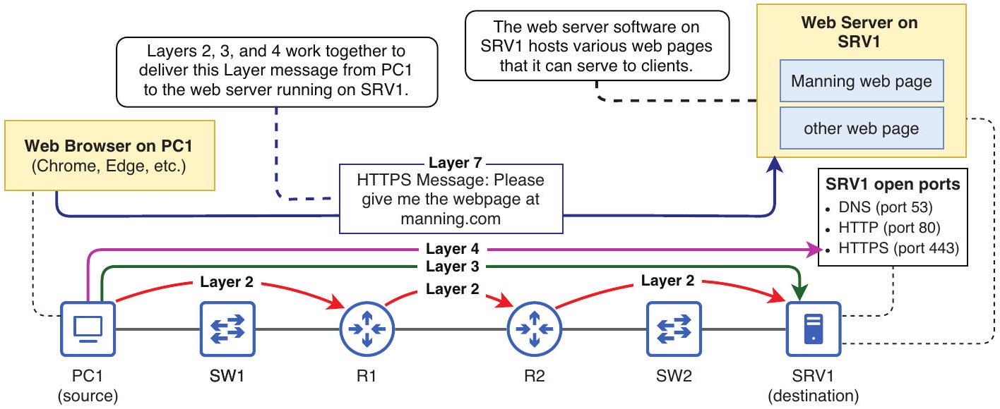
Figure 4.1 A web browser on PC1 uses a Layer 7 protocol (HTTPS) to request a web page from the web server on SRV1. Layers 2, 3, and 4 work together to deliver the message to the appropriate application on SRV1. Layer 1 is the medium over which the communication occurs.

The functions defined by each layer of the TCP/IP model include

- Physical specifications, such as cables and radio waves
- Communication between intermediate nodes in the path to the destination
- End-to-end communication from the original source node to the final destination node
- Addressing messages to a specific application on the destination node
- How an application should interface with the network

Now let's examine each layer of the TCP/IP model one by one to see how they enable network communications. The goal of this chapter is to provide a framework we can build upon in the rest of this book with details of how the different protocols of each layer fulfill their roles.

## Layer 1: The Physical Layer

The Physical Layer is fairly self-explanatory; it defines the physical requirements for transmitting data (a series of bits) from one node to another. Those bits could be
encoded as electrical signals traveling along a copper cable, light signals on a fiberoptic cable, or radio waves in a wireless connection.

We covered this in chapter 3: IEEE 802.3 (Ethernet) and IEEE 802.11 (Wi-Fi) both define specifications at the Physical Layer. For example, Ethernet defines connector and cable types, how data should be encoded into electrical (or light) signals, and countless other minutiae about how to communicate over UTP and fiber-optic cables. Likewise, Wi-Fi defines what radio frequencies should be used for wireless LAN communication, how radio waves should be modulated to encode data, etc.

To summarize, the Physical Layer of the TCP/IP model defines the physical requirements to enable a series of bits to travel from one node to another over a physical medium.

## Layer 2: The Data Link Layer

Ethernet and Wi-Fi do not only define physical specifications; they also specify how data should be addressed and sent to another node connected to the same physical medium within a LAN. The Data Link Layer's job is to prepare data for transmission over that physical medium so it can be received by the next node in the path to the final destination. That next node could be the final destination itself or the next router in the path. The journey from one node to the next in the path is called a hop, and the job of the Data Link Layer is to provide hop-to-hop delivery of messages.

Figure 4.2 demonstrates the concept of network hops. PC1 sends a message to SRV1, perhaps a request to access a file hosted on the server. For PC1's message to reach SRV1, it must make three hops through the network: from PC1 to R1, from R1 to R2, and from R2 to SRV1. The Data Link Layer's job is to forward the message from one hop to the next until the message reaches the destination host: SRV1. Notice that a message traveling through a switch does not count as a hop. We will examine why this is when we look at Ethernet LAN switching in chapter 6.

NOTE PC1, R1, R2, and SRV1 are examples of hostnames. A hostname is a name used to identify each device in the network. The hostname of each device in figure 4.2 follows the pattern I will use throughout this book: PC X for PCs, SWX for switches, $\mathrm{R} X$ for routers, and SRV $X$ for servers.


Figure 4.2 TCP/IP Layer 2. A message sent from PC1 to SRV1 takes three hops through the network: from PC1 to R1, from R1 to R2, and from R2 to SRV1. At each hop, the message is addressed to the next hop's MAC address. A message traveling through a switch does not count as a hop.

The Data Link Layer achieves this hop-to-hop delivery by using media access control (MAC) addresses, a kind of network address assigned to each port of a device. At each hop, the message is sent to the MAC address of the next hop. In the first hop, PC1 addresses the message to R1's MAC address. In the second hop, R1 addresses the message to R2's MAC address. In the final hop, R2 addresses the message to SRV1's MAC address.

NOTE The roles of SW1 and SW2 may seem unclear in figure 4.2. As covered in chapter 2, the role of a switch is to provide many ports for end hosts to connect to the LAN. For the sake of avoiding clutter, I only show one end host connected to each switch (PC1 to SW1 and SRV1 to SW2). However, in reality, there could be 40+ end hosts connected to each of them. In chapter 6, we will examine how switches function.

## Layer 3: The Network Layer

We just looked at how the Data Link Layer is used to forward a message from hop to hop until it reaches the final destination. At each hop, the message is sent to the MAC address of the next hop. However, we still need a way for the original source host to address the message to the final destination host. That is the role of the Network Layer: end-to-end delivery.

The type of address used at the Network Layer is the Internet Protocol (IP) address. Chances are you've heard of IP addresses before, although you might be unsure about how they work. We will cover IP addresses in chapter 7. Figure 4.3 shows how PC1 addresses a message to SRV1 by addressing it to SRV1's IP address. The destination IP address of the message remains the same throughout the journey, whereas the destination MAC address is different at each hop.

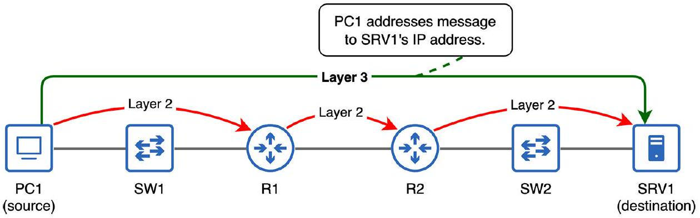
Figure 4.3 TCP/IP Layer 3. PC1 addresses a message to SRV1's IP address. Layer 3 is responsible for the end-to-end delivery of the message, whereas Layer 2 is responsible for the hop-to-hop delivery. The destination MAC address of the message changes at each hop, but the destination IP address remains the same throughout the journey.

## IPv4 and IPv6

There are two versions of IP in use today: IP version 4 (IPv4) and IP version 6 (IPv6). Network engineers must be familiar with both, and both are part of the CCNA exam. IPv4 and IPv6 use different address formats. The following is an example of an IPv4 address and an IPv6 address:

- IPv4 address: 203.0.113.255
- IPv6 address: 2001:db8:1:1:2fe3:1:32a:af01

Although IPv4 has been the dominant version of IP for a long time, IPv6 is steadily gaining popularity. In recent years, IPv6's adoption has accelerated as the number of available IPv4 addresses is running out. We will cover both address types in this book.

Understanding how Layers 2 and 3 work together to deliver a message to its destination is a fundamental concept you must understand for the CCNA exam. In this chapter, I provide a high-level overview of the concepts; we will review these concepts and dig deeper in later chapters of this volume. At this point, it is enough to know the following points:

- Layer 2 uses MAC addresses to provide hop-to-hop delivery of messages.
- Layer 3 uses IP addresses to provide end-to-end delivery of messages.
- Layers 2 and 3 work together to allow a message to travel through the network to its final destination.
- The destination IP address of a message remains the same throughout the journey, whereas the destination MAC address is different at each hop.

## Layer 4: The Transport Layer

Layers 2 and 3 work together to deliver a message from the source host across a network to the destination host. You might think that's the end of the story because the message has reached its destination, but it's actually not all the way there. It's not enough for the data to reach the correct destination host; we need a way to address data to a specific application process on the destination host (e.g., a service running on a server). That is the role of Layer 4, the Transport Layer.

Like Layers 2 and 3, Layer 4 also uses its own addressing scheme: port numbers. By addressing a message to a particular port, you can send messages to a particular application process on the destination host. Computers run many different applications simultaneously, so this is a very important function. For example, a PC can simultaneously run an online game, a web browser with various tabs that each access a different website, an antivirus application that communicates with an external server for updates, and countless other applications. Port numbers allow the PC to ensure that data it receives from the network reaches the proper destination process.

NOTE Layer 4 port numbers are not related to the physical ports on a device that we connect cables to (which are an aspect of Layer 1, the Physical Layer). Same name, different concept.

Figure 4.4 demonstrates this concept. Layers 2 and 3 work together to deliver PC1's message to SRV1, and Layer 4 delivers the message to the appropriate application process on SRV1. SRV1 is a server that provides a few services to clients in the network. It is a name server using the Domain Name System (DNS) to convert website names to IP addresses for clients (that's what happens when you type manning.com into a web browser). It is also a web server that uses Hypertext Transfer Protocol (HTTP) and Hypertext Transfer Protocol Secure (HTTPS) to allow clients to access the websites it hosts. DNS, HTTP, and HTTPS are Layer 7 (Application Layer) protocols, and they each accept messages using a different Layer 4 port number.

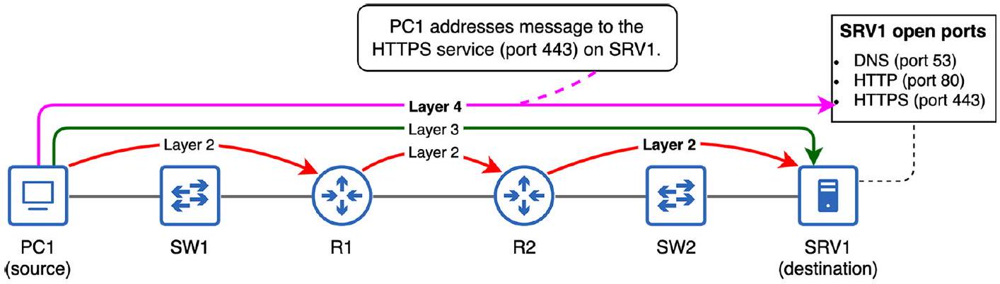
Figure 4.4 Layers 2 and 3 work together to deliver PC1's message to SRV1. At Layer 4, PC1 addresses the message to port 443, which is used by the HTTPS protocol. Three ports are open on SRV1 (53, 80, 443), meaning it will accept messages addressed to any of those ports.

NOTE All three addresses-the MAC address (Layer 2), the IP address (Layer 3), and the port number (Layer 4)-are included in the same message. We will examine how this works in section 4.3.2.

## TCP and UDP

The two most common Layer 4 protocols are Transmission Control Protocol (TCP)-the "TCP" in TCP/IP-and User Datagram Protocol (UDP). Both protocols allow computers to address messages to specific application services on the destination host, but there are several differences between the two.

For example, TCP implements checks to ensure that each message reaches its destination and is used by Application Layer protocols such as HTTP and HTTPS (used for accessing websites). UDP, on the other hand, takes a "send it and forget it" approach; it doesn't check to ensure that every message reaches the destination. UDP is used by Voice over IP (VoIP) protocols-used for phone calls-and live video streaming protocols, among others. We will cover TCP and UDP in chapter 22 of this book.

## Layer 7: The Application Layer

The Application Layer is the interface between the applications running on a computer and the network. Using Layer 7 protocols, an application running on a computer can prepare a message to be sent over the network. This message could be, for example, a request from a web browser to retrieve a web page that is hosted on a web server. Layers 2, 3, and 4 are then responsible for delivering that message to the appropriate application on the destination computer.

NOTE Although the TCP/IP model only has five layers (or four, in the original definition), Layer 7 is the most common term used for the Application Layer, so that is what I will use throughout this book. That is due to the influence of the OSI model, as mentioned previously.

Layer 7 protocols such as HTTPS are not user applications themselves; rather, they provide services for those applications to enable them to communicate with applications on other computers over the network. Figure 4.1 shows the complete process that enables a web browser on PC1 to send a message to request a web page from the web server running on SRV1. The process that the message goes through to reach SRV1 is as follows:

- Layer 7-PC1's web browser uses HTTPS to request the web page.
- Layer 4-PC1 addresses the message to port 443, which is used by the HTTPS protocol. This ensures that the message reaches the correct application on SRV1.
- Layer 3-PC1 addresses the message to the IP address of SRV1, and the destination IP address of the message remains the same as the message travels from PC1 across the network to SRV1.
- Layer 2-PC1 addresses the message to the next hop in the path to SRV1, which is R1. After receiving the message, R1 forwards it to the next hop (R2) by addressing the message to R2's MAC address. Finally, R2 forwards the message to the final destination (SRV1) by addressing the message to SRV1's MAC address. Unlike the destination IP address of the message, the destination MAC address is changed at each hop.

DEFINITION To forward a message is to send it to the next node in the path to the destination, whether that is the final destination node itself or the next router in the path to the destination. In later chapters of this volume, we will examine how routers and switches make forwarding decisions to deliver messages to the correct destination.

### 4.3.2 Data encapsulation and de-encapsulation

In this section, we'll see how the layers of the TCP/IP model work together to allow computers to communicate with each other. By now, you should be familiar with the basic purpose of each layer of the TCP/IP model:

- Layer 7 (Application)-The interface between applications and the network
- Layer 4 (Transport)-Provides application-to-application delivery of messages
- Layer 3 (Network)-Provides end-to-end delivery of messages
- Layer 2 (Data Link)-Provides hop-to-hop delivery of messages
- Layer 1 (Physical)-The physical medium over which communication happens

## Data encapsulation

The process a host goes through to send data is a five-step process. It begins with the Layer 7 protocol preparing some data to be sent. In the second step, a Layer 4 protocol then adds a header to that data addressed to a certain port.

DEFINITION A header is supplemental data added to the front of a message that is to be transmitted over a network. A protocol's header contains the data used by that protocol. For example, a Layer 4 protocol will include a destination port number, as well as other information.

In the third step, the message is passed to Layer 3, which adds its own header to that data. This header will be addressed to the IP address of the destination host. In the fourth step, the message will then be passed to Layer 2, which adds both a header and a trailer.

DEFINITION A trailer is also supplemental data added to a message that is to be transmitted over a network. Whereas a header is added to the beginning of a message, a trailer is added to the end. The Ethernet trailer contains a small block of data used to check for errors in the message. For example, errors can occur during transmission as a result of electromagnetic interference.

At Layer 2, the message is addressed to the next-hop device. Finally, in the fifth step, the host will transmit the bits over the physical medium, such as a UTP cable. The process of adding headers (and trailers) to data before sending it over a network is called encapsulation. To summarize that process:

1 The Application Layer protocol prepares data.
2 Layer 4 encapsulates the data with a header addressed to a port number on the destination host.
3 Layer 3 encapsulates the data with a header addressed to the IP address of the destination host.

4 Layer 2 encapsulates the data with a header addressed to the MAC address of the next hop. It also encapsulates the data with a trailer, used to check for errors.
${ }^{5}$ The host transmits the bits of data over the physical medium (e.g., encoded as electrical signals over a UTP cable).

Figure 4.5 demonstrates the five-step process of encapsulation and transmission.


Figure 4.5 The five-step process of encapsulating and transmitting data: (1) the Application Layer protocol prepares some data, (2) Layer 4 encapsulates the data with a header, (3) Layer 3 encapsulates the data with a header, (4) Layer 2 encapsulates the data with a header and trailer, and (5) the host transmits the bits over the physical medium (i.e., a UTP cable).

NOTE The Layer 2 header is the beginning of the message; it is the first part sent. The Layer 2 trailer is the end of the message; it is the last part sent.

## Data de-encapsulation

When the destination host receives the message, it goes through the opposite process: de-encapsulation. In the de-encapsulation process, the host receiving the message inspects the information in each header/trailer and then removes them until it gets to the data inside. Like encapsulating and transmitting a message, receiving and de-encapsulating a message can also be summarized into five steps, summarized as follows (also see figure 4.6):

1 The destination host receives the message.
2 It inspects the Layer 2 header and trailer, removes them, and passes the message to Layer 3.
3 It inspects the Layer 3 header, removes it, and passes the message to Layer 4.
4 It inspects the Layer 4 header, removes it, and sends the data to the appropriate application.
5 The application receives and processes the data.


Figure 4.6 The five-step process of receiving and de-encapsulating data: (1) the destination host receives bits (the message), (2) the Layer 2 header/trailer is inspected and removed, (3) the Layer 3 header is inspected and removed, (4) the Layer 4 header is inspected and removed, and (5) the data is received and processed by the application.

Protocol data units
At each stage in the encapsulation/de-encapsulation process, there is a name given to the message:

- The combination of data and a Layer 4 header is called a segment.
- The combination of a segment and a Layer 3 header is called a packet.
- The combination of a packet and a Layer 2 header/trailer is called a frame.

We can also use an alternative term to describe the message at each stage-protocol data unit (PDU):

- A segment is a Layer 4 PDU (L4PDU).
- A packet is a Layer 3 PDU (L3PDU).
- A frame is a Layer 2 PDU (L2PDU).

The contents of each PDU (everything encapsulated by that layer's header/trailer) are called the payload. So, a frame's payload is a packet, a packet's payload is a segment, and a segment's payload is the application data. Figure 4.7 illustrates the different PDUs and their payloads.


Figure 4.7 Application data encapsulated in a Layer 4 header is a segment (L4PDU); a segment encapsulated in a Layer 3 header is a packet (L3PDU); and a packet encapsulated in a Layer 2 header/ trailer is a frame (L2PDU). The encapsulated contents of each PDU are that PDU's payload.

Adjacent-layer and same-layer interactions
Within a computer, each layer of the TCP/IP model provides a service for the layer above it, called adjacent-layer interaction. Following is a summary of the interactions between adjacent layers of the TCP/IP model:

- Layer 4 provides a service to Layer 7 by delivering data to the appropriate application on the destination host.
- Layer 3 provides a service to Layer 4 by delivering segments to the correct destination host.
- Layer 2 provides a service to Layer 3 by delivering packets to the next hop.
- Layer 1 provides a service to Layer 2 by providing a physical medium for frames to travel over.

There is also a related concept called same-layer interaction. This refers to the communications between the same layer on different computers. Same-layer interactions work like this:

- Application data from one computer is sent to an application on another computer.
- When data is encapsulated with a Layer 4 header, the segment is addressed to Layer 4 of the destination host, where the information in the header will be inspected.
- When a segment is encapsulated with a Layer 3 header, the packet is addressed to Layer 3 of the destination host, where the information in the header will be inspected.

- When a packet is encapsulated with a Layer 2 header and trailer, the frame is addressed to Layer 2 of the next hop, where the information in the header and trailer will be inspected.
- Signals sent out of a physical port of one device are received by a physical port of another device.

Figure 4.8 illustrates these adjacent-layer interactions between different layers on the same computer (on Host A and on Host B), and same-layer interactions between different computers that are communicating with each other (between Host A and Host B).


Figure 4.8 Each layer on a host provides services for the layer above it; this is called adjacent-layer interaction. When two hosts communicate, each layer on one host communicates with the same layer on the other host; this is called same-layer interaction.

## Summary

- Networking models provide frameworks to define the functions necessary to enable network communications.
- Networking models are divided into layers; each layer describes a necessary function for network communications and includes multiple protocols that can fulfill the layer's role.
- The Open Systems Interconnection Reference (OSI) model is a networking model that influenced how we think and talk about networks but is not in use today.
- The OSI model has seven layers: (1) Physical, (2) Data Link, (3) Network, (4) Transport, (5) Session, (6) Presentation, and (7) Application.
- The Internet Protocol Suite (TCP/IP) model) is the networking model used in modern networks and is named after two of its key protocols: Transmission Control Protocol (TCP) and Internet Protocol (IP).
- The original TCP/IP model has four layers, but a more popular version has five: (1) Physical, (2) Data Link, (3) Network, (4) Transport, and (5) Application (called Layer 7, not Layer 5).

- Layer 1 (Physical) defines physical requirements for transmitting data, such as ports, connectors, and cables, and how data should be encoded into electrical/ light signals.
- Layer 2 (Data Link) is responsible for hop-to-hop delivery of messages. A hop is the journey from one node in the network to the next in the path to the final destination.
- Layer 2 uses media access control (MAC) addresses to address messages to the next hop.
- Layer 3 (Network) is responsible for end-to-end delivery of messages, from the source host to the destination host.
- Layer 3 uses Internet Protocol (IP) addresses to address messages to the destination host.
- The destination MAC address of a message changes at each hop in the path to the destination, but the destination IP address remains the same.
- Layer 4 (Transport) is used to address messages to the appropriate application on the destination host.
- Layer 4's addressing scheme uses port numbers (not related to physical ports). The port number identifies the Layer 7 protocol being used.
- Layer 7 (Application) is the interface between applications and the network. Layer 7 protocols such as Hypertext Transfer Protocol Secure (HTTPS) are not applications themselves but provide services for applications to enable them to communicate over the network.
- A host encapsulates application data with a Layer 4 header, Layer 3 header, and Layer 2 header/trailer before being transmitted over the physical medium (cable or radio waves).
- After a message is received by a host, the host de-encapsulates it by inspecting and removing the Layer 2 header and trailer, inspecting and removing the Layer 3 header, inspecting and removing the Layer 4 header, and finally processing the data in the message.
- The contents encapsulated inside each protocol data unit (PDU) are its payload.
- The combination of data and a Layer 4 header is called a segment (L4PDU).
- The combination of a segment and a Layer 3 header is called a packet (L3PDU).
- The combination of a packet and a Layer 2 header/trailer is called a frame (L2PDU).
- Within a computer, each layer provides a service for the layer above it; this is called adjacent-layer interaction.
- Communication between the same layer on different computers is called samelayer interaction.

## The Cisco IOS CLI

## This chapter covers

- The interfaces used to configure network devices
- How to connect to the CLI of a Cisco device via the console port
- Navigating between modes of the Cisco IOS command hierarchy
- Viewing and saving a device's configuration files
- Password-protecting a Cisco IOS device

This chapter is a break from the networking theory of the previous chapter; it's time to get hands-on with Cisco routers and switches. Understanding the theory of networking is absolutely essential, but networking is also a skill that must be practiced, and that means configuring network devices.

In the CCNA exam topics list, you will find a few different verbs, such as explain $X$, describe $Y$, and identify $Z$, indicating that Cisco expects you to have a theoretical understanding of the listed concepts and how they work. However, there are also many exam topics that state configure X or configure and verify Y. For these topics, in addition to having a theoretical understanding of their concepts, you must be able to configure them on Cisco network devices and verify their operations.

As an introduction to making configuration changes to a Cisco device and saving those changes, in this chapter, we will touch on exam topic 5.3: Configure and verify device access control using local passwords. However, this chapter is not specifically aimed at one of the CCNA exam topics but rather lays a necessary foundation for all of the exam topics that require you to configure and verify various protocols.

### 5.1 Shells: GUI and CLI

A shell is a computer program that allows a user to interact with the computer. It's the interface between the computer and the user, and it's called a shell because it's the outer layer of the operating system. To configure a Cisco router or switch, you use a shell to give commands to the device. In this section, we will look at the two types of shells we will use in this book.

### 5.1.1 GUI and CLI

There are two main kinds of shells: graphical user interface (GUI, pronounced "G-U-I" or "gooey") and command-line interface (CLI). Let's examine these two types.

Graphical user interfaces
A GUI allows a user to manipulate the computer via a graphical interface. Regardless of your degree of experience or inexperience with computers, I'm certain you've used a GUI before. If you have a Windows PC, the GUI is what you're interacting with when you open, close, and move windows, or when you open the Start menu to search for a program, etc. This is the Windows shell. If you have a smartphone, you use a GUI to interact with the phone and its apps.

Although most of the CCNA exam does not focus on GUIs, you are expected to be familiar with one GUI for the exam: the Cisco wireless LAN controller (WLC) GUI. We will cover wireless LANs and how to configure a WLC via the GUI in part 4 of volume 2 of this book. Figure 5.1 shows a screenshot of the GUI of a Cisco WLC.

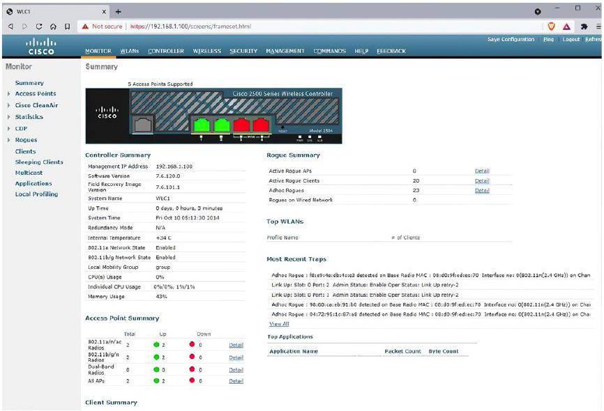
Figure 5.1 The GUI of a Cisco wireless LAN controller, accessed via a web browser

## Command-line interfaces

A CLI is a text-based interface that allows you to control and interact with a device by entering commands, which are lines of text. A famous CLI you might have seen before is the Windows Command Prompt, as pictured in figure 5.2. Although the vast majority of users use the GUI exclusively (or almost exclusively), the Command Prompt CLI provides an alternative way to interact with the PC.


Figure 5.2 The Command Prompt CLI of a Windows PC, accessed from within the Windows shell GUI

For the CCNA exam, you must be familiar with the CLI of Cisco routers and switches running Cisco IOS. For those with no prior experience with a CLI (such as myself when I started my CCNA studies in 2018), this can seem intimidating. However, by the end of this chapter, I hope you will see that navigating around the Cisco IOS CLI isn't so complicated.

EXAM TIP Throughout the two volumes of this book, I will introduce various CLI commands to configure the protocols you must know for the CCNA exam. Hands-on practice with these commands-for example, using Cisco Packet Tracer-is an essential part of preparing for the CCNA exam.

### 5.1.2 Accessing the CLI of a Cisco device

To configure Cisco devices, you first have to connect your computer to the device to access the CLI. There are two main methods to do so:

- Connect a PC/laptop to the console port of the device with a console cable.
- Connect to the device over the network using a protocol like Telnet or Secure Shell (SSH).

We will cover Telnet and SSH in chapter 5, volume 2. Until then, we will focus on connections via the console port of the device. The console port is a physical port that
allows you to connect a computer directly to the device (as opposed to connecting via the network infrastructure). In order to do so, you must be physically near the device; a console cable is typically only a few feet in length.

NOTE Console ports cannot be used to communicate over the network. They are dedicated to configuring the device via the CLI.

Figure 5.3 shows two console ports on a Cisco switch: USB Mini-B and RJ45. The exact type of console ports available depends on the model of the device, but USB Mini-B and RJ45 are common across many different Cisco router and switch models. You can connect to either port but not both; only one console connection is supported at a time.


Figure 5.3 Two console ports on a Cisco switch: USB Mini-B (left) and RJ45 (right)

Console cables come in a variety of types with a variety of different connectors. The type used depends on the ports available on the device itself-the PC connecting to it. Perhaps the simplest option is to use a standard USB cable to connect your PC to the device's USB console port (make sure the cable has the correct USB connector types for your PC and the device you want to connect to).

To connect to the RJ45 console port, you must use a rollover cable. This is a different pattern than the straight-through and crossover cables we covered in chapter 3; rollover cables are wired as follows:

- Pin 1 to pin 8
- Pin 2 to pin 7
- Pin 3 to pin 6
- Pin 4 to pin 5
- Pin 5 to pin 4
- Pin 6 to pin 3
- Pin 7 to pin 2
- Pin 8 to pin 1

The wiring of a rollover cable is illustrated in figure 5.4.


Figure 5.4 The wiring of a rollover cable, used to connect a PC to the RJ45 console port of a network device. Pin 1 on one end connects to pin 8 on the other end, pin 2 to pin 7, pin 3 to pin 6, pin 4 to pin 5, pin 5 to pin 4, pin 6 to pin 3, pin 7 to pin 2, pin 8 to pin 1.

After physically connecting your PC to the device's console port, you then need to use a type of application called a terminal emulator to access the CLI. A terminal emulator is a software application that replicates the functions of a computer terminal-an old hardware device consisting of a monitor and keyboard that was used to input data into (and receive and display data from) a computer. A popular (and free) terminal emulator on Windows is PuTTY (www.putty.org), but there are many options available for a variety of platforms.

When using a terminal emulator to connect from a PC to a device's console port, there are a few settings you will have to configure. Those are

- Speed-The rate at which data is sent
- Data bits-The number of bits of information used for each character of text sent to the device
- Stop bits-Sent after every character to allow the receiving device to detect the end of the character
- Parity-An extra bit sent with each character to be used for error detection
- Flow control-Provides support for circumstances where a device sends data faster than the receiver can handle

The appropriate value for each setting depends on the device you are configuring; to learn the appropriate settings for a particular device, you will have to check the manufacturer's documentation for that device. Figure 5.5 shows how to initiate a console connection to a Cisco device in PuTTY.

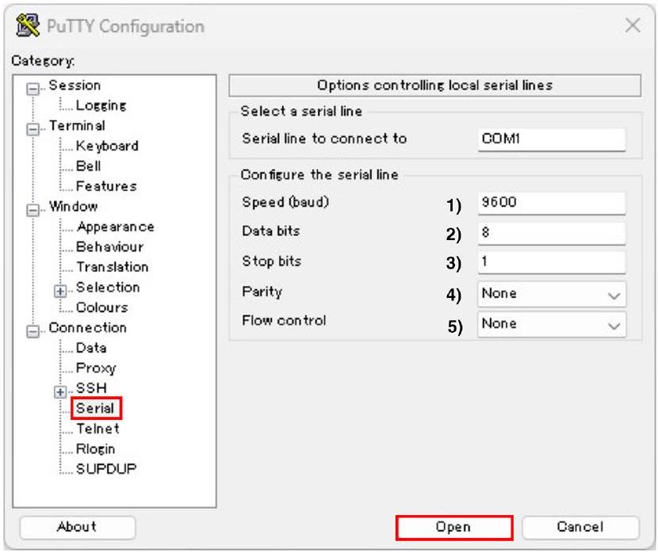
Figure 5.5 How to use PuTTY to access a Cisco device's CLI via the console port. From the Serial tab, configure the following settings, and then click Open: (1) Speed (baud): 9600 bits per second, (2) Data bits: 8, (3) Stop bits: 1, (4) Parity: None, (5) Flow control: None.

NOTE You won't be tested on how to use PuTTY or another terminal emulator to connect to a device's console port in the CCNA exam, but I am including this information just in case you have physical hardware to practice on. To get hands-on lab practice for the CCNA, I recommend Cisco Packet Tracer, in which you can simply click on a device's icon to access the CLI.

### 5.2 Navigating the Cisco IOS CLI

Now we will finally get hands-on in the Cisco IOS CLI, navigating through different modes and giving commands to a Cisco device. I want to emphasize once again that networking is not just theory but also a practical skill. It will be difficult to absorb this information without putting it into practice yourself, so I highly recommend following along in Packet Tracer (or the CLI of a real Cisco router or switch) as you read and trying out the different commands and shortcuts we cover.

When you first access the CLI of a new Cisco device, you are given the option to configure the device using the system configuration dialog, as shown in the following example:

```
--- System Configuration Dialog ---
Would you like to enter the initial configuration dialog? [yes/no]: no
```

NOTE In the CLI output shown in this book, bold text indicates commands typed by the user. Normal text indicates the output shown by the device.

The system configuration dialog is a step-by-step configuration wizard that allows you to do a simple setup of the device without having to know Cisco IOS CLI commands. This feature is typically not used, and it's not something you need to know for the CCNA, so I recommend skipping it by typing no and pressing the Enter key (the options [yes/ no] are shown in square brackets).

### 5.2.1 The EXEC modes

After skipping the system configuration dialog, you are shown a prompt like the following, where you can type commands and press Enter to send them to the device. The format of the prompt is the hostname (in this case, Router, the default hostname of Cisco routers) followed by a greater-than sign. This indicates that you are in user EXEC mode:

```
The hostname followed by a greater-than
sign indicates user EXEC mode.
```

NOTE All of the commands we cover in this chapter apply to both Cisco routers and switches. They both run the same operating system: Cisco IOS.

User EXEC mode is the least-privileged mode in the Cisco IOS command hierarchy; it allows you to enter some basic commands to view information about the device's configuration and status. However, it does not allow you to do anything intrusive like make any changes to the device's configuration, restart the device, etc. To demonstrate a simple command that you can use in user EXEC mode, I type show clock and press Enter. The router then displays the current time of its clock:

```
Router> show clock
*02:21:03.832 UTC Fri Feb 10 2023
```

Views the time of the device's clock

EXAM TIP There are a variety of show commands that you will become familiar with throughout this book. Learning the available show commands and how to interpret their output is a major part of studying for the CCNA.

Checking the time is clearly not intrusive, so the show clock command is available in user EXEC mode. However, a more intrusive command like reload, which restarts the device, does not work in user EXEC mode, as shown in the following example. The router displays an error message instead (a percent sign indicates a message from IOS):

```
Router> reload
% Unknown command or computer name, or unable to find computer address
```

To access more powerful commands, you must enter the next mode in the IOS command hierarchy: privileged EXEC mode. To access privileged EXEC mode, use the enable command. From privileged EXEC mode, the reload command now works:
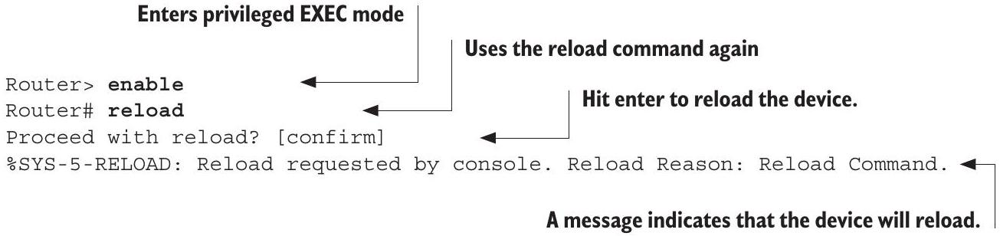

NOTE The greater-than sign (>) in the prompt changes to a hash (\#) when in privileged EXEC mode.

Privileged EXEC mode gives unlimited access to the available show commands as well as many other commands to control various features of the device. To return to user EXEC mode from privileged EXEC mode, you can use the disable command. However, disable is rarely used because there are no commands in user EXEC mode that you can't use in privileged EXEC mode; there's rarely a need to return to user EXEC mode.

Although privileged EXEC mode is more powerful than user EXEC mode, both modes are limited in that they do not allow you to make changes to the device's configuration. The EXEC modes only allow you to view the device's status and configuration, as well as execute operational commands to perform actions like restart the device, save the configuration, move and delete files, etc.

### 5.2.2 Global configuration mode

To make changes to the configuration of the device, we must leave the EXEC modes and proceed to the next mode in the IOS command hierarchy: global configuration mode. To do so, use the configure terminal command from privileged EXEC mode:
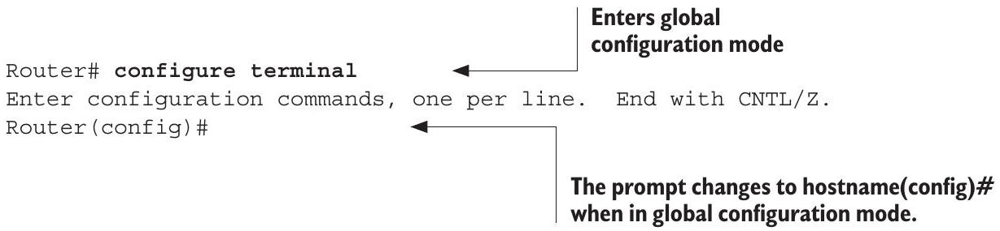
Although there are only two EXEC modes in the Cisco CLI (user EXEC mode and privileged EXEC mode), there are several configuration modes that we will examine throughout this book. In this chapter, we will only look at the first one: global configuration mode. From global configuration mode, you can configure various features like the
device's hostname and passwords. From this mode, you can also access the other configuration modes that we will look at in later chapters of this book's two volumes.

One configuration that you can make from global configuration mode is to change the hostname of the device with the hostname command, as shown in the following example. Notice that after executing the command, the prompt changes from Router to R1, indicating that the hostname has changed. The command takes effect immediately. Configuring a unique hostname on each device in the network is essential to make them easy to identify. For the purpose of this book, we will use simple numerical identifiers (R1, R2, etc.). In a real enterprise network, other information, such as the device's location, is often included in the hostname (i.e., Office1_R1):
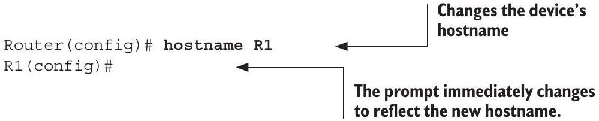

NOTE If you want to undo a configuration command, you can use no in front of the command. For example, after the hostname R1 command, no hostname R1 would remove the command and revert the device's hostname to the default of Router.

To return from global configuration mode to privileged EXEC mode, there are a few options. The end command, the Ctrl-C keyboard shortcut, and the Ctrl-Z keyboard shortcut will return you to privileged EXEC mode from global configuration mode or any other configuration mode. The exit command will return you to privileged EXEC mode from global configuration mode. However, if you're in another configuration mode, it will return you to global configuration mode. Figure 5.6 shows how to navigate between user EXEC mode, privileged EXEC mode, and global configuration mode.

NOTE If you use the Ctrl-Z shortcut in the middle of typing a command, the device will execute the typed command before returning to privileged EXEC mode; it's equivalent to pressing Enter and then issuing end. Be careful! Ctrl-C does not do this; it will just return you to privileged EXEC mode.

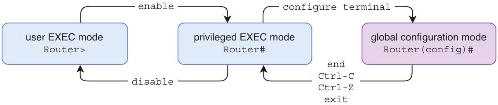
Figure 5.6 How to navigate between user EXEC mode, privileged EXEC mode, and global configuration mode in the Cisco IOS command hierarchy

Configuration modes such as global configuration mode allow you to configure the device, but EXEC mode commands like show do not work. However, the do command allows you to use EXEC mode commands from a configuration mode, so you don't have to return to privileged EXEC mode. This can speed up your workflow when you are configuring a device but also want to use show commands to check its status. The following example demonstrates this; the show clock command results in an error message, but the do show clock command displays the time of the device's clock:

```
R1(config)# show clock
        ^
```

Show commands don't work

```
% Invalid input detected at '^' marker.
```

in global configuration mode.

```
R1(config)# do show clock
*03:06:22.892 UTC Fri Feb 10 2023
```


### 5.2.3 Keyboard shortcuts

There are several keyboard shortcuts that can help you more smoothly navigate through the CLI and enter commands. We covered two in the previous section; Ctrl-C and Ctrl-Z can be used to return to privileged EXEC mode from any configuration mode. There are many others, and we will look at a few of them next.

When typing commands in the CLI, there is a cursor indicating where the next character will be inserted when typed. By default, this will be after the previous character, as you would probably expect. You can also move the cursor, for example, to fix an error in a previously typed word. The following are some keyboard shortcuts that can be used to move the cursor and edit the current command you are typing:

- Left arrow-Moves the cursor left
- Right arrow-Moves the cursor right
- Backspace-Moves the cursor left and deletes the previous character
- Ctrl-A-Moves the cursor to the beginning of the command you are typing
- Ctrl-E-Moves the cursor to the end of the command you are typing
- Ctrl-U-Deletes all characters to the left of the cursor

You can also use the keyboard to view previously executed commands, which Cisco IOS stores in a memory buffer. This is useful if you made a mistake in a previous command and want to correct it without typing out the entire command again; you can return to the previous command, fix the error, and then execute the command again. You can use the following shortcuts to scroll through the buffer:

- Up arrow-Previous command
- Down arrow-Next command

### 5.2.4 Context-sensitive help

You will have to learn many different commands to prepare for the CCNA, and those commands are only a fraction of all of the available commands in Cisco IOS. For the purpose of the CCNA exam, it is important to practice and become familiar with the various commands we will look at in this book. However, Cisco IOS has a feature called context-sensitive help that can help you if you have forgotten a command.

Viewing the available commands
A question mark (?) can be used for help in the Cisco IOS CLI in a few ways:

- To list the available commands in the current EXEC or configuration mode
- To list the keywords available for a command
- To list the possible completions of a partially typed command or keyword

In the first use case, the question mark is used to list the commands available in the current mode of the CLI hierarchy, along with a brief description of each command. Note that you don't have to press Enter; the list of commands is shown immediately after typing the question mark. The first few commands available in user EXEC mode are as follows:
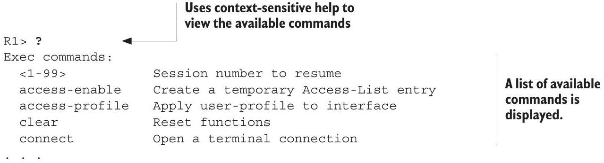

Few Cisco IOS commands are a single word; most commands include one or more keywords, which are further parameters typed after the initial command. The show command we looked at previously is an example of this; show on its own is not a valid command, but show clock is. In the second use case of the question mark, you can use it after a command to view the available keywords. The following example demonstrates this:

```
            show is not a valid command on its own.
R1> show
% Type "show ?" for a list of subcommands
R1> show ?
    aaa Show AAA values
    arp ARP table
    auto Show Automation Template
    call-home Show command for call home
    capability Capability Information
. . .
```

You can also use the question mark in this manner after a keyword to display any further keywords. For example, show clock ? lists the keyword detail, which can be used to view more information about the device's clock. This is shown in the following example:

```
R1> show clock ?
    detail Display detailed information
    | Output modifiers
    <cr> <cr>
```

Views the available options after show clock

The other two options displayed are also worth mentioning:

- The pipe (|) can be used to filter the output of a show command. I will show an example of this later in this chapter.
- "cr"means carriage return, which refers to the Enter key. This means that you can simply press Enter to execute the command. Although a keyword (detail) is available, show clock on its own is a valid command.

The third use case for the question mark is to display the possible completions of a partially typed command or keyword. In this case, the question mark should be typed immediately after the partially typed command, without a space. For example, typing e? in user EXEC mode will list multiple commands that begin with e. Typing en?, on the other hand, will show that enable is the only command that begins with en, as shown in the following example:

```
R1> e?
```

In user EXEC mode, three

```
enable ethernet exit
```

commands begin with e.

```
R1> en?
enable
```


## Auto-completing commands

Typing various commands can be tedious when manually configuring a device. Fortunately, Cisco IOS does not require you to type full commands; it only requires you to type enough characters so that there is only one possible command that begins with those characters.

If you type enough characters so that there is only one possible command beginning with those characters and then press the Tab key, IOS will automatically complete the command for you. For example, typing en and then pressing Tab will automatically complete the command to enable. Then you can simply press Enter to execute the command. However, if you don't type enough characters and there are multiple possible commands beginning with the character(s) you have typed, the command won't work; it will simply print the character(s) again on a new line. This is shown in the following example. Note that "Tab" indicates where I pressed the Tab key:
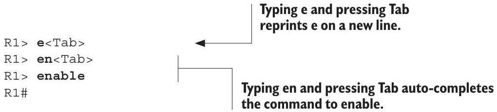

But wait, there's more: you don't even have to use Tab to complete the command. Using the previous example of the enable command, if you type e and then press Enter to execute the command, the terminal will display an error message stating that e is an ambiguous command. That is because there are multiple possible commands beginning with e. However, if you type en and press Enter, the command is accepted as enable, and you are brought to privileged EXEC mode:
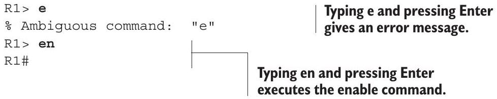

NOTE Auto-completion with Tab and executing partial commands both apply to a command's keywords too. For example, conf t can be used instead of configure terminal to enter global configuration mode.

Table 5.1 summarizes these context-sensitive help features. Spend some time experimenting with them in the CLI; once you get used to them, you will probably find yourself using them quite often as you practice configuring and verifying the various IOS features you need to know for the CCNA.

Table 5.1 Cisco IOS context-sensitive help features
| Command | Description |
| :--- | :--- |
| ? | Lists the available commands in the current mode |
| command ? | Lists the available keywords for the command |
| partial-command ? | Lists the possible commands beginning with the currently typed characters |
| partial-command"Tab" | Automatically completes the command if there is only one option beginning with the currently typed characters |
| partial-command"Enter" | Executes the command if there is only one option beginning with the currently typed characters |


### 5.3 IOS configuration files

Cisco IOS devices make use of two different text files that store the device's configurations: running-config and startup-config. The two files are each stored in different hardware memory and serve different purposes. You can view each configuration file with the show running-config and show startup-config commands.

NOTE The output of show running-config and show startup-config can be quite long. When the output of a command is beyond a certain length, only partial output will be shown with a prompt that says --More-- at the bottom. Use the Enter key to scroll through the output one line at a time or the spacebar to scroll through the output one screen at a time.

The configurations in the running-config file determine the current operations of the device. When you enter a configuration command in the CLI, you are modifying the running-config file. Changes take effect instantly; as shown previously, after the hostname command is executed, the hostname of the device changes immediately.

The running config file is stored in random-access memory (RAM). It is important to note that the contents of RAM are lost when the device is powered off or restarted; therefore, changes to running-config are lost in either event. To save configuration changes so they persist even if the device is powered off or restarted, the startup-config file is used.

The configurations in startup-config do not determine the current operations of the device. Rather, the startup-config is the configuration file that is loaded by the device when it boots up-for example, after being powered on or restarted. The contents of the startup-config file are copied to the running-config file in RAM when the device boots up.

The startup-config file is stored in a special type of RAM called nonvolatile RAM (NVRAM). The contents of NVRAM are kept even when the device is powered off or restarted, so to save changes made to the running-config file, the contents must be copied to startup-config. Otherwise, the device will have a factory-default configuration every time it boots up.

DEFINITION Factory-default refers to the original state of the device as it is sent from the factory, before any configuration changes are made.

There are a few different commands (entered in privileged EXEC mode) that can be used to copy the contents of the running-config file to the startup-config file. The effect of each of these commands is the same, so it doesn't matter which one you use:

- write
- write memory
- copy running-config startup-config

NOTE A new device that has booted up for the first time won't even have a startup-config file until you use one of these commands. If no startup-config file is present, the device uses the factory-default configuration.

If you want to return a device to its factory-default configuration, you can erase startupconfig and then restart the device with the reload command. Just as with saving the configuration, there are a few different commands you can use to delete startup-config:

- write erase
- erase nvram:
- erase startup-config

### 5.4 Password-protecting privileged EXEC mode

Privileged EXEC mode not only allows a user to execute any of the available show commands to gather information about the device's configuration and status, but it also allows the user to access global configuration mode and make configuration changes to the device. Because of this, it's always a good idea to configure a password to prevent unauthorized users from accessing privileged EXEC mode. In this section, we will look at the enable password and its more secure version, the enable secret.

### 5.4.1 Configuring the enable password

The enable password is a password that you must enter to access privileged EXEC mode. It's also the name of the command used to configure the password; you configure it with the enable password command in global configuration mode. After you configure the enable password, any time a user uses the enable command in user EXEC mode, the user will have to enter that password to access privileged EXEC mode.

NOTE The enable password is case-sensitive: cisco and Cisco are two different passwords.

In the following example, I configure an enable password of ccna, use exit to return to privileged EXEC mode, and use disable to return to user EXEC mode. When I then use enable to return to privileged EXEC mode again, I have to enter the configured enable password of ccna to gain access. Note that, for security purposes, passwords are not displayed as you type them in Cisco IOS:
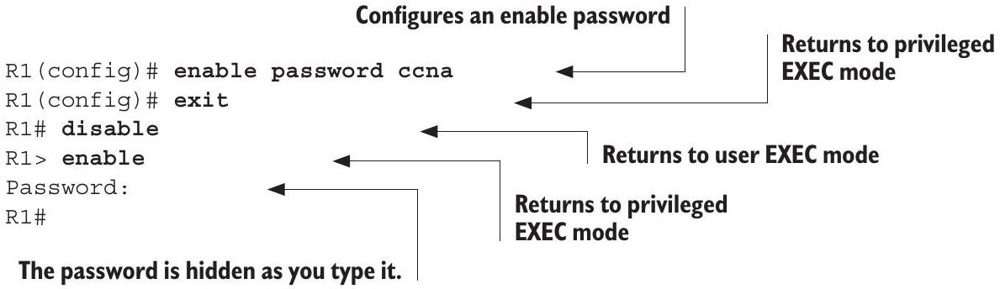

There is a major problem with the enable password: it is stored in cleartext, meaning the exact password (ccna in this case) is stored in the configuration file as is. Anyone who can see running-config can read the password, and this is a major security concern. The following example demonstrates this: I use the command show running-config | include enable to view the enable password in running-config. The command is displayed exactly as I configured it, with the password in cleartext:
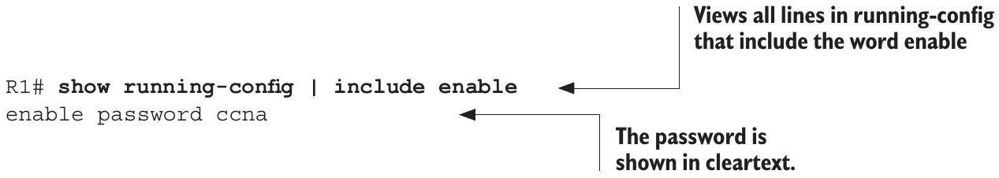

NOTE After a show command, a pipe (|) followed by the keyword include allows you to filter output to only show lines including the specified characters (enable, in this case).

To improve the security of enable password, you can use the service password -encryption command in global configuration mode. This encrypts all current passwords configured on the device, as well as passwords you configure in the future. The following example demonstrates this: after issuing the command and viewing running-config again, the original password is not shown. Instead, the password is stored as ciphertext (encrypted text):
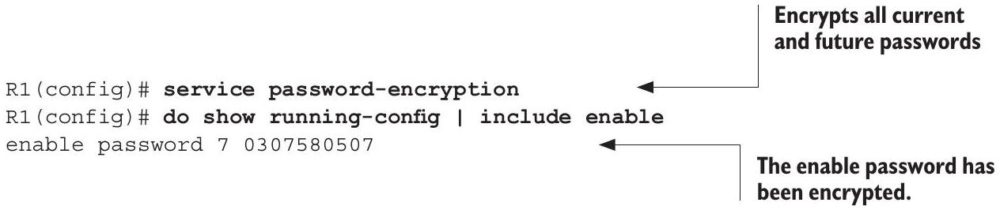

NOTE The 7 before the ciphertext string 0307580507 indicates the encryption type.

The service password-encryption command encrypts passwords using type 7 encryption. It is a very weak form of encryption that is easily reversed with free tools available on the internet (a Google search for "cisco type 7 decrypt" will give many results). Although it does prevent someone from looking over your shoulder to read the password as you look at running-config, it does not provide sufficient protection. To provide improved security, you should use the enable secret instead.

NOTE If you use the no service password-encryption command to undo the encryption, currently encrypted passwords will not be decrypted. Future passwords, however, will not be encrypted.

The enable password is an example of a legacy feature-something that has been replaced with a newer feature (the enable secret) but is still supported in Cisco IOS. The differences between the enable password and the enable secret are a potential exam question, but when configuring network devices, you should always use the enable secret.

### 5.4.2 Configuring the enable secret

The enable secret is a more secure password that can be configured to protect access to privileged EXEC mode. It stores the password as a hash, rather than encrypted ciphertext. Hashing can be thought of as one-way encryption; it can't be reversed. The enable secret can be configured with the enable secret command in global configuration mode. In the following example, I configure an enable secret and view it in running-config:
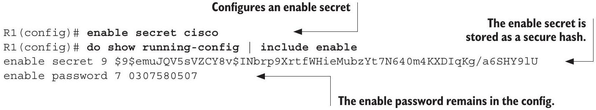

NOTE Notice that the enable password remains in the configuration. If both the enable password and enable secret are configured, only the enable secret can be used. The enable password command remains in the configuration but cannot be used to access privileged EXEC mode.

The enable secret command hashes the specified password using the default hashing algorithm of the device. There are a few different hashing algorithms that can be used to hash the password, and the hashing algorithms available vary depending on the IOS version of the device. On the platform I am using for this demonstration, the algorithm type is scrypt (pronounced S-crypt), also known as type 9 (as indicated by the 9 before the hash in the previous example's output). On many older devices, the default algorithm is Message Digest 5 (MD5), also known as type 5. Type 5 is not as secure as type 9, so type 9 should be used when possible. In chapter 11, volume 2, we will examine the different hashing algorithms supported by Cisco IOS and how to configure secrets using specific hashing algorithms.

## Summary

- A shell is a computer program that allows a user to interact with the computer. A graphical user interface (GUI) is a shell with a graphical interface, and a command-line interface (CLI) is a shell with a text-based interface.
- For the CCNA exam, you must be able to use the Cisco IOS CLI to configure the protocols and features listed in the exam topics list.

- The CLI of a network device can be accessed by connecting a PC to the device's console port with a console (rollover) cable or by connecting over the network infrastructure using Telnet or Secure Shell (SSH).
- After physically connecting a PC to the device's console port, a terminal emulator application (such as PuTTY) is required to access the CLI.
- To give commands to a network device, you type commands in the CLI and press Enter.
- After connecting to a device's CLI, you will be in user EXEC mode, which only allows you to view basic information about the device but not perform anything intrusive. The format of the prompt is hostname>.
- To access more powerful commands, use the enable command to access privileged EXEC mode, which provides unlimited access to EXEC mode commands. For example, you can view information about the device, restart it, save the configuration, move and delete files, etc. The format of the prompt is hostname\#.
- Use the disable command to return to user EXEC mode from privileged EXEC mode.
- Use the reload command in privileged EXEC mode to restart the device.
- To make configuration changes to the device, use the configure terminal command in privileged EXEC mode to access global configuration mode. The prompt is hostname (config) \#.
- Global configuration mode allows you to make configuration changes to the device. It also allows you to access other configuration modes for specific features.
- To change the hostname of the device, use the hostname command in global configuration mode.
- To undo a command, use no in front of the command. For example, no hostname R1.
- Use the end command, the exit command, or the Ctrl-C/Ctrl-Z shortcuts to return to privileged EXEC mode from global configuration mode.
- When in a configuration mode, you can use do in front of a command to execute EXEC mode commands.
- Keyboard shortcuts can be used to move the cursor and scroll through previously executed commands.
- Context-sensitive help can be used for guidance within the CLI. It can list available commands and possible completions for partially written words.
- Cisco IOS devices use two configuration files: the running-config file and the startup-configfile.
- The running-config file is stored in RAM and determines the current operations of the device. Configuration commands change running-config and immediately take effect. The running-config file is lost when the device is powered off or restarted.

- The startup-config file is stored in nonvolatile RAM (NVRAM) and does not determine the current operations of the device. The contents of startup-config are copied to running-config when the device boots up.
- To save the running-config file to the startup-config file, use write, write memory, or copy running-config startup-config in privileged EXEC mode.
- To return the device to the factory-default configuration, delete startup-config with write erase, erase nvram:, or erase startup-config, and restart the device with reload.
- Privileged EXEC mode can be password-protected with an enable password or enable secret. If both the enable password and enable secret commands are configured, only the enable secret can be used to access privileged EXEC mode.
- The enable password can be configured with the enable password command in global configuration mode. It is stored in the configuration as cleartext by default but can be encrypted with the service password-encryption command (type 7).
- The enable password remains in Cisco IOS as a legacy feature, but on modern devices, the enable secret should be used instead.
- The enable secret can be configured with the enable secret command in global configuration mode. It is stored in the configuration as a hash, using one of multiple hashing algorithms. The hashing algorithms available vary depending on the IOS version.
- Message Digest 5 (MD5) is type 5 encryption, and scrypt is type 9. scrypt is more secure and should be used instead of MD5 if supported by the device.

## Ethernet LAN <br> switching

## This chapter covers

- The definition of a LAN
- The contents of the Ethernet header and trailer
- How switches learn the MAC addresses of devices in the network
- How switches forward frames to the appropriate destination
- How network hosts use ARP to learn the MAC address of other hosts
- The ping utility

In this chapter, we will cover Ethernet LAN switching, which is the process switches use to forward frames to their proper destinations within a LAN. A frame is a Layer 2 PDU, including the Layer 2 header, trailer, and payload; we covered PDUs in chapter 4. When a network host sends a frame out of its port, it is the switch's role to make sure the frame reaches its proper destination.

This chapter covers material from domain 1.0 of the CCNA exam topics: Network Fundamentals. Specifically, we will cover the following topics:

- 1.13 Describe switching concepts
    - 1.13a MAC learning and aging
    - 1.13b Frame switching
    - 1.13c Frame flooding
    - 1.13d MAC address table

It is often said that switches are Layer 2 devices or that they operate at Layer 2. The reason for this is that switches use information in the Layer 2 header (the Ethernet header) to make forwarding decisions. This is in contrast to routers, which use information in the Layer 3 header (the IP header) to make forwarding decisions. We will cover how routers forward network traffic between LANs in part 2 of this book, but for now, we will focus on how switches forward traffic within a LAN.

### 6.1 Local area networks

In chapter 2, I defined a local area network (LAN) as a group of interconnected devices in a limited area, such as an office, and stated that the role of a switch is to connect devices within a LAN. The precise definition of a LAN can vary depending on the context, but for the purpose of this lesson, how the devices are connected is more significant than the actual physical distance between them. Figure 6.1 demonstrates this concept.


Figure 6.1 Two offices with two switches in each office. In Office A each switch is a separate LAN because the switches are connected via a router. In Office B both switches are in the same LAN because they are directly connected to each other.

There are two offices in the diagram, so you might say there are two LANs, which would not be incorrect if defining a LAN only by physical location. However, in Office A, the two switches are not directly connected to each other; each is connected to a different port on R1, and the purpose of a router is to provide connectivity between LANs. So, each switch in Office A can be considered its own LAN. For end hosts connected to SW1 to communicate with end hosts connected to SW2, their messages must pass through R1 because it separates the two LANs.

In Office B, however, SW3 and SW4 are directly connected to each other. End hosts connected to one switch can communicate with end hosts connected to the other switch without the messages having to pass through a router. SW3, SW4, and all of the end hosts connected to them are in a single LAN.

Another term for a LAN is a Layer 2 domain-a portion of a network where frames are switched, and hosts connected to the switch(es) can communicate with each other without the use of a router. Keep this definition in mind throughout this chapter; we will examine how switches forward frames within a Layer 2 domain.

### 6.2 The Ethernet header and trailer

Switches make forwarding decisions using information in the Ethernet header, so to understand switching, it's important to understand the contents of that header (and trailer). Figure 6.2 shows the structure of an Ethernet frame. Note that the Preamble and Start Frame Delimiter (SFD) are included in the diagram but are not considered part of an Ethernet frame. We will examine why shortly.


Figure 6.2 The contents of the Ethernet header and trailer. They are split into multiple fields, each serving a different purpose. The fields of the header are the Destination, Source, and Type/Length. The trailer consists of a single field: the Frame Check Sequence (FCS). Although not considered part of the Ethernet frame, the Preamble and SFD are sent with each frame.

### 6.2.1 Preamble and SFD

The Preamble and SFD are sent with each Ethernet frame to allow the receiving device to synchronize its receiver clock and prepare to receive the incoming frame. This clock has nothing to do with the date and time but rather with how the receiving device interprets the incoming electrical signals-the receiving device needs to determine the precise length of 1 bit.

The device sending an Ethernet frame facilitates this by sending the Preamble and SFD. The Preamble is 7 bytes ( 56 bits-remember that 1 byte is 8 bits) in length and is simply a series of alternating 1s and 0s like this: 10101010. Then, the SFD is 1 byte in length and signals that the Preamble is done and the frame is going to start. The bit pattern of the SFD is 10101011.

The reason the Preamble and SFD are not considered part of the Ethernet frame, although they are sent with each frame, is that they are purely a function of Layer 1, the Physical Layer. They do not contain information that influences what the receiving device decides to do with the frame. As mentioned in previous chapters, Ethernet includes specifications at both Layers 1 and 2, but the Layer 1 aspects of Ethernet are not considered part of a frame, which is a Layer 2 concept.

### 6.2.2 Destination and source

The Destination and Source fields are perhaps the most significant of the Ethernet header and trailer; the Destination field is the destination MAC address of the frame, and the Source field is the source MAC address of the frame.

DEFINITION A media access control (MAC) address is a type of address used by Layer 2 protocols such as Ethernet and Wi-Fi. MAC addresses are 6 bytes (48 bits) in length and are typically written as a series of 12 hexadecimal characters.
They are assigned by the device's manufacturer and should be globally unique.
Layer 2 provides hop-to-hop delivery of messages, and MAC addresses enable that. At Layer 3, the message is addressed to the IP address of the final destination host, but at Layer 2, the message is addressed to the MAC address of the next hop. Within a LAN, it is a switch's job to look at the destination MAC address of the frame and forward it to the appropriate destination. The source MAC address field is also important because it helps the switch learn which port each host is connected to (more about that shortly).

As indicated in figure 6.2, each of these fields is 6 bytes (48 bits) in length because 6 bytes is the length of a MAC address. However, when we represent MAC addresses, we typically don't write them out in binary; a long string of 1s and 0s isn't very human-readable or easy to remember. Instead, we write MAC addresses in hexadecimal.

## The hexadecimal number system

The number system we typically use in our daily lives is the decimal number system, which uses 10 digits to represent all values: 0, 1, 2, 3, 4, 5, 6, 7, 8, 9. Hexadecimal is a number system that uses 16 digits; it uses the same 10 digits in the decimal system and borrows 6 letters from the alphabet: A, B, C, D, E, and F.

Because more digits are available, hexadecimal can express large values in fewer characters. In decimal, to express the value after 9, we have to add another character-it becomes 10, a 1 and a 0. Hexadecimal can express that same value in a single character: A. The efficiency of hexadecimal over decimal becomes more significant as the values become greater. Table 6.1 lists some decimal numbers and their equivalent hexadecimal numbers.

Table 6.1 Decimal numbers and their hexadecimal equivalents
| Dec. | Hex. | Dec. | Hex. | Dec. | Hex. | Dec. | Hex. |
| :--- | :--- | :--- | :--- | :--- | :--- | :--- | :--- |
| 0 | 0 | 8 | 8 | 16 | 10 | 24 | 18 |
| 1 | 1 | 9 | 9 | 17 | 11 | 25 | 19 |
| 2 | 2 | 10 | A | 18 | 12 | 26 | 1A |
| 3 | 3 | 11 | B | 19 | 13 | 27 | 1B |
| 4 | 4 | 12 | C | 20 | 14 | 28 | 1C |
| 5 | 5 | 13 | D | 21 | 15 | 29 | 1D |
| 6 | 6 | 14 | E | 22 | 16 | 30 | 1E |
| 7 | 7 | 15 | F | 23 | 17 | 31 | 1F |


NOTE You can use a prefix to indicate whether a number is a decimal or hexadecimal number: $O d$ for decimal and $O x$ for hexadecimal. This can be useful in networking because we use multiple systems: binary, decimal, and hexadecimal. Ten in decimal is 10, but 10 in hexadecimal is equal to 16 in decimal. To clearly differentiate between the two, you can write 0d10 or 0x10.

In part 5 of this book (IPv6), we will practice converting between decimal, hexadecimal, and binary. For now, that is not necessary; it is enough to understand that MAC addresses are typically written in hexadecimal.

## Characteristics of MAC addresses

We have already covered two characteristics of MAC addresses: they are 6 bytes in length and are usually written in hexadecimal. By writing them in hexadecimal, we can express the address in fewer characters; MAC addresses are written as 12 hexadecimal characters rather than 48 bits (1s and 0s). The details regarding how those 12 characters are notated can vary. The following is a single MAC address written using three different notational conventions. Of course, because this is a CCNA book, I will follow Cisco's convention for writing MAC addresses, but it's worth knowing that they can be written in other ways. For comparison, I have also included the address written in binary-I'm sure you'll agree that the hexadecimal representations are easier to read:

- 0cf5.a452.b101 (used by Cisco IOS)
- 0C-F5-A4-52-B1-01 (used by Windows)
- 0c:f5:a4:52:b1:01 (used by macOS)
- 000011001111010110100100010100101011000100000001 (binary)

Unlike IP addresses (which we'll cover in chapter 7), MAC addresses are not assigned by the network admin or engineer configuring the device. Instead, each port of a network device has a MAC address that is assigned to it by the manufacturer. For this reason, another name for a MAC address is a burned-in address (BIA): it is "burned into" the physical port. A MAC address is globally unique-it should not be shared by a port on any other device in the world.

NOTE It is possible to override a manufacturer-assigned MAC address with manual configuration, but it is extremely rare to do so.

To ensure that MAC addresses remain globally unique, the first half of each MAC address (the first 3 bytes) is an organizationally unique identifier (OUI) assigned to the manufacturer by the IEEE. Then, the manufacturer is free to use the second half to assign unique MAC addresses to each device they manufacture. For example, the MAC addresses of the first three ports of the Cisco switch in my home network are

- 0cf5.a452.b101
- 0cf5.a452.b102
- 0cf5.a452.b103

0cf5.a4 is Cisco's OUI (actually, Cisco has many OUIs), and the second half is a unique identifier for each port on the switch. As you probably noticed, those three MAC addresses are quite similar-only the final digit is different. That's because MAC addresses on the same device are typically assigned sequentially.

Let's summarize MAC addresses before moving on:

- MAC addresses are 6-byte (48-bit) addresses assigned to ports by the device's manufacturer. Another name for a MAC address is burned-in address (BIA).
- MAC addresses are globally unique.
- The first 3 bytes are an organizationally unique identifier (OUI), assigned to the manufacturer by the IEEE.
- The last 3 bytes are unique to the port itself.
- MAC addresses are written as 12 hexadecimal characters.

### 6.2.3 Type/Length

The Type/Length field is a 2-byte field that can be used either to indicate the type of the encapsulated packet (e.g., an IP version 4 packet or an IP version 6 packet) or to indicate the length of the encapsulated packet (in bytes). There are historical reasons why this field can be used for two purposes, but both uses are now officially part of the Ethernet standard. These days, in almost all cases, this field is used to indicate the type of the encapsulated packet: instead of this field indicating length, the end of the frame is indicated by a special signal after the frame.

NOTE The original IEEE 802.3 standard used the Type/Length field exclusively to indicate the length of the encapsulated packet, and an additional header was used to indicate the type of encapsulated protocol: the Logical Link Control (LLC) header, sometimes with an additional Subnetwork Access Protocol (SNAP) extension to that header. However, this is beyond the scope of the CCNA exam.

A value of 1500 (decimal) or less in this field means that it indicates the length of the encapsulated packet in bytes. For example, if the value is 1500, it means the encapsulated packet is 1500 bytes in length.

A value of 1536 or greater in this field indicates the type of the encapsulated packet, which is usually IP version 4 (IPv4) or IP version 6 (IPv6). When used to indicate the type of the encapsulated packet, this field is called the EtherType field. For reference, here are the values in this field for IPv4 and IPv6, both of which are significant topics on the CCNA exam (usually hexadecimal notation is used; I'm including the decimal numbers for comparison):

- IPv4: 0x0800 (0d2048)
- IPv6: 0x86DD (0d34525)

NOTE Values between 1500 and 1536 should not be used in this field.

### 6.2.4 Frame Check Sequence

The Frame Check Sequence (FCS) is the only field of the Ethernet trailer. It is 4 bytes in length and is used to detect corrupted data in the frame. Before a device sends a frame, it uses an algorithm to calculate a checksum, a small block of data that is appended to the end of the frame as the FCS field.

Then, when the frame's destination host receives the frame, it calculates its own checksum for the frame (with the same algorithm) and compares it to the one calculated by the sender. If the two checksums are the same, the receiver can safely assume that the data has not been corrupted in transit. However, if the checksums calculated by the sender and receiver are different, the receiver will discard the frame-the data has been corrupted in transit (perhaps because of electromagnetic interference).

FCS is the name of the field, but the name for this kind of checksum is cyclic redundancy check (CRC). The term cyclic refers to the kind of algorithm used to calculate the checksum. Redundancy means that the field is redundant-it expands the size of the message but doesn't add any additional information. Check is self-explanatory-it is used to check if the frame traveled from source to destination without the data being corrupted.

### 6.3 Frame switching

Now that we have looked at the information in the Ethernet header and trailer, let's see how switches use the Source and Destination fields to build a MAC address table and forward frames to the appropriate destination(s) within a LAN.

### 6.3.1 MAC address learning

When a switch has to make a decision about how to forward a frame, it looks up the frame's destination MAC address in its MAC address table, which is a list of the MAC addresses in the LAN and which port each is connected to. We will examine the
frame-forwarding process in section 6.3.2, but first, how does a switch build its MAC address table?

NOTE Another name for a MAC address table is CAM table, named after the kind of memory the table is stored in (content addressable memory).

This is the role of the Source field of the Ethernet header. When a switch receives a frame on one of its ports, it examines the Source field and creates an entry for that MAC address in its MAC address table, associating that MAC address with the port the frame was received on. This entry says "To reach this MAC address, forward the frame out of this port." This makes sense: if a switch receives a frame from MAC address X on port Y, the switch knows it can reach the host with MAC address X out of port Y. This process is called MAC address learning. Figure 6.3 shows a simple network with two switches, each with two PCs connected. By examining the Source field of frames that arrive on its ports, each switch has built a MAC address table that tells it which port each MAC address is connected to (directly or via another switch).

DEFINITION MAC addresses learned by a switch in this manner are known as dynamic MAC addresses-they are automatically (dynamically) learned. This is in contrast to static MAC addresses, which are manually (statically) configured, although that is quite rare. A switch will remove a dynamic MAC address from its MAC address table after 5 minutes of inactivity (if it doesn't receive a frame from that MAC address for 5 minutes); this is called MAC aging.


Figure 6.3 A network with two switches, each with two PCs connected. SW1 and SW2 have learned the MAC address of each PC by examining the Source field of frames received on their ports as the PCs communicate with each other. SW1 knows it can reach PC1 via its G0/1 port, PC2 via its G0/2 port, and PC3/PC4 via its G0/0 port. SW2 knows it can reach PC1/PC2 via its G0/0 port, PC3 via its G0/1 port, and PC4 via its G0/2 port.

Figure 6.3 shows the state of the network after the switches have learned the MAC addresses of the devices in the LAN. However, we are missing a few pieces of the puzzle, such as how switches forward traffic before they have built their MAC address tables and how the PCs learn each others' MAC addresses.

## Port names on Cisco devices

Ports on Cisco devices have a name indicating their maximum supported speed (Ethernet $=10 \mathrm{Mbps}$, FastEthernet $=100 \mathrm{Mbps}$, GigabitEthernet $=1 \mathrm{Gbps}$, TenGigabitEthernet $=10 \mathrm{Gbps}$ ), followed by one to three numbers. How many numbers are used depends on the model of the device.

In this book, I will use a two-number system (X/Y), where the first number is the slot on the device, and the second number is the port number within that slot. A slot is a group of ports on a network device. In many cases, the ports in a slot are modular, meaning you can insert modules with different kinds of ports depending on your needs. Additionally, I will shorten the names to use the first letter only: $\mathrm{E}=$ Ethernet, $\mathrm{F}=$ FastEthernet, $\mathrm{G}=$ GigabitEthernet, T = TenGigabitEthernet.

Furthermore, port numbers on physical Cisco switches start from 1 (GO/1, GO/2, GO/3, etc). However, for most examples in this book, I will use virtual devices running in Cisco's emulation software CML (Cisco Modeling Labs), in which port numbers start from 0 (GO/0, GO/1, GO/2, etc).

### 6.3.2 Frame flooding and forwarding

Once the switches have learned the MAC address of each host in the LAN, as in figure 6.3, forwarding traffic is simple: when a switch receives a frame, it looks up the destination MAC address in its MAC address table and forwards the frame out of the appropriate port. For example, if PC1 sends a frame to PC2's MAC address, SW1 will check its MAC address table and see that it should forward the frame out of its G0/2 port. This frame from PC1 is a known unicast frame.

DEFINITION A frame addressed to a single destination host is called a unicast frame. If the switch already has an entry for the frame's destination MAC address in its MAC address table, it is called a known unicast frame.

The action a switch takes upon receiving a known unicast frame is to forward it out of the appropriate port. Now let's examine what happens when a switch receives a unicast frame and doesn't have an entry for the frame's destination MAC address in its MAC address table-an unknown unicast frame. Figure 6.4 shows what happens when PC1 sends a message to PC3, and both switches have an empty MAC address table.

DEFINITION An unknown unicast frame is a frame addressed to a single destination host, but the switch doesn't have an entry for the frame's destination MAC address in its MAC address table.


Figure 6.4 PC1 sends a unicast frame to PC3, but neither SW1 nor SW2 have an entry for the destination MAC address in their MAC address table. (1) PC1 sends the frame, and SW1 learns PC1's MAC address. (2) SW1 floods the frame. SW2 learns PC1's MAC address. PC2 drops the frame. (3) SW2 floods the frame. PC4 drops the frame. PC3 receives and processes it.

PC1 sends a unicast frame addressed to PC3's MAC address. SW1 uses the Source of the frame to learn PC1's MAC address, and then it floods the frame-it sends the frame out of every port except the one it was received on $(\mathrm{G} 0 / 1)$. SW1 doesn't have an entry for the PC3's MAC address in its MAC address table, so by flooding the frame, it hopes the frame will be able to reach PC3, and then it will later be able to learn PC3's MAC address when PC3 sends a reply.

DEFINITION To flood a frame is to send it out of all ports, except the port the frame was received on. Switches take this action on receiving an unknown unicast frame.

When SW1 floods the frame, both PC2 and SW2 receive it. Because the destination MAC address of the frame is not PC2's, it drops the frame. SW2, on the other hand, will treat the frame just like SW1 did; it will learn PC1's MAC address and then flood the frame out of its G0/1 and G0/2 ports.

When SW2 floods the frame, both PC3 and PC4 receive it. Like PC2, PC4 will drop the frame because the destination MAC address is not its own. However, PC3 sees that the frame is destined for its own MAC address, so PC3 will receive and process the message. Figure 6.5 shows what then happens when PC3 sends a reply back to PC1.

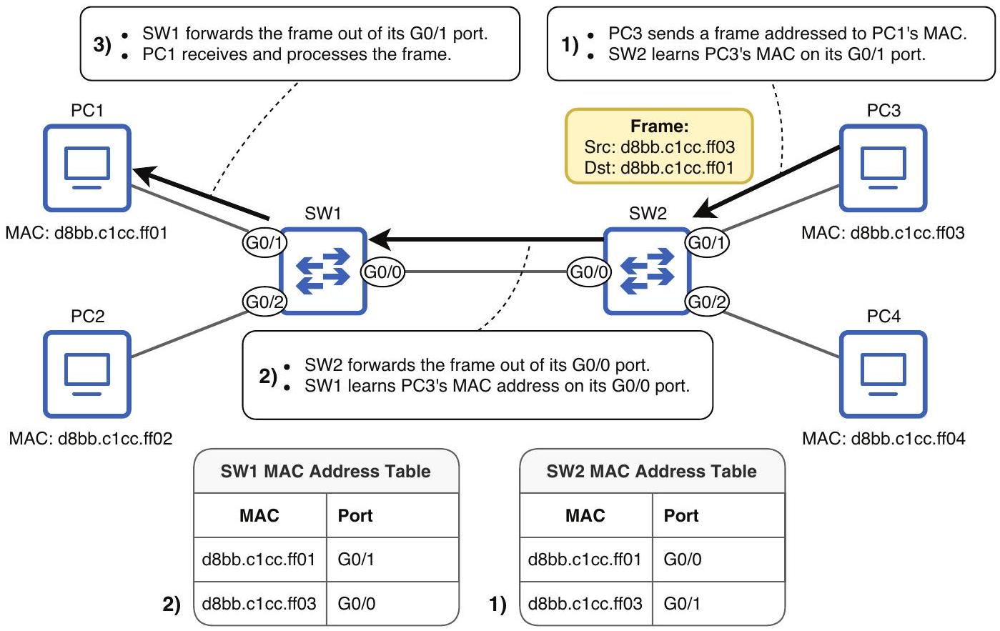
Figure 6.5 PC3 replies to PC1's message. (1) PC3 sends the frame, and SW2 learns PC3's MAC address. (2) SW2 forwards the frame out of its G0/0 port, and SW1 learns PC3's MAC address. (3) SW1 forwards the frame out of its G0/1 port, and PC1 receives and processes it.

PC3's reply to PC1 is also a unicast frame, but this time both SW1 and SW2 have an entry for the frame's destination (PC1's MAC address) in their MAC address tables, so rather than flooding the frame, each switch simply forwards it out of the port specified by the entry in its MAC address table. First, PC3 sends the frame, and SW2 learns PC3's MAC address on its G0/1 port. SW2 then forwards the frame out of its G0/0 port, and SW1 learns PC3's MAC address on its G0/0 port. Finally, SW1 forwards the frame out of its G0/1 port, and PC1 receives and processes the message. Remember what action a switch takes for each kind of unicast frame:

- Known unicast frame (forward)-The switch will send the frame out of the port specified by the MAC address's entry in the MAC address table.
- Unknown unicast frame (flood)-The switch will send the frame out of all ports except the one it was received on.

NOTE A switch is transparent to its connected hosts; PC1 and PC3 address their messages directly to each other, not to SW1 or SW2, exactly as they would if they were directly connected with a single cable. This is why a message passing through a switch is not considered a hop (as stated in chapter 4). Also, switches
do not modify the frames they switch in any way; they simply forward or flood them as appropriate.

### 6.3.3 The MAC address table in Cisco IOS

The command to view a Cisco switch's MAC address table is show mac address-table (in user EXEC or privileged EXEC mode). As the following example shows, there are a few more columns than just the MAC address and port. The Type column indicates whether the MAC address was dynamically learned (DYNAMIC) or statically configured (STATIC). The Vlan column indicates which virtual LAN (VLAN) each MAC address was learned in. We will cover VLANs in chapter 12. For now, just note that all of the MAC addresses are in VLAN 1 by default:

```
SW1# show mac address-table
    Mac Address Table
Views SW1’s MAC
address table
Vlan Mac Address Type Ports
---- ----------- -------- -----
1 5254.0017.7cd2 DYNAMIC Gi0/0
1 d8bb.c1cc.ff01 DYNAMIC Gi0/1
```

A list of MAC addresses

```
1 d8bb.c1cc.ff02 DYNAMIC Gi0/2
```

and the port each was

```
1 d8bb.c1cc.ff03 DYNAMIC Gi0/0
```

learned on

```
1 d8bb.c1cc.ff04 DYNAMIC Gi0/0
```

NOTE Cisco abbreviates GigabitEthernet ports as "GiX/X," not "GX/X."
Above the MAC addresses of PC1, PC2, PC3, and PC4 in the previous example, there is an additional MAC address in SW1's MAC address table (5254.0017.7cd2). This is the MAC address of SW2's G0/0 port. Although the MAC addresses of a switch's ports don't play a role when it is forwarding traffic between hosts, switches periodically exchange messages with each other and learn each other's MAC addresses in the process. We will cover some of these messages exchanged among switches in this book.

Although you can usually leave a switch to learn MAC addresses by itself and clear them as needed (after 5 minutes of inactivity), you can manually clear dynamic MAC addresses from a switch's MAC address table with the clear mac address-table dynamic command. The following example shows this; I clear SW1's MAC address table and then view it again, but it is empty:

```
SW1# clear mac address-table dynamic
SW1# show mac address-table
    Mac Address Table
Vlan Mac Address Type Ports
SW1’s MAC address
    table is empty.
```

You can also specify a specific address to remove from the MAC address table or tell the switch to remove all MAC addresses learned on a specific port. To clear a specific dynamic MAC address from the table, you can use the clear mac address-table dynamic address mac-address command. To clear all dynamic MAC addresses learned on a specific interface, use the clear mac address-table dynamic interface interface-name command.

However, as stated previously, you usually will not have to manually interfere with a switch's MAC address learning and aging processes. Note that this command uses the term interface instead of port. As you will see when we cover more configurations, this is true of most commands within Cisco IOS.

NOTE When I use bold and italics in a command, the bolded words indicate the command and its keywords that you must type. The italicized words indicate arguments for which you must provide a value. For example, in clear mac address-table dynamic address mac-address, you must type clear mac address-table dynamic address and then specify the mac-address to clear.

### 6.4 Address Resolution Protocol

Now we have looked at how switches forward frames and learn the MAC addresses of devices in their LAN. Next we will take a step back to fill in another piece of the puzzle-how the PCs know each other's MAC address. For PC1 and PC3 to send messages to each other, they first need to learn each other's MAC address. To do so, they use Address Resolution Protocol (ARP).

ARP allows a host to learn the MAC address of another host in the LAN. ARP involves two messages: an ARP request (used to ask another host what its MAC address is) and an ARP reply (used to inform another host of this host's MAC address). The ARP request message is sent in a new kind of frame: not unicast but broadcast. The ARP reply is a unicast frame sent to the MAC address of the host that sent the ARP request.

DEFINITION A broadcast frame is a frame addressed to the broadcast MAC address: ffff.ffff.ffff. A switch will flood broadcast frames, like unknown unicast frames. Broadcast frames are used by hosts to send messages to all other hosts in the LAN.

If an ARP request is broadcast (addressed to all other hosts in the LAN), how does the sender specify which host's MAC address it wants to learn? It does so by specifying the IP address of the host it wants to know the MAC address of. Figure 6.6 demonstrates this. PC1 wants to send a message to PC3 but doesn't know PC3's MAC address. So, PC1 uses ARP to learn PC3's MAC address.

NOTE The IP addresses of PC1, PC2, PC3, and PC4 are shown in figure 6.6, but it's not necessary to understand the structure of IP addresses yet. We will cover IP addresses in the next chapter.


Figure 6.6 An ARP request and reply exchange between PC1 and PC3. PC1 wants to send a message to PC3 but does not know PC3's MAC address, so PC1 uses ARP to learn PC3's MAC address.

Here's the process shown in figure 6.6:

1 PC1 sends an ARP request addressed to the broadcast MAC (ffff.ffff.ffff).
2 SW1 floods the frame. PC2 sees the ARP request is not for its own IP address, so it drops the message.
3 SW2 floods the frame. PC4 sees the ARP request is not for its own IP address, so it drops the message. PC3 sees the ARP request is for its own IP address.
4 PC3 sends an ARP reply to PC1.
5 SW2 forwards the ARP reply out of its G0/0 port.
${ }_{6}$ SW1 forwards the ARP reply out of its G0/1 port. PC1 now knows PC3's MAC address, so it will be able to send the original message to PC3.

NOTE The group of devices that will receive a broadcast frame sent by one of the group's members are in the same broadcast domain. A broadcast domain can be thought of as equivalent to a LAN or Layer 2 domain. All of the devices in figure 6.6 are in the same broadcast domain because they receive each other's broadcast frames.

After the ARP exchange is complete, PC1 knows PC3's MAC address; it will store PC3's MAC address in its ARP table, which is a list of IP addresses and their associated MAC addresses. ARP can be thought of as the bridge between Layers 2 and 3 of the TCP/IP model. ARP is used to map a known Layer 3 address (IP address) to an unknown Layer 2 address (MAC address).

Now PC1 will be able to send its message in a frame addressed to PC3's MAC address. It is also worth mentioning that upon receiving PC1's ARP request message, PC3 also stores PC1's MAC address in its own ARP table.

Note that, thanks to the ARP request-reply exchange, SW1 and SW2 have already learned PC1 and PC3's MAC addresses (the MAC address learning process was not shown in figure 6.6 to focus on the ARP process). So, when PC1 sends its message to PC3, the switches won't flood it-they will simply forward it out of the appropriate port because it is a known unicast message.

NOTE Unicast messages can be thought of as one-to-one and broadcast as one-to-all. Additionally, there is another type of message called multicast, which is one-to-multiple (but not necessarily all). We will touch on multicast messages in later chapters of this volume and volume 2.

We have covered how switches learn MAC addresses, how they flood and forward frames, and how hosts learn the MAC address of another host in the LAN by sending an ARP request to that host's IP address, but there is still one more part to the puzzle. How does a host know the IP address of the host it wants to send a message to? The answer is, "It depends." We will cover some possibilities in this book-for example, the Domain Name System (DNS), which is used to convert hostnames (i.e., manning.com) into IP addresses. As another option, the user of the device could manually specify the IP address to send a message to, such as when using ping to test connectivity.

NOTE A device doesn't have to use ARP every time it sends a message. After it has used ARP to learn another device's MAC address, it stores that information in its ARP table for future use.

### 6.5 Ping

Ping is a software utility that tests the reachability of hosts over a network. It's not directly connected to the topic of Ethernet switching, but it is a tool I'll be referencing throughout the book, and it also serves to fill the final piece of the puzzle in this chapter-how a source host knows the IP address of the destination host it wants to send a message to.

To send a ping message to another host on the network, the command is ping ip-address (this is true for Cisco IOS, Windows, Linux, macOS, etc.). The IP address of the destination host is specified directly in the command, so that's how the source host knows the IP address of the destination host.

Ping is a component of the Internet Control Message Protocol (ICMP), which plays a supporting role for the Internet Protocol (IP). In your networking career (or career in nearly any other area of IT), you'll certainly use ping very frequently as a simple way to test whether two hosts can reach each other over the network; it is a very common diagnostic and troubleshooting tool. Like ARP, ping consists of two messages: an ICMP echo request and an ICMP echo reply. However, unlike ARP, both messages used by ping are unicast.

Ping can also be used to measure the round-trip time (RTT) between two hosts-the time it takes a message to travel from one host to another and back. The following example shows a ping from a Cisco router (R1) to another host on its local network. In Cisco IOS, a single ping command sends five ICMP echo requests. As highlighted, the output lists the minimum, average, and maximum RTT for those five requests:

```
Sends five ICMP echo requests (pings)
to the specified IP address
Type escape sequence to abort.
Sending 5, 100-byte ICMP Echos to 10.0.0.12, timeout is 2 seconds:
!!!!!
Success rate is 100 percent (5/5), round-trip min/avg/max = 3/3/4 ms
```

Each exclamation mark indicates a successful ping.

The five exclamation marks (!!!!!) in the output indicate successful pings-ICMP echo requests that received an ICMP echo reply. If any of the requests do not receive a reply, a period (.) is displayed instead. For example, if the first request did not receive a reply, the output would be . ! ! ! !.

## Summary

- A local area network (LAN) can be defined as a portion of a network where hosts can communicate with each other without the use of a router. This is also called a Layer 2 domain.
- The Ethernet header has three fields: Destination, Source, and Type/Length. The Ethernet trailer has one field: the Frame Check Sequence (FCS).
- Although they are not considered part of the Ethernet frame, the Preamble and Start Frame Delimiter (SFD) are sent with each frame.
- The Preamble is a 7-byte series of alternating binary 1s and 0s. The SFD is a single byte in length and uses the bit pattern 10101011 to indicate the end of the Preamble and the beginning of the frame.
- The Destination and Source fields are each 6 bytes in length and contain the MAC address of the frame's sender (Source) and its intended receiver (Destination). MAC addresses are assigned by the manufacturer and should be globally unique.
- MAC addresses are usually written in hexadecimal, a number system that uses 16 characters: 0, 1, 2, 3, 4, 5, 6, 7, 8, 9, A, B, C, D, E, and F. When written in hexadecimal, MAC addresses are 12 characters in length.
- The first half of a MAC address is the organizationally unique identifier (OUI), which is assigned to the device's manufacturer by the IEEE. The second half of the MAC address can be used freely by the manufacturer to assign a unique MAC address to each port of the devices it manufactures.
- The Type/Length field either indicates the type of the encapsulated packet (i.e., IPv4 or IPv6) or the length of the encapsulated packet in bytes. If the value is 1500

or less, it indicates the length of the packet. If the value is 1536 or greater, it indicates the type (in this case, the name is EtherType).
- The FCS field uses a cyclic redundancy check (CRC) to allow the receiving host to check for errors in the frame that might have occurred in transit.
- A switch makes decisions about how to forward frames by looking up each frame's destination MAC address in the switch's MAC address table.
- A switch builds its MAC address table by looking at the source MAC address field of frames it receives and creating an entry in the MAC address table, associating the MAC address with the port the frame was received on. This is called MAC address learning.
- MAC addresses learned like this are called dynamic MAC addresses.
- If a switch doesn't receive a frame from a dynamic MAC address for 5 minutes, it will remove the entry from the MAC address table. This is called MAC address aging.
- A frame addressed to a single host is called a unicast frame. If the switch already has an entry for the frame's destination MAC in its MAC address table, it is a known unicast frame, and the switch will forward it out of the appropriate port. If the switch does not have an entry for the frame's destination MAC in its MAC address table, it is an unknown unicast frame, and the switch will flood the frame, sending it out of all ports (except the one it was received on).
- The show mac address-table command allows you to view the MAC address table of a Cisco switch. Dynamic MAC addresses can be cleared with clear mac address-table dynamic, clear mac address-table dynamic address mac-address, or clear mac address-table dynamic interface interface-name.
- Address Resolution Protocol (ARP) allows a host to learn the MAC address of another host in the network. It uses two messages: an ARP request and an ARP reply.
- The ARP request is sent to the broadcast MAC address (ffff.ffff.ffff), so it is flooded by switches. The ARP reply is a unicast message.
- A broadcast domain is a group of devices that receive broadcast messages from each other. Devices connected to the same switch (or different switches, but the switches are connected) are in the same broadcast domain.
- The ARP table is used to store IP address-to-MAC address mappings, so an ARP request doesn't have to be sent before every single packet.
- Ping is a utility that tests connectivity between two network hosts. It is a component of the Internet Control Message Protocol (ICMP) and is a common diagnostic and troubleshooting tool. To send a ping, use the ping ip-address command.
- Ping uses two messages: an ICMP echo request and an ICMP echo reply. Both are unicast messages.

## IPv4 addressing

## This chapter covers

- The fields of the IPv4 header
- The binary number system
- How to convert between decimal and binary
- The structure of IPv4 addresses
- How to configure IPv4 addresses on Cisco routers

In chapter 6, we focused on Layer 2 of the TCP/IP model: how switches use information in the Ethernet header to make forwarding decisions. In this chapter, we will move up a layer to Layer 3 and look at the contents of the Internet Protocol version 4 (IPv4) header, focusing on IPv4 addressing.

We are now in the realm of routers, rather than switches. Whereas switches use information in the Layer 2 header to decide how to forward messages to their proper destinations, routers use information in the Layer 3 header to make their forwarding decisions. In this chapter, we won't yet focus on exactly how routers make those forwarding decisions; we will leave that for part 2 of this book. Instead, we will first focus on the contents of the IPv4 header and the addresses used in that header.

The specific exam topic we will cover is topic 1.6: Configure and verify IPv4 addressing and subnetting. However, IPv4 addressing is not only relevant to exam topic 1.6; it is a fundamental topic that is essential to understanding nearly any other CCNA exam topic. Also note that we will cover subnetting, the second half of topic 1.6, in part 2 of this book.

Given the name IPv4, you may wonder what happened to previous versions. The history and characteristics of IPv0, v1, v2, and v3, although important steps in the evolution toward IPv4, are not necessary to know for the CCNA exam, so we will not cover them. It is IPv4, officially defined in RFC 791 (simply titled "Internet Protocol") that is the foundation of modern networks such as the internet.

NOTE In addition to IPv4, IPv6 is another major exam topic that has its own part in this volume. IPv6 was introduced in 1995 to replace IPv4, but its adoption has been slow. Although IPv6 adoption is accelerating as the available IPv4 address pool runs out, it seems that for the foreseeable future, network engineers will have to be familiar with both IPv4 and IPv6.

### 7.1 The IPv4 header

Before looking at the details of IPv4 addressing, it's helpful to understand the header that contains those addresses. However, the IPv4 header doesn't just contain IPv4 addresses; it contains a variety of fields, each serving a different role in enabling the end-to-end delivery of packets (the role of Layer 3).

The IPv4 header is more complex than the Ethernet header, as you'll probably notice when looking at figure 7.1. In total, there are 14 fields (although the Options field is optional), whereas the Ethernet header and trailer only have 4 (6 if you include the Preamble and SFD).

|  | Byte | 0 |  |  |  |  |  |  |  | 1 |  |  |  |  |  |  |  | 2 |  |  |  |  |  |  |  | 3 |  |  |  |  |  |  |  |
| :--- | :--- | :--- | :--- | :--- | :--- | :--- | :--- | :--- | :--- | :--- | :--- | :--- | :--- | :--- | :--- | :--- | :--- | :--- | :--- | :--- | :--- | :--- | :--- | :--- | :--- | :--- | :--- | :--- | :--- | :--- | :--- | :--- | :--- |
| Byte | Bit | 0 | 1 | 2 | 3 | 4 | 5 | 6 | 7 | 8 | 9 | 10 | 11 | 12 | 13 | 14 | 15 | 16 | 17 | 18 | 19 | 20 | 21 | 22 | 23 | 24 | 25 | 26 | 27 | 28 | 29 | 30 | 31 |
| 0 | 0 | Version |  |  |  | IHL |  |  |  | DSCP |  |  |  |  |  | ECN |  | Total Length |  |  |  |  |  |  |  |  |  |  |  |  |  |  |  |
| 4 | 32 | Identification |  |  |  |  |  |  |  |  |  |  |  |  |  |  |  | Flags |  |  | Fragment Offset |  |  |  |  |  |  |  |  |  |  |  |  |
| 8 | 64 | Time To Live |  |  |  |  |  |  |  | Protocol |  |  |  |  |  |  |  | Header Checksum |  |  |  |  |  |  |  |  |  |  |  |  |  |  |  |
| 12 | 96 | Source Address |  |  |  |  |  |  |  |  |  |  |  |  |  |  |  |  |  |  |  |  |  |  |  |  |  |  |  |  |  |  |  |
| 16 | 128 | Destination Address |  |  |  |  |  |  |  |  |  |  |  |  |  |  |  |  |  |  |  |  |  |  |  |  |  |  |  |  |  |  |  |
| 20 | 160 |  |  |  |  |  |  |  |  |  |  |  |  |  |  |  |  |  |  |  |  |  |  |  |  |  |  |  |  |  |  |  |  |
| ⋮ | ⋮ |  |  |  |  |  |  |  |  |  |  |  |  |  |  |  |  |  |  |  |  |  |  |  |  |  |  |  |  |  |  |  |  |
| 56 | 448 |  |  |  |  |  |  |  |  |  |  |  |  |  |  |  |  |  |  |  |  |  |  |  |  |  |  |  |  |  |  |  |  |

Figure 7.1 The format of the IPv4 header. The header is typically 20 bytes in size (the minimum size) but can be up to 60 bytes if the Options field is used.

Before we examine the purpose of each field of the header, I want to clarify how to read figure 7.1. The fields of the header are contained within the thick border and should be read from left to right, top to bottom; the first bit of the header is in the top-left position, and the last bit is in the bottom-right position. The numbers along the top indicate that each row is 4 bytes (32 bits) in length. The numbers on the left of each row indicate the starting byte/bit number of that row. For example, the second row starts at byte 4 (the fifth byte), which is bit 32 (the thirty-third bit).

NOTE In networking, you'll have to get used to counting from 0. For example, the range from 0 to 31 includes 32 bits in total: bit 0 is the first bit, bit 1 is the second bit, etc. Likewise, byte 0 is the first byte, byte 1 is the second byte, byte 2 is the third byte, byte 3 is the fourth byte, etc.

As stated, the Options field is optional (and variable in size), so the length of the IPv4 header is variable. Without the Options field, the header is 20 bytes in length, from the first bit of the Version field to the last bit of the Destination Address field. With the Options field at its maximum size (40 bytes), the IPv4 header is 60 bytes in length. However, the Options field is rarely used and is beyond the scope of the CCNA exam.

EXAM TIP For the purpose of the CCNA exam, don't worry about memorizing the length and position of each field of the IPv4 header. Questions on the CCNA exam are more substantial than trivia like "What's the length of field X?" For the purpose of this chapter, it's sufficient to have a basic understanding of the purpose of each field. This chapter focuses on the IPv4 addresses in the Source Address and Destination Address fields, and in the rest of this book, we will look at other fields in greater detail as required.

### 7.1.1 The Version field

The first field of the IPv4 header is the Version field. It is 4 bits in length. As I mentioned previously, there are two versions of IP used in modern networks: IPv4 and IPv6. The purpose of this field is simple: to indicate which version of IP is being used. In modern networks, you can expect to find one of two values in this field:

- A value of 0b0100 (0d4) indicates IPv4.
- A value of 0b0110 (0d6) indicates IPv6.

NOTE As mentioned in chapter 6, the prefix $O b$ indicates a binary number, and the prefix $O d$ indicates a decimal number. We will look at how to convert between the two number systems later in this chapter.

### 7.1.2 The IHL field

The second field is the Internet Header Length (IHL) field, which is 4 bits in length. This field is used to indicate the length of the IPv4 header. The reason this field is necessary is because the IP header is variable in length, depending on whether the Options field is present or not (and the Options field itself is variable in length too).

The IHL field indicates the length of the IPv4 header in 4-byte increments. For example, if the value of this field is 5, it means the header is 20 bytes in length (the minimum length of the IPv4 header).

NOTE A value less than 5 should not be used in this field because the IPv4 header cannot be less than 20 bytes in length.

Any value greater than 5 in the IHL field indicates that the Options field is present in the header. The maximum value of the IHL field is 15, indicating that the header is 60 bytes in length (the maximum length of the IPv4 header). In that case, the Options field is 40 bytes in length, and the rest of the header is 20 bytes.

### 7.1.3 The DSCP and ECN fields

The next two fields are Differentiated Services Code Point (DSCP), which is 6 bits in length, and Explicit Congestion Notification (ECN), which is 2 bits in length. This byte of the IPv4 header used to be called the Type of Service field and still is sometimes, but DSCP + ECN is the current definition.

These fields are used for Quality of Service (QoS), which is a network feature used to prioritize specific types of network traffic over other types. A common use case for QoS is to prioritize delay-sensitive network traffic-network traffic for which it is very important to reach the destination as soon as possible, without delay. One example of this is voice and video traffic; I think most of us know how frustrating it can be to have a Zoom call (or a call using any similar application) with poor quality. QoS helps ensure that this traffic is forwarded with as little delay as possible.

NOTE QoS is another CCNA exam topic, and we will cover it in chapter 10 of volume 2 of this book.

### 7.1.4 The Total Length field

The Total Length field is a 16-bit field that indicates the total length of the packet-the IPv4 header and its payload. Don't confuse this with the IHL field, which indicates the length of the IPv4 header alone. Figure 7.2 illustrates the difference between the IHL and Total Length fields.

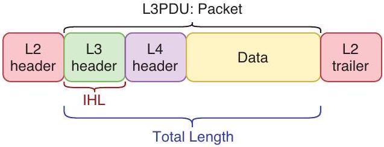
Figure 7.2 The difference between the IHL and Total Length fields. The IHL field indicates the length of the IPv4 header (Layer 3 header), whereas the Total Length field indicates the length of the entire packet. The Layer 2 header and trailer are shown to emphasize that a packet will always be encapsulated in a frame before being sent; a packet alone is not ready to be sent over the physical medium.

Another difference between the IHL and Total Length fields is that the value of the Total Length field indicates the length of the packet in bytes, rather than 4-byte increments. For example, a value of 100 in the Total Length field means the packet is 100 bytes in length, and a value of 1,000 in the Total Length field means the packet is 1,000 bytes in length.

### 7.1.5 The Identification, Flags, and Fragment Offset fields

The Identification, Flags, and Fragment Offset fields, 32 bits in total, are used together to support packet fragmentation-when a packet is broken up into multiple smaller packets called fragments. IPv4 uses a concept called maximum transmission unit (MTU) to indicate the maximum size a packet should be, and any packet larger than the MTU will be fragmented. Then, the final destination host of the packet reassembles the fragments to restore the original packet.

The typical MTU is 1,500 bytes, and this should be supported on all modern devices. However, if for some reason a router in the packet's path to the destination has a lower MTU, it will fragment the packet. Another possibility is that a host sends packets larger than the standard 1,500-byte size (sometimes packet sizes up to 9,000 bytes are used). If a router in the path to the destination doesn't support those larger packets, it will fragment them. Let's briefly examine the role of each of these three fields.

## Identification field

This field is 16 bits in length and is used to identify which original packet a fragment belongs to. When a packet is fragmented, all of its fragments must have the same value in this field.

## Flags field

This field is 3 bits in length and is used to control and identify fragments. The 3 bits of this field (bit 0 , bit 1 , and bit 2 ) are defined as follows:

- Bit 0: Reserved-This bit's use hasn't been defined, so it is always set to 0.
- Bit 1: Don't Fragment (DF) bit-If this bit is set to 1, it means the packet should not be fragmented. In that case, if the packet's size is greater than the MTU, it will be discarded.

- Bit 2: More Fragments (MF) bit-If this bit is set to 1, it means there are more fragments remaining-this one isn't the last. The final fragment of the packet will have a value of 0 in this field (indicating that there are no more fragments). An unfragmented packet will always have a value of 0 for this bit.

## Fragment Offset field

This field is 13 bits in length and is used to indicate the position of the fragment within the original packet. This allows fragmented packets to be reassembled even if the fragments arrive out of order. This is rare, but if there are multiple paths to a destination, different fragments might take different paths, in which case they may arrive at the destination out of order.

### 7.1.6 The TTL field

The Time To Live (TTL) field is an 8-bit field. When a host sends a packet, it will set an initial value in this field (a common value is 64), and then each router that forwards the packet will decrease the value in this field by 1. If the value reaches 0, the router will drop the packet.

The reason for this mechanism is to prevent packets from looping around the network infinitely. A loop is when a message travels around the network without being able to find its destination. For example, if there are three routers (R1, R2, and R3), a looping packet might be passed from R1 to R2, from R2 to R3, from R3 to R1, from R1 to R2, from R2 to R3, etc. in a loop. Figure 7.3 shows an example of a looped packet being dropped thanks to the TTL field.


Figure 7.3 A looped packet is dropped due to the TTL mechanism. (1) R1 forwards the packet to R2 with a TTL of 5. (2) R2 forwards the packet to R3 with a TTL of 4. (3) R3 forwards the packet to R1 with a TTL of 3. (4) R1 forwards the packet to R2 with a TTL of 2. (5) R2 forwards the packet to R3 with a TTL of 1. (6) R3 wants to forward the packet to R1 but drops the packet because it must decrement the TTL to 0.

Loops should not occur in a properly configured network, but mistakes can happen. The TTL field prevents packets from looping indefinitely; once the packet's TTL reaches 0, it will be dropped.

### 7.1.7 The Protocol field

The Protocol field is 8 bits in length and is used to indicate what kind of message is encapsulated inside of the packet. This is similar to the Ethernet header's EtherType field, which indicates the type of message encapsulated in the frame (for example, an IPv4 packet or an IPv6 packet).

In the previous chapter, we covered the ping utility, which is a component of ICMP. If a packet contains an ICMP message, that is indicated with a value of 1 in this field. The following are the Protocol field values of some protocols we will cover in this book:

- 1-ICMP
- 6-Transmission Control Protocol (TCP)
- 17-User Datagram Protocol (UDP)
- 89-Open Shortest Path First (OSPF)

### 7.1.8 The Header Checksum field

The Header Checksum field is 16 bits in length and is used to check for errors in the IPv4 header. The mechanism is similar to the FCS in the Ethernet trailer. However, a major difference is that the Header Checksum field only checks for errors in the IPv4 header, not in the entire packet. On the other hand, the Ethernet FCS field doesn't just check for errors in the Ethernet header; it checks for errors in the entire frame.

### 7.1.9 The Source Address and Destination Address fields

These two fields contain the IP address of the host sending the packet (Source Address field) and the intended recipient of the packet (Destination Address field). Each of these fields is 32 bits in length-the length of an IPv4 address. We will cover the structure of IPv4 addresses in detail later in this chapter.

### 7.1.10 The Options field

The final field of the IPv4 header is the Options field. As mentioned previously, this field is optional and variable in length-from 0 bytes (if not used) to 40 bytes in length; this is the reason the IPv4 header requires a field to indicate the length of the header itself. This field is rarely used, and its use cases are beyond the scope of the CCNA exam.

### 7.2 The binary number system

To understand IPv4 addresses, you have to understand the binary number system, as well as how to convert between binary and decimal numbers. And to understand how binary numbers work, let's first review how decimal numbers work. We're all familiar with decimal numbers because we use them in our daily lives, but many of us don't think about how the decimal number system actually works.

### 7.2.1 Decimal

The decimal number system uses 10 digits: 0, 1, 2, 3, 4, 5, 6, 7, 8, and 9 . All values are expressed using those 10 digits. For this reason, the decimal number system is also called base 10. Values from 0 to 9 can be expressed with a single digit, but to express greater values, we have to use more digits. For example, the number after 0d9 is 0d10-a 1 in the tens position and a 0 in the ones position.

After counting up to 0d99 (9 in the tens position and 9 in the ones position), we have to add a third digit; the number after 0d99 is 0d100-a 1 in the hundreds position and a 0 in both the tens and ones positions. Because decimal uses 10 digits, the value of each additional position increases tenfold as you add more digits: 1, then 10, then 100, then 1,000, etc. That's why, in the number 1,009 (for example), the 1 on the left has a greater value than the 9 on the right, even though on its own, the number 9 has a greater value than the number 1.

### 7.2.2 Binary

Counting in the binary system follows the same process but with only two digits: 0 and 1. For this reason, the binary number system is also called base 2. Only the values 0 and 1 can be expressed with a single digit; to express greater values, we have to add more digits.

The value after 0b1 is 0b10-a 1 in the twos position and a 0 in the ones position; this is equivalent to 0d2. After 0b10 is 0b11 (equivalent to 0d3), and then once again, both positions have reached their maximum value, so a third digit is needed. This results in 0b100 (equivalent to 0d4). Whereas the value of each decimal position increases 10-fold, the value of each binary position doubles because binary uses two digits. Figure 7.4 shows an eight-digit binary number with the value of each position above each bit (binary digit).


Figure 7.4 An 8-bit (1-byte) number with the value of each bit written above. The decimal equivalent of 0b10101101 is 0d173. This can be calculated by adding the value of each bit that is set to 1.

NOTE The rightmost digit of a binary number is called the least-significant bit, because it has the least value. The leftmost digit is called the most-significant bit, because it has the greatest value.

Table 7.1 lists some decimal numbers and their binary equivalents. With only two digits available, binary numbers quickly grow in size (the value after 0b11111 would be 0b100000). That is why, although computers use binary numbers,, we convert those
binary values to other number systems (decimal and hexadecimal) to make them more human-readable.

Table 7.1 Decimal numbers and their binary equivalents
| Dec. | Bin. | Dec. | Bin. | Dec. | Bin. | Dec. | Bin. |
| :--- | :--- | :--- | :--- | :--- | :--- | :--- | :--- |
| 0 | 0 | 8 | 1000 | 16 | 10000 | 24 | 11000 |
| 1 | 1 | 9 | 1001 | 17 | 10001 | 25 | 11001 |
| 2 | 10 | 10 | 1010 | 18 | 10010 | 26 | 11010 |
| 3 | 11 | 11 | 1011 | 19 | 10011 | 27 | 11011 |
| 4 | 100 | 12 | 1100 | 20 | 10100 | 28 | 11100 |
| 5 | 101 | 13 | 1101 | 21 | 10101 | 29 | 11101 |
| 6 | 110 | 14 | 1110 | 22 | 10110 | 30 | 11110 |
| 7 | 111 | 15 | 1111 | 23 | 10111 | 31 | 11111 |


Although IPv4 addresses are 32 bits in length, the good news is that you only have to be able to convert between binary and decimal for numbers up to 8 bits in length. That is because IPv4 addresses are divided into four groups of 8 bits, making them more manageable.

## Converting binary numbers to decimal

Converting binary numbers to decimal is a simple process-just add up the values of the bits that are set to 1. Figure 7.5 demonstrates this process.

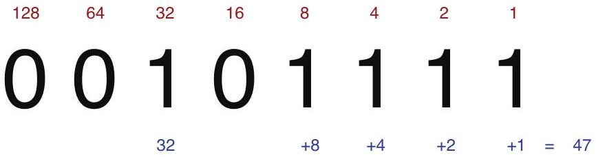
Figure 7.5 The binary number 00101111 is equal to 47 in decimal. To calculate this, add the value of each bit that is set to $1: \mathbf{3 2}+\mathbf{8}+\mathbf{4}+\mathbf{2}+\mathbf{1}=\mathbf{4 7}$.

I highly recommend spending some time practicing this. To do so, write some random 8-bit numbers (11011010, 01011100, 11101110, etc.), and practice converting them to decimal. With some practice, you should be able to convert from binary to decimal in your head, without writing down the value of each bit. To check your answers, you can do a quick internet search for "binary to decimal converter"; there are plenty of free tools available.

NOTE The minimum value of an 8-bit number (with all bits set to 0) is 0d0. The maximum value of an 8-bit number (with all bits set to 1) is 0d255. Therefore, 8 bits provide 256 possible values: from 0d0 (0b00000000) to 0d255 (0b11111111).

## Converting decimal numbers to binary

Converting from decimal to binary takes a few more steps. There are a few methods to do this, but figure 7.6 demonstrates the process I use. First, attempt to subtract the value of the most significant bit (128) from the decimal number. If the result is a positive number, note the remainder, and write a 1 in that bit position. If the subtraction would result in a negative value, do not subtract; just write a 0 in that bit position. Then, subtract the value of the second-most significant bit (64) from the remainder of the previous subtraction (or the original number, if you couldn't subtract 128 from the number), and repeat the process until you reach 0 . Figure 7.6 shows how this works:

1 Subtracting 128 from 206 gives a remainder of 78. Write a 1 in the 128 position.
2 Subtracting 64 from 78 gives a remainder of 14. Write a 1 in the 64 position.
332 cannot be subtracted from 14. Write a 0 in the 32 position.
416 cannot be subtracted from 14. Write a 0 in the 16 position.
${ }^{5}$ Subtracting 8 from 14 gives a remainder of 6. Write a 1 in the 8 position.
${ }_{6}$ Subtracting 4 from 6 gives a remainder of 2. Write a 1 in the 4 position.
7 Subtracting 2 from 2 gives a remainder of 0 . Write a 1 in the 2 position.
8 We have reached 0, so write a 1 in the remaining position.

We now have the answer: 0d206 is equivalent to 0b11001110.

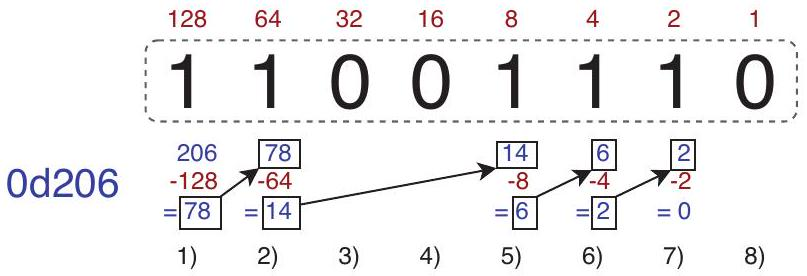
Figure 7.6 The process of converting a decimal number (206) to a binary number (11001110) by subtracting each bit's decimal value

Instead of using subtraction, you can convert from decimal to binary using addition if you prefer. Begin with a running total of 0, and progressively add the values of each bit, starting from the leftmost (most significant) bit, without exceeding the value of the decimal number you're converting. Here are the steps for converting the decimal number 206 to binary:

$10+128=128$. Write a 1 in the 128 position.
$2128+64=192$. Write a 1 in the 64 position.
$3192+32=224$, which is greater than 206. Write a 0 in the 32 position.
$4192+16=208$, which is greater than 206. Write a 0 in the 16 position.
$5192+8=200$. Write a 1 in the 8 position.
$6200+4=204$. Write a 1 in the 4 position.

$7204+2=206$. Write a 1 in the 2 position.
8 We have reached the original value (206). Write a 0 in the remaining position.

Like converting from binary to decimal, this process becomes much easier with practice, and eventually you should be able to do it in your head. To practice, write some random numbers from 0 to 255 (56, 127, 201, 199, etc.), and try converting them into binary.

For additional practice with converting between decimal and binary (in both directions), you can try the Binary Game on Cisco Learning Network: https://learningnetwork.cisco.com/s/binary-game. Try it a few times each day; as you practice and improve, your scores in the Binary Game should increase, and you'll find yourself able to do the necessary calculations in your head.

EXAM TIP Being able to quickly convert between decimal and binary is a big help on the CCNA exam, especially when it comes to subnetting (the topic of chapter 11). The CCNA exam has a 2-hour time limit-don't unnecessarily spend time doing binary-to-decimal and decimal-to-binary conversions. A bit of practice with Cisco's Binary Game goes a long way.

## Exam applications

Binary is a fundamental topic with applications to various CCNA exam topics. In addition to IPv4 addressing (the topic of this chapter), the following are some other topics that require you to be proficient with binary, including converting between binary and decimal:

- IPv4 subnetting-Subnetting is the process of dividing networks into smaller networks and is the second half of exam topic 1.6: Configure and verify IPv4 addressing and subnetting. To subnet IPv4 networks, you need to be able to convert IPv4 addresses from decimal to binary and vice versa. We will cover subnetting in chapter 11 of this book.
- IPv6 addressing-This is exam topic 1.8: Configure and verify IPv6 addressing and prefix. To understand IPv6 addresses, you need to be able to convert between binary, decimal, and hexadecimal (because IPv6 addresses are usually written in hexadecimal). We will cover IPv6 in part 5 of this book.
- IPv4 and IPv6 routing-This includes nearly all of domain 3.0 of the CCNA exam topics (IP Connectivity) and is 25\% of the entire CCNA exam. For example, to know how a router will forward a packet, you must identify the most specific matching route-the route with the most bits that match the packet's destination IP address. To do that, you must understand binary numbers. We will cover the concept of the most specific matching route in chapter 9 and other topics in domain 3.0 in parts 4 and 5 of this volume.
Access Control Lists (ACLs)-ACLs are exam topic 5.6: Configure and verify access control lists. ACLs are used to permit or deny specific network traffic, and they do that by comparing bits in the configured ACL to the bits of a packet's source and/or destination IP addresses. To configure appropriate ACLs, you must understand the binary system. We will cover ACLs in part 6 of this book.

### 7.3 IPv4 addressing

An IPv4 address is a 32-bit number that identifies a host at Layer 3 of the TCP/IP Model. IP addresses (whether IPv4 or IPv6) are used to address a message to its final intended recipient, unlike MAC addresses, which are used to address a message to the next hop. Whereas switches are said to be Layer 2 devices, routers are said to be Layer 3 devices or to operate at Layer 3 because they make forwarding decisions based on the destination IP address of messages (located in the Layer 3 header).

NOTE In this chapter, we will look at how to configure IPv4 addresses on routers, but we will cover how routers forward packets in part 2 of this book.

### 7.3.1 The structure of an IPv4 address

IPv4 addresses are 32 bits in length, but a 32-bit string of 1s and 0s isn't very humanreadable or easy to remember. To make them easier to read, IPv4 addresses are represented using decimal numbers instead of binary. To simplify it even further, we first split the 32-bit IPv4 address into four groups of 8 bits called octets, separated by a period, and then convert each of the octets to decimal; this is called dotted decimal notation. This is why, for the purpose of the CCNA, you only need to be able to convert between binary and decimal for numbers of up to 8 bits. Figure 7.7 shows an IPv4 address written in dotted decimal as well as in binary.


Figure 7.7 An IPv4 address written in both dotted decimal and binary. The 32-bit address is split into four octets consisting of 8 bits each. The address is divided into two parts: the network portion and the host portion. The prefix length indicates the size of the network portion in bits, and the remainder is the host portion.

## Octet and byte

You may wonder what the difference is between an octet and a byte, both of which I have defined as a group of 8 bits. An octet always means 8 bits. However, a byte isn't necessarily 8 bits; a byte is the minimum unit of data that a computer can read from or write to at one time. This is almost always 8 bits, but in the past, there have been computers that use 6-, 7-, and 9-bit bytes. Therefore, the term octet is sometimes used instead to refer to a group of 8 bits. In the context of IPv4 addresses, octet is preferred.

## Prefix length

The size of the network portion of an IP address can be indicated with a prefix length in the format /X, where X is the number of bits in the network portion. In figure 7.7, the IPv4 address is followed by /24, indicating that the network portion of the address is 24 bits in length. From that, we can infer that the remaining 8 bits are the host portion.

NOTE The network portion of an IPv4 address is often called the prefix or network prefix.

All hosts in the same LAN as the host with IPv4 address 192.168.100.100 will share the same network portion; the first three octets of their IPv4 addresses will be the same (192.168.100). However, each host will have a unique host portion; the final octet will be unique. Some possible addresses of other hosts in the LAN could be 192.168.100.1, 192.168.100.178, 192.168.100.234, etc.

Figure 7.8 shows two networks: LAN 1 and LAN 2. Notice that the IP address of each host in LAN 1 begins with 192.168.1, and the IP address of each host in LAN 2 begins with 192.168.2. The router (R1) serves to connect the two LANs; its G0/0 interface has IP address 192.168.1.1/24, and its G0/1 interface has IP address 192.168.2.1/24. Hosts in the separate LANs can communicate with each other via R1. Notice that the switches do not have IP addresses-this is because switches are not Layer 3 aware. Switches operate at Layer 2 of the TCP/IP model and do not get involved with Layer 3.

NOTE When talking about routers, the term interface is typically used instead of port.


Figure 7.8 Two networks (LAN 1 and LAN 2) connected via a router (R1). IP addresses of hosts in each LAN share the same network portion: 192.168.1 in LAN 1 and 192.168.2 in LAN 2.

NOTE The exact meaning of the term network can vary. You could say figure 7.8 depicts a network consisting of two LANs. However, in the context of IP addresses and prefix lengths, you can think of a network as being synonymous with a LAN-a group of devices that can communicate directly with each other, without the use of a router.

## Netmasks

Instead of indicating the prefix length with /X, another common method is to use a netmask-another string of 32 bits that is paired with an IP address to indicate which bits of the IP address are the network portion and which are the host portion. A bit in the netmask that is set to 1 means the bit in the same position of the IP address is part of the network portion; a bit in the netmask that is set to 0 means the bit in the same position of the IP address is part of the host portion.

Like IPv4 addresses, netmasks are usually written in dotted decimal notation. Figure 7.9 shows an IPv4 address (172.16.20.21) with a netmask (255.255.0.0). The first 16 bits of the netmask are 1, meaning the first 16 bits of the IPv4 address are the network portion.

| Network portion |  |  |  |  |  |  |  |  |  |  |  |  |  |  |  |  |  |  |  |  |  |  |  |  |  |  |  |  |
| :--- | :--- | :--- | :--- | :--- | :--- | :--- | :--- | :--- | :--- | :--- | :--- | :--- | :--- | :--- | :--- | :--- | :--- | :--- | :--- | :--- | :--- | :--- | :--- | :--- | :--- | :--- | :--- | :--- |
| IP address | 172 |  |  |  |  |  | 16 |  |  |  |  |  |  |  | 20 |  |  |  |  |  |  |  | 21 |  |  |  |  |  |
|  | 1 | 0 | 1 | 1 | 0 | 0 | 0 |  | 0 | 0 | 0 |  | 0 | 0 | 0 | 0 | 1 |  | 0 | 1 | 0 | 0 | 0 | 0 | 1 | 1 | 0 | 1 |
| Netmask | 255 |  |  |  |  |  | 255 |  |  |  |  |  |  |  | 0 |  |  |  |  |  |  |  | 0 |  |  |  |  |  |
|  | 1 | 1 | 1 | 1 | 1 | 1 | 1 | 1 | 1 | 1 | 1 | 1 | 1 | 0 | 0 | 0 | 0 | 0 |  | 0 | 0 | 0 | 0 | 0 | 0 | 0 | 0 | 0 |

Figure 7.9 An IPv4 address (top) and its netmask (bottom). The first 16 bits of the netmask are set to 1, indicating that the first 16 bits of the IPv4 address are the network portion. This is equivalent to a /16 prefix length.

NOTE A netmask is often called a subnet mask; we will cover the topic of subnets in chapter 11.

For the CCNA, you should be familiar with both methods of indicating the length of the network portion of an IPv4 address: using /X notation and using a netmask. I will usually use /X notation because it's simpler, but as you'll see later in this chapter, configuring IPv4 addresses in Cisco IOS requires you to use netmasks. The following are some prefix lengths and their equivalent netmasks for comparison:

- Prefix length: $/ 8=$ netmask: 255.0.0.0
- Prefix length: $/ \mathrm{l} 6=$ netmask: 255.255.0.0
- Prefix length: /24 = netmask: 255.255.255.0

NOTE A netmask is always a series of 1s followed by a series of 0s; this is because IPv4 addresses are always structured to have the network portion on the left (the most significant bits) and the host portion on the right (the least significant bits). Netmasks like 0.0.0.255 or 255.0.255.0 are not possible.

### 7.3.2 Configuring IPv4 addresses on a router

Unlike MAC addresses, which are assigned to a device by its manufacturer, IP addresses must be assigned by the engineer or admin configuring the device. Let's look at how to configure IP addresses on a Cisco router.

NOTE End hosts like PCs usually receive their IP addresses automatically using Dynamic Host Configuration Protocol (DHCP), the topic of chapter 4 of volume 2. However, the IP addresses of network infrastructure devices like routers are usually manually configured.

Figure 7.10 zooms in on R1 from figure 7.8 and shows how to configure IP addresses on and enable R1's G0/0 and G0/1 interfaces. In the rest of this section, we will analyze these configurations and use show commands to verify the status of R1's interfaces before and after configuration. Here are the basic steps:

1 From user EXEC mode, move to privileged EXEC mode and then global configuration mode.
2 Access interface configuration mode for the G0/0 interface, configure an IP address and netmask, and enable the interface.
3 Access interface configuration mode for the G0/1 interface, configure an IP address and netmask, and enable the interface.

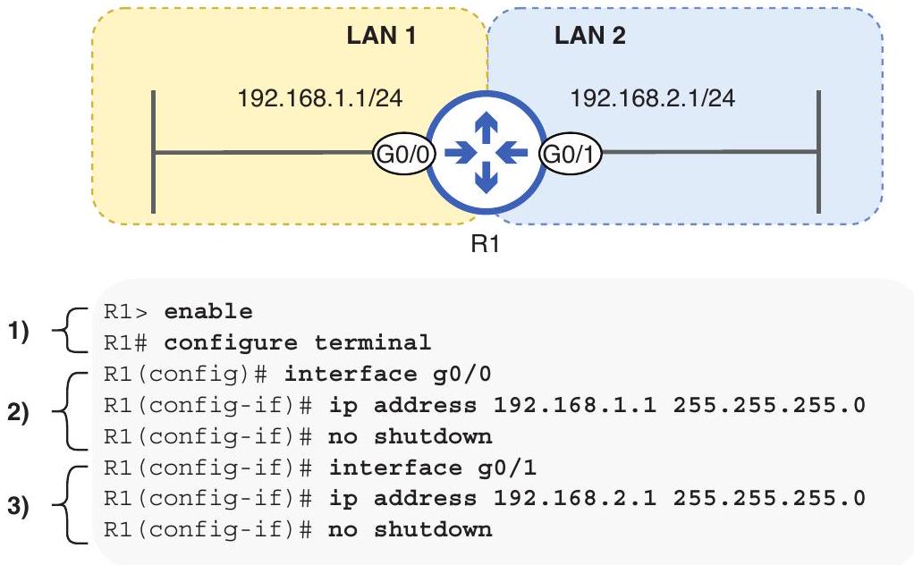
Figure 7.10 How to configure IP addresses and enable router interfaces. R1 is connected to two LANs: 192.168.1.1/24 (G0/0) and 192.168.2.1/24 (G0/1).

NOTE The switches and PCs present in figure 7.8 have been replaced with perpendicular lines at the end of the connections in figure 7.10. This is a common technique in network diagrams to indicate that a LAN is connected to an interface, but its details are not important to the diagram. Figure 7.10 focuses on R1, so there is no need to show the switches and PCs.

## Preverification

Let's confirm the default state of R1's interfaces before we configure them-before configuring a device, it's best to confirm the device's current state. A convenient command to view a router's interfaces is show ip interface brief, executed in user EXEC or privileged EXEC mode. You will be using this command a lot! The following example shows the output of the command on R1 before configuring its interfaces:

```
Views information
Views information
        about R1’s interfaces
        about R1’s interfaces
R1# show ip interface brief
Interface IP-Address OK? Method Status Protocol
GigabitEthernet0/0 unassigned YES unset administratively down down
GigabitEthernet0/1 unassigned YES unset administratively down down
GigabitEthernet0/2 unassigned YES unset administratively down down
GigabitEthernet0/3 unassigned YES unset administratively down down
    R1’s four interfaces are listed.
```

The Interface column lists R1's interfaces-it has four, and we will configure two of them. The IP-Address column will list the IP address of each interface after we have configured them, but currently it just states unassigned.

The Status column lists the physical status of each interface. If the interface is connected to another device, the status will be up; if it isn't, the Status will be down, and if the interface is manually disabled, it will be administratively down (regardless of whether it is connected to another device). As shown earlier, the default state is administratively down-Cisco router interfaces are disabled by default and must be manually enabled.

The Protocol column indicates whether the Layer 2 protocol of the interface is functioning properly. For an Ethernet interface, this is fairly simple-if the Status column says up, the Protocol should be up as well. If the Status column says down or administratively down, the Protocol should be down.

## Configuration

To configure a device's interfaces, we must use a new mode in the hierarchy of the IOS CLI: interface configuration mode. To access interface configuration mode, use the interface interface-name command from the global configuration mode. The following example demonstrates this:
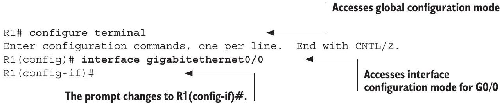

Notice that the prompt changes from R1 (config) \# to R1 (config-if) \#, indicating interface configuration mode. The name of the interface you are configuring isn't shown in the prompt, so before doing any configurations, I recommend doublechecking that you used the correct interface name after the interface command.

> NOTE Instead of using the interface gigabitethernet0/0 command to enter interface configuration mode for the G0/0 interface, you can use interface g0/0-there is no need to type out the full interface name.

The command to configure an interface's IP address is ip address ip-address netmask; as I mentioned previously, you need to know netmasks when configuring IP addresses in Cisco IOS. In the following example, I configure the IP address of R1's G0/0 interface. The netmask is 255.255.255.0 because the prefix length is /24-the first 24 bits of the netmask are set to 1, and the last 8 are set to 0:
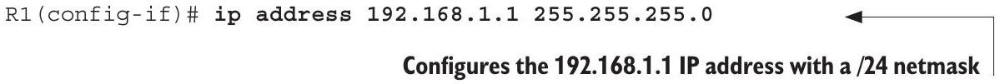

However, G0/0 still isn't ready to forward traffic; the interface is still disabled. To change that, you must use the no shutdown command, as shown in the following example. After issuing the command, two messages are displayed, indicating that the interface is up and running. The first message indicates that the interface is physically operational (the Status column of show ip interface brief), and the second message indicates that the Layer 2 protocol is operational (the Protocol column of show ip interface brief):
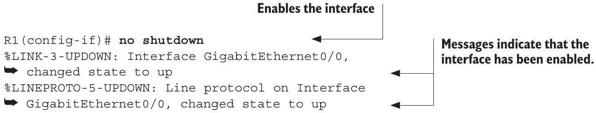

NOTE As mentioned in chapter 5, no can be used in front of a command to remove it from the configuration. Router interfaces are disabled by default because they have the shutdown command applied to them; the no shutdown command removes it and therefore enables the interface.

R1's G0/0 interface now has an IP address and is enabled-it's ready to forward traffic. Next let's configure the G0/1 interface, as in the following example:
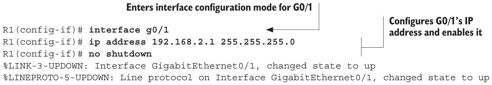

NOTE To access interface configuration mode for another interface, you don't have to return to global configuration mode; you can do it directly from interface configuration mode. Note that there is no indication that I switched from configuring G0/0 to G0/1-again, always double-check that you used the correct interface name after the interface command.

## Final verification

R1's G0/0 and G0/1 are both configured and enabled. After configuration, it's always a good idea to verify that the configurations are correct. In the following example, I once again used the show ip interface brief command to verify:

```
R1# show ip interface brief
Interface IP-Address OK? Method Status Protocol
GigabitEthernet0/0 192.168.1.1 YES manual up up
GigabitEthernet0/1 192.168.2.1 YES manual up up
GigabitEthernet0/2 unassigned YES unset administratively down down
GigabitEthernet0/3 unassigned YES unset administratively down down
```

G0/0 and G0/1 each have an IP address and are up/up.

Notice that $\mathrm{G} 0 / 0$ and $\mathrm{G} 0 / 1$ both have the correct IP addresses and are up in both the Status and Protocol columns. However, show ip interface brief doesn't display the netmask. To double-check that the netmask is correct, you can use the show ip interface [interface-name] command, as in the following example. Notice that, although you must use a netmask when configuring IP addresses, the prefix length is displayed as /X in the output of this command. This command shows a lot of output, so I am only including the first few lines of each interface:
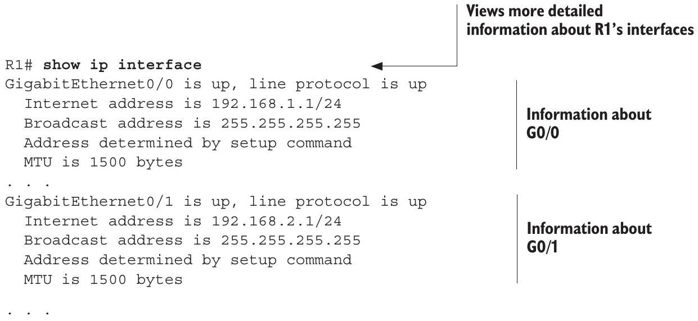

NOTE When stating the format of a command, keywords and arguments in square brackets are optional. The show ip interface command is valid on its own and shows information for all interfaces; however, show ip interface g0/0 limits the output to only the stated interface.

In addition to the prefix length, there are two more things I would like to point out about the previous output, related to other topics covered in this chapter: first, the line Broadcast address is 255.255.255.255 indicates the IP address that will be used to send a message to all hosts in the local network: 255.255.255.255. This is a specially reserved IP address for broadcast packets. If R1 wants to send a message to all hosts in LAN 1, it will send a packet addressed to 255.255.255.255 out of its G0/0 interface (encapsulated in a frame addressed to the MAC address ffff.ffff.ffff).

Second, the final line of the included output states MTU is 1500 bytes. As mentioned when we looked at the IPv4 header, this means that if R1 has to forward a frame larger than 1,500 bytes out of either of its interfaces, it must fragment the packet first.

NOTE After verifying that the configurations are correct, it's always a good idea to save the configuration with one of the commands covered in chapter 5: write,

```
write memory, or copy running-config startup-config.
```

R1 is now ready to forward traffic between LAN 1 and LAN 2. Figure 7.11 shows how PC1 can send a packet to PC3 via R1; PC1 sends the packet in a frame addressed to the MAC address of R1's G0/0 interface, and then R1 forwards the packet in a frame addressed to the MAC address of PC3. Remember that Layer 3 provides end-to-end delivery, and Layer 2 provides hop-to-hop delivery. Although not shown in the diagram, before PC1 can encapsulate the packet in a frame, it must use ARP to learn R1 G0/0's MAC address. Likewise, R1 must use ARP to learn PC3's MAC address.

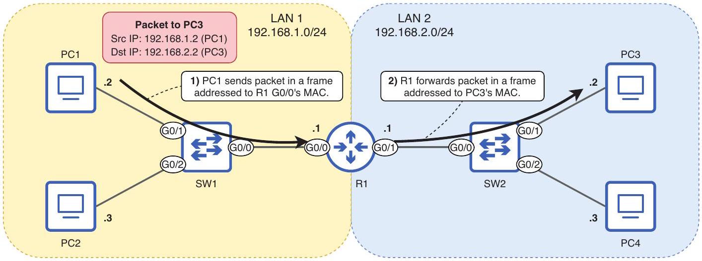
Figure 7.11 PC1 sends a packet to PC3 via R1. The packet is addressed to PC3's IP address. (1) PC1 sends the packet in a frame addressed to the MAC address of R1's G0/0 interface. (2) R1 forwards the packet in a frame addressed to the MAC address of PC3. For R1 to serve its purpose of connecting the two networks together, it must have an appropriate IP address on each of its interfaces, which we configured in this section.

NOTE Figure 7.11 indicates the IP address of each host differently than in previous diagrams. The network address (covered in section 7.3.3) is written next to each LAN's name, and only the host portion of each host's IP address is written next to the host. This is a common technique to reduce the amount of text in a diagram. PC1 and PC3 both have . 2 written next to them, but their IP addresses are not the same; the network portion of PC1's IP address is 192.168.1, and PC3's is 192.168.2. The same logic applies for PC2 and PC4.

For a router to forward packets to remote networks (that aren't directly connected to the router itself), additional configurations are required; we will cover those configurations in later chapters of this volume. However, in the example network shown in figure 7.11, LAN 1 and LAN 2 are both directly connected to R1-no more configurations are needed. PC1 and PC2 in LAN 1 can now communicate with PC3 and PC4 in LAN 2 via R1.

### 7.3.3 Attributes of an IPv4 network

Each IPv4 network has a few attributes you should be able to identify: the network address, broadcast address, maximum number of hosts, first usable address, and last usable address of the network.

## Network address

The network address is the first address of any network, and it is used to identify the network; it cannot be assigned to a host. An IPv4 address is a network address if all bits of its host portion are set to 0. Figure 7.12 shows an example of a network address: 192.168.100.0/24.

|  | Network portion |  |  |  |  |  |  |  |  |  |  |  |  |  |  |  |  |  |  |  |  |  |  |  |  |  |  |  |  |  |  |
| :--- | :--- | :--- | :--- | :--- | :--- | :--- | :--- | :--- | :--- | :--- | :--- | :--- | :--- | :--- | :--- | :--- | :--- | :--- | :--- | :--- | :--- | :--- | :--- | :--- | :--- | :--- | :--- | :--- | :--- | :--- | :--- |
| IP address | 192 |  |  |  |  |  |  |  |  |  |  |  |  |  |  | 100 |  |  |  |  |  |  |  | 0 |  |  |  |  |  |  |  |
|  | 1 | 1 | 0 | 0 | 0 | 0 | 0 | 0 | 1 | 1 | 0 | 1 | 0 | 0 | 0 | 0 | 1 | 1 | 0 | 0 | 1 | 0 | 0 | 0 | 0 | 0 | 0 | 0 | 0 | 0 | 0 |
| Netmask | 255 |  |  |  |  |  |  |  | 255 |  |  |  |  |  |  | 255 |  |  |  |  |  |  |  | 0 |  |  |  |  |  |  |  |
|  | 1 | 1 | 1 | 1 | 1 | 1 | 1 | 1 | 1 | 1 | 1 | 1 | 1 | 1 | 1 | 1 | 1 | 1 | 1 | 1 | 1 | 1 | 1 | 0 | 0 | 0 | 0 | 0 | 0 | 0 | 0 |

Figure 7.12 192.168.100.0 is a network address, as indicated by the host portion of 00000000. This address is used to identify the 192.168.100.0/24 network as a whole and cannot be assigned to a host. 192.168.100.100 (used in figure 7.7) is a host address in the 192.168.100.0/24 network.

## Broadcast address

The broadcast address is the last address of any network, and like the network address, it can't be assigned to a host. The broadcast address can be used to address a message to all hosts in the local network. An IPv4 address is a broadcast address if all bits of its host portion are set to 1. Figure 7.13 shows the broadcast address of the 192.168.100.0/24 network.

|  | Network portion |  |  |  |  |  |  |  |  |  |  |  |  |  |  |  |  |  |  |  |  |  |  |  |  |  |  |  |  |  |  |  |  |
| :--- | :--- | :--- | :--- | :--- | :--- | :--- | :--- | :--- | :--- | :--- | :--- | :--- | :--- | :--- | :--- | :--- | :--- | :--- | :--- | :--- | :--- | :--- | :--- | :--- | :--- | :--- | :--- | :--- | :--- | :--- | :--- | :--- | :--- |
| IP address | 192 |  |  |  |  |  |  |  |  |  |  |  |  |  |  |  | 100 |  |  |  |  |  |  |  |  | 255 |  |  |  |  |  |  |  |
|  | 1 | 1 | 0 | 0 | 0 | 0 | 0 | 0 | 1 | 1 | 0 | 1 | 0 |  | 0 | 0 | 0 | 1 | 1 | 0 |  | 0 | 1 | 0 | 0 | 1 | 1 | 1 | 1 | 1 | 1 | 1 | 1 |
| Netmask | 255 |  |  |  |  |  |  |  | 255 |  |  |  |  |  |  |  | 255 |  |  |  |  |  |  |  |  | 0 |  |  |  |  |  |  |  |
|  | 1 | 1 | 1 | 1 | 1 | 1 | 1 | 1 | 1 | 1 | 1 | 1 | 1 |  | 1 | 1 | 1 | 1 | 1 | 1 | 1 | 1 | 1 | 1 | 1 | 0 | 0 | 0 | 0 | 0 | 0 | 0 | 0 |

Figure 7.13 192.168.100.255 is a broadcast address, as indicated by the host portion of 11111111. This address can be used to address a message to all hosts in the 192.168.100.0/24 network.

NOTE To send a message to all devices on the local network, hosts will usually address messages to 255.255.255.255, rather than the broadcast address of their local network. 255.255.255.255 is a specially reserved broadcast address. However, the broadcast address 192.168.100.255 can be used by hosts in other networks to send a message to all hosts in the 192.168.100.0/24 network.

## Maximum number of hosts

The maximum number of hosts in a network is the number of IP addresses available to assign to hosts connected to the network. To calculate the total number of IP addresses in a network, the formula is $2^{\mathrm{y}}$, where $y$ is the number of host bits. For example, with a
/24 prefix length, there are eight host bits; $2^{8}$ is equal to 256, so there are 256 total IP addresses in a /24 network (such as 192.168.100.0/24).

However, because the network and broadcast addresses of each network can't be assigned to hosts, we have to subtract 2 from the total number of addresses in the network to find the maximum number of hosts. Therefore, the formula to determine the maximum number of hosts in a network is actually $2^{\mathrm{y}}-2$. For example, the maximum number of hosts of a /24 network is $254\left(2^{8}-2\right)$. The following are the maximum number of hosts in networks with /8, / 16, and / 24 prefix lengths:

- $/ 8: 2^{24}-2=16,777,214$ hosts
- / $16: 2^{16}-2=65,534$ hosts
- $/ 24: 2^{8}-2=254$ hosts

## First and last usable addresses

The first usable address of a network is the first IP address that can be assigned to a host; in other words, it's the first IP address after the network address. It is simple to calculate-just add one to the network address (change the least significant bit to 1). Figure 7.14 shows the first usable address of the 192.168.100.0/24 network.

| Network portion |  |  |  |  |  |  |  |  |  |  |  |  |  |  |  |  |  |  |  |  |  |  |  |  |  |  |  |  |
| :--- | :--- | :--- | :--- | :--- | :--- | :--- | :--- | :--- | :--- | :--- | :--- | :--- | :--- | :--- | :--- | :--- | :--- | :--- | :--- | :--- | :--- | :--- | :--- | :--- | :--- | :--- | :--- | :--- |
| IP address | 192 |  |  |  |  |  | 168 |  |  |  |  |  |  | 100 |  |  |  |  |  |  |  |  | 1 |  |  |  |  |  |
|  | 1 | 1 | 0 | 0 | 0 | 0 | 1 |  | 0 | 1 | 0 | 0 | 0 | 1 | 1 | 0 | 0 |  | 1 | 0 | 0 |  | 0 |  | 0 | 0 | 0 | 0 |
| Netmask | 255 |  |  |  |  |  | 255 |  |  |  |  |  |  | 255 |  |  |  |  |  |  |  |  | 0 |  |  |  |  |  |
|  | 1 | 1 | 1 | 1 | 1 | 1 | 1 | 1 | 1 | 1 | 1 | 1 | 1 | 1 | 1 | 1 | 1 |  | 1 | 1 | 1 | 0 |  | 0 | 0 | 0 | O | 0 |

Figure 7.14 192.168.100.1 is the first usable address of the 192.168.100.0/24 network. It is the first address after the network address.

NOTE The first usable address of a network is often assigned to that network's router. For example, in the previous section, we assigned IP addresses 192.168.1.1 and 192.168.2.1 to R1s interfaces-the first usable addresses of their respective networks.

The last usable address of a network is the last IP address that can be assigned to a host; it's the last IP address before the broadcast address. This address is also simple to find-subtract 1 from the broadcast address (change the least significant bit to 0). Figure 7.15 shows the last usable address of the 192.168.100.0/24 network.

|  | Network portion |  |  |  |  |  |  |  |  |  |  |  |  |  |  |  |  |  |  |  |  |  |  |  |  |  |  |  |  |  |  |
| :--- | :--- | :--- | :--- | :--- | :--- | :--- | :--- | :--- | :--- | :--- | :--- | :--- | :--- | :--- | :--- | :--- | :--- | :--- | :--- | :--- | :--- | :--- | :--- | :--- | :--- | :--- | :--- | :--- | :--- | :--- | :--- |
| IP address | 192 |  |  |  |  |  |  |  |  |  |  |  |  |  |  | 100 |  |  |  |  |  |  |  | 254 |  |  |  |  |  |  |  |
|  | 1 | 1 | 0 | 0 | 0 | 0 | 0 | 0 | 1 | 1 | 0 | 1 | 0 | 0 | 0 | 0 | 1 | 1 | 0 | 0 | 1 | 0 | 0 | 1 | 1 | 1 | 1 | 1 | 1 | 1 | 0 |
| Netmask | 255 |  |  |  |  |  |  |  | 255 |  |  |  |  |  |  | 255 |  |  |  |  |  |  |  | 0 |  |  |  |  |  |  |  |
|  | 1 | 1 | 1 | 1 | 1 | 1 | 1 | 1 | 1 | 1 | 1 | 1 | 1 | 1 | 1 | 1 | 1 | 1 | 1 | 1 | 1 | 1 | 1 | 0 | 0 | 0 | 0 | 0 | 0 | 0 | 0 |

Figure 7.15 192.168.100.254 is the last usable address of the 192.168.100.0/24 network. It is the last address before the broadcast address.

If you know the first and last usable addresses, you know the range of usable addresses: from the first usable address to the last usable address. For example, the range of usable addresses in the 192.168.100.0/24 network is from 192.168.100.1 to 192.168.100.254: 254 addresses in total.

## Exam scenario

On the CCNA exam, you may be asked questions that require you to identify one or more of these attributes of a network. The following is an example question:

Q: PC1's IP address is 172.20.20.127/16. What is the usable address range of the network PC1 belongs to?

A 172.20.20.1-172.20.20.254
B 172.20.20.0-172.20.20.255
c 172.20.0.1-172.20.255.254
D 172.20.0.0-172.20.255.255

To find the usable address range of a network, you need to know the first and last usable addresses of the network. This is fairly simple when using a prefix length of /8, /16, or /24; the division between the network portion and host portion is between octets (in this case, between the second and third octets, because the prefix length is $/ 16$ ).

To find the first usable address, simply change the octet(s) of the host portion to 0 (this is the network address), and then add 1 to the last octet: PC1's address is 172.20.20.127, the network address is 172.20.0.0, and the first usable address is 172.20.0.1.

To find the last usable address, change the octet(s) of the host portion to 255 (this is the broadcast address), and then subtract 1 from the last octet: PC1's address is 172.20.20.127, the broadcast address is 172.20.255.255, and the last usable address is 172.20.255.254. Now you know the usable address range: from 172.20.0.1 to 172.20.255.254. Therefore, the answer to this question is C.

This process will become more challenging when we cover subnetting in chapter 11 of this book. When subnetting, we use prefix lengths that do not fit neatly between octets of an IP address, such as /19, /23, /28, etc. In that case, it is important to be proficient at converting between decimal and binary so you can identify the network and host bits, convert the host bits to 0 or 1 as necessary, convert them back to decimal, etc.

### 7.3.4 IPv4 address classes

Originally, all IPv4 addresses used a /8 prefix length; the first octet identified the network, and the last three octets identified the specific host within that network. However, that system was soon abandoned; because only the first 8 bits could be used to make different networks, there could only be $256\left(2^{8}\right)$ different networks (LANs): from 0.x.x.x to 255.x.x.x. In the modern world where the internet is ubiquitous, that is not nearly enough networks.

NOTE The formula to calculate the number of available networks is $2^{\mathrm{x}}$, where $x$ is the number of bits in the network portion.

To improve that system and allow for more networks of various sizes, IPv4 addresses were organized into five classes: class A, class B, class C, class D, and class E. Table 7.2 lists the five IPv4 address classes and some information about them.

Table 7.2 IPv4 address classes
| Class | First octet bit pattern | First octet decimal range | Prefix length | Note |
| :--- | :--- | :--- | :--- | :--- |
| A | Oxxxxxxx | 0-127 | /8 | Address range: 0.0.0.0-127.255.255.255 |
| B | 10xxxxxx | 128-191 | /16 | Address range: 128.0.0.0-191.255.255.255 |
| C | 110xxxxx | 192-223 | /24 | Address range: 192.0.0.0 to 223.255.255.255 |
| D | 1110xxxx | 224-239 |  | Reserved for multicast addresses |
| E | 1111xxxx | 240-255 |  | Reserved for experimental purposes |


The class of an IPv4 address is determined by the first 1 to 4 bits of the address; class A addresses begin with 0, class B addresses begin with 10, class C addresses begin with 110, class D addresses begin with 1110, and class E addresses begin with 1111. Classes A, B, and C are the ranges from which hosts are assigned IPv4 addresses. For example, the IP addresses we configured on R1 in this chapter are from the class C range. Classes D and E are reserved for particular purposes; we won't cover them in this book, except for a few mentions of multicast IP addresses (class D).

NOTE Some addresses in each class are reserved for special purposes and can't be assigned to hosts. For example, class A addresses with a first octet of 0 or 127 are reserved.

Classes A, B, and C each use a specific prefix length: class A addresses use a /8 prefix length (netmask 255.0.0.0), class B addresses use a /16 prefix length (netmask 255.255.0.0), and class C addresses use a /24 prefix length (netmask 255.255.255.0). Because an IPv4 address is always 32 bits in length, if the network portion is larger, the host portion is smaller (and vice versa). This gives some characteristics to each class:

- Few class A networks exist (128), but each class A network contains many addresses (16,777,216).
- Class B networks are a middle ground. There are 16,384 class B networks, each containing 65,536 addresses.
- Many class C networks exist (2,097,152), but each class C network contains relatively few addresses (256).

Figure 7.16 represents these characteristics visually. A larger network portion means a smaller host portion and vice versa. There is a tradeoff between the two.

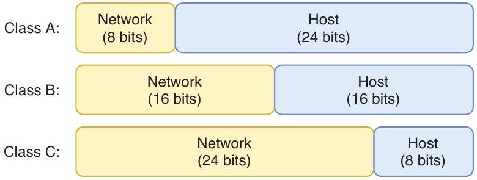
Figure 7.16 The network portion and host portion sizes of class A, class B, and class C IPv4 addresses

Class A networks were intended for very large organizations such as Internet Service Providers and the United States Department of Defense (DoD); the vast majority of organizations don't need anywhere near 16,777,216 IP addresses. Class B networks were intended for medium- to large-sized businesses, and class C for small- to mediumsized businesses.

Table 7.3 summarizes the characteristics of classes A, B, and C. You don't have to memorize the number of networks and addresses per network for each address class; just understand that a smaller network portion means fewer networks with more hosts in each network, and a larger network portion means more networks with fewer hosts in each network.

Table 7.3 Characteristics of classes A, B, and C
| Class | First octet | Size of network portion | Size of host portion | Number of networks | Addresses per network |
| :--- | :--- | :--- | :--- | :--- | :--- |
| A | 0xxxxxxx | 8 bits | 24 bits | $128\left(2^{7}\right)$ | 16,777,216 $\left(2^{24}\right)$ |
| B | 10xxxxxx | 16 bits | 16 bits | 16,384 $\left(2^{14}\right)$ | $65,536\left(2^{16}\right)$ |
| C | 110xxxxx | 24 bits | 8 bits | 2,097,152 (2 ${ }^{21}$ ) | $256\left(2^{8}\right)$ |


NOTE The reason why there are only $2^{7}$ class A networks, even though the network portion is 8 bits in length, is that the first bit is fixed as 0-only 7 bits are available to change and make different networks. The same reasoning applies for why there are $2^{14}$ class B networks (not $2^{16}$ ) and $2^{21}$ class C networks (not $2^{24}$ ).

Networks that follow the class A, B, and C rules are called classful networks. Although important to study and understand even today, this system is now obsolete and has been replaced with classless networking, a system in which prefix lengths are not restricted by class. We will cover this in chapter 11 when we look at subnetting.

## Reserved addresses

Within each address class, there are several ranges of IP addresses that are reserved and cannot be assigned to hosts. Here are two examples:

- 0.0.0.0/8: Any IP address that begins with the first octet 0 is reserved.
- 127.0.0.0/8: This range is reserved for loopback addresses. A message sent to any IP address in this range (i.e., ping 127.0.0.1) will be looped back to the local host-the device you are working on-without being transmitted over the network. This can be used to test the networking software on the local device.

## Summary

- The IPv4 header is 20 to 60 bytes in length and contains 14 fields.
- The Version field indicates the version of IP (IPv4 or IPv6).
- The Internet Header Length (IHL) field indicates the length of the header in 4-byte increments.
- The Differentiated Services Code Point (DSCP) and Explicit Congestion Notification (ECN) fields are used to prioritize certain kinds of traffic. This is called Quality of Service (QoS).
- The Total Length field indicates the length of the entire packet in bytes.
- The Identification, Flags, and Fragment Offset fields support packet fragmentation. If a packet is larger than an interface's Maximum Transmission Unit (MTU), the router will divide the packet into multiple smaller packets called fragments. The standard MTU is 1500 bytes.
- The Time To Live (TTL) field is used to prevent packets from looping indefinitely around the network. Each time a router forwards a packet, its TTL is decremented by 1 , and if it reaches 0 , the packet is dropped.
- The Protocol field indicates the type of message encapsulated inside of the packet, such as ICMP, TCP, UDP, or OSPF.
- The Header Checksum field is used to check for errors in the IPv4 header.
- The Source Address field contains the IPv4 address of the host that sent the packet.
- The Destination Address field contains the IPv4 address of the packet's intended recipient.
- The Options field is optional and variable in length-from 0 bytes (if not used) to a maximum of 40 bytes in length. This field is rarely used.

- The decimal number system uses 10 digits: 0, 1, 2, 3, 4, 5, 6, 7, 8, and 9. It is also called base 10. The value of each digit position increases tenfold: 1, 10, 100, 1000, etc.
- The binary number system uses two digits: 0 and 1. It is also called base 2. The value of each digit position increases twofold: 1, 2, 4, 8, 16, 32, 64, 128, etc.
- An 8-bit binary number provides 256 possible values: from 0d0 (00000000) to 0d255 (11111111).
- For the CCNA exam, you must be able to convert between binary and decimal for numbers of up to 8 bits in length. You can practice at https://learningnetwork .cisco.com/s/binary-game.
- An IPv4 address is a 32-bit number that identifies a host at Layer 3. It is divided into four groups of 8 bits called octets and written in dotted decimal notation.
- IPv4 addresses are divided into two parts: the network portion and the host portion. All hosts within a LAN will have the same network portion but a unique host portion.
- The size of the network portion can be indicated with a prefix length in the format /X, where X is the number of bits in the network portion. Any bits that are not part of the network portion are part of the host portion.
- The size of the network portion can also be indicated with a netmask (also called a subnet mask). A netmask is a string of 32 bits that is paired with an IP address to indicate which bits of the IP address are the network portion and which are the host portion.
- A 1 in the netmask means the bit in the same position as the IP address is part of the network portion. A 0 in the netmask means the bit in the same position as the IP address is part of the host portion.
- The show ip interface brief command lists a router's interface and information about their IP addresses and status.
- The show ip interface [interface-name] command shows more detail about each interface.
- Router interfaces are disabled by default and must be enabled with the no shutdown command.
- Interface configuration mode can be accessed with the interface interface -name command from global configuration mode.
- An interface's IPv4 address can be configured with the ip address ip-address netmask command in interface configuration mode.
- The network address of a network is the first address of the network, with a host portion of all 0s. It is used to identify the network and cannot be assigned to a host.
- The broadcast address of a network is the last address of the network, with a host portion of all 1s. It can be used to send a message to all hosts in the network.

However, to send a message to all hosts on the local network, the address 255.255.255.255 is usually used.
- The maximum number of hosts of a network is the number of IP addresses that can be assigned to hosts. The formula is $2^{\mathrm{y}}-2$, where $y$ is the number of bits in the host portion. Two is subtracted for the network and broadcast addresses.
- The first usable address of a network is the first address that can be assigned to a host. The last usable address is the last address that can be assigned to a host.
- IPv4 addresses can be organized into five classes: A, B, C, D, and E. Class D is reserved for multicast addresses, and Class E is reserved for experimental purposes. Addresses from classes A, B, and C are assigned to network hosts.
- Class A addresses have a first octet of 0-127 and use a /8 prefix length. Class B addresses have a first octet of 128-191 and use a /16 prefix length. Class C addresses have a first octet of 192-223 and use a /24 prefix length.
- Networks that follow class A, B, and C rules are called classful networks. This system is now obsolete and has been replaced with classless networking, which is more flexible.

## Router and switch interfaces

## This chapter covers

- How to configure interfaces and verify their status
- Interface speed and duplex settings
- Using autonegotiation to automatically determine an interface's speed and duplex
- Errors that can occur when sending and receiving messages over a network

In chapter 7, we looked at how to configure IP addresses on and enable router interfaces. In this chapter, we will dig deeper into the topic of interfaces and how they operate. Whereas the previous chapter covered how to configure IP addresses on interfaces (a Layer 3 concept), this chapter will focus primarily on Layer 1 concepts, such as how to configure the speed at which an interface can send and receive data. Specifically, we will cover the following CCNA exam topics:

- 1.3.b Connections (Ethernet shared media and point-to-point)
- 1.4 Identify interface and cable issues (collisions, errors, mismatch duplex, and/or speed)

In previous chapters, I have used the terms port and interface. The exact definitions of these terms depend on who you ask; some say a port is a Layer 2 entity that forwards frames within a LAN (switches have ports), and an interface is a Layer 3 entity that forwards packets between LANs (routers have interfaces). Another definition is that a port is the physical connector on a device that you plug a cable into, and an interface is the representation of that port within the software (hence, most Cisco IOS commands use the term interface rather than port).

In reality, these terms are often used interchangeably-even Cisco's documentation isn't consistent regarding these terms. In this book, I will generally use the term port to refer to a physical connector on a device and interface when talking about configurations, except in situations where one term is generally accepted as the standard over the other (in which case I will point that out).

### 8.1 Configuring interfaces

In this section, we will look at how to configure three aspects of an interface: description, speed, and duplex. Figure 8.1 shows how to configure these settings on Cisco routers and switches running Cisco IOS.


Figure 8.1 Interface configurations on R1 and SW1: (1) configuring R1's G0/1 interface with an IP address, description, and manual speed and duplex settings; (2) configuring SW1's G0/1 interface with a description, and manual speed and duplex settings; (3) configuring SW1's connections to end-user devices (PCs) using autonegotiation; (4) disabling SW1's unused interfaces.

Before we examine the configurations in figure 8.1 in detail, there are a couple of things worth mentioning that illustrate some differences between routers and switches. First, notice that I configured an IP address on R1's G0/1 interface but not on SW1's interfaces; this is because switch interfaces don't need IP addresses to perform their role of forwarding frames within a LAN. Switches are not Layer 3 aware; they only use Layer 2 information (MAC addresses) to decide how to forward frames.

The second point is that I used no shutdown on R1's G0/1 interface to enable it but not on SW1's G0/1, F0/1, or F0/2 interfaces. That is because, unlike router interfaces, which are disabled by default, switch interfaces are enabled by default.

EXAM TIP In figure 8.1, I used shutdown to disable SW1's unused ports. This is considered a security best practice.

Switch interfaces are enabled by default to allow switches to operate in a plug-and-play manner; this means that to use the switch, you simply need to connect devices to it-no configuration is required. However, although a switch does not require configuration to perform its most basic function of forwarding frames, most enterprise networks will require configurations on switches to use more advanced features (which we will cover in both volumes of this book).

NOTE A switch that is designed to be used in a plug-and-play manner is called an unmanaged switch. Unmanaged switches are inexpensive and are sometimes used in very small networks. The CCNA focuses on managed switches, which allow you to configure more advanced features.

### 8.1.1 Interface descriptions

An interface description is a simple string of text that you can configure to describe or name an interface. A common use is to indicate what device is connected to the interface. The command to configure an interface's description is description description, where description is a string of text such as "connected to R1's G0/1 interface." The following example shows how I configured the descriptions of SW1's F0/1 and F0/2 interfaces. F0/1 and F0/2 are connected to end-user devices (PCs), so I configured their descriptions as \#\# end users \#\#:


NOTE The two hash symbols (\#\#) at the beginning and end of the description are not necessary. I use them in my interface descriptions to help them stand out when viewing them in the CLI.

Notice that I used the interface range $\mathrm{f} 0 / 1-2$ command to configure SW1's F0/1 and F0/2 interfaces at the same time; interface range can be a big timesaver when configuring multiple interfaces! The command to configure a range of interfaces is interface range type slot/port-port. Let me explain each of those arguments in the command:

- type means Ethernet, FastEthernet, GigabitEthernet, etc.
- slot is the first number in the interface name.
- port is the second number in the interface name.

NOTE Another example from figure 8.1 is interface range $\mathrm{f} 0 / 3-8, \mathrm{~g} 0 / 2$. This configures F0/3, F0/4, F0/5, F0/6, F0/7, F0/8, and G0/2. To include interfaces of a different type in the same interface range command, you must separate the interface names with a comma.

Interface descriptions are optional, but I highly recommend configuring them; interface descriptions that are consistently configured and updated as needed make it much easier to identify the purpose of each interface when viewing the configurations at a later date.

To view interface descriptions on a router or switch, you can use the show interfaces description command. The following example shows the output of that command after configuring SW1's interface descriptions (some output is omitted for the sake of space). Note that the command also lists the Layer 1 status (Status) and Layer 2 status (Protocol) of each interface:

```
Views a list of interfaces
    and their descriptions
SW1# show interfaces description
Interface Status Protocol Description
Fa0/1 up up ## end users ##
Fa0/2 up up ## end users ##
Fa0/3 down down ## not in use ##
. . .
Gio/1 up up ## to R1 ##
Gi0/2 down down ## not in use ##
```

Another command that can be used to view interface descriptions is show interfaces status. However, this command only works on switches, not on routers. We will use this command in the next few sections as well, as it also shows information about the interface speed and duplex. The following example shows the output of this command (the descriptions are displayed in the Name column):

```
SW1# show interfaces status
```

| Port | Name | Status | Vlan | Duplex | Speed | Type |
| :--- | :--- | :--- | :--- | :--- | :--- | :--- |
| Fa0/1 | \#\# end users \#\# | connected | 1 | a-full | a-100 | 10/100BaseTX |
| Fa0/2 | \#\# end users \#\# | connected | 1 | a-full | a-100 | 10/100BaseTX |
| Fa0/3 | \#\# not in use \#\# | motconnect | 1 | auto | auto | 10/100BaseTX |
| . . . |  |  |  |  |  |  |
| Gi0/1 | \#\# to R1 \#\# | connected | 1 | a-full | a-1000 | 10/100/1000BaseTX |
| Gi0/2 | \#\# not in use \#\# | notconnect | 1 | auto | auto | 10/100/1000BaseTX |

### 8.1.2 Interface speed

An interface's speed is the maximum rate at which it can send and receive traffic, measured in bits per second. Most interfaces support multiple speeds-for example, most FastEthernet interfaces support speeds of both 10 and 100 Mbps-in which case they can be called 10/100 interfaces. Likewise, most GigabitEthernet interfaces support speeds of 10, 100, and 1,000 Mbps (1 Gbps) and are therefore called 10/100/1000 interfaces. Ideally, an interface will operate at its maximum speed, but if connected to a device that only supports slower speeds, it's important that an interface can match the speed of the other device.

The speed at which an interface operates can be manually configured or automatically determined by the device using a process called autonegotiation, in which the connected devices communicate with each other to determine at what speed they should operate. Cisco IOS devices use autonegotiation by default, and in most cases, you can leave autonegotiation enabled. However, there are cases where you should manually configure an interface's speed, such as when the neighboring device does not use autonegotiation. The command to manually configure an interface's speed is speed \{speed | auto\}, where speed is specified in megabits per second.

NOTE When writing the syntax of a command, options in curly braces are a mandatory choice. In the speed command, you must either specify the speed value or use auto to enable autonegotiation.

In the following example, I use context-sensitive help to show the available options when configuring the speed of SW1's G0/1 interface: 10, 100, 1000, and auto. I then manually configure the speed at 1 Gbps (1,000 Mbps) and use show running-config interface g0/1 to verify the interface's configuration:

```
SW1(config)# interface g0/1
SW1(config-if) # speed ?
    10 Force 10 Mbps operation
    100 Force 100 Mbps operation
    1000 Force 1000 Mbps operation
    auto Enable AUTO speed configuration
SW1(config-if) # speed 1000
```

```
SW1(config-if)# do show running-config interface g0/1
. . .
interface GigabitEthernet0/1
    description ## to R1 ##
    speed 1000
End
```

NOTE You can use the show running-config interface interface-name command to view the active configurations for a specific interface. To view the active configurations for all interfaces, use show running-config | section interface.

In the next example, I configure speed auto on SW1's F0/1 and F0/2 interfaces and then view F0/1's configuration. However, speed auto is not shown because it is the default setting. To avoid clutter in a device's configuration files, many default settings are hidden:


NOTE In figure 8.1 and the previous example, I configured speed auto, but because that is the default setting, it is not actually necessary to issue that command.

### 8.1.3 Interface duplex

An interface's duplex setting refers to whether it is able to send and receive data at the same time or not. There are two types of duplex:

- Half duplex-The interface can send and receive data but not at the same time.
- Full duplex-The interface can send and receive data at the same time.

NOTE The opposite of duplex is simplex, which is one-way communication. The communication from a keyboard to a computer is an example of simplex communication; the keyboard sends data to the computer, but the computer does not send data to the keyboard.

An example of half-duplex communication is an IEEE 802.11 wireless LAN (Wi-Fi). Because devices connected to a wireless LAN share the same physical medium (radio frequency), devices must wait their turn to communicate; they cannot send and receive data at the same time. We will focus on wireless LANs in part 4 of volume 2 of this book, but for now we will focus on wired LANs using Ethernet.

An example of full-duplex communication is a wired Ethernet LAN using a switch (or switches). Devices connected to a switch are able to send and receive traffic at the same time, which allows much greater performance compared to half duplex. However, devices connected to a wired LAN weren't always able to operate in full duplex. Before switches, devices called hubs were used to connect devices in a LAN, and devices connected to a hub had to operate in half-duplex mode (these days, hubs are almost never used).

## Ethernet hubs

To understand duplex, let's examine one of the precursors to the Ethernet switch: the Ethernet hub. The basic role of a hub is the same as a switch: to connect hosts in a LAN. Switches use Layer 2 information (MAC addresses) to forward frames to the appropriate destination (or flood them as necessary). Hubs, on the other hand, aren't Layer 2 aware; when bits of data are received on one port, they simply repeat those bits out of all other ports. This means that all devices in the LAN receive every frame sent in the LAN; each device then examines the destination MAC address of the frame to determine whether it should keep or discard the frame. Hubs are considered Layer 1 devices; they receive and repeat electrical signals but don't examine those signals to make forwarding decisions.

A major downside of hubs is that they do not have memory to store frames before flooding them. Therefore, if two devices connected to a hub attempt to send frames at the same time, the hub will attempt to flood both frames at the same time, resulting in a garbled mess rather than two coherent messages; this is called a collision, and all devices connected to a hub are said to be in the same collision domain. Only one device in a collision domain can send traffic at a time without causing collisions. Thus, devices connected to a hub must operate in half duplex, not full duplex.

## Collision domains

A collision occurs when two messages are sent simultaneously over a shared medium and then collide, resulting in an incoherent signal-like if two people talk at the same time, making you unable to understand either of them. A collision domain is a network segment in which simultaneous transmission will result in collisions. As mentioned previously, all hosts connected to a hub are in the same collision domain; this means that only one can transmit at a time. While one host is transmitting, the others can only receive data-they have to wait their turn to transmit. Figure 8.2 shows what happens when two hosts connected to a hub attempt to transmit at the same time.


Figure 8.2 Four PCs are connected to a hub, and two attempt to transmit at the same time, resulting in collisions. All four PCs are in the same collision domain. (1) PC2 sends a frame addressed to PC1's MAC address, and PC4 sends a frame addressed to PC3's MAC address. (2) The hub attempts to flood both frames at the same time, resulting in collisions. Neither PC1 nor PC3 receive their respective frames intact.

Unlike hosts connected to a hub, each host connected to a switch is in its own collision domain; switches are able to store frames in memory and forward (or flood) them one after the other, avoiding collisions. This means that hosts connected to a switch can operate in full-duplex mode; all devices in the LAN can send and receive traffic at the same time, with no worry of messages colliding.

NOTE Exam topic 1.3.b states, "Connections (Ethernet shared media and pointto-point)." All devices connected to a hub are connected to a shared medium; each device has to share the medium and wait its turn to transmit. Connections to a switch are considered Ethernet point-to-point connections-connections between only two devices: the switch and its connected device. Devices connected to a switch do not have to share the medium-they do not have to wait their turn to transmit.

Collisions should not occur in a switched LAN; if collisions occur, it is an indicator of a problem in the network (we will cover some possible problems in section 8.3). Figure 8.3 shows how a switch is able to flood frames one after the other without causing collisions.


Figure 8.3 Four PCs are connected to a switch, each in its own collision domain. (1) PC2 and PC4 each send a broadcast frame at the same time. (2) The switch floods the frames, but it does not flood PC2's frame to PC1 or PC3; it buffers the frame in memory. (3) The switch floods PC2's frame to PC1 and PC3 after it has finished flooding PC4's frame.

## Carrier-sense multiple access with collision detection

To facilitate communications over a shared medium (a LAN using a hub), devices use a method called carrier-sense multiple access with collision detection (CSMA/CD). Let's examine each part of that title:

- Carrier-sense means that devices will attempt to sense whether the medium is in use (by "listening" for electrical signals) before transmitting a message.
- Multiple access means that a shared medium is used (i.e., accessed by multiple devices).
- Collision detection means that if a collision occurs, devices connected to the medium will detect it (and send a signal to notify other devices of the collision).

CSMA/CD helps devices connected to a hub avoid collisions and deal with collisions when they inevitably happen; interfaces operating in half-duplex mode must use CSMA/CD. The CSMA/CD process is as follows:

1 Before sending a frame, devices wait until they detect that other devices are not sending.
2 When a collision occurs, devices that detect the collision will send a jamming signal to inform the other devices of the collision.
3 Each device then waits a random period of time before sending frames again.
4 The process repeats.

EXAM TIP Hubs are rarely used in modern networks, having been almost entirely replaced by switches. However, collisions, collision domains, and CSMA/CD are foundational networking concepts that may appear on the CCNA exam.

## Configuring an interface duplex

Like an interface's speed, its duplex can also be manually configured or automatically determined using autonegotiation. The command to configure an interface's duplex is duplex \{auto | full | half\}, and the default setting is auto (which uses autonegotiation). Let's configure SW1's interface duplex settings, as in the example in figure 8.1. In the following example, I first confirm the current status with show interfaces

```
status:
SW1# show interfaces status
```

| Port | Name | Vlan | Duplex | Speed Type |
| :--- | :--- | :--- | :--- | :--- |
| Fa0/1 | \#\# end users \#\# | 1 | a-full | a-100 10/100BaseTX |
| Fa0/2 | \#\# end users \#\# | 1 | a-full | a-100 10/100BaseTX |
| Fa0/3 | \#\# not in use \#\# | 1 | auto | auto 10/100BaseTX |
| . . . |  |  |  |  |
| Gi0/1 | \#\# to R1 \#\# | 1 | a-full | 1000 10/100/1000BaseTX |
| Gi0/2 | \#\# not in use \#\# | 1 | auto | auto 10/100/1000BaseTX |

The prefix a - indicates autonegotiation.

Note that the current duplex state for SW1's active interfaces (F0/1, F0/2, and G0/1) is a-full. This means that they are operating in full duplex, which was decided using autonegotiation. Interfaces that are not active (i.e., not connected to another device) are auto, meaning autonegotiation is enabled, but SW1 hasn't decided if those interfaces will operate in half or full duplex (because they aren't connected to another device yet).

NOTE In the Speed column of the previous example, F0/1 and F0/2 show a-100, meaning autonegotiation was used to decide on a speed of 100 Mbps. G0/1 simply displays 1000, because I manually configured a speed of 1,000 Mbps.

Next, let's configure the duplex of SW1's interfaces according to figure 8.1. In the following example, I do so and then confirm with show interfaces status:

```
SW1# configure terminal
SW1(config)# interface g0/1
SW1(config-if) # duplex full
```


Notice that G0/1's duplex has changed from a-full to full; this means the interface was manually configured to operate in full duplex. The output for F0/1 and F0/2, however, does not change. As with speed auto, duplex auto is the default setting, so it is not necessary to issue the command to enable autonegotiation-I include it in the example to demonstrate that.

NOTE Although duplex is an important concept to understand, in modern wired networks, you can expect all devices to operate in full duplex; there's no reason to use half duplex. However, wireless LANs operate in half duplex, so we will return to the topic of half duplex when we cover wireless LANs in part 4 of volume 2 of this book.

### 8.2 Autonegotiation

In section 8.1, we learned that autonegotiation can be used to automatically determine the speed and duplex at which an interface operates without manual configuration. In most cases, you can leave autonegotiation enabled without any issues, although some engineers prefer to manually configure speed and duplex for connections between network infrastructure devices (such as between routers and switches). The reason for this is that manually configuring the speed and duplex settings means that there is one less thing to potentially not work properly (autonegotiation) and cause problems. However, manual configuration does include the potential for human error, and it is extremely rare for autonegotiation to malfunction, so this is not a hard-and-fast rule.

In either case, it is best to leave autonegotiation enabled for connections to end devices such as PCs. Different end devices might support different speeds, and manually configuring speed settings for each PC (or other end device) in a network is often not feasible.

In the autonegotiation process, each device advertises its capabilities to its neighbor, and the two agree upon the best operational mode supported by both neighbors. Table 8.1 lists some operational modes in order of priority-greater speeds are prioritized over lesser speeds, and full duplex is prioritized over half duplex (as you would probably expect).

Table 8.1 Operational modes
| Priority | Operational mode |
| :--- | :--- |
| 1 | 10 Gbps, full duplex |
| 2 | 1 Gbps, full duplex |
| 3 | 100 Mbps, full duplex |
| 4 | 100 Mbps, half duplex |
| 5 | 10 Mbps, full duplex |
| 6 | 10 Mbps, half duplex |


NOTE Table 8.1 only includes full duplex for 10 and 1 Gbps. 1 Gbps/half duplex is possible, but devices that support it are very rare; you can't configure that combination on a Cisco device, for example. Speeds of 10 Gbps or greater do not support half duplex, only full duplex.

Figure 8.4 shows an example of autonegotiation between a router and a switch. After each device advertises its capabilities, it chooses the best mode shared by both devices (100 Mbps, full duplex).


Figure 8.4 A router and a switch advertise their speed and duplex capabilities to each other. The best option supported by both R1 and SW1 is 100 Mbps/full duplex, as highlighted in bold. Although R1 G0/1 is capable of $\mathbf{1} \mathbf{~ G b p s} /$ full duplex, it will operate at $\mathbf{1 0 0 ~ M b p s} /$ full duplex to match SW1 F0/1.

Figure 8.4 demonstrates what happens when both devices are using autonegotiation, but what if speed and duplex are manually configured on one end of the connection and autonegotiation is used on the other end? In such a situation, the device with autonegotiation enabled will behave as follows:

- Speed-Tries to sense the speed at which the other device is operating. If that fails, uses the slowest supported speed (i.e., 10 Mbps on a 10/100/1000 interface).
- Duplex-If the speed is 10 or 100 Mbps, uses half duplex. If the speed is 1,000 Mbps or greater, uses full duplex.

These behaviors can result in some problems, and figure 8.5 demonstrates one of those problems. R1 G0/1 is using autonegotiation, but SW1 F0/1's speed and duplex are manually configured. R1 is able to sense the speed at which SW1 F0/1 is operating (100 Mbps) and match its speed. However, following the previously stated rules, R1 G0/1 operates in half duplex, not full duplex. This creates a duplex mismatch. If R1 fails to sense SW1's operating speed, R1 G0/1 will operate at 10 Mbps, resulting in a speed mismatch. We will cover speed and duplex mismatches in section 8.3.


Figure 8.5 A router and switch are connected, but only the router is using autonegotiation. R1 senses SW1's speed (100 Mbps) and matches its speed to SW1. However, because R1 G0/1 is operating at 100 Mbps, it operates in half duplex. This creates a duplex mismatch between R1 G0/1 (half duplex) and SW1 F0/1 (full duplex).

EXAM TIP An autonegotiation-enabled device's behavior when connected to a device with manually configured speed and duplex settings is a potential exam question. Be aware of how the autonegotiation-enabled device will select its operational speed and duplex, as well as the possible negative results (speed or duplex mismatch).

### 8.3 Interface errors

Cisco IOS devices maintain various counters to keep track of errors encountered when sending or receiving messages (such as when messages collide). When a device encounters errors while sending or receiving messages on an interface, it increments the relevant counter(s). You can view these counters in the output of show interfaces, as shown in the following example:


Various errors and statistics are listed at the bottom of the output.

```
0 unknown protocol drops
0 babbles, 0 late collision, 0 deferred
0 lost carrier, 0 no carrier, 0 pause output
0 output buffer failures, 0 output buffers swapped out
```

I have highlighted some errors in the output that you should be able to identify for the CCNA. Let's take a look at what each error type means:

- Runts are frames received that are smaller than the minimum frame size, which is 64 bytes. When a device wants to send a frame smaller than 64 bytes, it is supposed to add padding (bytes of all 0s) to the end of the message to make it 64 bytes in size. Runts can be caused by collisions.
- Giants are frames received with a payload greater than the interface's MTU (maximum transmission unit), which is typically 1,500 bytes. Giants are usually a sign of a misconfiguration; devices in the network are not using consistent MTU values.
- Input errors is a counter that includes all errors for received frames.
- CRC (Cyclic Redundancy Check) counts frames that failed the FCS (Frame Check Sequence) check in the Ethernet trailer. This could be the result of electromagnetic interference (EMI) causing data corruption.
- Output errors is a counter that includes all errors for transmitted frames.
- Collisions is a counter for all collisions that happen when the device is transmitting a frame. If the device is connected to a hub, collisions are expected. In a switched LAN, this counter should remain at 0.
- Late collision is a counter for collisions that happen after the 64th byte of the frame has been transmitted. This counter is significant because, due to the timing of CSMA/CD, collisions should only occur within the first 64 bytes of a frame's transmission. If a collision occurs after that, it often indicates that one of the devices is not using CSMA/CD to check the medium before transmitting (probably due to a duplex mismatch).

As indicated in their descriptions, some of these errors are expected as a result of collisions and are therefore normal occurrences in LANs using hubs. Others are a sign of a problem in the network, such as a misconfiguration or hardware malfunction. In addition to these errors, for the CCNA exam, you must also be familiar with speed mismatches and duplex mismatches and the consequences of each.

### 8.3.1 Speed mismatches

Speed mismatches-when two connected interfaces attempt to communicate at different speeds-are a fairly simple problem. They are almost always caused by a misconfiguration (e.g., one interface configured with speed 100 and the other configured with speed 1000). The result of a speed mismatch is that both interfaces will be in a down/
down state (referring to the Status and Protocol columns in the output of show ip interface brief). The two devices will not be able to communicate with each other. Figure 8.6 demonstrates this.


Figure 8.6 A speed mismatch between a router and a switch. Because of the speed mismatch, their interfaces are in a down/down state; R1 and SW1 cannot communicate.

The following examples show the output of show ip interface brief for both R1 and SW1 after configuring mismatching speeds on each:

```
R1# show ip interface brief
Interface IP-Address OK? Method Status Protocol
GigabitEthernet0/1 192.168.1.1 YES NVRAM down down
. . .
SW1# show ip interface brief
Interface IP-Address OK? Method Status
        Protocol
FastEthernet0/1 Unassigned YES NVRAM down
        down
. . .
            A speed mismatch results in
    both interfaces being down/down.
```

Speed mismatches are a risk when manually configuring interface speeds; there is always a chance for human error. However, if you're careful, they shouldn't occur.

EXAM TIP For the CCNA exam, remember the result of a speed mismatch: both interfaces will be in a down/down state. The interfaces will not be operational.

### 8.3.2 Duplex mismatches

Duplex mismatches-when two connected interfaces are operating at different duplex settings-can be a bit harder to identify than speed mismatches. Even with a duplex mismatch, both interfaces will be operational-they will be in an up/up state and able to forward network traffic. A duplex mismatch can occur when each end of the connection is configured with a different duplex setting (duplex full and duplex half) or when one end is using autonegotiation and the other isn't (as we saw in figure 8.5).

The effect of a duplex mismatch is that the performance of the link will be greatly reduced; the device operating in half duplex will have to wait for the other device to stop transmitting before it can transmit any data. If the full-duplex device transmits a frame while the half-duplex device is also transmitting a frame, the half-duplex device
will interpret that as a collision (although a collision hasn't actually occurred). In the output of show interfaces, you can expect to see incrementing collisions and late collision counters on the half-duplex device.

When the half-duplex device thinks it has detected a collision, it will send a jamming signal (as part of the CSMA/CD process), destroying any frames currently being sent by either device. When the full-duplex device receives these destroyed (corrupted) frames, it will usually increase the Runts and/or CRC counters on the interface that received them.

NOTE Two devices connected with UTP or fiber Ethernet cables can both send and receive traffic at the same time without collisions occurring. If there is a duplex mismatch, the half-duplex device may detect false collisions when the full-duplex device transmits, but a collision hasn't actually physically occurred. Actual collisions should only occur in a wired LAN when connecting multiple hosts with a hub, which is extremely rare in modern networks.

## Summary

- Router interfaces are disabled by default (they have the shutdown command applied), but switch interfaces are enabled by default.
- It is considered best practice to disable unused switch ports with shutdown.
- An interface description is a string of text used to describe an interface. It is optional (but recommended) and can be configured with the description description command in interface configuration mode.
- You can use the interface range command to configure multiple interfaces at once.
- You can use show interfaces description to view a list of interfaces along with their status and description.
- You can use show interfaces status (on switches only) to view a list of interfaces and other information, like their description, status, duplex, and speed.
- An interface's speed is the maximum rate at which it can send and receive traffic. Most interfaces support multiple speeds, such as 10/100 or 10/100/1000.
- An interface's speed can be configured with speed \{speed | auto\}, where speed is specified in Mbps. The default setting is speed auto, which uses autonegotiation to determine the interface's operating speed.
- You can use show running-config interface interface-name to view the active configurations for a specific interface or show running-config | section interface to view the active configurations for all interfaces.
- To avoid clutter, default configurations often do not appear in the runningconfig (or startup-config). For example, the speed auto command is not shown.
- An interface's duplex setting determines whether it is able to send and receive data at the same time. An interface operating in half duplex can send and receive

data but not at the same time. An interface operating in full duplex can send and receive data at the same time.
- The opposite of duplex is simplex, which is one-way communication.
- Wireless LANs operate in half duplex. Wired LANs using switches operate in full duplex, but wired LANs using hubs operate in half duplex.
- Hubs are Layer 1 devices that simply repeat signals received on an interface out of all other interfaces; all devices in the LAN receive every frame sent in the LAN. They are legacy hardware, rarely (if ever) used in modern networks.
- Hubs do not have memory to store frames before flooding them. If a hub receives two frames at once, it will attempt to flood both at once, resulting in a collision.
- A collision domain is a network segment in which simultaneous transmissions will result in collisions. Only one host in a collision domain can transmit at a time.
- All hosts connected to a hub are in the same collision domain, but all hosts connected to a switch are in their own collision domain (and therefore don't have to worry about collisions).
- Devices operating in half duplex use carrier-sense multiple access with collision detection (CSMA/CD) to detect and deal with collisions.
- An interface's duplex can be configured with duplex \{auto | full | half\}. The default is duplex auto.
- Autonegotiation allows devices to automatically determine what speed and duplex settings an interface should use. The two devices advertise their capabilities to each other and select the best mode supported by both devices.
- If only one device is using autonegotiation, it will try to sense the speed of the other device. If that fails, it will use the slowest supported speed. If the speed is 10 or 100 Mbps, it will use half duplex. If the speed is 1000 Mbps or greater, it will use full duplex.
- Cisco IOS uses various counters to keep track of errors encountered when sending and receiving messages. They can be viewed in the output of show interfaces. Some examples are runts, giants, CRC, collisions, and late collisions.
- A speed mismatch occurs when two connected interfaces attempt to communicate at different speeds. This will result in both interfaces being down/down; the interfaces will not be operational.
- Speed mismatches are usually caused by a misconfiguration.
- A duplex mismatch occurs when two connected interfaces operate at different duplex settings: half and full. The interfaces will be operational, but performance will be greatly reduced.
- Duplex mismatches can be caused by one side being configured as full duplex and the other as half duplex. They can also be caused by one side using autonegotiation and the other not.

Licensed to Luke Chen [mic215fa@gmail.com](mailto:mic215fa@gmail.com)

## Part 2

## Routing fundamentals and subnetting

Having covered the fundamentals of computer networking and how devices communicate within a LAN in part 1, it's time to expand our horizon to cover routing-how routers forward packets between networks. We will begin in chapter 9 by covering the fundamentals of routing, including how MAC addresses and IP addresses are used together to allow a message to traverse multiple network hops and how to configure static routes on a Cisco router, giving it precise instructions about how to forward messages across the network.

Chapter 10 is unique in this book. Rather than introducing new concepts, it ties the key concepts we have covered so far together, examining how a packet travels from a source host to a destination host step by step. A solid understanding of the various processes involved in a packet's journey from A to B is critical, so this is not a chapter that you should skip over!

Finally, chapter 11 covers a topic that is a common source of frustration for many CCNA students: subnetting. Subnetting is the process of dividing networks into sub-networks (subnets) of various sizes, allowing networks to break free from the strict and inflexible address classes that we covered in chapter 7. My approach to subnetting emphasizes a step-by-step approach with a focus on understanding the underlying binary, and with a bit of effort and practice, you'll master this critical skill. The goal of part 2 is to expand your knowledge beyond the confines of a single LAN, equipping you with both the theoretical understanding and the practical skills needed to build a network that allows hosts in separate LANs to communicate.

Licensed to Luke Chen [mic215fa@gmail.com](mailto:mic215fa@gmail.com)

## Routing fundamentals

## This chapter covers

- How end hosts send IP packets to local and remote destinations
- The routing process
- Reading and interpreting a router's routing table
- Configuring static routes on a router
- Using default routes to provide internet connectivity

In this chapter, we will cover routing-the process by which routers forward IP packets between networks. Specifically, we will cover elements of the following CCNA exam topics:


- 3.1 Interpret the components of a routing table
- 3.2 Determine how a router makes a forwarding decision by default
- 3.3 Configure and verify IPv4 and IPv6 static routing

The term routing can actually refer to two different processes: the process by which routers build their routing table (a database of known destinations and how to
forward packets toward them) and the process of actually forwarding packets. In this chapter, we will cover both aspects of routing, and we will build upon this foundation in future chapters of this volume and volume 2.

### 9.1 How end hosts send packets

Before we examine the details of how routers forward IP packets, let's take a look at the end hosts that send those packets to each other. After a host prepares a packet to send to another host, it must encapsulate that packet in a frame; even though we are focusing on routing, a Layer 3 process, do not forget about Layer 2! Packets are never sent over the cable (or radio waves) without being encapsulated in a frame.

The destination MAC address of the frame depends on the destination IP address of the packet. If the packet is destined for a host in the same network as the sender, the destination MAC address will be that of the destination host; in this case, there is no need for a router. Figure 9.1 demonstrates this process when PC1 sends a packet to PC2. The destination IP and MAC addresses are both PC2s; there is no need for R1 to route the packet because the source and destination are in the same network (the 192.168.1.0/24 network).

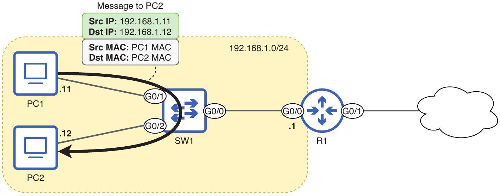
Figure 9.1 PC1 (192.168.1.11) sends a packet to PC2 (192.168.1.12). Because PC1 and PC2 are both in the same network (192.168.1.0/24), PC1 encapsulates the packet in a frame addressed to PC2's MAC address. PC1 does not need to send the packet to R1 for routing. This diagram assumes PC1 already knows PC2's MAC address; if not, PC1 will first send an ARP request to learn PC2's MAC address.

NOTE A cloud icon, as shown in figure 9.1, is often used to represent the internet. However, that is not always its purpose. A cloud icon can be used to summarize elements that are not relevant to the diagram. The cloud in figure 9.1 indicates that R1 connects to another network, the details of which aren't relevant to the diagram. That other network could be the internet, or it could be another part of the same enterprise's network.

On the other hand, if an end host like a PC wants to send a packet to a destination outside of its local network, it must send the packet to its default gateway-the router that provides connectivity to other networks. In figure 9.2, R1 is the default gateway of the 192.168.1.0/24 network. For PC1 and PC2 to send packets to destinations outside of 192.168.1.0/24, they must encapsulate the packet in a frame addressed to the MAC address of R1's G0/0 interface. Figure 9.2 demonstrates how PC1 sends a packet to PC3: it encapsulates the packet in a frame, which is addressed to the MAC address of R1's G0/0 interface. R1 then forwards the packet out of its G0/1 interface, encapsulated in a new frame addressed to PC3's MAC address.


Figure 9.2 PC1 (192.168.1.11) sends a packet to PC3 (192.168.2.11). Because PC1 and PC3 are in separate networks, PC1 sends the packet in a frame addressed to its default gateway's MAC address-that of R1's G0/0 interface. R1 then forwards the packet out of its G0/1 interface, encapsulated in a new frame addressed to PC3's MAC address. This diagram assumes PC1 already knows R1 G0/0's MAC address; if not, PC1 will send an ARP request to learn it. Likewise, R1 must also learn PC3's MAC address.

NOTE The default gateway's IP address is usually the first usable address of the network. For example, in the 192.168.1.0/24 network, it's 192.168.1.1, and in the 192.168.2.0/24 network, it's 192.168.2.1. That doesn't have to be the case, but it's common practice, and I will follow that practice in this book. The IP addresses of the PCs, on the other hand, are arbitrary. In this chapter's examples, the PCs' IP addresses end in . 11 and .12, but there is no particular significance to those addresses.

How does PC1 know what its default gateway is? An end host can learn the IP address of its default gateway in a couple of ways. One way is manual configuration, in which an admin manually specifies the default gateway on each device. However, this is very rare for user devices like PCs; they usually use the second method-Dynamic Host Configuration Protocol (DHCP)-to automatically learn information like their default gateway's IP address, as well as their own IP address (DHCP is covered in chapter 4 of volume 2 of this book). On a Windows device, you can use the ipconfig command
in the Command Prompt application to view information like the device's IP address, netmask (called the subnet mask in the command's output), and default gateway. The following example shows the output of this command on PC1:

```
C:\Users\jmcdo> ipconfig
. . .
Ethernet adapter Local Area Connection:
    Connection-specific DNS Suffix . :
    IPv4 Address. . . . . . . . . . . : 192.168.1.11
    Subnet Mask . . . . . . . . . . . : 255.255.255.0
    Default Gateway . . . . . . . . . : 192.168.1.1
. . .
```

NOTE A host's default gateway is configured as an IP address, not a MAC address. To learn the default gateway's MAC address, the host must send an ARP request to the default gateway's IP address.

There are a couple of main points to take away from this section: first, to send a packet to a destination in the same network, a host will encapsulate the packet (addressed to the destination host's IP address) in a frame addressed to the destination host's MAC address. The second point is that to send a packet to a destination in a different network, the sending host will encapsulate the packet (addressed to the destination host's IP address) in a frame addressed to the default gateway's MAC address. In either case, ARP must be used to learn the appropriate MAC address (that of the destination host or the default gateway).

### 9.2 The basics of routing

In section 9.1, we saw how a host sends packets to destinations outside of its local network; it sends each packet in a frame addressed to the MAC address of the default gateway. Now we'll examine how the default gateway-which is a router-performs its role of forwarding packets between networks, which is called routing. Figure 9.3 gives a high-level overview of how R1 forwards a packet from PC1 to PC3.

NOTE R1's routing table in figure 9.3 is simplified-we will examine R1's complete routing table in section 9.2.1.

When a router receives a frame destined for its own MAC address, it will de-encapsulate the frame to examine the packet inside (if the destination is not its own MAC address, it will discard the frame). If the destination IP address of the packet is its own IP address, it will continue to de-encapsulate the message-it is a message for the router itself.

However, if the destination IP address of the packet is not its own IP address, the router will attempt to route the packet to forward it toward the packet's destination. It does that by looking up the packet's destination IP address in its routing table to find a suitable route. If a suitable route is found, it will forward the packet according to that route. If not, it will discard the packet.

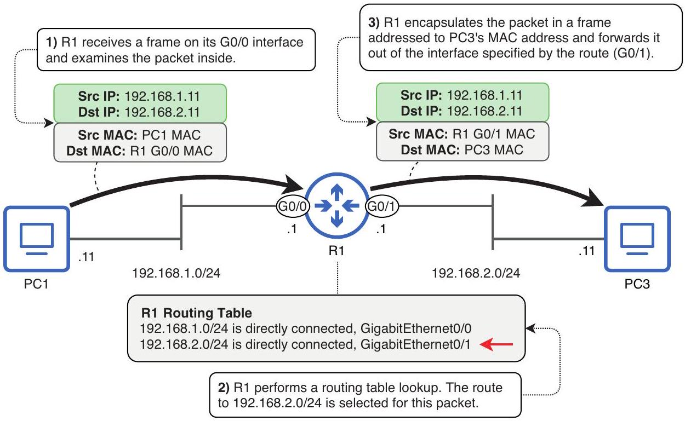
Figure 9.3 R1 receives a packet from PC1 and forwards it to PC3. (1) R1 receives a frame on its G0/0 interface. The frame is addressed to R1's own MAC address, so it examines the packet inside. (2) R1 looks up the packet's destination IP address in its routing table. 192.168.2.11 is in the 192.168.2.0/24 network, so it selects that route to forward the packet. (3) R1 encapsulates the packet in a new frame destined for PC3's MAC address and forwards it out of the interface specified by the route (G0/1).

### 9.2.1 The routing table

A router's routing table is a database of destinations known by the router. It can be thought of as a set of instructions:

- To send a packet to destination X, forward the packet to next hop Y.
- Or, if the destination is in a directly connected network, forward the packet directly to the destination.
- Or, if the destination is the router's own IP address, continue to de-encapsulate the message (don't forward the packet).

The example we saw in figure 9.3 is an example of the second kind of instruction; the destination of the packet (PC3, 192.168.2.11) is in a network directly connected to R1 (192.168.2.0/24), so R1 forwards the packet directly to the destination (by encapsulating it in a frame addressed to PC3).

Unlike switches, which can build their MAC address table automatically without any configuration, a router's routing table will be empty by default-it will not be able to forward packets. The following example shows R1's routing table before any configuration-the command to view the routing table is show ip route:


Without any configuration, the output shows some codes that represent the different route types that could appear in the routing table. Finally, Gateway of last resort is not set indicates that R1 doesn't have a default route, something we'll cover in section 9.4.

Let's configure R1 and see how the output of show ip route changes. First, we won't actually configure any routes; rather, let's configure R1's IP addresses and enable its interfaces, as in the following example:

```
R1# configure terminal
R1(config) # interface g0/0
R1(config-if)# ip address 192.168.1.1 255.255.255.0
R1(config-if) # no shutdown
R1(config-if) # interface g0/1
R1(config-if) # ip address 192.168.2.1 255.255.255.0
R1(config-if) # no shutdown
```

Configures and enables GO/0

Configures and enables G0/1
R1's interfaces are now configured according to the previous diagrams: 192.168.1.1/24 on G0/0 and 192.168.2.1/24 on G0/1. Now let's examine R1's routing table again and see what has changed (omitting some of the codes to save space):

```
R1# show ip route
Codes: L - local, C - connected, S - static, R - RIP, M - mobile, B - BGP
. . .
Gateway of last resort is not set
    192.168.1.0/24 is variably subnetted, 2 subnets, 2 masks
C 192.168.1.0/24 is directly connected, GigabitEthernet0/0
L 192.168.1.1/32 is directly connected, GigabitEthernet0/0
    192.168.2.0/24 is variably subnetted, 2 subnets, 2 masks
C 192.168.2.0/24 is directly connected, GigabitEthernet0/1
L 192.168.2.1/32 is directly connected, GigabitEthernet0/1
```

Just by configuring IP addresses on and enabling R1's two interfaces, R1 has inserted four routes into its routing table: two connected routes (indicated by code C) and two local routes (indicated by code L).

NOTE The line 192.168.1.0/24 is variably subnetted, 2 subnets, 2 masks is not a route. This statement means that in the routing table, there are two routes to subnets that fit within the 192.168.1.0/24 class C network, with two different netmasks (/24 and /32). The same applies for the similar line about 192.168.2.0/24. We will cover subnets in chapter 11.

## Connected routes

A connected route is a route to the network an interface is connected to. One connected route is automatically added to the routing table for each interface that has an IP address and is in an up/up state (you can check the interface's state with show ip interface brief). For example, R1's G0/0 interface has IP address 192.168.1.1/24, so it automatically adds a route to the 192.168.1.0/24 network into its routing table.

NOTE 192.168.1.0/24 is the network address, with all bits of the host portion set to 0 . This can be determined by simply changing the final octet from 1 to 0 since the netmask on the interface is /24.

A connected route will state that the network is directly connected, and it will also state which interface it is connected to. To view only the connected routes in R1's routing table, in the following example, I filter the output using the pipe (|) followed by include C to display only lines that include C:

With these routes in its routing table, R1 knows that to forward a packet to a host with an IP address in the 192.168.1.0/24 or 192.168.2.0/24 networks, it should send the packet out of the interface specified in the route in a frame addressed directly to the destination host. We saw this in figure 9.3; the destination IP address of the packet was 192.168.2.11 (PC3), so R1 forwarded the packet out of the G0/1 interface in a frame addressed to PC3's MAC address.

Figure 9.4 shows how the route to 192.168.1.0/24 includes all IP addresses from 192.168.1.0 through 192.168.1.255. The network portion of the route's address is fixed, but the host portion can be any 8-bit number.

|  | These bits are fixed (can't change) |  |  |  |  |  |  |  |  |  |  |  |  |  |  |  |  |  |  |  |  |  |  |  |  |  |  |  |  |  |
| :--- | :--- | :--- | :--- | :--- | :--- | :--- | :--- | :--- | :--- | :--- | :--- | :--- | :--- | :--- | :--- | :--- | :--- | :--- | :--- | :--- | :--- | :--- | :--- | :--- | :--- | :--- | :--- | :--- | :--- | :--- |
| IP address | 192 |  |  |  |  |  |  |  |  |  |  |  |  | 1 |  |  |  |  |  |  |  |  | 0 |  |  |  |  |  |  |  |
|  | 1 | 1 | 0 | 0 |  | 0 | 1 | 0 | 1 | 0 | 0 | 0 | 0 | 0 | 0 | 0 | 0 | 0 | 0 |  | 0 | 0 | 0 | 0 | 0 | 0 | 0 | 0 | 0 | 0 |
| Netmask | 255 |  |  |  |  |  | 255 |  |  |  |  |  |  | 255 |  |  |  |  |  |  |  |  | 0 |  |  |  |  |  |  |  |
|  | 1 | 1 | 1 | 1 | 1 | 1 | 1 | 1 | 1 | 1 | 1 | 1 | 1 | 1 | 1 | 1 | 1 | 1 | 1 | 1 |  | 1 | 0 | 0 | 0 | 0 | 0 | 0 | 0 | 0 |

Figure 9.4 The IP address and prefix length (written as a netmask) of the route to 192.168.1.0/24. Due to the /24 prefix length, the first three octets are fixed (the bits can't change). However, the last octet can be any 8-bit number: .1, .11, .100, .179, etc. This means that any packet with a destination IP address beginning with 192.168.1 can be forwarded using this route.

EXAM TIP A route to more than one destination IP address is called a network route; it's a route to a network, rather than a route to a single destination IP address. A connected route is an example of a network route. The term network route is explicitly mentioned in exam topic 3.3.b, so remember that definition.

## Local routes

A local route is a route to the exact IP address configured on the router's interface. Like connected routes, one local route is automatically added to the routing table for each interface that has an IP address and is in an up/up state. In the following example, I use show ip route | include L to view only R1's local routes. Note that like connected routes, local routes also state X is directly connected, followed by the interface:

```
        A local route to GO/0’s IP address
R1# show ip route | include L
Codes: L - local, C - connected, S - static, R - RIP, M - mobile, B - BGP
. . .
L 192.168.1.1/32 is directly connected, GigabitEthernet0/0
L 192.168.2.1/32 is directly connected, GigabitEthernet0/1
A local route to GO/1’s IP address
```

To specify the exact IP address of the interface, a local route uses a /32 prefix length; all bits of the netmask are set to 1. This is the case regardless of the netmask configured on the interface. For example, even though R1's interfaces both have /24 prefix lengths, their local routes are /32. The reason for this is that a local route specifies only a single IP address. As stated previously, a route to 192.168.1.0/24 includes all IP addresses from 192.168.1.0 through 192.168.1.255; because the prefix length is $/ 24$, the final octet can be any number from 0 to 255 . On the other hand, a route to
192.168.1.1/32 includes only 192.168.1.1, due to its /32 prefix length; all bits are considered part of the network portion and cannot be changed. Figure 9.5 shows the IP address of R1 G0/0 with a /32 prefix length (written as a netmask).


Figure 9.5 The IP address of R1's G0/0 interface and a /32 prefix length written as a netmask in dotted decimal and binary. With a prefix length of /32, the route only includes a single IP address (192.168.1.1, in this case). A packet destined for 192.168.1.2, for example, cannot use this route.

A local route tells the router that packets destined for the IP address specified in the route are for the router itself; it should continue to de-encapsulate the message and examine its contents. In this case, the router does not forward the packet; it just receives the packet for itself. The local route is necessary to distinguish the router's own IP address from other IP addresses in the connected network. If R1 only had a connected route to 192.168.1.0/24 but no local route, it would forward packets destined for 192.168.1.1 out of its G0/0 interface, rather than receiving the packets for itself.

EXAM TIP A route to a single destination IP address (with a /32 prefix length) is called a host route; it's a route to a single host. A local route is an example of a host route. This is in contrast to a network route, which we covered earlier; a network route is any route with a prefix length shorter than / 32. The term host route is explicitly mentioned in exam topic 3.3.c, so remember that definition.

### 9.2.2 Route selection

When a router forwards a packet, it has to decide which route in its routing table it will use to forward the packet, and this is called route selection. To determine how to forward a particular packet, the router will select the most specific matching route. Let's define that term:

- Matching route-The packet's destination IP address is part of the network specified in the route. If not, the packet can't be forwarded using this route.
- Most specific-The route with the longest prefix length.

Let's use an example to clarify that concept. Figure 9.6 shows the route selection process when R1 receives a packet addressed to 192.168.1.1. The packet's destination IP address matches two routes in R1's routing table, so it selects the more specific of the two.


Figure 9.6 R1 receives a packet and selects the best route for that packet. (1) R1 receives a frame on its GO/O interface. The destination MAC is its own, so it de-encapsulates it and examines the packet inside. (2) The packet's destination IP address is 192.168.1.1. R1 performs a routing table lookup and finds that two routes match the packet's destination IP address: the connected route to 192.168.1.0/24 and the local route to 192.168.1.1/32. R1 selects the most specific route: 192.168.1.1/32. (3) Because R1 selects a local route, it receives the packet for itself; it does not forward the packet.

A route with a /24 prefix length includes 256 different IP addresses. For example, 192.168.1.0/24 includes 192.168.1.0 through 192.168.1.255. On the other hand, a route with a /32 prefix length includes only a single IP address, so a /32 route is more specific than a /24 route. In fact, a /32 route is the most specific route possible; if a packet's destination IP address matches a /32 route, that route will always be selected for that packet, regardless of how many other matching routes there are.

EXAM TIP Be aware of this major difference between Layer 3 forwarding done by routers and Layer 2 forwarding done by switches: when a router looks up a packet's destination IP address in its routing table, it looks for the most specific
matching route. On the other hand, when a switch looks up a frame's destination MAC address in its MAC address table, it looks for an exact match; partial matches don't count.

What happens if there aren't any routes in the routing table that match a packet's destination IP address? In that case, the router will drop the packet; it won't flood it out of all ports like switches do with unknown unicast frames. A switch sometimes floods frames, but a router never floods packets; it forwards the packet, receives the packet for itself, or drops the packet. Table 9.1 summarizes the actions a router can take on a packet.

Table 9.1 Actions a router can take on a packet
| Matching conditions | Router's action |
| :--- | :--- |
| The packet's destination IP address matches one or more nonlocal routes. | Forward the packet according to the most specific matching route |
| The packet's destination IP address matches a local route. | Receive the packet for itself |
| The packet's destination IP address does not match any routes. | Drop the packet |


### 9.3 Static routing

The packet forwarding process outlined in section 9.2 is called routing, but the term routing is also used to refer to the processes routers use to learn routes. In addition to the connected and local routes a router automatically inserts into its routing table, there are two main methods by which routers can learn routes:

- Dynamic routing-Routers use dynamic routing protocols (i.e., OSPF) to share information with each other and build their routing tables.
- Static routing-An engineer/admin manually configures routes on the router.

Connected routes allow the router to forward packets to destinations in networks directly connected to the router, and local routes allow the router to receive packets destined for its own IP addresses. However, to forward packets toward destinations that are not in directly connected networks, the router must learn of those destinations using one of the aforementioned methods (we will cover dynamic routing in chapters 17 and 18).

When forwarding a packet toward a destination that is not directly connected to the router, it must encapsulate the packet in a frame addressed to the MAC address of the next hop, which is the next router in the path to the destination. Figure 9.7 demonstrates this process.

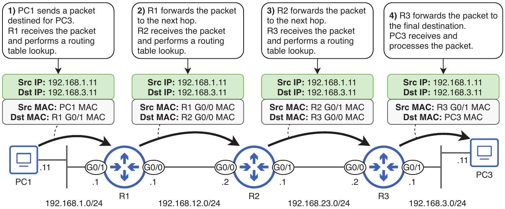
Figure 9.7 PC1 sends a packet to PC3 via R1, R2, and R3. (1) PC1 sends the packet in a frame to R1 G0/1. R1 receives it and performs a routing table lookup. (2) R1 forwards the packet in a frame to R2 G0/0. R2 receives it and performs a routing table lookup. (3) R2 forwards the packet in a frame to R3 G0/0's MAC. R3 receives the packet and performs a routing table lookup. (4) R3 forwards the packet in a frame to PC3, which receives and processes it.

Figure 9.7 shows how routers forward packets toward remote (not directly connected) destinations. However, routers have no such routes in their routing tables by default; those routes must be manually configured. Without configuring any static routes, if R1 receives a packet from PC1 destined for 192.168.3.11, R1 won't find any matching routes when it performs the routing table lookup; it will have no choice but to drop the packet. Table 9.2 lists the networks that each router in figure 9.7 is aware of without configuring static routes.

Table 9.2 Each router's known and unknown networks
| Router | Known networks | Unknown networks |
| :--- | :--- | :--- |
| R1 | 192.168.1.0/24 192.168.12.0/24 | 192.168.3.0/24 192.168.23.0/24 |
| R2 | 192.168.12.0/24 192.168.23.0/24 | 192.168.1.0/24 192.168.3.0/24 |
| R3 | 192.168.3.0/24 192.168.23.0/24 | 192.168.1.0/24 192.168.12.0/24 |


Given the goal of enabling two-way communication between PC1 and PC3, which routes do we have to configure? Looking at table 9.2, you might assume that we have to configure six routes, so that each router knows about all networks within the greater network.

However, to forward packets between two hosts, each router only needs routes to the networks of the communicating hosts (PC1 and PC3). R1, for example, doesn't need to know about the network between R2 and R3 (192.168.23.0/24); R1 only needs
to know that to forward a packet toward a destination in 192.168.3.0/24, it should forward the packet to R2. Figure 9.8 demonstrates this concept; if we configure a route to 192.168.3.0/24 on R1, with R2's IP address specified as the next hop, R1 will be able to forward the packet to R2. It doesn't need to know the details of the path the packet will take after R2; it just needs to know that R2 is the next hop.

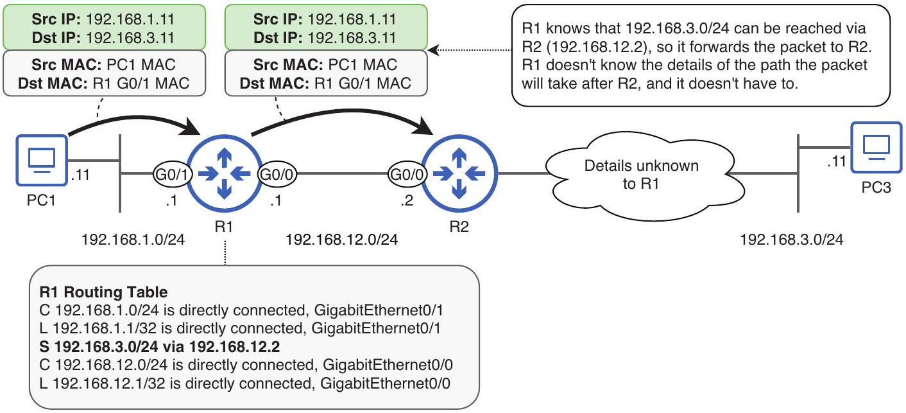
Figure 9.8 R1 forwards a packet destined for 192.168.3.11 (PC3). R1 has a static route to 192.168.3.0/24 via 192.168.12.2 (R2). R1 knows that to forward a packet toward the 192.168.3.0/24 network, it should forward the packet to R2. R1 doesn't know the details of the path the packet will take after R2, and it doesn't have to.

To summarize, each router needs a route to 192.168.3.0/24 so that it can forward packets from PC1 to PC3 and a route to 192.168.1.0/24 so that it can forward packets from PC3 to PC1. R1 already has a connected route to 192.168.1.0/24, and R3 already has a connected route to 192.168.3.0/24. Table 9.3 lists the static routes that we must configure to enable two-way communication between PC1 and PC3.

Table 9.3 Routes required to enable communication between PC1 and PC3
| Router | Required routes | Next hop |
| :--- | :--- | :--- |
| R1 | 192.168.3.0/24 | 192.168.12.2 (R2 GO/O) |
| R2 | 192.168.1.0/24 | 192.168.12.1 (R1 GO/0) |
|  | 192.168.3.0/24 | 192.168.23.2 (R3 GO/0) |
| R3 | 192.168.1.0/24 | 192.168.23.1 (R2 G0/1) |


NOTE In this example, we are talking about the routes required to enable twoway communication between PC1 and PC3. Although not necessary for that purpose, there is nothing wrong with configuring a route to 192.168.23.0/24 on R1 and a route to 192.168.12.0/24 on R3.

### 9.3.1 Configuring static routes

The command to configure a static route is, from global configuration mode, ip route. However, there are a few different options regarding the arguments you provide with the command:

- ip route destination-network netmask next-hop
- ip route destination-network netmask exit-interface
- ip route destination-network netmask exit-interface next-hop

Static routes specifying the next hop
A static route can be configured by specifying the destination network address, the netmask, and the IP address of the next hop. Figure 9.9 shows the commands to configure each of the necessary routes on R1, R2, and R3.

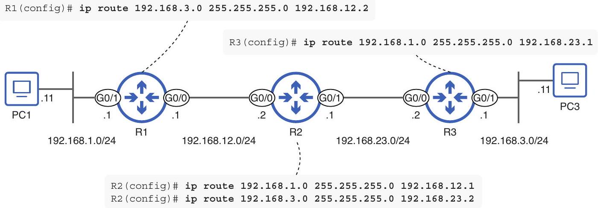
Figure 9.9 Configuring static routes on R1, R2, and R3 to enable two-way communication between PC1 and PC3. The routes specify the next-hop IP address. R1 requires a route to 192.168.3.0/24, R2 requires routes to 192.168.1.0/24 and 192.168.3.0/24, and R3 requires a route to 192.168.1.0/24.

A static route that specifies only the next-hop IP address is called a recursive static route. The reason for the name recursive is that the route necessitates multiple lookups in the routing table to forward a packet:

- A lookup to find the IP address of the next hop
- A lookup to find which interface the next hop is connected to

To demonstrate that, let's look at R1's routing table in the following example. When R1 receives a packet destined for 192.168.3.11, it finds that the most specific matching route (actually, the only matching route) is the static route:

```
R1# show ip route
Codes: L - local, C - connected, S - static, R - RIP, M - mobile, B - BGP
    192.168.1.0/24 is variably subnetted, 2 subnets, 2 masks
```

Matches the packet's destination (192.168.3.11)

```
C 192.168.1.0/24 is directly connected, GigabitEthernet0/1
L 192.168.1.1/32 is directly connected, GigabitEthernet0/1
S 192.168.3.0/24 [1/0] via 192.168.12.2
    192.168.12.0/24 is variably subnetted, 2 subnets, 2 masks
C 192.168.12.0/24 is directly connected, GigabitEthernet0/0
L 192.168.12.1/32 is directly connected, GigabitEthernet0/0
```

Matches the next-hop IP address (192.168.12.2)
NOTE The [1/0] in the static route indicates the administrative distance (AD) and metric of the route, respectively. AD and metric will be covered in chapter 17; they are not relevant to this chapter.

The static route states S 192.168.3.0/24 [1/0] via 192.168.12.2 (note the code S for static), but that information alone doesn't tell R1 which interface to forward the packet out of. To learn that, it then performs a second lookup for the next-hop IP address: 192.168.12.2. The most specific (and only) matching route for 192.168.12.2 is the connected route to 192.168.12.0/24, which specifies the G0/0 interface. Now, after two lookups, R1 knows the next-hop IP address and the interface to forward the packet out of.

NOTE R1 knows the next-hop IP address, but the information R1 really needs is the next-hop MAC address. To learn that, it must send an ARP request to the next-hop IP address.

## Static routes specifying the exit interface

Rather than specifying the next-hop IP address of the route, you can specify the exit interface-the interface the router should forward packets out of. The following example shows the same static routes as we saw in figure 9.9 but configured using the exit interface:

- R1(config)\# ip route 192.168.3.0 255.255.255.0 g0/0
- R2(config) \# ip route 192.168.1.0 255.255.255.0 g0/0
- R2(config) \# ip route 192.168.3.0 255.255.255.0 g0/1
- R3(config)\# ip route 192.168.1.0 255.255.255.0 g0/0

A static route that specifies only the exit interface is called a directly connected static route. The reason for this is that the route will appear as a directly connected network in the routing table. The following example shows the route to 192.168.3.0/24 in R1's routing table:

```
R1# show ip route
Codes: L - local, C - connected, S - static, R - RIP, M - mobile, B - BGP
. . .
S 192.168.3.0/24 is directly connected, GigabitEthernet0/0
. . .
```

The static route appears as "directly connected."

There is a downside to this kind of static route: because R1 thinks that the 192.168.3.0/24 network is directly connected to its G0/0 interface, it will try to send packets in frames addressed directly to PC3, rather than in frames addressed to the next hop.

This means that R1 won't send an ARP request to learn the next-hop MAC address; instead, it will send an ARP request to learn PC3's MAC address. The problem is that this ARP request won't reach PC3-it will only reach R2 (broadcast messages don't go beyond their local network). However, R2 can use a feature called proxy ARP to reply on behalf of PC3, telling R1 to send the packet to R2 G0/0's MAC address. This is demonstrated in figure 9.10.


Figure 9.10 A proxy ARP exchange between R1 and R2. (1) R1 sends an ARP request to learn PC3's MAC address. (2) 192.168.3.11 isn't R2's IP address, but R2 has a route to 192.168.3.0/24 in its routing table, so R2 uses proxy ARP to reply on behalf of PC3.

NOTE A router will only use proxy ARP to reply to an ARP request if it has a route to the destination in its routing table. Otherwise, it will ignore the request.

The following example shows R1's ARP table (you can view it with the show arp command). Notice that the same MAC address (Hardware Addr) is listed for both 192.168.12.2 and 192.168.3.11-the MAC address of R2's G0/0 interface:

```
R1# show arp
Protocol Address Age (min) Hardware Addr Type Interface
. . .
Internet 192.168.3.11 0 5254.0003.e684 ARPA GigabitEthernet0/0 <
. . .
Internet 192.168.12.2 0 5254.0003.e684 ARPA GigabitEthernet0/0 <
```

R2 GO/0's MAC address is listed for both IP addresses.

The reliance on proxy ARP is a downside to directly connected static routes for two reasons. First, although proxy ARP is enabled on Cisco routers by default, in some cases, it might be disabled (e.g., if R2 is not a Cisco router). If proxy ARP is disabled on R2, it won't reply to R1's ARP request, and R1 won't be able to forward the packet to PC3.

The second downside is that R1 will need to make a separate ARP entry for every host in 192.168.3.0/24. It thinks each host in 192.168.3.0/24 is directly connected, so it will try to learn each host's MAC address; that could waste memory on R1 if there are a lot of hosts in the network. On the other hand, if the next-hop IP address is specified instead of the exit interface, R1 will only need one ARP entry to forward packets to 192.168.3.0/24: an ARP entry for the next hop.

NOTE Although we are focusing on R1 as an example, the same applies for R2, which will think that the 192.168.1.0/24 and 192.168.3.0/24 networks are directly connected, as well as for R3, which will think that the 192.168.1.0/24 network is directly connected.

You should know the definition of and be able to configure directly connected static routes, but because of the downsides of relying on proxy ARP, I recommend that you do not use them in a real network. Rather, use recursive static routes or the next option: fully specified static routes.

## Static routes specifying both the exit interface and next hop

The third option when configuring a static route is to specify both the exit interface and the next hop, which is called a fully specified static route. The following are the same four static routes, this time configured as fully specified static routes:

- R1(config)\# ip route 192.168.3.0 255.255.255.0 g0/0 192.168.12.2
- R2(config) \# ip route 192.168.1.0 255.255.255.0 g0/0 192.168.12.1
- R2(config)\# ip route 192.168.3.0 255.255.255.0 g0/1 192.168.23.2
- R3(config)\# ip route 192.168.1.0 255.255.255.0 g0/0 192.168.23.1

The benefit of this kind of static route is that the router knows both the next-hop IP address and which interface to forward the packet out of; there is no need to do a recursive lookup or to rely on proxy ARP. The following example shows how a fully specified route appears in the routing table:

```
R1# show ip route
Codes: L - local, C - connected, S - static, R - RIP, M - mobile, B - BGP
. . .
S 192.168.3.0/24 [1/0] via 192.168.12.2, GigabitEthernet0/0
. . .
```

The route indicates both the next hop and the exit interface.

This type of static route may seem the best of the three, but in reality, you can use either recursive or fully specified static routes without a noticeable difference in performance. Directly connected static routes, however, should generally be avoided.

### 9.3.2 Configuring a default route

A default route is a route to the least-specific destination possible: 0.0.0.0/0. This route matches all possible IP addresses, from 0.0.0.0 through 255.255.255.255. Because it is the least-specific route possible, the default route will only be selected if there aren't any more specific routes in the router's routing table.

A default route is often used to provide a route to the internet. There are over 1 million routes in the global internet routing table, which is far more than most routers can handle. Fortunately, there's no need for a router to know about any specific destination networks over the internet; if the router has a default route to the internet, it can use that route to forward packets toward the internet, and then the Internet Service Provider (ISP) infrastructure will take care of forwarding the packets to the proper destination.

More specific routes can be used for destinations in the internal corporate network, and then all other traffic (that doesn't match any other routes) will be routed using the default route. Figure 9.11 shows an example of this: R1 has specific routes to 192.168.2.0/24 and 192.168.3.0/24 and then a default route to the internet; packets with destinations that don't match 192.168.2.0/24 or 192.168.3.0/24 (or R1's connected and local routes) will be forwarded using the default route.

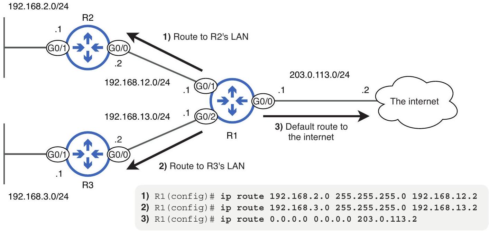
Figure 9.11 R1 has two routes to specific destination networks and one default route to the internet. (1) A route to 192.168.2.0/24, with R2 G0/0 as the next hop. (2) A route to 192.168.3.0/24, with R3 G0/0 as the next hop. (3) A default route, with the ISP's IP address (203.0.113.2) as the next hop.

To configure a default route, specify a destination network of 0.0.0.0 and a netmask of 0.0.0.0 in the ip route command; that results in 0.0.0.0/0, which includes all possible IP addresses. If a router does not have a default route configured, you will see the statement Gateway of last resort is not set above the routes in the
routing table, as shown in the following example. This means the router does not have a default route:

```
R1# show ip route
Codes: L - local, C - connected, S - static, R - RIP, M - mobile, B - BGP
. . .
Gateway of last resort is not set
. . .
```

NOTE Gateway of last resort is another term for the default gateway. The default route on a router is like a PC's default gateway; it's used to forward traffic to destinations outside of the router's known networks.

After configuring the static routes shown in figure 9.11, the output changes. In the following example, I use the show ip route static command to view only R1's static routes. Note that the ISP's IP address (203.0.113.2) is now listed as the gateway of last resort:

```
Views static routes in the routing table
R1# show ip route static
Codes: L - local, C - connected, S - static, R - RIP, M - mobile, B - BGP
. . .
    ia - IS-IS inter area, * - candidate default, U - per-user static route
. . .
Gateway of last resort is 203.0.113.2 to network 0.0.0.0
S* 0.0.0.0/0 [1/0] via 203.0.113.2
S 192.168.2.0/24 [1/0] via 192.168.12.2
S 192.168.3.0/24 [1/0] via 192.168.13.2
```

The default route we configured

NOTE Earlier in this chapter, I stated that a router will drop packets that don't match any routes in its routing table. However, if the router has a default route, that situation won't occur; the default route matches all IP addresses. If a packet doesn't match a more specific route, the router will forward it via the default route, rather than dropping the packet.

Exam scenarios
Routing is a key topic of the CCNA exam. Here are a few examples of how your knowledge of routing fundamentals might be tested on the CCNA exam:

1 (multiple choice, multiple answers)
You issue the command ip route 10.0.0.0 255.0.0.0 192.0.2.1. Which of the following statements are true about the route created by the command? (select two)

(continued)

A It is a network route.
B It is a host route.
c It is a recursive route.
D It is a directly connected route.
E It is a fully specified route.

This question requires you to distinguish between different route types. Network and host routes are classifications based on the route's destination (a network of IP addresses or a single IP address). Recursive, directly connected, and fully specified routes are classifications based on how the route's next hop is specified (next-hop IP address, exit interface, or both). In this case, (A) is correct because the route's destination is 10.0.0.0/8-a network, not a single IP address. And (C) is correct because the route specifies only the next-hop IP address, making it a recursive route.

2 (drag and drop)
Your knowledge of route types could also be tested with a drag-and-drop question like this: drag and drop the routes on the left to the correct route types on the right.

| (A) ip route 192.168.1.0 255.255.255.0 GigabitEthernet0/1 | Recursive |
| :--- | :--- |
| (B) ip route 0.0.0.0 0.0.0.0 203.0.113.120 | Directly connected |
| (C) ip route 172.20.0.0 255.255.0.0 GigabitEthernet0/1 192.168.2.1 | Fully specified |
| (D) ip route 192.0.2.0 255.255.255.0 172.16.25.209 |  |

In this case, (A) is a directly connected route because it specifies only the exit interface, (B) and (D) are recursive routes because they specify only the next-hop IP address, and C) is a fully specified route because it specifies both.

3 (lab simulation)
A lab simulation on the CCNA exam could provide you with a network diagram and ask you to configure static routes to enable hosts in different networks to communicate with each other. Remember the basic syntax of the ip route command to configure static routes. If the question expects you to configure a certain type of static route (recursive, directly connected, or fully specified), it should state so; Cisco exams can be difficult, but they aren't unfair.

## Summary

- The term routingcan refer to the process of forwarding packets between networks and the process of building a routing table.
- Hosts in the same network can send packets to each other without the use of a router. However, to send packets to destinations outside of the local network, a router is required.

- The router a host will send packets destined for external networks to is called the default gateway. The host will send the packets in frames addressed to the default gateway's MAC address.
- A host's default gateway can be manually configured or automatically learned via DHCP.
- You can use the ipconfig command in the Windows Command Prompt to see information such as the PC's IP address, netmask, and default gateway.
- The routing table is the router's database of known destinations. It is a set of instructions about what action to take on packets. The routing table can be viewed with show ip route.
- For each interface that has an IP address and is in an up/up state, the router will automatically add two routes to its routing table: a connected route and a local route.
- A connected route is a route to the network that an interface is connected to. Connected routes are indicated by code C in the routing table. If a router receives a packet destined for a host in a directly connected network, it will forward the packet directly to the destination host (in a frame addressed to the host's MAC address).
- A local route is a route to the exact IP address configured on the interface. Local routes use a /32 prefix length to specify a single IP address. If a router receives a packet destined for the IP address of a local route, it means the packet is destined for the router itself; the router will receive the packet for itself-it will not forward it.
- A route to more than one destination IP address (any route with a prefix length shorter than /32) is called a network route. A connected route is an example of a network route.
- A route to a single destination IP address (a route with a /32 prefix length) is called a host route. A local route is an example of a host route.
- The process of deciding which route is appropriate for forwarding a packet is called route selection. To determine how to forward a particular packet, the router will select the most specific matching route-the matching route with the longest prefix length.
- A /32 route is the most specific route possible; it specifies only one IP address. A /0 route (default route) is the least specific route possible; it specifies every possible IP address.
- Whereas Layer 3 forwarding involves looking in the routing table for the most specific matching route, Layer 2 forwarding involves looking for an exact match in the MAC address table; partial matches don't count.
- If there aren't any routes that match a packet's destination IP address, the router will drop the packet.

- To route packets to destinations that aren't directly connected to the router, the router needs to learn routes to those destinations either via dynamic routing (using a protocol such as OSPF) or static routing (in which routes are manually configured on the router).
- To forward a packet toward a remote destination, the router will encapsulate the packet in a frame destined for the MAC address of the next hop-the next router in the path to the destination.
- For a router to forward packets between two hosts, the router needs routes to each host's network; it doesn't need routes to every network in the path between each destination.
- The command to configure a static route is ip route destination-network netmask \{next-hop | exit-interface | exit-interface next-hop\}.
- A static route that specifies only the next hop is called a recursive static route; it requires multiple lookups in the routing table to forward a packet: one to find the next-hop IP address and one to find which interface the next hop is connected to.
- A static route that specifies only the exit interface is called a directly connected static route because it causes the router to treat the network as a directly connected network.
- Directly connected static routes require proxy ARP to function. Proxy ARP allows a router to reply to ARP requests on behalf of other hosts. Proxy ARP is enabled on Cisco routers by default but might not be enabled on other vendors' routers.
- A static route that specifies both the exit interface and the next hop is called a fully specified static route.
- A default route is a route to 0.0.0.0/0. Because it is the least specific route possible, it will only be used to forward packets that don't match any other routes in the routing table.
- If a router has a default route, it won't drop packets that don't match other routes; instead, it will forward those packets using the default route.
- The default route is often used to provide a route to the internet; it is not feasible for a router to learn specific routes to each possible destination over the internet.

## The life of a packet

## This chapter covers

- A review of the processes involved in delivering a packet from source to destination
- How switches forward frames
- Address Resolution Protocol
- How routers forward packets

The concepts we have covered so far-the TCP/IP model, frame switching, ARP, IPv4 addresses, routing, etc.-are fundamental concepts we will build upon in the rest of this book's two volumes. In this chapter, we will review many of those concepts and see the role each plays in delivering a packet from the sending host to the packet's intended destination.

This chapter is unique among the others in this book in that it does not cover new information; everything in this chapter has been covered in previous chapters. Instead of introducing new concepts, the goal of this chapter is to take the most important concepts from previous chapters and tie them all together into one coherent whole.

Figure 10.1 shows the network we will use for this chapter; we used the same when looking at routing in chapter 9. Figure 10.1 also summarizes the different processes involved in delivering a packet from PC1 to PC3: ARP, switching, routing, etc. We will review these processes throughout this chapter.


Figure 10.1 A summary of actions taken by each device when PC1 sends a packet to PC3. PC1 prepares a packet addressed to PC3, uses ARP to learn the default gateway's MAC address (R1 G0/1), and sends the packet in a frame to that MAC address. The switches learn the MAC addresses of connected devices and forward/flood frames as appropriate. The routers select the best route to forward the packet, use ARP to learn the next hop's MAC address, and forward the packet in a frame addressed to that MAC address.

NOTE The arrows in figure 10.1 are a reminder that, at Layer 3, the packet is addressed to PC3 (IP address 192.168.3.11) throughout the whole journey. However, at Layer 2, the packet is encapsulated in a new frame at each hop, and each frame is addressed to the next hop (until R3 finally addresses its frame to PC3).

### 10.1 The life of a packet from PC1 to PC3

Figure 10.1 provides an outline of the different processes involved in delivering a packet from PC1 to PC3. Now let's examine the process step by step to see how the different components we've covered in the book so far come together to enable communications over the network.

### 10.1.1 PC1 to R1

In our scenario, PC1 wants to send a packet to PC3. The type of packet is not significant for this example, so let's assume it's an ICMP echo request message sent by issuing the ping 192.168.3.11 command on PC1.

PC1's IP address is 192.168.1.11, and it has a /24 prefix length (netmask 255.255.255.0), so it knows that its local network includes IP addresses 192.168.1.0 (the network address) through 192.168.1.255 (the broadcast address). Therefore, it knows that PC3 (192.168.3.11) is not in its local network. This means that PC1 must send the
packet to its default gateway in a frame addressed to the default gateway's MAC address (rather than the MAC address of PC3 itself).

PC1 knows that its default gateway's IP address is 192.168.1.1 (most likely learned via DHCP, which we will cover in chapter 4 of volume 2 ), but the information it actually needs is the MAC address of the default gateway; it needs to send the packet (destined for PC3) in a frame addressed to R1 G0/1's MAC address. To learn R1 G0/1's MAC address, it will use ARP. Figure 10.2 outlines the ARP exchange between PC1 and R1.

NOTE ARP isn't used to learn the MAC address of the packet's destination (PC3), but the MAC address of the default gateway (R1 G0/1). Because PC1 and PC3 are in separate LANs, they do not need to know each other's MAC address.


Figure 10.2 PC1 uses ARP to learn R1 G0/1's MAC address. (1) PC1 sends an ARP request to 192.168.1.1. SW1 learns PC1's MAC address and floods the frame due to the destination MAC address of ffff.ffff.ffff. (2) After receiving the ARP request, R1 adds an ARP table entry associating IP address 192.168.1.11 with PC1's MAC address. R1 then sends an ARP reply to PC1. SW1 learns R1 G0/1's MAC address and forwards the frame to PC1. (3) After receiving the ARP reply, PC1 adds an ARP table entry associating IP address 192.168.1.1 with R1 G0/1's MAC address.

NOTE To reduce clutter, figure 10.2 only briefly mentions PC2. Upon receiving the ARP request from PC1 (which was flooded by SW1), PC2 simply drops the message-the ARP request is not addressed to PC2's own IP address, so PC2 ignores it.

After the ARP exchange, PC1 now knows the MAC address of its default gateway (in the process, R1 also learns PC1's MAC address and creates an ARP entry). PC1 can
now encapsulate the packet to PC3 in a frame addressed to R1's G0/1 interface. In the following section, we'll see what actions R1 takes upon receiving the frame (and the packet inside the frame) from PC1.

SW1's role is to learn the MAC addresses of connected devices and then forward or flood frames as necessary. It will flood broadcast frames (i.e., PC1's ARP request) and unknown unicast frames. It will forward known unicast frames (i.e., R1's ARP reply).

EXAM TIP Know the difference between a switch's MAC address table and an end host or router's ARP table. A MAC address table maps MAC addresses to switch ports and is used to allow a switch to forward frames out of the correct port. An ARP table maps IP addresses to MAC addresses and is used to allow a router or end host to encapsulate packets in frames with the proper destination MAC address.

### 10.1.2 R1 to R2

When R1 receives the frame from PC1, it de-encapsulates it and examines the packet inside. As covered in chapter 9, it then performs a routing table lookup-it looks for the most specific matching route (the matching route with the longest prefix length). The following example shows R1's routing table:

```
R1# show ip route
. . .
    192.168.1.0/24 is variably subnetted, 2 subnets, 2 masks
C 192.168.1.0/24 is directly connected, GigabitEthernet0/1
L 192.168.1.1/32 is directly connected, GigabitEthernet0/1
S 192.168.3.0/24 [1/0] via 192.168.12.2, GigabitEthernet0/0
    192.168.12.0/24 is variably subnetted, 2 subnets, 2 masks
C 192.168.12.0/24 is directly connected, GigabitEthernet0/0
L 192.168.12.1/32 is directly connected, GigabitEthernet0/0
```

The most specific matching route

The most specific matching route is the static route to 192.168.3.0/24 via next hop 192.168.12.2 (actually, it's the only matching route). However, just like how PC1 knew the IP address of its default gateway but not the MAC address (and therefore had to use ARP to learn the MAC address), R1 knows the IP address of the next hop but not its MAC address (and therefore has to use ARP).

R1 sends an ARP request to learn the MAC address of 192.168.12.2 (R2 G0/0), and R2 sends an ARP reply. In the process, they both learn each other's MAC addresses and create entries in their ARP tables. R1 is now ready to encapsulate the packet in a frame addressed to R2 G0/0's MAC address and forward it out of the G0/0 interface. Figure 10.3 outlines the process up to this point.

NOTE The ARP request sent from R1 to R2 is addressed to the broadcast MAC address (ffff.ffff.ffff). However, R2 is the only device that receives the message- there is no switch to flood the frame in the LAN between R1 and R2.

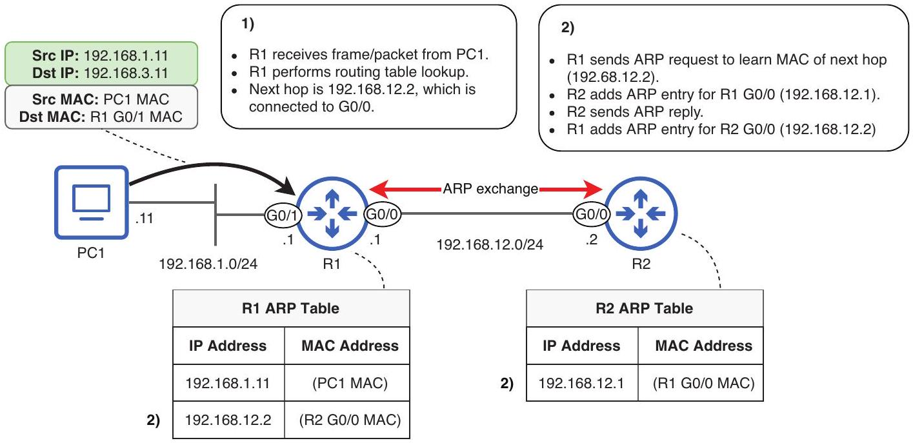
Figure 10.3 R1 receives PC1's message, performs a routing table lookup, and uses ARP to learn the MAC address of the next hop. (1) R1 receives the frame/packet and performs a routing table lookup. The most specific matching route is to 192.168.3.0/24, next hop 192.168.12.2. (2) R1 uses ARP to learn the MAC address of 192.168.12.2 (R2 G0/0). R1 and R2 both add entries to their ARP tables. R1 is now ready to forward the packet to the next hop.

NOTE I have simplified the ARP exchange in figure 10.3, but remember that it consists of an ARP request from R1 to R2 and then an ARP reply from R2 to R1.

### 10.1.3 R2 to R3

When R2 receives the frame from R1, it de-encapsulates it and examines the packet inside. The process it then goes through is identical to the process R1 went through previously. First, it performs a routing table lookup to find the most specific matching route. The following example shows R2's routing table:

```
R2# show ip route
. . .
S 192.168.1.0/24 [1/0] via 192.168.12.1, GigabitEthernet0/0
S 192.168.3.0/24 [1/0] via 192.168.23.2, GigabitEthernet0/1
    192.168.12.0/24 is variably subnetted, 2 subnets, 2 masks
C 192.168.12.0/24 is directly connected, GigabitEthernet0/0
L 192.168.12.2/32 is directly connected, GigabitEthernet0/0
    192.168.23.0/24 is variably subnetted, 2 subnets, 2 masks
C 192.168.23.0/24 is directly connected, GigabitEthernet0/1
L 192.168.23.1/32 is directly connected, GigabitEthernet0/1
```

The only route that matches destination 192.168.3.11 is the static route to 192.168.3.0/24, via next hop 192.168.23.2 (R3's G0/0 interface). To learn the MAC address of the next hop, R2 sends an ARP request, and R3 sends an ARP reply. In the
process, R2 and R3 create entries in their ARP tables, and R2 is now ready to forward the packet in a frame addressed to R3 G0/0's MAC address. Figure 10.4 outlines this process.

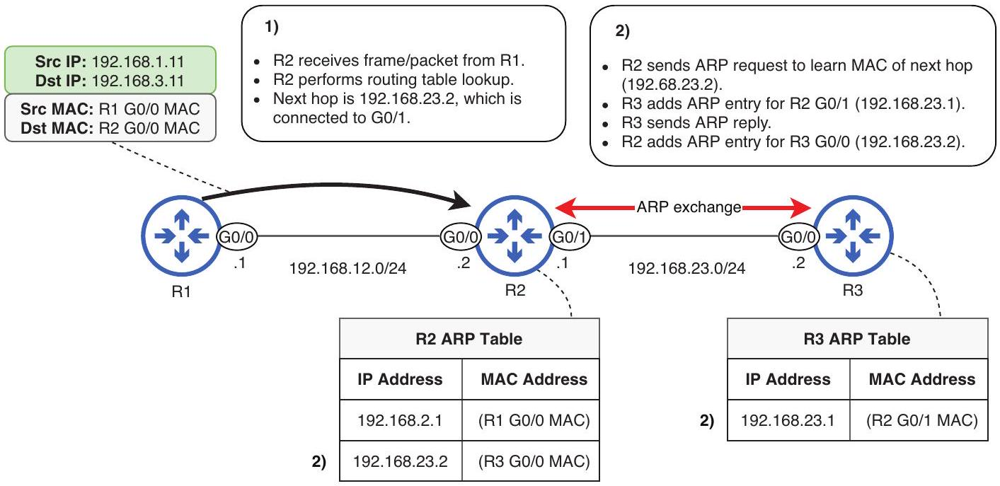
Figure 10.4 R2 receives the frame from R1, performs a routing table lookup and uses ARP to learn the MAC address of the next hop. (1) R2 receives the frame/packet and performs a routing table lookup. The most specific matching route is to 192.168.3.0/24, next hop 192.168.23.2. (2) R2 uses ARP to learn the MAC address of 192.168.23.2 (R3 G0/0). R2 and R3 both add entries to their ARP tables. R2 is now ready to forward the packet to the next hop.

### 10.1.4 R3 to PC3

After R2 forwards the message and it reaches R3, the packet is now at the final router before the destination. R3 goes through the same process as R1 and R2 did previously; it performs a routing table lookup to find the most specific matching route. The following example shows R3's routing table:

```
R3# show ip route The most specific matching route
. . .
S 192.168.1.0/24 [1/0] via 192.168.23.1, GigabitEthernet0/0
    192.168.3.0/24 is variably subnetted, 2 subnets, 2 masks
C 192.168.3.0/24 is directly connected, GigabitEthernet0/1
L 192.168.3.1/32 is directly connected, GigabitEthernet0/1
    192.168.23.0/24 is variably subnetted, 2 subnets, 2 masks
C 192.168.23.0/24 is directly connected, GigabitEthernet0/0
L 192.168.23.2/32 is directly connected, GigabitEthernet0/0
```

The only matching route is the route to 192.168.3.0/24, which is a connected route. Because the packet's destination is in a directly connected network, R3 will encapsulate the packet in a frame addressed to the destination host's MAC address-the MAC address of PC3. To do that, it must use ARP.

SW2 floods the ARP request message to both PC3 and PC4; PC4 ignores it, but PC3 sends an ARP reply back to R3. In that process, SW2 learns the MAC addresses of R3 G0/1 and PC3. R3 and PC3 also learn each other's MAC addresses and add entries to their ARP tables. Figure 10.5 demonstrates this process.

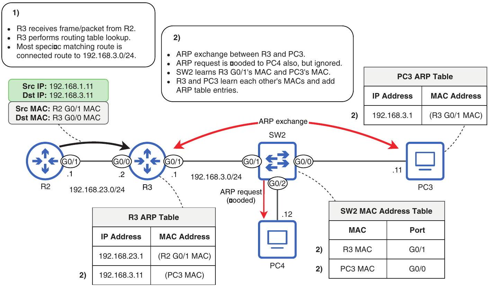
Figure 10.5 R3 receives the frame from R2, performs a routing table lookup and uses ARP to learn the MAC address of the next hop. (1) R3 receives the frame/packet and performs a routing table lookup. The most specific matching route is the connected route to 192.168.3.0/24. (2) R3 uses ARP to learn the MAC address of 192.168.3.11 (PC3). SW2 learns the MAC addresses of R3 G0/1 and PC3. R3 and PC3 both add entries to their ARP tables. R3 is now ready to forward the packet to the destination.

R3 is now able to forward the packet in a frame addressed to PC3's MAC address. The packet has reached its final destination! Upon receipt of the packet, PC3 will process it as appropriate. Earlier I stated that PC1's message was an ICMP echo request message. In that case, PC3 will send an ICMP echo reply message back to PC1.

### 10.2 The life of a packet from PC3 to PC1

The processes involved in delivering PC3's response to PC1 are similar, but there are two major differences: the switches have already learned the necessary MAC addresses, and the PCs and routers already have the necessary ARP table entries. This simplifies the process a bit-because the devices already have the necessary information in their tables, there is no need for the switches to learn MAC addresses or the PCs and routers to use ARP. Figure 10.6 outlines how PC3's packet is delivered to PC1, addressed to and from different MAC addresses at each hop.


Figure 10.6 PC3 sends a reply to PC1. PC3 sends the packet in a frame addressed to the default gateway (R3 G0/1), and SW2 forwards the frame to R3. R3 forwards the packet in a frame to R2 G0/1, and R2 forwards the packet in a frame to R1 G0/0. Finally, R1 forwards the packet in a frame to the destination (PC1), and SW1 forwards the frame to PC1.

Aside from the lack of MAC address learning and ARP, the process is the same as before. PC3 sends its packet in a frame addressed to the default gateway, which SW2 forwards out of the proper port. The routers in the path perform routing table lookups to forward the packet toward the next hop until R1 forwards it in a frame addressed to PC1 itself, and the frame is forwarded to PC1 by SW1.

## Summary

- To send packets to remote destinations, an end host (such as a PC) will send the packet to its default gateway (router). To do so, it will encapsulate the packet in a frame addressed to the default gateway's MAC address. It uses ARP to learn the default gateway's MAC address.
- ARP involves two messages: ARP request (broadcast) and ARP reply (unicast).
- When a device receives an ARP request, it doesn't just send an ARP reply; it also makes an entry in its own ARP table, mapping the IP address of the host that sent the request to that host's MAC address.
- Switches learn MAC addresses and forward or flood frames as appropriate. They do not modify the frames they forward; their operations are transparent to the devices connected to them.
- A switch will flood broadcast and unknown unicast frames. It will forward known unicast frames.
- When a router receives a frame addressed to its own MAC address, it will de-encapsulate it and examine the packet inside. It then performs a routing table lookup to determine how to forward the packet (or drop the packet or receive it for itself).
- A router will forward a packet according to the most specific matching route: the matching route with the longest prefix length.

- To forward a packet to the next hop in the path, a router will forward the packet in a frame addressed to the next hop's MAC address. It uses ARP to learn the next hop's MAC address.
- To forward a packet to the packet's destination host, a router will forward the packet in a frame addressed to the destination host's MAC address, using ARP to learn the MAC address.

## Subnetting IPv4 networks

## This chapter covers

- What subnetting is and why it's necessary
- How to borrow bits from the host portion of a network to expand the network portion and create subnets
- How to identify the five attributes of a subnet
- How to divide a network into subnets of equal and variable sizes

In chapter 7, we covered IPv4 address classes, focusing on classes A, B, and C-the three classes of addresses which can be assigned to hosts. Each class is defined by the first bit(s) of the address, and the prefix length of addresses in each range is also defined:

- Class A addresses begin with 0b0 and use a /8 prefix length.
- Class B addresses begin with 0b10 and use a /16 prefix length.
- Class C addresses begin with 0b110 and use a /24 prefix length.

This addressing architecture, called classful addressing, was defined in the original Internal Protocol standard in 1981 (RFC 791). However, with the rapid growth of the internet, classful addressing soon proved to be too rigid, resulting in inefficient use of addresses; the pool of available IPv4 addresses was drying up. Subnetting, which involves dividing a larger network up into smaller networks, is one answer to this problem and is a fundamental skill for network engineers. Subnetting is the second half of CCNA exam topic 1.6: Configure and verify IPv4 addressing and subnetting.

Before we get started, I want to emphasize that subnetting is a skill, and it requires practice to become proficient. Just reading this chapter alone won't make you good at subnetting; you need to spend some time actually doing it. However, if you read through this chapter carefully and do the recommended practice, you'll be a confident "subnetter" in no time.

### 11.1 What is subnetting?

The problem with classful addressing is that it doesn't allow us to create networks of appropriate sizes. The smallest network size-a class C network-contains 254 usable addresses ( $2^{8}-2$ for the network and broadcast addresses). That is far more addresses than necessary for a home network or many small offices. Assigning a class C network to a small office with only a few dozen devices would result in over 200 IP addresses left unused.

However, a class C network is too small for most enterprise networks, meaning that a class B network would be required. A class B network contains $65,534\left(2^{16}-2\right)$ usable addresses, far more than even a very large network requires, resulting in thousands of wasted addresses. And a class A network contains 16,777,214 usable addresses, a ludicrous number of addresses for a single network. These classful rules were designed for simplicity, not efficiency, but with the internet's exploding popularity, a better solution was needed.

To support the fast-growing internet and use the available IPv4 address space more efficiently, a new system was introduced in 1993: Classless Inter-Domain Routing (CIDR, pronounced like "cider"). CIDR throws out the rules of classful addressing and replaces them with a more flexible system. With CIDR, prefix lengths don't have to be /8, / 16, or /24. Instead, the boundary between the network portion and host portion of an IP address can be in the middle of an octet, resulting in prefix lengths like /23, /26, /28, etc.

NOTE The method of notating an address's prefix length with /X is also known as CIDR notation because it was introduced with CIDR. Before CIDR notation, the prefix length was always indicated with a netmask, such as 255.255.255.0. Another term for netmask is subnet mask; I will use the latter term in this chapter because we are focusing on subnetting, but the terms are interchangeable.

With CIDR, an enterprise can be assigned an address block that can be divided into networks of appropriate size, called subnets (subdivided networks). The process of dividing an address block into subnets is called subnetting.

NOTE An address block is a range of IP addresses. It can be used to refer to a network before it has been subnetted. For example, 192.168.1.0/24 is an address block (including IP addresses 192.168.1.0 through 192.168.1.255), which can be divided into multiple smaller networks (subnets).

Figure 11.1 demonstrates how a /24 address block can be divided into subnets. The 192.168.1.0/24 address range allows for a single subnet with a /24 prefix length, including all addresses from 192.168.1.0 through 192.168.1.255. Dividing the /24 address block in half gives two /25 subnets, each containing 128 addresses. Or it can be divided into four /26 subnets, each containing 64 addresses. For each bit by which you extend the prefix length, the number of possible subnets doubles, but the number of addresses in each subnet halves.

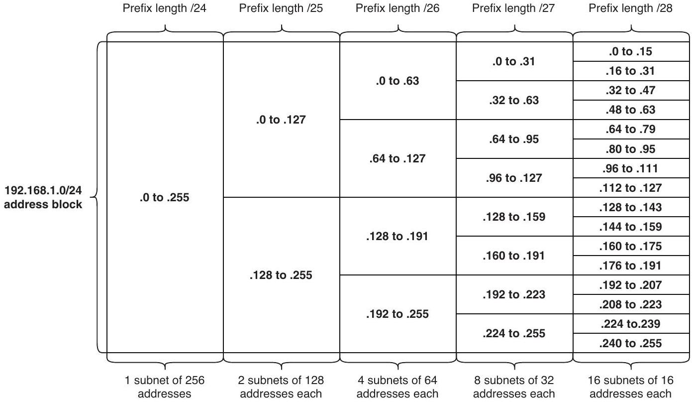
Figure 11.1 The 192.168.1.0/24 address block (network) divided into smaller subnets. With a /24 prefix length, it is one subnet of 256 addresses. Using a /25 prefix length allows the block to be divided into two subnets of 128 addresses each. /26 allows for 4 subnets of 64 addresses each. /27 allows for 8 subnets of 32 addresses each. /28 allows for 16 subnets of 16 addresses each.

NOTE Figure 11.1 only shows prefix lengths of up to /28, but longer prefix lengths follow the same pattern: increasing the length of the prefix length by 1 bit doubles the number of possible subnets, but halves the number of addresses contained in each subnet.

### 11.2 FLSM subnetting

Subnetting is the process of dividing an address block into smaller subnets. That process can be done in a couple of different ways: Fixed-Length Subnet Masking (FLSM) divides the block into subnets of equal sizes. On the other hand, Variable-Length Subnet Masking (VLSM) divides the block into subnets of varying sizes depending on how many addresses are actually needed in the subnet.

In the real world, VLSM is what you'll be using; it allows you to more efficiently use a block of addresses since you can make each subnet only as large as it needs to be-this wastes fewer addresses. However, FLSM serves as a useful stepping stone when learning how to subnet, and you should know it for the CCNA exam, so in this section, we will focus on FLSM.

### 11.2.1 Subnetting /24 address blocks

First, we will look at how to subnet address blocks with a prefix length of / 24 or greater. The reason for this is that it allows us to focus only on the final octet of the address, simplifying the process a bit.

The network portion of an address block cannot be changed; if you are given the 192.168.1.0/24 address block, you can't assign 192.168.2.1 (or any other IP address not included in the 192.168.1.0/24 range) to a host. However, the host portion is fair game-you can use the last 8 bits to make various IP addresses to assign to hosts. This is the key to subnetting; to make subnets, you "borrow" bits from the host portion and add them to the network portion. You are then free to change the binary value of those borrowed bits between 0 and 1 to make different subnets. Figure 11.2 demonstrates how 1 bit can be borrowed from the host portion of 192.168.1.0/24 to make two different subnets: 192.168.1.0/25 and 192.168.1.128/25.

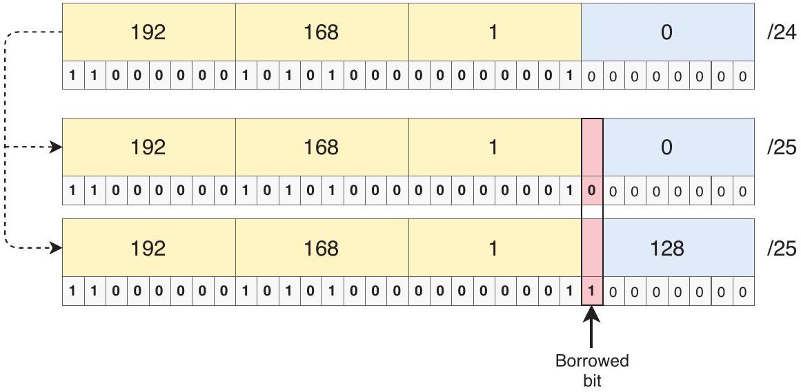
Figure 11.2 Borrowing 1 bit from the host portion of 192.168.1.0/24 allows us to create two subnets: 192.168.1.0/25 and 192.168.1.128/25. The borrowed bit was part of the host portion of the original address block, but it is part of the network portion of each subnet (as indicated by the /25 prefix length).

NOTE In previous examples, the network address always ended in .0. However, when subnetting, because the boundary between the network portion and host portion can lie in the middle of an octet, the network address does not necessarily end in .0. 192.168.1.0 is the network address of the 192.168.1.0/25 subnet, and 192.168.1.128 is the network address of the 192.168.1.128/25 subnet.

With the borrowed bit set to 0, we get the first subnet: 192.168.1.0/25. If we change the borrowed bit to 1 , we get the second subnet: 192.168.1.128/25. That's how subnets are made: by changing the binary value of the borrowed bit(s).

Borrowing a single bit from the host portion allows us to make two subnets, so how many subnets can we make if we borrow 2 bits? We covered this in section 11.1: each bit added to the prefix length (each bit borrowed from the host portion) doubles the number of subnets. The formula is $2^{\mathrm{x}}$, where $x$ is the number of borrowed bits, and therefore borrowing 2 bits allows us to make $4\left(2^{2}\right)$ subnets. Figure 11.3 shows the four subnets that can be made by borrowing 2 bits from the host portion of the 192.168.1.0/24 block.

192.168.1.0/24 address block
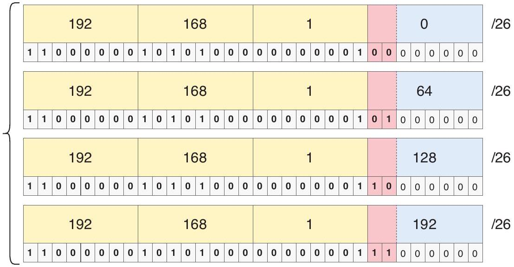

Figure 11.3 Borrowing 2 bits from 192.168.1.0/24 allows for four subnets: 192.168.1.0/26, 192.168.1.64/26, 192.168.1.128/26, and 192.168.1.192/26.

NOTE In the first subnet, the borrowed bits are 00. How can you know what the next subnet is? Just count up in binary: the number after 00 is 01, then 10, and then 11. As we covered in chapter 7, counting in binary is the same process as counting in decimal, except there are only two digits to work with: 0 and 1.

## Calculating the five attributes of a /24+ subnet

In chapter 7, we covered five attributes of an IPv4 network: network address, broadcast address, first usable address, last usable address, and maximum number of hosts. Those same attributes apply when dividing networks into subnets. Here's a quick review of each attribute:

- Network address-The first address of a subnet, with a host portion of all 0s.
- Broadcast address-The last address of a subnet, with a host portion of all 1s.
- First usable address-The first address in the subnet that can be assigned to a host. It can be calculated by adding 1 to the network address (changing the last bit to 1).
- Last usable address-The last address in the subnet that can be assigned to a host. It can be calculated by subtracting 1 from the broadcast address (changing the last bit to 0).
- Maximum number of hosts-The number of IP addresses available to assign to hosts. The formula is $2^{\mathrm{y}}-2$, where $y$ is the number of bits in the host portion. 2 is subtracted because the network and broadcast addresses cannot be assigned to hosts.

Figure 11.4 shows the five attributes of one of the subnets from figure 11.3: the 192.168.1.64/26 subnet. The calculations are the same as we covered in chapter 7-just keep in mind that the borrowed bits are now part of the network portion. Because the prefix length in this example is /26, only the last 6 bits are the host portion.

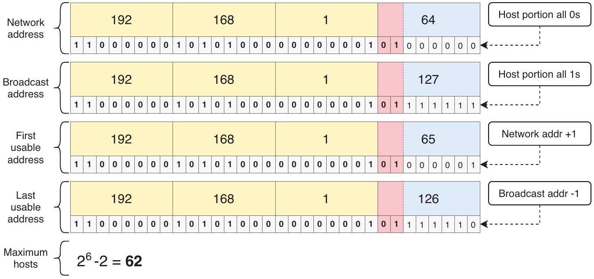
Figure 11.4 The five attributes of the 192.168.1.64/26 subnet. The first 26 bits are the network portion, and the final 6 bits are the host portion. The network address is 192.168.1.64 (host portion all Os). The broadcast address is 192.168.1.127 (host portion all 1s). The first usable address is 192.168.1.65 (network address + 1). The last usable address is 192.168.1.126 (broadcast address - 1). The maximum number of hosts in the subnet is $62\left(2^{6}-2\right)$.

A common subnetting problem is something like this: "PC1 has IP address 172.16.20.27/28. What is the network address of the subnet it belongs to?" To solve a question like this, you can follow these three steps:

1 Write the address in binary: 10101100.00010000.00010100.00011011
${ }_{2}$ Change the host portion to all 0s: 10101100.00010000.00010100.00010000
3 Convert back to dotted decimal: 172.16.20.16. That's the answer!

EXAM TIP You should be able to identify any of the five attributes of a particular subnet, not just the network address. Such problems could appear on the CCNA exam as standalone questions or as part of more complex questions.

## /24+ SUBNET MASKS

Ideally, we would be able to just write prefix lengths in CIDR notation, without having to worry about subnet masks. However, because you have to use subnet masks when configuring IP addresses and static routes in Cisco IOS, they are necessary to learn.

To review, a subnet mask is a series of 32 bits that indicates which bits in an IP address are part of the network portion and which are part of the host portion. A bit set to 1 in the subnet mask means that the bit in the same position of the IP address is part of the network portion, and a bit set to 0 in the subnet mask means that the bit in the same position of the IP address is part of the host portion. And because an IP address consists of the network portion followed by the host portion, a subnet mask is a series of 1s followed by a series of 0s (unless it is all 0s, as in /0, or all 1s, as in /32).

When only dealing with /8, /16, and /24 prefix lengths, subnet masks are simple: 255.0.0.0, 255.255.0.0, or 255.255.255.0, respectively. When using CIDR, however, the boundary between network and host portion can lie in the middle of an octet, which results in other possible subnet masks. Table 11.1 lists prefix lengths from /24 to /32 and their equivalent subnet masks written in binary and dotted decimal. You should familiarize yourself with these subnet masks; you'll need to know them when configuring Cisco routers. For reference, table 11.1 also lists the maximum number of hosts in a subnet of each size.

Table 11.1 /24+ prefix lengths and subnet masks
| Prefix length | Subnet mask (binary) | Subnet mask (decimal) | Maximum number of hosts (2¹-2) |
| :--- | :--- | :--- | :--- |
| /24 | 11111111.11111111.11111111.00000000 | 255.255.255.0 | 254 |
| /25 | 11111111.11111111.11111111.10000000 | 255.255.255.128 | 126 |
| /26 | 11111111.11111111.11111111.11000000 | 255.255.255.192 | 62 |
| /27 | 11111111.11111111.11111111.11100000 | 255.255.255.224 | 30 |
| /28 | 11111111.11111111.11111111.11110000 | 255.255.255.240 | 14 |
| /29 | 11111111.11111111.11111111.11111000 | 255.255.255.248 | 6 |
| /30 | 11111111.11111111.11111111.11111100 | 255.255.255.252 | 2 |
| /31 | 11111111.11111111.11111111.11111110 | 255.255.255.254 | 2 (see the following) |
| /32 | 11111111.11111111.11111111.11111111 | 255.255.255.255 | 1 (see the following) |


Prefix lengths of /31 and /32 are special cases when it comes to calculating the maximum number of hosts in a subnet. A /31 prefix length, for example, leaves a single
host bit. If we use the formula $2^{\mathrm{y}}-2$ to calculate the maximum number of hosts in the subnet, the result is 0; a single host bit only allows for two addresses, and those are taken by the network and broadcast addresses, resulting in no usable addresses. For this reason, /31 prefix lengths were unused for a long time.

However, for the purpose of further preserving the IPv4 address space, an exception to the normal rules was made for / 31 prefix lengths: they can be used for point-to-point links-connections between two routers, which only require two IP addresses. In this case, the subnet does not have a network address or broadcast address. Before this exception was made, point-to-point links used / 30 prefix lengths, leaving two host bits and therefore two usable addresses $\left(2^{2}-2=2\right)$. This works fine, and / 30 prefix lengths are still commonly used for point-to-point links today, but /31 prefix lengths are more efficient; they only consume two IP addresses, rather than four.

NOTE Although /31 subnets are more efficient, /30 subnets are still the more common choice since /31 technically breaks the network/broadcast address rule.

Figure 11.5 demonstrates a point-to-point link between two routers, providing two options for the subnet used for the connection: 203.0.113.0/30 can be used, which consumes a total of four addresses. Or 203.0.113.0/31 can be used, which consumes only two addresses.


Figure 11.5 A point-to-point link connecting R1 to R2. Traditionally, a /30 subnet would be used for a connection like this, as in option 1. In modern networks, a /31 subnet, as in option 2, is also valid (and more efficient).

In the following example, I configure R1 G0/0's IP address using a /31 prefix length (subnet mask 255.255.255.254). The router then displays a message warning that /31 prefix lengths should be used cautiously:

```
    Configures a /31 prefix length
R1(config-if)# ip address 203.0.113.0 255.255.255.254
% Warning: use /31 mask on non point-to-point interface cautiously
```

NOTE A /32 subnet mask can be used to specify a single IP address in a route, as covered in chapter 9. However, a /32 subnet mask is rarely configured on an interface (although we will cover an exception in chapter 18, on OSPF).

### 11.2.2 Subnetting /16 address blocks

Subnetting an address block with a prefix length shorter than /24 can seem intimidating at first; you can no longer focus only on the final octet of the address. However, let me assure you that the process of subnetting does not change at all:

- The number of subnets you can make is still $2^{\mathrm{x}}$, where $x$ is the number of borrowed bits.
- The maximum number of hosts per subnet is still $2^{y}-2$, where $y$ is the number of host bits.
- The subnet's network address is still the address with a host portion of all 0s.

I think you get the idea! The only difference is that converting between decimal and binary takes a little more care. Because there's no need to introduce any new concepts, in this section, I'll demonstrate how the previous concepts apply to address blocks with a /16+ prefix length. Table 11.2 summarizes some ways a /16 address block can be subnetted. As before, each borrowed bit doubles the amount of subnets that can be made but halves the total number of addresses per subnet (table 11.2 displays the maximum number of hosts per subnet, rather than the total number of addresses).

Table 11.2 Subnetting a /16 address block
| Prefix length | Subnet mask (decimal) | Borrowed bits | Number of subnets | Maximum number of hosts per subnet (2¹-2) |
| :--- | :--- | :--- | :--- | :--- |
| /16 | 255.255.0.0 | 0 | 1 | 65,534 |
| /17 | 255.255.128.0 | 1 | 2 | 32,766 |
| /18 | 255.255.192.0 | 2 | 4 | 16,382 |
| /19 | 255.255.224.0 | 3 | 8 | 8190 |
| /20 | 255.255.240.0 | 4 | 16 | 4094 |
| /21 | 255.255.248.0 | 5 | 32 | 2046 |
| /22 | 255.255.252.0 | 6 | 64 | 1022 |
| /23 | 255.255.254.0 | 7 | 128 | 510 |
| /24 | 255.255.255.0 | 8 | 256 | 254 |
| /25 | 255.255.255.128 | 9 | 512 | 126 |


NOTE Table 11.2 only shows prefix lengths up to /25, but / 16 address blocks can be subnetted up to /32 as well.

In figure 11.3, we saw how borrowing two bits from the 192.168.1.0/24 address block allows for four subnets to be made. Figure 11.6 demonstrates the same, but this time using the 192.168.0.0/16 address block.

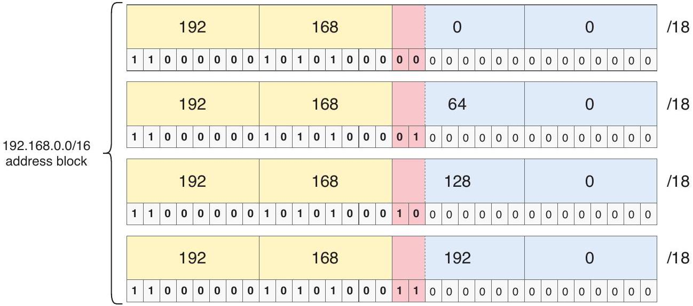
Figure 11.6 Borrowing two bits from 192.168.0.0/16 allows for four subnets: 192.168.0.0/18, 192.168.64.0/18, 192.168.128.0/18, and 192.168.192.0/18.

Calculating the five attributes is the same process as before. Figure 11.7 takes one of the subnets from figure 11.6 (192.168.128.0/18) and shows the five attributes of that subnet.

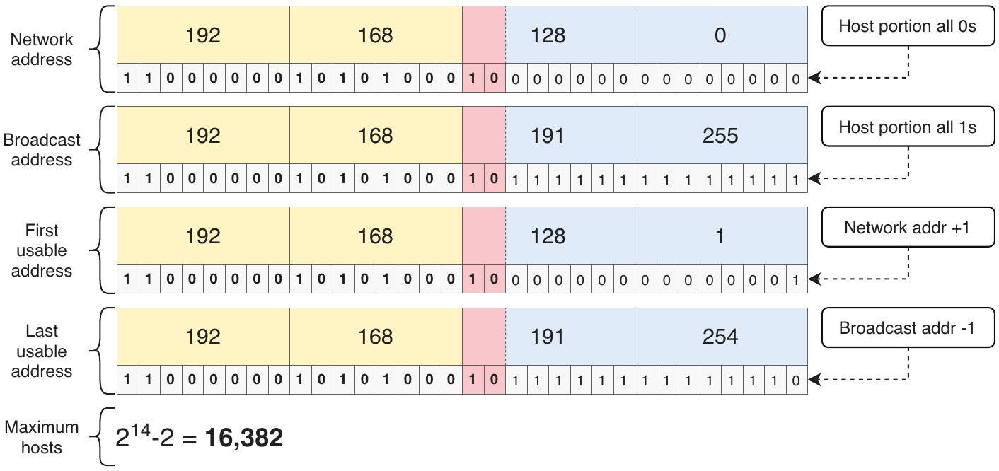
Figure 11.7 The five attributes of the 192.168.128.0/18 subnet. The first 18 bits are the network portion, and the final 14 bits are the host portion. The network address is 192.168.128.0 (host portion all 0s). The broadcast address is 192.168.191.255 (host portion all 1s). The first usable address is 192.168.128.1 (network address + 1). The last usable address is 192.168.191.254 (broadcast address - 1). The maximum number of hosts in the subnet is $\mathbf{1 6 , 3 8 2}\left(\mathbf{2}^{\mathbf{1 4}}-\mathbf{2}\right)$.

NOTE /18 is a very large subnet size, containing 16,382 host addresses per subnet. You will probably never configure a /18 subnet on an interface, but for the CCNA exam, you should be able to create subnets of any size.

### 11.2.3 Subnetting /8 address blocks

Subnetting a /8 address block is, once again, the same process we have seen up to this point. However, a /8 address block means there are 24 host bits-lots of bits to either borrow and make lots of subnets, or use to make a few very large subnets. Table 11.3 summarizes some ways that a /8 address block can be subnetted.

Table 11.3 Subnetting a /8 address block
| Prefix length | Subnet mask (decimal) | Borrowed bits | Number of subnets | Maximum number of hosts per subnet (2¹-2) |
| :--- | :--- | :--- | :--- | :--- |
| /8 | 255.0.0.0 | 0 | 1 | 16,777,214 |
| /9 | 255.128.0.0.0 | 1 | 2 | 8,388,606 |
| /10 | 255.192.0.0 | 2 | 4 | 4,194,302 |
| /11 | 255.224.0.0 | 3 | 8 | 2,097,150 |
| /12 | 255.240.0.0 | 4 | 16 | 1,048,574 |
| /13 | 255.248.0.0 | 5 | 32 | 524,286 |
| /14 | 255.252.0.0 | 6 | 64 | 262,142 |
| /15 | 255.254.0.0 | 7 | 128 | 131,070 |
| /16 | 255.255.0.0 | 8 | 256 | 65,534 |
| /17 | 255.255.128.0 | 9 | 512 | 32,766 |


NOTE Because of the number of host bits in a /8 address block, the number of hosts per subnet for each prefix length listed in table 11.3 is extremely large. When actually subnetting a /8 block, you will probably borrow many bits to make smaller subnets; a subnet with millions of addresses is never necessary.

In figure 11.8, I borrow 12 bits from the 10.0.0.0/8 address block, which allows for 4,096 separate subnets to be made. Of course, I'm not going to write out all 4,096 subnets, so figure 11.8 shows only the first subnet and the final two subnets.

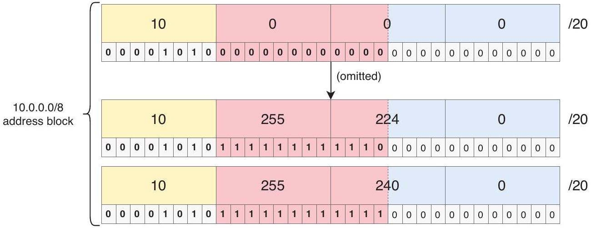
Figure 11.8 Borrowing 12 bits from 10.0.0.0/8 allows for 4,096 subnets. 10.0.0.0/20 is the first subnet, and 10.255.224.0/20 and 10.255.240.0/20 are the final two.

NOTE Figure 11.8 differs from the previous examples in that the borrowed bits cross between octets (all of the second octet and the first four bits of the third octet). This doesn't change anything about how subnetting works! Keep in mind that the octet divisions only exist to make addresses more human-readable; to a computer, an IP address is just a series of 32 bits-no octet divisions.

Calculating the five attributes of a subnet doesn't change, regardless of the size of the original address block or how many bits you borrow, so we won't go through a third example here. For some additional practice, I recommend taking one of the subnets shown in figure 11.8 and calculating the five attributes: network address, broadcast address, first usable address, last usable address, and maximum number of hosts.

### 11.2.4 FLSM scenarios

As mentioned at the beginning of this chapter, subnetting is a skill that takes practice to become proficient. At the end of this chapter, I will give some recommendations for free websites where you can find subnetting practice questions. Before that, let's go through a couple of scenarios that resemble what you might find on those websites (and on the CCNA exam itself).

Figure 11.9 provides a practice scenario in which we will use FLSM to divide the 172.25.190.0/23 address block into four subnets of equal size, calculate the maximum number of hosts in each subnet, and configure the first usable address of each subnet on R1's interfaces.

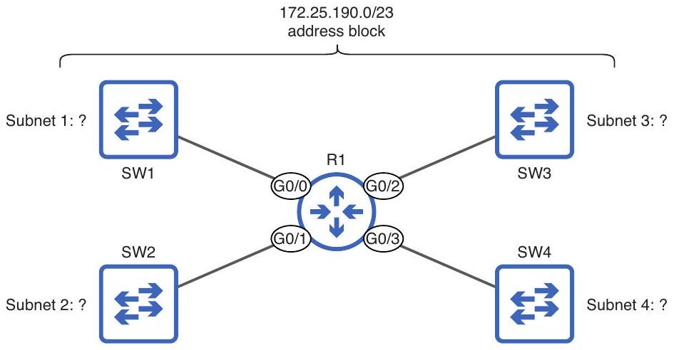
1. Subnet the 172.25.190.0/23 address block into four subnets, and identify each subnet.
2. How many host addresses are available in each subnet?
3. Configure the first usable address of each subnet on R1's interfaces.

NOTE The example in figure 11.9 is the first time we are beginning with an address block that is not /8, /16, or /24, but the subnetting process remains the same.

To begin, let's identify the four subnets. How many bits do we need to borrow to divide an address block into four subnets? As we've seen in a couple of previous examples, we need to borrow 2 bits to make four subnets because $2^{2}=4$. Then, we can just count up with those 2 borrowed bits to create four subnets. Figure 11.10 shows the four subnets that can be created by borrowing 2 bits from the 172.25.190.0/23 address block. Because we borrow 2 bits from the host portion, each subnet's prefix length is / $25(/ 23+2)$.

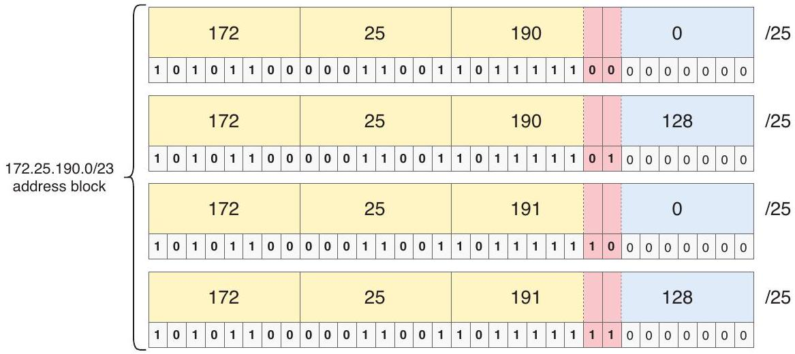
Figure 11.10 The subnets that can be created by subnetting 172.25.190.0/23 into four equal parts: 172.25.190.0/25, 172.25.190.128/25, 172.25.191.0/25, and 172.25.191.128/25. Borrowing 2 bits from the host portion of the /23 address block results in four /25 subnets.

We have now solved the first part of the scenario: identifying the four subnets. The second part asks how many host addresses are available in each subnet. To solve this,
just use the same formula as always: $2^{\mathrm{y}}-2$ ( $y$ being the number of host bits). The original address block was /23, meaning there were 9 host bits. However, after borrowing 2 host bits to make subnets, 7 host bits remain. Therefore, there are $126\left(2^{7}-2\right)$ host addresses available in each subnet.

The final part of the scenario says to configure the first usable address of each subnet on R1's interfaces. The first usable address can be calculated with the usual method: add 1 to the network address of each subnet. In the following example, I configure R1's interfaces with the first usable address of each subnet:
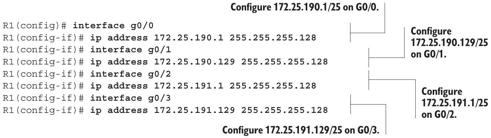

We have now solved the scenario! Let's walk through one more scenario, this time text only: you have been given the 10.224.0.0/11 address block. You must create 2,000 subnets, which will be assigned to various offices and departments within a large company. What prefix length must you use to create a sufficient number of subnets? How many host addresses are in each subnet?

To solve this scenario, we first have to determine how many bits we must borrow to create 2,000 subnets. If you have learned your powers of 2, this shouldn't be too difficult: 1 bit gives 2 subnets, 2 bits gives 4 subnets, 3 bits gives 8 subnets, and so on, and then 11 bits gives 2,048 subnets. That's 48 more than we need in the scenario, but borrowing 10 bits would give only 1,024 subnets (not enough), so 11 bits is our answer. Borrowing 11 bits from the host portion results in a /22 prefix length, which is the answer to the first part of the scenario. Figure 11.11 demonstrates this and shows the first subnet and the last (2,048th) subnet.

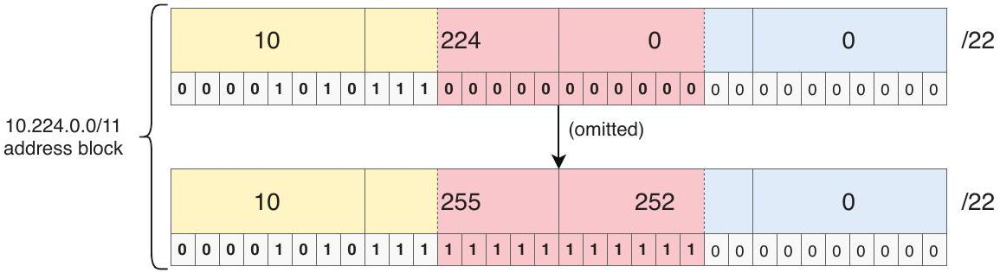
Figure 11.11 Borrowing 11 bits from the host portion of the 10.224.0.0/11 address block allows for $\mathbf{2 , 0 4 8}$ subnets. The first subnet is 10.224.0.0/22 (all borrowed bits set to 0), and the last (2048th) subnet is 10.255.252.0/22 (all borrowed bits set to 1).

A / 22 prefix length means that 10 host bits remain, so now we can calculate the number of host addresses in each subnet: $1022\left(2^{10}-2\right)$. And now we have solved the scenario!

NOTE Because the number of subnets increases by a power of 2 for each borrowed bit, you often won't be able to create exactly the number of subnets needed; you'll probably end up with some extra subnets, which is not a bad thing-they can be used to accommodate network expansions in the future. Likewise, you often won't be able to create subnets of exactly the size you need; you'll usually have some extra addresses in each subnet.

### 11.3 VLSM subnetting

Variable-Length Subnet Masking (VLSM) allows us to subnet an address block even more efficiently than FLSM by creating subnets of varying sizes. Although FLSM is a helpful introduction to subnetting, when actually subnetting networks in the real world, chances are you'll be doing VLSM. Figure 11.12 shows the scenario I will use to demonstrate VLSM.


Figure 11.12 A VLSM scenario in which you must assign subnets from the 10.89.100.0/24 address block to each LAN and the WAN connection and identify the five attributes of each subnet

A /24 address block includes 254 host addresses, and the total number of host addresses required in figure 11.12's scenario is 226, so the address space is sufficient. Using FLSM to create subnets of equal size would result in some subnets having too few addresses (Toronto LAN A requires 122 host addresses) and some subnets having too many addresses (the WAN connection only requires 2 host addresses, for R1 and R2). However, if we use VLSM, we can make some subnets smaller and some larger, allowing us to efficiently use the available address block. The high-level VLSM process is as follows:

1 Assign the largest subnet at the start of the address block.

2 Assign the second-largest subnet after it.
3 Repeat the process until all subnets have been assigned.

The five subnets in figure 11.12, in order from largest to smallest, are Toronto LAN A (122 hosts), Tokyo LAN A (59 hosts), Toronto LAN B (30 hosts), Tokyo LAN B (11 hosts), and the WAN connection (2 hosts)-so let's start by assigning Toronto LAN A.

NOTE Router IP addresses are included in the "host" counts; any device with an IP address can be considered a host. The term end host is usually used to refer to PCs, servers, etc. to distinguish them from network infrastructure devices like routers.

Figure 11.13 visually represents the five subnets that will result from this process: one /25 subnet (128 addresses), one /26 subnet (64 addresses), one /27 subnet (32 addresses), one /28 subnet (16 addresses), and one /30 subnet (4 addresses). In the following sections, we'll walk through how to perform VLSM subnetting and create these five subnets.


Figure 11.13 The 10.89.100.0/24 address block, divided into five subnets of varying sizes. (1) Toronto LAN A is 10.89.100.0/25, containing 128 addresses. (2) Tokyo LAN A is 10.89.100.128/26, containing 64 addresses. (3) Toronto LAN B is 10.89.100.192/27, containing 32 addresses. (4) Tokyo LAN B is 10.89.100.224/28, containing 16 addresses. (5) The WAN connection is 10.89.100.240/30, containing 4 addresses. After subnetting, 12 addresses remain unused: 10.89.100.244 through 10.89.100.255.

NOTE For practical reasons, figure 11.13 doesn't show the number of addresses in /30 subnets (4 addresses each) and doesn't include columns for /31 subnets (2 addresses each) and /32 subnets (1 address each).

### 11.3.1 Assigning Toronto LAN A's subnet

Toronto LAN A requires 122 host addresses, so the question is, what is the minimum number of host bits required to provide at least 122 host addresses? Referring to the formula we use to calculate the maximum number of host bits in a subnet $\left(2^{\mathrm{y}}-2\right)$, what is the minimum $y$ value that would serve our purpose? The answer is 7 because $2^{7}-2=126$, only a few more addresses than we need. Six host bits would give us only 62 host addresses ( $2^{6}-2$ )-not enough for the 122 hosts in Toronto LAN A. To leave 7 host bits, we have to borrow 1 bit from the /24 address block. Figure 11.14 shows the resulting subnet when we borrow a single host bit from the 10.89.100.0/24 address block: 10.89.100.0/25-Toronto LAN A's subnet! Figure 11.14 also lists the five attributes of the subnet.

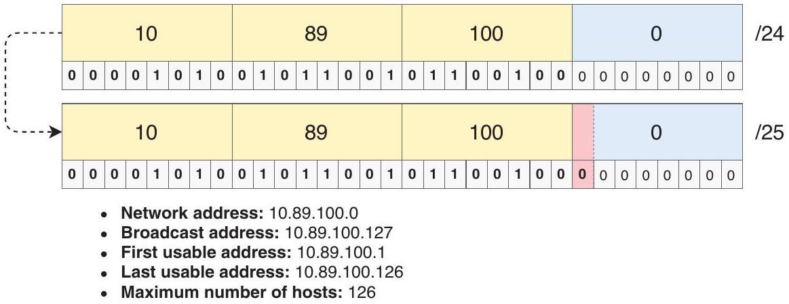
Figure 11.14 Toronto LAN A's subnet. Borrowing 1 bit from the 10.89.100.0/24 address block results in the $\mathbf{1 0 . 8 9 . 1 0 0 . 0} / \mathbf{2 5}$ subnet, supporting up to $\mathbf{1 2 6}$ host addresses-enough for the $\mathbf{1 2 2}$ hosts in the LAN.

By assigning the 10.89.100.0/25 subnet to Toronto LAN A, we have already used half of the available address space: from 10.89.100.0 through 10.89.100.127. The entire 10.89.100.0/24 address block includes 256 addresses, and a single /25 subnet takes up 128 of those addresses (keep in mind that only 126 of those 128 addresses can be assigned to hosts). We will assign the rest of the subnets from the remaining range of addresses: 10.89.100.128 through 10.89.100.255.

### 11.3.2 Assigning Tokyo LAN A's subnet

After assigning Toronto LAN A's subnet and identifying its five attributes, we can easily identify one more piece of information: Tokyo LAN A's network address. The last address (not the last usable address) in Toronto LAN A is 10.89.100.127-the broadcast address. Without knowing any other information about Tokyo LAN A, we can identify
its first IP address (the first address immediately after Toronto LAN A's broadcast address), which is 10.89.100.128. This is Tokyo LAN A's network address because the first IP address of a subnet is the network address.

Now that we know Tokyo LAN A's network address we just need to figure out how many host bits are needed (which determines the prefix length), and then we can calculate the other attributes. Tokyo LAN A requires enough addresses for 59 hosts, so 6 host bits are required, giving $62\left(2^{6}-2\right)$ usable addresses-a /26 prefix length. Therefore, the subnet we should assign to Tokyo LAN A is 10.89.100.128/26. Figure 11.15 shows the subnet and its five attributes.

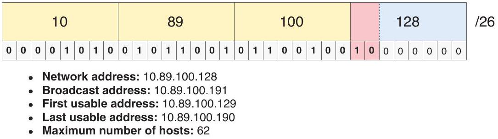
Figure 11.15 Tokyo LAN A's subnet. The network address is 10.89.100.128-the first address after Toronto LAN A. A /26 prefix length is used to allow for up to 62 host addresses-enough for the 59 hosts in the LAN.

We have now assigned three-quarters of the 10.89.100.0/24 address block: a /25 subnet (one-half) and a /26 subnet (one-quarter). The remaining range of addresses is 10.89.100.192 through 10.89.100.255, and we will assign the remaining three subnets from that range.

### 11.3.3 Assigning Toronto LAN B's subnet

The IP address immediately after Tokyo LAN A's final address (its broadcast address) is 10.89.100.192, and that is Toronto LAN B's network address. What about its prefix length? Toronto LAN B requires IP addresses for at least 30 hosts, meaning 5 host bits are required, which gives exactly $30\left(2^{5}-2\right)$ host addresses. Therefore, Toronto LAN B's subnet should use a /27 prefix length, resulting in subnet 10.89.100.192/27. Figure 11.16 shows the subnet and its five attributes.

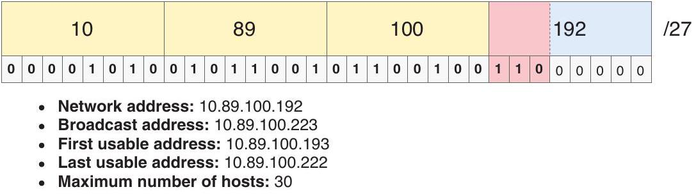
Figure 11.16 Toronto LAN B's subnet. The network address is 10.89.100.192-the first address after Tokyo LAN A. A /27 prefix length is used to allow for up to 30 host addresses-exactly the amount needed.

NOTE In a real-world situation, you should leave a bit of room in each subnet to allow for future growth; you may need to add more hosts to the subnet at some point. However, when doing subnetting scenarios like this (and on the CCNA exam), just use the most efficient prefix length, leaving as few unused addresses in the subnet as possible.

We have now assigned seven-eighths of the 10.89.100.0/24 address block: a /25 subnet (one-half), a /26 subnet (one-quarter), and a /27 subnet (one-eighth). The remaining range of addresses is 10.89.100.224 through 10.89.100.255, and we will use that range to assign the remaining subnets: Tokyo LAN B and the WAN connection between R1 and R2.

### 11.3.4 Assigning Tokyo LAN B's subnet

We can use the same process to assign Tokyo LAN B's subnet. Its network address is the first address after the previous LAN's (Toronto LAN B's) broadcast address, so Tokyo LAN B's network address is 10.89.100.224. Tokyo LAN B is a small LAN, requiring only 11 host addresses. Therefore, only 4 host bits are required, allowing for up to \$14\left(2^{4}-\right.\$2) host addresses, so Tokyo LAN B's subnet is 10.89.100.224/28. Figure 11.17 shows the subnet and its five attributes.

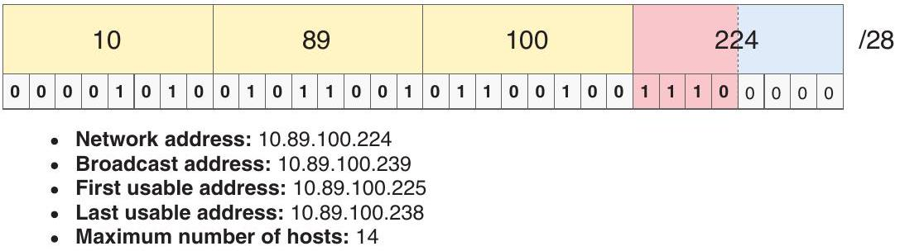
Figure 11.17 Tokyo LAN B's subnet. The network address is 10.89.100.224-the first address after Toronto LAN B. A /28 prefix length is used to allow for up to 14 host addresses-sufficient for the 11 hosts in the LAN.

Only one-sixteenth of the 10.89.100.0/24 address block remains-addresses 10.89.100.240 through 10.89.100.255. Fortunately, that is more than enough addresses for the final subnet: the WAN connection between R1 and R2.

### 11.3.5 Assigning the WAN connection's subnet

The WAN connection between R1 and R2 is a point-to-point connection, requiring only two host addresses. The network address is 10.89.100.240 (the first address after Tokyo LAN B's broadcast address), but what should the prefix length be? As we covered in section 11.2.1, there are two options: a /30 prefix length (two usable addresses, four addresses in total) or a /31 prefix length (two usable addresses, without network and broadcast addresses). Either prefix length is a valid choice, but for this example, I'll use a /30 prefix length, so the WAN connection's subnet is 10.89.100.240/30. Figure 11.18 shows the subnet and its five attributes.


Figure 11.18 The WAN connection's subnet. The network address is 10.89.100.240-the first address after Tokyo LAN B. A /30 prefix length is used to allow for two host addresses-one for R1, and one for R2.

NOTE When I visually represented these five subnets in figure 11.13, I selected a /30 prefix length for the WAN connection's subnet. The main reason for that choice was a practical one; the boxes to represent /31 subnets in the diagram would be too small. For consistency's sake, I used a /30 prefix length here, but keep in mind that a /31 prefix length is valid too and is actually superior in that it consumes fewer addresses.

And now we are done! We have assigned all five subnets, with only a few IP addresses to spare (10.89.100.244 through 10.89.100.255); these addresses are free to be used as needed in the future as this hypothetical enterprise expands. With FLSM, this would not have been possible, but VLSM gives us the flexibility to create subnets of varying sizes.

## Exam scenarios

Being comfortable with subnetting is a key element of CCNA exam success. Here are a couple of examples of how your knowledge of subnetting might be tested on the CCNA exam:

1 (multiple choice, multiple answers)
Which of the following prefix length to subnet mask pairs are correct? (Select two.)
    A $/ 25=255.255 .255 .192$
    B $/ 15=255.252 .0 .0$
    c $/ 29=255.255 .255 .248$
    D $/ 27=255.255 .255 .240$
    E $/ 18=255.255 .192 .0$
    F $/ 10=255.224 .0 .0$

Subnet masks are necessary for configuring IP addresses and static routes in Cisco IOS, so it's important that you are able to identify the correct subnet mask for a given prefix length. Fortunately, subnet masks are fairly simple-a series of binary 1s followed by a series of binary Os. In this case, (C) is the first correct option; /29 is equivalent to 255.255.255.248 (29 binary 1s followed by 3 binary 0s, written in dotted decimal). (E) is the second correct option; /18 is equivalent to 255.255.192.0. As I've said previously, being comfortable converting between binary and dotted decimal is key!
(continued)

2 (drag and drop)
Drag each subnet on the left to its appropriate usable host address range on the right. There are more usable address ranges provided than subnets, so not all address ranges will be used.

| (A) 10.23.24.128/25 | 10.23.24.65-10.23.24.79 |
| :--- | :--- |
| (B) 10.23.24.128/27 | 10.23.24.65-10.23.24.78 |
| (C) 10.23.24.64/26 | 10.23.24.65-10.23.24.126 |
| (D) 10.23.24.64/28 | 10.23.24.129-10.23.24.254 |
|  | 10.23.24.129-10.23.24.190 |
|  | 10.23.24.129-10.23.24.158 |

Identifying a subnet's usable address range requires identifying the subnet's first and last usable addresses; they identify the start and end of the usable address range. In this question, (A)'s usable address range is 10.23.24.129 to 10.23.24.254, (B)'s usable address range is 10.23.24.129 to 10.23.24.158, (C)'s usable address range is 10.23.24.65 to 10.23.24.126, and (D)'s usable address range is 10.23.24.65 to 10.23.24.78. To solve this question, just focus on the final octet of each address; the first three octets are the same in all of them.

### 11.4 Additional subnetting practice

To become proficient at subnetting, you need to practice. Fortunately, there are some free websites that generate subnetting problems you can solve. One example is https://www.subnetting.net/, but you can find others with a quick Google search. I recommend spending a bit of time each day practicing subnetting for at least a week or two or until you feel confident solving questions on the practice sites.

Before sending you off to try out practice questions, I want to mention two points. First, some practice questions you encounter may not explicitly state the size of the address block you must subnet. Here's an example: "What is the maximum number of valid subnets and usable hosts per subnet that you can get from the network 172.26.0.0 255.255.252.0?" In such cases, assume the original address block is a classful network. In this example, the IP address is 172.26.0.0, which is a class B address (because it starts with 0b10), so you can assume that the address block is /16 (172.26.0.0/16).

The second point is that some questions will ask about wildcard masks, which are similar to subnet masks, but not actually related to the topic of subnetting. We will cover wildcard masks in chapter 17 (Dynamic Routing), as well as chapters 23 and 24 (Access Control Lists). For now, you can skip any questions on a practice website that mention wildcard masks.

## The "magic number" method

Some instructors teach shortcuts that can help you solve subnetting scenarios without having to think about the underlying binary; one famous example is called the "magic number" method. I do not agree with these methods for CCNA candidates because I think they only serve as a crutch, helping you to solve subnetting problems without understanding how subnetting actually works. It may seem cumbersome to always be thinking about binary, but with practice, it will become effortless. And you'll become better not just at subnetting but at all of the other necessary skills that require proficiency with binary (I listed some in chapter 7).

## Summary

- Classless Inter-Domain Routing (CIDR) replaced classful addressing, allowing prefix lengths outside of the traditional /8, /16, and /24.
- With CIDR, an address block can be divided into smaller networks called subnets. This process is called subnetting.
- Fixed-Length Subnet Masking (FLSM) subnetting divides an address block into subnets of equal size.
- Variable-Length Subnet Masking (VLSM) subnetting divides an address block into subnets of varying size.
- To subnet an address block, you "borrow" bits from the host portion of the address block and add them to the network portion. Whereas the network portion of the original address block cannot be changed, the borrowed bits can be changed to make different subnets.
- Each additional borrowed bit doubles the number of subnets that can be made: 1 borrowed bit = 2 subnets, 2 borrowed bits = 4 subnets, 3 borrowed bits = 8 subnets, etc. However, each additional borrowed bit halves the number of addresses in each subnet because there are fewer bits in the host portion.
- The five attributes of an IPv4 network are calculated in the same manner for subnets: the network address is the first address of a subnet (host portion of all 0s), the broadcast address is the last address of a subnet (host portion of all 1s), the first usable address is the first address after the network address, the last usable address is the last address before the broadcast address, and the maximum number of hosts is $2^{\mathrm{y}}-2$, where $y$ is the number of host bits.
- For point-to-point links (connections between two routers), either a /30 or a /31 prefix length can be used. /30 consumes four addresses (network address, broadcast address, and two host addresses), whereas /31 consumes only two addresses (two host addresses, without a network or broadcast address).
- To subnet an address block using VLSM, assign the largest subnet at the start of the address block, assign the second-largest subnet after it, and repeat the process until all subnets have been assigned.

- The network address of the next subnet is the address immediately after the broadcast address of the current subnet.
- In a real-world situation, you should leave some room in each subnet for future growth. When doing subnetting scenarios for practice (or for the CCNA exam), be as efficient as possible (leave as few unused addresses as possible).

## Part 3

## Layer 2 concepts

In part 3, we will build upon your foundational understanding of how switches provide connectivity within a LAN. You have already grasped the basics of MAC address learning and aging, frame forwarding and flooding, and other key operations of switches. Now, let's delve deeper into several advanced features that optimize and secure LANs. We'll start in chapter 12 by exploring virtual LANs (VLANs), which allow us to divide a single physical switch into multiple virtual switches, dividing the LAN into multiple separate segments and enhancing its security and efficiency.

In chapter 13, we will continue on the topic of VLANs, covering two auxiliary protocols that streamline the configuration and management of VLANs on Cisco switches: Dynamic Trunking Protocol (DTP) and VLAN Trunking Protocol (VTP). We will then shift our attention to Spanning Tree Protocol (STP) in chapter 14 and Rapid Spanning Tree Protocol (RSTP) in chapter 15. These protocols are vital for preventing broadcast storms-broadcast frames that infinitely loop around the switches in the LAN, clogging up the LAN and preventing hosts in the LAN from communicating.

Finally, we will conclude part 3 by examining EtherChannel in chapter 16. EtherChannel allows multiple physical connections between two switches to form a single logical connection, increasing the available bandwidth in the LAN. By the end of part 3, you will understand these concepts both theoretically and practically and be able to implement them on Cisco switches; this is essential both for CCNA exam success and for any network professional who wants to design, implement, and troubleshoot modern LANs effectively.

Licensed to Luke Chen [mic215fa@gmail.com](mailto:mic215fa@gmail.com)

## VLANs

## This chapter covers

- How to divide a switch into multiple virtual switches with VLANs
- How to configure trunk ports to carry traffic in multiple VLANs
- Routing between VLANs with a router or multilayer switch

In chapter 11, we covered subnetting, which allows us to divide a network into smaller subnets. This is an example of network segmentation-the division of a network into smaller parts. Virtual LANs (VLANs, pronounced "V-LANs"), the topic of this chapter, can be likened to subnets in that they also allow us to divide up a network into smaller parts. With VLANs, we can divide a LAN (a broadcast domain) into smaller LANs, called VLANs. Whereas subnets allow us to segment the network at Layer 3, VLANs allow us to segment the network at Layer 2. In this chapter, we will cover three CCNA exam topics, all related to the topics of switches and VLANs:


- 1.1.b Layer 2 and Layer 3 switches
- 2.1 Configure and verify VLANs (normal range) spanning multiple switches
- 2.2 Configure and verify interswitch connectivity

### 12.1 Why we need VLANs

To understand a technology, it's important to understand why that technology existsto understand the problem it solves. To demonstrate the role VLANs play in segmenting networks, let's examine a network without segmentation, a network with Layer 3 segmentation, and a network with both Layer 3 and Layer 2 segmentation.

### 12.1.1 Layer 3 segmentation with subnets

Figure 12.1 depicts an office LAN consisting of three different departments: engineering, HR, and sales. All hosts belong to the 172.16.1.0/24 network, enabling them to communicate directly without using the router as an intermediary.

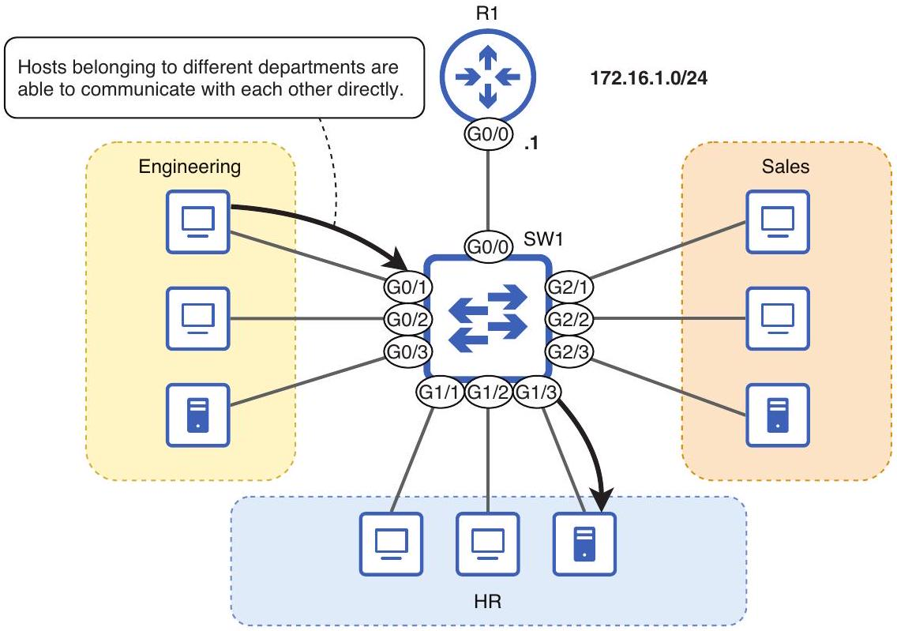
Figure 12.1 An unsegmented LAN. All hosts are in the 172.16.1.0/24 network, and VLANs are not used to segment the LAN at Layer 2. Hosts belonging to different departments can communicate with each other directly (by sending their packets in frames addressed directly to each other).

From an information security standpoint, this is not suitable for modern networks. Instead of having all hosts within a single large network, we should use subnetting to segment the network at Layer 3, with each department assigned its own subnet. Figure 12.2 demonstrates how hosts in different departments communicate after the network has been divided into separate subnets.


Figure 12.2 A LAN segmented into three subnets. The engineering department uses subnet 172.16.1.0/26, the HR department uses subnet 172.16.1.64/26, and the sales department uses subnet 172.16.1.128/26. R1 has one interface in each subnet. Communication between hosts in different departments must go through R1.

NOTE In an ideal network, hosts in each subnet would have their own switch to connect to. However, in reality, switches are usually shared, as in figure 12.2; hosts in 172.16.1.0/26, 172.16.1.64/26, and 172.16.1.128/26 all connect to SW1. Network infrastructure is a cost, so reducing the necessary amount of hardware is desirable.

You might be wondering how segmenting the LAN into separate subnets enhances security. By requiring traffic between departments to pass through the router, you can control which traffic is permitted and which is not; security policies can be implemented on the router to control traffic. Figure 12.2 depicts a PC in the engineering department accessing a server used by the HR department; this is an example of traffic you might want to restrict. You could choose to block all hosts outside the HR department from accessing the server or only allow specific types of communication with the server.

NOTE In this chapter, we will not cover how to use a router to control which traffic is permitted and which is denied. For now, we will segment the network but will not specify which traffic to permit or deny. We will cover access control lists (one method to control traffic) in part 6 of this book.

### 12.1.2 Layer 2 segmentation with VLANs

Using subnetting, we have segmented the LAN at Layer 3. However, switches aren't Layer 3 aware. From SW1's perspective, all hosts are still part of the same LAN; they are in the same broadcast domain. A broadcast frame sent from any host connected to SW1 will be received by all other connected hosts (the same applies to unknown unicast frames). Figure 12.3 demonstrates this: when a host in the engineering department sends a broadcast frame, SW1 floods it to all other connected hosts, regardless of the subnet.

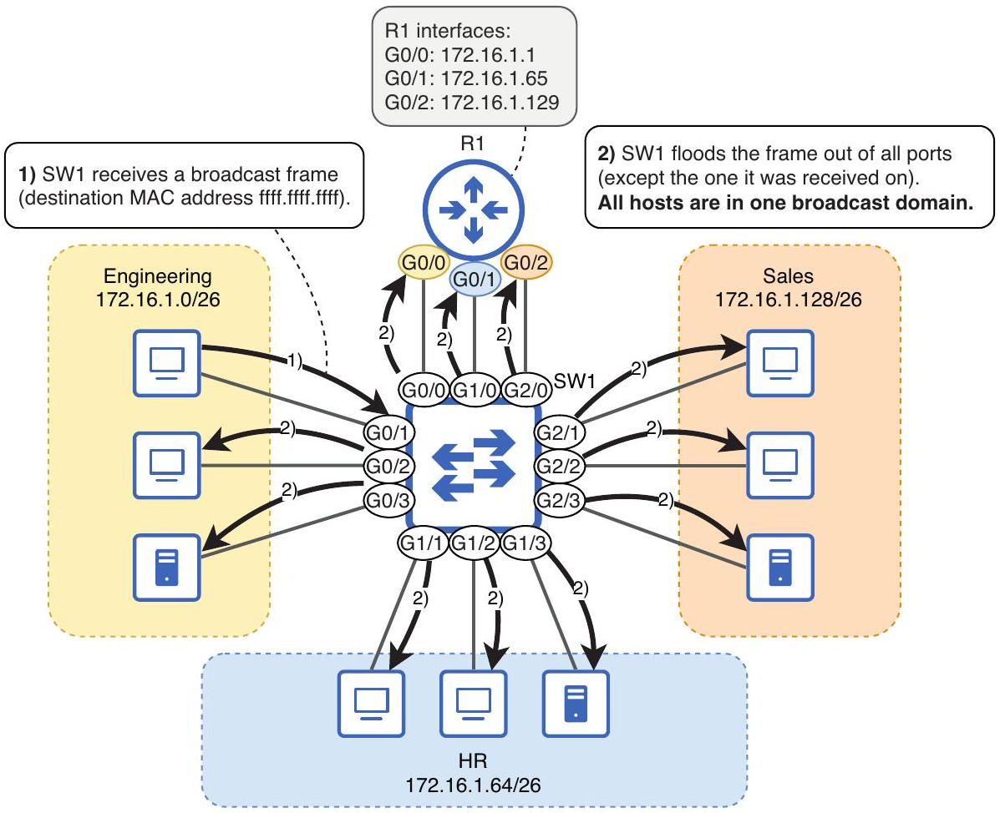
Figure 12.3 Although hosts are divided into three subnets, at Layer 2, they are still part of the same broadcast domain (LAN). (1) SW1 receives a broadcast frame from a host in the engineering department. (2) SW1 floods the frame out of all ports, except the one it was received on. The LAN has been segmented at Layer 3, but not at Layer 2.

NOTE One definition of a LAN is "a group of interconnected devices in a limited area," but as covered in chapter 6, a more nuanced definition considers how the devices are connected and how network traffic is forwarded between them, rather than just their physical location. For this chapter, a LAN is the same thing as a broadcast domain-the group of devices that will receive a broadcast frame sent by any other member of the group.

From a security perspective, this is still not suitable-traffic from hosts in one subnet can reach hosts in other subnets. Furthermore, all hosts being in the same broadcast domain can have negative effects on network performance; the unnecessary flooding of frames out of all ports can cause or worsen network congestion. To solve these issues, we should segment the network at Layer 2, and we can use VLANs to do so.

VLANs allow us to divide a single physical switch into multiple virtual switches, thereby dividing the broadcast domain into multiple broadcast domains. Figure 12.4 demonstrates this concept, illustrating how SW1 is divided into multiple virtual switches. By assigning each of SW1's ports to a specific VLAN, SW1 is divided into three virtual switches: one for VLAN 10, one for VLAN 20, and one for VLAN 30. These VLAN numbers are arbitrary; I selected VLANs 10, 20, and 30 for this example, but any numbers within the valid range can be used (more on that in section 12.2.1).


Figure 12.4 By assigning SW1's interfaces to three separate VLANs, SW1 is divided into three virtual switches, each a separate broadcast domain. G0/0, G0/1, G0/2, and G0/3 are part of VLAN 10. G1/0, G1/1, G1/2, and G1/3 are part of VLAN 20. G2/0, G2/1, G2/2, and G2/3 are part of VLAN 30. SW1 will not forward or flood a frame out of ports in a different VLAN than the port the frame was received on.

NOTE The physical network in figure 12.4 is the same as we saw in figure 12.3; the only difference is that SW1's ports are now in three separate VLANs. I have shown SW1 as three separate virtual switches to illustrate how VLANs work. Network diagrams are usually not represented in this manner; in a typical network diagram, VLANs are labeled, but only the physical switch is shown.

We have now successfully segmented the LAN at both Layer 3 (with subnets) and Layer 2 (with VLANs). SW1 will not forward or flood frames between VLANs-hosts in separate VLANs can only communicate with each other through R1. As a general rule, there should be a one-to-one relationship between subnets and VLANs, as shown in figure 12.4-one subnet per VLAN. If you continue your studies beyond the CCNA, you will find cases where there are multiple subnets associated with a single VLAN, but for the CCNA, you can assume that they are one-to-one.

### 12.2 Configuring VLANs and access ports

Up to this point in the book, we haven't done much configuration of switches. That's because a switch can fulfill its basic role of forwarding frames without any particular configuration; it builds its MAC address table automatically by examining the source MAC address of frames it receives and then can forward frames between hosts in a LAN. However, to use VLANs, we must configure them on the switch's ports.

### 12.2.1 Creating and naming VLANs

First, let's examine the default status of VLANs on SW1. The following example shows the output of the show vlan brief command before configuring any VLANs. This command shows the list of VLANs that exist on the switch (the VLAN database), as well as which ports are in each VLAN:


There are two main takeaways from that output. First, without any configuration, all of SW1's ports are in VLAN 1. VLAN 1 is the default VLAN-the VLAN that all ports are in by default. We can also confirm this by looking at the switch's MAC address table; all MAC addresses are learned in VLAN 1, as shown in the leftmost column of the following example:

```
SW1# show mac address-table
    Mac Address Table
```

SW1 learned all MAC
addresses in VLAN 1.

The second takeaway from the output of show vlan brief is that VLANs 1002, 1003, 1004, and 1005 also exist on the switch by default. These VLANs are reserved for use by FDDI and Token Ring-two legacy Data Link Layer technologies. FDDI and Token Ring are no longer used in modern networks, but even in modern versions of Cisco IOS, these four VLANs are reserved for backward compatibility-they cannot be deleted or used for Ethernet VLANs.

NOTE There are 4096 VLANs in total (from 0 through 4095), but VLANs 0 and 4095 are reserved for special purposes beyond the scope of the CCNA exam. With VLANs 1002-1005 being reserved for FDDI and Token Ring, the range of usable VLANs is 1 to 1001 and 1006 to 4094 (4,090 VLANs in total). That means that a single LAN (broadcast domain) can be divided into a maximum of 4,090 VLANs-far more VLANs than most LANs will ever need.

To configure a VLAN, use the vlan vlan-id command from global configuration mode (vlan-id is a number). That will take you to VLAN configuration mode, from which you can also configure the VLAN's name with the name vlan-name command. In the following example, I create and name VLANs 10, 20, and 30 on SW1 and then confirm with show vlan brief (leaving VLANs 1002-1005 out of the output to save space):

```
SW1(config)# vlan 10
SW1(config-vlan) # name Engineering
SW1(config-vlan)# vlan 20
SW1(config-vlan) # name HR
SW1(config-vlan) # vlan 30
SW1(config-vlan) # name Sales
SW1(config-vlan) # end
SW1# show vlan brief
VLAN Name
----
1 default
10 Engineering
20 HR
    Sales
. . .
```

```
Creates and names VLAN 10
Creates and names VLAN 20
Creates and names VLAN 30
```

```
Ports
GiO/O, GiO/1, GiO/2, GiO/3
Gil/O, Gil/1, Gil/2, Gil/3
Gi2/O, Gi2/1, Gi2/2, Gi2/3
```

VLANs 10, 20, and 30 are in SW1's VLAN database.

NOTE Naming a VLAN is optional. If you don't configure a name, the default name is $V L A N x x x x$, where $x x x x$ is the VLAN ID in four digits (i.e., VLAN0010 for VLAN 10).

In the previous example, the status of each VLAN is active. However, you can temporarily disable a VLAN by using the shutdown command in VLAN configuration mode. In the following example, I disable VLAN 10 on SW1 and confirm with show vlan brief. Notice that the status changes to act/lshut (active/locally shutdown):

```
SW1(config)# vlan 10
SW1(config-vlan) # shutdown
SW1(config-vlan)# end
SW1# show vlan brief
VLAN Name Status Ports
---- ------------------------------- --------- -------------------------------
. . .
10 Engineering act/lshut
```

VLAN 10 is active in the LAN
but locally shutdown (on SW1).

NOTE If you want to delete a VLAN entirely, you can negate the command you used to create it by adding no in front of it, such as no vlan 10.

### 12.2.2 Assigning ports to VLANs

Now that we have created VLANs 10, 20, and 30 on SW1, let's assign SW1's ports to the appropriate VLANs. There are two steps to do so:

1 Configure SW1's ports in access mode.
2 Configure the access mode VLAN of the ports.

An access port is a switch port that belongs to a single VLAN, as opposed to a trunk port, which carries traffic in multiple VLANs (we will cover trunk ports in section 12.3). By default, Cisco switch ports use a protocol called Dynamic Trunking Protocol (DTP) to automatically determine whether each port should operate in access mode or trunk mode. We will cover DTP in chapter 13, but for now, just know that it is best practice to manually configure access or trunk mode, rather than letting DTP automatically determine interfaces' status.

You can manually configure a switch port to operate in access mode with the switchport mode access command in interface configuration mode. Then, use the switchport access vlan vlan-id command to configure which VLAN the port belongs to. In the following example, I configure SW1's G0/0, G0/1, G0/2, and G0/3
interfaces as access ports in VLAN 10, its G1/0, G1/1, G1/2, and G1/3 interfaces as access ports in VLAN 20, and its G2/0, G2/1, G2/2, and G2/3 ports as access ports in VLAN 30:

```
SW1(config)# interface range g0/0-3
SW1(config-if-range) # switchport mode access
SW1(config-if-range) # switchport access vlan 10
SW1(config-if-range) # interface range g1/0-3
SW1(config-if-range) # switchport mode access
SW1(config-if-range) # switchport access vlan 20
SW1(config-if-range) # interface range g2/0-3
SW1(config-if-range) # switchport mode access
SW1(config-if-range) # switchport access vlan 30
```

NOTE If you use the switchport access vlan command to assign a port to a VLAN that doesn't exist yet on the switch, the switch will automatically create the VLAN. This means that it's not necessary to create VLANs with the vlan command before assigning ports to VLANs (although it's necessary if you want to use the name command to name the VLANs).

We have now finished configuring SW1! It will forward and flood frames between hosts in each VLAN but not between VLANs-each VLAN is a separate broadcast domain. Keep in mind that VLANs are configured on the switch ports; although it's common to say that an end host is in VLAN X, that host is not actually aware of what VLAN it is in-VLANs are a concept used by switches, not typical end hosts like PCs.

NOTE There are exceptions where end hosts are VLAN aware; we will look at an example when we cover virtual machines in chapter 17 of volume 2.

### 12.3 Connecting switches with trunk ports

Access ports are assigned to a single VLAN, and only forward and flood traffic between ports in the same VLAN. Trunk ports, on the other hand, are not assigned to a single VLAN; rather, they can forward traffic in multiple VLANs. Figure 12.5 shows a situation in which a trunk port should be used: the LAN consists of two switches (SW1 and SW2), and hosts in VLANs 10, 20, and 30 are connected to each switch. For hosts in each VLAN to be able to communicate with each other, the link between SW1 and SW2 must be able to carry traffic in multiple VLANs; to enable that, frames sent between SW1 and SW2 are tagged to indicate which VLAN each frame belongs to.

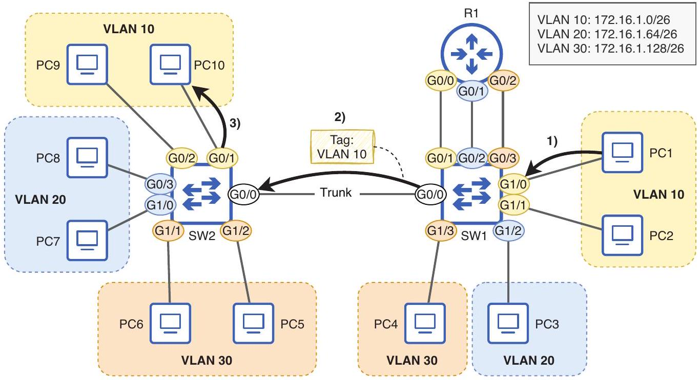
Figure 12.5 SW1 and SW2 are connected by a trunk link, which can carry traffic in multiple VLANs. SW1 and SW2 are two physical switches, each consisting of three virtual switches-one for each VLAN. (1) PC1 (connected to SW1) sends a frame addressed to PC10's MAC. (2) SW1 forwards the frame out of its G0/0 port, which is in trunk mode. It adds a tag to the frame, indicating that the frame is in VLAN 10. (3) SW2 forwards the frame out of its G0/1 port (untagged).

NOTE Instead of connecting SW1 and SW2 with a single trunk link, another option is to use a separate access link between the switches for each VLAN (one for VLAN 10, one for VLAN 20, and one for VLAN 30). Although this could work in small networks with few VLANs, this does not scale to networks with many VLANs; a trunk link is a better option.

That's how trunk ports work: the switch forwarding a frame adds a tag before sending it out of the trunk port. For that reason, another name for a trunk port is a tagged port. The switch receiving the frame then checks the tag and assigns the frame to the VLAN specified by the tag. If the frame's destination is in a different VLAN than the one specified by the tag, the switch won't be able to forward the frame to its proper destination; remember, hosts in different VLANs can't communicate directly with each other.

Likewise, another name for an access port is an untagged port; frames forwarded by an access port are not tagged to indicate the VLAN, and frames received by an access port are assigned to the VLAN specified in the switchport access vlan command. Because access ports are associated with only one VLAN, a tag is not necessary to identify which VLAN frames that are sent and received by the port belong to.

NOTE Access ports are typically used to connect to end hosts, such as PCs. Trunk ports are typically used to connect to other switches (and sometimes routers, as we'll see in section 12.4).

### 12.3.1 The IEEE 802.1Q tag

The protocol used to tag frames forwarded out of trunk ports is IEEE 802.1Q (typically pronounced "dot one Q"). The 802.1Q tag is 4 bytes in length and is added in between the Source and EtherType fields of the Ethernet header. Figure 12.6 shows the position of the 802.1Q tag within a frame, as well as the fields of the tag.


Figure 12.6 The 802.1Q tag's position in an Ethernet frame and the field of the tag. The fields are TPID (Tag Protocol Identifier) and TCI (Tag Control Information). TCI contains three subfields: PCP (Priority Code Point), DEI (Drop Eligible Indicator), and VID (VLAN Identifier).

The Tag Protocol Identifier (TPID) field is 16 bits in length and always contains the value 0x8100. When a frame is 802.1Q tagged, the TPID field is in the position the EtherType field would normally be. When the switch sees the value $0 \times 8100$ here, it knows the frame is tagged using 802.1Q; that's the purpose of the TPID field.

The second half of the 802.1Q is the Tag Control Information (TCI), which contains three subfields: PCP, DEI, and VID. The Priority Code Point (PCP) field is 3 bits in length and can be used to mark frames as higher or lower in priority; this is used for Quality of Service (QoS), a topic we will cover in chapter 10 of volume 2. The Drop Eligible Indicator (DEI) field is a single bit in length and is also used for QoS; it can be used to indicate frames that can be dropped if the network is congested.

The VLAN Identifier (VID) field is perhaps the most important; it's the field that indicates which VLAN the frame is in. It is 12 bits in length, and that's why there are 4,096 VLANs in total ( $2^{12}=4096$ ).

## Cisco Inter-Switch Link

Before IEEE 802.1Q, Cisco developed a protocol called Inter-Switch Link (ISL) to tag frames over trunk links. As a Cisco-proprietary protocol, ISL can only be used by Cisco switches. Whereas 802.1Q adds a 4-byte tag to the Ethernet header, ISL encapsulates the Ethernet frame with a 26-byte header and 4-byte trailer, containing an FCS (separate from the Ethernet trailer's FCS).

ISL is now considered deprecated and is not supported on new Cisco switches. However, you may still encounter Cisco switches that support both 802.1Q and ISL; in such cases, an extra command is required when configuring trunk ports, as we will cover in section 12.3.2. Although you don't have to know ISL itself for the CCNA exam, you should understand how it affects trunk configuration on switches that support it (by requiring an extra command).

### 12.3.2 Configuring trunk ports

To demonstrate the configuration of trunk ports, let's configure SW1's G0/0 port as we saw in figure 12.5-a trunk link capable of carrying traffic in VLANs 10, 20, and 30. Although I will only demonstrate SW1's side of the link, if you're trying this out yourself, make sure that SW2's G0/0 port is configured to match (with the same commands as on SW1). In the following example, I attempt to configure SW1 G0/0 as a trunk, but the command is rejected.

```
SW1(config)# interface g0/0
SW1(config-if) # switchport mode trunk
Command rejected: An interface whose trunk encapsulation
-is "Auto" can not be configured to "trunk" mode.
```

The command is rejected.

The reason the command is rejected is that SW1 supports both 802.1Q and ISL. By default, ports on a switch that supports both 802.1Q and ISL will use DTP (mentioned earlier in section 12.2.2) to automatically determine which of the two protocols to use for the trunk. However, to manually configure the port in trunk mode, you must also manually configure the encapsulation protocol (802.1Q or ISL); you can't manually configure trunk mode, but you can allow DTP to automatically determine whether to use 802.1Q or ISL. The command to configure which protocol to use is switchport trunk encapsulation \{dot1q | isl\}. In the following example, I configure G0/0 to use 802.1Q, and then I can successfully configure G0/0 as a trunk port:

```
SW1(config-if)# switchport trunk encapsulation dot1q
SW1(config-if) # switchport mode trunk
```

Manually configures

```
SW1(config-if) #
```

802.1Q encapsulation

NOTE If a switch only supports 802.1Q (not ISL), it is not necessary to use the switchport trunk encapsulation command before switchport mode trunk; in fact, the switch won't even support the switchport trunk encapsulation command.

After configuring a port as a trunk, it will no longer appear in the output of show vlan brief. The example below demonstrates this; G0/0 is not present in the output. Note that I configured SW1's access ports in their appropriate VLANs, according to figure 12.5:

```
        GO/1, G1/0, and G1/1 are access ports in VLAN 10.
            GO/1, G1/0, and G1/1 are access ports in VLAN 10.
        Status Ports
    --------- -------------------------------
    active Gi2/0, Gi2/1, Gi2/2, Gi2/3
    active GiO/1, Gil/O, Gil/1
    active Gi0/2, Gil/2
    active Gi0/3, Gil/3
            GO/2 and G1/2
            are access ports
GO/3 and G1/3 are access ports in VLAN 30.
            in VLAN 20.
```

To verify trunk ports, you can use the command show interfaces trunk, as shown in the following example. The output is divided into four parts, but we will focus on the first three:
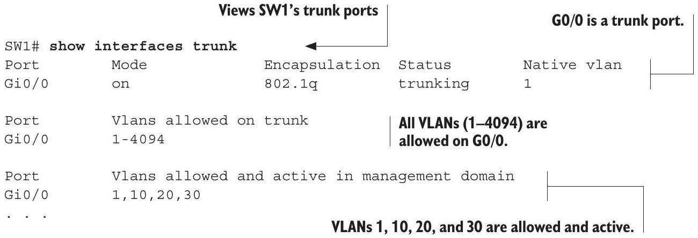

The first section (the top two lines) lists each trunk port and some basic information. The value of on in the Mode column means that G0/0 is manually configured as a trunk (with the switchport mode trunk command). The encapsulation column is self-explanatory; the value is 802.1q because I configured the switchport trunk encapsulation dot1q command earlier. The Status column says trunking; this is expected because I manually configured G0/0 in trunk mode. The final column is Native vlan; the native VLAN is an important topic to understand for the CCNA, and we will cover it in this section.

The second part of the output lists the VLANs allowed on each trunk port (vlans allowed on trunk). As indicated by 1-4094, all VLANs are allowed on a trunk port by default; this means that traffic in all VLANs can be forwarded and received by the port.

However, the following part lists the VLANs that are allowed and exist on the switch (Vlans allowed and active in management domain). VLAN 1 exists by default, and I created VLANs 10, 20, and 30, so those four are listed here. If a VLAN does not exist on a switch, it cannot forward traffic in that VLAN; therefore, although all VLANs are allowed on the trunk, SW1 can only forward traffic in VLANs 1, 10, 20, and 30.

NOTE The management domain referred to in the line vlans allowed and active in management domain is a reference to the VLAN Trunking Protocol (VTP) domain. VTP is one of the topics of chapter 13, so I won't mention it any further in this chapter.

## Modifying the list of allowed VLANs

Although all VLANs are allowed on a trunk port by default, it is considered best practice to allow only the necessary VLANs. This can help to limit the size of broadcast domains; if a VLAN isn't allowed on a trunk, broadcast (and unknown unicast) frames in that VLAN won't be flooded out of the interface. The command to configure the list of VLANs allowed on the trunk is switchport trunk allowed vlan, and then there are several possible keywords and arguments, as shown in the following example:

Configures the VLANs allowed on the trunk

```
SW1(config-if)# switchport trunk allowed vlan
    WORD VLAN IDs of the allowed VLANs when this port is
    - in trunking mode
    add add VLANs to the current list
    all all VLANs
```

The available keywords

```
    except all VLANs except the following
```

and arguments

```
    none no VLANs
    remove remove VLANs from the current list
```

WORD allows you to specify the list of VLANs allowed on the trunk as an argument, such as switchport trunk allowed vlan 10,20,30; this will allow only VLANs 10, 20, and 30 on the trunk. This is the desired state for the network we saw in figure 12.5, which uses only VLANs 10, 20, and 30. I demonstrate this configuration in the following example:

Allows VLANs 10, 20, and 30

```
SW1(config-if)# switchport trunk allowed vlan 10,20,30
SW1(config-if) # do show interfaces trunk
. . .
Port Vlans allowed on trunk
```

Only VLANs 10, 20, and 30

```
Gi0/0 10,20,30
```

are allowed on G0/0.

The other options are keywords, and for the CCNA exam, it's important to understand how each keyword functions. add and remove are used to modify the current list of allowed VLANs. In the following example, I add VLAN 1 and remove VLAN 30 from the list of allowed VLANs; the list of allowed VLANs then changes to 1, 10, and 20:

```
Adds VLAN 1 to GO/O’s list of allowed VLANs
```

Removes VLAN 30 from GO/0's list of
SW1(config-if)\# switchport trunk allowed vlan add 1 allowed VLANs SW1(config-if)\# switchport trunk allowed vlan remove 30 SW1(config-if)\# do show interfaces trunk

```
Port Vlans allowed on trunk
Gi0/0 1,10,20
```

VLANs 1, 10, and 20 are allowed on G0/0.

The all and none keywords are self-explanatory; all allows all VLANs (the default setting), and none allows no VLANs, preventing the port from forwarding or receiving any traffic. In the following example, I demonstrate both keywords:

```
SW1(config-if)# switchport trunk allowed vlan all
SW1(config-if) # do show interfaces trunk
```

```
Allows all VLANs
```

on GO/0

All VLANs are allowed on G0/0.

Allows no VLANs
Allows no VLANs
Allows no VLANs on GO/0 on GO/0 on GO/0
. . .

```
Port Vlans allowed on trunk
Gi0/0 none
```

No VLANs are allowed on G0/0.

The final keyword is except, which allows all VLANs except the VLAN(s) you specify as an argument. In the following example, I return the list of allowed VLANs to the desired state (allowing only VLANs 10, 20, and 30) by using the except keyword and specifying all VLANs except 10, 20, and 30 (a bit unconventional, but this is just a demonstration!):

```
Allows all VLANs on GO/0
except 1-9, 11-19,
SW1(config-if)# switchport trunk allowed vlan except
21-29, and 31-4094
= 1-9,11-19,21-29,31-4094
SW1(config-if)# do show interfaces trunk
. . .
Port Vlans allowed on trunk
```

Only VLANs 10, 20, and 30

```
Gi0/0 10,20,30
```

are allowed on G0/0.

```
. . .
```


## Don't forget add!

A common rookie mistake (and the subject of many networking memes-yes, such a thing exists!) is to forget the add keyword when modifying the list of allowed VLANs on a trunk. For example, if you want to add VLAN 40 to the list of allowed VLANs, but you use the command switchport trunk allowed vlan 40, you haven't added VLAN 40 to the list of allowed VLANs; you have replaced the list of allowed VLANs with only VLAN 40!

It's a simple mistake, but the results can be disastrous: blocking all communications over the trunk except for hosts in a single VLAN. This is a potential "trick question" on the exam, so make sure you are aware of the difference between specifying the list of allowed VLANs (switchport trunk allowed vlan vlans) and adding to the list of allowed VLANs (switchport trunk allowed vlan add vlans).

## The native VLAN

As mentioned in section 12.2, access ports (untagged ports) send and receive frames without 802.1Q tags. Trunk ports (tagged ports), on the other hand, send and receive frames with 802.1Q tags to indicate which VLAN each frame belongs to, but what happens if a switch receives an untagged frame on a trunk port? The native VLAN is the answer to that question.

The native VLAN is the VLAN that untagged traffic received on a trunk port is assigned to. Furthermore, any traffic in the native VLAN forwarded by a trunk port is forwarded without a tag. By default, the native VLAN is VLAN 1, as shown in the output of show interfaces trunk:

```
SW1# show interfaces trunk
Port Mode
Gi0/0 on
. . .
```

```
Encapsulation Status
Native vlan
802.1q
1
```

VLAN 1 is the native VLAN by default.

EXAM TIP The default VLAN and the native VLAN are often confused. The default VLAN is the VLAN that access ports are assigned to by default: VLAN 1 (this cannot be changed). The native VLAN is the VLAN that untagged frames are assigned to when received on a trunk port, and frames in the native VLAN are forwarded untagged over that port. The native VLAN is also VLAN 1 by default, but this can be changed per port.

To configure the native VLAN of a trunk port, use the switchport trunk native vlan vlan-id command. In the following example, I configure VLAN 30 as the native VLAN on SW1's G0/0 interface and then confirm with show interfaces trunk:

```
Changes GO/0’s native
VLAN to VLAN 30
SW1(config-if)# switchport trunk native vlan 30
SW1(config-if)# show interfaces trunk
Port Mode Encapsulation Status
Gi0/0 on 802.1q trunking 30 native VLAN.
```

Figure 12.7 shows how traffic in the native VLAN is forwarded over a trunk link. The frame from PC1 to PC10 (both in VLAN 10) is tagged when SW1 forwards it to SW2. The frame from PC4 to PC5 (both in VLAN 30), however, is not tagged when SW1 forwards it to SW2; VLAN 30 is the native VLAN on SW1's G0/0 port. Likewise, VLAN 30 is the native VLAN on SW2's G0/0 port, so when the frame is received by SW2, SW2 assigns the frame to VLAN 30 and forwards it to the destination (which is also in VLAN 30).

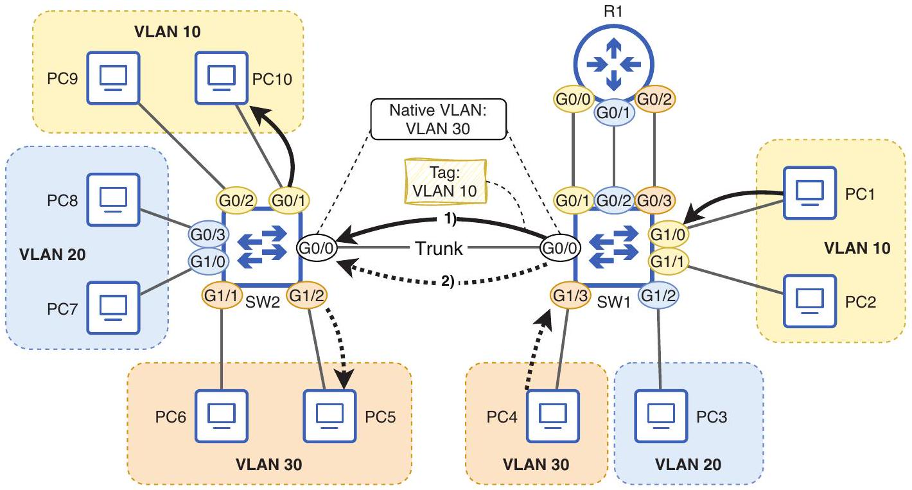
Figure 12.7 Frames forwarded over a trunk link in the native VLAN and a non-native VLAN. (1) PC1's frame to PC10 is tagged over the trunk link because VLAN 10 is not the native VLAN. (2) PC4's frame to PC5 is untagged over the trunk link because VLAN 30 is the native VLAN.

NOTE The native VLAN is configured per port. If a switch has multiple trunk ports, it is possible to configure a different native VLAN on each port.

## Native VLAN Mismatch

Because the native VLAN is configured on each switch's ports, it is possible to configure a different native VLAN on each end of a link. However, this is a misconfiguration and should not be done. Make sure the native VLAN matches on both ends of the link! Figure 12.8 shows one example of what can happen when there is a native VLAN mismatch.


Figure 12.8 A native VLAN mismatch resulting in frames not reaching their destination. SW1 G0/0's native VLAN is VLAN 10, and SW2 GO/0's is VLAN 30. (1) PC1's frame to PC10 is untagged over the trunk link because VLAN 10 is SW1 G0/0's native VLAN. (2) When SW2 receives the frame, it assigns the frame to VLAN 30 (SW2 GO/0's native VLAN) and therefore cannot forward the frame to its destination (in VLAN 10).

SW1 G0/0's native VLAN is 10, but SW2 G0/0's native VLAN is 30. When PC1 sends a frame to PC10, SW1 forwards the frame untagged to SW2. However, when SW2 receives the untagged frame, it assigns the frame to VLAN 30 (SW2 G0/0's native VLAN). Because the frame's destination is connected to SW2's G0/1 (an access port in VLAN 10), SW2 cannot forward the frame to its proper destination. When traffic crosses from one VLAN to another like this, it is called VLAN hopping.

NOTE Cisco switches typically run Per-VLAN Spanning Tree Plus (PVST+) or Rapid Per-VLAN Spanning Tree Plus (Rapid-PVST+). If there is a native VLAN mismatch, these protocols will prevent traffic from being forwarded over the trunk in the mismatched VLANs and display a message indicating so. We will cover PVST+ and Rapid-PVST+ in chapters 14 and 15, respectively. Cisco Discovery Protocol (CDP) can also detect native VLAN mismatches but will not block traffic in the mismatched VLANs; it will only display messages indicating the mismatch. We will cover CDP in chapter 1 of volume 2.

## Disabling the native VLAN

The native VLAN was developed to accommodate devices that do not support 802.1Q tagging, such as hubs. However, these days, there is usually no need to use the native VLAN, and its use can render the network vulnerable to security exploits. Therefore, it is best practice to disable the native VLAN on trunk ports.

However, the native VLAN feature can't actually be disabled; rather, an unused VLAN (that is not the default of VLAN 1) should be configured as the native VLAN, which is equivalent to disabling it. The network I have been using for demonstrations in this chapter uses VLANs 10, 20, and 30, so I could configure switchport trunk native vlan 999 on SW1 and SW2's G0/0 ports to configure VLAN 999-an unused VLAN-as the native VLAN.

EXAM TIP Remember that as a best practice for security: configure an unused VLAN (that isn't the default of VLAN 1) as the native VLAN on your trunk ports.

### 12.4 Inter-VLAN routing

Even after segmenting a LAN into multiple subnets and VLANs, we usually still want the subnets/VLANs to be able to communicate with each other (and external networks). Although routing is a Layer 3 concept and VLANs are a Layer 2 concept, the term inter-VLAN routing is used to refer to routing between subnets in a LAN that is segmented using VLANs.

Up to this point, all of the diagrams in this chapter (aside from figure 12.1, which only depicted one subnet) have shown three links between R1 and SW1-one per subnet/VLAN. This is one option for inter-VLAN routing; the router interfaces are configured as normal, and the switch ports are configured as access ports. Figure 12.9 shows how PC3 (in VLAN 20) can communicate with PC10 (in VLAN 10) in this case.


Figure 12.9 PC3 (in VLAN 20) sends a packet to PC10 (in VLAN 10). (1) PC3 sends the packet in a frame addressed to its default gateway (R1 G0/1). SW2 forwards it out of its G0/2 port (untagged). (2) R1 routes the packet, forwarding it out of G0/0 in a new frame addressed to PC10. The frame is forwarded to PC10 by SW1 and SW2. It is tagged only when crossing the trunk link from SW1 G0/0 to SW2 G0/0.

The following examples show how R1 and SW1 can be configured to enable inter-VLAN routing in this manner:

```
R1(config)# interface g0/0
R1(config-if)# ip address 172.16.1.1 255.255.255.192
R1(config-if) # no shutdown
R1(config-if) # interface g0/1
R1(config-if) # ip address 172.16.1.65 255.255.255.192
R1(config-if) # no shutdown
R1(config-if) # interface g0/2
R1(config-if) # ip address 172.16.1.129 255.255.255.192
R1(config-if) # no shutdown
SW1(config)# interface g0/1
SW1(config-if)# switchport mode access
SW1(config-if) # switchport access vlan 10
SW1(config-if) # interface g0/2
SW1(config-if)# switchport mode access
SW1(config-if) # switchport access vlan 20
SW1(config-if) # interface g0/3
SW1(config-if)# switchport mode access
SW1(config-if) # switchport access vlan 30
```

```
Configures and enables R1 G0/0
(VLAN 10's default gateway)
Configures and enables R1 G0/1
(VLAN 20’s default gateway)
Configures and enables R1 G0/2
(VLAN 30's default gateway)
Configures and enables SW1
GO/1 (VLAN 10)
Configures and enables SW1
GO/2 (VLAN 20)
Configures and enables SW1
GO/3 (VLAN 30)
```

However, this method of inter-VLAN routing is not common for the same reason it's not common to connect switches using access ports: in a LAN with many VLANs, you'll soon run out of physical ports on your devices. Instead, one of the following options is usually preferred:

- Router on a stick (a trunk link between the switch and router)
- Multilayer switch (a switch that can also route packets)

### 12.4.1 Router on a stick

Router on a stick (ROAS) is a method of inter-VLAN routing that involves creating a trunk link between a switch and a router; a single physical router interface can be divided into multiple virtual subinterfaces, each with its own IP address. These subinterfaces send and receive tagged frames, like a trunk port on a switch. Figure 12.10 shows how the same packet from PC3 to PC10 can be routed using ROAS.


Figure 12.10 PC3 (in VLAN 20) sends a packet to PC10 (in VLAN 10), and the packet is routed using the router on a stick method. R1's G0/0 interface has three subinterfaces: G0/0.10 (VLAN 10, 172.16.1.1), G0/0.20 (VLAN 20, 172.16.1.65), and G0/0.30 (VLAN 30, 172.16.1.129). PC3's frame to R1 is tagged in VLAN 20 over the trunk link from SW1 G0/1 and R1 G0/0. R1's frame to PC10 is tagged in VLAN 10 over the trunk link from R1 G0/0 to SW1 G0/1, and the trunk link from SW1 G0/0 to SW2 G0/0.

NOTE A router's physical interface and virtual subinterfaces all share the same MAC address. When a frame arrives on the physical interface, the router knows
which subinterface the frame is destined for based on the frame's VLAN tag rather than based on the frame's destination MAC address.

## Configuring ROAS

Let's see how to configure ROAS as shown in figure 12.10. SW1's side of the connection is a trunk port, just like we configured in section 12.3. In the following example, I configure SW1 G0/1 as a trunk port, allow only the necessary VLANs, and change the native VLAN to an unused VLAN:
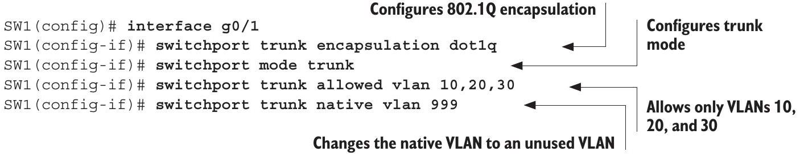

NOTE As mentioned previously, switches that only support 802.1Q (and not ISL) don't require the switchport trunk encapsulation command before the switchport mode trunk command.

Next up is R1's configuration; here we'll use some new commands. To configure a subinterface, use the interface command and follow the interface name with a period and a number that identifies the subinterface, such as interface $\mathrm{g} 0 / 0.10$; this will bring you to subinterface configuration mode. In the following example, I enable R1's G0/0 interface and then enter subinterface configuration mode for the G0/0.10 subinterface. Notice that the prompt changes to R1 (config-subif) \#:
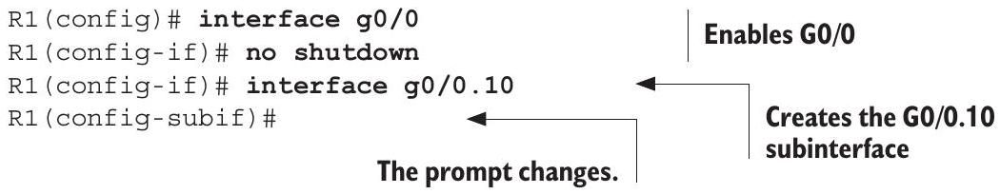

NOTE The G0/0 interface itself does not need any additional configurations; just make sure you enable it with no shutdown.

Once in subinterface configuration mode, there are two things to configure on the subinterface: the VLAN associated with the subinterface and the IP address. To configure the VLAN ID, use the encapsulation dot1q vlan-id command. In the following example, I configure the VLAN ID and IP address of R1's G0/0.10 subinterface:
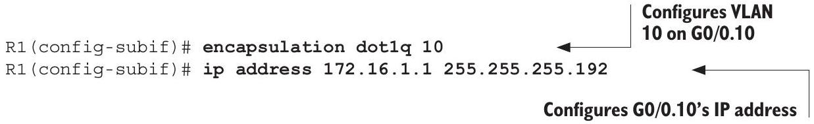

After these configurations, any frames R1 receives on its G0/0 interface that are tagged with VLAN 10 will be sent to the G0/0.10 subinterface, and any frames sent by the G0/0.10 subinterface will be tagged with VLAN 10.

NOTE The number used to identify the subinterface (the . 10 in G0/0.10) does not have to match the VLAN ID; the number has no significance beyond identifying the subinterface. It's the encapsulation dot1q command that tells the router which VLAN to associate with this subinterface. However, I recommend you match these two numbers; there's no reason not to.

In the following example, I configure two more subinterfaces: one for VLAN 20 and one for VLAN 30. I then confirm with the show ip interface brief command. Notice that the G0/0 interface itself does not have an IP address; rather, the three virtual subinterfaces have IP addresses, and they send and receive traffic through the physical G0/0 interface:

```
R1(config-subif) # interface g0/0.20
R1(config-subif) # encapsulation dot1q 20
R1(config-subif) # ip address 172.16.1.65 255.255.255.192
R1(config-subif) # interface g0/0.30
R1(config-subif) # encapsulation dot1q 30
R1(config-subif) # ip address 172.16.1.129 255.255.255.192
R1(config-subif) # do show ip interface brief
```

| Interface | IP-Address | OK? Method Status |
| :--- | :--- | :--- |
| GigabitEthernet0/0 | unassigned | YES manual up |
| GigabitEthernet0/0.10 | 172.16.1.1 | YES manual up |
| GigabitEthernet0/0.20 | 172.16.1.65 | YES manual up |
| GigabitEthernet0/0.30 | 172.16.1.129 | YES manual up |

```
Configures the GO/0.20
subinterface
Configures the GO/0.30
subinterface
Protocol
up
up
up
up
GO/0’s three subinterfaces
The physical GO/0 interface
```

The ROAS configuration is now complete; R1 can route traffic between the three subnets/VLANs in the LAN, using the single physical trunk connection with SW1. Note that I didn't do any configurations related to the native VLAN on R1's side of the connection; if not using the native VLAN, there is no need to do any particular configurations on the router.

## Configuring the native VLAN with ROAS

If you decide to use the native VLAN over the ROAS trunk, there are two methods to configure the router's side of the connection:

- Use the encapsulation dot1q vlan-id native command on the appropriate subinterface.
- Configure the IP address for the native VLAN on the physical interface, not a subinterface.

Let's try both. In the following example, I show the ROAS configuration once again, this time configuring VLAN 10 as the native VLAN by adding the native keyword to
the encapsulation dot1q command. Aside from that, the configurations are identical to the previous examples:

```
R1(config) # interface g0/0
R1(config-if) # no shutdown
R1(config-if) # interface g0/0.10
R1(config-subif) # encapsulation dot1q 10 native
R1(config-subif) # ip address 172.16.1.1 255.255.255.192
R1(config-subif) # interface g0/0.20
R1(config-subif) # encapsulation dot1q 20
R1(config-subif) # ip address 172.16.1.65 255.255.255.192
R1(config-subif) # interface g0/0.30
R1(config-subif) # encapsulation dot1q 30
R1(config-subif) # ip address 172.16.1.129 255.255.255.192
```

In the following example, I use the second method of configuring the native VLAN on the router. I don't configure a subinterface for VLAN 10, but rather configure the native VLAN's IP address on the G0/0 interface itself; the encapsulation dot1q command is not necessary for VLAN 10 in this case, although it's still needed on the subinterfaces of the non-native VLANs (VLANs 20 and 30):

```
R1(config) # interface g0/0
R1(config-if) # no shutdown
R1(config-if)# ip address 172.16.1.1 255.255.255.192
R1(config-if) # interface g0/0.20
R1(config-subif) # encapsulation dot1q 20
R1(config-subif) # ip address 172.16.1.65 255.255.255.192
R1(config-subif) # interface g0/0.30
R1(config-subif) # encapsulation dot1q 30
R1(config-subif) # ip address 172.16.1.129 255.255.255.192
```

NOTE Whichever method you use to configure the native VLAN on the router, make sure the native VLAN matches on the switch.

### 12.4.2 Multilayer switching

The third option for inter-VLAN routing, and perhaps the most popular (although ROAS is common as well), is to use a multilayer switch. A multilayer switch (also called a Layer 3 switch) is a switch that is also capable of routing packets; it's a switch with a router built in.

NOTE: A standard switch that only forwards frames can be called a Layer 2 switch. However, nowadays, almost all switches have some degree of Layer 3 capabilities, so the difference between a multilayer switch and a Layer 2 switch is often determined by how you use the switch rather than the switch itself.

## Inter-VLAN routing via SVIs

Multilayer switches perform inter-VLAN routing using virtual interfaces called switch virtual interfaces (SVIs). Each SVI is an interface on the multilayer switch's built-in
router, and hosts in each VLAN use the IP address of their VLAN's SVI as their default gateway.

Figure 12.11 shows the internal logic of how SW1 (now a multilayer switch) routes a packet from PC1 to PC5. PC1 sends the packet in a frame addressed to SW1's VLAN 10 SVI-each SVI has a unique MAC address. SW1's internal router routes the packet via the VLAN 30 SVI and forwards it out of the G0/0 trunk port in a frame (tagged in VLAN 30) addressed to PC5's MAC, and SW2 forwards the frame to PC5 (untagged).


Figure 12.11 SW1, a multilayer switch, routes a packet from PC1 to PC5. SW1 has three SVIs: VLAN 10 (172.16.1.1), VLAN 20 (172.16.1.65), and VLAN 30 (172.16.1.129), allowing SW1 to route packets internally, without relying on an external router.

NOTE R1 is no longer present in the figure 12.11 diagram; if we configure SVIs on SW1, there is no need to rely on an external router for inter-VLAN routing.

The first step to configure SW1, as in figure 12.11, is to enable IP routing with the command ip routing in global configuration mode. Without this command, the switch won't be able to forward packets between subnets/VLANs.

After enabling IP routing, the next step is to configure SW1's SVIs. The command to configure an SVI is interface vlan vlan-id; then, just configure an IP address on the SVI like a router interface. Unlike when configuring a router subinterface (in which the subinterface identifier is not significant), the vlan-idspecified in the interface vlan command is significant; it's what specifies which VLAN the SVI is associated with. In the following example, I enable IP routing and then configure SW1's SVIs for VLAN 10, VLAN 20, and VLAN 30, with the IP addresses configured on R1 in previous examples:


NOTE On some switches, SVIs may be administratively disabled by default. In that case, use no shutdown to enable each SVI.

SW1 is now ready to route packets in the LAN; like a router, SW1 inserts connected and local routes into its routing table for each SVI, so there is no need to configure static routes. In the following example, I check SW1's routing table with show ip route:

For an SVI to function, it must be in an up/up state (referring to the Status and Protocol columns in the output of show ip interface brief), just like a physical interface. For an SVI to be in an up/up state, there are four requirements; refer to this list if you need to troubleshoot an SVI that won't reach an up/up state:

1 The VLAN associated with the SVI must exist on the switch (i.e., created with the vlan vlan-idcommand).
2 The switch must have at least one of the following:
    A An access port associated with the VLAN (using the switchport access vlan command) in an up/up state.

B A trunk port that allows the VLAN (using the switchport trunk allowed vlan command) in an up/up state.
3 The VLAN must be enabled (must not have the shutdown command applied).
4 The SVI must be enabled (must not have the shutdown command applied).

EXAM TIP Make sure you understand the difference between a VLAN and an SVI. A VLAN is a Layer 2 concept-a virtual broadcast domain that divides up a switch. An SVI is a virtual Layer 3 interface that is associated with a VLAN. To create a VLAN, use the vlan command. To create an SVI, use the interface vlan command.

As the following example shows, SW1's SVIs are currently in an up/up state:

```
SW1# show ip interface brief | include Vlan
Vlan10 172.16.1.1 YES manual up up
Vlan20 172.16.1.65 YES manual up up
Vlan30 172.16.1.129 YES manual up
```

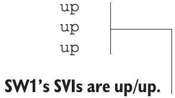

To demonstrate the requirements, in the following example, I violated one require-
To demonstrate the requirements, in the following example, I violated one requirement for each of the VLAN 10, VLAN 20, and VLAN 30 SVIs: ment for each of the VLAN 10, VLAN 20, and VLAN 30 SVIs:

- I deleted VLAN 10 from SW1 (requirement 1).
- I disabled SW1's G1/3 port (an access port in VLAN 30) and removed VLAN 30
- I disabled SW1's G1/3 port (an access port in VLAN 30) and removed VLAN 30 from G0/0's list of allowed VLANs (requirement 2). from G0/0's list of allowed VLANs (requirement 2).

- I disabled VLAN 20 with shutdown (requirement 3).

- I disabled VLAN 20 with shutdown (requirement 3).

As a result, all three SVIs move to an up/down state; they will no longer be able to
As a result, all three SVIs move to an up/down state; they will no longer be able to route packets: route packets:
SW1(config)\# no vlan 10
SW1(config)\# interface g1/3
SW1(config-if)\# shutdown
SW1(config-if)\# interface g0/0
SW1(config-if)\# switchport trunk allowed vlan remove 30
SW1(config-if)\# vlan 20
SW1(config-vlan)\# shutdown
SW1(config-vlan)\# do show ip interface brief | include Vlan
Vlan10
Vlan20
Vlan30

```
172.16.1.1 YES manual up
172.16.1.65 YES manual up
172.16.1.129 YES manual up
```

Removes VLAN 30 from G0/0's allowed VLANs

Disables VLAN 20
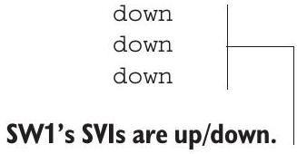

Using routed ports for external connectivity
Routing within a LAN is important, but it's also essential for hosts in the LAN to be able to reach external networks, such as the internet or another LAN in the corporate network. To provide external connectivity, it's common to use a routed port on a
multilayer switch. A routed port is a physical port on a multilayer switch that has been configured to function like a router's interface. Figure 12.12 shows how SW1's G0/1 port can be used as a routed port, providing connectivity to external networks via R1.

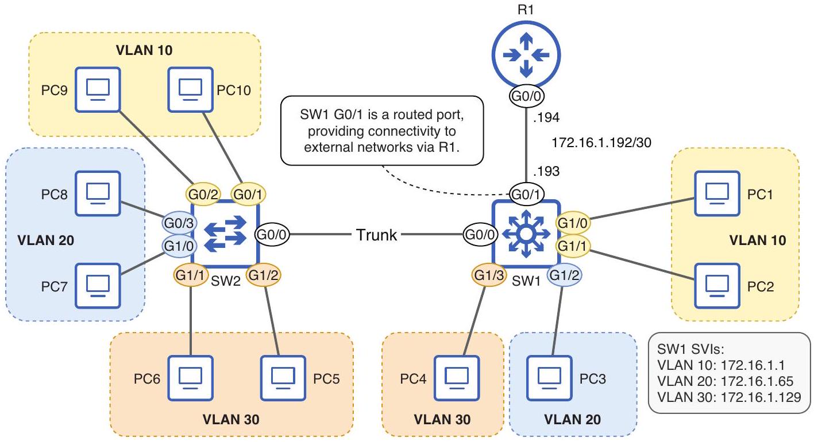
Figure 12.12 SW1, a multilayer switch, uses a routed port (G0/1) to provide connectivity to external networks (via R1, in this case). Like a router interface, SW1 G0/1 is configured with an IP address: 172.16.1.193.

NOTE SW1's icon in figure 12.12 is a new one. Network diagrams typically use an icon like this to represent multilayer switches, differentiating them from Layer 2 switches.

To configure a routed port, use the no switchport command in interface configuration mode; then, you can configure an IP address just like on a router's interface. In the following example, I configure SW1 G0/1 as a routed port with an IP address and then check SW1's routing table:

```
SW1(config)# interface g0/1
SW1(config-if)# no switchport
SW1(config-if)# ip address 172.16.1.193 255.255.255.252
SW1(config-if)# do show ip route
. . .
    172.16.0.0/16 is variably subnetted, 8 subnets, 3 masks
C 172.16.1.0/26 is directly connected, Vlan10
L 172.16.1.1/32 is directly connected, Vlan10
C 172.16.1.64/26 is directly connected, Vlan20
L 172.16.1.65/32 is directly connected, Vlan20
C 172.16.1.128/26 is directly connected, Vlan30
L 172.16.1.129/32 is directly connected, Vlan30
```

```
C 172.16.1.192/30 is directly connected, GigabitEthernet0/1
L 172.16.1.193/32 is directly connected, GigabitEthernet0/1
```

Connected and local routes for G0/1

SW1 G0/1 is now a routed port with an IP address, and SW1 has added connected and local routes for it, but SW1 still isn't able to forward packets outside of the LAN; it needs a route (or routes) to external destinations. Just like on a router, you can configure static routes on a multilayer switch or use a dynamic routing protocol (the topic of part 4 of this volume). In the following example, I configure a static default route on SW1, using R1's IP address as the next hop:

```
SW1(config)# ip route 0.0.0.0 0.0.0.0 172.16.1.194
```

SW1's default route (using R1 as the next hop)

Now that SW1 has a route to external networks, it can provide connectivity between the LAN and external networks, as well as between the subnets/VLANs in the LAN. Figure 12.13 shows the internal logic of how SW1 can forward a packet from a host in the LAN toward an external destination; SW1's routed port (G0/1) provides connectivity from the internal router to R1.

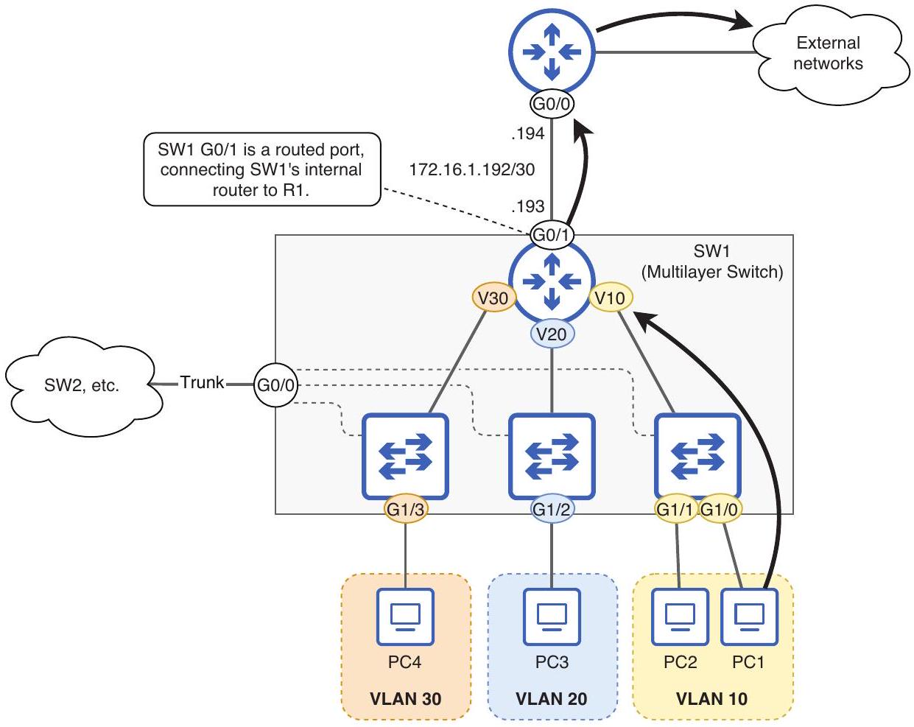
Figure 12.13 A host in the LAN sends a packet to an external destination, routed by SW1. G0/1 is a routed port, connecting SW1's internal router to R1.

Exam scenarios
VLANs are one of the major topics of the CCNA exam, so you can expect at least a few VLAN-related questions on the CCNA exam. The following are a few questions demonstrating how your understanding of VLANs might be tested on the CCNA exam:

1(multiple choice, multiple answers)
Examine the following configuration of SW1's GO/0 interface:

```
interface GigabitEthernet0/0
    switchport access vlan 5
    switchport trunk native vlan 10
    switchport mode trunk
```

Which of the following statements are true? (select two)


    A SW1 G0/0 is a trunk port.
    B SW1 GO/0 is an access port.
    c SW1 will assign untagged frames received on GO/0 to VLAN 5.
    D SW1 will assign untagged frames received on GO/0 to VLAN 10.

The challenging part of this question is that GO/O has configurations related both to access ports and trunk ports. The switchport access vlan 5 command implies that SW1 will assign untagged frames received on GO/0 to VLAN 5. However, the switchport trunk native vlan 10 command implies that SW1 will assign them to VLAN 10. The key to this question is that the switchport mode command specifies trunk, so GO/0 is operating as a trunk port (and A is one of the correct answers). Therefore, the switchport access vlan 5 command will not affect GO/0; it is only significant if GO/O is operating as an access port. So, the second correct answer is D; SW1 will assign untagged frames received on GO/0 to VLAN 10 (the native VLAN).

2 (drag and drop)
On the left are four statements about the native VLAN and the default VLAN. Drag the statements to the default VLAN or native VLAN on the right. Each statement can only be used once.

| (A) Related to access ports | Default VLAN |
| :--- | :--- |
| (B) Related to trunk ports |  |
| (C) VLAN 1 by default, and can be changed | Native VLAN |
| (D) VLAN 1 by default, and cannot be changed |  |

The correct answers are A/D for the default VLAN and B/C for the native VLAN. As mentioned in the note in section 12.3.2, the default VLAN and native VLAN are often confused, so make sure you can differentiate between the two for the exam.

3 (lab simulation)

A lab simulation might provide you with a network diagram and ask you to configure access ports and trunk ports as appropriate. Remember the basic configurations of each:

```
(continued)
```


- Access ports-switchport mode access, switchport access vlan vlan-id
- Trunk ports-switchport trunk encapsulation dot1q (if needed), switchport mode trunk, switchport trunk allowed vlan vlans

## Summary

- Network segmentation is the process of dividing a network into smaller parts and provides network security and performance benefits. Subnets can be used to segment a network at Layer 3, and virtual LANs (VLANs) can be used to segment a network at Layer 2.
- VLANs divide a broadcast domain (LAN) into multiple broadcast domains by dividing a physical switch into multiple virtual switches. Frames sent by a host in one VLAN cannot be forwarded/flooded to hosts in another VLAN.
- Although there can be multiple subnets per VLAN, for the CCNA exam, you can assume a one-to-one relationship (one subnet per VLAN).
- Use the show vlan brief command to view the VLANs that exist on the switch and which ports are in each VLAN.
- VLANs 1 and 1002-1005 exist by default and cannot be deleted. VLAN 1 is the default VLAN-the VLAN that all ports are in by default. VLANS 1002-1005 are reserved for use by FDDI and Token Ring-two legacy Data Link Layer technologies.
- Use the vlan vlan-id command to create a VLAN, and then the name vlan -name command to give the VLAN an optional name (the default name is VLANxxxx). You can use the shutdown command to temporarily disable the VLAN or no vlan vlan-id to delete the VLAN.
- An access port is a switch port that sends and receives traffic in a single VLAN. Access ports are also called untagged ports because they send and receive frames without VLAN tags.
- Use the switchport mode access command to configure a port in access mode. Then, use the switchport access vlan vlan-id command to configure which VLAN the port belongs to. If you assign a port to a VLAN that doesn't exist yet on the switch, the switch will automatically create the VLAN.
- A trunk port is a switch port that sends and receives traffic in multiple VLANs. Trunk ports differentiate between VLANs by adding a VLAN tag to each frame using the IEEE 802.1Q protocol.
- The 802.1Q tag is 4 bytes in length and is added between the Source and EtherType fields of the Ethernet header. The main fields of the 802.1Q tag are TPID and TCI.

- The Tag Protocol Identifier (TPID) field always contains the value 0x8100; it is used to identify 802.1Q-tagged frames.
- The Tag Control Information (TCI) field consists of three subfields: Priority Code Point (PCP) and Drop Eligible Indicator (DEI) are used for Quality of Service (QoS). The VLAN Identifier (VID) field is used to indicate which VLAN the frame is in. The VID field is 12 bits in length, and for that reason, there are $4,096\left(2^{12}\right)$ VLANs in total.
- To configure a trunk port, use the switchport mode trunk command. If the switch supports both 802.1Q and ISL, you must use the switchport trunk encapsulation dot1q command first; if the switch only supports 802.1Q, this command is not needed.
- Use the show interfaces trunk command to verify trunk ports, including information such as which VLANs are allowed on each trunk port.
- By default, all VLANs are allowed on a trunk port, meaning it can forward and receive frames in all VLANs.
- Use the switchport trunk allowed vlan command to specify the VLANs allowed on a trunk. You can specify the list of VLANs or use the keywords add, all, except, none, or remove.
- The native VLAN is the VLAN that is untagged on a trunk port. Untagged frames received on a trunk port are assigned to the native VLAN, and frames in the native VLAN are forwarded untagged. The native VLAN of a trunk port is VLAN 1 by default.
- The native VLAN can be configured with the switchport trunk native vlan vlan-id command. The command is configured per port, so each port on a switch can have a different native VLAN, but make sure the native VLAN matches on both sides of a trunk connection.
- It is recommended that you configure an unused VLAN (that is not the default of VLAN 1) as the native VLAN, which is equivalent to disabling it.
- Inter-VLAN routing is the process of routing between subnets in a LAN that is segmented using VLANs. Inter-VLAN routing can be performed by an external router or by a multilayer switch (a switch that has routing capabilities).
- A router can perform inter-VLAN routing by using a separate interface per subnet/VLAN or by router on a stick (ROAS), in which a trunk link connects the router and switch.
- ROAS uses virtual subinterfaces. To configure a subinterface, use the interface command and add a period and a number to identify the subinterface to the end of the interface name (i.e., interface g0/0.10). The subinterface identifier does not have to match the VLAN ID.
- Configure a subinterface's VLAN with the encapsulation dot1q vlan-id command. Then, configure an IP address in the same manner as on a router.

- If using the native VLAN over the ROAS trunk, use the encapsulation dot1q vlan-id native command on the native VLAN's subinterface. Or, configure the native VLAN's IP address on the physical interface (the encapsulation dot1q command is not necessary on the physical interface).
- A multilayer switch can also be called a Layer 3 switch (in contrast to a standard Layer 2 switch). A multilayer switch uses switch virtual interfaces (SVIs) to perform inter-VLAN routing. Each SVI is associated with a VLAN and can be configured with the interface vlan vlan-idcommand.
- Use the ip routing command on a multilayer switch to allow the switch to route packets.
- A physical port on a multilayer switch can be configured as a routed port, which functions like a router interface. Use the no switchport command to convert a switch port to a routed port, and then configure an IP address on it.
- To forward packets to external destinations, multilayer switches need routes, just like routers-either static routes or routes learned via a dynamic routing protocol (such as OSPF).

## Dynamic Trunking Protocol and VLAN Trunking Protocol

## This chapter covers

- Switch port administrative and operational modes
- How switches use Dynamic Trunking Protocol to determine a port's operational mode
- How to use VLAN Trunking Protocol to automate VLAN administration

In this chapter, we will look at two protocols related to VLANs, the topic of the previous chapter. Dynamic Trunking Protocol (DTP) and VLAN Trunking Protocol (VTP) are both auxiliary protocols designed to streamline VLAN configuration and management on Cisco switches. As in chapter 12, in this chapter, we will cover the following two exam topics:

- 2.1 Configure and verify VLANs (normal range) spanning multiple switches
- 2.2 Configure and verify interswitch connectivity

Before Cisco's major overhaul of the CCNA exam topics in 2020, both DTP and VTP were listed as exam topics. Their removal in 2020 led some to believe that DTP and VTP would not be covered on the CCNA exam, but this is a misunderstanding; although the exam topics list no longer explicitly names DTP and VTP, they both play important roles in the configuration of VLANs and interswitch connectivity on Cisco switches, and you are expected to know them for the CCNA exam.

### 13.1 Dynamic Trunking Protocol

Dynamic Trunking Protocol (DTP) is a Cisco-proprietary protocol that allows Cisco switches to automatically determine the operational mode of their ports. A port's operational mode is the mode the port operates in (access or trunk), as opposed to the administrative mode, which is the port's configured mode (using the switchport mode command). If a switchport is manually configured as an access port or trunk port, the port's administrative and operational modes will be identical:

- A port configured with switchport mode access (administrative mode) will always operate as an access port (operational mode).
- A port configured with switchport mode trunk (administrative mode) will always operate as a trunk port (operational mode).

When using DTP, neighboring switches send each other DTP messages, informing each other of their port's administrative mode. Depending on the combination of administrative modes of the connected ports, the switches decide the appropriate operational mode for their ports.

NOTE Only switches use DTP; to make a switch port connected to a router operate as a trunk port (when using router on a stick), you must manually configure trunk mode on the port.

DTP was developed to streamline the deployment of switches by requiring less manual configuration of port modes, but it was found to be a security vulnerability (more on that later in this chapter), so today it is generally considered best practice to disable DTP on switch ports. However, DTP is active on Cisco switches by default, so it's important to understand how it works, even if only to know how to disable it.

NOTE As a Cisco-proprietary protocol, DTP only works on Cisco switches. If you want your Cisco switch to have a trunk connection with a switch from another vendor, you must manually configure trunk mode with switchport mode trunk.

### 13.1.1 DTP negotiation

In chapter 12, we manually configured access and trunk ports. However, there are two other options for the switchport mode command: switchport mode dynamic auto and switchport mode dynamic desirable. Rather than explicitly specifying which mode the port should operate in, these administrative modes tell the switch to use DTP to determine the port's operational mode. By default, a port in one of these modes will operate as an access port, but if the connected switches both agree, a trunk link will be formed.

Figure 13.1 shows two Cisco switches connected by their G0/0 ports, each with an administrative mode of dynamic auto. The result is an access link; the switches agree
that they will not form a trunk. This process of exchanging DTP messages and agreeing upon an operational mode is called DTP negotiation.


Figure 13.1 Two connected switches negotiate their ports' operational mode by sending DTP messages. Both ports use the default administrative mode of dynamic auto, resulting in an access link; SW1 G0/0 and SW2 G0/0 operate as access ports.

NOTE dynamic auto is the default administrative mode for all Cisco switch ports, so by default, two Cisco switches that are connected will not form a trunk; the connection will remain in access mode.

To view a port's administrative and operational modes, use the show interfaces interface-name switchport command, as in the following example. Note that the operational mode is static access; this means it is an access port that is assigned to a specific VLAN (the VLAN specified in the switchport access vlan command, or the default of VLAN 1). There are also dynamic access ports, in which the switch decides the port's VLAN based on the connected device, but dynamic access ports are beyond the scope of the CCNA:

```
SW1# show interfaces g0/0 switchport
Name: Gig0/O
Switchport: Enabled
Administrative Mode: dynamic auto
Operational Mode: static access
. . .
```

Although a port with administrative mode dynamic auto uses DTP to negotiate its operational mode, it does not actively try to form a trunk link with its neighbor; that's why two connected ports in dynamic auto mode do not form a trunk, as we saw in figure 13.1.

If we change the administrative mode of SW1 G0/0 to dynamic desirable, the result is different; a port in dynamic desirable mode actively attempts to form a trunk. Figure 13.2 shows the result: a trunk link between SW1 and SW2.


Figure 13.2 SW1 and SW2 negotiate to form a trunk link. SW1 G0/0's administrative mode is dynamic desirable, and SW2 G0/0's is dynamic auto. The result is an operational mode of trunk.

As shown in the following example, SW1 G0/0's operational mode is now trunk:

```
SW1# show interfaces g0/0 switchport
Name: Gig0/O
Switchport: Enabled
Administrative Mode: dynamic desirable
Operational Mode: trunk
. . .
```

G0/0 functions as a trunk port.

Table 13.1 lists the four administrative modes that can be configured with the switchport mode command and gives a brief description of each.

Table 13.1 Switch port administrative modes
| Mode | Description | Port sends DTP messages? |
| :--- | :--- | :--- |
| access | Manually configures an access port. Operational mode will always be access. | No |
| trunk | Manually configures a trunk port. Operational mode will always be trunk. | Yes |
| dynamic auto | The port uses DTP to negotiate its operational mode but does not actively try to form a trunk with its neighbor. <br> Will form a trunk if connected to a port in trunk or dynamic desirable mode. | Yes |
| dynamic desirable | The port uses DTP to negotiate its operational mode and actively tries to form a trunk with its neighbor. <br> Will form a trunk if connected to a port in trunk, dynamic auto, or dynamic desirable mode. | Yes |


NOTE Although administrative mode trunk manually configures a trunk port, the port will still send DTP messages; the purpose is to ensure that the neighboring port also operates in trunk mode (if the neighbor is in dynamic auto or dynamic desirable mode).

For the CCNA exam, it's important to understand the resulting operational mode of each combination of administrative modes; table 13.2 shows the results of each combination. Note that access + trunk is not a valid combination; either the switches will detect the mismatch and block the link, or the traffic that passes through the link will be limited to only the trunk port's native VLAN and the access port's VLAN (because both are untagged). Either way, don't use this combination!

Table 13.2 Switch port administrative modes
| Administrative modes | access | trunk | dynamic desirable | dynamic auto |
| :--- | :--- | :--- | :--- | :--- |
| Access | access | invalid | access | access |
| Trunk | invalid | trunk | trunk | trunk |
| Dynamic desirable | access | trunk | trunk | trunk |
| Dynamic auto | access | trunk | trunk | access |


EXAM TIP Make sure that you can identify the operational mode that results from each combination of administrative modes; it's a potential exam question.

## Trunk encapsulation negotiation

In addition to negotiating a port's operational mode, DTP can also negotiate which protocol a port uses to tag frames if it becomes a trunk: 802.1Q or ISL. Of course, this only applies to switches that support both 802.1Q and ISL. As I mentioned in chapter 12, modern Cisco switches only support 802.1Q, so I wouldn't expect any questions related to ISL on the CCNA exam.

If a switch supports both protocols, its default setting is switchport trunk encapsulation negotiate. If both switches are using negotiate, the result will be ISL. If one side specifies a protocol (dot1q or is1), the side using negotiate will agree to use the same encapsulation. An encapsulation mismatch (dot1q on one side, isl on the other) is a misconfiguration. If you encounter a switch that supports both 802.1Q and ISL, you should manually configure 802.1Q with switchport trunk encapsulation dot1q, as we covered in chapter 12.

### 13.1.2 Disabling DTP

As I mentioned previously, DTP was developed to streamline the deployment of switches by allowing them to automatically determine the operational status of the ports. However, it is also a security vulnerability; an attacker can take advantage of DTP to form a trunk link with a switch, gaining access to all VLANs in the LAN.

In the default administrative mode of dynamic auto, a switch port connected to an end host will operate in access mode; end hosts don't use DTP, so they can't negotiate
a trunk. This means that the end host will have access only to a single VLAN, and communication between that VLAN and other VLANs can be controlled by configuring security policies on the router.

However, if a malicious user uses something like Yersinia (a hacking tool) to send DTP messages out of their PC, they can negotiate to form a trunk link with the switch port, giving them access to all VLANs in the LAN, presenting a security threat. Figure 13.3 depicts an attacker who has used DTP to negotiate a trunk with a switch.


Figure 13.3 An attacker sends malicious DTP messages to SW1 to form a trunk. This gives the attacker access to all VLANs in the LAN, presenting a security threat.

Because of the security implications and to reduce the amount of unnecessary traffic (DTP messages) being sent in the LAN, it is recommended that you disable DTP. There are two ways to do this:

- Manually configure the port as an access port with switchport mode access.
- Explicitly disable DTP with switchport nonegotiate.

In the following example, I use show interfaces g0/0 switchport. The output states Negotiation of Trunking: On; this means the port is sending DTP messages. I then configure G0/0 as an access port and check again; notice that trunk negotiation is now Off:

```
SW1# show interfaces g0/0 switchport
Name: Gi0/0 GO/O’s administrative mode
Switchport: Enabled
Administrative Mode: dynamic auto
Operational Mode: static access
. . .
Negotiation of Trunking: On ← DTP is enabled.
. . .
SW1# configure terminal
SW1(config) # interface g0/0
SW1(config-if)# switchport mode access
SW1(config-if)# do show interfaces g0/0 switchport
Name: GiO/O
Switchport: Enabled
```

```
Administrative Mode: static access
Operational Mode: static access
. . .
Negotiation of Trunking: Off ← DTP is disabled.
. . .
```

As demonstrated in the previous example, manually configuring access mode disables DTP on the port; it won't send DTP messages. However, the second method can be used to ensure that the port never sends DTP messages, regardless of its current mode (access or trunk). In the following example, I configure G0/0 as a trunk port and confirm that negotiation is On. I then use switchport nonegotiate to disable DTP and confirm again:

```
SW1(config)# interface g0/0
SW1(config-if)# switchport mode trunk
SW1(config-if)# do show interfaces g0/0 switchport
Name: GiO/O
Switchport: Enabled
Administrative Mode: trunk
Operational Mode: trunk
. . .
Negotiation of Trunking: On ← DTP is enabled.
. . .
SW1(config-if)# switchport nonegotiate < \ Disables DTP
SW1(config-if)# do show interfaces g0/0 switchport
Name: GiO/O
Switchport: Enabled
Administrative Mode: trunk
Operational Mode: trunk
. . .
Negotiation of Trunking: Off ← DTP is disabled.
. . .
```

Even if you manually configure a port in access mode, it is recommended that you also use switchport nonegotiate to ensure that DTP messages are never sent, even if you later configure the port in trunk mode.

EXAM TIP Remember that as a security best practice, use switchport nonegotiate to disable DTP on switch ports.

### 13.2 VLAN Trunking Protocol

VLAN Trunking Protocol (VTP) is another Cisco-proprietary protocol that plays a role in VLAN configuration on Cisco switches. VTP allows switches to automatically synchronize their VLAN database, the file that stores information about the VLANs that exist on the switch. Using VTP, switches in a LAN send each other messages with information about the VLANs in their VLAN database, and the switches synchronize their database according to the latest version of the database.

NOTE The VLAN database is stored in a file called vlan.dat in flash memory; use the dir flash: or show flash: commands to view the contents of flash memory. You can use show vlan brief to view the contents of the VLAN database (as we covered in chapter 12).

Figure 13.4 demonstrates why it's important for switches in a LAN to have the same VLANs in their VLAN database; PC1 sends a frame to PC2, but SW2 drops the frame because VLAN 4 isn't in SW2's VLAN database.


Figure 13.4 A missing VLAN on SW2 prevents PC1 from communicating with PC2. 1) PC1 sends a frame to PC2. 2) SW2 drops the frame because VLAN 4 isn't in its VLAN database.

VTP can ensure that all VLANs exist on all switches in the LAN. In a small LAN like figure 13.4, VTP might not seem necessary; manually creating VLAN 4 on SW2 wouldn't be such a hassle. However, in a large LAN with dozens of switches, VTP can both save time and reduce human error by propagating VLAN changes without requiring manual configuration on every single switch.

NOTE Like DTP, VTP is a Cisco-proprietary protocol that only runs on Cisco switches; it cannot be used to synchronize VLANs with another vendor's switches.

### 13.2.1 VTP synchronization

Figure 13.5 shows how VLANs created on SW1 can be propagated to SW2 and SW3 using VTP. Starting with only VLAN 1, I created VLANs 2, 3, and 4 on SW1. This causes SW1 to increment the VTP revision number-a number that keeps track of the latest version of the VLAN database. The revision number starts at 0 and is updated each time there is a change to the VLAN database, such as a VLAN being created, deleted, or renamed. This causes SW1 to send VTP messages to SW2 and SW3, informing them of the updates to the VLAN database. SW2 and SW3 then update their VLAN databases to match SW1.

NOTE VLANs 1002 to 1005 also exist by default on Cisco switches and cannot be removed. I won't mention them in this chapter because they are reserved for legacy technologies (Token Ring and FDDI) that are not used in modern networks, as mentioned in chapter 12.


Figure 13.5 VLANs created on SW1 are propagated to other switches in the VTP domain "Manning." (1) SW1 creates VLANs 2, 3, and 4, updating its revision number to 3 (incrementing by 1 each time it creates a VLAN). (2) SW1 sends VTP messages to other switches in the VTP domain. (3) SW2 and SW3 add VLANs 2, 3, and 4 to their VLAN databases, updating their revision number to match SW1's.

NOTE VTP messages are only sent out of trunk ports, not access ports.
Figure 13.5 also introduced the concept of the VTP domain-the group of switches in a LAN that all share the same VTP domain name. By default, switches do not have a VTP domain name; in this state, VTP is not active. You can configure VLANs on the device, but it will not send VTP messages to other switches in the LAN. The following example shows the output of show vtp status-a useful command to view the current state of VTP on the switch-before configuring VTP or any VLANs on SW1. We will cover the relevant fields of this output throughout the rest of this chapter.

NOTE A switch that does not have a VTP domain name is said to be in domain NULL.

```
SW1# show vtp status
VTP Version capable : 1 to 3
VTP version running : 1
VTP Domain Name :
VTP Pruning Mode : Disabled
```

```
VTP Traps Generation : Disabled
Device ID : 5254.0008.8000
Configuration last modified by 0.0.0.0 at 4-25-23 03:25:46
Local updater ID is 0.0.0.0 (no valid interface found)
```

```
Feature VLAN:
        SW1 is a VTP server by default.
            SW1’s VLAN database
            SW1’s VLAN database
            has five VLANs.
            has five VLANs.
    Number of existing VLANs : 5
    Configuration Revision : 0
MD5 digest : 0x57 0xCD 0x40 0x65 0x63 0x59 0x47 0xBD
        0x56 0x9D 0x4A 0x3E 0xA5 0x69 0x35 0xBC
```

        The revision number starts at 0.
    If you configure a VTP domain name on one switch, it will send VTP messages to other switches, and all switches without a VTP domain name will adopt the new domain name; the command to do so is vtp domain domain-name. In the following examples, I configure the VTP domain name "Manning" and VLANs 2, 3, and 4 on SW1. Then, I confirm that all switches in the LAN have joined the "Manning" domain and share the same Configuration Revision number-this is the revision number that I mentioned previously:

```
SW1(config)# vtp domain Manning
Changing VTP domain name from NULL to Manning
SW1(config)# vlan 2
SW1(config-vlan)# vlan 3
SW1(config-vlan)# vlan 4
SW1(config-vlan) # end
SW1# show vtp status
. . .
VTP Domain Name : Manning
. . .
Number of existing VLANs : 8
Configuration Revision : 3
```


```
SW2# show vtp status
. . .
```

SW2 and SW3 joined the VTP domain

```
VTP Domain Name : Manning
```

and synced their VLAN databases.

```
. . .
Number of existing VLANs : 8
Configuration Revision : 3
SW3# show vtp status
. . .
VTP Domain Name : Manning
. . .
Number of existing VLANs : 8
Configuration Revision : 3
```

Because the revision number is used to keep track of the latest version of the VLAN database, switches will only synchronize their VLAN database if they receive a VTP
message from a switch with a higher revision number, not a lower one; a VTP message with a lower (or equal) revision number is considered old information.

### 13.2.2 VTP modes

A Cisco switch can operate in one of four VTP modes: server, client, transparent, and off, each mode with its own characteristics. The VTP mode can be configured with the vtp mode mode command. Switches in server mode and client mode actively participate in VTP and synchronize their VLAN databases to match each other, whereas switches in transparent mode and off mode do not. Table 13.3 summarizes each mode.

Table 13.3 VTP modes
| Mode | Description |
| :--- | :--- |
| Server | This is the default mode. The switch can create/modify/delete VLANs. It will advertise changes to its VLAN database and synchronize its VLAN database upon receiving an advertisement with a higher revision number. |
| Client | The switch cannot create/modify/delete VLANs but otherwise behaves the same as a server. |
| Transparent | The switch can create/modify/delete VLANs, but it will not advertise changes to its own VLAN database and will not synchronize its VLAN database with others. The switch does not directly participate in the VTP domain, but it will forward VTP messages between switches in the same domain. |
| Off | The switch can create/modify/delete VLANs, but it will not advertise changes to its own VLAN database and will not synchronize its VLAN database with others. The switch does not participate in VTP at all. |


Switches are in VTP server mode by default. In this mode, a switch can create, modify (ie. rename), and delete VLANs, and those changes will be advertised to other switches in the domain. A VTP server will also synchronize its own VLAN database if it receives a VTP message with a higher revision number.

VTP client mode is similar to server mode, except for one difference: the switch cannot create/modify/delete VLANs. I demonstrate this in the following example by configuring SW3 VTP client mode and then attempting to create VLAN 5:


NOTE Cisco recommends that all switches in the domain be in server mode if they have sufficient memory resources. Any modern switch should have sufficient resources to store VLAN information, so you can safely leave all switches in VTP server mode.

In a VTP domain, in most cases, all switches will be in server (or client) mode; they are the modes that take advantage of VTP's VLAN database synchronization. Transparent mode prevents the switch from synchronizing its VLAN database with other switches. You can create, modify, and delete VLANs on the switch, but it will not advertise those changes to other switches. However, the switch will forward VTP messages between switches in the same domain. Transparent mode should be used in cases where a switch needs to be managed independently from other switches, without interrupting VTP's operation on the rest of the switches in the LAN. Figure 13.6 demonstrates how VTP transparent mode works; SW2 has a VLAN database separate from SW1 and SW3 but forwards SW1's VTP messages to SW3.


Figure 13.6 SW2, in transparent mode, forwards VTP messages but does not synchronize its VLAN database. (1) SW1 creates VLAN 5 and updates its revision number. (2) SW2 forwards SW1's VTP messages to SW3 but doesn't synchronize its VLAN database. (3) SW3 syncs its VLAN database to match SW1 and updates its revision number.

NOTE A switch in VTP transparent mode will always have revision number 0.
The final VTP mode is off, which disables VTP on the switch. Like transparent mode, the switch won't synchronize its VLAN database with other switches, but it also won't forward VTP messages between switches using VTP. If VTP is not being used in the LAN, you should configure vtp mode off to disable VTP on all switches.

### 13.2.3 VTP versions

You may have noticed the following lines when I showed the complete output of show vtp status in section 13.2.1:

```
SW1# show vtp status
VTP Version capable : 1 to 3
VTP version running : 1
. . .
```

There are three different versions of VTP available, and version 1 is the default. You can configure the VTP version with the vtp version version command. Versions 1 and 2 are very similar; one difference is that version 2 supports Token Ring, which is not relevant to modern networks, so there isn't much reason to use version 2 over version 1.

Version 3, on the other hand, brings various improvements over the previous two versions and should always be preferred if using VTP. Let's look at a few of those improvements that are relevant to the CCNA. We already covered one of the improvements: off mode. Before version 3, VTP only had three modes: server, client, and transparent. There was no way to actually disable VTP on a switch; the closest thing was to configure all switches in transparent mode.

NOTE Although off mode was added in VTP version 3, switches that support version 3 can use off mode even if they are running version 1 or 2.

Now let's cover two other significant changes brought by VTP version 3: the primary server and extended-range VLAN support.

## The primary server

In VTP version 3, only one switch in the VTP domain can create, modify, and delete VLANs: the primary server. Other VTP servers (now called secondary servers) are no different than VTP clients, except that you can make a secondary server become the primary server with the command vtp primary in privileged EXEC mode.

NOTE Although most VTP commands are global config mode commands, the vtp primary command is a privileged EXEC mode command.

In the following example, I enable VTP version 3 on SW1 and attempt to create VLAN 6, which fails. I then use the vtp primary command to make SW1 the primary server, and I am then able to create VLAN 6:


```
SW1(config)# vlan 6
SW1(config-vlan)# exit
```

SW1 can now create VLANs.

NOTE In this example, I executed the vtp primary command in global config mode by adding do in front of the command. The vtp primary command on its own does not work in global config mode; it's a privileged EXEC mode command.

Only one switch in the domain can be the primary server; if you use the vtp primary command on a second switch, the first one will revert to being a secondary server. The reason for allowing only one switch in the domain to create, modify, and delete VLANs is to avoid the problem of a newly-connected switch overwriting the VLAN database for the domain-a problem we'll cover in section 13.2.4.

## Extended-range VLANs

In old versions of Cisco IOS, only VLANs 1 to 1005 were available for use; these are called the normal-range VLANs. In those versions of IOS, VLANs 1006 to 4094 were reserved for internal use by applications on the switch; a user could not create them or assign ports to those VLANs. In a later version of IOS, VLANs 1006 to 4094 were made available and called the extended-range VLANs; these days, all Cisco switches support both the normal- and extended-range VLANs.

Even after extended-range VLANs were made available for use, VTP versions 1 and 2 only supported normal-range VLANs. The only way to create extended-range VLANs on switches before VTP version 3 was to configure the switch in transparent mode, rendering it unable to participate in the VTP domain.

VTP version 3 brought the ability to create and propagate extended-range VLANs; the primary server can create extended-range VLANs and propagate them to other switches in the VTP domain.

### 13.2.4 Is VTP dangerous?

VTP doesn't have a very good reputation-and for good reason: it has caused a lot of network outages over the years. First, let's look at why VTP has a bad reputation, and then we'll see how version 3 fixes the problems with VTP.

The danger of VTP is the potential for a newly connected switch to overwrite the VLAN database of all switches in the domain. Because switches using VTP synchronize their VLAN database to the switch with the highest revision number, if the newly connected switch has a higher revision number (and is in the same domain), all switches in the domain will synchronize to match it. Figure 13.7 illustrates how this can happen: SW4, with a revision number of 50, is connected to a VTP domain with a revision number of 5, causing the other switches to synchronize with it. As a result, hosts in VLANs 10, 20, and 30 will lose network connectivity; those VLANs no longer exist in the network!


Figure 13.7 SW4 is connected to the network and overwrites the VLAN databases of SW1, SW2, and SW3. (1) SW4 is connected to the LAN. (2) SW4 sends VTP messages to the other switches. (3) Because SW4 has a higher revision number (50 vs. 5), SW1, SW2, and SW3 synchronize their VLAN databases to match SW4. Hosts in VLANs 10,20, and 30 will be unable to communicate over the network because their VLANs no longer exist.

NOTE You may be wondering, how could a newly added switch have a high revision number in the first place? One possibility is that it was used as a lab switch for testing and verifying before being added to the corporate network.

This is a very careless mistake, and standardized procedures for adding new devices to the network would prevent it from happening; one recommended procedure is to reset the VTP revision number of a switch to 0 before connecting it to the network. There are three methods for doing so:

- Change the VTP domain name to a different one and then back to the original name.
- Change the VTP mode to transparent and then back to server or client (only works in versions 1 and 2).
- Change the VTP mode to off and then back to server or client (only works in versions 1 and 2).

EXAM TIP Remember these three methods for resetting the revision number.
Resetting the revision number to 0 eliminates the risk of a newly added switch overwriting the VLAN database of switches in the network. However, it's an unfortunate truth that many corporations have few, if any, standardized procedures for such things, and
in any case, people can get careless. As a result, many people have been burned by VTP, giving it a bad reputation.

However, the primary server mechanism in version 3 eliminates this risk; switches will only synchronize to the primary server, so even if a new switch with a higher revision number is connected to the LAN, switches in the LAN won't synchronize to it. When using version 3, there's no need to be afraid of VTP, and it can be a great tool for automating some of the workflows of configuring a network.

## Summary

- Dynamic Trunking Protocol (DTP) allows Cisco switches to automatically determine the operational mode of their ports.
- A port's administrative mode is how it is configured with the switchport mode command, and its operational mode is the mode it operates in (access or trunk).
- Use the show interfaces interface-name switchport command to view the administrative and operational modes of a port.
- A port configured with switchport mode access will always operate as an access port, and a port configured with switchport mode trunk will always operate as a trunk port.
- switchport mode dynamic auto and switchport mode dynamic desirable configure the port to use DTP to determine its operational mode.
- dynamic auto mode does not actively try to form a trunk with its neighbor but will form a trunk if the neighbor's mode is trunk or dynamic desirable.
- dynamic desirable mode actively tries to form a trunk with its neighbor and will form a trunk if the neighbor's mode is trunk, dynamic auto, or dynamic desirable.
- DTP is considered a security vulnerability and should be disabled. It is considered best practice to manually configure each port's mode and disable DTP with switchport nonegotiate on each port.
- VLAN Trunking Protocol (VTP) allows Cisco switches to synchronize their VLAN database-the file that stores information about VLANs on the switch (vlan.dat).
- The VTP revision number is used to keep track of the latest version of the VLAN database. Each time a change is made, the revision number is incremented by 1. A switch will synchronize to match a higher revision number but not a lower (or equal) one.
- The VTP domain is the group of switches in a LAN that share the same VTP domain name; a switch will only synchronize with another switch in the same domain.
- By default, a switch has no domain name; it is said to be in domain NULL. In this state, the switch can create/modify/delete VLANs, but it won't send VTP messages to other switches.

- You can configure a switch's VTP domain name with the vtp domain domain -name command.
- Use the show vtp status command to view the current state of VTP on the switch.
- A switch can operate in one of four VTP modes: server, client, transparent, and off. Use the vtp mode mode command to configure the mode (server is the default).
- A switch in VTP server mode can create/modify/delete VLANs. It will advertise changes to its VLAN database and synchronize its VLAN database upon receiving an advertisement with a higher revision number.
- A switch in VTP client mode cannot create/modify/delete VLANs but otherwise behaves the same as a server.
- A switch in VTP transparent mode can create/modify/delete VLANs but operates independently from other switches in the VTP domain. It will forward VTP messages between switches in the VTP domain but will not send its own VTP messages or synchronize its VLAN database with other switches.
- A switch in VTP off mode can create/modify/delete VLANs but does not participate in VTP at all.
- There are three versions of VTP: 1, 2, and 3. Versions 1 and 2 are very similar, but version 3 brought many improvements.
- VTP version 3 introduced off mode; before, VTP couldn't be disabled. The closest thing was to configure all switches in VTP transparent mode.
- In VTP version 3, only one switch in the domain can create, modify, and delete VLANs: the primary server. Switches in the domain will only synchronize with the primary server. Other servers are called secondary servers; they function the same as VTP clients.
- Use the vtp primary command (in privileged EXEC mode) on a VTP server to make it the primary server. There can only be one; if you configure vtp primary on a second server, the first one will revert to being a secondary server.
- VTP version 3 is the only version that supports extended-rangeVLANs (VLANs 1006 to 4094). Versions 1 and 2 only support normal-range VLANs (VLANs 1 to 1005).
- One risk of VTP is that a newly connected switch with a higher revision number can overwrite the VLAN database of all switches in the LAN. Version 3 solves this problem because switches will only synchronize with the primary server.
- To reset a switch's VTP revision number to 0, you can change the domain name to a different one and then back to the original. Alternatively, you can change the mode to transparent or off and then back to server or client, but this only works in versions 1 and 2.

## Spanning Tree Protocol

## This chapter covers

- How Layer 2 loops lead to broadcast storms
- How Spanning Tree Protocol detects and prevents Layer 2 loops
- The various STP port roles, states, and timers
- Using PortFast to accelerate STP convergence

This chapter is about Spanning Tree Protocol (STP), a protocol that runs on all Cisco switches by default and solves a significant problem in LANs: Layer 2 loops that result in frames looping around the network indefinitely. STP is mentioned in exam topic 2.5: Identify basic operations of Rapid PVST+ Spanning Tree Protocol. Exam topic 2.5 specifically refers to the rapid version of the protocol, the topic of chapter 15. However, to understand Rapid STP, we first have to cover the original protocol, and that's what we'll do in this chapter.

### 14.1 The need for STP

In chapter 7 (IPv4 addressing), we briefly covered the fields of the IPv4 header; one of those is the Time-to-Live (TTL) field, which is decremented each time a router forwards a packet. When the value in the TTL field reaches 0, the packet is dropped, preventing packets from looping around the network indefinitely as the result of a misconfiguration; this is called a routing loop or Layer 3 loop.

The Ethernet header has no such field; if a loop occurs between switches-a Layer 2 loop-there is no mechanism in place to prevent frames from looping around the LAN indefinitely. If there are too many frames looping around the LAN, the switches can be overwhelmed, resulting in a loss of service for all hosts in the LAN.

So, how do Layer 2 loops occur? Whereas Layer 3 loops are the result of a misconfiguration somewhere in the network, Layer 2 loops are inevitable in a LAN where there are multiple paths between any two nodes in the LAN, as a result of the flooding of BUM traffic (broadcast, unknown unicast, and multicast) frames.

NOTE I will mention multicast traffic a few times throughout this book's two volumes. For now, just know that multicast frames are flooded by switches by default.

Having multiple paths between hosts is an example of redundancy and is a desirable thing in a network. Redundancy means having additional network devices and connections beyond the minimum necessary for communication. By having redundant devices and connections, network service isn't lost if one device or connection fails- there is no single point of failure.

However, without something like STP to prevent loops, frames will loop indefinitely in a LAN with redundant connections, as demonstrated in figure 14.1. Any one of the connections between switches in the figure could be removed (e.g., the connection between SW2 and SW3), and the PCs would still be able to communicate with each other; this is an example of redundancy.


Figure 14.1 PC1 sends a broadcast frame, and SW1 floods it. When SW2 and SW3 receive their copies of the frame, they flood it too, resulting in two loops: counterclockwise (A) and clockwise (B). These frames will loop indefinitely between SW1, SW2, and SW3.

NOTE As the arrows pointing toward the PCs in figure 14.1 indicate, SW1, SW2, and SW3 will also flood the looping frames toward connected end hosts, potentially overwhelming them by requiring the hosts to process the looping frames repeatedly.

There are two main problems caused by Layer 2 loops. First, if enough looping frames accumulate in the network, the result is a broadcast storm, consuming so many network resources (CPU resources on the devices or bandwidth of the links) that the network is rendered unusable. PCs and other end hosts connected to the switches also receive the same frames repeatedly, which could overwhelm their available resources too.

The second problem is MAC address flapping-when a switch learns the same MAC address repeatedly on separate ports. Using the example in figure 14.1, when SW1 first receives PC1's broadcast frame, it learns PC1's MAC address on the G0/2 port. However, when looped Frame A arrives back on G0/1, it learns PC1's MAC address on that port, and the same applies when looped Frame B arrives back on G0/0. SW1 will constantly update the entry for PC1's MAC address in its MAC address table between multiple ports, resulting in PC1 being unable to receive frames; SW1 doesn't know which port PC1 is actually connected to.

A Layer 2 loop can bring down a LAN in a matter of seconds (depending on the amount of BUM traffic), so it's absolutely essential to avoid Layer 2 loops. That's the role of STP.

### 14.2 How STP works

STP can be summarized in one sentence: it prevents Layer 2 loops by blocking redundant connections, leaving only a single active path between any two nodes in a LAN. Figure 14.2 shows an example: the link between SW2 and SW3 is disabled, preventing a Layer 2 loop from occurring.


Figure 14.2 PC1 sends a broadcast frame, and SW1 floods it. Using STP, SW3 blocks its G0/1 port, effectively disabling the SW2-SW3 connection; this prevents a Layer 2 loop from occurring.

Although the physical topology in figure 14.2 is the same as in figure 14.1, thanks to STP there is no longer a Layer 2 loop. SW3's G0/1 port is now in the blocking state; it does not forward frames and does not process received frames (except for STP-related messages). All other ports are in the forwarding state; they can forward and receive frames as normal. The SW2 G0/1 to SW3 G0/1 link is unused but is available to take over if there is a problem on another link.

NOTE The term topology refers to how devices are arranged and connected in a network. In figure 14.2, SW1, SW2, and SW3 are physically connected in a ring topology, forming a circle. The term STP topology can be used to refer to the logical arrangement of switches and their connections as a result of STP-some actively carrying network traffic, and some blocked by STP to prevent Layer 2 loops.

Whereas figures 14.1 and 14.2 only showed three switches, figure 14.3 shows a LAN with many more switches connected in a mesh-a network topology in which each node is connected to each other node (full mesh) or as many other nodes as possible but not all (partial mesh). In a network like this, there are countless Layer 2 loops. However, with STP, the switches will automatically put ports in the blocking state to create a loopfree topology. Although network traffic does not pass over the disabled links, they are available to take over if one of the active links fails.


Figure 14.3 STP creates a loop-free topology in a meshed LAN. In the physical topology (left), there are countless ways that frames could loop around the network. However, STP creates a logical topology (right) that is loop-free.

## What's a spanning tree?

A spanning tree is a concept in the mathematical field of graph theory. In graph theory, a graph is a structure that models relationships between objects (also called nodes). A tree is a subgraph in which any two nodes are connected by exactly one path, and spanning means that the tree includes all nodes; the tree spans across all nodes.

```
(continued)
```

Let's compare that to a network using STP. Each switch running STP is a node in the graph, with various physical connections between them (the physical topology in figure 14.3). STP disables some of the connections, leaving only one active path between any two nodes; this is the subgraph-the spanning tree (the logical topology in figure 14.3).

### 14.3 The STP algorithm

The process STP uses to create a loop-free topology is called the STP algorithm. There are three main steps in the algorithm:

1 Root bridge election
2 Root port selection
3 Designated port selection

Figure 14.4 shows an example of a LAN after STP created a loop-free topology. In this section, we will examine this LAN and go through the STP algorithm step by step. Note that I designed this LAN to demonstrate various aspects of the STP algorithm rather than to represent a realistic LAN topology; we will cover LAN architecture best practices in chapter 15 of volume 2 of this book.


Figure 14.4 A LAN after STP has created a loop-free topology. SW3 is the root bridge, and each other switch has one root port leading to SW3. The remaining ports are either designated or non-designated ports; non-designated ports are blocked, disabling their connections.

### 14.3.1 Root bridge election

The first step in the STP algorithm is to elect a single switch as the root bridge for the LAN. The root bridge is the central point of reference for the STP topology, and in later steps, all other switches ensure that they have exactly one active path to reach the root bridge.

NOTE STP was developed for use with Ethernet bridges, which were predecessors to switches. As a result, STP uses the term bridge rather than switch. Although modern networks use switches instead of bridges, the original terminology (such as root bridge) persists. In the context of STP, bridge and switch can be considered synonymous.

The root bridge election is carried out by switches sharing STP Bridge Protocol Data Unit (BPDU) messages with each other. Actually, the information shared in BPDUs is used to make all of the decisions in the STP algorithm, not just the root bridge election. BPDUs are sent every 2 seconds and contain various pieces of STP-related information; the two pieces of information relevant to the root bridge election are the switch's own bridge identifier (BID)-a number that uniquely identifies the switch in the LAN-and the BID of the switch it believes to be the root bridge.

When a switch first boots up, it does not yet know the root bridge of the LAN, so it declares itself to be the root bridge. Figure 14.5 demonstrates this: the four switches have all booted up at the same time, and each switch sends BPDUs declaring itself to be the root bridge (the My BID and Root BID fields match).


Figure 14.5 SW1, SW2, SW3, and SW4 boot up simultaneously, each switch declaring itself the root bridge. The switches send BPDUs out of their ports, containing information such as the switch's own BID and the BID of the switch it believes to be the root bridge (itself, in this case).

## The BID

The switch that sends the superior BPDU will be elected the root bridge of the LAN. The superior BPDU is the BPDU that has superior parameters according to the STP algorithm. When it comes to electing the root bridge, that means the BPDU with the numerically lowest My BID field. Before we determine which of the four switches has the lowest BID, let's examine the structure of the BID, as shown in figure 14.6. The BID is a 64-bit number that consists of a 16-bit bridge priority and a 48-bit MAC address.


Figure 14.6 The contents of the STP BID. It is divided into two parts: a 16-bit bridge priority and a 48-bit MAC address. The bridge priority consists of two further parts: a configurable priority value (default 32768) and the Extended System ID, which is equal to the VLAN ID in Cisco's implementation of STP.

The bridge priority itself consists of two parts, the first being a configurable priority value. By default, the most significant bit is set to 1, which is equivalent to 0d32768. The second part is called the Extended System ID and is equal to the VLAN ID; these two numbers are added together to create the bridge priority (e.g., $32,768+1=32,769$ ). Before we continue with the root bridge election, let's dig deeper into the Extended System ID.

Cisco switches run a proprietary version of STP called Per-VLAN Spanning Tree Plus (PVST+). In PVST+, switches run a separate STP instance for each VLAN; they create a separate spanning tree for each VLAN. The benefit is that different links can be disabled in different VLANs, resulting in balanced traffic over all links.

NOTE Before PVST+, there was PVST, which only supported ISL encapsulation over trunk links. PVST+ supports both ISL and 802.1Q, and modern Cisco switches all run PVST+, not PVST.

If all VLANs share the same STP instance, blocked links go completely unused until an active link fails, which can lead to congestion on the active links. Figure 14.7 shows how a separate spanning tree can be made for each VLAN. The LAN has two VLANs (VLAN 1 and VLAN 2), and the switches have disabled different links in each VLAN.


Figure 14.7 Switches in a LAN create separate spanning trees for VLANs 1 and 2 by disabling different links in each VLAN (as indicated by the dotted lines). Traffic in VLAN 1 will use different links than traffic in VLAN 2, avoiding network congestion.

Because the VLAN ID becomes part of the BID, the switch will have a unique bridge priority for each STP instance (for each VLAN running STP). For example, with the default priority of 32768, the total bridge priority will be 32769 ( 32,768 + 1) in VLAN 1 and 32770 (32,768 + 2) in VLAN 2.

NOTE For the rest of this chapter, we will focus on a single-VLAN topology. I would not expect any questions about creating a unique spanning tree for each VLAN on the CCNA exam.

## Why include the VLAN ID in the bridge priority?

The STP standard (IEEE 802.1D) specifies that each switch must have a unique BID. This is achieved by combining the bridge priority with the switch's MAC address. Even if all switches in the LAN have the same bridge priority, MAC addresses are unique, so the result is a unique BID for each switch.

However, Cisco switches running PVST+ run a separate STP instance for each VLAN. As we covered in chapter 12, each VLAN is like a separate virtual switch, so to comply with the standard, each STP instance running on the switch must have a unique BID. That's the role of the Extended System ID, which is set to the VLAN ID of the STP instance. By adding the VLAN ID to the priority value, each STP instance will have a unique bridge priority and, therefore, a unique BID.

For example, if a switch running two STP instances (VLAN 1 and VLAN 2) has the default priority value of 32768 and a MAC address 5254.000f.adab, the resulting BID would be 32769:5254.000f.adab for VLAN 1 and 32770:5254.000f.adab for VLAN 2. Note that the bridge priority is written in decimal, whereas the MAC address is written in hexadecimal (as usual), and the two are often separated by a colon, as in 32769:5254.000f. adab.

## Comparing BIDs

Now that we've covered the bridge priority (priority + VLAN ID), what is the MAC address that forms the second part of the BID? It's not the MAC of any of the switch's ports; rather, it's a separate MAC address that identifies the switch as a whole. In this section, we'll compare BIDs and see how the MAC address is used as a tiebreaker. The following are the BIDs of the four switches we saw in figure 14.5:

- SW1: 32769:5254.000f.adab
- SW2: 32769:5254.0013.cf9a
- SW3: 32769:5254.0016.5d5e
- SW4: 32769:5254.001d.d23a

Which of these BIDs is numerically lower and, therefore, superior? To compare them, first compare the bridge priorities. In this case, all four switches have the same bridge priority of 32769, so we must compare the MAC addresses to break the tie.

NOTE Although we divide the BID into multiple parts, remember that it is just a 64-bit number. The bits written on the left (those that make up the bridge priority) are the most significant, which is why you should compare them first when determining which BID is numerically lower.

When comparing MAC addresses, remember that they are just numbers written in a hexadecimal format, and comparing them is the same process you go through when comparing decimal numbers. For example, when comparing the decimal numbers 1999 and 9111, how do you know the second number is greater when it has only one 9, whereas the first number has three? The reason is the 9 in 9111 is the most significant digit; the single 9 in 9111 has a greater value $(9,000)$ than all of the other digits in 1999 combined. Just by seeing that the most significant digit of 9111 is greater than that of 1999, you can declare that 9111 is the greater of the two-no need to compare the other three digits.

The same applies when finding the greater (or lesser, in this case) of two or more MAC addresses: compare the most significant digits first. The first six digits of all four MAC addresses (the OUI) are the same: 5254.00. Then, the following digit is 1 for SW2, SW3, and SW4, but 0 for SW1, and therefore SW1 has the lowest BID of the four-it is the root bridge! We can confirm this with the show spanning-tree command on SW1, as in the following example:


```
This switch’s priority (same as
previously because it is the root)
Bridge ID Priority 32769 (priority 32768 sys-id-ext 1)
Address 5254.000f.adab
```

This switch's MAC address (same as previously because it is the root)

## Configuring the bridge priority

As we just confirmed, SW1 is the root bridge for the LAN because it has the lowest MAC address. However, it is possible to configure the bridge priority to change which switch becomes the root bridge. This is often desirable because of the role of the root bridge; it serves as the central reference point for the spanning tree, and the other switches will ensure that their most efficient path to reach the root bridge is enabled. If a switch is connected to the router that end hosts use to access external networks, it's a good choice to be the root bridge; there should be an efficient path to reach the router without frames having to pass through too many switches.

Following the example we saw in figure 14.4, let's configure SW3 as the root bridge and lower SW4's priority so it functions as a secondary root bridge-the bridge that will take over as the root if the root bridge malfunctions (because it has the lowest BID of the remaining switches). The command to configure a switch's root priority is spanning -tree vlan vlan-id priority priority-value. In the following example, I attempt to set SW3's priority to 20000, but an error message is displayed:

As the error message states, the priority can only be configured in increments of 4096. The reason is that although the bridge priority field as a whole is 16 bits in length, only the four most significant bits make up the configurable priority value: the bits with values of 0d32768, 0d16384, 0d8192, and 0d4096. The lesser 12 bits are fixed as the VLAN ID (VLAN 1 in our examples here). That's why the bridge priority must be configured in increments of 4096: it's the value of the least significant bit that we can change. In the following example, I configure SW3's priority as 24576 and SW4's priority as 28672 and then confirm with show spanning-tree on SW4:

```
SW3(config)# spanning-tree vlan 1 priority 24576
SW4(config)# spanning-tree vlan 1 priority 28672
SW4(config)# do show spanning-tree
VLAN0001
    Spanning tree enabled protocol ieee The priority configured on
    Root ID Priority 24577 ← \
```


Figure 14.8 After configuring SW3's priority to 24576 (+1 for VLAN 1), all four switches agree that SW3 is the root bridge because it has the lowest BID. All ports on the root bridge are designated ports (indicated by D). If SW3 malfunctions and a new election is held, SW4 will become the new root bridge because it has the second-lowest BID.

Figure 14.8 shows the result after configuring the bridge priorities of SW3 and SW4. All four switches agree that SW3 is the root bridge. SW4 has a lower BID than SW1 and SW2, but it is not the root bridge yet; that would only happen if SW3 malfunctions and a new root bridge election is held.


Figure 14.8 After configuring SW3's priority to 24576 (+1 for VLAN 1), all four switches agree that SW3 is the root bridge because it has the lowest BID. All ports on the root bridge are designated ports (indicated by D). If SW3 malfunctions and a new election is held, SW4 will become the new root bridge because it has the second-lowest BID.

NOTE All ports on the root bridge are designated ports, meaning they are in the forwarding state (not the blocking state). We will examine designated ports further in section 14.3.3.

There is one more method to configure the bridge priority that you should know for the CCNA exam: the spanning-tree vlan vlan-id root \{primary | secondary\} command. The secondary keyword is simple: it sets the priority to 28672 (one
increment of 4096 under the default of 32768). The primary keyword, on the other hand, works like this:

- Set the priority to 24576 (two increments of 4096 under the default).
- Or, if 24576 isn't sufficient to make the switch become the root bridge (i.e., the current root bridge's priority is 24576), set the priority to the highest multiple of 4096 that will make the switch the root bridge.

These commands will serve their purpose if all other switches in the LAN have the default priority of 32768; the switch configured with the primary keyword will be the root bridge, and the switch configured with the secondary keyword will be next in line if the root bridge fails.

However, using these commands is not recommended. There are a couple of reasons: first, there's no guarantee that configuring this command with the secondary keyword will make the switch the next in line to become the root bridge if the current root bridge fails; another non-root switch could have a priority value lower than 28672. Likewise, there are situations where this command with the primary keyword will fail: it cannot set the switch's priority to 0 . The following example shows what happens when the current root bridge (SW1) has a priority of 4096, and you use this command with the primary keyword on another switch (SW2):

```
Sets SW1's
Sets SW1's
priority to 4096
priority to 4096
The command
The command
fails on SW2.
fails on SW2.
% Failed to make the bridge root tor van 1
% It may be possible to make the bridge root by setting the priority
% for some (or all) of these instances to zero.
```

EXAM TIP The best way to ensure that a switch will be the root bridge is to use the spanning-tree vlan vlan-id priority 0 command. Then, the only way to usurp the root is to use the same command on another switch that has a lower MAC address (and, therefore, a lower BID). Remember this point for the exam!

### 14.3.2 Root port selection

After electing the root bridge, each non-root switch will select one of its ports as its root port-the port with the best path to the root bridge. The switch calculates this based on information in the BPDUs it receives from its neighbors. The root port is selected using a few parameters: the root cost (which measures the port's proximity to the root bridge), the neighbor's BID, and the neighbor's port ID, in that order of priority:

1 Lowest root cost
2 Lowest neighbor BID
3 Lowest neighbor port ID

A port's root cost is a value that indicates how efficient the path to the root bridge is via that port; a lower value is better. Each port has a given cost value associated with it, as shown in table 14.1.

Table 14.1 STP port cost values
| Speed | Cost |
| :--- | :--- |
| 10 Mbps | 100 |
| 100 Mbps | 19 |
| 1 Gbps | 4 |
| 10 Gbps | 2 |


A port's root cost is the total cost of the ports leading toward the root bridge (not just the cost of the individual port), and the port with the lowest root cost will become the root port. If there are multiple ports on the switch with the same root cost, the port connected to the neighbor with the lowest BID will become the root port. If two or more ports have the same root cost and are connected to the same neighbor, the port connected to the port on the neighbor switch with the lowest port ID will become the root port. Figure 14.9 shows which port each non-root switch selects as its root port and how it comes to that decision. In the rest of this section, we will go through each switch's decision step by step.


Figure 14.9 Non-root switches each select one root port. SW4 selects G0/0 because it has the lowest root cost of its ports. SW2 GO/0 and G0/1 have the same root cost, so SW2 selects G0/1 because it has the lowest neighbor BID. SW1 G0/0 and G0/1 have the same root cost and neighbor BID, so SW1 selects G0/1 because it has the lowest neighbor port ID.

## Lowest ROOT COST

As I've mentioned a couple of times already, the decisions that make up the STP algorithm are all based on information in the BPDUs passed among the switches. Once the root bridge has been decided, it is the only switch that generates new BPDUs; other switches receive those BPDUs and forward them to their neighbors, updating some information in the BPDUs. One of the pieces of information in a BPDU is the root cost. The BPDUs sent by the root bridge all have a cost of 0 (the root bridge's cost to reach itself is 0). When non-root switches forward those BPDUs, they add the cost of the port they received the BPDUs on.

Figure 14.10 demonstrates how switches advertise their root cost to each other and each switch's logic in selecting its root port. Only SW4 is able to do so at this step. SW3 (the root bridge) sends BPDUs with a root cost of 0 . When SW1 and SW4 forward those BPDUs, they add the cost of the ports on which they received those BPDUs; in this case, all ports are GigabitEthernet ports, so they have a cost of 4 . When SW2 forwards the BPDUs it receives from SW1 and SW4, it adds its own ports' cost (4) to the cost of the BPDUs it received (4); it advertises a cost of 8.


Figure 14.10 Switches advertise their root cost to each other in BPDUs. SW3 (the root bridge) advertises a root cost of 0, SW1 and SW4 advertise a root cost of 4, and SW2 advertises a root cost of 8. SW4 selects G0/0 as its root port because it has the lowest root cost of its three ports. SW1 and SW2 are unable to select a root port based on root cost alone; a tiebreaker is needed.

Although SW4 is able to determine its root port based only on root cost, SW1 and SW2 cannot; SW1 has a root cost of 4 via both its G0/0 and G0/1 ports, and SW2 has a root
cost of 8 via both its G0/0 and G0/1 ports. For SW1 and SW2 to select their root ports, they must proceed to the next step in the selection process: the lowest neighbor BID.

## Lowest neighbor bridge ID

When a switch sends BPDUs, one of the pieces of information it includes is its own BID. This can then be used by the receiving switch as a tiebreaker when deciding its root port. The port connected to the neighbor with the lowest BID will become the switch's root port. Figure 14.11 shows how SW1 and SW2 compare their neighbors' BIDs to decide their root ports; SW2 is able to select G0/1, but SW1 is not yet able to select a root port.


Figure 14.11 SW1 compares the neighbor BID of its G0/0 and G0/1 ports, and SW2 compares the neighbor BID of its G0/0 and G0/1 ports. SW2 G0/1's neighbor (SW4) has a lower BID than SW2 G0/0's neighbor (SW1), so SW2 selects G0/1 as its root port. SW1's G0/0 and G0/1 ports are both connected to SW3, so they both have the same neighbor BID; SW1 is unable to select a root port at this point.

NOTE The port connected to another switch's root port must be a designated port (forwarding). The root port provides the switch's single path to the root bridge, so its neighbor must not block the link.

## Lowest neighbor port ID

Another piece of information included in an STP BPDU is the port ID of the port that sent the BPDU. This is used as the final tiebreaker when selecting the root port. It's worth emphasizing that when using the port ID as a tiebreaker, it's the neighbor's port IDs that count-not the local switch's port ID. When deciding SW1's root port, we have to compare the port IDs of SW3's ports that are connected to SW1.

The port ID is a unique identifier for each port of the switch; like the BID, it consists of a configurable priority value (128 by default) and a sequential number (1 for the first port, 2 for the second port, etc). In the following example, I use show spanning-tree on SW3 to check the IDs of its G0/0 and G0/1 ports (in the Prio.Nbr column):

```
SW3# show spanning-tree
. . .
Interface Role Sts Cost Prio.Nbr Type
Gi0/0
Gi0/1
Gi0/2
```

| Desg FWD 4 | 128.1 | P2p |  |  |
| :--- | :--- | :--- | :--- | :--- |
| Desg FWD 4 | 128.2 | P2p |  |  |
| Desg FWD 4 | 128.3 | P2p |  |  |
| SW3 GO/1's port ID is 128.2. |  |  |  |  |

NOTE To influence root port selection, you can configure a port's priority value (the first part of the port ID) with the spanning-tree vlan vlan-id port-priority priority-value in interface config mode. However, I would not expect any questions about this on the CCNA exam. Generally, you can just compare the ports' names to decide which has a lower port ID. G0/0 is lower than $\mathrm{G} 0 / 1$ ( 0 is lower than 1 ), so it has a lower port ID.

Figure 14.12 shows how SW1 selects its root port. SW1 G0/0 is connected to SW3 G0/1 (port ID 128.2), and SW1 G0/1 is connected to SW3 G0/0 (port ID 128.1). Because the neighbor port ID of G0/1 is lower, SW1 selects G0/1 as its root port.


Figure 14.12 SW1 compares the neighbor port IDs of its GO/0 and G0/1 ports. G0/1 is connected to a lower port ID (SW3 GO/0, port ID 128.1) than G0/0 (SW3 G0/1, port ID 128.2), so G0/1 selects G0/1 as its root port.

EXAM TIP Remember that you're comparing the neighbor's port IDs, not the local switch's port IDs; that's a potential trick question on the exam!

### 14.3.3 Designated port selection

Now that each non-root switch has selected a root port, the final step is to select designated ports. Whereas a root port is a port in the forwarding state that points toward the root bridge, a designated port is a port in the forwarding state that points away from the root bridge. That's why every port on the root bridge is a designated port-they all point away from the root bridge.

There must be exactly one designated port for each segment in the LAN. The exact meaning of the term segment can vary, but in this case, a segment is a link between switches. Designated ports are selected using the following parameters (in order of priority):

1 The port on the switch with the lowest root cost becomes designated.
2 The port on the switch with the lowest BID becomes designated.

## What is a segment?

A segment is a division of a network, the extent of which depends on the context. A Layer 1 segment can be defined as an electrical connection between devices and is equivalent to a collision domain; this is the meaning of segment as used in this chapter. Two connected switches are another example of a Layer-1 segment. Another example is a group of devices connected to an Ethernet hub; an electrical signal sent by one device is received by all other devices connected to the hub.

A Layer 2 segment is equivalent to a LAN or broadcast domain-a group of devices that can send frames directly to each other. If a physical LAN is divided into multiple VLANs, each VLAN is its own Layer 2 segment. A Layer 3 segment is equivalent to a subnet. As I mentioned in chapter 12 (VLANs), Layer 2 and Layer 3 segments usually have a oneto-one relationship (one subnet per VLAN), but it is possible for a single VLAN to include multiple subnets.

In electing the root bridge and selecting a root port for each switch, we were already able to identify some designated ports in the LAN: all ports on the root bridge are designated, and all ports connected to a root port are designated. For each remaining segment, there must be one designated port, and the other ports must be non-designated. Non-designated ports are in the blocking state; this is how STP prevents loops.

First, SW1 G0/0 is connected to SW3 G0/1 (a designated port) and is, therefore, a non-designated port; there can only be one designated port per segment. That leaves two segments remaining: the SW1 G0/2 to SW4 G0/1 link and the SW1 G0/3 to SW2

G0/0 link. Figure 14.13 shows which ports will be designated and non-designated, and how those decisions were made. In the rest of this section, we will go through the process step by step.


Figure 14.13 Each segment must have exactly one designated port. All ports on the root bridge are designated, and so are all ports connected to a root port. One designated port is selected on each remaining segment, and the remaining ports are non-designated.

## Port on the switch with lowest root cost

The first parameter used to decide which side of the remaining links becomes designated is root cost: the port on the switch with the lowest root cost becomes designated, and the other port becomes non-designated. Pay attention to the wording: it's "the port on the switch with the lowest root cost becomes designated," not "the port with the lowest root cost becomes designated." We are comparing the root cost of each switch via its root port, not the cost of each port whose role is being decided.

Figure 14.14 shows how the switches compare their root costs to decide which port becomes designated. SW1's root cost (4) is lower than SW2's root cost (8), so SW1's port becomes designated, and SW2's becomes non-designated. SW1 and SW4 have the same root cost (4) and, therefore, will have to use a tiebreaker to decide which port becomes designated.


Figure 14.14 Switches compare their root costs to select designated ports. SW1's root cost (4) is lower than SW2's (8), so SW1 G0/3 becomes designated, and SW2 G0/0 becomes non-designated. SW1 and SW4 have the same root cost (4), so a tiebreaker is needed to decide which port becomes designated.

## Port on switch with lowest bridge id

As a tiebreaker to decide which port becomes designated, the switches will compare their BIDs; the port on the switch with the lowest BID will become designated, and the port on the other switch will become non-designated. Figure 14.15 shows how SW1 and SW4 compare BIDs to decide which switch's port becomes designated; SW4's BID is lower than SW1's, so SW4 G0/1 becomes designated, and SW1 G0/2 becomes non-designated.

All port roles have now been decided: root, designated, and non-designated. Note that BPDUs are only sent out of designated ports. When a switch first boots up, it believes it is the root bridge, so all of its ports are designated; the switch sends BPDUs out of all its ports. However, if it then becomes a non-root switch and some of its ports transition to other roles (root or non-designated), the switch does not send BPDUs out of those ports. BPDUs originate from the root bridge and are forwarded throughout the LAN via designated ports only. To summarize this section, here is a summary of the STP algorithm:

1 Root bridge election (one per LAN)
    - Lowest BID
2 Root port selection (one per switch, excluding root bridge)

- Lowest root cost
- Lowest neighbor BID
- Lowest neighbor port ID
3 Designated port selection (one per segment)
    - Port on the switch with the lowest root cost
    - Port on the switch with the lowest BID


Figure 14.15 Switches compare their BIDs as a tiebreaker when selecting designated ports. SW4's BID (28673:5254.001d.d23a) is lower than SW1's BID (32769:5254.000f.adab), so SW4 GO/1 becomes designated, and SW1 G0/2 becomes non-designated.

### 14.4 STP port states and timers

In section 14.3, we covered root, designated, and non-designated ports; these are the STP port roles. In addition to the three roles, there are multiple port states. I already mentioned two of them: the forwarding state and the blocking state.

In the forwarding state, the port is active and can forward and receive frames. In a stable LAN, root and designated ports should be in the forwarding state. In the blocking state, the port is disabled and cannot forward or receive frames; non-designated ports should be in the blocking state. However, there are some other transitional states that a port goes through in preparation to forward frames, as well as some timers that govern how long the port spends in each state.

### 14.4.1 STP port states

There are four main STP port states: blocking, listening, learning, and forwarding. You might also hear of a fifth state: disabled. This refers to a port that isn't operational-for example, if it is disabled with the shutdown command or isn't connected to another device; STP isn't active on such a port, so it's usually not included as an STP port state. Table 14.2 summarizes the four main states that we will examine in this section.

Table 14.2 STP port states
| State | Forward frames? | Learn MAC addresses? | Stable or transitional? |
| :--- | :--- | :--- | :--- |
| Blocking (BLK) | No | No | Stable (non-designated) |
| Listening (LIS) | No | No | Transitional |
| Learning (LRN) | No | Yes | Transitional |
| Forwarding (FWD) | Yes | Yes | Stable (root, designated) |


When a port is first enabled (e.g., when it is connected to another device), it will enter the listening state. In this state, the port can only send and receive STP BPDUs; it does not forward any regular data frames, and the switch does not learn any MAC addresses if frames arrive on the port. The point of this state is to decide what's going to happen with the port; the switch decides if it will be a root, designated, or non-designated port. The listening state is transitional; the port should remain in the state for a maximum of 15 seconds (we'll see why 15 seconds is the maximum in section 14.4.2). In the following example, I disable SW2's G0/1 port, reenable it, and then confirm its state with show spanning-tree; LIS in the Sts column indicates the listening state:


NOTE In the previous output, G0/0's role is Altn, meaning alternate; this is equivalent to the non-designated role. Alternate is a port role introduced in Rapid STP, which we'll cover in chapter 15; the terminology is now used even with a switch running standard STP.

If the port becomes a non-designated port, it will immediately transition to the blocking state. In this state, the port is effectively disabled; it does not forward frames. Its only job is to listen for BPDUs and react if there is a change in the network. Note that its status will still be up/up in the output of show ip interface brief; the port is still operational and ready to transition to the listening state if there is a change in the network. However, in the output of show spanning-tree, its status will be BLK (as in the previous output).

If it is decided in the listening state that the port will be a root or designated port, after 15 seconds, it will transition to the learning state. This state is similar to the listening state, with one difference: it will start learning MAC addresses when it receives frames. The purpose of this state is to prepare the port to start forwarding traffic; like the listening state, it is transitional.

NOTE A port in the learning state continues listening for BPDUs. If it senses a change in the network and changes its role to become a non-designated port, it will immediately transition to the blocking state.

After being in the learning state for 15 seconds, a root or designated port will finally transition to the forwarding state-a fully operational switch port capable of forwarding traffic. Figure 14.16 shows how a port transitions between the four states.


Figure 14.16 How a switch port transitions through the STP port states. A newly enabled port begins in the listening state and then either transitions to the blocking or learning state and then the forwarding state. A port in any state can transition immediately to blocking, but for a port to transition to the forwarding state, it must transition through the listening and learning states.

Once all switches in the network have decided their ports' roles and all ports are in a blocking or forwarding state, the STP has converged; the LAN is stable. If there are changes to the network (e.g., ports failing, ports being disabled, new switches being added, etc.), the switches will use STP to recalculate the topology, and the network will reconverge in a new, stable topology.

### 14.4.2 STP timers

There are three timers that govern how STP operates, as summarized in table 14.3.

Table 14.3 STP timers
| Timer | Purpose | Duration |
| :--- | :--- | :--- |
| Hello | How often BPDUs are sent | 2 seconds |
| Forward delay | The length of the listening and learning states | 15 seconds (per state) |
| Max age | How long a switch will wait to change the STP topology after ceasing to receive BPDUs on a port | 20 seconds |


The hello timer is simple: it determines how often BPDUs are sent. By default, it is 2 seconds, meaning BPDUs are sent every 2 seconds. The hello timer of the root bridge dictates how often BPDUs are sent in the LAN; all BPDUs originate from the root bridge and are then forwarded by the other switches out of their designated ports. This applies to the other timers too; the timers of the root bridge are used by all switches in the LAN.

NOTE The hello timer (and the other timers) can be modified, but it is rare to do so, and it is beyond the scope of the CCNA exam.

The forward delay timer determines the length of the listening and learning states. By default, it is 15 seconds; the listening state is 15 seconds, and the learning state is 15 seconds. This means that a newly enabled port will take a total of 30 seconds before it is able to forward frames (except BPDUs).

In a LAN with redundant connections, it's very important that loops don't occur-a loop can bring down a LAN in a matter of seconds-so each switch port spends a certain amount of time in each state before transitioning to another state. This allows the switch to be absolutely sure it won't cause a loop by transitioning a port to the forwarding state.

The final timer is the max age timer; it determines how long a switch will wait to change the STP topology after ceasing to receive BPDUs on a port. By default, the max age timer is 20 seconds; with the default hello timer of 2 seconds, it means a port can miss 10 BPDUs before the switch decides it should recalculate the STP topology (i.e., elect a new root bridge, recalculate port roles, etc.).

This means it can take STP up to 50 seconds to move a blocking port into the forwarding state: 20 seconds for the max age timer, 15 seconds for the listening state, and 15 seconds for the learning state. Figure 14.17 shows an example of how this can cause a problem: a hardware failure (perhaps on SW3's G0/0 port) causes SW1 to stop receiving BPDUs on G0/1, but it takes 50 seconds before SW1 G0/0 can take over as the root port and start forwarding traffic.


Figure 14.17 STP's timers cause SW1 to be unable to forward traffic for 50 seconds. (1) A hardware failure prevents SW1 from receiving BPDUs on GO/1. (2) GO/1 remains the root port for 20 seconds. (3) G0/0 becomes the new root port but must wait an additional 30 seconds before entering a forwarding state.

NOTE If the hardware failure causes SW1's G0/1 port to become totally nonoperational (down/down state), SW1 will react immediately-no need to wait for the max age timer. However, SW1's new root port (G0/0) will still have to transition through the listening and learning states, resulting in 30 seconds of downtime.

Although STP's timers can be slow, it's for a good reason: to make sure a port doesn't start forwarding prematurely and cause a Layer 2 loop. However, there are several features that improve STP's speed, and we'll cover one in section 14.5, which discusses PortFast and the related BPDU Guard. Furthermore, in chapter 15, we'll cover Rapid STP, an evolution of STP that greatly reduces the amount of time required for STP convergence.

### 14.5 PortFast and BPDU Guard

Cisco switches include a suite of optional STP features (sometimes called the STP toolkit) that can speed up STP's convergence and improve stability. For the CCNA exam, you need to know a few of these optional STP features. In this section, we'll cover two: PortFast and BPDU Guard.

So far, we have focused on connections between switches, but STP is active on all switch ports-not just those connected to other switches. Switch ports connected to devices that do not use STP (such as PCs) will always be designated ports; there is no risk of a Layer 2 loop. However, due to STP's timer-based operation, it will take 30 seconds after connecting a device before the device can actually access the network-before the switch port enters the forwarding state. This can be frustrating for users who aren't aware of STP, and it is an inconvenience in any case.

### 14.5.1 PortFast

PortFast is an optional STP feature that allows a switch port to move immediately to the forwarding state, bypassing the listening and learning states. Figure 14.18 shows how PortFast allows a connected device to access the network immediately.


Figure 14.18 PortFast allows a switch port to immediately move to the forwarding state. Without PortFast, when an end host is connected to a switch port, it must wait 30 seconds before it can access the network. With PortFast, the end host can access the network immediately, bypassing the listening and learning states.

To enable PortFast on a specific port, use the spanning-tree portfast command in interface config mode. Another option is to use the spanning-tree portfast default command in global config mode to enable PortFast on all access ports (not trunk ports). As the following example shows, the switch displays a lengthy warning after configuring PortFast:

```
SW1(config)# interface g1/0
SW1(config-if) # spanning-tree portfast
%Warning: portfast should only be enabled on ports connected to a single
    host. Connecting hubs, concentrators, switches, bridges, etc... to this
    interface when portfast is enabled, can cause temporary bridging loops.
    Use with CAUTION
%Portfast has been configured on GigabitEthernet1/0 but will only
    have effect when the interface is in a non-trunking mode.
```

A warning message is displayed.

Because PortFast puts switch ports in the forwarding state immediately, bypassing the listening and learning states, it is important that you enable it only on ports intended for end hosts. Do not connect switches to PortFast-enabled ports; otherwise, Layer 2 loops can occur, as stated in the warning message in the previous example.

### 14.5.2 BPDU Guard

BPDU Guard is another optional STP feature that disables a switch port if it receives a BPDU; it should be enabled on all PortFast-enabled ports. Remember, PortFast-enabled
ports should only connect to end hosts, which do not send BPDUs. If a user carelessly connects another switch to a port meant for end hosts, BPDU Guard disables the port and prevents the newly connected switch from affecting the STP topology (e.g., by becoming the new root bridge).

To enable BPDU Guard on a port, use the spanning-tree bpduguard enable command in interface config mode. Another option is to use the spanning-tree portfast bpduguard default command in global config mode; this automatically enables BPDU Guard on all PortFast-enabled ports. In the following example, I enable PortFast and BPDU Guard on a switch port:

```
SW4(config)# interface g0/0
SW4(config-if) # spanning-tree portfast
SW4(config-if) # spanning-tree bpduguard enable
```


The port I enabled PortFast and BPDU Guard on in the example is connected to another switch, so we can see BPDU Guard in action-don't do this in a real network! If a switch port with BPDU Guard enabled receives a BPDU from another switch, it enters an error-disabled state. The following example shows the error messages displayed when BPDU Guard disables a port:

```
%SPANTREE-2-BLOCK_BPDUGUARD: Received BPDU on port GiO/O
-with BPDU Guard enabled. Disabling port.
%PM-4-ERR_DISABLE: bpduguard error detected on Gi0/0,
-putting Gi0/0 in err-disable state
```

An error-disabled port is nonoperational; its status will be down/down in the output of show ip interface brief. This is an example of the STP disabled state I mentioned in section 14.4. To reenable an error-disabled port, first solve the problem that caused the error (disconnect the switch from the PortFast/BPDU Guard-enabled port), and then use the shutdown and no shutdown commands on the port to reset it.

EXAM TIP Remember these best practices: only enable PortFast on ports meant for end hosts, and enable BPDU Guard on all PortFast-enabled ports. It is possible to use only PortFast or only BPDU Guard, but best practice is to use both features together.

## Summary

- The Ethernet header does not have a mechanism to drop looping frames, so they will loop indefinitely.
- If enough looping frames accumulate, a broadcast storm can occur, using up so many network resources that the network becomes unusable.
- Redundancy is the practice of having additional network devices and connections beyond the minimum necessary for communication to eliminate single points of failure.

- Layer 2 loops occur as a result of the flooding of BUM traffic-broadcast, unknown unicast, and multicast frames-in a LAN with redundant connections.
- Spanning Tree Protocol (STP) prevents Layer 2 loops in a LAN by blocking redundant connections, leaving only one active path to each destination in the LAN.
- The process STP uses to create a loop-free topology is called the STP algorithm. It consists of three main steps: (1) root bridge election, (2) root port selection, and (3) designated port selection.
- All of the decisions in the algorithm are made by switches sharing STP Bridge Protocol Data Unit (BPDU) messages, which are sent every 2 seconds.
- The root bridge is the central point of reference for the STP topology. All switches in the LAN will ensure they have exactly one active path to the root bridge.
- The switch with the lowest bridge ID (BID) becomes the root bridge. The BID is a 64-bit number that uniquely identifies the switch. It consists of a 16-bit bridge priority and a 48-bit MAC address.
- The bridge priority consists of a configurable priority value (default 32768) and the Extended System ID, which is the VLAN ID.
- Cisco's implementation of STP is called Per-VLAN Spanning Tree Plus (PVST+), which creates a separate spanning tree for each VLAN.
- When a switch boots up, it announces itself as the root bridge and sends BPDUs out of all ports. If it receives BPDUs from a switch with a lower BID, it will accept that switch as the root bridge.
- Use the show spanning-tree command to view information about the root bridge's BID, the local switch's BID, and the local switch's ports.
- Use the spanning-tree vlan vlan-id priority priority-value command to configure the switch's priority for the specified VLAN (in increments of 4096).
- You can also use spanning-tree vlan vlan-id root \{primary | secondary\} to configure the priority. The secondary keyword sets the priority to 28672, and the primary keyword sets the priority to 24576, or the highest multiple of 4096 that will make the switch the root bridge (but it won't set the priority to 0).
- After electing the root bridge, all non-root switches will select exactly one root port, which provides the switch's single active path to the root bridge.
- The root port is selected using the following parameters in order of priority: (1) lowest root cost, (2) lowest neighbor BID, and (3) lowest neighbor port ID.
- A port's root cost indicates how efficient the path to the root bridge is via that port.
- When the root bridge sends BPDUs, they have a root cost of 0. When a non-root switch forwards BPDUs, it adds the cost of the port it received the BPDU on.
- The STP port cost values are $10 \mathrm{Mbps}=100,100 \mathrm{Mbps}=19,1 \mathrm{Gbps}=4$, and $10 \mathrm{Gbps}=2$.
- If a switch has the same root cost via two or more ports, the port connected to the neighbor with the lowest BID becomes the root port. If two or more of those

ports are connected to the same neighbor, the port connected to the neighbor's port with the lowest port ID becomes the root port.
- The port ID is a unique identifier for each port of the switch. It consists of a priority value (128 by default) and a sequential number.
- Each segment (link) must have exactly one designated port. All ports on the root bridge are designated, and the port connected to a root port must be designated.
- The remaining links then select one designated port, and the rest of the ports will be non-designated (blocking).
- Designated ports are selected with the following parameters in order of priority: (1) the port on the switch with the lowest root cost and (2) the port on the switch with the lowest BID.
- The four STP port states are blocking, listening, learning, and forwarding. There is also the disabled state, which refers to a nonoperational port.
- A newly enabled port will enter the listening state, where the switch decides its role.
- If the port becomes non-designated, it will immediately move to the blocking state, in which it is effectively disabled (this is how STP prevents loops).
- If the port becomes root or designated, it will move to the learning state, in which it starts to learn MAC addresses to build the MAC address table. Then, it will move to the forwarding state, where it can finally forward frames.
- The hello timer determines how often BPDUs are sent. It is 2 seconds by default.
- The forward delay timer determines the length of the listening and learning states. It is 15 seconds (per state) by default.
- The max age timer determines how long a switch will wait to change the STP topology after ceasing to receive BPDUs on a port.
- The timers on the root bridge dictate the timers that will be used on all switches in the LAN.
- It can take up to 50 seconds (max age timer + listening state + learning state) for a port to start forwarding after a change in the network.
- It can take 30 seconds for a newly enabled port to start forwarding frames.
- PortFast is an optional feature that can be configured on ports connected to end hosts to allow them to move directly to the forwarding state (no listening/ learning).
- Use the spanning-tree portfast command in interface config mode to enable PortFast on a specific port or the spanning-tree portfast default command in global config mode to enable PortFast on all access ports.
- BPDU Guard should be configured on PortFast-enabled ports to disable them in case another switch is connected to the port.
- Use the spanning-tree bpduguard enable command in interface config mode to enable BPDU Guard on a specific port or the spanning-tree portfast

bpduguard default command in global config mode to enable it on all Port-Fast-enabled ports.
- If a BPDU Guard-enabled port receives a BPDU, the port will enter an errordisabled state, rendering it nonoperational. To reenable the port, disconnect the switch that caused the error and use shutdown and no shutdown on the port.

## Rapid Spanning Tree Protocol

## This chapter covers

- The standard and Cisco-proprietary versions of Spanning Tree Protocol
- A comparison of the port costs, states, and roles of STP and Rapid STP
- How RSTP-enabled switches react to topology changes
- How RSTP link types affect convergence
- Optional STP features Root Guard, Loop Guard, and BPDU Filter

In this chapter, we will continue to look at Spanning Tree Protocol (STP). There's a reason STP is enabled by default on almost any vendor's switches: Layer 2 loops are disastrous for a LAN. However, there are some downsides to the original STP as defined by IEEE 802.1D, the main one being speed; it can take up to 50 seconds to converge and reach a new, stable state after a change in the LAN. When STP was first released, 50 seconds was an acceptable time frame, but expectations have changed by now.

The answer to the increased demand for speed in modern LANs is Rapid Spanning Tree Protocol (RSTP), the topic of this chapter. The good news is that since we covered the original STP in chapter 14, you're already 80\% of the way to understanding RSTP
(from the perspective of the CCNA-there is more nuance when you dig deeper). In this chapter, we will continue from the previous chapter and finish covering exam topic 2.5: Identify basic operations of Rapid PVST+ Spanning Tree Protocol.

### 15.1 Spanning Tree Protocol versions

Before we look at the specifics of RSTP, let's briefly look at some of the different versions of STP, including industry-standard and Cisco-proprietary versions. In chapter 14, I mentioned two versions of STP: the protocol standardized in IEEE 802.1D and Cisco's PVST+. Cisco switches run PVST+, but the information in chapter 14 applies to both versions; the only difference is that PVST+ creates a separate spanning tree for each VLAN. This allows each VLAN to have a separate root bridge and a distinct topology of active and disabled links.

Likewise, RSTP was first standardized in IEEE 802.1w, and Cisco then developed Rapid Per-VLAN Spanning Tree Plus (Rapid PVST+), which runs on Cisco switches. The difference between 802.1w and Rapid PVST+ is the same as the difference between 802.1D and PVST+: whereas 802.1w creates a single spanning tree in the LAN, Rapid PVST+ creates a separate spanning tree for each VLAN, allowing traffic in different VLANs to use different links.

Modern Cisco switches can run both PVST+ and Rapid PVST+, but which version runs by default depends on the switch model and IOS version. To check which version is running on a switch, use the show spanning-tree command as in the following example; the line Spanning tree enabled protocol ieee indicates that PVST+ is running:

```
SW1# show spanning-tree
VLAN0001
    Spanning tree enabled protocol ieee u PVST+ is running.
. . .
```

To configure which version of STP the switch should use, use the spanning-tree mode \{pvst | rapid-pvst\} command in global config mode. In the following example, I configure the switch to use Rapid PVST+ and then confirm with show spanning -tree; the line Spanning tree enabled protocol rstp indicates that Rapid PVST+ is running:

```
SW1(config)# spanning-tree mode rapid-pvst
SW1(config)# do show spanning-tree
VLAN0001
    Spanning tree enabled protocol rstp < Rapid PVST+ is running.
. . .
```

NOTE The keyword used to enable each mode is different from how it appears in the output of show spanning-tree. PVST+ is configured with spanning-tree mode pvst but appears as Spanning tree enabled protocol ieee. Rapid PVST+ is configured with spanning-tree mode rapid-pvst but appears as

Spanning tree enabled protocol rstp. Keep in mind that Cisco switches do not run the IEEE-standard versions of STP and RSTP-they run PVST+ and Rapid PVST+.

Although the ability to create a unique spanning tree for each VLAN is a benefit of PVST+ and Rapid PVST+ over their standard counterparts, there is a downside: in a LAN with many VLANs, a switch runs a separate STP instance and sends unique Bridge Protocol Data Units (BPDUs) for each VLAN. If there are 100 VLANs, each switch runs 100 STP instances and sends 100 BPDUs out of each designated port every 2 seconds. This taxes switch CPU and memory resources and can negatively affect network performance and stability.

Additionally, having many STP instances increases the complexity of managing the switches; configuring, monitoring, and troubleshooting 100 instances of STP can be unnecessarily complex. The reality is that in a LAN with 100 VLANs, there likely isn't a need for 100 unique spanning trees; you'll probably assign one switch as the root bridge for 50 of the VLANs and another switch as the root bridge for the remaining 50 VLANs, resulting in only two unique spanning trees.

In such a LAN, Multiple Spanning Tree Protocol (MSTP) might be preferred. With MSTP, you can group multiple VLANs into a single instance. For example, in a LAN with 100 VLANs, you might create two MSTP instances and group 50 VLANs in one instance and 50 VLANs in the other. This allows you to avoid congestion by balancing traffic over separate links, without using up resources by running 100 STP instances. And MSTP uses RSTP's mechanics for quick convergence-no 50-second waits like in 802.1D. Figure 15.1 shows how MSTP groups multiple VLANs into each instance.


Figure 15.1 MSTP groups multiple VLANs into each instance. VLANs 1 to 50 are grouped together in MSTP instance 1, and VLANs 51 to 100 are grouped together in MSTP instance 2. This allows the switches to balance traffic over the links in the LAN without requiring a separate STP instance for each VLAN.

The details of MSTP are beyond the scope of the CCNA exam, so a basic understanding of its benefit (grouping multiple VLANs per instance) is sufficient. Table 15.1 summarizes the different versions of STP you should be aware of for the CCNA.

Table 15.1 STP versions
| Version | Standard or Cisco-proprietary | Description |
| :--- | :--- | :--- |
| STP | Standard (802.1D) | The original standard. Creates only a single spanning tree. |
| PVST+ | Cisco-proprietary | Cisco's upgrade to 802.1D. Creates a separate spanning tree for each VLAN. |
| RSTP | Standard (802.1w) | Much faster convergence than 802.1D. Creates only a single spanning tree. |
| Rapid PVST+ | Cisco-proprietary | Cisco's upgrade to 802.1w. Creates a separate spanning tree for each VLAN. |
| MSTP | Standard (802.1s) | Uses RSTP mechanics for fast convergence. Groups multiple VLANs into each spanning tree instance. |


### 15.2 STP and RSTP comparison

As the word "rapid" in the name suggests, the fundamental difference between STP and RSTP is speed. Whereas 802.1D's STP is a timer-based protocol in which a port can take up to 50 seconds to begin forwarding, 802.1w's RSTP uses a synchronization mechanism in which RSTP-enabled switches communicate with each other to bring ports immediately to the forwarding state, without waiting for timers to count down.

EXAM TIP The details of RSTP's sync mechanism are beyond the scope of the CCNA exam. Instead, focus on learning the RSTP port costs, states, roles, and link types covered in this chapter.

Although we will cover the various differences between STP and RSTP, keep in mind that the algorithm for calculating the topology is identical:

- Root bridge election (one per LAN)
    - Lowest bridge ID (BID)
- Root port selection (one per switch, excluding root bridge)
    - Lowest root cost
    - Lowest neighbor BID
    - Lowest neighbor port ID
- Designated port selection (one per segment)
    - Port on switch with lowest root cost
    - Port on switch with lowest BID

In STP, the remaining ports will all be nondesignated. In RSTP, they will be one of two roles: alternate or backup (we will cover them in section 15.2.3). Figure 15.2 shows the same LAN we looked at in chapter 14, this time using RSTP. The only difference is that the nondesignated ports are now alternate ports.


Figure 15.2 A LAN after RSTP has created a loop-free topology. The only difference in the topology between STP and RSTP is that the nondesignated ports are now called alternate ports.

NOTE A technical detail that could come up on the exam is how STP and RSTP handle BPDUs. In STP, the root bridge sends BPDUs every 2 seconds, and the other switches forward them out of their designated ports. In RSTP, all switches send BPDUs out of their designated ports every two seconds, whether they received a BPDU from the root bridge or not.

### 15.2.1 Port costs

STP defines port costs for speeds of up to 10 Gbps (with a cost of 2). RSTP, on the other hand, introduces a new set of port costs to accommodate ports of greater speeds-up to 10 Tbps. The original STP port costs are now called the short costs, and the new RSTP port costs are called the long costs. Table 15.2 lists the short and long costs of ports of various speeds.

Table 15.2 Short and long port costs
| Speed | Short cost | Long cost |
| :--- | :--- | :--- |
| 10 Mbps | 100 | 2,000,000 |
| 100 Mbps | 19 | 200,000 |
| 1 Gbps | 4 | 20,000 |
| 10 Gbps | 2 | 2,000 |
| 100 Gbps | - | 200 |
| 1 Tbps | - | 20 |
| 10 Tbps | - | 2 |


EXAM TIP To remember the long costs, pick one as a point of reference (such as $10 \mathrm{Gbps}=2,000$ ). Then you can easily calculate the long costs of ports of other speeds: increasing the speed by a factor of 10 reduces the cost by a factor of 10 and vice versa.

Although the long method of calculating port costs was introduced in RSTP, keep in mind that switches don't necessarily use it by default, even when running RSTP-it depends on the switch model and software version. To view which method (short or long) a switch is using, use the show spanning-tree pathcost method command, and to modify which method the switch uses to calculate port costs, use the spanning -tree pathcost method \{short | long\} command in global config mode. As you can see in the following example, my switch uses the short costs by default:

```
SW1# show spanning-tree pathcost method
Spanning tree default pathcost method used is short
```

The default method is short.

### 15.2.2 Port states

Whereas STP has four main states (blocking, listening, learning, forwarding), RSTP combines the first two states into a single state called discarding. Table 15.3 compares the STP and RSTP port states.

Table 15.3 STP and RSTP port states
| STP port state | RSTP port state |
| :--- | :--- |
| Blocking | Discarding |
| Listening |  |
| Learning | Learning |
| Forwarding | Forwarding |


When an RSTP port is first enabled, it will enter the discarding state. If it is decided that the port will be an alternate or backup port (more on that in section 15.2.3), it will remain in the discarding state, blocking traffic to prevent Layer 2 loops. However, if the port becomes a root or designated port, it will proceed to the forwarding state in one of two ways, as shown in figure 15.3.


Figure 15.3 An RSTP port can transition to the forwarding state in one of two ways. If the RSTP sync mechanism succeeds, the port immediately transitions to the forwarding state. If the RSTP sync mechanism fails, the port transitions from discarding to learning to forwarding, like a regular STP port.

If the RSTP sync mechanism succeeds, the port immediately transitions to the forwarding state-no need to wait for any timers. This is expected if the port is connected to another RSTP-enabled switch. However, the sync mechanism will not work in all situations-for example, if the port is connected to a device that doesn't use RSTP, such as a router, a PC, or even a switch that is using STP instead of RSTP. In that case, the port will remain in the discarding state for 15 seconds (the duration of the forward delay timer), then transition to the learning state for another 15 seconds, and then finally transition to the forwarding state-this is like a regular STP port transitioning through the listening and learning states before forwarding.

NOTE RSTP and STP are compatible. However, a port on an RSTP-enabled switch that is connected to a port on an STP-enabled switch will not be able to take advantage of RSTP's sync mechanism. The port on the RSTP-enabled switch will operate like a regular STP port.

These days, you can safely expect that all switches will support RSTP, so you should only expect the timer-based transition to the forwarding state on ports connected to a host like a PC. However, as we covered in chapter 14, PortFast can be configured on such ports to allow them to start forwarding frames immediately-we will cover PortFast again in section 15.3.

### 15.2.3 Port roles

The three port roles of STP are root, designated, and nondesignated; we covered these in chapter 14. In RSTP, the root and designated roles remain unchanged. A root port is a forwarding port that points toward the root bridge; it provides the switch's only active path to reach the root bridge. A designated port is a forwarding port that points away from the root bridge, and all segments must have exactly one designated port. However, the nondesignated port role has been replaced by two distinct roles: alternate and backup. Like nondesignated ports, alternate and backup ports block traffic to prevent Layer 2 loops.

## Alternate role

An RSTP alternate port can be thought of as an alternative for the switch's root port; it provides an alternative path toward the root bridge and is ready to take over (by transitioning to the forwarding state) if the root port fails. The rule for becoming an alternate port is as follows: any port that is not a root or designated port is an alternate port if the switch is not the designated bridge for that segment.

NOTE Designated bridge is a new term; it is the switch that has the designated port for a particular segment. This term applies to both STP and RSTP.

In almost all cases, a port that is neither a root port nor a designated port will be an alternate port. Figure 15.4 explains why each of the alternate ports in the LAN is in that state.


Figure 15.4 A port will become an alternate port if it is neither root nor designated and if the switch is not the designated bridge for the segment. In almost all cases, a port that is neither root nor designated will be an alternate port.

NOTE A simple way to define an alternate port is as a port in the discarding state that is connected to a designated port on another switch.

## Backup role

An RSTP backup port provides a backup path to the same segment as a designated port on the same switch. This will only occur if two ports on the same switch are connected to the same segment (collision domain)-for example, with a hub. You will most likely never use a hub in a modern network, so I wouldn't expect to encounter a backup port "in the wild." However, backup ports are worth covering, even if just for the possibility of a question about them on the exam.

The rule for becoming a backup port is as follows: any port that is not a root or designated port is a backup port if the switch is the designated bridge for that segment. In figure 15.5, I have added a hub between SW1 and SW3 (and removed SW2 and SW4 from the diagram), connecting their four ports to the same segment. SW1 G0/1 becomes an alternate port (because SW1 isn't the designated bridge for the segment), but SW3 G0/1 becomes a backup port (because SW3 is the designated bridge for the segment).

NOTE We can simplify this rule too: a backup port is a port in the discarding state that is connected to a designated port on the same switch (via a hub). In figure 15.5, SW3 G0/1 is connected to SW3 G0/0 (a designated port) via a hub.


Figure 15.5 SW1 and SW3 both have multiple ports connected to the same segment. SW1 G0/1 becomes an alternate port because SW1 is not the designated bridge for the segment. SW3 GO/1 becomes a backup (B) port because SW3 is the designated bridge for the segment.

In the following example, I use the show spanning-tree command on SW1 and SW3 to confirm their port roles; Altn stands for alternate, and Back stands for backup. Note that the Sts column states BLK in each case; even though the blocking state was renamed to discarding in RSTP, this command retains the "blocking" terminology:

```
SW1# show spanning-tree
. . .
Interface Role Sts Cost Prio.Nbr Type
------------------- ---- --- --------- -------- -------------------------------
Gi0/0 Root FWD 4 128.1 Shr
Gio/1 Altn BLK 4 128.2 Shr
SW3# show spanning-tree
. . .
        Prio.Nbr Type
Interface Role Sts Cost Prio.Nbr Type
Gio/0
Gio/0
    Desg FWD 4
        128.1 Shr
Gi0/1 Back BLK 4
Gi0/1
    Back BLK 4
        128.2 Shr
                SW3 GO/0 is a
                designated port.
```

Why does SW1 G0/0 become a root port instead of SW1 G0/1, and why does SW3 G0/0 become a designated port instead of SW3 G0/1? When multiple ports on the same switch are connected to the same segment, there is an additional tiebreaker for the root/designated port selection steps of the STP algorithm: the port with the lowest port ID on the local switch becomes root/designated. SW1 G0/0 has a lower port ID than SW1 G0/1, so G0/0 becomes a root port, and G0/1 becomes an alternate port. Likewise, SW3 G0/0 has a lower port ID than SW3 G0/1, so G0/0 becomes a designated port, and G0/1 becomes a backup port. With these tiebreakers added, the STP algorithm is as follows:

- Root bridge election (one per LAN)
    - Lowest BID
- Root port selection (one per switch, excluding root bridge)
    - Lowest root cost
    - Lowest neighbor BID
    - Lowest neighbor port ID
    - Lowest local port ID
- Designated port selection (one per segment)
    - Port on switch with lowest root cost
    - Port on switch with lowest BID
    - Lowest local port ID

NOTE These tiebreakers apply to STP too. If SW1 and SW3 were running STP rather than RSTP, their alternate/backup ports would both be nondesignated ports; there is no such distinction of roles in STP.

In chapter 14, I mentioned that every port on the root bridge should be designated. This is almost always true, but as we just saw, if multiple ports on the root bridge are connected to the same segment, only one can be designated; the "one designated port per segment" rule wins out. So rather than "every port on the root bridge should be designated," a more accurate rule is "the root bridge is the designated bridge for every segment." However, because you will rarely (if ever) encounter a LAN using hubs, you'll most often hear that every port on the root bridge should be designated.

### 15.2.4 RSTP topology changes

In chapter 14, we covered an example in which a switch's nondesignated port took 50 seconds to move to a forwarding state after a change in the topology (due to a hardware failure). Although the details of the topology change processes of STP and RSTP are beyond the scope of the CCNA exam, let's take a brief look at one way that RSTP speeds up the process. Figure 15.6 shows the same example from chapter 14, this time using RSTP.

Whereas an STP-enabled switch waits 20 seconds (the max age timer) after ceasing to receive BPDUs on a port to react and initiate the topology change process, RSTP only waits until a port misses three BPDUs (6 seconds by default) to react. Then, as in figure 15.6, the next-best port can sync with its neighbor and immediately move to the forwarding state; a 50-second process has been shortened to just over 6 seconds.


Figure 15.6 RSTP speeds up convergence after a topology change like this from 50 seconds to just over 6 seconds. (1) Due to a hardware failure, SW1 stops receiving BPDUs on G0/1 (without the port going down). (2) G0/1 remains the root port for 6 seconds (3× the hello timer of 2 seconds). (3) G0/0 becomes the root port and, after performing the RSTP sync process, immediately moves to the forwarding state.

NOTE If the hardware failure caused SW1's G0/1 port to go down (enter a disabled state), the process would be even faster; there would be no need to wait 6 seconds. In that case, SW1 G0/0 will immediately initiate the sync process, bringing the total downtime to less than 1 second.

### 15.3 RSTP link types

Another aspect of RSTP is the concept of link types. These types influence how ports transition through the RSTP port states and react to network changes. RSTP defines three link types:

- Point-to-point-Full-duplex ports that can use the RSTP sync mechanism to immediately transition to the forwarding state.
- Shared-Half-duplex ports that cannot use the RSTP sync mechanism. They must transition through the states like standard STP ports.
- Edge-Ports connected to end hosts that can use PortFast to immediately transition to the forwarding state.

Figure 15.7 illustrates these three link types on three switches.


Figure 15.7 RSTP differentiates between three link types: point-to-point, shared, and edge. A full-duplex link is considered a point-to-point link. A half-duplex link is considered a shared link. A link between a switch and an end host that uses PortFast is considered an edge link.

An RSTP point-to-point link is a link that operates in full duplex, meaning that the connected ports (i.e. SW1 G0/3 and SW2 G0/0) operate in full duplex. These are the only links that can take advantage of RSTP's sync mechanism to rapidly transition ports to the forwarding state. Although full-duplex ports will automatically use the pointto-point link type, you can also manually configure it with the spanning-tree link -type point-to-point command in interface config mode.

An RSTP shared link is a link that operates in half duplex. In figure 15.7, SW1 and SW3 are connected via a hub, and devices connected to a hub must operate in halfduplex; therefore, the link is an RSTP shared link. Ports connected to a shared link cannot use RSTP's sync mechanism; in effect, they operate like regular STP links, taking 30 seconds to move to the forwarding state. Half-duplex ports will automatically use the shared link type, but if necessary, the spanning-tree link-type shared command can be used to manually configure it.

NOTE Like the backup port role, you probably won't encounter the shared link type in a real network.

Finally, there is the edge link type. These are ports that connect to end hosts: SW1 F1/0 and SW2 F1/0. These ports don't need to use the RSTP sync mechanism; there is no risk of a Layer 2 loop, so they can immediately transition to the forwarding state. Does a port connected to an end host immediately transitioning to the forwarding state sound familiar?

On Cisco switches, the edge link type must be manually configured by enabling PortFast on the appropriate ports (with the spanning-tree portfast command, as we covered in chapter 14)-not the spanning-tree link-type command like point-topoint and shared links. Note that this is the only link type that can't be automatically
determined by the switch based on the port's duplex mode; you must manually configure it.

NOTE A port that is connected to an end host but hasn't been configured with the spanning-tree portfast command won't immediately transition to the forwarding state-it will have to wait 30 seconds like a regular STP port.

One more characteristic of edge ports is that RSTP doesn't consider any activity on them (such as moving to the forwarding or discarding states) a topology change and doesn't notify its neighbors of the activity. Because edge ports connect to end hosts (not switches), and therefore pose no risk of causing Layer 2 loops, there's no need to notify other switches of activity on those ports; they don't affect the rest of the RSTP topology.

## Topology changes

STP and RSTP each have defined processes for reacting to changes in the topology, allowing switches to adapt to the new topology with minimal disruptions; the details of these processes are beyond the scope of the CCNA exam. STP triggers its topology change process in the following situations:

- When any port transitions to the forwarding state
- When a port in the learning state or forwarding state transitions to the blocking state or disabled state

Switches using RSTP, on the other hand, only trigger the topology change process when a port with a non-edge link type (point-to-point or shared) transitions to the forwarding state; they don't trigger the process when an edge port transitions to the forwarding state or when any port transitions to the discarding state.

EXAM TIP The details of STP/RSTP topology changes are beyond the scope of the CCNA exam, but remember this characteristic of RSTP edge ports: they don't trigger the topology change process when moving to the forwarding state.

You can view the type of link of each port with the show spanning-tree command. The final column on the right lists the link types: point-to-point (P2p), shared (Shr), and edge (Edge). In the following example, I use the command on SW1:

```
SW1# show spanning-tree
. . .
Interface Role Sts Cost Prio.Nbr Type
Gio/0
    Root FWD 4 128.1 Shr
Gi0/1
    Altn BLK 4
                                Shr indicates a shared link.
Gi0/3
    Desg FWD 4 128.4 P2p
Fal/0
    Desg FWD 19
P2p Edge indicates a point-to-point edge link
            (a full-duplex link using PortFast).
```

NOTE F1/0's type is listed as P2p Edge. In Cisco IOS, an edge port will appear as P2p Edge if it operates in full duplex or Shr Edge if it operates in half duplex.

In a modern network that uses only switches (not hubs), links between two switches should have the point-to-point type, and links between a switch and an end host should have the edge link type (more specifically, the point-to-point edge).

### 15.4 Root Guard, Loop Guard, and BPDU Filter

In chapter 14, we covered two optional STP features: PortFast and BPDU Guard. While these are the two most common features in the so-called STP toolkit, the CCNA exam expects you to know a few more tools that expand STP's (or RSTP's) functionality. In this section, we will discuss Root Guard, Loop Guard, and BPDU Filter.

NOTE All of these optional STP features-PortFast, BPDU Guard, Root Guard, Loop Guard, and BPDU Filter-work in both STP and RSTP.

### 15.4.1 Root Guard

Root Guard is a feature that enhances the stability of the STP topology by preventing external switches from becoming the root bridge. A common scenario where Root Guard is useful is when a LAN of switches is controlled by two different entities, such as a service provider and a customer (who connects to the service provider's network). The service provider can use Root Guard to ensure that one of its switches remains the root bridge, maintaining a consistent STP topology even if a customer connects a switch with a lower bridge ID. Figure 15.8 illustrates this scenario.


Figure 15.8 Root Guard prevents a newly connected customer network from affecting the service provider's STP topology. (1) The customer's SW4 and SW5 are connected to the service provider's SW2 and SW3. (2) SW4's bridge ID is lower than SW1's, so the BPDUs sent by SW4 and SW5 are superior to SW1's BPDUs. (3) SW2 and SW3 use Root Guard to block their ports that receive the superior BPDUs.

When a Root Guard-enabled port receives a superior BPDU, the port will enter the root-inconsistent state; in effect, this disables the port, preventing the switch from accepting the superior BPDU. In this state, the customer is unable to access the service provider's network. To fix this problem, the customer needs to configure a higher bridge ID on SW4, making the BPDUs it sends inferior to those of SW1. Once the superior BPDUs are no longer received, SW2's and SW3's ports automatically recover and return to their normal state.

The following example shows how to enable Root Guard on a port with the spanning-tree guard root command and the error message that appears when Root Guard blocks the port.


By using Root Guard, you can ensure that your network's STP topology remains stable and consistent, preventing external or misconfigured devices from disrupting the network.

### 15.4.2 Loop Guard

Loop Guard, as the name implies, guards against Layer 2 loops in the LAN. The entire point of STP is to prevent loops, but Loop Guard provides an additional layer of protection against a switch port erroneously transitioning from the discarding state (the blocking state in classic STP) to the forwarding state. This can happen when the discarding port stops receiving BPDUs, causing the switch to believe that the port can move to the forwarding state without causing a loop. Figure 15.9 shows how this can cause a loop.


Figure 15.9 A loop is caused when SW3 stops receiving BPDUs from SW2. (1) A software malfunction on SW2 prevents it from sending BPDUs. (2) After the max age timer counts down, SW3's port becomes a designated port and transitions to the forwarding state. (3) All three links between the switches are active, resulting in a Layer 2 loop.

To avoid such a problem, you can configure Loop Guard on SW3's alternate port using the spanning-tree guard loop command. If a Loop Guard-enabled port stops receiving BPDUs, the port will move into the loop-inconsistent state, disabling the port instead of allowing it to transition to the forwarding state; this prevents a loop from forming. However, if SW2 recovers and starts sending BPDUs again, SW3's port will automatically recover and transition back to its normal state (discarding).

The following example shows how to enable Loop Guard and the error message that appears when Loop Guard blocks the port to prevent a loop.

```
SW2(config)# interface g0/1
SW2(config-if)# spanning-tree guard loop
*May 18 01:29:31.261: %SPANTREE-2-LOOPGUARD_BLOCK: Loop guard blocking
port GigabitEthernet0/1 on VLAN0001.
SW2(config-if) # do show spanning-tree
. . .
Interface Role Sts Cost Prio.Nbr Type
GiO/O
    Root FWD 4 128.1 P2p
Gi0/1
    Desg BKN*4 128.2 P2p *LOOP_Inc
            The port’s status is BKN (broken)
            and LOOP_Inc (loop-inconsistent)
```

With Loop Guard, you can provide an additional safeguard against potential network loops, ensuring the stability and reliability of the LAN. A Layer 2 loop can bring down any LAN, so avoiding them is critical.

NOTE Root Guard and Loop Guard are mutually exclusive; you can't enable both of them on the same port simultaneously. This is because they serve different roles: Root Guard takes action based on receiving superior BPDUs, while Loop Guard takes action based on not receiving BPDUs.

### 15.4.3 BPDU Filter

BPDU Filter is a feature that can be used to prevent BPDUs from being sent or received on specific ports. This can be desirable on ports where STP isn't necessary, such as those connected to end hosts, since there is no risk of causing a loop. BPDU Filter can be enabled in two ways, with different behaviors depending on how you activate it:

- Enabling BPDU Filter on a specific port
    - Use spanning-tree bpdufilter enable in interface config mode.
    - This enables BPDU Filter on the specific port.
    - The port will not send BPDUs and will ignore any BPDUs it receives.
    - This effectively disables STP on the port.
- Enable BPDU Filter globally for all PortFast-enabled ports
    - Use spanning-tree portfast bpdufilter default in global config mode.
    - This enables BPDU Filter on all PortFast-enabled ports (RSTP edge ports).
    - The port will not send BPDUs.
    - If the port receives a BPDU, PortFast and BPDU Filter will be disabled. The port will then operate as a normal STP or RSTP port.

Of the optional STP features that we have covered in this chapter and the previous one-PortFast, BPDU Guard, Root Guard, Loop Guard, and BPDU Filter-BPDU Filter has the fewest use cases; I recommend avoiding it in general. Especially when enabled in interface config mode, BPDU Filter poses the risk of causing a Layer 2 loop if the port is connected to another switch; STP is effectively disabled on the BPDU Filter-enabled port, so it won't move to the discarding state even if there is a loop in the LAN. Enabling BPDU Filter carelessly is a great way to bring down a network-use with extreme caution!

## Summary

- STP, standardized by IEEE 802.1D, was modified by Cisco to make PVST+. Likewise, RSTP, standardized by IEEE 802.1w, was modified by Cisco to make Rapid PVST+. PVST+ and Rapid PVST+ both run separate spanning tree instances for each VLAN.
- Whether a switch runs PVST+ or Rapid PVST+ by default depends on the switch model and IOS version.
