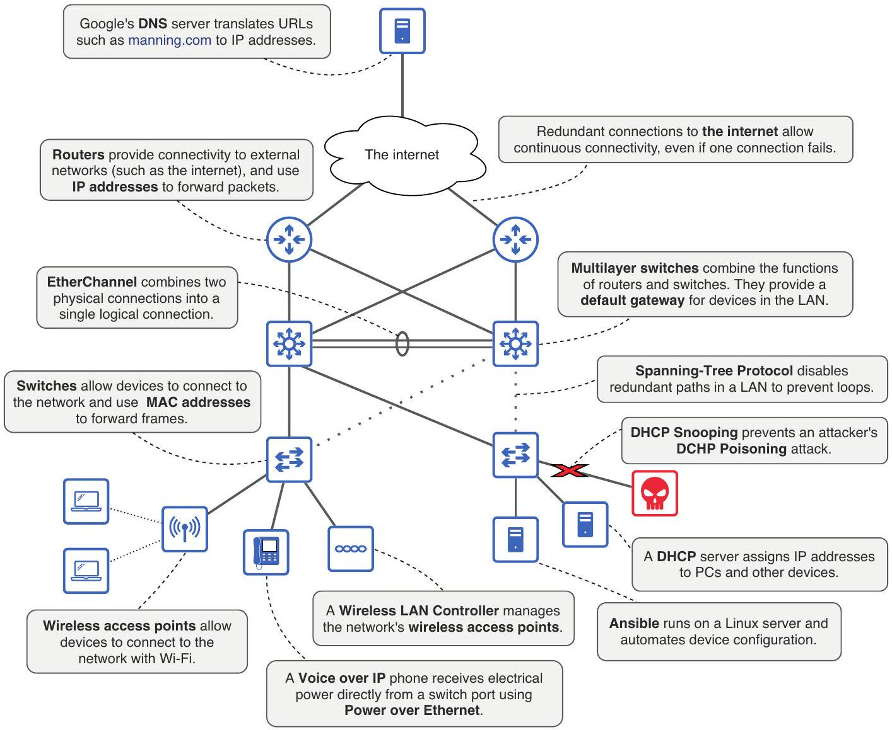

## Introduction to the CCNA

## This chapter covers

- What is the CCNA?
- Why study for the CCNA?
- How to study for the CCNA

In this chapter, we will take a look at the CCNA exam itself, why it's valuable, and how you should go about studying for it. If you are interested enough in the CCNA to buy a book about it, chances are you already have a basic idea about what the CCNA is. You also certainly have your own reasons for wanting to study for the CCNA. However, I hope this chapter helps clarify some doubts you may have and encourages you to continue down the path to achieving the CCNA certification.

### 1.1 What is the CCNA?

The Cisco Certified Network Associate (CCNA) is an entry-level networking certification by Cisco Systems, and it is also the name of the exam you have to pass to become CCNA certified. The CCNA exam tests a candidate on various aspects of networking, such as IP addressing, wired and wireless network connections, routing and switching packets across a network, network services, security fundamentals, network automation, and many more. The various topics of the CCNA exam are organized into six logical domains.

### 1.1.1 The six domains of the CCNA exam

The six domains tested on the CCNA exam and their relative weightings are as follows:

- 1.0 Network Fundamentals-20\%
- 2.0 Network Access-20\%
- 3.0 IP Connectivity-25\%
- 4.0 IP Services-10\%
- 5.0 Security Fundamentals-15\%
- 6.0 Automation and Programmability-10\%

Within each of the domains, there are various topics and subtopics. If you are planning to take the CCNA exam, it is a good idea to know exactly what Cisco expects of you. Fortunately, Cisco has you covered; you can view the CCNA exam topics list on the Cisco Learning Network at http://mng.bz/AdVx.

Looking at the list of exam topics at the start of your studies might be a bit intimidating. If you are like I was when I started studying for the CCNA in 2018, you might have heard of an IP address before, but everything else on that list seems like a foreign language. Rest assured that if you follow volumes 1 and 2 of this book from start to end and take your time to understand the concepts, you will be fluent in the language of networking. You won't be an expert, but you will have the foundational knowledge and skills necessary to take on the CCNA exam and enter the world of network professionals.

I have heard the CCNA described as "a mile wide and an inch deep." Objectively speaking, that statement is true. The CCNA covers a wide variety of topics related to the field of networking, and as an entry-level certification, it does not dig deep into many nitty-gritty details, especially compared to Cisco's higher-level certifications like Cisco Certified Network Professional (CCNP) and Cisco Certified Internetwork Expert (CCIE). However, do not let this statement make you underestimate the CCNA or think it is trivial. It is often more difficult to wrap your head around a topic for the first time than it is to dig deeper once you already have a grasp of the fundamentals, and the CCNA certainly includes plenty of new topics for an aspiring engineer to understand. The CCNA is also much more comprehensive and challenging than comparable entrylevel networking certifications like CompTIA's Network+.

Although the CCNA is a vendor-specific certification (as opposed to a vendor-neutral certification like Network+), it is the de facto industry standard entry-level certification in the networking industry. In addition to testing your skills at configuring and troubleshooting Cisco routers and switches, the CCNA tests your knowledge of the fundamentals of networking. Modern networks use a variety of standard protocols that apply regardless of which vendor's device is running them. IP (Internet Protocol) is IP; it does not matter whether it is being used by a Cisco router, an Apple iPhone, or a Windows PC. The CCNA requires a combination of theoretical knowledge of standard protocols, as well as practical application on Cisco devices. That makes it one of the most respected and desired entry-level certifications not just for network professionals but also for IT professionals in general.

### 1.1.2 Format of the CCNA Exam

The CCNA is a 120-minute exam covering the six exam topic domains previously listed. The majority of the questions are multiple choice, but you can expect questions of various formats, such as

- Multiple choice, single answer-The question won't state "select one," but you'll only be able to select one option at a time.
- Multiple choice, multiple answers-The question will clearly indicate how many options to select: "select two," "select three," etc.
- Drag and drop-In these questions, you are required to move items or options from one part of the screen to another to correctly answer the question. This can involve matching terms with definitions, sequencing steps in a process, etc.
- Lab simulations-In these questions, you will log in to and configure Cisco routers and switches in a simulated network.

Cisco has a short video summarizing each of the four question types. I recommend taking a look to familiarize yourself with the question types and the exam interface: http://mng.bz/ZEpA.

When taking the CCNA exam, questions are randomly selected from a large pool, so no two test-takers will have the exact same experience. This applies to both the types and order of questions, as well as their distribution across the six exam domains. Although the exam topics list is divided into six sections, the exam itself is not. You will receive a set number of questions and have 120 minutes to answer them, managing your time as needed. And here's an important point: after you answer or skip a question, you can't go back! Don't make the mistake of skipping a difficult question with the intention of answering it later-this is not possible.

EXAM TIP Effective time management is crucial for success on the CCNA exam. Some questions, particularly lab simulations, demand more time than others, so it's important to allocate sufficient time for these questions. The challenge lies in not knowing the exact number of lab simulation questions or their placement within the exam. For example, if you only have 1 minute left and the final question is a lab simulation, it's unlikely you'll be able to finish the question, resulting in lost points. My recommendation is to answer the more straightforward questions confidently and move on-avoid spending excessive time second-guessing yourself. If you don't know the answer, select one and move on-there is no penalty for guessing.

Cisco keeps the exact contents of the exam and the grading scheme tightly protected, but the general consensus is that the lab simulations are more heavily weighted than the other question types. There's a study tip: when studying for the CCNA, never skip the lab exercises! Whether the lab simulations on the exam are more heavily weighted or not, hands-on practice is still essential for studying.

## Exam scenarios

Throughout the book, you will find several exam scenarios that present questions similar to what you might find on the CCNA exam. Note that these aren't actual CCNA exam questions. The contents of Cisco's exams are protected by a nondisclosure agreement (NDA) that you must accept before taking each exam. Violating the NDA will result in Cisco banning you from their certification program. This includes accessing leaked exam questions to prepare for an exam; don't do it!

### 1.1.3 Scheduling and taking the exam

The CCNA exam, administered by Cisco's testing partner Pearson VUE, can be taken either at an authorized test center or online. To schedule the exam, visit CertMetrics (https://cp.certmetrics.com/cisco/en/login). If you don't have a Cisco account yet, you'll have to make one; just click Sign Up, and make an account.

Once logged in to CertMetrics, click Schedule Now to proceed to the Pearson VUE website, where you can find the CCNA exam under Proctored Exams. Here, you can choose between taking the exam at a test center or online.

Some prefer to schedule the exam at the start of their studies and build a study plan based on that date. However, if this is your first time taking a certification exam, I advise against this, as the time required for preparation can vary depending on factors like your work and educational background and the amount of time you can dedicate to studying.

NOTE The CCNA is not held on specific dates; you are free to schedule and take the exam at any time throughout the year. Online exams are available 24/7 (depending on the availability of proctors), but in-person exams depend on the test center's availability.

Both test center and online exams are proctored to ensure exam integrity. At a test center, staff will be present to monitor you. If you take the exam online, a proctor will confirm that you have a suitable testing environment before the exam (possibly asking you to remove objects around your desk or walls) and monitor you via webcam and microphone during the exam. For details about online testing, check out Cisco's page here: http://mng.bz/RZvv. If you can't secure a quiet, private location for at least 2 hours, I recommend taking the exam at a test center-any unexpected disturbances (such as another person entering the room) could result in your exam being canceled.

### 1.2 Why get CCNA-certified?

Every day, thousands of people worldwide decide to begin their journey to becoming CCNA-certified. There is a good reason for that: although these days there are many competitive players in the field of networking, Cisco is still the industry leader by far. Enterprises all over the world, large and small, use Cisco devices in their networks,
so it makes sense that those enterprises would want to hire people competent with Cisco devices. A job search on LinkedIn for "CCNA" gives many tens of thousands of results in the United States alone, and that number multiplies to hundreds of thousands worldwide.

Whether you are already in the field of IT and looking to move up the ladder to a new position or are new to the field and looking for your first job in IT, the CCNA can give you a major career advantage. A CCNA-certified person should be ready to take on job roles like network technician, network support engineer, network/systems administrator, junior network engineer, and many more. Aside from the immense value of the information you learn and the skills you acquire, simply having the CCNA on your resume is a big help in getting past the so-called HR filter and actually getting the interview. Getting a job in IT without any experience can be difficult, but being CCNAcertified will greatly improve your odds.

Although the CCNA is a networking-focused certification, it is valuable not only for those aiming for networking-specific roles. Networking is one of the foundational skills of IT, so your CCNA studies will serve you well regardless of your path. CCNA-certified professionals often move on to careers in cybersecurity, cloud, systems engineering, and other areas of IT.

Whatever your reasons are for wanting to become CCNA-certified, I promise you that you won't regret it. IT is competitive, with many eager individuals all over the world looking to join the field. The CCNA will help you differentiate yourself and stand out from the crowd.

### 1.3 The structure of this book

The official CCNA exam topics list divides the topics into six logical domains. However, for a student beginning their CCNA studies, studying the topics in order from top to bottom is not ideal. Each CCNA instructor (myself included) structures their book or course differently, but no course (that I am aware of) follows the order of the exam topics list. At a very high level, the two volumes of this book cover the exam domains in the following order:

- 1.0 Network Fundamentals and 3.0 IP Connectivity
- 2.0 Network Access
- 3.0 IP Connectivity (again)
- 4.0 IP Services
- 5.0 Security Fundamentals
- 6.0 Automation and Programmability

However, you will find elements of multiple domains throughout all parts of both volumes of the book. If you are just beginning your CCNA studies, I recommend studying this book in the order I have written it; each chapter assumes you have already studied the previous chapters, so jumping around is likely to result in confusion. However,
appendix A includes a chart that you can use to cross-reference the CCNA exam topics and the chapters in volumes 1 and 2 of this book. The chart should prove useful when reviewing specific exam topics before the exam.

Figure 1.1 depicts a sample network and highlights some of the various devices and protocols that make the network work. This is only a small selection of the topics we'll delve into in this book. If you're a newcomer to networking, you might have only heard of a few of the highlighted technologies (and probably aren't sure how they actually work). However, at the end of both volumes of this book, you'll be able to explain all of these technologies and more.

Figure 1.1 A local area network (LAN) connected to the internet (as represented by the cloud icon). Various devices (routers, switches, etc.) and protocols (DHCP, DNS, etc.) are highlighted. We will cover all of these technologies and more in this book's two volumes.

### 1.4 How to study for the CCNA

The CCNA is a demanding exam that requires an understanding of various complex concepts, how they relate to each other, how to practically apply them in a network, and how to troubleshoot them when things go wrong. An optimal CCNA study plan should therefore take advantage of multiple resources such as a book, a video course, and practical lab exercises. Let's examine each of these resource types and their role in effectively preparing for the CCNA exam.

### 1.4.1 Using a book

For many CCNA candidates, a book is where they start their CCNA studies, and for good reason. The written word is a powerful medium for conveying technical information. I want to emphasize that studying from a book differs from simply reading from a book. While you study from a book, stop occasionally to think about what you've just read. Take notes. Try to explain the concepts you are learning. Be an active learner, and you'll be able to get the most out of this book and others. You don't get more out of a book by simply reading through it multiple times. You get more out of a book by being an active learner rather than a passive learner.

### 1.4.2 Using a video course

A video course allows you to cover the same material studied in a book from a different angle. It's common to hear that videos are good for developing a general understanding of a particular topic, and books are good for digging into the details. The extent to which that is true depends on which book and which video course you are using, but I would generally agree. While you don't have to use both a book and a video course, my own experience and the experiences of many others suggest that it is beneficial. Use this book in combination with a video course of your choice, and you'll be able to take advantage of the strengths of both mediums.

### 1.4.3 Lab exercises

Lab exercises (labs) are an essential part of any CCNA study plan. Labbing, a common bit of IT jargon, is a term that means getting hands-on practice with the technology you're studying. Because this book is about the CCNA, in this context, labbing means practicing configuring Cisco routers and switches. Although there is a lot of theoretical information covered in the CCNA, it's all for the purpose of being able to apply your skills in a real network, so labbing is an essential part of studying for the CCNA.

There are a few options available for CCNA lab practice: physical hardware, network emulators, and network simulators. Let's take a look at each option and why I recommend using a network simulator (Cisco Packet Tracer) for the CCNA.

The first option is to use physical hardware-real Cisco routers and switches. While this may seem like the ideal approach, it is not the one I recommend for your CCNA studies. It certainly is valuable practice for an aspiring network engineer to connect and configure real physical network devices, but in terms of cost and convenience, this approach is not the best. To buy all of the necessary hardware would be cost prohibitive
for most-likely many thousands of dollars. Second-hand hardware can be more affordable (you could probably assemble a viable home lab for under \$1,000), but it is still too expensive for many. Second-hand devices also often run old software versions, which may not accurately represent the behavior of more recent devices.

Another option is to use a network emulation platform such as Cisco Modeling Labs (CML). CML uses virtualization technology to run virtual routers and switches, enabling you to build and run virtual networks on a personal computer or server. These virtual devices run real Cisco IOS (Internetworking Operating System, not to be confused with Apple iOS, which runs on iPhones) and allow you to configure nearly anything you would be able to on a physical Cisco router or switch. Although I would recommend this approach over physical hardware, I still do not think it is ideal. While cheaper than hardware, CML still costs around \$200 per year. Additionally, running these virtual labs can require a lot of CPU and RAM resources, so unless you already have a powerful computer, you might have trouble running networks with more than a few virtual devices.

These reasons are why I think Cisco Packet Tracer is the best option for CCNA lab practice. Whereas CML is a network emulator that uses virtual machines to run real Cisco IOS, Packet Tracer is a network simulator. It is software that simulates the function of Cisco network devices but does not actually run real Cisco IOS. This makes Packet Tracer very lightweight-you do not need a powerful computer to run even very large simulated networks. Best of all, it's free. I'm all for investing money in your studies when necessary (I'm certainly glad you invested in this book!), but when a tool like Packet Tracer is available for free, it's hard to argue against it. Figure 1.2 shows a screenshot of a lab in Packet Tracer.

Figure 1.2 A lab in Cisco Packet Tracer. On the left is the network diagram with the lab's instructions below it, and on the right is the CLI of one of the devices in the network.

NOTE Go to http://mng.bz/2Kra to download Packet Tracer for free (click Sign Up if you don't have a Cisco account). That page also includes links to free courses from Cisco that guide you through how to download, install, and use Packet Tracer.

Although I recommend Packet Tracer, there are certainly downsides to it. Because it doesn't run actual Cisco IOS but rather a simulated version of it, there are plenty of features and configuration commands that Packet Tracer doesn't support. Packet Tracer only supports what its developers have programmed into it. That means that there will be some instances where a configuration command I show in this book cannot be used in Packet Tracer. However, Packet Tracer was developed as a tool for CCNA labs, so the vast majority of what we will cover in this book is supported. For studies beyond the CCNA, however, you should look into one of the other two options.

Most CCNA courses include lab exercises with them; they are essential practice. My video course includes lab exercises that will help solidify the concepts you've studied and build your networking skills. You can access it for free on YouTube at http://mng .bz/1G9q.

### 1.4.4 Using multiple resources together

So you've got this book, you've decided on a video course, and you've installed Cisco Packet Tracer on your computer for labs. Now what? While there is no single correct answer for how to approach your studies, the following are a couple of ideas.

One option is to focus exclusively on this book at first. Read a chapter, take notes, try to explain the concepts in your own words, and try out the configurations in Packet Tracer. Then, progress to the next chapter, and repeat the process until you have completed both volumes of this book. After that process, you may very well be ready to take on the CCNA exam, but there's also a chance that there will be some gaps in your understanding of the concepts. To fill in those gaps, you can then follow the same process with a video course of your choice.

A second option is to use multiple resources at the same time. Study a chapter from this book, and then study the equivalent section of the video course. Do the labs provided in the course, move on to the next chapter of the book, and then repeat the process.

As I mentioned previously, there is no single correct answer. You might have to experiment to find the approach that works best for you. I will emphasize one point, though: don't forget to do labs! Networking is a skill, and no skill can be developed only by reading a book. You have to get your hands dirty and apply what you've learned.

## Summary

- The CCNA is an exam and certification by Cisco Systems. It is the de facto industry standard entry-level networking certification.
- The CCNA exam topics are divided into six domains: network fundamentals, network access, IP connectivity, IP services, security fundamentals, and automation and programmability. Each domain contains various topics and subtopics.
- The CCNA exam is 120 minutes in length and consists of a variety of question types: multiple choice, single answer; multiple choice, multiple answers; drag and drop; and lab simulations.
- Exam questions are randomly drawn from a large pool. Question types, order, and distribution across the exam domains are random, so each test-taker will have a different experience.
- After answering or skipping a question, you can't go back. Don't skip a question with the intention of answering it later-this is not possible.
- Don't be afraid to guess if you don't know the answer to a question on the exam. There is no penalty for incorrect answers.
- The CCNA exam is administered by Pearson VUE and can be taken at an authorized test center or online.
- Enterprises of all sizes use Cisco devices and seek CCNA-certified engineers. The knowledge and skills gained in the CCNA apply to all areas of IT-not just networking.
- Study resources (including this book) do not teach the CCNA exam topics in order, from top to bottom. Rather, each instructor teaches the topics in the order they believe to be best. Use the appendix at the back of this book to crossreference the CCNA exam topics if necessary.
- Multiple study resources (book, video, labs) should be used together to solidify what you learn.
- Labs can be done with physical hardware, an emulator (such as Cisco Modeling Labs), or a simulator (Cisco Packet Tracer).
- Cisco Packet Tracer is the best option for CCNA labs because it is free, easy to set up, and supports most of what is needed for the CCNA.
- Do your lab exercises!

## Part 1 - Network fundamentals

Welcome to the first leg of your journey into the intricate world of computer networking. In this first part of the book, we will set the stage for your understanding of how networks like the internet work, forming a foundation we will build upon throughout the rest of this book. When learning any new subject, the fundamentals are key, and networking is no exception. We'll start in chapter 2 by examining the various kinds of devices that form networks: routers, switches, and firewalls-the devices that form the underlying network infrastructure-as well as the clients and servers that communicate over that infrastructure.

In chapter 3, we'll see how we can connect those devices with copper and fiber-optic Ethernet cables. Chapter 4 takes a theoretical approach, covering the TCP/IP networking model; this is the blueprint of the internet and most modern networks, providing a theoretical framework for understanding how different network protocols function and interact. Chapter 5, on the other hand, is very hands-on; we will connect to the command-line interface (CLI) of a Cisco router and navigate through its basic command hierarchy. If you're new to CLIs, you'll feel like you've hacked into the matrix! The CLI can seem like a maze at first, but with a bit of hands-on practice, it will soon feel like a second home.

In chapter 6, we will begin delving into how networks actually enable devices to communicate with each other, focusing on how switches facilitate communication within a local area network (LAN). Then, chapter 7 addresses one of the most important topics in all of computer networking: Internet Protocol (IP) addresses. Just as a house needs an address to communicate via physical mail, a computer needs an IP address to communicate via digital messages over a network. Finally, chapter 8 focuses on Cisco router and switch interfaces, which are used to connect these network infrastructure devices.
