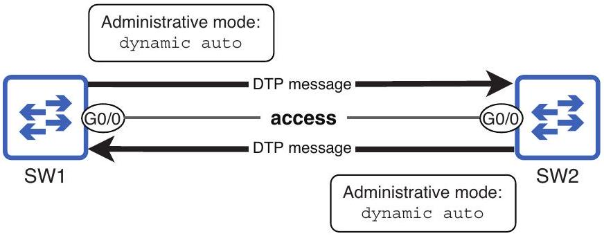
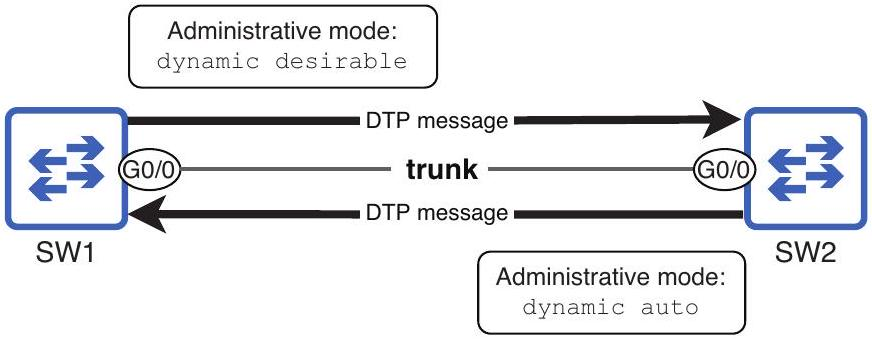
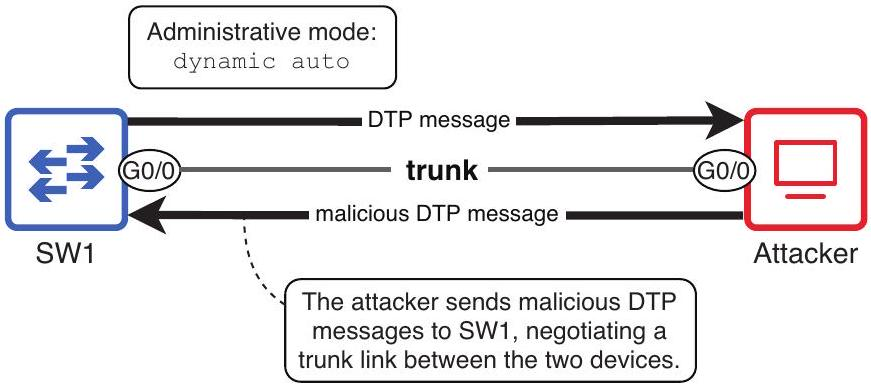
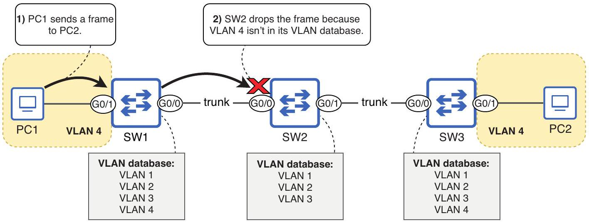
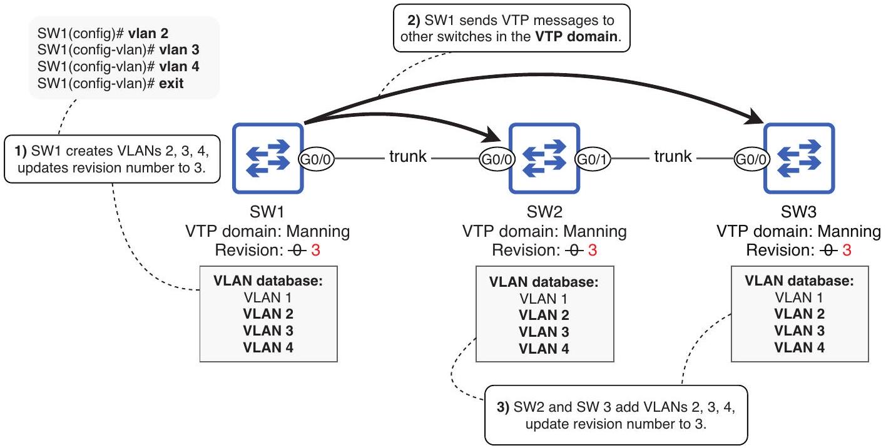
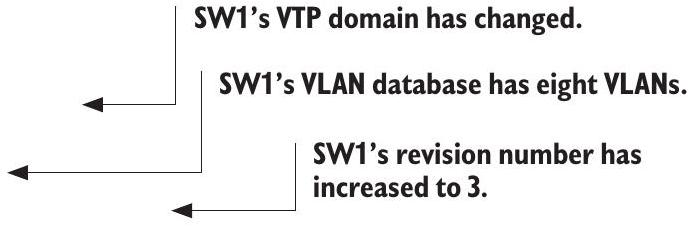
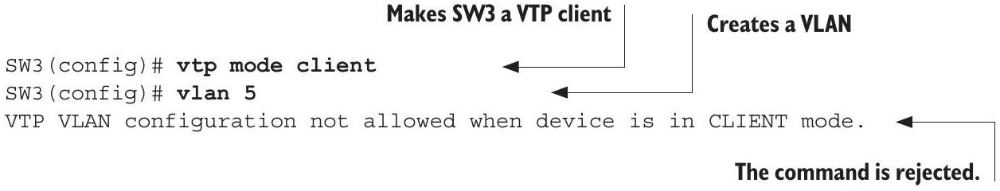
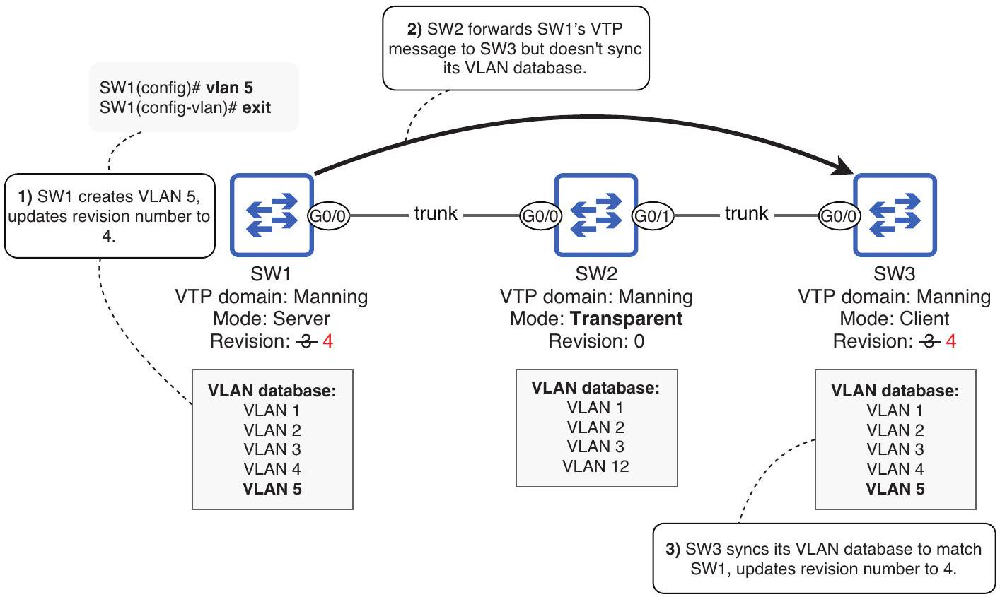
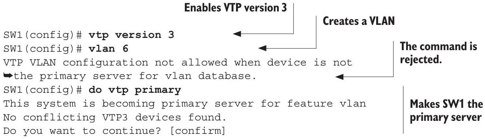
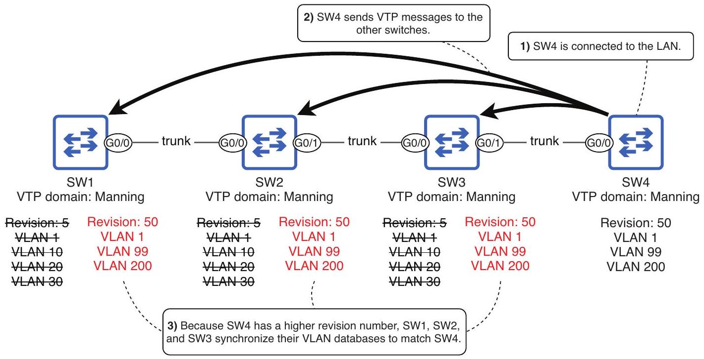

## Dynamic Trunking Protocol and VLAN Trunking Protocol

> [!map] Chapter 13 Section Index
> - [[Chapter 13.1 - Dynamic Trunking Protocol|13.1 Dynamic Trunking Protocol]]
> - [[Chapter 13.2 - VLAN Trunking Protocol|13.2 VLAN Trunking Protocol]]

## This chapter covers

- Switch port administrative and operational modes
- How switches use Dynamic Trunking Protocol to determine a port's operational mode
- How to use VLAN Trunking Protocol to automate VLAN administration

In this chapter, we will look at two protocols related to VLANs, the topic of the previous chapter. Dynamic Trunking Protocol (DTP) and VLAN Trunking Protocol (VTP) are both auxiliary protocols designed to streamline VLAN configuration and management on Cisco switches. As in chapter 12, in this chapter, we will cover the following two exam topics:

> [!translation] 逐句繁體中文翻譯
> - 在本章中，我們將討論與 VLAN 相關的兩種協議，這是上一章的主題。
> - Dynamic Trunking Protocol (DTP) 和 VLAN Trunking Protocol (VTP) 都是輔助協議，旨在簡化 Cisco switch 上的 VLAN 配置和管理。
> - 與第 12 章一樣，在本章中，我們將涵蓋以下兩個考試主題：

- 2.1 Configure and verify VLANs (normal range) spanning multiple switches
- 2.2 Configure and verify interswitch connectivity

Before Cisco's major overhaul of the CCNA exam topics in 2020, both DTP and VTP were listed as exam topics. Their removal in 2020 led some to believe that DTP and VTP would not be covered on the CCNA exam, but this is a misunderstanding; although the exam topics list no longer explicitly names DTP and VTP, they both play important roles in the configuration of VLANs and interswitch connectivity on Cisco switches, and you are expected to know them for the CCNA exam.

> [!translation] 逐句繁體中文翻譯
> - 在2020年Cisco對CCNA考試題目進行重大改革之前，DTP和VTP都被列為考試題目。
> - 2020 年移除這兩個名稱後，有些人認為 CCNA 考試不再涵蓋 DTP 與 VTP，但這是誤解；雖然考試主題清單不再明確列出它們，兩者仍在 Cisco switch 的 VLAN 設定與 switches 間連線中扮演重要角色，因此仍是 CCNA 應掌握的內容。

### 13.1 Dynamic Trunking Protocol

Dynamic Trunking Protocol (DTP) is a Cisco-proprietary protocol that allows Cisco switches to automatically determine the operational mode of their ports. A port's operational mode is the mode the port operates in (access or trunk), as opposed to the administrative mode, which is the port's configured mode (using the switchport mode command). If a switchport is manually configured as an access port or trunk port, the port's administrative and operational modes will be identical:

> [!translation] 逐句繁體中文翻譯
> - Dynamic Trunking Protocol (DTP) 是 Cisco 專有協議，可讓 Cisco switch自動確定其port的operational mode。
> - port的operational mode是port運作的模式（存取或中繼），而不是administrative mode，administrative mode是port的設定模式（使用 switchport mode 指令）。
> - 如果手動將switch端口配置為接入端口或中繼端口，則該端口的管理和operational mode將相同：

- A port configured with switchport mode access (administrative mode) will always operate as an access port (operational mode).
- A port configured with switchport mode trunk (administrative mode) will always operate as a trunk port (operational mode).

When using DTP, neighboring switches send each other DTP messages, informing each other of their port's administrative mode. Depending on the combination of administrative modes of the connected ports, the switches decide the appropriate operational mode for their ports.

> [!translation] 逐句繁體中文翻譯
> - 使用 DTP 時，鄰近switch會相互傳送 DTP 訊息，告知對方其port的administrative mode。
> - 根據所連接port的administrative mode組合，switch決定其port的適當operational mode。

NOTE Only switches use DTP; to make a switch port connected to a router operate as a trunk port (when using router on a stick), you must manually configure trunk mode on the port.

> [!translation] 逐句繁體中文翻譯
> - 注意 只有switch使用 DTP；要使連接到router的switchport作為中繼port（使用 Router on a Stick時），必須在port 上手動設定中繼模式。

DTP was developed to streamline the deployment of switches by requiring less manual configuration of port modes, but it was found to be a security vulnerability (more on that later in this chapter), so today it is generally considered best practice to disable DTP on switch ports. However, DTP is active on Cisco switches by default, so it's important to understand how it works, even if only to know how to disable it.

> [!translation] 逐句繁體中文翻譯
> - DTP 的開發目的是透過減少對port模式的手動配置來簡化switch的部署，但人們發現它是一個安全漏洞（本章稍後會詳細介紹），因此目前通常認為在switchport 上停用 DTP 是最佳實踐。
> - 但是，預設情況下，DTP 在 Cisco switch 上處於活動狀態，因此了解它的工作原理非常重要，即使只是知道如何停用它。

NOTE As a Cisco-proprietary protocol, DTP only works on Cisco switches. If you want your Cisco switch to have a trunk connection with a switch from another vendor, you must manually configure trunk mode with switchport mode trunk.

> [!translation] 逐句繁體中文翻譯
> - 說明 DTP 是 Cisco 專有協議，僅適用於 Cisco switch。
> - 如果要讓 Cisco switch 與其他廠商的 switch 建立 trunk connection，必須使用 `switchport mode trunk` 手動設定 trunk mode。

### 13.1.1 DTP negotiation

In chapter 12, we manually configured access and trunk ports. However, there are two other options for the switchport mode command: switchport mode dynamic auto and switchport mode dynamic desirable. Rather than explicitly specifying which mode the port should operate in, these administrative modes tell the switch to use DTP to determine the port's operational mode. By default, a port in one of these modes will operate as an access port, but if the connected switches both agree, a trunk link will be formed.

> [!translation] 逐句繁體中文翻譯
> - 在第 12 章中，我們手動設定了存取port和中繼port。
> - 不過，`switchport mode` 指令還有兩個選項：`switchport mode dynamic auto` 與 `switchport mode dynamic desirable`。
> - 這些administrative mode不是明確指定port應在哪種模式下運行，而是告訴switch使用 DTP 來確定port的operational mode。
> - 預設情況下，處於這些模式之一的port將作為access port運行，但如果連接的switch都同意，則會形成trunk link。

Figure 13.1 shows two Cisco switches connected by their G0/0 ports, each with an administrative mode of dynamic auto. The result is an access link; the switches agree
that they will not form a trunk. This process of exchanging DTP messages and agreeing upon an operational mode is called DTP negotiation.


Figure 13.1 Two connected switches negotiate their ports' operational mode by sending DTP messages. Both ports use the default administrative mode of dynamic auto, resulting in an access link; SW1 G0/0 and SW2 G0/0 operate as access ports.

NOTE dynamic auto is the default administrative mode for all Cisco switch ports, so by default, two Cisco switches that are connected will not form a trunk; the connection will remain in access mode.

> [!translation] 逐句繁體中文翻譯
> - 注意 dynamic auto是所有 Cisco switchport的預設administrative mode，因此預設情況下，連接的兩台 Cisco switch不會形成中繼；連線將保持在存取模式。

To view a port's administrative and operational modes, use the show interfaces interface-name switchport command, as in the following example. Note that the operational mode is static access; this means it is an access port that is assigned to a specific VLAN (the VLAN specified in the switchport access vlan command, or the default of VLAN 1). There are also dynamic access ports, in which the switch decides the port's VLAN based on the connected device, but dynamic access ports are beyond the scope of the CCNA:

> [!translation] 逐句繁體中文翻譯
> - 若要查看 port 的 administrative mode 與 operational mode，請使用 `show interfaces interface-name switchport` 指令，如下例所示。
> - 注意operational mode為靜態存取；這表示它是指派給特定 VLAN（在 switchport access vlan 指令中指定的 VLAN，或預設 VLAN 1）的存取port。
> - 還有動態存取端口，其中switch根據連接的設備決定端口的 VLAN，但動態訪問端口超出了 CCNA 的範圍：

```
SW1# show interfaces g0/0 switchport
Name: Gig0/O
Switchport: Enabled
Administrative Mode: dynamic auto
Operational Mode: static access
. . .
```

Although a port with administrative mode dynamic auto uses DTP to negotiate its operational mode, it does not actively try to form a trunk link with its neighbor; that's why two connected ports in dynamic auto mode do not form a trunk, as we saw in figure 13.1.

> [!translation] 逐句繁體中文翻譯
> - 儘管具有administrative modedynamic auto的port使用 DTP 來協商其operational mode，但它不會主動嘗試與其鄰居形成trunk link；這就是為什麼dynamic auto模式下的兩個port不會形成中繼，如圖 13.1 所示。

If we change the administrative mode of SW1 G0/0 to dynamic desirable, the result is different; a port in dynamic desirable mode actively attempts to form a trunk. Figure 13.2 shows the result: a trunk link between SW1 and SW2.

> [!translation] 逐句繁體中文翻譯
> - 如果將SW1 G0/0的administrative mode改為dynamic desirable，則結果不同；處於dynamic desirable模式的port主動嘗試形成中繼。
> - 圖 13.2 顯示了結果：SW1 和 SW2 之間的trunk link。


Figure 13.2 SW1 and SW2 negotiate to form a trunk link. SW1 G0/0's administrative mode is dynamic desirable, and SW2 G0/0's is dynamic auto. The result is an operational mode of trunk.

As shown in the following example, SW1 G0/0's operational mode is now trunk:

> [!translation] 逐句繁體中文翻譯
> - 如下例所示，SW1 G0/0 的operational mode現在為 trunk：

```
SW1# show interfaces g0/0 switchport
Name: Gig0/O
Switchport: Enabled
Administrative Mode: dynamic desirable
Operational Mode: trunk
. . .
```

G0/0 functions as a trunk port.

> [!translation] 逐句繁體中文翻譯
> - G0/0 作為 trunk port 運作。

Table 13.1 lists the four administrative modes that can be configured with the switchport mode command and gives a brief description of each.

**Table 13.1 — Switch port administrative modes／Switch port 管理模式**

| Mode／模式          | Description／說明                                                                                                                                                                                                                                                          | Sends DTP?／傳送 DTP？ |
| :----------------- | :-------------------------------------------------------------------------------------------------------------------------------------------------------------------------------------------------------------------------------------------------------------------------- | :--------------------: |
| `access`           | Manually configures an access port. Operational mode will always be access.<br>手動設定為 access port；operational mode 永遠是 access。                                                                                                                                       | No／否                 |
| `trunk`            | Manually configures a trunk port. Operational mode will always be trunk.<br>手動設定為 trunk port；operational mode 永遠是 trunk。                                                                                                                                           | Yes／是                |
| `dynamic auto`     | Uses DTP to negotiate but does not actively try to form a trunk. It forms a trunk when connected to `trunk` or `dynamic desirable`.<br>使用 DTP 協商，但不主動嘗試形成 trunk；連接到 `trunk` 或 `dynamic desirable` port 時會形成 trunk。                                         | Yes／是                |
| `dynamic desirable` | Uses DTP to negotiate and actively tries to form a trunk. It forms a trunk when connected to `trunk`, `dynamic auto`, or `dynamic desirable`.<br>使用 DTP 協商並主動嘗試形成 trunk；連接到 `trunk`、`dynamic auto` 或 `dynamic desirable` port 時會形成 trunk。                       | Yes／是                |


NOTE Although administrative mode trunk manually configures a trunk port, the port will still send DTP messages; the purpose is to ensure that the neighboring port also operates in trunk mode (if the neighbor is in dynamic auto or dynamic desirable mode).

> [!translation] 逐句繁體中文翻譯
> - 說明 雖然administrative modeTrunk 手動配置Trunk 端口，但該端口仍會發送DTP 訊息。目的是確保相鄰port也運行在中繼模式下（如果鄰居處於dynamic auto或動態理想模式）。

For the CCNA exam, it's important to understand the resulting operational mode of each combination of administrative modes; table 13.2 shows the results of each combination. Note that access + trunk is not a valid combination; either the switches will detect the mismatch and block the link, or the traffic that passes through the link will be limited to only the trunk port's native VLAN and the access port's VLAN (because both are untagged). Either way, don't use this combination!

> [!translation] 逐句繁體中文翻譯
> - 對於 CCNA 考試，了解每種administrative mode組合所產生的operational mode非常重要；表 13.2 顯示了每種組合的結果。
> - 請注意，access + trunk 不是有效的組合；switch要么檢測到不匹配並阻止link，要么通過link的traffic將僅限於中繼端口的本機 VLAN 和接入端口的 VLAN（因為兩者都未標記）。
> - 無論哪種方式，都不要使用此組合！

**Table 13.2 — Resulting operational mode／協商後的 operational mode**

| Local administrative mode／本地設定 | Neighbor: `access` | Neighbor: `trunk` | Neighbor: `dynamic desirable` | Neighbor: `dynamic auto` |
| :---------------------------------- | :----------------: | :---------------: | :-----------------------------: | :----------------------: |
| `access`                            | `access`           | Invalid／無效     | `access`                        | `access`                 |
| `trunk`                             | Invalid／無效      | `trunk`           | `trunk`                         | `trunk`                  |
| `dynamic desirable`                 | `access`           | `trunk`           | `trunk`                         | `trunk`                  |
| `dynamic auto`                      | `access`           | `trunk`           | `trunk`                         | `access`                 |


EXAM TIP Make sure that you can identify the operational mode that results from each combination of administrative modes; it's a potential exam question.

> [!translation] 逐句繁體中文翻譯
> - 考試提示 確保您能夠識別每種administrative mode組合所產生的operational mode；這是一個潛在的考試問題。

## Trunk encapsulation negotiation

In addition to negotiating a port's operational mode, DTP can also negotiate which protocol a port uses to tag frames if it becomes a trunk: 802.1Q or ISL. Of course, this only applies to switches that support both 802.1Q and ISL. As I mentioned in chapter 12, modern Cisco switches only support 802.1Q, so I wouldn't expect any questions related to ISL on the CCNA exam.

> [!translation] 逐句繁體中文翻譯
> - 除了協商port的operational mode之外，DTP 還可以協商port在成為中繼時使用哪個協定來標記frame：802.1Q 或 ISL。
> - 當然，這僅適用於同時支援 802.1Q 和 ISL 的switch。
> - 正如我在第 12 章中提到的，現代 Cisco switch僅支援 802.1Q，因此我預期 CCNA 考試中不會出現任何與 ISL 相關的問題。

If a switch supports both protocols, its default setting is switchport trunk encapsulation negotiate. If both switches are using negotiate, the result will be ISL. If one side specifies a protocol (dot1q or is1), the side using negotiate will agree to use the same encapsulation. An encapsulation mismatch (dot1q on one side, isl on the other) is a misconfiguration. If you encounter a switch that supports both 802.1Q and ISL, you should manually configure 802.1Q with switchport trunk encapsulation dot1q, as we covered in chapter 12.

> [!translation] 逐句繁體中文翻譯
> - 如果switch支援這兩種協議，則其預設為switchport中繼封裝協商。
> - 如果兩台switch都使用協商，結果將為 ISL。
> - 如果一方指定了協議（dot1q 或 is1），則使用協商的一方將同意使用相同的封裝。
> - 封裝不符（一側為 dot1q，另一側為 isl）是一種錯誤配置。
> - 如果您遇到同時支援 802.1Q 和 ISL 的交換機，則應使用switchport中繼封裝 dot1q 手動設定 802.1Q，如我們在第 12 章所述。

### 13.1.2 Disabling DTP

As I mentioned previously, DTP was developed to streamline the deployment of switches by allowing them to automatically determine the operational status of the ports. However, it is also a security vulnerability; an attacker can take advantage of DTP to form a trunk link with a switch, gaining access to all VLANs in the LAN.

> [!translation] 逐句繁體中文翻譯
> - 正如我之前提到的，DTP 的開發目的是透過允許switch自動確定port的運作狀態來簡化switch的部署。
> - 然而，這也是一個安全漏洞；攻擊者可以利用 DTP 與switch形成中繼link，從而獲得對 LAN 中所有 VLAN 的存取權。

In the default administrative mode of dynamic auto, a switch port connected to an end host will operate in access mode; end hosts don't use DTP, so they can't negotiate
a trunk. This means that the end host will have access only to a single VLAN, and communication between that VLAN and other VLANs can be controlled by configuring security policies on the router.

> [!translation] 逐句繁體中文翻譯
> - 在dynamic auto的預設administrative mode下，連接到終端host的switchport將以存取模式運作；終端host不使用 DTP，因此它們無法協商中繼。
> - 這表示終端host只能存取單一 VLAN，並且可以透過在router 上設定安全性原則來控制該 VLAN 與其他 VLAN 之間的通訊。

However, if a malicious user uses something like Yersinia (a hacking tool) to send DTP messages out of their PC, they can negotiate to form a trunk link with the switch port, giving them access to all VLANs in the LAN, presenting a security threat. Figure 13.3 depicts an attacker who has used DTP to negotiate a trunk with a switch.

> [!translation] 逐句繁體中文翻譯
> - 然而，如果惡意使用者使用耶爾森氏菌（一種駭客工具）之類的東西從其 PC 發送 DTP 訊息，他們可以協商與switchport形成中繼link，使他們能夠存取 LAN 中的所有 VLAN，從而構成安全威脅。
> - 圖 13.3 描述了使用 DTP 與switch協商中繼的攻擊者。


Figure 13.3 An attacker sends malicious DTP messages to SW1 to form a trunk. This gives the attacker access to all VLANs in the LAN, presenting a security threat.

Because of the security implications and to reduce the amount of unnecessary traffic (DTP messages) being sent in the LAN, it is recommended that you disable DTP. There are two ways to do this:

> [!translation] 逐句繁體中文翻譯
> - 由於安全隱患以及為了減少在 LAN 中發送的不必要traffic（DTP 訊息），建議您停用 DTP。
> - 有兩種方法可以執行此操作：

- Manually configure the port as an access port with switchport mode access.
- Explicitly disable DTP with switchport nonegotiate.

In the following example, I use show interfaces g0/0 switchport. The output states Negotiation of Trunking: On; this means the port is sending DTP messages. I then configure G0/0 as an access port and check again; notice that trunk negotiation is now Off:

> [!translation] 逐句繁體中文翻譯
> - 在以下範例中，我使用 showinterfacesg0/0switchport。
> - 輸出狀態 中繼協商：開；這表示port正在傳送 DTP 訊息。
> - 然後我將 G0/0 配置為存取port並再次檢查；請注意，中繼協商現已關閉：

```
SW1# show interfaces g0/0 switchport
Name: Gi0/0 GO/O’s administrative mode
Switchport: Enabled
Administrative Mode: dynamic auto
Operational Mode: static access
. . .
Negotiation of Trunking: On ← DTP is enabled.
. . .
SW1# configure terminal
SW1(config) # interface g0/0
SW1(config-if)# switchport mode access
SW1(config-if)# do show interfaces g0/0 switchport
Name: GiO/O
Switchport: Enabled
```

```
Administrative Mode: static access
Operational Mode: static access
. . .
Negotiation of Trunking: Off ← DTP is disabled.
. . .
```

As demonstrated in the previous example, manually configuring access mode disables DTP on the port; it won't send DTP messages. However, the second method can be used to ensure that the port never sends DTP messages, regardless of its current mode (access or trunk). In the following example, I configure G0/0 as a trunk port and confirm that negotiation is On. I then use switchport nonegotiate to disable DTP and confirm again:

> [!translation] 逐句繁體中文翻譯
> - 如上例所示，手動設定存取模式會停用port 上的 DTP；它不會傳送 DTP 訊息。
> - 但是，可以使用第二種方法來確保port永遠不會發送 DTP 訊息，無論其當前模式為何（存取或中繼）。
> - 在以下範例中，我將 G0/0 配置為trunk port並確認協商已開啟。
> - 然後我使用 switchport nonegotiate 停用 DTP 並再次確認：

```
SW1(config)# interface g0/0
SW1(config-if)# switchport mode trunk
SW1(config-if)# do show interfaces g0/0 switchport
Name: GiO/O
Switchport: Enabled
Administrative Mode: trunk
Operational Mode: trunk
. . .
Negotiation of Trunking: On ← DTP is enabled.
. . .
SW1(config-if)# switchport nonegotiate < \ Disables DTP
SW1(config-if)# do show interfaces g0/0 switchport
Name: GiO/O
Switchport: Enabled
Administrative Mode: trunk
Operational Mode: trunk
. . .
Negotiation of Trunking: Off ← DTP is disabled.
. . .
```

Even if you manually configure a port in access mode, it is recommended that you also use switchport nonegotiate to ensure that DTP messages are never sent, even if you later configure the port in trunk mode.

> [!translation] 逐句繁體中文翻譯
> - 即使您手動將port配置為存取模式，建議您也使用 switchport nonegotiate 以確保永遠不會發送 DTP 訊息，即使您稍後將port配置為中繼模式也是如此。

EXAM TIP Remember that as a security best practice, use switchport nonegotiate to disable DTP on switch ports.

> [!translation] 逐句繁體中文翻譯
> - 考試提示 請記住，作為安全最佳實踐，請使用 switchport nonegotiate 停用switchport 上的 DTP。

### 13.2 VLAN Trunking Protocol

VLAN Trunking Protocol (VTP) is another Cisco-proprietary protocol that plays a role in VLAN configuration on Cisco switches. VTP allows switches to automatically synchronize their VLAN database, the file that stores information about the VLANs that exist on the switch. Using VTP, switches in a LAN send each other messages with information about the VLANs in their VLAN database, and the switches synchronize their database according to the latest version of the database.

> [!translation] 逐句繁體中文翻譯
> - VLAN Trunking Protocol (VTP) 是另一個 Cisco 專有協議，在 Cisco switch 上的 VLAN 設定中發揮作用。
> - VTP 允許switch自動同步其 VLAN 資料庫，該資料庫儲存有關switch 上存在的 VLAN 的資訊。
> - 使用 VTP，LAN 中的switch會相互傳送訊息，其中包含有關其 VLAN 資料庫中的 VLAN 的信息，並且switch根據資料庫的最新版本同步其資料庫。

NOTE The VLAN database is stored in a file called vlan.dat in flash memory; use the dir flash: or show flash: commands to view the contents of flash memory. You can use show vlan brief to view the contents of the VLAN database (as we covered in chapter 12).

> [!translation] 逐句繁體中文翻譯
> - 注意 VLAN 資料庫儲存在快閃記憶體中名為 vlan.dat 的檔案中；使用 dir flash: 或 show flash: 指令查看快閃記憶體的內容。
> - 您可以使用 show vlan Brief 來查看 VLAN 資料庫的內容（如我們在第 12 章中所介紹的）。

Figure 13.4 demonstrates why it's important for switches in a LAN to have the same VLANs in their VLAN database; PC1 sends a frame to PC2, but SW2 drops the frame because VLAN 4 isn't in SW2's VLAN database.


Figure 13.4 A missing VLAN on SW2 prevents PC1 from communicating with PC2. 1) PC1 sends a frame to PC2. 2) SW2 drops the frame because VLAN 4 isn't in its VLAN database.

VTP can ensure that all VLANs exist on all switches in the LAN. In a small LAN like figure 13.4, VTP might not seem necessary; manually creating VLAN 4 on SW2 wouldn't be such a hassle. However, in a large LAN with dozens of switches, VTP can both save time and reduce human error by propagating VLAN changes without requiring manual configuration on every single switch.

> [!translation] 逐句繁體中文翻譯
> - VTP 可確保所有 VLAN 都存在於 LAN 中的所有switch 上。
> - 在如圖 13.4 所示的小型 LAN 中，VTP 似乎沒有必要；在 SW2 上手動建立 VLAN 4 不會那麼麻煩。
> - 然而，在擁有數十台switch的大型 LAN 中，VTP 可以透過傳播 VLAN 變更來節省時間並減少人為錯誤，而無需在每台switch 上進行手動設定。

NOTE Like DTP, VTP is a Cisco-proprietary protocol that only runs on Cisco switches; it cannot be used to synchronize VLANs with another vendor's switches.

> [!translation] 逐句繁體中文翻譯
> - 注意 與 DTP 一樣，VTP 是 Cisco 專有協議，只能在 Cisco switch 上運作。它不能用於與其他供應商的switch同步 VLAN。

### 13.2.1 VTP synchronization

Figure 13.5 shows how VLANs created on SW1 can be propagated to SW2 and SW3 using VTP. Starting with only VLAN 1, I created VLANs 2, 3, and 4 on SW1. This causes SW1 to increment the VTP revision number-a number that keeps track of the latest version of the VLAN database. The revision number starts at 0 and is updated each time there is a change to the VLAN database, such as a VLAN being created, deleted, or renamed. This causes SW1 to send VTP messages to SW2 and SW3, informing them of the updates to the VLAN database. SW2 and SW3 then update their VLAN databases to match SW1.

NOTE VLANs 1002 to 1005 also exist by default on Cisco switches and cannot be removed. I won't mention them in this chapter because they are reserved for legacy technologies (Token Ring and FDDI) that are not used in modern networks, as mentioned in chapter 12.

> [!translation] 逐句繁體中文翻譯
> - 說明 VLAN 1002 至 1005 在 Cisco switch 上也預設存在，且無法刪除。
> - 我不會在本章中提及它們，因為它們是為現代network中未使用的遺留技術（令牌環和 FDDI）保留的，如第 12 章所述。


Figure 13.5 VLANs created on SW1 are propagated to other switches in the VTP domain "Manning." (1) SW1 creates VLANs 2, 3, and 4, updating its revision number to 3 (incrementing by 1 each time it creates a VLAN). (2) SW1 sends VTP messages to other switches in the VTP domain. (3) SW2 and SW3 add VLANs 2, 3, and 4 to their VLAN databases, updating their revision number to match SW1's.

NOTE VTP messages are only sent out of trunk ports, not access ports.

> [!translation] 逐句繁體中文翻譯
> - 注意 VTP 訊息僅從中繼port傳送，不從存取port傳送。
Figure 13.5 also introduced the concept of the VTP domain-the group of switches in a LAN that all share the same VTP domain name. By default, switches do not have a VTP domain name; in this state, VTP is not active. You can configure VLANs on the device, but it will not send VTP messages to other switches in the LAN. The following example shows the output of show vtp status-a useful command to view the current state of VTP on the switch-before configuring VTP or any VLANs on SW1. We will cover the relevant fields of this output throughout the rest of this chapter.

NOTE A switch that does not have a VTP domain name is said to be in domain NULL.

> [!translation] 逐句繁體中文翻譯
> - 注意 沒有 VTP 網域的switch稱為位於 NULL 域中。

```
SW1# show vtp status
VTP Version capable                       : 1 to 3
VTP version running                       : 1
VTP Domain Name                           :
VTP Pruning Mode                          : Disabled
VTP Traps Generation                      : Disabled
Device ID                                 : 5254.0008.8000
Configuration last modified by 0.0.0.0 at 4-25-23 03:25:46
Local updater ID is 0.0.0.0 (no valid interface found)

Feature VLAN:
--------------
VTP Operating Mode                        : Server
Maximum VLANs supported locally           : 1005
Number of existing VLANs                  : 5
Configuration Revision                    : 0
MD5 digest                                : 0x57 0xCD 0x40 0x65 0x63 0x59 0x47 0xBD
                                            0x56 0x9D 0x4A 0x3E 0xA5 0x69 0x35 0xBC
```

The revision number starts at 0.

> [!translation] 逐句繁體中文翻譯
> - Revision number 從 0 開始。

If you configure a VTP domain name on one switch, it will send VTP messages to other switches, and all switches without a VTP domain name will adopt the new domain name; the command to do so is **vtp domain** *domain-name*. In the following examples, I configure the VTP domain name “Manning” and VLANs 2, 3, and 4 on SW1. Then, I confirm that all switches in the LAN have joined the “Manning” domain and share the same Configuration Revision number—this is the revision number that I mentioned previously:

> [!translation] 逐句繁體中文翻譯
> - 如果在一台 switch 上設定 VTP domain name，它會向其他 switches 傳送 VTP messages；尚未設定 VTP domain name 的 switches 都會採用這個新 domain name。使用的指令是 **vtp domain** *domain-name*。
> - 在以下範例中，我在 SW1 設定 VTP domain name「Manning」，並建立 VLAN 2、3 與 4。
> - 接著確認 LAN 中所有 switches 都已加入「Manning」domain，並具有相同的 Configuration Revision number；這就是前面提過的 revision number：

```
SW1(config)# vtp domain Manning
Changing VTP domain name from NULL to Manning
SW1(config)# vlan 2
SW1(config-vlan)# vlan 3
SW1(config-vlan)# vlan 4
SW1(config-vlan)# end
SW1# show vtp status
. . .
VTP Domain Name                           : Manning
. . .
Number of existing VLANs                  : 8
Configuration Revision                    : 3
SW2# show vtp status
. . .
VTP Domain Name                           : Manning
. . .
Number of existing VLANs                  : 8
Configuration Revision                    : 3
SW3# show vtp status
. . .
VTP Domain Name                           : Manning
. . .
Number of existing VLANs                  : 8
Configuration Revision                    : 3
```



Because the revision number is used to keep track of the latest version of the VLAN database, switches will only synchronize their VLAN database if they receive a VTP message from a switch with a higher revision number, not a lower one; a VTP message with a lower (or equal) revision number is considered old information.

> [!translation] 逐句繁體中文翻譯
> - Revision number 用來追蹤 VLAN database 的最新版本，因此 switch 只會在收到來自較高 revision number switch 的 VTP message 時同步 VLAN database，而不會接受較低的版本。
> - Revision number 較低或相同的 VTP message 會被視為舊資訊。

### 13.2.2 VTP modes

A Cisco switch can operate in one of four VTP modes: server, client, transparent, and off, each mode with its own characteristics. The VTP mode can be configured with the vtp mode mode command. Switches in server mode and client mode actively participate in VTP and synchronize their VLAN databases to match each other, whereas switches in transparent mode and off mode do not. Table 13.3 summarizes each mode.

> [!translation] 逐句繁體中文翻譯
> - Cisco switch可以在四種 VTP 模式之一下運作：伺服器、用戶端、透明和關閉，每種模式都有自己的功能。
> - VTP 模式可以使用 vtp mode mode 指令進行設定。
> - 伺服器模式和用戶端模式下的switch主動參與 VTP 並同步其 VLAN 資料庫以相互匹配，而透明模式和關閉模式下的switch則不會。
> - 表 13.3 總結了每種模式。

**Table 13.3 — VTP modes／VTP 模式**

| Mode／模式      | Description／說明 |
| :------------- | :---------------- |
| `server`       | This is the default mode. The switch can create, modify, and delete VLANs. It advertises VLAN database changes and synchronizes its database when it receives an advertisement with a higher revision number.<br>這是預設模式。Switch 可以建立、修改及刪除 VLAN；它會通告 VLAN database 的變更，並在收到具有較高 revision number 的 advertisement 時同步自己的 database。 |
| `client`       | The switch cannot create, modify, or delete VLANs, but otherwise behaves like a server.<br>Switch 無法建立、修改或刪除 VLAN；除此之外，其行為與 server 相同。 |
| `transparent`  | The switch can create, modify, and delete VLANs locally, but it neither advertises its own VLAN database changes nor synchronizes with other switches. It does not directly participate in the VTP domain, but it forwards VTP messages between switches in the same domain.<br>Switch 可以在本機建立、修改及刪除 VLAN，但不會通告自己的 VLAN database 變更，也不會與其他 switches 同步。它不直接參與 VTP domain，但會在同一 domain 的 switches 之間轉送 VTP messages。 |
| `off`          | The switch can create, modify, and delete VLANs locally, but it neither advertises nor synchronizes its VLAN database. It does not participate in VTP and does not forward VTP messages.<br>Switch 可以在本機建立、修改及刪除 VLAN，但不會通告或同步 VLAN database。它完全不參與 VTP，也不會轉送 VTP messages。 |


Switches are in VTP server mode by default. In this mode, a switch can create, modify (ie. rename), and delete VLANs, and those changes will be advertised to other switches in the domain. A VTP server will also synchronize its own VLAN database if it receives a VTP message with a higher revision number.

> [!translation] 逐句繁體中文翻譯
> - switch預設為 VTP 伺服器模式。
> - 在此模式下，switch可以建立、修改（即重新命名）和刪除 VLAN，並且這些變更將通告給網域中的其他switch。
> - 如果 VTP 伺服器收到具有較高修訂號的 VTP 訊息，它也會同步其自己的 VLAN 資料庫。

VTP client mode is similar to server mode, except for one difference: the switch cannot create/modify/delete VLANs. I demonstrate this in the following example by configuring SW3 VTP client mode and then attempting to create VLAN 5:

> [!translation] 逐句繁體中文翻譯
> - VTP 用戶端模式與伺服器模式類似，但有一點不同：switch無法建立/修改/刪除 VLAN。
> - 我在以下範例中透過設定 SW3 VTP 用戶端模式然後嘗試建立 VLAN 5 來示範這一點：


NOTE Cisco recommends that all switches in the domain be in server mode if they have sufficient memory resources. Any modern switch should have sufficient resources to store VLAN information, so you can safely leave all switches in VTP server mode.

> [!translation] 逐句繁體中文翻譯
> - 注意 如果網域中的所有switch有足夠的記憶體資源，Cisco 建議將其設定為伺服器模式。
> - 任何現代switch都應該有足夠的資源來儲存 VLAN 訊息，以便您可以安全地將所有switch置於 VTP 伺服器模式。

In a VTP domain, in most cases, all switches will be in server (or client) mode; they are the modes that take advantage of VTP's VLAN database synchronization. Transparent mode prevents the switch from synchronizing its VLAN database with other switches. You can create, modify, and delete VLANs on the switch, but it will not advertise those changes to other switches. However, the switch will forward VTP messages between switches in the same domain. Transparent mode should be used in cases where a switch needs to be managed independently from other switches, without interrupting VTP's operation on the rest of the switches in the LAN. Figure 13.6 demonstrates how VTP transparent mode works; SW2 has a VLAN database separate from SW1 and SW3 but forwards SW1's VTP messages to SW3.

> [!translation] 逐句繁體中文翻譯
> - 在一個VTP域中，大多數情況下，所有switch都會處於伺服器（或用戶端）模式；它們是利用 VTP 的 VLAN 資料庫同步的模式。
> - 透明模式會阻止switch與其他switch同步其 VLAN 資料庫。
> - 您可以在switch 上建立、修改和刪除 VLAN，但它不會將這些變更通告給其他switch。
> - 但是，switch將在同一網域中的switch之間轉送 VTP 訊息。
> - 如果需要獨立於其他switch來管理交換機，而不會中斷 LAN 中其餘switch 上的 VTP 操作，則應使用透明模式。
> - 圖 13.6 示範了 VTP 透明模式的工作原理； SW2 具有與 SW1 和 SW3 分開的 VLAN 資料庫，但將 SW1 的 VTP 訊息轉送到 SW3。


Figure 13.6 SW2, in transparent mode, forwards VTP messages but does not synchronize its VLAN database. (1) SW1 creates VLAN 5 and updates its revision number. (2) SW2 forwards SW1's VTP messages to SW3 but doesn't synchronize its VLAN database. (3) SW3 syncs its VLAN database to match SW1 and updates its revision number.

NOTE A switch in VTP transparent mode will always have revision number 0.
The final VTP mode is off, which disables VTP on the switch. Like transparent mode, the switch won't synchronize its VLAN database with other switches, but it also won't forward VTP messages between switches using VTP. If VTP is not being used in the LAN, you should configure vtp mode off to disable VTP on all switches.

> [!translation] 逐句繁體中文翻譯
> - 注意處於 VTP 透明模式的switch的修訂號碼始終為 0。
> - 最終 VTP 模式處於關閉狀態，這會停用switch 上的 VTP。
> - 與透明模式一樣，switch不會將其 VLAN 資料庫與其他switch同步，但它也不會使用 VTP 在switch之間轉送 VTP 訊息。
> - 如果 LAN 中未使用 VTP，則應設定 vtp 模式關閉以停用所有switch 上的 VTP。

### 13.2.3 VTP versions

You may have noticed the following lines when I showed the complete output of show vtp status in section 13.2.1:

> [!translation] 逐句繁體中文翻譯
> - 當我在第 13.2.1 節中顯示 show vtp status 的完整輸出時，您可能已經注意到以下幾行：

```
SW1# show vtp status
VTP Version capable : 1 to 3
VTP version running : 1
. . .
```

There are three different versions of VTP available, and version 1 is the default. You can configure the VTP version with the vtp version version command. Versions 1 and 2 are very similar; one difference is that version 2 supports Token Ring, which is not relevant to modern networks, so there isn't much reason to use version 2 over version 1.

> [!translation] 逐句繁體中文翻譯
> - VTP 有三個不同版本可用，版本 1 是預設版本。
> - 您可以使用 vtp version version 指令設定 VTP 版本。
> - 版本 1 和 2 非常相似；一個差異是版本 2 支援令牌環，這與現代network無關，因此沒有太多理由使用版本 2 而不是版本 1。

Version 3, on the other hand, brings various improvements over the previous two versions and should always be preferred if using VTP. Let's look at a few of those improvements that are relevant to the CCNA. We already covered one of the improvements: off mode. Before version 3, VTP only had three modes: server, client, and transparent. There was no way to actually disable VTP on a switch; the closest thing was to configure all switches in transparent mode.

> [!translation] 逐句繁體中文翻譯
> - 另一方面，版本 3 比前兩個版本帶來了各種改進，如果使用 VTP，則應始終首選。
> - 讓我們來看看與 CCNA 相關的一些改進。
> - 我們已經介紹了其中一項改進：關閉模式。
> - 在版本 3 之前，VTP 只有三種模式：伺服器、客戶端和透明。
> - 無法在switch 上實際停用 VTP；最接近的是將所有switch配置為透明模式。

NOTE Although off mode was added in VTP version 3, switches that support version 3 can use off mode even if they are running version 1 or 2.

> [!translation] 逐句繁體中文翻譯
> - 注意 儘管 VTP 版本 3 中新增了關閉模式，但支援版本 3 的switch即使運行版本 1 或 2 也可以使用關閉模式。

Now let's cover two other significant changes brought by VTP version 3: the primary server and extended-range VLAN support.

> [!translation] 逐句繁體中文翻譯
> - 現在讓我們介紹 VTP 版本 3 帶來的另外兩個重大變更：主伺服器和擴充範圍 VLAN 支援。

## The primary server

In VTP version 3, only one switch in the VTP domain can create, modify, and delete VLANs: the primary server. Other VTP servers (now called secondary servers) are no different than VTP clients, except that you can make a secondary server become the primary server with the command vtp primary in privileged EXEC mode.

> [!translation] 逐句繁體中文翻譯
> - 在 VTP 版本 3 中，VTP 網域中只有一台switch可以建立、修改和刪除 VLAN：主伺服器。
> - 其他 VTP 伺服器（現在稱為輔助伺服器）與 VTP 用戶端沒有什麼不同，只是您可以在特權 EXEC 模式下使用 vtp Primary 命令使輔助伺服器成為主伺服器。

NOTE Although most VTP commands are global config mode commands, the vtp primary command is a privileged EXEC mode command.

> [!translation] 逐句繁體中文翻譯
> - 注意 雖然大多數 VTP 指令是全域設定模式指令，但 vtp Primary 指令是特權 EXEC 模式指令。

In the following example, I enable VTP version 3 on SW1 and attempt to create VLAN 6, which fails. I then use the vtp primary command to make SW1 the primary server, and I am then able to create VLAN 6:

> [!translation] 逐句繁體中文翻譯
> - 在以下範例中，我在 SW1 上啟用 VTP 版本 3 並嘗試建立 VLAN 6，但失敗。
> - 然後，我使用 vtp Primary 命令使 SW1 成為主伺服器，然後我就可以建立 VLAN 6：


```
SW1(config)# vlan 6
SW1(config-vlan)# exit
```

SW1 can now create VLANs.

> [!translation] 逐句繁體中文翻譯
> - SW1 現在可以建立 VLAN。

NOTE In this example, I executed the vtp primary command in global config mode by adding do in front of the command. The vtp primary command on its own does not work in global config mode; it's a privileged EXEC mode command.

> [!translation] 逐句繁體中文翻譯
> - 注意 在本例中，我透過在命令前面新增 do 在全域設定模式下執行 vtp Primary 命令。
> - vtp 主指令本身在全域設定模式下不起作用；這是一個特權執行模式指令。

Only one switch in the domain can be the primary server; if you use the vtp primary command on a second switch, the first one will revert to being a secondary server. The reason for allowing only one switch in the domain to create, modify, and delete VLANs is to avoid the problem of a newly-connected switch overwriting the VLAN database for the domain-a problem we'll cover in section 13.2.4.

> [!translation] 逐句繁體中文翻譯
> - 網域內只能有一台switch作為主伺服器；如果您在第二台switch 上使用 vtp Primary 指令，第一台switch將恢復為輔助伺服器。
> - 只允許網域中的一台switch建立、修改和刪除 VLAN 的原因是為了避免新連線的switch覆蓋域的 VLAN 資料庫的問題，我們將在第 13.2.4 節中討論這個問題。

## Extended-range VLANs

In old versions of Cisco IOS, only VLANs 1 to 1005 were available for use; these are called the normal-range VLANs. In those versions of IOS, VLANs 1006 to 4094 were reserved for internal use by applications on the switch; a user could not create them or assign ports to those VLANs. In a later version of IOS, VLANs 1006 to 4094 were made available and called the extended-range VLANs; these days, all Cisco switches support both the normal- and extended-range VLANs.

> [!translation] 逐句繁體中文翻譯
> - 在舊版的 Cisco IOS 中，只有 VLAN 1 到 1005 可用；這些稱為正常範圍 VLAN。
> - 在這些版本的 IOS 中，VLAN 1006 到 4094 保留供switch 上的應用程式內部使用；使用者無法建立它們或將port指派給這些 VLAN。
> - 在 IOS 的更高版本中，VLAN 1006 至 4094 可用並稱為擴充範圍 VLAN；目前，所有 Cisco switch都支援一般 VLAN 和擴充範圍 VLAN。

Even after extended-range VLANs were made available for use, VTP versions 1 and 2 only supported normal-range VLANs. The only way to create extended-range VLANs on switches before VTP version 3 was to configure the switch in transparent mode, rendering it unable to participate in the VTP domain.

> [!translation] 逐句繁體中文翻譯
> - 即使擴充範圍 VLAN 可供使用後，VTP 版本 1 和 2 也僅支援正常範圍 VLAN。
> - 在 VTP 版本 3 之前的switch 上建立擴展範圍 VLAN 的唯一方法是將switch配置為透明模式，使其無法參與 VTP 域。

VTP version 3 brought the ability to create and propagate extended-range VLANs; the primary server can create extended-range VLANs and propagate them to other switches in the VTP domain.

> [!translation] 逐句繁體中文翻譯
> - VTP 版本 3 帶來了建立和傳播擴展範圍 VLAN 的能力；主伺服器可以建立擴展範圍的 VLAN 並將其傳播到 VTP 域中的其他switch。

### 13.2.4 Is VTP dangerous?

VTP doesn't have a very good reputation-and for good reason: it has caused a lot of network outages over the years. First, let's look at why VTP has a bad reputation, and then we'll see how version 3 fixes the problems with VTP.

> [!translation] 逐句繁體中文翻譯
> - VTP 的聲譽並不好，這是有充分理由的：多年來它造成了大量的network中斷。
> - 首先，讓我們看看為什麼 VTP 聲譽不佳，然後我們將了解版本 3 如何修復 VTP 的問題。

The danger of VTP is the potential for a newly connected switch to overwrite the VLAN database of all switches in the domain. Because switches using VTP synchronize their VLAN database to the switch with the highest revision number, if the newly connected switch has a higher revision number (and is in the same domain), all switches in the domain will synchronize to match it. Figure 13.7 illustrates how this can happen: SW4, with a revision number of 50, is connected to a VTP domain with a revision number of 5, causing the other switches to synchronize with it. As a result, hosts in VLANs 10, 20, and 30 will lose network connectivity; those VLANs no longer exist in the network!

> [!translation] 逐句繁體中文翻譯
> - VTP 的危險在於新連線的switch可能會覆蓋域中所有switch的 VLAN 資料庫。
> - 由於使用 VTP 的switch將其 VLAN 資料庫同步到具有最高修訂號的交換機，因此如果新連接的switch具有更高的修訂號（並且位於同一域中），則該域中的所有switch都將進行同步以匹配它。
> - 圖 13.7 說明了這種情況是如何發生的：版本號為 50 的 SW4 連接到版本號為 5 的 VTP 域，導致其他switch與其同步。
> - 因此，VLAN 10、20 和 30 中的host將失去network連線；這些 VLAN 不再存在於network中！


Figure 13.7 SW4 is connected to the network and overwrites the VLAN databases of SW1, SW2, and SW3. (1) SW4 is connected to the LAN. (2) SW4 sends VTP messages to the other switches. (3) Because SW4 has a higher revision number (50 vs. 5), SW1, SW2, and SW3 synchronize their VLAN databases to match SW4. Hosts in VLANs 10,20, and 30 will be unable to communicate over the network because their VLANs no longer exist.

NOTE You may be wondering, how could a newly added switch have a high revision number in the first place? One possibility is that it was used as a lab switch for testing and verifying before being added to the corporate network.

> [!translation] 逐句繁體中文翻譯
> - 注意您可能想知道，新新增的switch怎麼可能具有高版本號碼？
> - 一種可能性是，它在添加到公司network之前被用作測試和驗證的實驗室switch。

This is a very careless mistake, and standardized procedures for adding new devices to the network would prevent it from happening; one recommended procedure is to reset the VTP revision number of a switch to 0 before connecting it to the network. There are three methods for doing so:

> [!translation] 逐句繁體中文翻譯
> - 這是一個非常粗心的錯誤，在network上新增設備的標準化程序可以防止這種情況發生；一種建議的步驟是在將switch連接到network之前將switch的 VTP 修訂號重設為 0。
> - 可透過三種方法執行此操作：

- Change the VTP domain name to a different one and then back to the original name.
- Change the VTP mode to transparent and then back to server or client (only works in versions 1 and 2).
- Change the VTP mode to off and then back to server or client (only works in versions 1 and 2).

EXAM TIP Remember these three methods for resetting the revision number.
Resetting the revision number to 0 eliminates the risk of a newly added switch overwriting the VLAN database of switches in the network. However, it's an unfortunate truth that many corporations have few, if any, standardized procedures for such things, and
in any case, people can get careless. As a result, many people have been burned by VTP, giving it a bad reputation.

> [!translation] 逐句繁體中文翻譯
> - 考試提示 請記住這三種重設修訂版本號碼的方法。
> - 將修訂號重設為 0 可消除新新增的switch覆蓋network中switch的 VLAN 資料庫的風險。
> - 然而，不幸的是，許多公司幾乎沒有針對此類事情的標準化程序，而且在任何情況下，人們都可能會粗心大意。
> - 結果，許多人被 VTP 傷害了，給它帶來了壞名聲。

However, the primary server mechanism in version 3 eliminates this risk; switches will only synchronize to the primary server, so even if a new switch with a higher revision number is connected to the LAN, switches in the LAN won't synchronize to it. When using version 3, there's no need to be afraid of VTP, and it can be a great tool for automating some of the workflows of configuring a network.

> [!translation] 逐句繁體中文翻譯
> - 然而，版本3中的主伺服器機制消除了這種風險；switch只會同步到主伺服器，因此即使具有更高版本號碼的新switch連接到 LAN，LAN 中的switch也不會同步到它。
> - 使用版本 3 時，無需擔心 VTP，它可以成為自動化某些network設定工作流程的絕佳工具。

## Summary

- Dynamic Trunking Protocol (DTP) allows Cisco switches to automatically determine the operational mode of their ports.
- A port's administrative mode is how it is configured with the switchport mode command, and its operational mode is the mode it operates in (access or trunk).
- Use the show interfaces interface-name switchport command to view the administrative and operational modes of a port.
- A port configured with switchport mode access will always operate as an access port, and a port configured with switchport mode trunk will always operate as a trunk port.
- switchport mode dynamic auto and switchport mode dynamic desirable configure the port to use DTP to determine its operational mode.
- dynamic auto mode does not actively try to form a trunk with its neighbor but will form a trunk if the neighbor's mode is trunk or dynamic desirable.
- dynamic desirable mode actively tries to form a trunk with its neighbor and will form a trunk if the neighbor's mode is trunk, dynamic auto, or dynamic desirable.
- DTP is considered a security vulnerability and should be disabled. It is considered best practice to manually configure each port's mode and disable DTP with switchport nonegotiate on each port.
- VLAN Trunking Protocol (VTP) allows Cisco switches to synchronize their VLAN database-the file that stores information about VLANs on the switch (vlan.dat).
- The VTP revision number is used to keep track of the latest version of the VLAN database. Each time a change is made, the revision number is incremented by 1. A switch will synchronize to match a higher revision number but not a lower (or equal) one.
- The VTP domain is the group of switches in a LAN that share the same VTP domain name; a switch will only synchronize with another switch in the same domain.
- By default, a switch has no domain name; it is said to be in domain NULL. In this state, the switch can create/modify/delete VLANs, but it won't send VTP messages to other switches.

- You can configure a switch's VTP domain name with the vtp domain domain-name command.
- Use the show vtp status command to view the current state of VTP on the switch.
- A switch can operate in one of four VTP modes: server, client, transparent, and off. Use the vtp mode mode command to configure the mode (server is the default).
- A switch in VTP server mode can create/modify/delete VLANs. It will advertise changes to its VLAN database and synchronize its VLAN database upon receiving an advertisement with a higher revision number.
- A switch in VTP client mode cannot create/modify/delete VLANs but otherwise behaves the same as a server.
- A switch in VTP transparent mode can create/modify/delete VLANs but operates independently from other switches in the VTP domain. It will forward VTP messages between switches in the VTP domain but will not send its own VTP messages or synchronize its VLAN database with other switches.
- A switch in VTP off mode can create/modify/delete VLANs but does not participate in VTP at all.
- There are three versions of VTP: 1, 2, and 3. Versions 1 and 2 are very similar, but version 3 brought many improvements.
- VTP version 3 introduced off mode; before, VTP couldn't be disabled. The closest thing was to configure all switches in VTP transparent mode.
- In VTP version 3, only one switch in the domain can create, modify, and delete VLANs: the primary server. Switches in the domain will only synchronize with the primary server. Other servers are called secondary servers; they function the same as VTP clients.
- Use the vtp primary command (in privileged EXEC mode) on a VTP server to make it the primary server. There can only be one; if you configure vtp primary on a second server, the first one will revert to being a secondary server.
- VTP version 3 is the only version that supports extended-range VLANs (VLANs 1006 to 4094). Versions 1 and 2 only support normal-range VLANs (VLANs 1 to 1005).
- One risk of VTP is that a newly connected switch with a higher revision number can overwrite the VLAN database of all switches in the LAN. Version 3 solves this problem because switches will only synchronize with the primary server.
- To reset a switch's VTP revision number to 0, you can change the domain name to a different one and then back to the original. Alternatively, you can change the mode to transparent or off and then back to server or client, but this only works in versions 1 and 2.

> [!translation] Summary 逐點繁體中文翻譯
> - Dynamic Trunking Protocol（DTP）讓 Cisco switches 自動決定 ports 的 operational mode。
> - Port 的 administrative mode 是透過 `switchport mode` 指令設定的模式；operational mode 則是 port 實際運作的模式，也就是 access 或 trunk。
> - 使用 `show interfaces interface-name switchport` 查看 port 的 administrative mode 與 operational mode。
> - 設定 `switchport mode access` 的 port 永遠以 access port 運作；設定 `switchport mode trunk` 的 port 永遠以 trunk port 運作。
> - `switchport mode dynamic auto` 與 `switchport mode dynamic desirable` 會讓 port 使用 DTP 決定 operational mode。
> - `dynamic auto` 不會主動嘗試與鄰居形成 trunk；但鄰居為 `trunk` 或 `dynamic desirable` 時會形成 trunk。
> - `dynamic desirable` 會主動嘗試與鄰居形成 trunk；鄰居為 `trunk`、`dynamic auto` 或 `dynamic desirable` 時都會形成 trunk。
> - DTP 被視為安全弱點，應予以停用。最佳實務是手動設定每個 port 的 mode，並在每個 port 使用 `switchport nonegotiate` 停用 DTP。
> - VLAN Trunking Protocol（VTP）讓 Cisco switches 同步 VLAN database；這個 database 儲存 switch 上的 VLAN 資訊，檔名為 `vlan.dat`。
> - VTP revision number 用來追蹤 VLAN database 的最新版本。每次發生變更時，revision number 加 1。Switch 會同步較高的 revision number，但不會同步較低或相同的 revision number。
> - VTP domain 是 LAN 中共用相同 VTP domain name 的 switches 群組；switch 只會與相同 domain 中的其他 switch 同步。
> - Switch 預設沒有 domain name，稱為位於 domain NULL。在此狀態下，switch 可以建立、修改及刪除 VLAN，但不會向其他 switches 傳送 VTP messages。
> - 使用 `vtp domain domain-name` 設定 switch 的 VTP domain name。
> - 使用 `show vtp status` 查看 switch 目前的 VTP 狀態。
> - Switch 可在 server、client、transparent 與 off 四種 VTP modes 之一運作。使用 `vtp mode mode` 設定；server 是預設模式。
> - VTP server mode 的 switch 可以建立、修改及刪除 VLAN。它會通告 VLAN database 的變更，並在收到較高 revision number 的 advertisement 時同步自己的 VLAN database。
> - VTP client mode 的 switch 無法建立、修改或刪除 VLAN；除此之外，其行為與 server 相同。
> - VTP transparent mode 的 switch 可以建立、修改及刪除 VLAN，但獨立於 VTP domain 中的其他 switches 運作。它會在相同 domain 的 switches 之間轉送 VTP messages，但不會傳送自己的 VTP messages，也不會與其他 switches 同步 VLAN database。
> - VTP off mode 的 switch 可以建立、修改及刪除 VLAN，但完全不參與 VTP。
> - VTP 有 versions 1、2、3。Versions 1 與 2 非常相似；version 3 則帶來多項改進。
> - VTP version 3 加入 off mode；此前無法真正停用 VTP，最接近的做法是把所有 switches 設為 VTP transparent mode。
> - 在 VTP version 3 中，domain 內只有 primary server 能建立、修改及刪除 VLAN。Domain 內的 switches 只會與 primary server 同步；其他 servers 稱為 secondary servers，功能與 VTP clients 相同。
> - 在 VTP server 上以 privileged EXEC mode 使用 `vtp primary`，可使其成為 primary server。同一時間只能有一台；若在第二台 server 設定 `vtp primary`，第一台會恢復為 secondary server。
> - 只有 VTP version 3 支援 extended-range VLANs（VLAN 1006–4094）；versions 1 與 2 僅支援 normal-range VLANs（VLAN 1–1005）。
> - VTP 的風險之一，是新連接且具有較高 revision number 的 switch 可能覆寫 LAN 中所有 switches 的 VLAN database。Version 3 藉由只允許 switches 與 primary server 同步來解決此問題。
> - 若要把 switch 的 VTP revision number 重設為 0，可以先把 domain name 改成其他名稱，再改回原名稱。另一種方法是先切換為 transparent 或 off mode，再切回 server 或 client mode；但這種方法只適用於 versions 1 與 2。
