## Spanning Tree Protocol

## This chapter covers

- How Layer 2 loops lead to broadcast storms
- How Spanning Tree Protocol detects and prevents Layer 2 loops
- The various STP port roles, states, and timers
- Using PortFast to accelerate STP convergence

This chapter is about Spanning Tree Protocol (STP), a protocol that runs on all Cisco switches by default and solves a significant problem in LANs: Layer 2 loops that result in frames looping around the network indefinitely. STP is mentioned in exam topic 2.5: Identify basic operations of Rapid PVST+ Spanning Tree Protocol. Exam topic 2.5 specifically refers to the rapid version of the protocol, the topic of chapter 15. However, to understand Rapid STP, we first have to cover the original protocol, and that's what we'll do in this chapter.

### 14.1 The need for STP

In chapter 7 (IPv4 addressing), we briefly covered the fields of the IPv4 header; one of those is the Time-to-Live (TTL) field, which is decremented each time a router forwards a packet. When the value in the TTL field reaches 0, the packet is dropped, preventing packets from looping around the network indefinitely as the result of a misconfiguration; this is called a routing loop or Layer 3 loop.

The Ethernet header has no such field; if a loop occurs between switches-a Layer 2 loop-there is no mechanism in place to prevent frames from looping around the LAN indefinitely. If there are too many frames looping around the LAN, the switches can be overwhelmed, resulting in a loss of service for all hosts in the LAN.

So, how do Layer 2 loops occur? Whereas Layer 3 loops are the result of a misconfiguration somewhere in the network, Layer 2 loops are inevitable in a LAN where there are multiple paths between any two nodes in the LAN, as a result of the flooding of BUM traffic (broadcast, unknown unicast, and multicast) frames.

NOTE I will mention multicast traffic a few times throughout this book's two volumes. For now, just know that multicast frames are flooded by switches by default.

Having multiple paths between hosts is an example of redundancy and is a desirable thing in a network. Redundancy means having additional network devices and connections beyond the minimum necessary for communication. By having redundant devices and connections, network service isn't lost if one device or connection fails- there is no single point of failure.

However, without something like STP to prevent loops, frames will loop indefinitely in a LAN with redundant connections, as demonstrated in figure 14.1. Any one of the connections between switches in the figure could be removed (e.g., the connection between SW2 and SW3), and the PCs would still be able to communicate with each other; this is an example of redundancy.

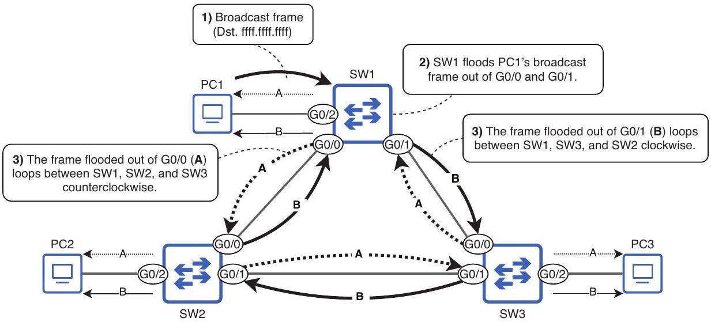
Figure 14.1 PC1 sends a broadcast frame, and SW1 floods it. When SW2 and SW3 receive their copies of the frame, they flood it too, resulting in two loops: counterclockwise (A) and clockwise (B). These frames will loop indefinitely between SW1, SW2, and SW3.

NOTE As the arrows pointing toward the PCs in figure 14.1 indicate, SW1, SW2, and SW3 will also flood the looping frames toward connected end hosts, potentially overwhelming them by requiring the hosts to process the looping frames repeatedly.

There are two main problems caused by Layer 2 loops. First, if enough looping frames accumulate in the network, the result is a broadcast storm, consuming so many network resources (CPU resources on the devices or bandwidth of the links) that the network is rendered unusable. PCs and other end hosts connected to the switches also receive the same frames repeatedly, which could overwhelm their available resources too.

The second problem is MAC address flapping-when a switch learns the same MAC address repeatedly on separate ports. Using the example in figure 14.1, when SW1 first receives PC1's broadcast frame, it learns PC1's MAC address on the G0/2 port. However, when looped Frame A arrives back on G0/1, it learns PC1's MAC address on that port, and the same applies when looped Frame B arrives back on G0/0. SW1 will constantly update the entry for PC1's MAC address in its MAC address table between multiple ports, resulting in PC1 being unable to receive frames; SW1 doesn't know which port PC1 is actually connected to.

A Layer 2 loop can bring down a LAN in a matter of seconds (depending on the amount of BUM traffic), so it's absolutely essential to avoid Layer 2 loops. That's the role of STP.

### 14.2 How STP works

STP can be summarized in one sentence: it prevents Layer 2 loops by blocking redundant connections, leaving only a single active path between any two nodes in a LAN. Figure 14.2 shows an example: the link between SW2 and SW3 is disabled, preventing a Layer 2 loop from occurring.

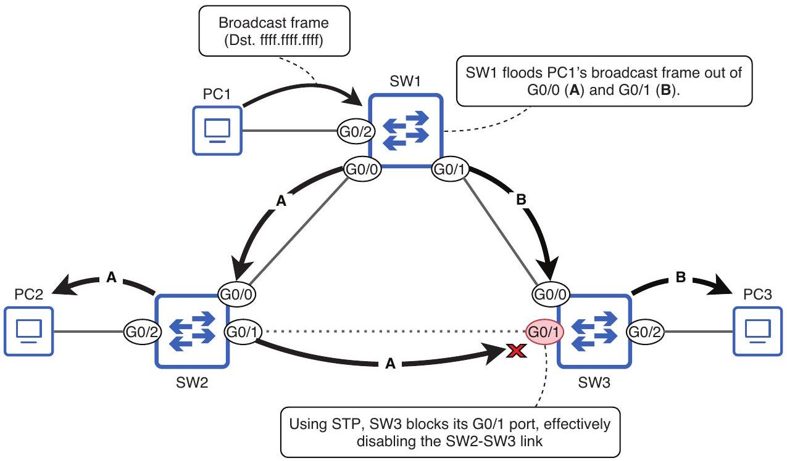
Figure 14.2 PC1 sends a broadcast frame, and SW1 floods it. Using STP, SW3 blocks its G0/1 port, effectively disabling the SW2-SW3 connection; this prevents a Layer 2 loop from occurring.

Although the physical topology in figure 14.2 is the same as in figure 14.1, thanks to STP there is no longer a Layer 2 loop. SW3's G0/1 port is now in the blocking state; it does not forward frames and does not process received frames (except for STP-related messages). All other ports are in the forwarding state; they can forward and receive frames as normal. The SW2 G0/1 to SW3 G0/1 link is unused but is available to take over if there is a problem on another link.

NOTE The term topology refers to how devices are arranged and connected in a network. In figure 14.2, SW1, SW2, and SW3 are physically connected in a ring topology, forming a circle. The term STP topology can be used to refer to the logical arrangement of switches and their connections as a result of STP-some actively carrying network traffic, and some blocked by STP to prevent Layer 2 loops.

Whereas figures 14.1 and 14.2 only showed three switches, figure 14.3 shows a LAN with many more switches connected in a mesh-a network topology in which each node is connected to each other node (full mesh) or as many other nodes as possible but not all (partial mesh). In a network like this, there are countless Layer 2 loops. However, with STP, the switches will automatically put ports in the blocking state to create a loopfree topology. Although network traffic does not pass over the disabled links, they are available to take over if one of the active links fails.

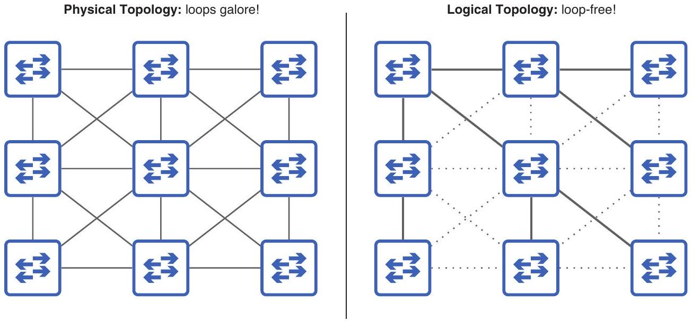
Figure 14.3 STP creates a loop-free topology in a meshed LAN. In the physical topology (left), there are countless ways that frames could loop around the network. However, STP creates a logical topology (right) that is loop-free.

## What's a spanning tree?

A spanning tree is a concept in the mathematical field of graph theory. In graph theory, a graph is a structure that models relationships between objects (also called nodes). A tree is a subgraph in which any two nodes are connected by exactly one path, and spanning means that the tree includes all nodes; the tree spans across all nodes.

```
(continued)
```

Let's compare that to a network using STP. Each switch running STP is a node in the graph, with various physical connections between them (the physical topology in figure 14.3). STP disables some of the connections, leaving only one active path between any two nodes; this is the subgraph-the spanning tree (the logical topology in figure 14.3).

### 14.3 The STP algorithm

The process STP uses to create a loop-free topology is called the STP algorithm. There are three main steps in the algorithm:

1 Root bridge election
2 Root port selection
3 Designated port selection

Figure 14.4 shows an example of a LAN after STP created a loop-free topology. In this section, we will examine this LAN and go through the STP algorithm step by step. Note that I designed this LAN to demonstrate various aspects of the STP algorithm rather than to represent a realistic LAN topology; we will cover LAN architecture best practices in chapter 15 of volume 2 of this book.

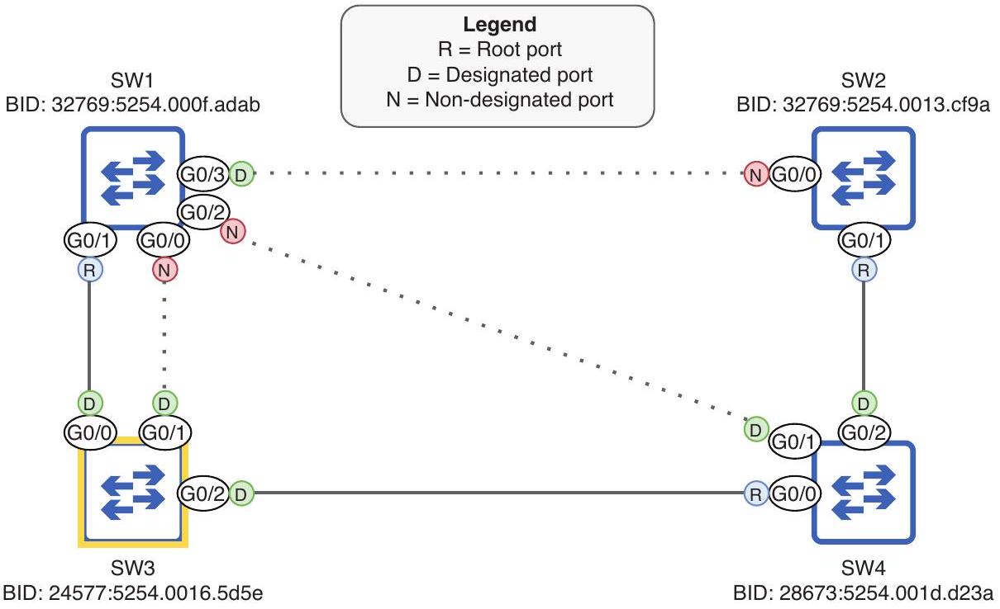
Figure 14.4 A LAN after STP has created a loop-free topology. SW3 is the root bridge, and each other switch has one root port leading to SW3. The remaining ports are either designated or non-designated ports; non-designated ports are blocked, disabling their connections.

### 14.3.1 Root bridge election

The first step in the STP algorithm is to elect a single switch as the root bridge for the LAN. The root bridge is the central point of reference for the STP topology, and in later steps, all other switches ensure that they have exactly one active path to reach the root bridge.

NOTE STP was developed for use with Ethernet bridges, which were predecessors to switches. As a result, STP uses the term bridge rather than switch. Although modern networks use switches instead of bridges, the original terminology (such as root bridge) persists. In the context of STP, bridge and switch can be considered synonymous.

The root bridge election is carried out by switches sharing STP Bridge Protocol Data Unit (BPDU) messages with each other. Actually, the information shared in BPDUs is used to make all of the decisions in the STP algorithm, not just the root bridge election. BPDUs are sent every 2 seconds and contain various pieces of STP-related information; the two pieces of information relevant to the root bridge election are the switch's own bridge identifier (BID)-a number that uniquely identifies the switch in the LAN-and the BID of the switch it believes to be the root bridge.

When a switch first boots up, it does not yet know the root bridge of the LAN, so it declares itself to be the root bridge. Figure 14.5 demonstrates this: the four switches have all booted up at the same time, and each switch sends BPDUs declaring itself to be the root bridge (the My BID and Root BID fields match).

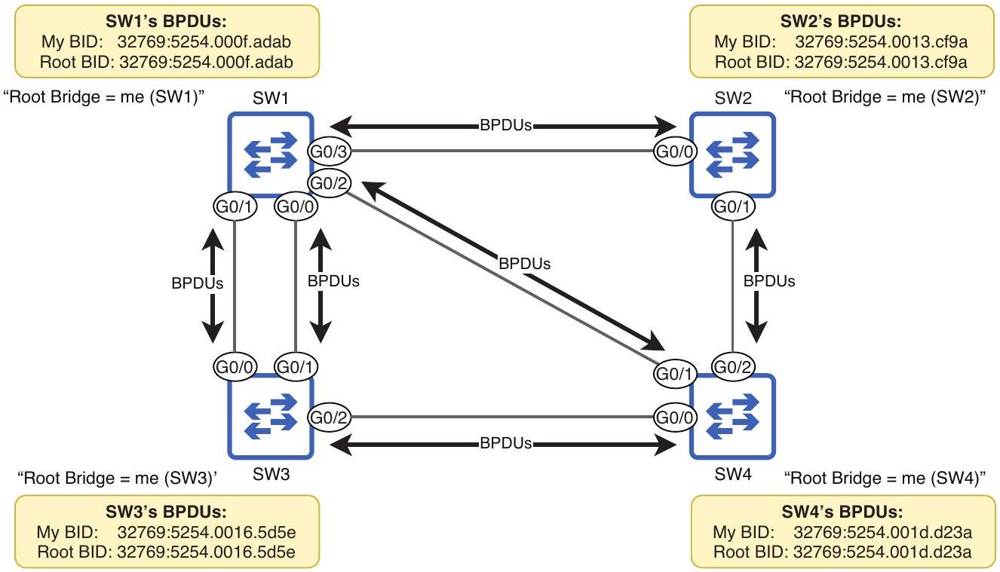
Figure 14.5 SW1, SW2, SW3, and SW4 boot up simultaneously, each switch declaring itself the root bridge. The switches send BPDUs out of their ports, containing information such as the switch's own BID and the BID of the switch it believes to be the root bridge (itself, in this case).

## The BID

The switch that sends the superior BPDU will be elected the root bridge of the LAN. The superior BPDU is the BPDU that has superior parameters according to the STP algorithm. When it comes to electing the root bridge, that means the BPDU with the numerically lowest My BID field. Before we determine which of the four switches has the lowest BID, let's examine the structure of the BID, as shown in figure 14.6. The BID is a 64-bit number that consists of a 16-bit bridge priority and a 48-bit MAC address.

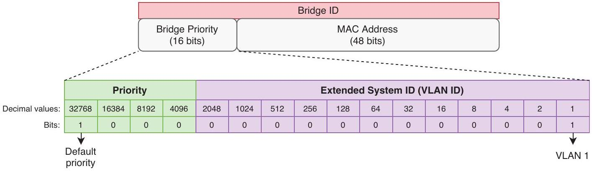
Figure 14.6 The contents of the STP BID. It is divided into two parts: a 16-bit bridge priority and a 48-bit MAC address. The bridge priority consists of two further parts: a configurable priority value (default 32768) and the Extended System ID, which is equal to the VLAN ID in Cisco's implementation of STP.

The bridge priority itself consists of two parts, the first being a configurable priority value. By default, the most significant bit is set to 1, which is equivalent to 0d32768. The second part is called the Extended System ID and is equal to the VLAN ID; these two numbers are added together to create the bridge priority (e.g., $32,768+1=32,769$ ). Before we continue with the root bridge election, let's dig deeper into the Extended System ID.

Cisco switches run a proprietary version of STP called Per-VLAN Spanning Tree Plus (PVST+). In PVST+, switches run a separate STP instance for each VLAN; they create a separate spanning tree for each VLAN. The benefit is that different links can be disabled in different VLANs, resulting in balanced traffic over all links.

NOTE Before PVST+, there was PVST, which only supported ISL encapsulation over trunk links. PVST+ supports both ISL and 802.1Q, and modern Cisco switches all run PVST+, not PVST.

If all VLANs share the same STP instance, blocked links go completely unused until an active link fails, which can lead to congestion on the active links. Figure 14.7 shows how a separate spanning tree can be made for each VLAN. The LAN has two VLANs (VLAN 1 and VLAN 2), and the switches have disabled different links in each VLAN.

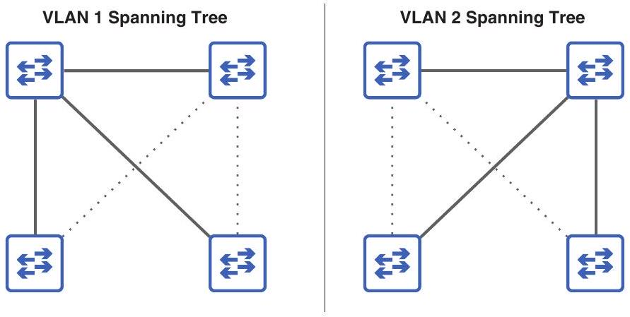
Figure 14.7 Switches in a LAN create separate spanning trees for VLANs 1 and 2 by disabling different links in each VLAN (as indicated by the dotted lines). Traffic in VLAN 1 will use different links than traffic in VLAN 2, avoiding network congestion.

Because the VLAN ID becomes part of the BID, the switch will have a unique bridge priority for each STP instance (for each VLAN running STP). For example, with the default priority of 32768, the total bridge priority will be 32769 ( 32,768 + 1) in VLAN 1 and 32770 (32,768 + 2) in VLAN 2.

NOTE For the rest of this chapter, we will focus on a single-VLAN topology. I would not expect any questions about creating a unique spanning tree for each VLAN on the CCNA exam.

## Why include the VLAN ID in the bridge priority?

The STP standard (IEEE 802.1D) specifies that each switch must have a unique BID. This is achieved by combining the bridge priority with the switch's MAC address. Even if all switches in the LAN have the same bridge priority, MAC addresses are unique, so the result is a unique BID for each switch.

However, Cisco switches running PVST+ run a separate STP instance for each VLAN. As we covered in chapter 12, each VLAN is like a separate virtual switch, so to comply with the standard, each STP instance running on the switch must have a unique BID. That's the role of the Extended System ID, which is set to the VLAN ID of the STP instance. By adding the VLAN ID to the priority value, each STP instance will have a unique bridge priority and, therefore, a unique BID.

For example, if a switch running two STP instances (VLAN 1 and VLAN 2) has the default priority value of 32768 and a MAC address 5254.000f.adab, the resulting BID would be 32769:5254.000f.adab for VLAN 1 and 32770:5254.000f.adab for VLAN 2. Note that the bridge priority is written in decimal, whereas the MAC address is written in hexadecimal (as usual), and the two are often separated by a colon, as in 32769:5254.000f. adab.

## Comparing BIDs

Now that we've covered the bridge priority (priority + VLAN ID), what is the MAC address that forms the second part of the BID? It's not the MAC of any of the switch's ports; rather, it's a separate MAC address that identifies the switch as a whole. In this section, we'll compare BIDs and see how the MAC address is used as a tiebreaker. The following are the BIDs of the four switches we saw in figure 14.5:

- SW1: 32769:5254.000f.adab
- SW2: 32769:5254.0013.cf9a
- SW3: 32769:5254.0016.5d5e
- SW4: 32769:5254.001d.d23a

Which of these BIDs is numerically lower and, therefore, superior? To compare them, first compare the bridge priorities. In this case, all four switches have the same bridge priority of 32769, so we must compare the MAC addresses to break the tie.

NOTE Although we divide the BID into multiple parts, remember that it is just a 64-bit number. The bits written on the left (those that make up the bridge priority) are the most significant, which is why you should compare them first when determining which BID is numerically lower.

When comparing MAC addresses, remember that they are just numbers written in a hexadecimal format, and comparing them is the same process you go through when comparing decimal numbers. For example, when comparing the decimal numbers 1999 and 9111, how do you know the second number is greater when it has only one 9, whereas the first number has three? The reason is the 9 in 9111 is the most significant digit; the single 9 in 9111 has a greater value $(9,000)$ than all of the other digits in 1999 combined. Just by seeing that the most significant digit of 9111 is greater than that of 1999, you can declare that 9111 is the greater of the two-no need to compare the other three digits.

The same applies when finding the greater (or lesser, in this case) of two or more MAC addresses: compare the most significant digits first. The first six digits of all four MAC addresses (the OUI) are the same: 5254.00. Then, the following digit is 1 for SW2, SW3, and SW4, but 0 for SW1, and therefore SW1 has the lowest BID of the four-it is the root bridge! We can confirm this with the show spanning-tree command on SW1, as in the following example:
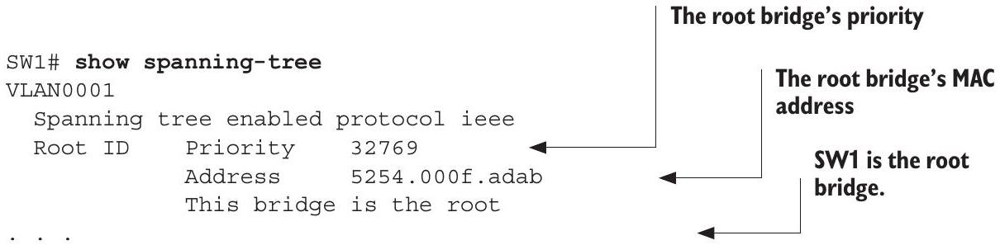

```
This switch’s priority (same as
previously because it is the root)
Bridge ID Priority 32769 (priority 32768 sys-id-ext 1)
Address 5254.000f.adab
```

This switch's MAC address (same as previously because it is the root)

## Configuring the bridge priority

As we just confirmed, SW1 is the root bridge for the LAN because it has the lowest MAC address. However, it is possible to configure the bridge priority to change which switch becomes the root bridge. This is often desirable because of the role of the root bridge; it serves as the central reference point for the spanning tree, and the other switches will ensure that their most efficient path to reach the root bridge is enabled. If a switch is connected to the router that end hosts use to access external networks, it's a good choice to be the root bridge; there should be an efficient path to reach the router without frames having to pass through too many switches.

Following the example we saw in figure 14.4, let's configure SW3 as the root bridge and lower SW4's priority so it functions as a secondary root bridge-the bridge that will take over as the root if the root bridge malfunctions (because it has the lowest BID of the remaining switches). The command to configure a switch's root priority is spanning -tree vlan vlan-id priority priority-value. In the following example, I attempt to set SW3's priority to 20000, but an error message is displayed:
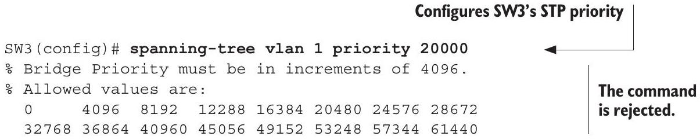
As the error message states, the priority can only be configured in increments of 4096. The reason is that although the bridge priority field as a whole is 16 bits in length, only the four most significant bits make up the configurable priority value: the bits with values of 0d32768, 0d16384, 0d8192, and 0d4096. The lesser 12 bits are fixed as the VLAN ID (VLAN 1 in our examples here). That's why the bridge priority must be configured in increments of 4096: it's the value of the least significant bit that we can change. In the following example, I configure SW3's priority as 24576 and SW4's priority as 28672 and then confirm with show spanning-tree on SW4:

```
SW3(config)# spanning-tree vlan 1 priority 24576
SW4(config)# spanning-tree vlan 1 priority 28672
SW4(config)# do show spanning-tree
VLAN0001
    Spanning tree enabled protocol ieee The priority configured on
    Root ID Priority 24577 ← \
```

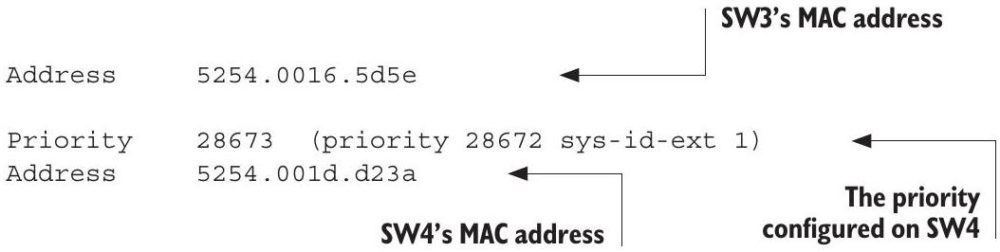
Figure 14.8 After configuring SW3's priority to 24576 (+1 for VLAN 1), all four switches agree that SW3 is the root bridge because it has the lowest BID. All ports on the root bridge are designated ports (indicated by D). If SW3 malfunctions and a new election is held, SW4 will become the new root bridge because it has the second-lowest BID.

Figure 14.8 shows the result after configuring the bridge priorities of SW3 and SW4. All four switches agree that SW3 is the root bridge. SW4 has a lower BID than SW1 and SW2, but it is not the root bridge yet; that would only happen if SW3 malfunctions and a new root bridge election is held.

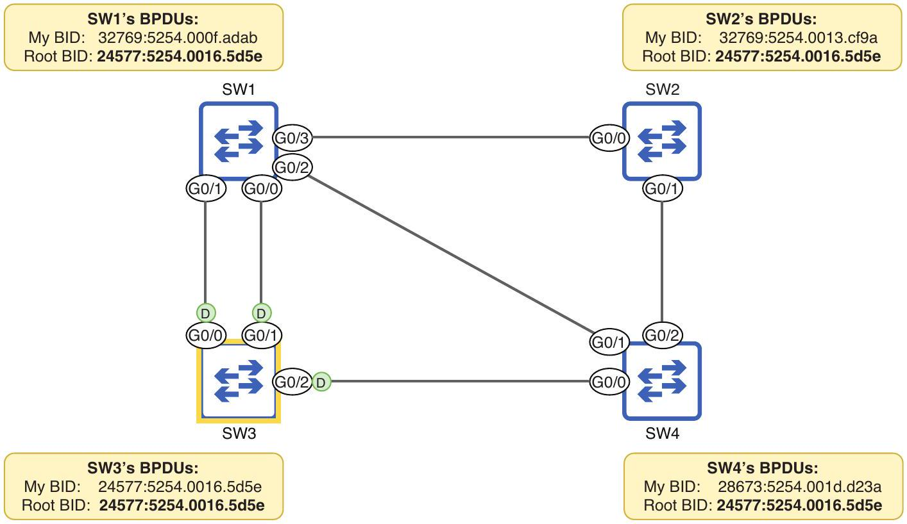
Figure 14.8 After configuring SW3's priority to 24576 (+1 for VLAN 1), all four switches agree that SW3 is the root bridge because it has the lowest BID. All ports on the root bridge are designated ports (indicated by D). If SW3 malfunctions and a new election is held, SW4 will become the new root bridge because it has the second-lowest BID.

NOTE All ports on the root bridge are designated ports, meaning they are in the forwarding state (not the blocking state). We will examine designated ports further in section 14.3.3.

There is one more method to configure the bridge priority that you should know for the CCNA exam: the spanning-tree vlan vlan-id root \{primary | secondary\} command. The secondary keyword is simple: it sets the priority to 28672 (one
increment of 4096 under the default of 32768). The primary keyword, on the other hand, works like this:

- Set the priority to 24576 (two increments of 4096 under the default).
- Or, if 24576 isn't sufficient to make the switch become the root bridge (i.e., the current root bridge's priority is 24576), set the priority to the highest multiple of 4096 that will make the switch the root bridge.

These commands will serve their purpose if all other switches in the LAN have the default priority of 32768; the switch configured with the primary keyword will be the root bridge, and the switch configured with the secondary keyword will be next in line if the root bridge fails.

However, using these commands is not recommended. There are a couple of reasons: first, there's no guarantee that configuring this command with the secondary keyword will make the switch the next in line to become the root bridge if the current root bridge fails; another non-root switch could have a priority value lower than 28672. Likewise, there are situations where this command with the primary keyword will fail: it cannot set the switch's priority to 0 . The following example shows what happens when the current root bridge (SW1) has a priority of 4096, and you use this command with the primary keyword on another switch (SW2):

```
Sets SW1's
Sets SW1's
priority to 4096
priority to 4096
The command
The command
fails on SW2.
fails on SW2.
% Failed to make the bridge root tor van 1
% It may be possible to make the bridge root by setting the priority
% for some (or all) of these instances to zero.
```

EXAM TIP The best way to ensure that a switch will be the root bridge is to use the spanning-tree vlan vlan-id priority 0 command. Then, the only way to usurp the root is to use the same command on another switch that has a lower MAC address (and, therefore, a lower BID). Remember this point for the exam!

### 14.3.2 Root port selection

After electing the root bridge, each non-root switch will select one of its ports as its root port-the port with the best path to the root bridge. The switch calculates this based on information in the BPDUs it receives from its neighbors. The root port is selected using a few parameters: the root cost (which measures the port's proximity to the root bridge), the neighbor's BID, and the neighbor's port ID, in that order of priority:

1 Lowest root cost
2 Lowest neighbor BID
3 Lowest neighbor port ID

A port's root cost is a value that indicates how efficient the path to the root bridge is via that port; a lower value is better. Each port has a given cost value associated with it, as shown in table 14.1.

Table 14.1 STP port cost values
| Speed | Cost |
| :--- | :--- |
| 10 Mbps | 100 |
| 100 Mbps | 19 |
| 1 Gbps | 4 |
| 10 Gbps | 2 |


A port's root cost is the total cost of the ports leading toward the root bridge (not just the cost of the individual port), and the port with the lowest root cost will become the root port. If there are multiple ports on the switch with the same root cost, the port connected to the neighbor with the lowest BID will become the root port. If two or more ports have the same root cost and are connected to the same neighbor, the port connected to the port on the neighbor switch with the lowest port ID will become the root port. Figure 14.9 shows which port each non-root switch selects as its root port and how it comes to that decision. In the rest of this section, we will go through each switch's decision step by step.

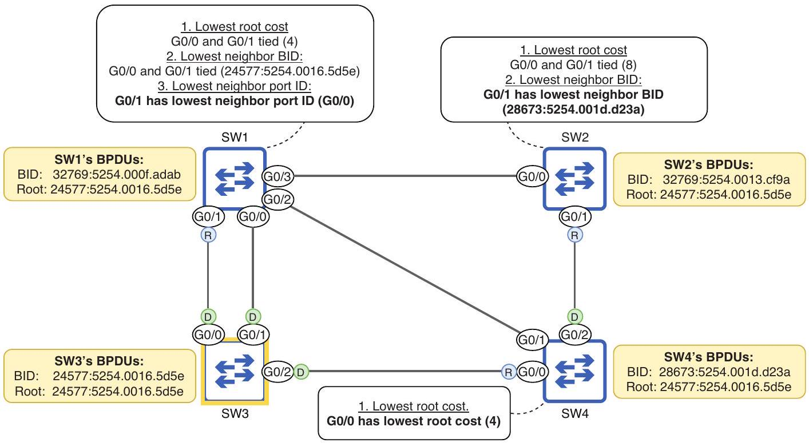
Figure 14.9 Non-root switches each select one root port. SW4 selects G0/0 because it has the lowest root cost of its ports. SW2 GO/0 and G0/1 have the same root cost, so SW2 selects G0/1 because it has the lowest neighbor BID. SW1 G0/0 and G0/1 have the same root cost and neighbor BID, so SW1 selects G0/1 because it has the lowest neighbor port ID.

## Lowest ROOT COST

As I've mentioned a couple of times already, the decisions that make up the STP algorithm are all based on information in the BPDUs passed among the switches. Once the root bridge has been decided, it is the only switch that generates new BPDUs; other switches receive those BPDUs and forward them to their neighbors, updating some information in the BPDUs. One of the pieces of information in a BPDU is the root cost. The BPDUs sent by the root bridge all have a cost of 0 (the root bridge's cost to reach itself is 0). When non-root switches forward those BPDUs, they add the cost of the port they received the BPDUs on.

Figure 14.10 demonstrates how switches advertise their root cost to each other and each switch's logic in selecting its root port. Only SW4 is able to do so at this step. SW3 (the root bridge) sends BPDUs with a root cost of 0 . When SW1 and SW4 forward those BPDUs, they add the cost of the ports on which they received those BPDUs; in this case, all ports are GigabitEthernet ports, so they have a cost of 4 . When SW2 forwards the BPDUs it receives from SW1 and SW4, it adds its own ports' cost (4) to the cost of the BPDUs it received (4); it advertises a cost of 8.

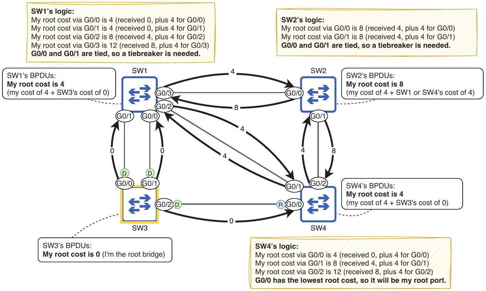
Figure 14.10 Switches advertise their root cost to each other in BPDUs. SW3 (the root bridge) advertises a root cost of 0, SW1 and SW4 advertise a root cost of 4, and SW2 advertises a root cost of 8. SW4 selects G0/0 as its root port because it has the lowest root cost of its three ports. SW1 and SW2 are unable to select a root port based on root cost alone; a tiebreaker is needed.

Although SW4 is able to determine its root port based only on root cost, SW1 and SW2 cannot; SW1 has a root cost of 4 via both its G0/0 and G0/1 ports, and SW2 has a root
cost of 8 via both its G0/0 and G0/1 ports. For SW1 and SW2 to select their root ports, they must proceed to the next step in the selection process: the lowest neighbor BID.

## Lowest neighbor bridge ID

When a switch sends BPDUs, one of the pieces of information it includes is its own BID. This can then be used by the receiving switch as a tiebreaker when deciding its root port. The port connected to the neighbor with the lowest BID will become the switch's root port. Figure 14.11 shows how SW1 and SW2 compare their neighbors' BIDs to decide their root ports; SW2 is able to select G0/1, but SW1 is not yet able to select a root port.

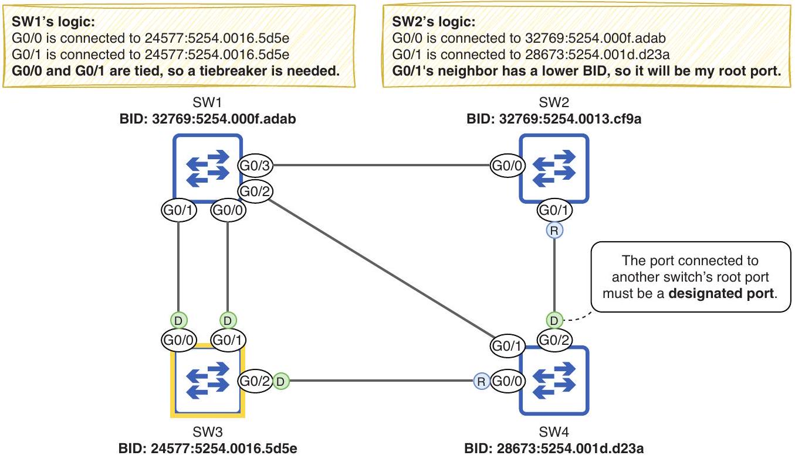
Figure 14.11 SW1 compares the neighbor BID of its G0/0 and G0/1 ports, and SW2 compares the neighbor BID of its G0/0 and G0/1 ports. SW2 G0/1's neighbor (SW4) has a lower BID than SW2 G0/0's neighbor (SW1), so SW2 selects G0/1 as its root port. SW1's G0/0 and G0/1 ports are both connected to SW3, so they both have the same neighbor BID; SW1 is unable to select a root port at this point.

NOTE The port connected to another switch's root port must be a designated port (forwarding). The root port provides the switch's single path to the root bridge, so its neighbor must not block the link.

## Lowest neighbor port ID

Another piece of information included in an STP BPDU is the port ID of the port that sent the BPDU. This is used as the final tiebreaker when selecting the root port. It's worth emphasizing that when using the port ID as a tiebreaker, it's the neighbor's port IDs that count-not the local switch's port ID. When deciding SW1's root port, we have to compare the port IDs of SW3's ports that are connected to SW1.

The port ID is a unique identifier for each port of the switch; like the BID, it consists of a configurable priority value (128 by default) and a sequential number (1 for the first port, 2 for the second port, etc). In the following example, I use show spanning-tree on SW3 to check the IDs of its G0/0 and G0/1 ports (in the Prio.Nbr column):

```
SW3# show spanning-tree
. . .
Interface Role Sts Cost Prio.Nbr Type
Gi0/0
Gi0/1
Gi0/2
```

| Desg FWD 4 | 128.1 | P2p | 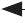 |  |
| :--- | :--- | :--- | :--- | :--- |
| Desg FWD 4 | 128.2 | P2p |  |  |
| Desg FWD 4 | 128.3 | P2p |  |  |
| SW3 GO/1's port ID is 128.2. |  |  |  |  |

NOTE To influence root port selection, you can configure a port's priority value (the first part of the port ID) with the spanning-tree vlan vlan-id port-priority priority-value in interface config mode. However, I would not expect any questions about this on the CCNA exam. Generally, you can just compare the ports' names to decide which has a lower port ID. G0/0 is lower than $\mathrm{G} 0 / 1$ ( 0 is lower than 1 ), so it has a lower port ID.

Figure 14.12 shows how SW1 selects its root port. SW1 G0/0 is connected to SW3 G0/1 (port ID 128.2), and SW1 G0/1 is connected to SW3 G0/0 (port ID 128.1). Because the neighbor port ID of G0/1 is lower, SW1 selects G0/1 as its root port.

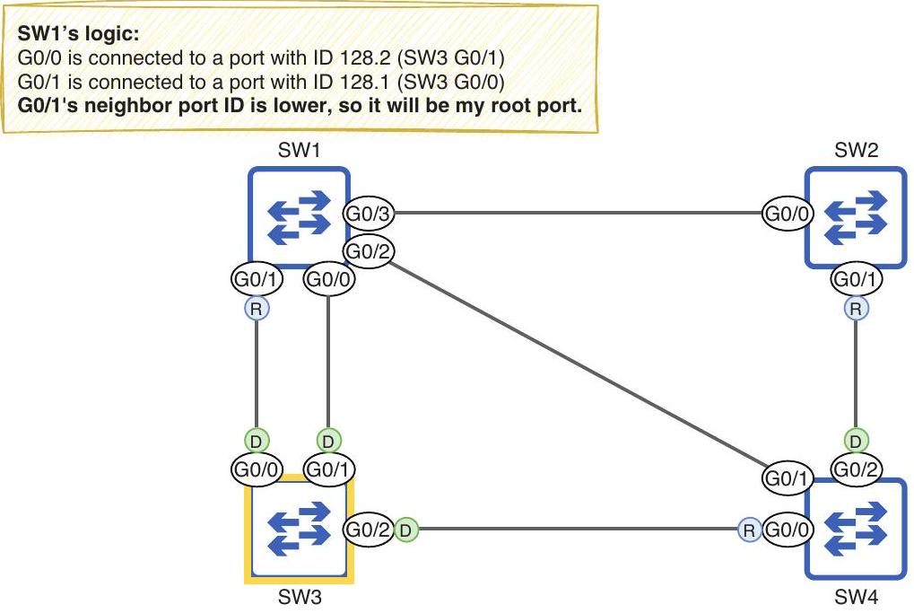
Figure 14.12 SW1 compares the neighbor port IDs of its GO/0 and G0/1 ports. G0/1 is connected to a lower port ID (SW3 GO/0, port ID 128.1) than G0/0 (SW3 G0/1, port ID 128.2), so G0/1 selects G0/1 as its root port.

EXAM TIP Remember that you're comparing the neighbor's port IDs, not the local switch's port IDs; that's a potential trick question on the exam!

### 14.3.3 Designated port selection

Now that each non-root switch has selected a root port, the final step is to select designated ports. Whereas a root port is a port in the forwarding state that points toward the root bridge, a designated port is a port in the forwarding state that points away from the root bridge. That's why every port on the root bridge is a designated port-they all point away from the root bridge.

There must be exactly one designated port for each segment in the LAN. The exact meaning of the term segment can vary, but in this case, a segment is a link between switches. Designated ports are selected using the following parameters (in order of priority):

1 The port on the switch with the lowest root cost becomes designated.
2 The port on the switch with the lowest BID becomes designated.

## What is a segment?

A segment is a division of a network, the extent of which depends on the context. A Layer 1 segment can be defined as an electrical connection between devices and is equivalent to a collision domain; this is the meaning of segment as used in this chapter. Two connected switches are another example of a Layer-1 segment. Another example is a group of devices connected to an Ethernet hub; an electrical signal sent by one device is received by all other devices connected to the hub.

A Layer 2 segment is equivalent to a LAN or broadcast domain-a group of devices that can send frames directly to each other. If a physical LAN is divided into multiple VLANs, each VLAN is its own Layer 2 segment. A Layer 3 segment is equivalent to a subnet. As I mentioned in chapter 12 (VLANs), Layer 2 and Layer 3 segments usually have a oneto-one relationship (one subnet per VLAN), but it is possible for a single VLAN to include multiple subnets.

In electing the root bridge and selecting a root port for each switch, we were already able to identify some designated ports in the LAN: all ports on the root bridge are designated, and all ports connected to a root port are designated. For each remaining segment, there must be one designated port, and the other ports must be non-designated. Non-designated ports are in the blocking state; this is how STP prevents loops.

First, SW1 G0/0 is connected to SW3 G0/1 (a designated port) and is, therefore, a non-designated port; there can only be one designated port per segment. That leaves two segments remaining: the SW1 G0/2 to SW4 G0/1 link and the SW1 G0/3 to SW2

G0/0 link. Figure 14.13 shows which ports will be designated and non-designated, and how those decisions were made. In the rest of this section, we will go through the process step by step.

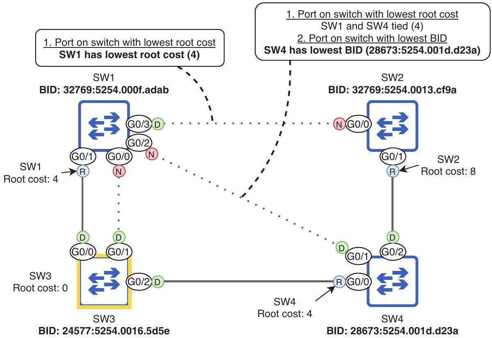
Figure 14.13 Each segment must have exactly one designated port. All ports on the root bridge are designated, and so are all ports connected to a root port. One designated port is selected on each remaining segment, and the remaining ports are non-designated.

## Port on the switch with lowest root cost

The first parameter used to decide which side of the remaining links becomes designated is root cost: the port on the switch with the lowest root cost becomes designated, and the other port becomes non-designated. Pay attention to the wording: it's "the port on the switch with the lowest root cost becomes designated," not "the port with the lowest root cost becomes designated." We are comparing the root cost of each switch via its root port, not the cost of each port whose role is being decided.

Figure 14.14 shows how the switches compare their root costs to decide which port becomes designated. SW1's root cost (4) is lower than SW2's root cost (8), so SW1's port becomes designated, and SW2's becomes non-designated. SW1 and SW4 have the same root cost (4) and, therefore, will have to use a tiebreaker to decide which port becomes designated.

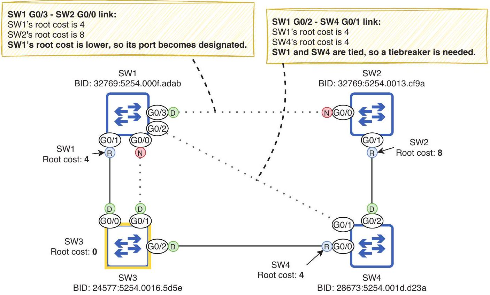
Figure 14.14 Switches compare their root costs to select designated ports. SW1's root cost (4) is lower than SW2's (8), so SW1 G0/3 becomes designated, and SW2 G0/0 becomes non-designated. SW1 and SW4 have the same root cost (4), so a tiebreaker is needed to decide which port becomes designated.

## Port on switch with lowest bridge id

As a tiebreaker to decide which port becomes designated, the switches will compare their BIDs; the port on the switch with the lowest BID will become designated, and the port on the other switch will become non-designated. Figure 14.15 shows how SW1 and SW4 compare BIDs to decide which switch's port becomes designated; SW4's BID is lower than SW1's, so SW4 G0/1 becomes designated, and SW1 G0/2 becomes non-designated.

All port roles have now been decided: root, designated, and non-designated. Note that BPDUs are only sent out of designated ports. When a switch first boots up, it believes it is the root bridge, so all of its ports are designated; the switch sends BPDUs out of all its ports. However, if it then becomes a non-root switch and some of its ports transition to other roles (root or non-designated), the switch does not send BPDUs out of those ports. BPDUs originate from the root bridge and are forwarded throughout the LAN via designated ports only. To summarize this section, here is a summary of the STP algorithm:

1 Root bridge election (one per LAN)
    - Lowest BID
2 Root port selection (one per switch, excluding root bridge)

- Lowest root cost
- Lowest neighbor BID
- Lowest neighbor port ID
3 Designated port selection (one per segment)
    - Port on the switch with the lowest root cost
    - Port on the switch with the lowest BID

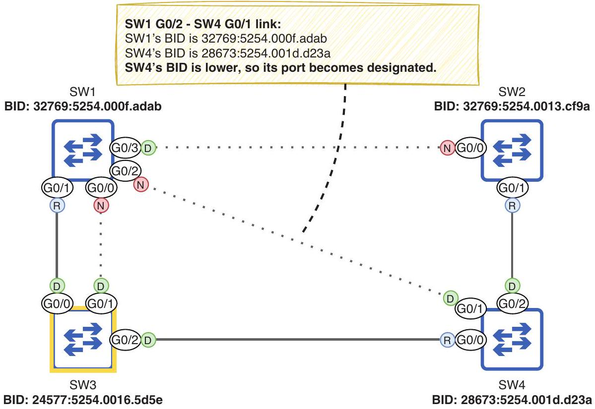
Figure 14.15 Switches compare their BIDs as a tiebreaker when selecting designated ports. SW4's BID (28673:5254.001d.d23a) is lower than SW1's BID (32769:5254.000f.adab), so SW4 GO/1 becomes designated, and SW1 G0/2 becomes non-designated.

### 14.4 STP port states and timers

In section 14.3, we covered root, designated, and non-designated ports; these are the STP port roles. In addition to the three roles, there are multiple port states. I already mentioned two of them: the forwarding state and the blocking state.

In the forwarding state, the port is active and can forward and receive frames. In a stable LAN, root and designated ports should be in the forwarding state. In the blocking state, the port is disabled and cannot forward or receive frames; non-designated ports should be in the blocking state. However, there are some other transitional states that a port goes through in preparation to forward frames, as well as some timers that govern how long the port spends in each state.

### 14.4.1 STP port states

There are four main STP port states: blocking, listening, learning, and forwarding. You might also hear of a fifth state: disabled. This refers to a port that isn't operational-for example, if it is disabled with the shutdown command or isn't connected to another device; STP isn't active on such a port, so it's usually not included as an STP port state. Table 14.2 summarizes the four main states that we will examine in this section.

Table 14.2 STP port states
| State | Forward frames? | Learn MAC addresses? | Stable or transitional? |
| :--- | :--- | :--- | :--- |
| Blocking (BLK) | No | No | Stable (non-designated) |
| Listening (LIS) | No | No | Transitional |
| Learning (LRN) | No | Yes | Transitional |
| Forwarding (FWD) | Yes | Yes | Stable (root, designated) |


When a port is first enabled (e.g., when it is connected to another device), it will enter the listening state. In this state, the port can only send and receive STP BPDUs; it does not forward any regular data frames, and the switch does not learn any MAC addresses if frames arrive on the port. The point of this state is to decide what's going to happen with the port; the switch decides if it will be a root, designated, or non-designated port. The listening state is transitional; the port should remain in the state for a maximum of 15 seconds (we'll see why 15 seconds is the maximum in section 14.4.2). In the following example, I disable SW2's G0/1 port, reenable it, and then confirm its state with show spanning-tree; LIS in the Sts column indicates the listening state:


NOTE In the previous output, G0/0's role is Altn, meaning alternate; this is equivalent to the non-designated role. Alternate is a port role introduced in Rapid STP, which we'll cover in chapter 15; the terminology is now used even with a switch running standard STP.

If the port becomes a non-designated port, it will immediately transition to the blocking state. In this state, the port is effectively disabled; it does not forward frames. Its only job is to listen for BPDUs and react if there is a change in the network. Note that its status will still be up/up in the output of show ip interface brief; the port is still operational and ready to transition to the listening state if there is a change in the network. However, in the output of show spanning-tree, its status will be BLK (as in the previous output).

If it is decided in the listening state that the port will be a root or designated port, after 15 seconds, it will transition to the learning state. This state is similar to the listening state, with one difference: it will start learning MAC addresses when it receives frames. The purpose of this state is to prepare the port to start forwarding traffic; like the listening state, it is transitional.

NOTE A port in the learning state continues listening for BPDUs. If it senses a change in the network and changes its role to become a non-designated port, it will immediately transition to the blocking state.

After being in the learning state for 15 seconds, a root or designated port will finally transition to the forwarding state-a fully operational switch port capable of forwarding traffic. Figure 14.16 shows how a port transitions between the four states.


Figure 14.16 How a switch port transitions through the STP port states. A newly enabled port begins in the listening state and then either transitions to the blocking or learning state and then the forwarding state. A port in any state can transition immediately to blocking, but for a port to transition to the forwarding state, it must transition through the listening and learning states.

Once all switches in the network have decided their ports' roles and all ports are in a blocking or forwarding state, the STP has converged; the LAN is stable. If there are changes to the network (e.g., ports failing, ports being disabled, new switches being added, etc.), the switches will use STP to recalculate the topology, and the network will reconverge in a new, stable topology.

### 14.4.2 STP timers

There are three timers that govern how STP operates, as summarized in table 14.3.

Table 14.3 STP timers
| Timer | Purpose | Duration |
| :--- | :--- | :--- |
| Hello | How often BPDUs are sent | 2 seconds |
| Forward delay | The length of the listening and learning states | 15 seconds (per state) |
| Max age | How long a switch will wait to change the STP topology after ceasing to receive BPDUs on a port | 20 seconds |


The hello timer is simple: it determines how often BPDUs are sent. By default, it is 2 seconds, meaning BPDUs are sent every 2 seconds. The hello timer of the root bridge dictates how often BPDUs are sent in the LAN; all BPDUs originate from the root bridge and are then forwarded by the other switches out of their designated ports. This applies to the other timers too; the timers of the root bridge are used by all switches in the LAN.

NOTE The hello timer (and the other timers) can be modified, but it is rare to do so, and it is beyond the scope of the CCNA exam.

The forward delay timer determines the length of the listening and learning states. By default, it is 15 seconds; the listening state is 15 seconds, and the learning state is 15 seconds. This means that a newly enabled port will take a total of 30 seconds before it is able to forward frames (except BPDUs).

In a LAN with redundant connections, it's very important that loops don't occur-a loop can bring down a LAN in a matter of seconds-so each switch port spends a certain amount of time in each state before transitioning to another state. This allows the switch to be absolutely sure it won't cause a loop by transitioning a port to the forwarding state.

The final timer is the max age timer; it determines how long a switch will wait to change the STP topology after ceasing to receive BPDUs on a port. By default, the max age timer is 20 seconds; with the default hello timer of 2 seconds, it means a port can miss 10 BPDUs before the switch decides it should recalculate the STP topology (i.e., elect a new root bridge, recalculate port roles, etc.).

This means it can take STP up to 50 seconds to move a blocking port into the forwarding state: 20 seconds for the max age timer, 15 seconds for the listening state, and 15 seconds for the learning state. Figure 14.17 shows an example of how this can cause a problem: a hardware failure (perhaps on SW3's G0/0 port) causes SW1 to stop receiving BPDUs on G0/1, but it takes 50 seconds before SW1 G0/0 can take over as the root port and start forwarding traffic.


Figure 14.17 STP's timers cause SW1 to be unable to forward traffic for 50 seconds. (1) A hardware failure prevents SW1 from receiving BPDUs on GO/1. (2) GO/1 remains the root port for 20 seconds. (3) G0/0 becomes the new root port but must wait an additional 30 seconds before entering a forwarding state.

NOTE If the hardware failure causes SW1's G0/1 port to become totally nonoperational (down/down state), SW1 will react immediately-no need to wait for the max age timer. However, SW1's new root port (G0/0) will still have to transition through the listening and learning states, resulting in 30 seconds of downtime.

Although STP's timers can be slow, it's for a good reason: to make sure a port doesn't start forwarding prematurely and cause a Layer 2 loop. However, there are several features that improve STP's speed, and we'll cover one in section 14.5, which discusses PortFast and the related BPDU Guard. Furthermore, in chapter 15, we'll cover Rapid STP, an evolution of STP that greatly reduces the amount of time required for STP convergence.

### 14.5 PortFast and BPDU Guard

Cisco switches include a suite of optional STP features (sometimes called the STP toolkit) that can speed up STP's convergence and improve stability. For the CCNA exam, you need to know a few of these optional STP features. In this section, we'll cover two: PortFast and BPDU Guard.

So far, we have focused on connections between switches, but STP is active on all switch ports-not just those connected to other switches. Switch ports connected to devices that do not use STP (such as PCs) will always be designated ports; there is no risk of a Layer 2 loop. However, due to STP's timer-based operation, it will take 30 seconds after connecting a device before the device can actually access the network-before the switch port enters the forwarding state. This can be frustrating for users who aren't aware of STP, and it is an inconvenience in any case.

### 14.5.1 PortFast

PortFast is an optional STP feature that allows a switch port to move immediately to the forwarding state, bypassing the listening and learning states. Figure 14.18 shows how PortFast allows a connected device to access the network immediately.

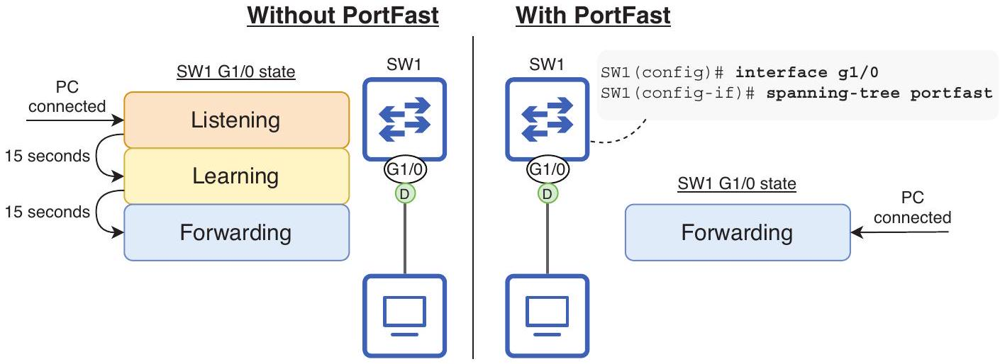
Figure 14.18 PortFast allows a switch port to immediately move to the forwarding state. Without PortFast, when an end host is connected to a switch port, it must wait 30 seconds before it can access the network. With PortFast, the end host can access the network immediately, bypassing the listening and learning states.

To enable PortFast on a specific port, use the spanning-tree portfast command in interface config mode. Another option is to use the spanning-tree portfast default command in global config mode to enable PortFast on all access ports (not trunk ports). As the following example shows, the switch displays a lengthy warning after configuring PortFast:

```
SW1(config)# interface g1/0
SW1(config-if) # spanning-tree portfast
%Warning: portfast should only be enabled on ports connected to a single
    host. Connecting hubs, concentrators, switches, bridges, etc... to this
    interface when portfast is enabled, can cause temporary bridging loops.
    Use with CAUTION
%Portfast has been configured on GigabitEthernet1/0 but will only
    have effect when the interface is in a non-trunking mode.
```

A warning message is displayed.

Because PortFast puts switch ports in the forwarding state immediately, bypassing the listening and learning states, it is important that you enable it only on ports intended for end hosts. Do not connect switches to PortFast-enabled ports; otherwise, Layer 2 loops can occur, as stated in the warning message in the previous example.

### 14.5.2 BPDU Guard

BPDU Guard is another optional STP feature that disables a switch port if it receives a BPDU; it should be enabled on all PortFast-enabled ports. Remember, PortFast-enabled
ports should only connect to end hosts, which do not send BPDUs. If a user carelessly connects another switch to a port meant for end hosts, BPDU Guard disables the port and prevents the newly connected switch from affecting the STP topology (e.g., by becoming the new root bridge).

To enable BPDU Guard on a port, use the spanning-tree bpduguard enable command in interface config mode. Another option is to use the spanning-tree portfast bpduguard default command in global config mode; this automatically enables BPDU Guard on all PortFast-enabled ports. In the following example, I enable PortFast and BPDU Guard on a switch port:

```
SW4(config)# interface g0/0
SW4(config-if) # spanning-tree portfast
SW4(config-if) # spanning-tree bpduguard enable
```

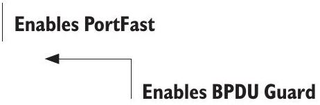
The port I enabled PortFast and BPDU Guard on in the example is connected to another switch, so we can see BPDU Guard in action-don't do this in a real network! If a switch port with BPDU Guard enabled receives a BPDU from another switch, it enters an error-disabled state. The following example shows the error messages displayed when BPDU Guard disables a port:

```
%SPANTREE-2-BLOCK_BPDUGUARD: Received BPDU on port GiO/O
-with BPDU Guard enabled. Disabling port.
%PM-4-ERR_DISABLE: bpduguard error detected on Gi0/0,
-putting Gi0/0 in err-disable state
```

An error-disabled port is nonoperational; its status will be down/down in the output of show ip interface brief. This is an example of the STP disabled state I mentioned in section 14.4. To reenable an error-disabled port, first solve the problem that caused the error (disconnect the switch from the PortFast/BPDU Guard-enabled port), and then use the shutdown and no shutdown commands on the port to reset it.

EXAM TIP Remember these best practices: only enable PortFast on ports meant for end hosts, and enable BPDU Guard on all PortFast-enabled ports. It is possible to use only PortFast or only BPDU Guard, but best practice is to use both features together.

## Summary

- The Ethernet header does not have a mechanism to drop looping frames, so they will loop indefinitely.
- If enough looping frames accumulate, a broadcast storm can occur, using up so many network resources that the network becomes unusable.
- Redundancy is the practice of having additional network devices and connections beyond the minimum necessary for communication to eliminate single points of failure.

- Layer 2 loops occur as a result of the flooding of BUM traffic-broadcast, unknown unicast, and multicast frames-in a LAN with redundant connections.
- Spanning Tree Protocol (STP) prevents Layer 2 loops in a LAN by blocking redundant connections, leaving only one active path to each destination in the LAN.
- The process STP uses to create a loop-free topology is called the STP algorithm. It consists of three main steps: (1) root bridge election, (2) root port selection, and (3) designated port selection.
- All of the decisions in the algorithm are made by switches sharing STP Bridge Protocol Data Unit (BPDU) messages, which are sent every 2 seconds.
- The root bridge is the central point of reference for the STP topology. All switches in the LAN will ensure they have exactly one active path to the root bridge.
- The switch with the lowest bridge ID (BID) becomes the root bridge. The BID is a 64-bit number that uniquely identifies the switch. It consists of a 16-bit bridge priority and a 48-bit MAC address.
- The bridge priority consists of a configurable priority value (default 32768) and the Extended System ID, which is the VLAN ID.
- Cisco's implementation of STP is called Per-VLAN Spanning Tree Plus (PVST+), which creates a separate spanning tree for each VLAN.
- When a switch boots up, it announces itself as the root bridge and sends BPDUs out of all ports. If it receives BPDUs from a switch with a lower BID, it will accept that switch as the root bridge.
- Use the show spanning-tree command to view information about the root bridge's BID, the local switch's BID, and the local switch's ports.
- Use the spanning-tree vlan vlan-id priority priority-value command to configure the switch's priority for the specified VLAN (in increments of 4096).
- You can also use spanning-tree vlan vlan-id root \{primary | secondary\} to configure the priority. The secondary keyword sets the priority to 28672, and the primary keyword sets the priority to 24576, or the highest multiple of 4096 that will make the switch the root bridge (but it won't set the priority to 0).
- After electing the root bridge, all non-root switches will select exactly one root port, which provides the switch's single active path to the root bridge.
- The root port is selected using the following parameters in order of priority: (1) lowest root cost, (2) lowest neighbor BID, and (3) lowest neighbor port ID.
- A port's root cost indicates how efficient the path to the root bridge is via that port.
- When the root bridge sends BPDUs, they have a root cost of 0. When a non-root switch forwards BPDUs, it adds the cost of the port it received the BPDU on.
- The STP port cost values are $10 \mathrm{Mbps}=100,100 \mathrm{Mbps}=19,1 \mathrm{Gbps}=4$, and $10 \mathrm{Gbps}=2$.
- If a switch has the same root cost via two or more ports, the port connected to the neighbor with the lowest BID becomes the root port. If two or more of those

ports are connected to the same neighbor, the port connected to the neighbor's port with the lowest port ID becomes the root port.
- The port ID is a unique identifier for each port of the switch. It consists of a priority value (128 by default) and a sequential number.
- Each segment (link) must have exactly one designated port. All ports on the root bridge are designated, and the port connected to a root port must be designated.
- The remaining links then select one designated port, and the rest of the ports will be non-designated (blocking).
- Designated ports are selected with the following parameters in order of priority: (1) the port on the switch with the lowest root cost and (2) the port on the switch with the lowest BID.
- The four STP port states are blocking, listening, learning, and forwarding. There is also the disabled state, which refers to a nonoperational port.
- A newly enabled port will enter the listening state, where the switch decides its role.
- If the port becomes non-designated, it will immediately move to the blocking state, in which it is effectively disabled (this is how STP prevents loops).
- If the port becomes root or designated, it will move to the learning state, in which it starts to learn MAC addresses to build the MAC address table. Then, it will move to the forwarding state, where it can finally forward frames.
- The hello timer determines how often BPDUs are sent. It is 2 seconds by default.
- The forward delay timer determines the length of the listening and learning states. It is 15 seconds (per state) by default.
- The max age timer determines how long a switch will wait to change the STP topology after ceasing to receive BPDUs on a port.
- The timers on the root bridge dictate the timers that will be used on all switches in the LAN.
- It can take up to 50 seconds (max age timer + listening state + learning state) for a port to start forwarding after a change in the network.
- It can take 30 seconds for a newly enabled port to start forwarding frames.
- PortFast is an optional feature that can be configured on ports connected to end hosts to allow them to move directly to the forwarding state (no listening/ learning).
- Use the spanning-tree portfast command in interface config mode to enable PortFast on a specific port or the spanning-tree portfast default command in global config mode to enable PortFast on all access ports.
- BPDU Guard should be configured on PortFast-enabled ports to disable them in case another switch is connected to the port.
- Use the spanning-tree bpduguard enable command in interface config mode to enable BPDU Guard on a specific port or the spanning-tree portfast

bpduguard default command in global config mode to enable it on all Port-Fast-enabled ports.
- If a BPDU Guard-enabled port receives a BPDU, the port will enter an errordisabled state, rendering it nonoperational. To reenable the port, disconnect the switch that caused the error and use shutdown and no shutdown on the port.
