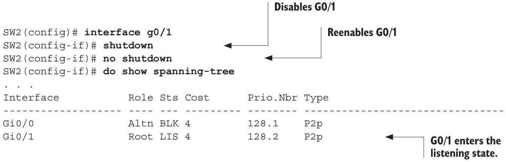
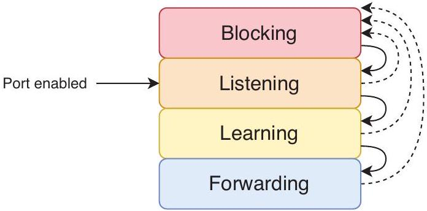
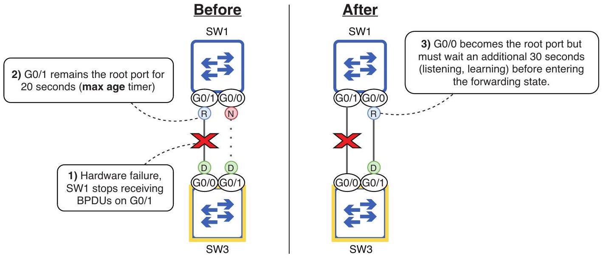

# Chapter 14.4 - STP port states and timers

In section 14.3, we covered root, designated, and non-designated ports; these are the STP port roles. In addition to the three roles, there are multiple port states. I already mentioned two of them: the forwarding state and the blocking state.

> [!translation] 逐句繁體中文翻譯
> - 在 14.3 節中，我們介紹了根port、指定port和非指定port；這些是 STP port角色。
> - 除了三種角色外，還有多種port狀態。
> - 我已經提到了其中兩個：轉送狀態和阻斷狀態。

In the forwarding state, the port is active and can forward and receive frames. In a stable LAN, root and designated ports should be in the forwarding state. In the blocking state, the port is disabled and cannot forward or receive frames; non-designated ports should be in the blocking state. However, there are some other transitional states that a port goes through in preparation to forward frames, as well as some timers that govern how long the port spends in each state.

> [!translation] 逐句繁體中文翻譯
> - 在轉送狀態下，port處於活動狀態，可以轉送和接收frame。
> - 在穩定的 LAN 中，根port和指定port應處於轉送狀態。
> - 在阻塞狀態下，port被停用，無法轉送或接收frame；非指定port應處於阻塞狀態。
> - 但是，port在準備轉送frame時會經歷一些其他過渡狀態，以及一些控制port在每個狀態中花費多長時間的計時器。

### 14.4.1 STP port states

There are four main STP port states: blocking, listening, learning, and forwarding. You might also hear of a fifth state: disabled. This refers to a port that isn't operational-for example, if it is disabled with the shutdown command or isn't connected to another device; STP isn't active on such a port, so it's usually not included as an STP port state. Table 14.2 summarizes the four main states that we will examine in this section.

> [!translation] 逐句繁體中文翻譯
> - STP port狀態主要有四種：阻塞、監聽、學習和轉送。
> - 您可能也聽過第五種狀態：停用。
> - 這是指無法運作的port，例如，如果使用 shutdown 命令停用該port或未連接到其他設備； STP 在此類port 上不處於活動狀態，因此通常不包含在 STP port狀態中。
> - 表 14.2 總結了我們將在本節中研究的四種主要狀態。

Table 14.2 STP port states
| State | Forward frames? | Learn MAC addresses? | Stable or transitional? |
| :--- | :--- | :--- | :--- |
| Blocking (BLK) | No | No | Stable (non-designated) |
| Listening (LIS) | No | No | Transitional |
| Learning (LRN) | No | Yes | Transitional |
| Forwarding (FWD) | Yes | Yes | Stable (root, designated) |

When a port is first enabled (e.g., when it is connected to another device), it will enter the listening state. In this state, the port can only send and receive STP BPDUs; it does not forward any regular data frames, and the switch does not learn any MAC addresses if frames arrive on the port. The point of this state is to decide what's going to happen with the port; the switch decides if it will be a root, designated, or non-designated port. The listening state is transitional; the port should remain in the state for a maximum of 15 seconds (we'll see why 15 seconds is the maximum in section 14.4.2). In the following example, I disable SW2's G0/1 port, reenable it, and then confirm its state with show spanning-tree; LIS in the Sts column indicates the listening state:

> [!translation] 逐句繁體中文翻譯
> - 當port首次啟用時（例如，當它連接到另一個裝置時），它將進入監聽狀態。
> - 在該狀態下，port只能發送和接收STP BPDU；它不會轉送任何常規資料frame，並且如果frame到達端口，switch也不會學習任何 MAC address。
> - 此狀態的要點是決定port將發生什麼；switch決定它是根port、指定port或非指定port。
> - 監聽狀態是過渡性的；port應保持該狀態最多 15 秒（我們將在第 14.4.2 節中了解為什麼 15 秒是最大值）。
> - 在以下範例中，我停用 SW2 的 G0/1 端口，重新啟用它，然後使用 show spanning-tree 確認其狀態； Sts欄中的LIS表示監聽狀態：

NOTE In the previous output, G0/0's role is Altn, meaning alternate; this is equivalent to the non-designated role. Alternate is a port role introduced in Rapid STP, which we'll cover in chapter 15; the terminology is now used even with a switch running standard STP.

> [!translation] 逐句繁體中文翻譯
> - 注意：在前面的輸出中，G0/0的作用是Altn，意思是交替；這相當於非指定角色。
> - 備用是快速 STP 中引入的port角色，我們將在第 15 章中介紹；即使運行標準 STP 的switch現在也使用該術語。

If the port becomes a non-designated port, it will immediately transition to the blocking state. In this state, the port is effectively disabled; it does not forward frames. Its only job is to listen for BPDUs and react if there is a change in the network. Note that its status will still be up/up in the output of show ip interface brief; the port is still operational and ready to transition to the listening state if there is a change in the network. However, in the output of show spanning-tree, its status will be BLK (as in the previous output).

> [!translation] 逐句繁體中文翻譯
> - 如果端口變成非designated port，它將立即轉變為阻塞狀態。
> - 在此狀態下，port被有效停用；它不會轉送frame。
> - 它唯一的工作是監聽 BPDU 並在network發生變化時做出反應。
> - 請注意，在 show ip interface Brief 的輸出中，其狀態仍為 up/up；如果network發生變化，port仍可運作並準備轉換為偵聽狀態。
> - 但是，在 show spanning-tree 的輸出中，其狀態將為 BLK（如先前的輸出所示）。

If it is decided in the listening state that the port will be a root or designated port, after 15 seconds, it will transition to the learning state. This state is similar to the listening state, with one difference: it will start learning MAC addresses when it receives frames. The purpose of this state is to prepare the port to start forwarding traffic; like the listening state, it is transitional.

> [!translation] 逐句繁體中文翻譯
> - 如果在監聽狀態下判定該端口將是root port或designated port，則15秒後，它將轉換到學習狀態。
> - 此狀態與偵聽狀態類似，但有一個區別：它會在收到frame時開始學習 MAC address。
> - 此狀態的目的是讓port準備開始轉送traffic；與聆聽狀態一樣，它是過渡性的。

NOTE A port in the learning state continues listening for BPDUs. If it senses a change in the network and changes its role to become a non-designated port, it will immediately transition to the blocking state.

> [!translation] 逐句繁體中文翻譯
> - 說明 處於學習狀態的port會繼續偵聽 BPDU。
> - 如果它感知到network發生變化並將其角色更改為非designated port，它將立即轉換到阻塞狀態。

After being in the learning state for 15 seconds, a root or designated port will finally transition to the forwarding state-a fully operational switch port capable of forwarding traffic. Figure 14.16 shows how a port transitions between the four states.

> [!translation] 逐句繁體中文翻譯
> - 處於學習狀態 15 秒後，根或指定port最終將轉換到轉送狀態 - 能夠轉送traffic的完全運作的switchport。
> - 圖 14.16 顯示了port如何在四種狀態之間轉換。

Figure 14.16 How a switch port transitions through the STP port states. A newly enabled port begins in the listening state and then either transitions to the blocking or learning state and then the forwarding state. A port in any state can transition immediately to blocking, but for a port to transition to the forwarding state, it must transition through the listening and learning states.

Once all switches in the network have decided their ports' roles and all ports are in a blocking or forwarding state, the STP has converged; the LAN is stable. If there are changes to the network (e.g., ports failing, ports being disabled, new switches being added, etc.), the switches will use STP to recalculate the topology, and the network will reconverge in a new, stable topology.

> [!translation] 逐句繁體中文翻譯
> - 一旦network中的所有switch都決定了其port的角色並且所有port都處於阻塞或轉送狀態，則 STP 已convergence；區域network穩定。
> - 如果network發生變化（例如，port故障、port已停用、新增switch等），switch將使用 STP 重新計算topology，並且network將重新convergence為新的穩定topology。

### 14.4.2 STP timers

There are three timers that govern how STP operates, as summarized in table 14.3.

> [!translation] 逐句繁體中文翻譯
> - 共有三個定時器控制 STP 的運作方式，如表 14.3 所示。

Table 14.3 STP timers
| Timer | Purpose | Duration |
| :--- | :--- | :--- |
| Hello | How often BPDUs are sent | 2 seconds |
| Forward delay | The length of the listening and learning states | 15 seconds (per state) |
| Max age | How long a switch will wait to change the STP topology after ceasing to receive BPDUs on a port | 20 seconds |

The hello timer is simple: it determines how often BPDUs are sent. By default, it is 2 seconds, meaning BPDUs are sent every 2 seconds. The hello timer of the root bridge dictates how often BPDUs are sent in the LAN; all BPDUs originate from the root bridge and are then forwarded by the other switches out of their designated ports. This applies to the other timers too; the timers of the root bridge are used by all switches in the LAN.

> [!translation] 逐句繁體中文翻譯
> - hello 計時器很簡單：它決定發送 BPDU 的頻率。
> - 預設情況下，該時間為 2 秒，這表示每 2 秒發送一次 BPDU。
> - root bridge的 hello 計時器決定了在 LAN 中發送 BPDU 的頻率；所有 BPDU 均源自root bridge，然後由其他switch從其指定port轉送出去。
> - 這也適用於其他計時器；root bridge的定時器被區域network中的所有switch使用。

NOTE The hello timer (and the other timers) can be modified, but it is rare to do so, and it is beyond the scope of the CCNA exam.

> [!translation] 逐句繁體中文翻譯
> - 注意 hello 計時器（以及其他計時器）可以修改，但這種情況很少見，而且超出了 CCNA 考試的範圍。

The forward delay timer determines the length of the listening and learning states. By default, it is 15 seconds; the listening state is 15 seconds, and the learning state is 15 seconds. This means that a newly enabled port will take a total of 30 seconds before it is able to forward frames (except BPDUs).

> [!translation] 逐句繁體中文翻譯
> - 前向延遲計時器決定收聽和學習狀態的長度。
> - 預設為 15 秒；聆聽狀態為15秒，學習狀態為15秒。
> - 這表示新啟用的port總共需要 30 秒才能轉送frame（BPDU 除外）。

In a LAN with redundant connections, it's very important that loops don't occur-a loop can bring down a LAN in a matter of seconds-so each switch port spends a certain amount of time in each state before transitioning to another state. This allows the switch to be absolutely sure it won't cause a loop by transitioning a port to the forwarding state.

> [!translation] 逐句繁體中文翻譯
> - 在具有冗餘連接的 LAN 中，不發生環路非常重要（環路可以在幾秒鐘內使 LAN 癱瘓），因此每個switchport在轉換到另一個狀態之前會在每個狀態中花費一定的時間。
> - 這使得switch可以絕對確定將port轉換為轉送狀態不會導致環路。

The final timer is the max age timer; it determines how long a switch will wait to change the STP topology after ceasing to receive BPDUs on a port. By default, the max age timer is 20 seconds; with the default hello timer of 2 seconds, it means a port can miss 10 BPDUs before the switch decides it should recalculate the STP topology (i.e., elect a new root bridge, recalculate port roles, etc.).

> [!translation] 逐句繁體中文翻譯
> - 最後一個計時器是最大年齡計時器；它決定switch在port 上停止接收 BPDU 後將等待多長時間來更改 STP topology。
> - 預設情況下，最大老化計時器為 20 秒；預設 hello 計時器為 2 秒，這表示在switch決定應該重新計算 STP topology（即選擇新的root bridge、重新計算port角色等）之前，port可能會遺失 10 個 BPDU。

This means it can take STP up to 50 seconds to move a blocking port into the forwarding state: 20 seconds for the max age timer, 15 seconds for the listening state, and 15 seconds for the learning state. Figure 14.17 shows an example of how this can cause a problem: a hardware failure (perhaps on SW3's G0/0 port) causes SW1 to stop receiving BPDUs on G0/1, but it takes 50 seconds before SW1 G0/0 can take over as the root port and start forwarding traffic.

> [!translation] 逐句繁體中文翻譯
> - 這表示 STP 最多需要 50 秒才能將阻塞port轉入轉送狀態：最大老化計時器需要 20 秒，偵聽狀態需要 15 秒，學習狀態需要 15 秒。
> - 圖 14.17 顯示如何導致問題的範例：硬體故障（可能在 SW3 的 G0/0 port 上）導致 SW1 在 G0/1 上接收 BPDU，但需要 50 秒後 SW1 G0/0 才能接管作為根port並開始轉送traffic。

Figure 14.17 STP's timers cause SW1 to be unable to forward traffic for 50 seconds. (1) A hardware failure prevents SW1 from receiving BPDUs on GO/1. (2) GO/1 remains the root port for 20 seconds. (3) G0/0 becomes the new root port but must wait an additional 30 seconds before entering a forwarding state.

NOTE If the hardware failure causes SW1's G0/1 port to become totally nonoperational (down/down state), SW1 will react immediately-no need to wait for the max age timer. However, SW1's new root port (G0/0) will still have to transition through the listening and learning states, resulting in 30 seconds of downtime.

> [!translation] 逐句繁體中文翻譯
> - 注意 如果硬體故障導致 SW1 的 G0/1 port完全無法運作（down/down 狀態），SW1 將立即做出反應 - 無需等待最大老化計時器。
> - 但是，SW1 的新根port (G0/0) 仍必須透過偵聽和學習狀態進行轉換，從而導致 30 秒的停機時間。

Although STP's timers can be slow, it's for a good reason: to make sure a port doesn't start forwarding prematurely and cause a Layer 2 loop. However, there are several features that improve STP's speed, and we'll cover one in section 14.5, which discusses PortFast and the related BPDU Guard. Furthermore, in chapter 15, we'll cover Rapid STP, an evolution of STP that greatly reduces the amount of time required for STP convergence.

> [!translation] 逐句繁體中文翻譯
> - 儘管 STP 的計時器可能很慢，但這是有充分理由的：確保port不會過早開始轉送並導致Layer 2環路。
> - 然而，有幾個功能可以提高 STP 的速度，我們將在第 14.5 節中介紹其中一個功能，該部分討論了 PortFast 和相關的 BPDU Guard。
> - 此外，在第 15 章中，我們將介紹快速 STP，它是 STP 的一種演進，可大幅減少 STP convergence所需的時間。
