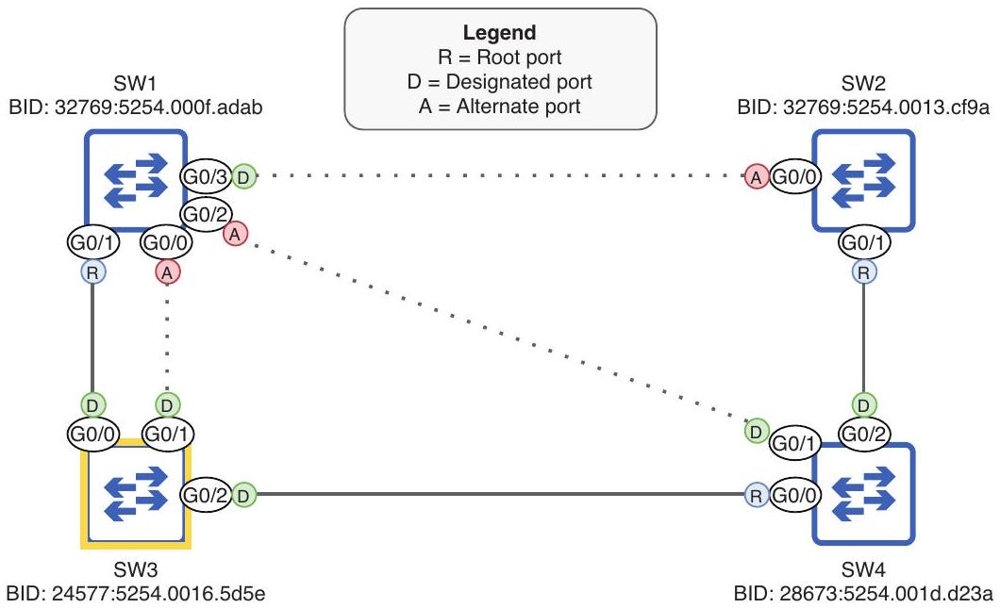
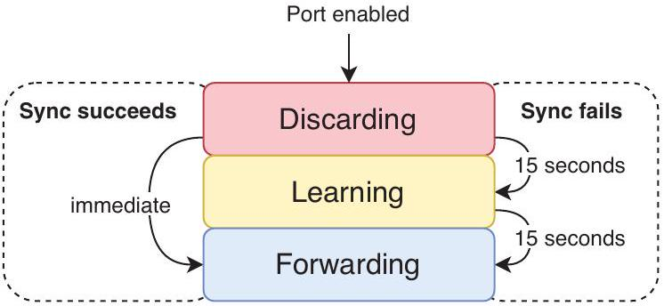
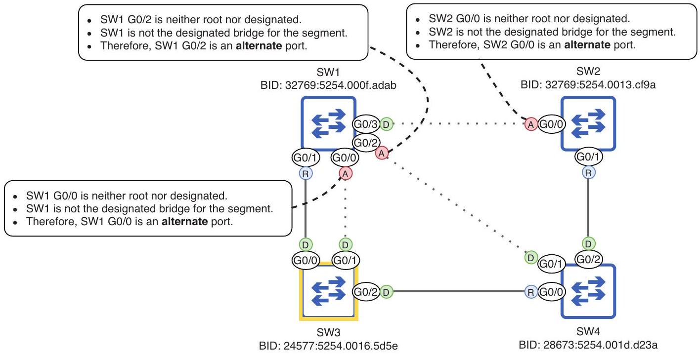
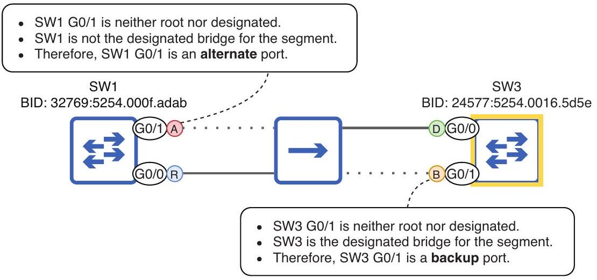
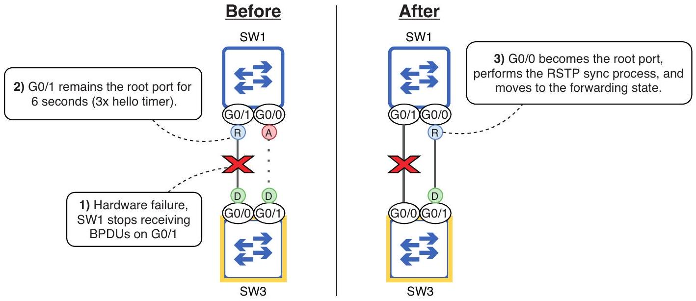
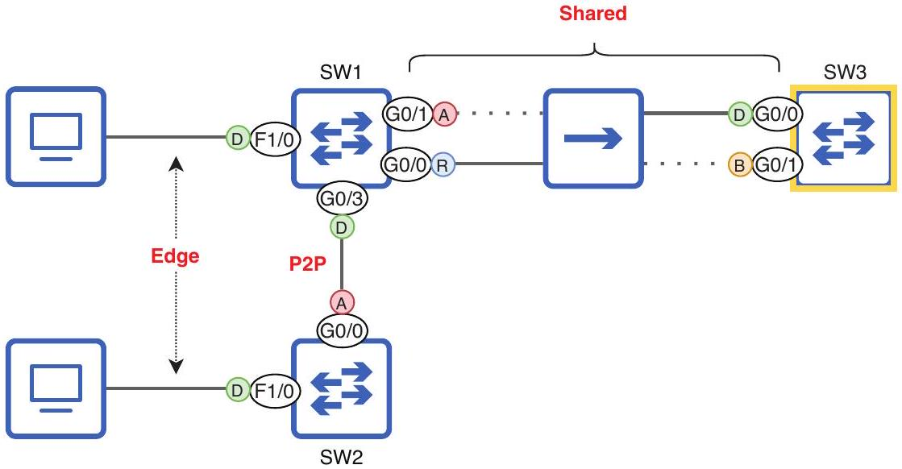
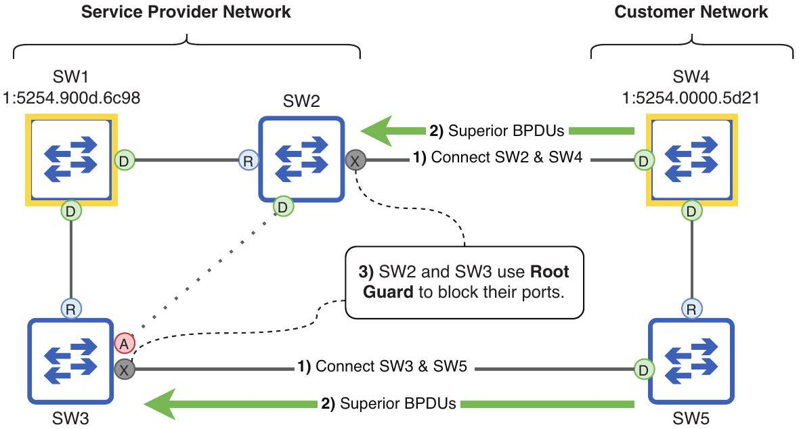
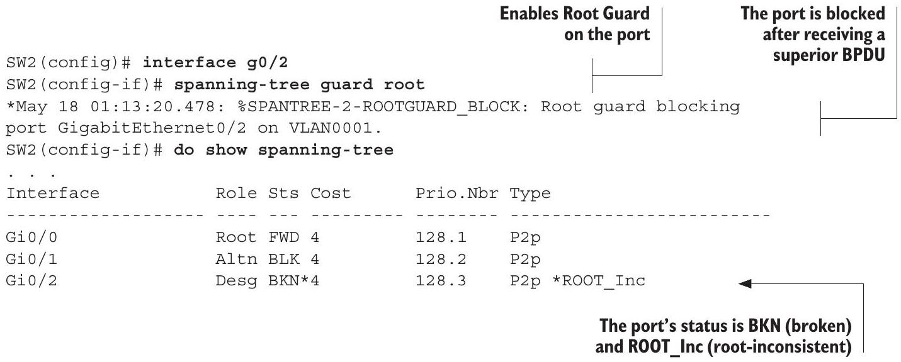
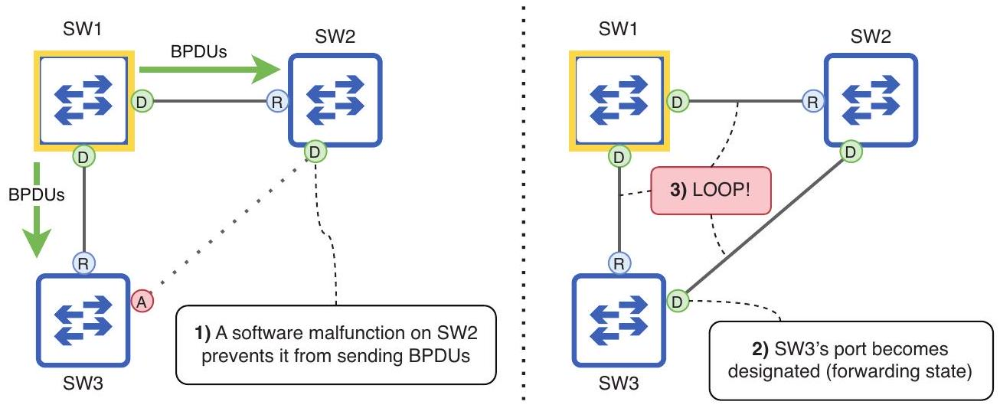

## Rapid Spanning Tree Protocol

## This chapter covers

- The standard and Cisco-proprietary versions of Spanning Tree Protocol
- A comparison of the port costs, states, and roles of STP and Rapid STP
- How RSTP-enabled switches react to topology changes
- How RSTP link types affect convergence
- Optional STP features Root Guard, Loop Guard, and BPDU Filter

In this chapter, we will continue to look at Spanning Tree Protocol (STP). There's a reason STP is enabled by default on almost any vendor's switches: Layer 2 loops are disastrous for a LAN. However, there are some downsides to the original STP as defined by IEEE 802.1D, the main one being speed; it can take up to 50 seconds to converge and reach a new, stable state after a change in the LAN. When STP was first released, 50 seconds was an acceptable time frame, but expectations have changed by now.

> [!translation] 逐句繁體中文翻譯
> - 在本章中，我們將繼續討論Spanning Tree Protocol（STP）。
> - 幾乎所有供應商的switch都預設啟用 STP，這是有原因的：Layer 2環路對 LAN 來說是災難性的。
> - 然而，IEEE 802.1D 定義的原始 STP 有一些缺點，主要是速度； LAN 發生更改後，可能需要 50 秒才能convergence並達到新的穩定狀態。
> - 當 STP 首次發佈時，50 秒是可接受的時間範圍，但現在期望已經改變。

The answer to the increased demand for speed in modern LANs is Rapid Spanning Tree Protocol (RSTP), the topic of this chapter. The good news is that since we covered the original STP in chapter 14, you're already 80\% of the way to understanding RSTP
(from the perspective of the CCNA-there is more nuance when you dig deeper). In this chapter, we will continue from the previous chapter and finish covering exam topic 2.5: Identify basic operations of Rapid PVST+ Spanning Tree Protocol.

> [!translation] 逐句繁體中文翻譯
> - 現代 LAN 對速度日益增長的需求的答案是Rapid Spanning Tree Protocol (RSTP)，這是本章的主題。
> - 好消息是，自從我們在第 14 章介紹了原始 STP 以來，您已經了解了 RSTP 的 80%（從 CCNA 的角度來看，當您深入挖掘時，會發現更多細微差別）。
> - 在本章中，我們將從上一章繼續，完成考試主題 2.5：識別Rapid PVST+ Spanning Tree Protocol的基本操作。

### 15.1 Spanning Tree Protocol versions

Before we look at the specifics of RSTP, let's briefly look at some of the different versions of STP, including industry-standard and Cisco-proprietary versions. In chapter 14, I mentioned two versions of STP: the protocol standardized in IEEE 802.1D and Cisco's PVST+. Cisco switches run PVST+, but the information in chapter 14 applies to both versions; the only difference is that PVST+ creates a separate spanning tree for each VLAN. This allows each VLAN to have a separate root bridge and a distinct topology of active and disabled links.

> [!translation] 逐句繁體中文翻譯
> - 在了解 RSTP 的詳細資訊之前，我們先簡單了解 STP 的一些不同版本，包括業界標準版本和 Cisco 專有版本。
> - 在第 14 章中，我提到了 STP 的兩個版本：IEEE 802.1D 中標準化的協定和 Cisco 的 PVST+。
> - Cisco switch運行 PVST+，但第 14 章的資訊適用於這兩個版本；唯一的差異在於 PVST+ 為每個 VLAN 建立一個單獨的spanning tree。
> - 這允許每個 VLAN 擁有單獨的root bridge以及活動和停用link的不同topology。

Likewise, RSTP was first standardized in IEEE 802.1w, and Cisco then developed Rapid Per-VLAN Spanning Tree Plus (Rapid PVST+), which runs on Cisco switches. The difference between 802.1w and Rapid PVST+ is the same as the difference between 802.1D and PVST+: whereas 802.1w creates a single spanning tree in the LAN, Rapid PVST+ creates a separate spanning tree for each VLAN, allowing traffic in different VLANs to use different links.

> [!translation] 逐句繁體中文翻譯
> - 同樣，RSTP 首先在 IEEE 802.1w 中標準化，然後Cisco開發了Rapid PVST+ (Rapid PVST+)，它在Ciscoswitch 上運行。
> - 802.1w 與 Rapid PVST+ 的差異，等同於 802.1D 與 PVST+ 的差異：802.1w 在 LAN 中建立單一 spanning tree；Rapid PVST+ 則為每個 VLAN 建立獨立的 spanning tree，使不同 VLAN 的 traffic 可以使用不同 links。

Modern Cisco switches can run both PVST+ and Rapid PVST+, but which version runs by default depends on the switch model and IOS version. To check which version is running on a switch, use the show spanning-tree command as in the following example; the line Spanning tree enabled protocol ieee indicates that PVST+ is running:

> [!translation] 逐句繁體中文翻譯
> - 現代Ciscoswitch可以運行 PVST+ 和 Rapid PVST+，但預設運行哪個版本取決於switch型號和 IOS 版本。
> - 若要檢查switch 上執行的版本，請使用 show spanning-tree 指令，如下例所示；spanning tree啟用協定 ieee 行表示 PVST+ 正在執行：

```
SW1# show spanning-tree
VLAN0001
    Spanning tree enabled protocol ieee u PVST+ is running.
. . .
```

To configure which version of STP the switch should use, use the spanning-tree mode \{pvst | rapid-pvst\} command in global config mode. In the following example, I configure the switch to use Rapid PVST+ and then confirm with show spanning -tree; the line Spanning tree enabled protocol rstp indicates that Rapid PVST+ is running:

> [!translation] 逐句繁體中文翻譯
> - 若要設定 switch 使用的 STP 版本，請在 global configuration mode 使用 `spanning-tree mode {pvst | rapid-pvst}` 指令。
> - 在下列範例中，我將switch設定為使用 Rapid PVST+，然後使用 show spanning -tree 進行確認；spanning tree啟用協定 rstp 行表示 Rapid PVST+ 正在執行：

```
SW1(config)# spanning-tree mode rapid-pvst
SW1(config)# do show spanning-tree
VLAN0001
    Spanning tree enabled protocol rstp < Rapid PVST+ is running.
. . .
```

NOTE The keyword used to enable each mode is different from how it appears in the output of show spanning-tree. PVST+ is configured with spanning-tree mode pvst but appears as Spanning tree enabled protocol ieee. Rapid PVST+ is configured with spanning-tree mode rapid-pvst but appears as

> [!translation] 逐句繁體中文翻譯
> - 注意 用於啟用每種模式的關鍵字與其在 show spanning-tree 輸出中的顯示方式不同。
> - PVST+ 配置為spanning tree模式 pvst，但顯示為啟用spanning tree的協定 ieee。
> - Rapid PVST+ 配置為spanning tree模式 rapid-pvst，但顯示為

Spanning tree enabled protocol rstp. Keep in mind that Cisco switches do not run the IEEE-standard versions of STP and RSTP-they run PVST+ and Rapid PVST+.

> [!translation] 逐句繁體中文翻譯
> - spanning tree啟用協定 rstp。
> - 請記住，Cisco switch不會執行 IEEE 標準版本的 STP 和 RSTP，它們運行 PVST+ 和 Rapid PVST+。

Although the ability to create a unique spanning tree for each VLAN is a benefit of PVST+ and Rapid PVST+ over their standard counterparts, there is a downside: in a LAN with many VLANs, a switch runs a separate STP instance and sends unique Bridge Protocol Data Units (BPDUs) for each VLAN. If there are 100 VLANs, each switch runs 100 STP instances and sends 100 BPDUs out of each designated port every 2 seconds. This taxes switch CPU and memory resources and can negatively affect network performance and stability.

> [!translation] 逐句繁體中文翻譯
> - 儘管為每個 VLAN 創建唯一的spanning tree的能力是 PVST+ 和Rapid PVST+ 相對於其標準同類產品的優勢，但也有一個缺點：在具有許多 VLAN 的 LAN 中，switch運行單獨的 STP 實例，並為每個 VLAN 發送唯一的BPDU (BPDU)。
> - 如果有 100 個 VLAN，則每台switch執行 100 個 STP 實例，並每 2 秒從每個指定port傳送 100 個 BPDU。
> - 這會加重switch CPU 和記憶體資源的負擔，並對network效能和穩定性產生負面影響。

Additionally, having many STP instances increases the complexity of managing the switches; configuring, monitoring, and troubleshooting 100 instances of STP can be unnecessarily complex. The reality is that in a LAN with 100 VLANs, there likely isn't a need for 100 unique spanning trees; you'll probably assign one switch as the root bridge for 50 of the VLANs and another switch as the root bridge for the remaining 50 VLANs, resulting in only two unique spanning trees.

> [!translation] 逐句繁體中文翻譯
> - 此外，擁有許多 STP 執行個體會增加管理switch的複雜度；對 100 個 STP 執行個體進行設定、監控和故障排除可能會過於複雜。
> - 實際上，具有 100 個 VLAN 的 LAN 未必需要 100 種不同的 spanning trees；可能讓一台 switch 成為其中 50 個 VLAN 的 root bridge，另一台 switch 成為其餘 50 個 VLAN 的 root bridge，因此實際只有兩種不同的 spanning-tree topologies。

In such a LAN, Multiple Spanning Tree Protocol (MSTP) might be preferred. With MSTP, you can group multiple VLANs into a single instance. For example, in a LAN with 100 VLANs, you might create two MSTP instances and group 50 VLANs in one instance and 50 VLANs in the other. This allows you to avoid congestion by balancing traffic over separate links, without using up resources by running 100 STP instances. And MSTP uses RSTP's mechanics for quick convergence-no 50-second waits like in 802.1D. Figure 15.1 shows how MSTP groups multiple VLANs into each instance.

> [!translation] 逐句繁體中文翻譯
> - 在這樣的 LAN 中，多Spanning Tree Protocol (MSTP) 可能是首選。
> - 透過 MSTP，您可以將多個 VLAN 分組到一個實例中。
> - 例如，在具有 100 個 VLAN 的 LAN 中，您可以建立兩個 MSTP 實例，並在一個實例中分組 50 個 VLAN，在另一個實例中分組 50 個 VLAN。
> - 這允許您透過平衡不同link上的traffic來避免擁塞，而無需透過執行 100 個 STP 實例來耗盡資源。
> - MSTP 使用 RSTP 的機制來實現快速convergence - 無需像 802.1D 那樣等待 50 秒。
> - 圖 15.1 顯示了 MSTP 如何將多個 VLAN 分組到每個實例中。


Figure 15.1 MSTP groups multiple VLANs into each instance. VLANs 1 to 50 are grouped together in MSTP instance 1, and VLANs 51 to 100 are grouped together in MSTP instance 2. This allows the switches to balance traffic over the links in the LAN without requiring a separate STP instance for each VLAN.

The details of MSTP are beyond the scope of the CCNA exam, so a basic understanding of its benefit (grouping multiple VLANs per instance) is sufficient. Table 15.1 summarizes the different versions of STP you should be aware of for the CCNA.

> [!translation] 逐句繁體中文翻譯
> - MSTP 的詳細資訊超出了 CCNA 考試的範圍，因此對其優勢（每個實例分組多個 VLAN）的基本了解就足夠了。
> - 表 15.1 總結了您應了解 CCNA 的不同 STP 版本。

Table 15.1 STP versions
| Version | Standard or Cisco-proprietary | Description |
| :--- | :--- | :--- |
| STP | Standard (802.1D) | The original standard. Creates only a single spanning tree. |
| PVST+ | Cisco-proprietary | Cisco's upgrade to 802.1D. Creates a separate spanning tree for each VLAN. |
| RSTP | Standard (802.1w) | Much faster convergence than 802.1D. Creates only a single spanning tree. |
| Rapid PVST+ | Cisco-proprietary | Cisco's upgrade to 802.1w. Creates a separate spanning tree for each VLAN. |
| MSTP | Standard (802.1s) | Uses RSTP mechanics for fast convergence. Groups multiple VLANs into each spanning tree instance. |


### 15.2 STP and RSTP comparison

As the word "rapid" in the name suggests, the fundamental difference between STP and RSTP is speed. Whereas 802.1D's STP is a timer-based protocol in which a port can take up to 50 seconds to begin forwarding, 802.1w's RSTP uses a synchronization mechanism in which RSTP-enabled switches communicate with each other to bring ports immediately to the forwarding state, without waiting for timers to count down.

> [!translation] 逐句繁體中文翻譯
> - 顧名思義，STP 和 RSTP 的根本區別在於速度。
> - 802.1D 的 STP 是基於計時器的協議，其中port最多需要 50 秒才能開始轉發，而 802.1w 的 RSTP 使用同步機制，支援 RSTP 的switch相互通信，使port立即進入轉送狀態，而無需立即等待計時器計時。

EXAM TIP The details of RSTP's sync mechanism are beyond the scope of the CCNA exam. Instead, focus on learning the RSTP port costs, states, roles, and link types covered in this chapter.

> [!translation] 逐句繁體中文翻譯
> - 考試提示 RSTP 同步機制的詳細資訊超出了 CCNA 考試的範圍。
> - 相反，應重點了解本章中介紹的 RSTP port成本、狀態、角色和連結類型。

Although we will cover the various differences between STP and RSTP, keep in mind that the algorithm for calculating the topology is identical:

> [!translation] 逐句繁體中文翻譯
> - 儘管我們將介紹 STP 和 RSTP 之間的各種差異，但請記住，計算topology的演算法是相同的：

- Root bridge election (one per LAN)
    - Lowest bridge ID (BID)
- Root port selection (one per switch, excluding root bridge)
    - Lowest root cost
    - Lowest neighbor BID
    - Lowest neighbor port ID
- Designated port selection (one per segment)
    - Port on switch with lowest root cost
    - Port on switch with lowest BID

In STP, the remaining ports will all be nondesignated. In RSTP, they will be one of two roles: alternate or backup (we will cover them in section 15.2.3). Figure 15.2 shows the same LAN we looked at in chapter 14, this time using RSTP. The only difference is that the nondesignated ports are now alternate ports.

> [!translation] 逐句繁體中文翻譯
> - 在STP中，其餘port都將是非指定的。
> - 在 RSTP 中，它們將是兩個角色之一：備用或備份（我們將在第 15.2.3 節中介紹它們）。
> - 图 15.2 显示了我们在第 14 章中看到的同一 LAN，这次使用 RSTP。
> - 唯一的區別是非指定port現在是備用port。


Figure 15.2 A LAN after RSTP has created a loop-free topology. The only difference in the topology between STP and RSTP is that the nondesignated ports are now called alternate ports.

NOTE A technical detail that could come up on the exam is how STP and RSTP handle BPDUs. In STP, the root bridge sends BPDUs every 2 seconds, and the other switches forward them out of their designated ports. In RSTP, all switches send BPDUs out of their designated ports every two seconds, whether they received a BPDU from the root bridge or not.

> [!translation] 逐句繁體中文翻譯
> - 注意 考試中可能出現的一個技術細節是 STP 和 RSTP 如何處理 BPDU。
> - 在 STP 中，root bridge每 2 秒發送一次 BPDU，其他switch將它們從其指定port轉送出去。
> - 在 RSTP 中，所有switch每兩秒鐘從其指定port發送 BPDU，無論它們是否從root bridge接收到 BPDU。

### 15.2.1 Port costs

STP defines port costs for speeds of up to 10 Gbps (with a cost of 2). RSTP, on the other hand, introduces a new set of port costs to accommodate ports of greater speeds-up to 10 Tbps. The original STP port costs are now called the short costs, and the new RSTP port costs are called the long costs. Table 15.2 lists the short and long costs of ports of various speeds.

> [!translation] 逐句繁體中文翻譯
> - STP 定義了速度高達 10 Gbps 的port成本（成本為 2）。
> - 另一方面，RSTP 引入了一組新的port成本，以適應速度高達 10 Tbps 的port。
> - 原始 STP port成本現在稱為短成本，新的 RSTP port成本稱為長成本。
> - 表 15.2 列出了各種速度port的短成本和長成本。

Table 15.2 Short and long port costs
| Speed | Short cost | Long cost |
| :--- | :--- | :--- |
| 10 Mbps | 100 | 2,000,000 |
| 100 Mbps | 19 | 200,000 |
| 1 Gbps | 4 | 20,000 |
| 10 Gbps | 2 | 2,000 |
| 100 Gbps | - | 200 |
| 1 Tbps | - | 20 |
| 10 Tbps | - | 2 |


EXAM TIP To remember the long costs, pick one as a point of reference (such as $10 \mathrm{Gbps}=2,000$ ). Then you can easily calculate the long costs of ports of other speeds: increasing the speed by a factor of 10 reduces the cost by a factor of 10 and vice versa.

> [!translation] 逐句繁體中文翻譯
> - 考試提示 若要記住長期成本，請選擇一個作為參考點（例如 $10 \mathrm{Gbps}=2,000$ ）。
> - 然後您可以輕鬆計算其他速度的port的長期成本：將速度提高 10 倍，成本就會降低 10 倍，反之亦然。

Although the long method of calculating port costs was introduced in RSTP, keep in mind that switches don't necessarily use it by default, even when running RSTP-it depends on the switch model and software version. To view which method (short or long) a switch is using, use the show spanning-tree pathcost method command, and to modify which method the switch uses to calculate port costs, use the spanning -tree pathcost method \{short | long\} command in global config mode. As you can see in the following example, my switch uses the short costs by default:

> [!translation] 逐句繁體中文翻譯
> - 雖然 RSTP 中引入了計算port成本的長方法，但請記住，switch不一定預設使用它，即使在運行 RSTP 時也是如此 - 它取決於switch型號和軟體版本。
> - 若要查看 switch 使用 short 或 long method，請使用 `show spanning-tree pathcost method`；若要修改 port cost 的計算方法，請在 global configuration mode 使用 `spanning-tree pathcost method {short | long}`。
> - 正如您在以下範例中看到的，我的switch預設使用短成本：

```
SW1# show spanning-tree pathcost method
Spanning tree default pathcost method used is short
```

The default method is short.

> [!translation] 逐句繁體中文翻譯
> - 預設方法很短。

### 15.2.2 Port states

Whereas STP has four main states (blocking, listening, learning, forwarding), RSTP combines the first two states into a single state called discarding. Table 15.3 compares the STP and RSTP port states.

> [!translation] 逐句繁體中文翻譯
> - STP 有四個主要狀態（阻斷、偵聽、學習、轉送），而 RSTP 將前兩個狀態組合成一個稱為丟棄的狀態。
> - 表 15.3 比較了 STP 和 RSTP port狀態。

Table 15.3 STP and RSTP port states
| STP port state | RSTP port state |
| :--- | :--- |
| Blocking | Discarding |
| Listening |  |
| Learning | Learning |
| Forwarding | Forwarding |


When an RSTP port is first enabled, it will enter the discarding state. If it is decided that the port will be an alternate or backup port (more on that in section 15.2.3), it will remain in the discarding state, blocking traffic to prevent Layer 2 loops. However, if the port becomes a root or designated port, it will proceed to the forwarding state in one of two ways, as shown in figure 15.3.

> [!translation] 逐句繁體中文翻譯
> - 當RSTPport首次啟用時，它將進入丟棄狀態。
> - 如果確定該port將是備用或備份port（更多資訊請參閱第 15.2.3 節），它將保持在丟棄狀態，阻止traffic以防止Layer 2環路。
> - 但是，如果port成為root port或designated port，它將通過兩種方式之一進入轉發狀態，如圖 15.3 所示。


Figure 15.3 An RSTP port can transition to the forwarding state in one of two ways. If the RSTP sync mechanism succeeds, the port immediately transitions to the forwarding state. If the RSTP sync mechanism fails, the port transitions from discarding to learning to forwarding, like a regular STP port.

If the RSTP sync mechanism succeeds, the port immediately transitions to the forwarding state-no need to wait for any timers. This is expected if the port is connected to another RSTP-enabled switch. However, the sync mechanism will not work in all situations-for example, if the port is connected to a device that doesn't use RSTP, such as a router, a PC, or even a switch that is using STP instead of RSTP. In that case, the port will remain in the discarding state for 15 seconds (the duration of the forward delay timer), then transition to the learning state for another 15 seconds, and then finally transition to the forwarding state-this is like a regular STP port transitioning through the listening and learning states before forwarding.

> [!translation] 逐句繁體中文翻譯
> - 如果RSTP同步機製成功，port立即轉換到轉送狀態－無需等待任何定時器。
> - 如果port連接到另一個啟用 RSTP 的交換機，則這是預期的情況。
> - 但是，同步機制並非在所有情況下都有效 - 例如，如果port連接到不使用 RSTP 的設備，例如router、PC，甚至是使用 STP 而不是 RSTP 的switch。
> - 在這種情況下，port將保持丟棄狀態 15 秒（轉送延遲計時器的持續時間），然後再轉換到學習狀態 15 秒，最後轉換到轉送狀態 - 這就像常規 STP port在轉送之前經歷偵聽和學習狀態的轉換一樣。

NOTE RSTP and STP are compatible. However, a port on an RSTP-enabled switch that is connected to a port on an STP-enabled switch will not be able to take advantage of RSTP's sync mechanism. The port on the RSTP-enabled switch will operate like a regular STP port.

> [!translation] 逐句繁體中文翻譯
> - 說明 RSTP 和STP 是相容的。
> - 但是，啟用 RSTP 的switch 上的port如果連接到啟用 STP 的switch 上的port，將無法利用 RSTP 的同步機制。
> - 啟用 RSTP 的switch 上的port將像常規 STP port一樣運作。

These days, you can safely expect that all switches will support RSTP, so you should only expect the timer-based transition to the forwarding state on ports connected to a host like a PC. However, as we covered in chapter 14, PortFast can be configured on such ports to allow them to start forwarding frames immediately-we will cover PortFast again in section 15.3.

> [!translation] 逐句繁體中文翻譯
> - 如今，您可以放心地期望所有switch都將支援 RSTP，因此您應該只期望在連接到 PC 等host的port 上基於計時器的轉換到轉送狀態。
> - 然而，正如我們在第 14 章中介紹的那樣，可以在此類port 上配置 PortFast，以允許它們立即開始轉送frame - 我們將在 15.3 節中再次介紹 PortFast。

### 15.2.3 Port roles

The three port roles of STP are root, designated, and nondesignated; we covered these in chapter 14. In RSTP, the root and designated roles remain unchanged. A root port is a forwarding port that points toward the root bridge; it provides the switch's only active path to reach the root bridge. A designated port is a forwarding port that points away from the root bridge, and all segments must have exactly one designated port. However, the nondesignated port role has been replaced by two distinct roles: alternate and backup. Like nondesignated ports, alternate and backup ports block traffic to prevent Layer 2 loops.

> [!translation] 逐句繁體中文翻譯
> - STP的三種port角色是根、指定和非指定；我們在第 14 章中介紹了這些內容。
> - 在 RSTP 中，根角色和指定角色保持不變。
> - 根port是指向root bridge的轉送埠；它提供switch到達root bridge的唯一活動路徑。
> - designated port是指遠離root bridge的轉送端口，並且所有網段必須恰好有一個designated port。
> - 但是，非指定port角色已被兩個不同的角色所取代：備用和備份。
> - 與非指定port一樣，備用port和備份port會阻止traffic以防止Layer 2迴路。

## Alternate role

An RSTP alternate port can be thought of as an alternative for the switch's root port; it provides an alternative path toward the root bridge and is ready to take over (by transitioning to the forwarding state) if the root port fails. The rule for becoming an alternate port is as follows: any port that is not a root or designated port is an alternate port if the switch is not the designated bridge for that segment.

> [!translation] 逐句繁體中文翻譯
> - RSTP 備用port可以被視為switch根port的替代port；它提供通往root bridge的替代路徑，並準備在根port發生故障時接管（透過轉換到轉送狀態）。
> - 成為備用port的規則如下：如果switch不是該網段的指定網橋，則任何不是根port或指定port的port都是備用port。

NOTE Designated bridge is a new term; it is the switch that has the designated port for a particular segment. This term applies to both STP and RSTP.

> [!translation] 逐句繁體中文翻譯
> - 注意：指定橋接器是一個新術語；它是具有特定網段的指定port的switch。
> - 此術語適用於 STP 和 RSTP。

In almost all cases, a port that is neither a root port nor a designated port will be an alternate port. Figure 15.4 explains why each of the alternate ports in the LAN is in that state.

> [!translation] 逐句繁體中文翻譯
> - 在幾乎所有情況下，既不是root port也不是designated port的端口將是備用端口。
> - 圖 15.4 解釋了為什麼 LAN 中的每個備用port都處於該狀態。


Figure 15.4 A port will become an alternate port if it is neither root nor designated and if the switch is not the designated bridge for the segment. In almost all cases, a port that is neither root nor designated will be an alternate port.

NOTE A simple way to define an alternate port is as a port in the discarding state that is connected to a designated port on another switch.

> [!translation] 逐句繁體中文翻譯
> - 注意 定義備用port的簡單方法是，將其定義為連接到另一台switch 上的指定port的處於丟棄狀態的port。

## Backup role

An RSTP backup port provides a backup path to the same segment as a designated port on the same switch. This will only occur if two ports on the same switch are connected to the same segment (collision domain)-for example, with a hub. You will most likely never use a hub in a modern network, so I wouldn't expect to encounter a backup port "in the wild." However, backup ports are worth covering, even if just for the possibility of a question about them on the exam.

> [!translation] 逐句繁體中文翻譯
> - RSTP備份port提供與相同switch 上的指定port相同網段的備份路徑。
> - 只有當同一switch 上的兩個port連接到同一網段（衝突域）（例如透過集線器）時，才會發生這種情況。
> - 您很可能永遠不會在現代network中使用集線器，因此我不會期望在「野外」遇到備份port。然而，備份port是值得討論的，即使只是為了在考試中可能會出現有關它們的問題。

The rule for becoming a backup port is as follows: any port that is not a root or designated port is a backup port if the switch is the designated bridge for that segment. In figure 15.5, I have added a hub between SW1 and SW3 (and removed SW2 and SW4 from the diagram), connecting their four ports to the same segment. SW1 G0/1 becomes an alternate port (because SW1 isn't the designated bridge for the segment), but SW3 G0/1 becomes a backup port (because SW3 is the designated bridge for the segment).

> [!translation] 逐句繁體中文翻譯
> - 成為備份port的規則如下：如果switch是該網段的指定橋，則任何不是根port或指定port的port都是備份port。
> - 在圖 15.5 中，我在 SW1 和 SW3 之間添加了一個集線器（並從圖中刪除了 SW2 和 SW4），將它們的四個連接到同一網段。
> - SW1 G0/1 成為備用port（因為 SW1 不是該網段的指定橋接器），但 SW3 G0/1 成為備援port（因為 SW3 是該網段的指定網橋）。

NOTE We can simplify this rule too: a backup port is a port in the discarding state that is connected to a designated port on the same switch (via a hub). In figure 15.5, SW3 G0/1 is connected to SW3 G0/0 (a designated port) via a hub.

> [!translation] 逐句繁體中文翻譯
> - 注意我們也可以簡化這個規則：備份port是連接到同一switch 上的指定port（透過集線器）的處於丟棄狀態的port。
> - 在圖 15.5 中，SW3 G0/1 透過集線器連接到 SW3 G0/0（指定port）。


Figure 15.5 SW1 and SW3 both have multiple ports connected to the same segment. SW1 G0/1 becomes an alternate port because SW1 is not the designated bridge for the segment. SW3 GO/1 becomes a backup (B) port because SW3 is the designated bridge for the segment.

In the following example, I use the show spanning-tree command on SW1 and SW3 to confirm their port roles; Altn stands for alternate, and Back stands for backup. Note that the Sts column states BLK in each case; even though the blocking state was renamed to discarding in RSTP, this command retains the "blocking" terminology:

> [!translation] 逐句繁體中文翻譯
> - 在以下範例中，我在 SW1 和 SW3 上使用 show spanning-tree 命令來確認它們的port角色； Altn 代表備用，Back 代表備份。
> - 請注意，Sts 列在每種情況下都狀態為 BLK；儘管阻塞狀態在 RSTP 中被重新命名為丟棄，但此命令保留了「阻塞」術語：

```
SW1# show spanning-tree
. . .
Interface Role Sts Cost Prio.Nbr Type
------------------- ---- --- --------- -------- -------------------------------
Gi0/0 Root FWD 4 128.1 Shr
Gio/1 Altn BLK 4 128.2 Shr
SW3# show spanning-tree
. . .
        Prio.Nbr Type
Interface Role Sts Cost Prio.Nbr Type
Gio/0
Gio/0
    Desg FWD 4
        128.1 Shr
Gi0/1 Back BLK 4
Gi0/1
    Back BLK 4
        128.2 Shr
                SW3 GO/0 is a
                designated port.
```

Why does SW1 G0/0 become a root port instead of SW1 G0/1, and why does SW3 G0/0 become a designated port instead of SW3 G0/1? When multiple ports on the same switch are connected to the same segment, there is an additional tiebreaker for the root/designated port selection steps of the STP algorithm: the port with the lowest port ID on the local switch becomes root/designated. SW1 G0/0 has a lower port ID than SW1 G0/1, so G0/0 becomes a root port, and G0/1 becomes an alternate port. Likewise, SW3 G0/0 has a lower port ID than SW3 G0/1, so G0/0 becomes a designated port, and G0/1 becomes a backup port. With these tiebreakers added, the STP algorithm is as follows:

> [!translation] 逐句繁體中文翻譯
> - 為什麼SW1 G0/0而不是SW1 G0/1成為root port，為什麼SW3 G0/0而不是SW3 G0/1成為designated port？
> - 當同一switch 上的多個port連接到同一網段時，STP 演算法的根/指定port選擇步驟還有一個額外的決定因素：本機switch 上port ID 最小的port成為根/指定port。
> - SW1 G0/0 的port ID 低於 SW1 G0/1，因此 G0/0 成為root port，G0/1 成為備用端口。
> - 同樣，SW3 G0/0 的端口 ID 低於 SW3 G0/1，因此 G0/0 成為designated port，G0/1 成為備份端口。
> - 在加入這些決勝局後，STP 演算法如下：

- Root bridge election (one per LAN)
    - Lowest BID
- Root port selection (one per switch, excluding root bridge)
    - Lowest root cost
    - Lowest neighbor BID
    - Lowest neighbor port ID
    - Lowest local port ID
- Designated port selection (one per segment)
    - Port on switch with lowest root cost
    - Port on switch with lowest BID
    - Lowest local port ID

NOTE These tiebreakers apply to STP too. If SW1 and SW3 were running STP rather than RSTP, their alternate/backup ports would both be nondesignated ports; there is no such distinction of roles in STP.

> [!translation] 逐句繁體中文翻譯
> - 注意 這些決定因素也適用於 STP。
> - 如果 SW1 和 SW3 運行的是 STP 而不是 RSTP，則它們的備用/備份port都將是非指定port；STP 中沒有這種角色區分。

In chapter 14, I mentioned that every port on the root bridge should be designated. This is almost always true, but as we just saw, if multiple ports on the root bridge are connected to the same segment, only one can be designated; the "one designated port per segment" rule wins out. So rather than "every port on the root bridge should be designated," a more accurate rule is "the root bridge is the designated bridge for every segment." However, because you will rarely (if ever) encounter a LAN using hubs, you'll most often hear that every port on the root bridge should be designated.

> [!translation] 逐句繁體中文翻譯
> - 在第14章中，我提到root bridge上的每個port都應該被指定。
> - 這幾乎總是正確的，但正如我們剛才看到的，如果root bridge上的多個port連接到同一網段，則只能指定一個； “每段一個指定port”規則勝出。
> - 因此，更準確的規則是“root bridge是每個網段的指定橋”，而不是“root bridge上的每個port都應該被指定”。但是，由於您很少（如果有的話）遇到使用集線器的 LAN，因此您最常聽到的是應該指定root bridge上的每個port。

### 15.2.4 RSTP topology changes

In chapter 14, we covered an example in which a switch's nondesignated port took 50 seconds to move to a forwarding state after a change in the topology (due to a hardware failure). Although the details of the topology change processes of STP and RSTP are beyond the scope of the CCNA exam, let's take a brief look at one way that RSTP speeds up the process. Figure 15.6 shows the same example from chapter 14, this time using RSTP.

> [!translation] 逐句繁體中文翻譯
> - 在第14章中，我們介紹了一個範例，其中switch的非指定port在topology發生變化（由於硬體故障）後花了50秒才進入轉送狀態。
> - 雖然STP和RSTP的topology變化過程的細節超出了CCNA考試的範圍，但讓我們簡單看一下RSTP加速該過程的一種方式。
> - 圖 15.6 顯示了第 14 章中的相同範例，這次使用 RSTP。

Whereas an STP-enabled switch waits 20 seconds (the max age timer) after ceasing to receive BPDUs on a port to react and initiate the topology change process, RSTP only waits until a port misses three BPDUs (6 seconds by default) to react. Then, as in figure 15.6, the next-best port can sync with its neighbor and immediately move to the forwarding state; a 50-second process has been shortened to just over 6 seconds.

> [!translation] 逐句繁體中文翻譯
> - 啟用 STP 的switch在port停止接收 BPDU 後會等待 20 秒（最大老化計時器）來做出反應並啟動topology變更過程，而 RSTP 只會等到port錯過 3 個 BPDU（預設為 6 秒）才做出反應。
> - 然後，如圖 15.6 所示，次佳埠可以與其鄰居同步並立即進入轉送狀態； 50秒的過程已縮短至6秒多一點。


Figure 15.6 RSTP speeds up convergence after a topology change like this from 50 seconds to just over 6 seconds. (1) Due to a hardware failure, SW1 stops receiving BPDUs on G0/1 (without the port going down). (2) G0/1 remains the root port for 6 seconds (3× the hello timer of 2 seconds). (3) G0/0 becomes the root port and, after performing the RSTP sync process, immediately moves to the forwarding state.

NOTE If the hardware failure caused SW1's G0/1 port to go down (enter a disabled state), the process would be even faster; there would be no need to wait 6 seconds. In that case, SW1 G0/0 will immediately initiate the sync process, bringing the total downtime to less than 1 second.

> [!translation] 逐句繁體中文翻譯
> - 注意 如果硬體故障導致 SW1 的 G0/1 port關閉（進入停用狀態），則該過程會更快；不需要等待6秒。
> - 在這種情況下，SW1 G0/0 將立即啟動同步過程，使總停機時間少於 1 秒。

### 15.3 RSTP link types

Another aspect of RSTP is the concept of link types. These types influence how ports transition through the RSTP port states and react to network changes. RSTP defines three link types:

> [!translation] 逐句繁體中文翻譯
> - RSTP 的另一個面向是連結類型的概念。
> - 這些類型會影響port如何透過 RSTP port狀態轉換並對network變更做出反應。
> - RSTP 定義了三種連結類型：

- Point-to-point-Full-duplex ports that can use the RSTP sync mechanism to immediately transition to the forwarding state.
- Shared-Half-duplex ports that cannot use the RSTP sync mechanism. They must transition through the states like standard STP ports.
- Edge-Ports connected to end hosts that can use PortFast to immediately transition to the forwarding state.

Figure 15.7 illustrates these three link types on three switches.


Figure 15.7 RSTP differentiates between three link types: point-to-point, shared, and edge. A full-duplex link is considered a point-to-point link. A half-duplex link is considered a shared link. A link between a switch and an end host that uses PortFast is considered an edge link.

An RSTP point-to-point link is a link that operates in full duplex, meaning that the connected ports (i.e. SW1 G0/3 and SW2 G0/0) operate in full duplex. These are the only links that can take advantage of RSTP's sync mechanism to rapidly transition ports to the forwarding state. Although full-duplex ports will automatically use the pointto-point link type, you can also manually configure it with the spanning-tree link -type point-to-point command in interface config mode.

> [!translation] 逐句繁體中文翻譯
> - RSTP 點對點連結是以全雙工方式運作的連結，這表示連接的port（即
> - SW1 G0/3 和 SW2 G0/0）以全雙工方式運作。
> - 這些是唯一可以利用 RSTP 同步機制將port快速轉換到轉送狀態的連結。
> - 雖然全雙工port將自動使用點對點連結類型，但您也可以在interface組態模式中使用 spanning-tree link -type point-to-point 指令手動設定它。

An RSTP shared link is a link that operates in half duplex. In figure 15.7, SW1 and SW3 are connected via a hub, and devices connected to a hub must operate in halfduplex; therefore, the link is an RSTP shared link. Ports connected to a shared link cannot use RSTP's sync mechanism; in effect, they operate like regular STP links, taking 30 seconds to move to the forwarding state. Half-duplex ports will automatically use the shared link type, but if necessary, the spanning-tree link-type shared command can be used to manually configure it.

> [!translation] 逐句繁體中文翻譯
> - RSTP 共享連結是以半雙工方式運作的連結。
> - 在圖 15.7 中，SW1 和 SW3 透過集線器連接，連接到集線器的設備必須以半雙工方式運作；因此，該連結是RSTP共享連結。
> - 連接到共用連結的port無法使用 RSTP 的同步機制；實際上，它們的運作方式與常規 STP 連結類似，需要 30 秒才能進入轉送狀態。
> - 半雙工port會自動使用共用連結類型，但如有必要，可以使用 spanning-tree link-type shared 指令手動設定。

NOTE Like the backup port role, you probably won't encounter the shared link type in a real network.

> [!translation] 逐句繁體中文翻譯
> - 注意 與備份port角色一樣，您可能不會在實際network中遇到共用連結類型。

Finally, there is the edge link type. These are ports that connect to end hosts: SW1 F1/0 and SW2 F1/0. These ports don't need to use the RSTP sync mechanism; there is no risk of a Layer 2 loop, so they can immediately transition to the forwarding state. Does a port connected to an end host immediately transitioning to the forwarding state sound familiar?

> [!translation] 逐句繁體中文翻譯
> - 最後，還有邊緣連結類型。
> - 這些是連接到終端host的port：SW1 F1/0 和 SW2 F1/0。
> - 這些port不需要使用 RSTP 同步機制；不存在二層迴路的風險，因此可以立即過渡到轉送狀態。
> - 連接到終端host的port立即轉換到轉送狀態聽起來很熟悉嗎？

On Cisco switches, the edge link type must be manually configured by enabling PortFast on the appropriate ports (with the spanning-tree portfast command, as we covered in chapter 14)-not the spanning-tree link-type command like point-topoint and shared links. Note that this is the only link type that can't be automatically
determined by the switch based on the port's duplex mode; you must manually configure it.

> [!translation] 逐句繁體中文翻譯
> - 在 Cisco switch 上，邊緣連結類型必須透過在對應port 上啟用 PortFast 來手動設定（使用 spanning-tree portfast 指令，如我們在第 14 章中所介紹的），而不是像點對點和共用連結那樣使用 spanning-tree link-type 指令。
> - 請注意，這是switch無法根據port的雙工模式自動決定的唯一連結類型；您必須手動設定它。

NOTE A port that is connected to an end host but hasn't been configured with the spanning-tree portfast command won't immediately transition to the forwarding state-it will have to wait 30 seconds like a regular STP port.

> [!translation] 逐句繁體中文翻譯
> - 注意 連接到終端host但尚未使用 spanning-tree portfast 命令配置的port不會立即轉換到轉送狀態 - 它必須像常規 STP port一樣等待 30 秒。

One more characteristic of edge ports is that RSTP doesn't consider any activity on them (such as moving to the forwarding or discarding states) a topology change and doesn't notify its neighbors of the activity. Because edge ports connect to end hosts (not switches), and therefore pose no risk of causing Layer 2 loops, there's no need to notify other switches of activity on those ports; they don't affect the rest of the RSTP topology.

> [!translation] 逐句繁體中文翻譯
> - 邊緣port的另一個特徵是，RSTP 不會將其上的任何活動（例如轉至轉送或丟棄狀態）視為topology更改，並且不會將該活動通知其鄰居。
> - 由於邊緣port連接到終端host（而不是switch），因此不存在導致Layer 2迴路的風險，因此無需將這些port 上的活動通知其他switch；它們不會影響 RSTP topology的其餘部分。

## Topology changes

STP and RSTP each have defined processes for reacting to changes in the topology, allowing switches to adapt to the new topology with minimal disruptions; the details of these processes are beyond the scope of the CCNA exam. STP triggers its topology change process in the following situations:

> [!translation] 逐句繁體中文翻譯
> - STP 和 RSTP 各自定義了對topology變化做出反應的流程，允許switch以最小的中斷適應新的topology；這些過程的細節超出了 CCNA 考試的範圍。
> - STP 在下列情況下觸發其topology變更過程：

- When any port transitions to the forwarding state
- When a port in the learning state or forwarding state transitions to the blocking state or disabled state

Switches using RSTP, on the other hand, only trigger the topology change process when a port with a non-edge link type (point-to-point or shared) transitions to the forwarding state; they don't trigger the process when an edge port transitions to the forwarding state or when any port transitions to the discarding state.

> [!translation] 逐句繁體中文翻譯
> - 另一方面，使用RSTP的switch僅在非邊緣連結類型（點對點或共用）的port轉變為轉送狀態時觸發topology改變過程；當邊緣port轉換到轉送狀態或任何port轉換到丟棄狀態時，它們不會觸發該過程。

EXAM TIP The details of STP/RSTP topology changes are beyond the scope of the CCNA exam, but remember this characteristic of RSTP edge ports: they don't trigger the topology change process when moving to the forwarding state.

> [!translation] 逐句繁體中文翻譯
> - 考試提示 STP/RSTP topology變更的詳細資訊超出了 CCNA 考試的範圍，但請記住 RSTP 邊緣port的這一特性：它們在進入轉送狀態時不會觸發topology變更過程。

You can view the type of link of each port with the show spanning-tree command. The final column on the right lists the link types: point-to-point (P2p), shared (Shr), and edge (Edge). In the following example, I use the command on SW1:

> [!translation] 逐句繁體中文翻譯
> - 您可以使用show spanning-tree指令查看每個port的連結類型。
> - 右側最後一列列出了連結類型：點對點 (P2p)、共享 (Shr) 和邊緣 (Edge)。
> - 在以下範例中，我在 SW1 上使用該指令：

```
SW1# show spanning-tree
. . .
Interface Role Sts Cost Prio.Nbr Type
Gio/0
    Root FWD 4 128.1 Shr
Gi0/1
    Altn BLK 4
                                Shr indicates a shared link.
Gi0/3
    Desg FWD 4 128.4 P2p
Fal/0
    Desg FWD 19
P2p Edge indicates a point-to-point edge link
            (a full-duplex link using PortFast).
```

NOTE F1/0's type is listed as P2p Edge. In Cisco IOS, an edge port will appear as P2p Edge if it operates in full duplex or Shr Edge if it operates in half duplex.

> [!translation] 逐句繁體中文翻譯
> - 注意 F1/0 的類型被列為 P2p Edge。
> - 在 Cisco IOS 中，如果邊緣port以全雙工方式運行，則邊緣port將顯示為 P2p Edge；如果以半雙工方式運行，則邊緣port將顯示為 Shr Edge。

In a modern network that uses only switches (not hubs), links between two switches should have the point-to-point type, and links between a switch and an end host should have the edge link type (more specifically, the point-to-point edge).

> [!translation] 逐句繁體中文翻譯
> - 在僅使用switch（而不是集線器）的現代network中，兩個switch之間的link應具有點對點類型，switch和終端host之間的link應具有邊緣link類型（更具體地說，點對點邊緣）。

### 15.4 Root Guard, Loop Guard, and BPDU Filter

In chapter 14, we covered two optional STP features: PortFast and BPDU Guard. While these are the two most common features in the so-called STP toolkit, the CCNA exam expects you to know a few more tools that expand STP's (or RSTP's) functionality. In this section, we will discuss Root Guard, Loop Guard, and BPDU Filter.

> [!translation] 逐句繁體中文翻譯
> - 在第 14 章中，我們介紹了兩個可選的 STP 功能：PortFast 和 BPDU Guard。
> - 雖然這些是所謂的 STP 工具包中最常見的兩個功能，但 CCNA 考試希望您了解更多一些擴展 STP（或 RSTP）功能的工具。
> - 在本節中，我們將討論根防護、環路防護和 BPDU 過濾器。

NOTE All of these optional STP features-PortFast, BPDU Guard, Root Guard, Loop Guard, and BPDU Filter-work in both STP and RSTP.

> [!translation] 逐句繁體中文翻譯
> - 注意 所有這些可選的 STP 功能（PortFast、BPDU Guard、Root Guard、Loop Guard 和 BPDU Filter）都可以在 STP 和 RSTP 中運作。

### 15.4.1 Root Guard

Root Guard is a feature that enhances the stability of the STP topology by preventing external switches from becoming the root bridge. A common scenario where Root Guard is useful is when a LAN of switches is controlled by two different entities, such as a service provider and a customer (who connects to the service provider's network). The service provider can use Root Guard to ensure that one of its switches remains the root bridge, maintaining a consistent STP topology even if a customer connects a switch with a lower bridge ID. Figure 15.8 illustrates this scenario.

> [!translation] 逐句繁體中文翻譯
> - 根防護是一種透過防止外部switch成為root bridge來增強 STP 拓樸穩定性的功能。
> - Root Guard 有用的常見場景是當switch LAN 由兩個不同的實體控制時，例如服務提供者和客戶（連接到服務提供者的network）。
> - 服務供應商可以使用 Root Guard 來確保其一台switch仍然是root bridge，從而保持一致的 STP topology，即使客戶連接具有較低橋接 ID 的switch也是如此。
> - 圖 15.8 說明了這種情況。


Figure 15.8 Root Guard prevents a newly connected customer network from affecting the service provider's STP topology. (1) The customer's SW4 and SW5 are connected to the service provider's SW2 and SW3. (2) SW4's bridge ID is lower than SW1's, so the BPDUs sent by SW4 and SW5 are superior to SW1's BPDUs. (3) SW2 and SW3 use Root Guard to block their ports that receive the superior BPDUs.

When a Root Guard-enabled port receives a superior BPDU, the port will enter the root-inconsistent state; in effect, this disables the port, preventing the switch from accepting the superior BPDU. In this state, the customer is unable to access the service provider's network. To fix this problem, the customer needs to configure a higher bridge ID on SW4, making the BPDUs it sends inferior to those of SW1. Once the superior BPDUs are no longer received, SW2's and SW3's ports automatically recover and return to their normal state.

> [!translation] 逐句繁體中文翻譯
> - 當啟用Root Guard的port收到上級BPDU時，port將進入根不一致狀態；實際上，這會停用端口，從而阻止switch接受高級 BPDU。
> - 在此狀態下，客戶無法存取服務提供者的network。
> - 為了解決這個問題，客戶需要在SW4上設定更高的橋接器ID，使其發送的BPDU不如SW1。
> - 一旦不再接收到上級 BPDU，SW2 和 SW3 的port將自動恢復並返回正常狀態。

The following example shows how to enable Root Guard on a port with the spanning-tree guard root command and the error message that appears when Root Guard blocks the port.

> [!translation] 逐句繁體中文翻譯
> - 以下範例顯示如何使用 spanning-tree Guard root 指令在port 上啟用根防護，以及根防護阻止port時出現的錯誤訊息。


By using Root Guard, you can ensure that your network's STP topology remains stable and consistent, preventing external or misconfigured devices from disrupting the network.

> [!translation] 逐句繁體中文翻譯
> - 透過使用 Root Guard，您可以確保network的 STP topology保持穩定和一致，從而防止外部或配置錯誤的裝置中斷network。

### 15.4.2 Loop Guard

Loop Guard, as the name implies, guards against Layer 2 loops in the LAN. The entire point of STP is to prevent loops, but Loop Guard provides an additional layer of protection against a switch port erroneously transitioning from the discarding state (the blocking state in classic STP) to the forwarding state. This can happen when the discarding port stops receiving BPDUs, causing the switch to believe that the port can move to the forwarding state without causing a loop. Figure 15.9 shows how this can cause a loop.

> [!translation] 逐句繁體中文翻譯
> - 環路防護，顧名思義，可以防止區域network中的二層環路。
> - STP 的全部目的是防止環路，但環路防護提供了額外的一層保護，防止switchport錯誤地從丟棄狀態（經典 STP 中的阻塞狀態）轉換到轉送狀態。
> - 當丟棄port停止接收 BPDU 時，可能會發生這種情況，導致switch認為該port可以轉至轉送狀態而不會導致迴路。
> - 圖 15.9 顯示了這如何導致循環。


Figure 15.9 A loop is caused when SW3 stops receiving BPDUs from SW2. (1) A software malfunction on SW2 prevents it from sending BPDUs. (2) After the max age timer counts down, SW3's port becomes a designated port and transitions to the forwarding state. (3) All three links between the switches are active, resulting in a Layer 2 loop.

To avoid such a problem, you can configure Loop Guard on SW3's alternate port using the spanning-tree guard loop command. If a Loop Guard-enabled port stops receiving BPDUs, the port will move into the loop-inconsistent state, disabling the port instead of allowing it to transition to the forwarding state; this prevents a loop from forming. However, if SW2 recovers and starts sending BPDUs again, SW3's port will automatically recover and transition back to its normal state (discarding).

> [!translation] 逐句繁體中文翻譯
> - 為了避免此類問題，您可以使用spanning tree保護環命令在 SW3 的備用port 上設定環路防護。
> - 如果啟用環路防護的port停止接收 BPDU，則該port將進入環路不一致狀態，從而停用該port而不是允許其轉換到轉送狀態；這可以防止形成環路。
> - 但是，如果 SW2 恢復並再次開始發送 BPDU，SW3 的port將自動恢復並轉換回其正常狀態（丟棄）。

The following example shows how to enable Loop Guard and the error message that appears when Loop Guard blocks the port to prevent a loop.

> [!translation] 逐句繁體中文翻譯
> - 以下範例顯示如何啟用環路防護以及環路防護阻止port以防止環路時出現的錯誤訊息。

```
SW2(config)# interface g0/1
SW2(config-if)# spanning-tree guard loop
*May 18 01:29:31.261: %SPANTREE-2-LOOPGUARD_BLOCK: Loop guard blocking
port GigabitEthernet0/1 on VLAN0001.
SW2(config-if) # do show spanning-tree
. . .
Interface Role Sts Cost Prio.Nbr Type
GiO/O
    Root FWD 4 128.1 P2p
Gi0/1
    Desg BKN*4 128.2 P2p *LOOP_Inc
            The port’s status is BKN (broken)
            and LOOP_Inc (loop-inconsistent)
```

With Loop Guard, you can provide an additional safeguard against potential network loops, ensuring the stability and reliability of the LAN. A Layer 2 loop can bring down any LAN, so avoiding them is critical.

> [!translation] 逐句繁體中文翻譯
> - 透過環路防護，您可以針對潛在的network迴路提供額外的保護，確保 LAN 的穩定性和可靠性。
> - Layer 2環路可能會導致任何 LAN 癱瘓，因此避免它們至關重要。

NOTE Root Guard and Loop Guard are mutually exclusive; you can't enable both of them on the same port simultaneously. This is because they serve different roles: Root Guard takes action based on receiving superior BPDUs, while Loop Guard takes action based on not receiving BPDUs.

> [!translation] 逐句繁體中文翻譯
> - 注意 根保護和環路保護是互斥的；您不能同時在同一port 上啟用它們。
> - 這是因為它們扮演不同的角色：根防護根據接收到優質 BPDU 採取行動，而環路防護則根據未接收 BPDU 採取行動。

### 15.4.3 BPDU Filter

BPDU Filter is a feature that can be used to prevent BPDUs from being sent or received on specific ports. This can be desirable on ports where STP isn't necessary, such as those connected to end hosts, since there is no risk of causing a loop. BPDU Filter can be enabled in two ways, with different behaviors depending on how you activate it:

> [!translation] 逐句繁體中文翻譯
> - BPDU 過濾器是可用於阻止在特定port 上傳送或接收 BPDU 的功能。
> - 這對於不需要 STP 的port（例如連接到最終host的port）來說可能是理想的，因為不存在導致環路的風險。
> - BPDU 濾鏡可以透過兩種方式啟用，根據您的啟動方式，具有不同的行為：

- Enabling BPDU Filter on a specific port
    - Use spanning-tree bpdufilter enable in interface config mode.
    - This enables BPDU Filter on the specific port.
    - The port will not send BPDUs and will ignore any BPDUs it receives.
    - This effectively disables STP on the port.
- Enable BPDU Filter globally for all PortFast-enabled ports
    - Use spanning-tree portfast bpdufilter default in global config mode.
    - This enables BPDU Filter on all PortFast-enabled ports (RSTP edge ports).
    - The port will not send BPDUs.
    - If the port receives a BPDU, PortFast and BPDU Filter will be disabled. The port will then operate as a normal STP or RSTP port.

Of the optional STP features that we have covered in this chapter and the previous one-PortFast, BPDU Guard, Root Guard, Loop Guard, and BPDU Filter-BPDU Filter has the fewest use cases; I recommend avoiding it in general. Especially when enabled in interface config mode, BPDU Filter poses the risk of causing a Layer 2 loop if the port is connected to another switch; STP is effectively disabled on the BPDU Filter-enabled port, so it won't move to the discarding state even if there is a loop in the LAN. Enabling BPDU Filter carelessly is a great way to bring down a network-use with extreme caution!

> [!translation] 逐句繁體中文翻譯
> - 在本章和上一章介紹的可選 STP 功能中，PortFast、BPDU Guard、Root Guard、Loop Guard 和 BPDU Filter（BPDU 過濾器）的使用案例最少；我建議一般情況下避免使用它。
> - 特別是在interface設定模式下啟用時，如果port連接到另一台交換機，BPDU Filter 會帶來導致Layer 2迴路的風險；STP 在啟用 BPDU Filter 的port 上被有效停用，因此即使 LAN 中存在環路，它也不會進入迴路，它也不會進入狀態。
> - 不小心啟用 BPDU 過濾器是非常小心地降低network使用的好方法！

## Summary

- STP, standardized by IEEE 802.1D, was modified by Cisco to make PVST+. Likewise, RSTP, standardized by IEEE 802.1w, was modified by Cisco to make Rapid PVST+. PVST+ and Rapid PVST+ both run separate spanning tree instances for each VLAN.
- Whether a switch runs PVST+ or Rapid PVST+ by default depends on the switch model and IOS version.
