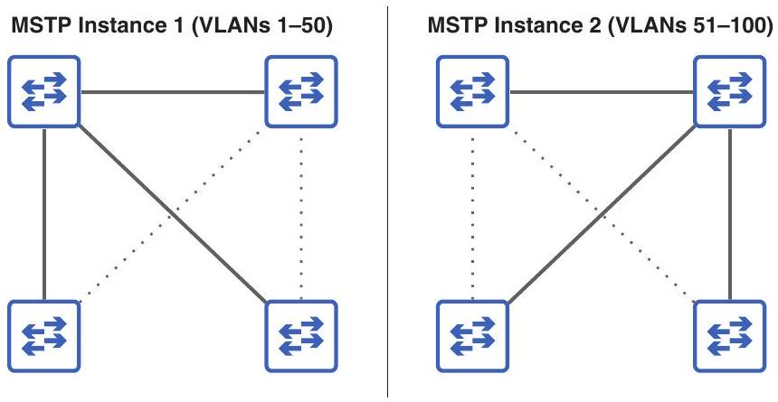

# Chapter 15.1 - Spanning Tree Protocol versions

Before we look at the specifics of RSTP, let's briefly look at some of the different versions of STP, including industry-standard and Cisco-proprietary versions. In chapter 14, I mentioned two versions of STP: the protocol standardized in IEEE 802.1D and Cisco's PVST+. Cisco switches run PVST+, but the information in chapter 14 applies to both versions; the only difference is that PVST+ creates a separate spanning tree for each VLAN. This allows each VLAN to have a separate root bridge and a distinct topology of active and disabled links.

> [!translation] 逐句繁體中文翻譯
> - 在了解 RSTP 的詳細資訊之前，我們先簡單了解 STP 的一些不同版本，包括業界標準版本和 Cisco 專有版本。
> - 在第 14 章中，我提到了 STP 的兩個版本：IEEE 802.1D 中標準化的協定和 Cisco 的 PVST+。
> - Cisco switch運行 PVST+，但第 14 章的資訊適用於這兩個版本；唯一的差異在於 PVST+ 為每個 VLAN 建立一個單獨的spanning tree。
> - 這允許每個 VLAN 擁有單獨的root bridge以及活動和停用link的不同topology。

Likewise, RSTP was first standardized in IEEE 802.1w, and Cisco then developed Rapid Per-VLAN Spanning Tree Plus (Rapid PVST+), which runs on Cisco switches. The difference between 802.1w and Rapid PVST+ is the same as the difference between 802.1D and PVST+: whereas 802.1w creates a single spanning tree in the LAN, Rapid PVST+ creates a separate spanning tree for each VLAN, allowing traffic in different VLANs to use different links.

> [!translation] 逐句繁體中文翻譯
> - 同樣，RSTP 首先在 IEEE 802.1w 中標準化，然後Cisco開發了Rapid PVST+ (Rapid PVST+)，它在Ciscoswitch 上運行。
> - 802.1w 與 Rapid PVST+ 的差異，等同於 802.1D 與 PVST+ 的差異：802.1w 在 LAN 中建立單一 spanning tree；Rapid PVST+ 則為每個 VLAN 建立獨立的 spanning tree，使不同 VLAN 的 traffic 可以使用不同 links。

Modern Cisco switches can run both PVST+ and Rapid PVST+, but which version runs by default depends on the switch model and IOS version. To check which version is running on a switch, use the show spanning-tree command as in the following example; the line Spanning tree enabled protocol ieee indicates that PVST+ is running:

> [!translation] 逐句繁體中文翻譯
> - 現代Ciscoswitch可以運行 PVST+ 和 Rapid PVST+，但預設運行哪個版本取決於switch型號和 IOS 版本。
> - 若要檢查switch 上執行的版本，請使用 show spanning-tree 指令，如下例所示；spanning tree啟用協定 ieee 行表示 PVST+ 正在執行：

```
SW1# show spanning-tree
VLAN0001
    Spanning tree enabled protocol ieee u PVST+ is running.
. . .
```

To configure which version of STP the switch should use, use the spanning-tree mode \{pvst | rapid-pvst\} command in global config mode. In the following example, I configure the switch to use Rapid PVST+ and then confirm with show spanning -tree; the line Spanning tree enabled protocol rstp indicates that Rapid PVST+ is running:

> [!translation] 逐句繁體中文翻譯
> - 若要設定 switch 使用的 STP 版本，請在 global configuration mode 使用 `spanning-tree mode {pvst | rapid-pvst}` 指令。
> - 在下列範例中，我將switch設定為使用 Rapid PVST+，然後使用 show spanning -tree 進行確認；spanning tree啟用協定 rstp 行表示 Rapid PVST+ 正在執行：

```
SW1(config)# spanning-tree mode rapid-pvst
SW1(config)# do show spanning-tree
VLAN0001
    Spanning tree enabled protocol rstp < Rapid PVST+ is running.
. . .
```

NOTE The keyword used to enable each mode is different from how it appears in the output of show spanning-tree. PVST+ is configured with spanning-tree mode pvst but appears as Spanning tree enabled protocol ieee. Rapid PVST+ is configured with spanning-tree mode rapid-pvst but appears as

> [!translation] 逐句繁體中文翻譯
> - 注意 用於啟用每種模式的關鍵字與其在 show spanning-tree 輸出中的顯示方式不同。
> - PVST+ 配置為spanning tree模式 pvst，但顯示為啟用spanning tree的協定 ieee。
> - Rapid PVST+ 配置為spanning tree模式 rapid-pvst，但顯示為

Spanning tree enabled protocol rstp. Keep in mind that Cisco switches do not run the IEEE-standard versions of STP and RSTP-they run PVST+ and Rapid PVST+.

> [!translation] 逐句繁體中文翻譯
> - spanning tree啟用協定 rstp。
> - 請記住，Cisco switch不會執行 IEEE 標準版本的 STP 和 RSTP，它們運行 PVST+ 和 Rapid PVST+。

Although the ability to create a unique spanning tree for each VLAN is a benefit of PVST+ and Rapid PVST+ over their standard counterparts, there is a downside: in a LAN with many VLANs, a switch runs a separate STP instance and sends unique Bridge Protocol Data Units (BPDUs) for each VLAN. If there are 100 VLANs, each switch runs 100 STP instances and sends 100 BPDUs out of each designated port every 2 seconds. This taxes switch CPU and memory resources and can negatively affect network performance and stability.

> [!translation] 逐句繁體中文翻譯
> - 儘管為每個 VLAN 創建唯一的spanning tree的能力是 PVST+ 和Rapid PVST+ 相對於其標準同類產品的優勢，但也有一個缺點：在具有許多 VLAN 的 LAN 中，switch運行單獨的 STP 實例，並為每個 VLAN 發送唯一的BPDU (BPDU)。
> - 如果有 100 個 VLAN，則每台switch執行 100 個 STP 實例，並每 2 秒從每個指定port傳送 100 個 BPDU。
> - 這會加重switch CPU 和記憶體資源的負擔，並對network效能和穩定性產生負面影響。

Additionally, having many STP instances increases the complexity of managing the switches; configuring, monitoring, and troubleshooting 100 instances of STP can be unnecessarily complex. The reality is that in a LAN with 100 VLANs, there likely isn't a need for 100 unique spanning trees; you'll probably assign one switch as the root bridge for 50 of the VLANs and another switch as the root bridge for the remaining 50 VLANs, resulting in only two unique spanning trees.

> [!translation] 逐句繁體中文翻譯
> - 此外，擁有許多 STP 執行個體會增加管理switch的複雜度；對 100 個 STP 執行個體進行設定、監控和故障排除可能會過於複雜。
> - 實際上，具有 100 個 VLAN 的 LAN 未必需要 100 種不同的 spanning trees；可能讓一台 switch 成為其中 50 個 VLAN 的 root bridge，另一台 switch 成為其餘 50 個 VLAN 的 root bridge，因此實際只有兩種不同的 spanning-tree topologies。

In such a LAN, Multiple Spanning Tree Protocol (MSTP) might be preferred. With MSTP, you can group multiple VLANs into a single instance. For example, in a LAN with 100 VLANs, you might create two MSTP instances and group 50 VLANs in one instance and 50 VLANs in the other. This allows you to avoid congestion by balancing traffic over separate links, without using up resources by running 100 STP instances. And MSTP uses RSTP's mechanics for quick convergence-no 50-second waits like in 802.1D. Figure 15.1 shows how MSTP groups multiple VLANs into each instance.

> [!translation] 逐句繁體中文翻譯
> - 在這樣的 LAN 中，多Spanning Tree Protocol (MSTP) 可能是首選。
> - 透過 MSTP，您可以將多個 VLAN 分組到一個實例中。
> - 例如，在具有 100 個 VLAN 的 LAN 中，您可以建立兩個 MSTP 實例，並在一個實例中分組 50 個 VLAN，在另一個實例中分組 50 個 VLAN。
> - 這允許您透過平衡不同link上的traffic來避免擁塞，而無需透過執行 100 個 STP 實例來耗盡資源。
> - MSTP 使用 RSTP 的機制來實現快速convergence - 無需像 802.1D 那樣等待 50 秒。
> - 圖 15.1 顯示了 MSTP 如何將多個 VLAN 分組到每個實例中。


Figure 15.1 MSTP groups multiple VLANs into each instance. VLANs 1 to 50 are grouped together in MSTP instance 1, and VLANs 51 to 100 are grouped together in MSTP instance 2. This allows the switches to balance traffic over the links in the LAN without requiring a separate STP instance for each VLAN.

The details of MSTP are beyond the scope of the CCNA exam, so a basic understanding of its benefit (grouping multiple VLANs per instance) is sufficient. Table 15.1 summarizes the different versions of STP you should be aware of for the CCNA.

> [!translation] 逐句繁體中文翻譯
> - MSTP 的詳細資訊超出了 CCNA 考試的範圍，因此對其優勢（每個實例分組多個 VLAN）的基本了解就足夠了。
> - 表 15.1 總結了您應了解 CCNA 的不同 STP 版本。

Table 15.1 STP versions
| Version | Standard or Cisco-proprietary | Description |
| :--- | :--- | :--- |
| STP | Standard (802.1D) | The original standard. Creates only a single spanning tree. |
| PVST+ | Cisco-proprietary | Cisco's upgrade to 802.1D. Creates a separate spanning tree for each VLAN. |
| RSTP | Standard (802.1w) | Much faster convergence than 802.1D. Creates only a single spanning tree. |
| Rapid PVST+ | Cisco-proprietary | Cisco's upgrade to 802.1w. Creates a separate spanning tree for each VLAN. |
| MSTP | Standard (802.1s) | Uses RSTP mechanics for fast convergence. Groups multiple VLANs into each spanning tree instance. |
