## EtherChannel

## This chapter covers

- How EtherChannel combines redundant links into a single logical link
- Static and dynamic EtherChannel configuration
- How traffic is load-balanced over the physical links of an EtherChannel
- Using Layer 3 EtherChannel to provide redundant Layer 3 connections

In the previous two chapters on STP, we emphasized the essential role of STP in preventing Layer 2 loops in a LAN with redundant connections. However, the downside of STP is that all redundant links are disabled; they provide essential redundancy in a LAN but will only be used to forward traffic if an active link fails.

In this chapter, we will cover EtherChannel, a technology that helps to overcome this limitation by allowing multiple physical links to be combined into a single logical link. As a result, STP and frame-forwarding logic will treat the group of links as a single unit, allowing the whole group of links to remain active without causing Layer 2 loops. This not only maximizes usage of the available bandwidth but also improves network resilience and simplifies management-advantages that we'll delve into in this chapter. EtherChannel is CCNA exam topic 2.4: Configure and verify (Layer 2/ Layer 3) EtherChannel (LACP).

### 16.1 How EtherChannel works

To see how EtherChannel works and why it's useful, think of the following situation. Two switches, SW1 and SW2, are connected by their G0/0 ports. However, the link is congested; there is a lot of traffic in the LAN. The link between SW1 and SW2 is a bottleneck that is negatively affecting networking performance, and users are complaining.

To remedy the problem, you add a second link between SW1 and SW2, connecting their G0/1 ports. However, users still complain about poor network performance. This time, you add a further two links between SW1 and SW2, resulting in a total of four links between the switches. Having quadrupled the bandwidth between SW1 and SW2 (from a single 1 Gbps connection to four), surely the issue has been fixed, right? Nope, the LAN is just as congested as ever.

NOTE Bandwidth is the total number of bits that can be transferred over a connection per second-four 1 Gbps links means 4 Gbps of bandwidth. In section 16.3, we will differentiate between bandwidth and speed-two similar but different concepts.

So, what's the culprit? It's our friend from the previous two chapters: Spanning Tree Protocol. Figure 16.1 shows why the network performance won't improve, no matter how many new links you add between the two switches. STP blocks all redundant links to avoid Layer 2 loops, leaving only a single link active.

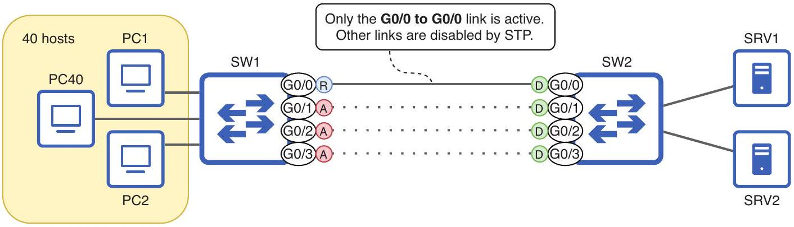
Figure 16.1 Clients connected to SW1 experience poor network performance when accessing the servers connected to SW2, but adding additional links between the switches doesn't remedy the issue. This is because STP blocks redundant links, leaving only a single active link.

Having additional links between SW1 and SW2 adds redundancy but doesn't solve the problem of congestion between the switches. The real solution to the problem is EtherChannel, which combines multiple physical links into a single logical link, meaning they can all remain active without causing Layer 2 loops. Figure 16.2 shows how EtherChannel combines the four 1 Gbps physical links into a single logical link with 4 Gbps of bandwidth.

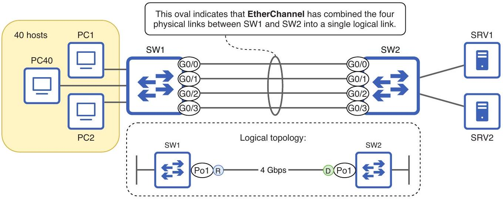
Figure 16.2 EtherChannel combines the four 1 Gbps links between SW1 and SW2 into a logical 4 Gbps link. Frame-switching and STP logic treat the four links as one. SW1's logical Po1 (Port-channel1) interface is an STP root port connected to SW2's logical Po1 interface, which is an STP designated port.

NOTE The logical interfaces created by EtherChannel are called port channels in Cisco IOS; this term is often used interchangeably with EtherChannel. For consistency, I will use the term EtherChannel except when referring to CLI commands that use the term port-channel.

Frames forwarded between SW1 and SW2 will be distributed over the four physical links that make up the EtherChannel; this is called load balancing or load distribution, and we will cover how EtherChannel does it in section 16.3. Because the four links are treated as one logical entity, a Layer 2 loop is not created even though all ports can forward frames. Figure 16.3 shows how a broadcast frame sent by a PC reaches all hosts in the LAN but does not result in a Layer 2 loop; BUM frames received on a port that is a member of an EtherChannel will not be flooded out of other ports in the same EtherChannel.

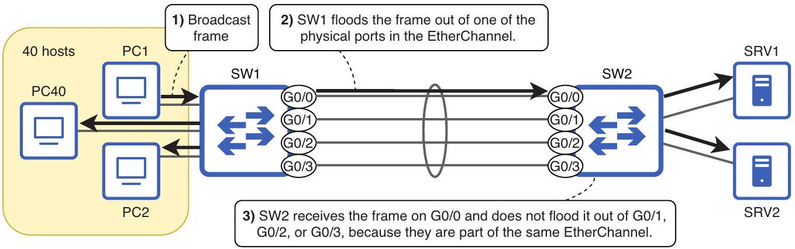
Figure 16.3 (1) PC1 send a broadcast frame and (2) SW1 floods it over the EtherChannel, sending the frame out of one of the EtherChannel's member ports. (3) SW2 receives the frame on G0/0 and floods it to SRV1 and SRV2 but does not flood the frame back to SW1 because G0/1, G0/2, and G0/3 are part of the same EtherChannel as G0/0.

It is important to note that EtherChannel does not entirely remove the need for STP in a LAN. With only two switches, all links can remain active, but in the context of a larger LAN, some links may need to be disabled. Figure 16.4 shows an example. The switches in the LAN are connected by various two-link EtherChannels. However, some of the EtherChannels need to be blocked by STP to avoid Layer 2 loops in the LAN.

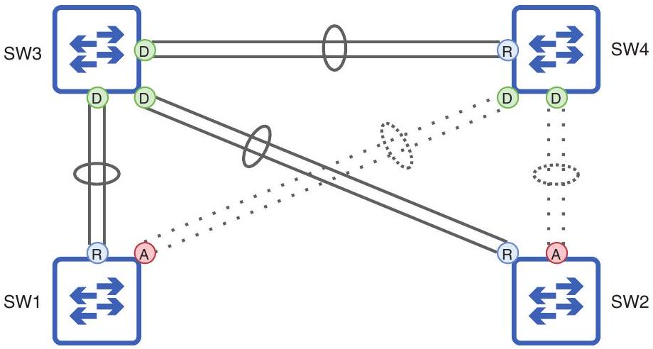
Figure 16.4 Four switches connected by EtherChannels, some blocked by STP. Without EtherChannel, only 3 of the 10 physical links would be active. With EtherChannel, 6 of the 10 physical links (three 2-link) EtherChannels are active.

Because all ports in an EtherChannel are treated as one logical port by STP, the output of show spanning-tree will only show the port channel interfaces, not the physical ports. I demonstrate this in the following example:

```
SW1# show spanning-tree
```

| Interface | Role Sts Cost | Prio.Nbr | Type |
| :--- | :--- | :--- | :--- |
| Po1 | Root FWD 3 | 128.65 | P2p |
| Po2 | Altn BLK 3 | 128.66 | P2p |

NOTE Po1 and Po2 have an STP cost of 3 in the example, rather than the default cost of 4 for a GigabitEthernet port. Because the bandwidth values of the two member ports of each port channel are combined, the STP cost calculation is affected.

### 16.2 EtherChannel configuration

Now that we've covered EtherChannel's purpose and how it works at a high level, let's see how to configure it on Cisco switches. There are two ways to configure an Ether-Channel: configuring a dynamic EtherChannel causes the switches to use a protocol to negotiate with each other to form an EtherChannel, and static EtherChannel forces the switch to form an EtherChannel with the specified ports, without any negotiation with the neighboring device.

NOTE Dynamic and static EtherChannel configuration can be likened to dynamic and static trunk port configuration; switch ports using DTP negotiate with each other to form a trunk (dynamic), whereas manually configured trunk ports operate in trunk mode without any negotiation (static).

### 16.2.1 Dynamic EtherChannel

A dynamic EtherChannel configuration involves enabling a protocol on a set of switch ports. The switches will use the protocol to send messages to each other to negotiate whether to form an EtherChannel; this negotiation process involves comparing configuration parameters to make sure they match. Incorrectly configured EtherChannels can result in loops in the LAN, so it is highly recommended that you use dynamic EtherChannel instead of the other option: static EtherChannel (the topic of section 16.2.2).

Cisco switches support two dynamic EtherChannel negotiation protocols: the Ciscoproprietary Port Aggregation Protocol (PAgP) and the IEEE standard Link Aggregation Control Protocol (LACP), first defined in IEEE 802.3ad. The biggest difference between the two is that PAgP only runs on Cisco switches, whereas LACP can run on any vendor's switches.

EXAM TIP Remember the key difference between PAgP and LACP; if an exam question mentions forming an EtherChannel with a non-Cisco switch, you must use LACP.

## PAGP configuration

Cisco's PAgP allows up to eight physical links to be combined into a single EtherChannel. Figure 16.5 shows a two-link EtherChannel between SW1 and SW2; you should be familiar with the desirable and auto keywords from configuring trunks with DTP. Additionally, switchport mode trunk is configured on each logical port channel interface to make the new EtherChannel a trunk link.

```
SW1(config)# interface range g0/0-1
SW1(config-if-range) # channel-group 1 mode desirable
SW1(config-if-range) # interface po1
SW1(config-if)# switchport mode trunk
```

Figure 16.5 An EtherChannel is formed between SW1 and SW2 using PAgP. SW1's G0/0 and G0/1 ports are configured in PAgP desirable mode, and SW2's GO/0 and G0/1 ports are configured in PAgP auto mode. switchport mode trunk is applied to each switch's port channel interface to make the EtherChannel a trunk.

To configure an EtherChannel using PAgP, use the channel-group group-number mode \{desirable | auto\} command on the member ports. The group-number value is used to identify the EtherChannel on the switch; a single switch can have multiple EtherChannels, and this number identifies which ports belong to which EtherChannel. Like in DTP trunk formation, the combination of desirable and auto modes on the two ends of the connection determines whether the switches will form an EtherChannel:

```
- desirable + desirable = yes
- desirable + auto = yes
- auto + auto = no
```

NOTE If the switches don't form an EtherChannel, the two links will function independently-one active and one blocked by STP.

Ports in desirable mode will actively attempt to form an EtherChannel with the neighboring switch by sending PAgP messages. Ports in auto mode won't actively attempt to form an EtherChannel but will respond upon receiving PAgP messages from a desirable-mode neighbor and agree to form an EtherChannel.

In the following example, I configure desirable mode on SW1's G0/0 and G0/1 ports, as we saw in figure 16.5. After assigning both ports to channel group 1, the logical interface Port-channell is automatically created, as shown in the output of show ip interface brief; using this logical interface, the physical G0/0 and G0/1 ports are treated as one entity by Cisco IOS:

```
SW1(config)# interface range g0/0-1
SW1(config-if-range)# channel-group 1 mode desirable
SW1(config-if-range) # do show ip interface brief
```

| Interface | IP-Address | OK? | Method | Status | Protocol |
| :--- | :--- | :--- | :--- | :--- | :--- |
| GigabitEthernet0/0 | unassigned | YES | unset | up | up |
| GigabitEthernet0/1 | unassigned | YES | unset | up | up |
| GigabitEthernet0/2 | unassigned | YES | unset | administratively down | down |
| GigabitEthernet0/3 | unassigned | YES | unset | administratively down | down |
| Port-channel1 | unassigned | YES | unset | down | down |

The Port-channel1 interface was created automatically after assigning G0/0 and G0/1 to channel group 1.

NOTE Get used to the different terms: some IOS commands use the term channel-group, some use port-channel, and some use etherchannel. They all refer to the same thing.

Note that the Port-channell interface is in a down/down state; this is because I haven't configured SW2's end of the connection yet. You can confirm the status of any EtherChannels on a switch with the show etherchannel summary command, as in the following example:
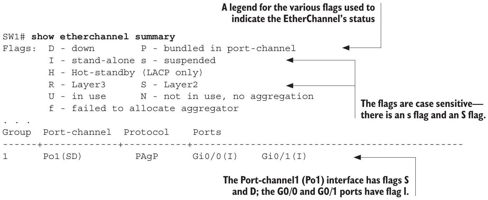

A variety of flags are used to indicate the status of the EtherChannel; they are indicated in brackets next to the port channel interface and each member port. SW1's Po1 interface has the S and D flags; as indicated in the legend at the top of the output, S indicates a Layer 2 EtherChannel (think S for "switch port"). Just like regular switch ports, port channel interfaces can also be configured to operate like router interfaces with the no switchport command. We will cover that in section 16.4; for now, let's focus on Layer 2 EtherChannels. The Po1 interface also has the D flag, meaning down; in this case, it's because SW2's end hasn't been configured yet.

The G0/0 and G0/1 ports that form the EtherChannel both have the I flag, meaning stand-alone (think I for "independent"); although I configured them to be part of Port-channel1, PAgP didn't succeed in negotiating with SW2. As a result, G0/0 and G0/1 both operate as regular standalone switch ports. To complete the EtherChannel, let's configure SW2's side of the connection in auto mode, as we saw in figure 16.5. In the following example, I configure SW2's G0/0 and G0/1 ports and confirm with show

```
    etherchannel summary:
SW2(config)# interface range g0/0-1
        Configures SW2 GO/0 and
SW2(config-if-range) # channel-group 1 mode auto
        GO/1 in auto mode
SW2(config-if-range) # do show etherchannel summary
Flags: D - down P - bundled in port-channel
. . .
    R - Layer3 S - Layer2
    U - in use N - not in use, no aggregation
. . .
Group Port-channel Protocol Ports
------+-------------+-----------+-----------------------------------------------
1 Po1(SU) PAgP Gi0/0(P) Gi0/1(P)
        GO/0 and GO/1 have formed an EtherChannel.
```

NOTE I configured channel-group 1 on both SW1 and SW2, but the group number doesn't have to match on the two switches; the group number is only significant to the local switch.

After configuring SW2, notice that the flags are different from those we saw on SW1. Po1's D has changed to a U for in use; this means the EtherChannel was successfully negotiated and is working-I like to think of it as U for "up," since the opposite state is D for "down." The I next to G0/0 and G0/1 also changed to a P for bundled in port-channel; this means they are no longer standalone ports but are now members of the EtherChannel. Figure 16.6 shows the physical and logical topologies of the SW1-SW2 connection after forming the EtherChannel.

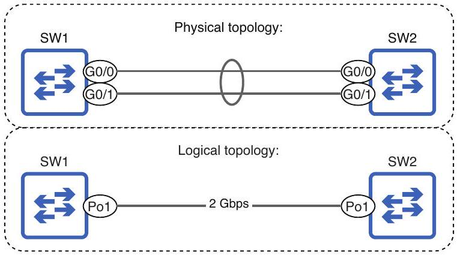
Figure 16.6 The physical and logical topologies of the SW1-SW2 connection. Physically, SW1 and SW2 are connected by two 1 Gbps links. Logically, they are connected by a single 2 Gbps link via their Po1 interfaces.

Now that the EtherChannel has been formed, we can configure each switch's port channel interface as necessary. For example, because this is a connection between switches, it probably should be a trunk link; in most cases, connections between switches need to carry traffic in multiple VLANs. In the following example, I configure SW1's Po1 interface in trunk mode and confirm with show interfaces trunk:
Configures port-channel1
as a trunk

Configurations made to the port channel interface will be automatically inherited by its member ports. In the following example, I use show running-config on SW1 to check the configurations of its ports; G0/0 and G0/1 have both inherited the switchport mode trunk command:

```
SW1# show running-config
. . .
interface Port-channel1
```

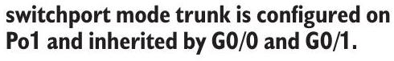

```
    switchport mode trunk
!
interface GigabitEthernet0/0
    switchport mode trunk
    channel-group 1 mode desirable
!
interface GigabitEthernet0/1
    switchport mode trunk
```

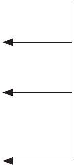

```
    channel-group 1 mode desirable
. . .
```

Although G0/0 and G0/1 have inherited the switchport mode trunk command, only Po1 appears in the output of show interfaces trunk, as shown in the following example. This is because when part of an EtherChannel, physical ports are no longer viewed as independent logical entities by IOS; they are combined to form the logical port channel interface:

```
SW1# show interfaces trunk
Port Mode
Po1 on
. . .
```

```
Encapsulation Status Native vlan
802.1q trunking 1
```

The output only shows Po1, not G0/0 or G0/1.

Inheritance goes both ways; if you use the switchport mode trunk command on G0/0 and G0/1, the configuration will be inherited by Po1. In the following example, I demonstrate that on SW2:

```
SW2(config)# interface range g0/0-1
SW2(config-if-range) # switchport mode trunk
SW2(config-if-range) # do show running-config
. . .
interface Port-channel1
    switchport mode trunk
!
interface GigabitEthernet0/0
    switchport mode trunk
    channel-group 1 mode desirable
!
interface GigabitEthernet0/1
    switchport mode trunk
    channel-group 1 mode desirable
. . .
```

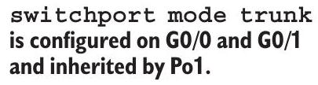

Order of configuration
Because inheritance goes both ways, there is some flexibility to the order in which you configure EtherChannels. Assigning ports to an EtherChannel (with the channel-group command) can come before or after configuring port settings (like switchport mode trunk), and those port settings can be configured on either the member ports or the port channel interface.

However, after the EtherChannel has been created and is active in the network, it is recommended that you make configuration changes (for example, modifying the allowed VLANs) on the port channel interface, rather than the member ports. This helps ensure configuration consistency across all member ports, which is necessary for a functioning EtherChannel. Additionally, configuration changes made to the member ports, rather than the port channel interface, can cause the EtherChannel to flap-to briefly go down before coming up again-interrupting traffic in the LAN for a few seconds.

Although show etherchannel summary is the command you'll be using most often to verify the status of a switch's EtherChannels, another command to familiarize yourself with is show pagp neighbor, as in the following example:

```
The A flag is used to indicate that the
neighbor port is in auto mode.
SW2# show pagp neighbor
Flags: S - Device is sending Slow hello. C - Device is in Consistent state.
A - Device is in Auto mode. P - Device learns on physical port.
Channel group 1 neighbors
```

|  | Partner | Partner | Partner |  | Partner | Group |
| :--- | :--- | :--- | :--- | :--- | :--- | :--- |
| Port | Name | Device ID | Port | Age | Flags | Cap. |
| Gio/o | SW1 | 5254.0015 .8000 | Gio/o | 6s | SC | 10001 |
| Gi0/1 | SW1 | 5254.0015 . 8000 | Gi0/1 | 6 s | SC | 10001 |

SW1 G0/0 and G0/1 do not have the A flag, so we can identify that they are not in auto mode-they must be in desirable mode.

This command displays information about the switch's PAgP-enabled neighbors; because I used the command on SW2, it shows information about SW1. Notice that the A flag, which stands for auto mode, does not appear under the Partner Flags column. This means that SW1's ports are not in auto mode; they must be in desirable mode.

EXAM TIP Interpreting the output of show commands like show pagp neighbor is a major part of the CCNA exam. Although many such commands also contain information beyond the scope of the CCNA, make sure you can identify the key pieces of information.

## Link Aggregation Control Protocol

Having covered how to configure an EtherChannel using PAgP, you now know 90\% of what you need to know to configure an EtherChannel using LACP. There are only a couple of practical differences that you should know for the CCNA exam. Figure 16.7 shows an LACP EtherChannel connecting two switches. Notice that the configuration is nearly identical to the PAgP EtherChannel we looked at previously.

```
SW1(config)# interface range g0/0-1
SW1(config-if-range) # channel-group 1 mode active
SW1(config-if-range) # interface pol
SW1(config-if)# switchport mode trunk
```

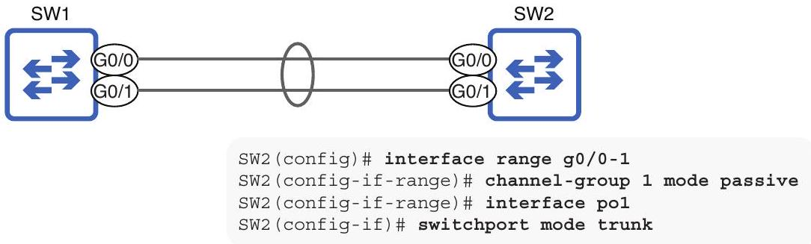
Figure 16.7 An EtherChannel is formed between SW1 and SW2 using LACP. SW1's GO/0 and G0/1 ports are configured in LACP active mode, and SW2's GO/0 and G0/1 ports are configured in LACP passive mode. switchport mode trunk is applied to each switch's port channel interface to make the EtherChannel a trunk.

The most relevant difference is the keywords used with the channel-group command when configuring an LACP EtherChannel; active and passive instead of PAgP's desirable and auto. The following LACP mode combinations will result in an EtherChannel:

- active + active = yes
- active + passive = yes
- passive + passive = no

LACP's active mode is equivalent to PAgP's desirable mode; ports in active mode will actively attempt to form an EtherChannel with the neighboring switch by sending LACP messages. Likewise, LACP's passive mode is equivalent to PAgP's auto mode; ports in passive mode won't actively attempt to form an EtherChannel but will respond if connected to a neighbor using active mode.

NOTE The LACP and PAgP modes cannot be used together. For example, active (LACP) + desirable (PAgP) will not result in a valid EtherChannel. Protocols are like languages: the devices have to use the same language to communicate successfully.

A second difference between LACP and PAgP is that LACP supports up to 16 links in a single EtherChannel, whereas PAgP only supports 8. However, although LACP supports up to 16 links in an EtherChannel, only up to 8 links can be used at once; the remaining links will be inactive, waiting to take over if an active link fails.

In the following example, I configure an EtherChannel between SW1 and SW2 using LACP and enable trunk mode, as we saw in figure 16.7. Aside from the use of the active and passive keywords, the configurations are identical to the PAgP configurations we did previously:

```
SW1(config)# interface range g0/0-1
SW1(config-if-range) # channel-group 1 mode active
SW1(config-if-range) # interface po1
SW1(config-if)# switchport mode trunk
SW2(config)# interface range g0/0-1
SW2(config-if-range) # channel-group 1 mode passive
SW2(config-if-range) # interface po1
SW2(config-if)# switchport mode trunk
SW2(config-if) # do show etherchannel summary
Flags: D - down P - bundled in port-channel
    I - stand-alone s - suspended
    H - Hot-standby (LACP only)
    R - Layer3 S - Layer2
    U - in use N - not in use, no aggregation
. . .
Group Port-channel Protocol Ports
------+-------------+-----------+-----------------------------------------------
1 Po1 (SU)
    LACP GiO/O(P) GiO/1(P)
```

The SU flags on Po1 and the P flag on G0/0 and G0/1 indicate an operational Layer 2 EtherChannel.

In addition to show etherchannel summary, we can verify the status of an LACP EtherChannel with the show lacp neighbor command. In the following example, I use the command on SW1, and the output shows information about SW1's neighbor (SW2):

```
Flag A means the neighbor port is in
Flag A means the neighbor port is in
active mode, and flag P means the
active mode, and flag P means the
neighbor port is in passive mode.
neighbor port is in passive mode.
Flags: S - Device is requesting Slow LACPDUs
F - Device is requesting Fast LACPDUs
A - Device is in Active mode P - Device is in Passive mode
Channel group 1 neighbors
Partner's information:
```

|  |  | LACP port |  |  | Admin | Oper | Port | Port |
| :--- | :--- | :--- | :--- | :--- | :--- | :--- | :--- | :--- |
| Port | Flags | Priority | Dev ID | Age | key | Key | Number | State |
| Gio/o | SP | 32768 | 5254.0004 .8000 | 10s | 0x0 | 0x1 | $0 \times 1$ | 0x3C |
| Gi0/1 | SP | 32768 | 5254.0004 . 8000 | 6 s | 0x0 | 0x1 | $0 \times 2$ | 0x3C |

Figure 16.8 A static EtherChannel is formed between SW1 and SW2. Both switches' ports are configured in on mode. switchport mode trunk is applied to each switch's port channel interface to make the EtherChannel a trunk.

SW2's ports have the P flag, so they are in passive mode (as we configured).

EXAM TIP Some exam questions might expect you to read between the lines. The previous output indicates that SW1's neighbor is using passive mode, so we can deduce that SW1 must be using active mode; if both switches were using passive mode, the EtherChannel would not form.

### 16.2.2 Static EtherChannel

Another option for configuring EtherChannels is to not use any negotiation protocol at all; this is called a static EtherChannel. Figure 16.8 shows a static EtherChannel between SW1 and SW2, with the relevant configurations.

```
SW1(config) # interface range g0/0-1
SW1(config-if-range) # channel-group 1 mode on
SW1(config-if-range) # interface po1
SW1(config-if) # switchport mode trunk
```

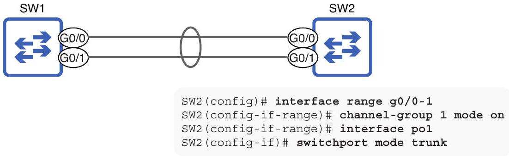
Figure 16.8 A static EtherChannel is formed between SW1 and SW2. Both switches' ports are configured in on mode. switchport mode trunk is applied to each switch's port channel interface to make the EtherChannel a trunk.

Whereas PAgP and LACP each have two separate modes, static EtherChannels use a single mode called on; for a static EtherChannel to work, both sides of the connection must be in on mode. When using on mode, neither switch sends any messages to negotiate the formation of an EtherChannel; the configured ports will form an EtherChannel regardless of the state of the neighboring device.

For this reason, it is highly recommended that you use PAgP or LACP instead of manual EtherChannels; the dynamic protocols will check to make sure the neighboring device's configurations are appropriate before forming an EtherChannel. In the worstcase scenario, an improperly configured EtherChannel can result in Layer 2 loops, which are disastrous for the LAN.

NOTE There are cases in which you have to use a static EtherChannel, such as when connecting a switch to a wireless LAN controller (WLC). We will cover WLCs in part 4 of volume 2 of this book.

Just as an EtherChannel will not form between a switch using PAgP and a switch using LACP, a static EtherChannel will not work if connected to a switch using PAgP or LACP. Table 16.1 shows which combinations of modes will result in an operational EtherChannel.

Table 16.1 EtherChannel mode combinations
| Modes | Desirable | Auto | Active | Passive | On |
| :--- | :--- | :--- | :--- | :--- | :--- |
| Desirable | Yes | Yes | No | No | No |
| Auto | Yes | No | No | No | No |
| Active | No | No | Yes | Yes | No |
| Passive | No | No | Yes | No | No |
| On | No | No | No | No | Yes |


### 16.2.3 Physical port configurations

When configuring EtherChannels, it's very important that various port settings match, both among the ports on the same switch and between neighboring switches. Following are some of the settings that must match among the ports of an EtherChannel:

- Speed
- Duplex
- Operational mode (access or trunk)
- Allowed VLANs and native VLAN (when in trunk mode)
- Access VLAN (when in access mode)

Rather than memorizing a list of settings that must match between an EtherChannel's ports, just ensure that all ports in the same EtherChannel are configured identically. Figure 16.9 shows what can happen when a port's settings don't match the other ports in the EtherChannel.
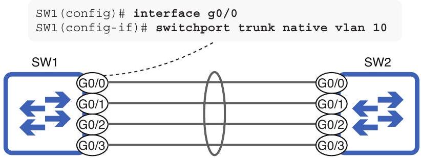

```
SW1# show etherchannel summary
Flags: D - down P - bundled in port-channel
    I - stand-alone s - suspended
. . .
Group Port-channel Protocol Ports
------+-------------+-----------+-----------------------------------------------
1 Po1(SU) LACP Gi0/0(s) Gi0/1(P) GiO/2(P)
    Gio/3(P)
```

Figure 16.9 Changing the native VLAN of GO/O causes it to be placed in a suspended state; it is disabled until its settings match the other ports in the EtherChannel.

NOTE Settings that don't have a direct effect on the port's operation, like a description configured with the description command, don't have to match.

Changing the native VLAN of SW1 G0/0 but not the other ports in the EtherChannel causes it to be suspended; it is unable to participate in the EtherChannel or forward frames at all until its settings match the other ports in the EtherChannel. In the following example, I restore SW1 G0/0's native VLAN to the default of 1 and check the EtherChannel's status; it is once again an active member of the EtherChannel:

```
SW1(config)# interface g0/0
SW1(config-if)# no switchport trunk native vlan 10
SW1(config-if)# do show etherchannel summary
Flags: D - down P - bundled in port-channel
    I - stand-alone s - suspended
. . .
Group Port-channel Protocol Ports
------+-------------+-----------+-----------------------------------------------
1 Po1(SU) LACP Gi0/0(P) Gi0/1(P) GiO/2(P)
    GiO/3(P)
```

SW1 G0/0's flag is now P; it is a functioning member of the EtherChannel again.

### 16.3 EtherChannel load balancing

After a switch's frame-forwarding logic has determined that a frame should be forwarded out of an EtherChannel, there is an additional check on the frame: the EtherChannel load-balancing logic examines the frame and uses certain parameters to determine which physical port the frame will be forwarded out of. Figure 16.10 demonstrates this concept.

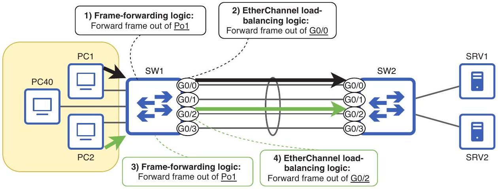
Figure 16.10 SW1's frame-forwarding logic determines that both frames will be forwarded out of Po1. However, the EtherChannel load-balancing logic determines that PC1's frame will be forwarded out of G0/0, and PC2's frame will be forwarded out of G0/2.

Frames forwarded over an EtherChannel are load-balanced over the EtherChannel's physical links by flow. A flow is a communication between two nodes; for example, if PC1 communicates with SRV1, all messages from PC1 to SRV1 are one flow, and all messages from SRV1 to PC1 are another flow. All messages in the same flow will be forwarded over the same physical link in the EtherChannel. Figure 16.11 shows an example; all messages from PC1 to SRV1 use the G0/0-G0/0 link, all messages from SRV1 to PC1 use the G0/1-G0/1 link, all messages from PC2 to SRV2 use the G0/2-G0/2 link, and all messages from SRV2 to PC2 use the G0/3-G0/3 link.

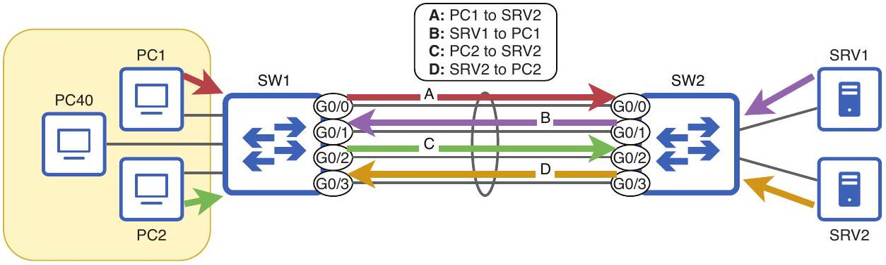
Figure 16.11 Messages forwarded over an EtherChannel are load-balanced based on flow. In this example, messages from PC1 to SRV1 use the G0/0-G0/0 link, messages from SRV1 to PC1 use the G0/1-G0/1 link, messages from PC2 to SRV2 use the G0/2-G0/2 link, and messages from SRV2 to PC2 use the G0/3-G0/3 link.

Keep in mind that figure 16.11 is just an example; EtherChannel load balancing won't always use all links of the EtherChannel equally. Fortunately, you can modify which parameter(s) the load-balancing logic takes into consideration with the port-channel load-balance parameters command in global config mode. Table 16.2 lists some possible parameters and their meanings.

Table 16.2 EtherChannel load-balancing parameters
| Parameter | Description |
| :--- | :--- |
| src-mac | All frames with the same source MAC address will use the same link. |
| dst-mac | All frames with the same destination MAC address will use the same link. |
| src-dst-mac | All frames with the same combination of source and destination MAC addresses will use the same link. |
| src-ip | All frames with the same source IP address (in the encapsulated packet) will use the same link. |
| dst-ip | All frames with the same destination IP address (in the encapsulated packet) will use the same link. |
| src-dst-ip | All frames with the same combination of source and destination IP addresses (in the encapsulated packet) will use the same link. |


NOTE The default EtherChannel load-balancing setting varies depending on the switch model and IOS version. On the switches I'm using for this chapter, the default setting is src-dst-ip. Some switches support additional parameters, too.

To check which parameters are used by the switch, use the show etherchannel load-balance command, as in the following example. Note the statement Non-IP: Source XOR Destination MAC address; this means that, for frames that don't encapsulate IP packets, the switch will use the source and destination MAC addresses instead. If there is no IP packet inside, there are no IP addresses to examine:
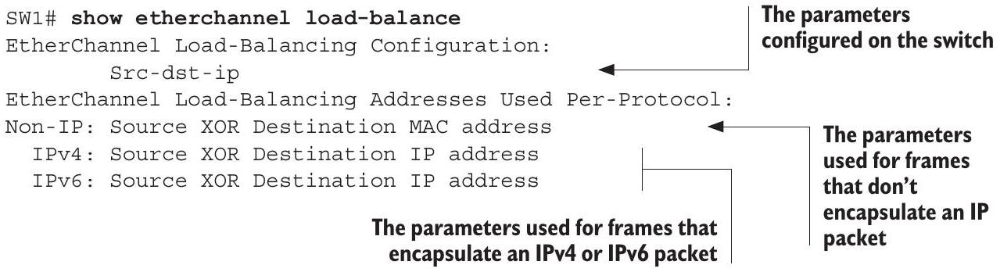

NOTE Although the configuration command is port-channel load-balance, the show command is show etherchannel load-balance-one of the great mysteries of Cisco IOS.

If it is determined that traffic isn't being evenly balanced over the links of an EtherChannel, changing the load-balancing parameters might help. For example, load balancing based only on the destination MAC address will cause all frames destined for the default gateway to use the same link, possibly causing congestion on that link. However, such determinations are beyond the scope of the CCNA; a general understanding of how EtherChannel load balancing works is sufficient.

## Lanes on a highway

EtherChannel can be compared to adding more lanes to a highway. Just as adding more lanes to a highway increases its total capacity, adding more links to an EtherChannel increases its total bandwidth-the total number of bits that can be transmitted over it per second. An EtherChannel's bandwidth is the total bandwidth of its member links.

However, adding more lanes to a highway doesn't increase the speed of each individual car; the speed limit remains the same. Likewise, adding more links to an EtherChannel doesn't increase the speed of each individual link; if an EtherChannel has four 1 Gbps links, the maximum speed of any particular communication over the EtherChannel is still 1 Gbps .

With that said, adding more lanes to a highway can reduce congestion and, thus, indirectly increase a car's speed by allowing it to drive at the speed limit without slowing down or stopping. Similarly, EtherChannel can reduce network congestion and thus increase the speed and efficiency of each communication flow.

In this context, the term bandwidth refers to the total capacity of a connection, and speed refers to the maximum transfer rate of a particular communication.

### 16.4 Layer 3 EtherChannel

Up to this point, we have covered Layer 2 EtherChannels-EtherChannels consisting of switch ports that switch frames rather than routed ports that route packets. However, we can also configure Layer 3 EtherChannels consisting of routed ports. Remember, on multilayer switches, you can use the no switchport command on a port to make it a routed port capable of forwarding packets like a router.

NOTE Some router models also support Layer 3 EtherChannels, but we will focus on configuring Layer 3 EtherChannels on multilayer switches. EtherChannel is most commonly used on switches rather than routers.

Because routed ports don't pose a risk of causing Layer 2 loops and, therefore, won't be disabled by STP, the benefits of Layer 3 EtherChannels are fewer than those of Layer 2 EtherChannels. However, they provide a simple way to load-balance packets over multiple links and can be easier to manage than multiple independent Layer 3 links; configuring IP addressing and routing for one logical interface is simpler than doing so for multiple independent interfaces.

Figure 16.12 shows a situation where you might want to use a Layer 3 EtherChannel: two LANs are connected via multilayer switches. Each LAN has a Layer 2 switch connected to a multilayer switch via a Layer 2 EtherChannel, and the two multilayer switches are connected via a Layer 3 EtherChannel.

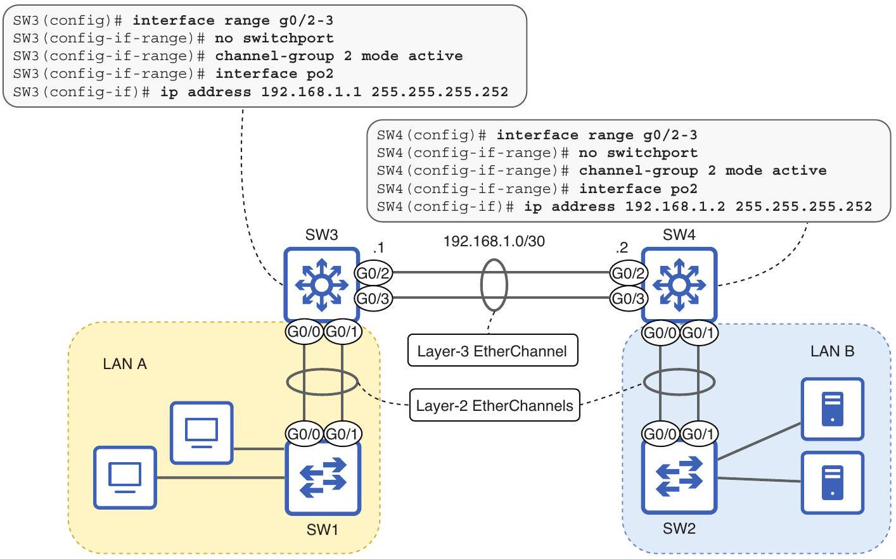
Figure 16.12 Two LANs connected via multilayer switches using Layer 3 EtherChannel. Additionally, the Layer 2 switch in each LAN uses Layer 2 EtherChannel to connect to the LAN's multilayer switch. The Layer 3 EtherChannel configuration is depicted.

Like Layer 2 EtherChannels, Layer 3 EtherChannels can be configured dynamically using PAgP, LACP, or statically with on mode. The only additions are the no switchport command to make routed ports and an IP address configured on the port channel interface. The following example shows the configuration of SW3's Layer 3 EtherChannel, as we saw in figure 16.12 using LACP as the negotiation protocol. Note that I use group 2 for this EtherChannel because group 1 is used by the Layer 2 EtherChannel connecting SW3 to SW1:
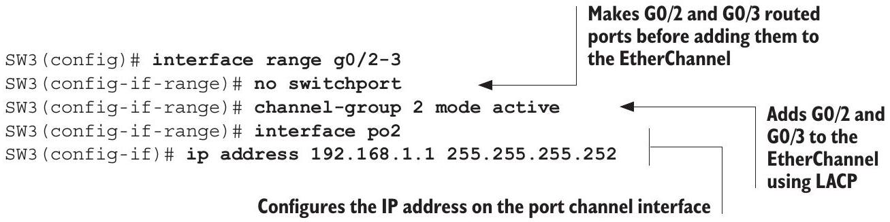

NOTE Make sure to configure the IP address on the port channel interface, not any of the member ports.

In the following example, I configure SW4's end of the connection and confirm the EtherChannel's status. Note that whereas Po1 (a Layer 2 EtherChannel connected to SW2) has the flags su, Po2 has the flags RU. R indicates a Layer 3 EtherChannel; think R for "routed port":

```
SW4(config)# interface range g0/2-3
SW4(config-if-range) # no switchport
SW4(config-if-range) # channel-group 2 mode active
SW4(config-if-range) # interface po2
SW4(config-if)# ip address 192.168.1.1 255.255.255.252
SW4(config-if-range)# do show etherchannel summary
Flags: D - down P - bundled in port-channel
    I - stand-alone s - suspended
    H - Hot-standby (LACP only)
    R - Layer3 S - Layer2
. . .
Group Port-channel Protocol Ports
------+-------------+-----------+-----------------------------------------------
1 Po1(SU) LACP Gi0/0(P) Gi0/1(P)
    Po2 (RU) LACP GiO/2(P) GiO/3(P)
        Po2 is a Layer 3
        EtherChannel.
```


## Summary

- EtherChannel combines multiple physical links into a single logical link. This allows multiple links between two switches to all remain in the STP forwarding state without causing Layer 2 loops.
- BUM frames received on a port that is a member of an EtherChannel will not be flooded out of other ports in the same EtherChannel.
- EtherChannel does not entirely remove the need for STP. In the context of a larger LAN, some EtherChannels may need to be disabled by STP.
- There are two main ways to configure EtherChannels: dynamic and static.
- Dynamic EtherChannels use one of two protocols-PAgP or LACP-to negotiate an EtherChannel between two neighboring switches.
- Port Aggregation Protocol (PAgP) is a Cisco-proprietary EtherChannel negotiation protocol that uses two modes: desirable and auto.
- Link Aggregation Control Protocol (LACP) is a standard EtherChannel negotiation protocol standardized by IEEE 802.3ad. It uses two modes: active and passive.
- desirable mode in PAgP actively tries to form an EtherChannel. auto mode does not actively try to form an EtherChannel but will form an EtherChannel with a neighbor in desirable mode.

- You can configure PAgP on a port with the channel-group group-number mode \{desirable | auto\} command in interface config mode. The group-number identifies which EtherChannel the port is a member of and is locally significant.
- After assigning a port to an EtherChannel, a logical port channel interface is automatically created. You should configure the relevant settings on the port channel interface (i.e., access or trunk mode).
- Use the show etherchannel summary command to check the status of EtherChannels on the switch.
- Commands configured on the port channel interface are inherited by the member ports, and vice versa. However, it is recommended that you configure port settings on the port channel interface to ensure consistency.
- Use the show pagp neighbor command to view information about the switch's neighbors using PAgP.
- Whereas PAgP supports EtherChannels of up to 8 links, LACP supports up to 16 links. However, only up to 8 links can be used at once; the others will act as standby links, ready to take over if an active link fails.
- active mode in LACP is equivalent to PAgP's desirable mode, and passive mode is equivalent to PAgP's auto mode. Otherwise, EtherChannel configuration and verification are identical to PAgP.
- You can configure LACP on a port with the channel-group group-number mode \{active | passive\} command in interface config mode.
- Use the show lacp neighbor command to view information about the switch's neighbors using LACP.
- Static EtherChannels do not use a protocol to negotiate EtherChannel formation. Ports are configured to statically form an EtherChannel without negotiating with the neighboring switch.
- Use the channel-group group-number mode on command to configure a port as a member of a static EtherChannel.
- An EtherChannel will not form between switch ports using a different negotiation protocol (PAgP or LACP) or between switch ports using a negotiation protocol and switch ports configured with mode on.
- The settings of an EtherChannel's member ports must match. For example, speed, duplex, operational mode (access or trunk), allowed VLANs, native VLAN, and access VLAN settings must match.
- If a switch's frame-switching logic determines that a frame should be forwarded or flooded out of an EtherChannel, an additional check determines which physical port the frame should be sent out of.
- Frames forwarded over an EtherChannel are load-balanced by flow. A flow is a communication between two nodes.

- The parameters a switch uses to identify flows can be configured with the port-channel load-balance parameters command in global config mode. Example parameters are src-dst-mac and src-dst-ip.
- Use the show etherchannel load-balance command to check which parameters the switch is using to identify flows for EtherChannel load balancing.
- EtherChannels are like highways: adding more links increases the Ether-Channel's total capacity (bandwidth) but doesn't increase the maximum speed of any communication over the EtherChannel.
- An EtherChannel consisting of switch ports (that switch frames) is a Layer 2 EtherChannel. An EtherChannel consisting of routed ports (the route packets) is a Layer 3 EtherChannel.
- To configure a Layer 3 EtherChannel, use the no switchport command on the member ports before using the channel-group command. Then, configure an IP address on the port channel interface (not the individual member ports).

Licensed to Luke Chen [mic215fa@gmail.com](mailto:mic215fa@gmail.com)
