## Dynamic routing

## This chapter covers

- The advantages of dynamic routing over static routing
- The types of dynamic routing protocols
- How a router decides which routes to enter in its routing table
- Activating dynamic routing protocols with the network command

After focusing on Layer 2 concepts for the previous several chapters, in this chapter, we return to the topic of routing-how routers forward packets between networks. In chapter 9, we learned about static routing, in which an administrator manually configures routes to build a router's routing table. When using dynamic routing, the topic of this chapter, routers communicate with each other and build their routing tables automatically. Although static routing has its uses, dynamic routing provides several advantages that we will examine in this chapter. We will cover elements of the following exam topics:

- 3.1 Interpret the components of routing table
- 3.2 Determine how a router makes a forwarding decision by default

- 3.3 Configure and verify IPv4 and IPv6 static routing
- 3.4 Configure and verify OSPFv2

### 17.1 Dynamic routing vs. static routing

Dynamic routing is a process by which routers share information about the network with each other, allowing them to build their routing tables without the need for an administrator to manually configure each route. They do this using a routing protocol-a protocol that defines how routers communicate with each other to share routing information and how they use that information to build their routing tables. We will cover the different kinds of routing protocols in section 17.2.

Figure 17.1 shows an example of how routing protocols work. R1, R2, and R3 use a routing protocol to exchange messages, informing each other of their known networks. Each router will use this information to build its routing table, without requiring an administrator to manually configure the routes.

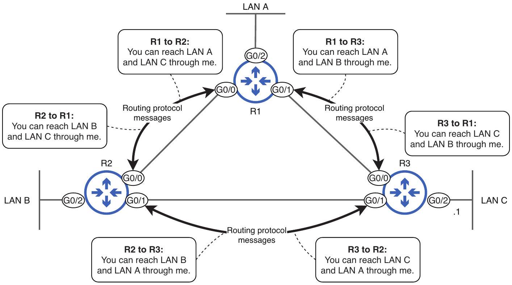
Figure 17.1 R1, R2, and R3 use a routing protocol to share routing information with each other. Each router will use this information to build its routing table.

NOTE Sharing of routing information is also called advertisement. R1, R2, and R3 advertise their known networks to each other.

Dynamic routing provides several advantages over static routing, such as adaptability and scalability. Let's take a closer look at those two advantages.

### 17.1.1 Adaptability

Static routes, as the name implies, are static and unchanging; they are incapable of reacting to changes in the network. If a route becomes invalid due to a hardware failure on one of the routers in the path, the static route won't adjust automatically to find an alternate path. Figure 17.2 shows an example: the R2-R3 link goes down due to a hardware failure. This causes R3 to remove its route to 192.168.30.0/24 from its routing table; it can no longer reach the next-hop IP address. R1, however, is unaware of the link's failure. As a result, R1 keeps its route to 192.168.30.0/24 via R2 in its routing table, even though it is no longer a valid route to reach the destination.

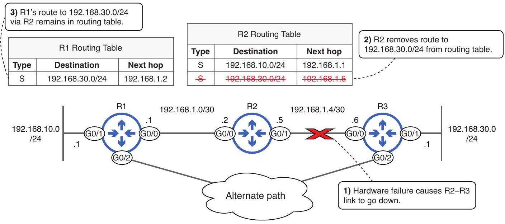
Figure 17.2 The static route on R1 is unable to adapt to a change in the network. (1) A hardware failure causes the R2-R3 link to go down. (2) R2 removes its route to 192.168.30.0/24 because it can no longer reach the next hop. (3) R1, unaware of the hardware failure, leaves its route to 192.168.30.0/24 via R2 in its routing table, despite the existence of an alternate path.

NOTE If a router cannot reach a route's next-hop IP address, it will remove the route from the routing table. This applies to all kinds of routes and is why R2 removes its static route to 192.168.30.0/24 when the R2-R3 link fails.

Because R1's route to 192.168.30.0/24 via R2 remains in its routing table, it will continue to forward packets destined for hosts in the 192.168.30.0/24 network to R2. R2 then has no choice but to drop the packets because it has no route to 192.168.30.0/24 in its routing table. Figure 17.3 shows how dynamic routing fixes this; it allows R1 to automatically adapt to the network change, inserting a new route to the destination into its routing table.

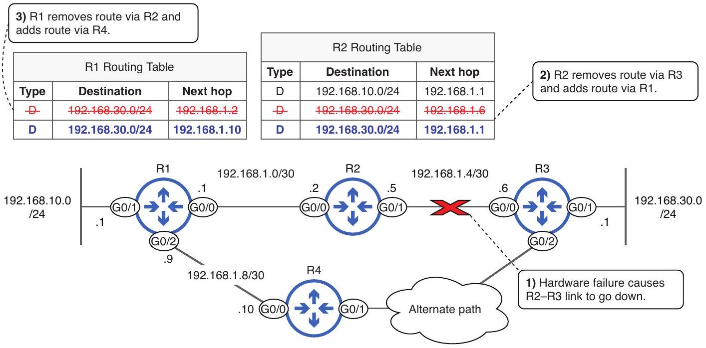
Figure 17.3 Dynamic routing allows routers to adapt to changes in the network by automatically calculating new routes. (1) A hardware failure causes the R2-R3 link to go down. (2) R2 removes its route to 192.168.30.0/24 via R3 and adds a new route with R1 as the next hop. (3) R1 removes its route via R2 and adds a new route with R4 as the next hop.

NOTE The route type of D in figure 17.3 indicates a route learned via the routing protocol Enhanced Interior Gateway Routing Protocol (EIGRP), which we will briefly cover in section 17.2. $D$ stands for Diffusing Update Algorithm (DUAL), the specific algorithm EIGRP uses to calculate routes.

In a matter of seconds after the failure, all routers in the network will be aware of the change and have new routes in their routing tables. And once the failed link is restored (perhaps a faulty cable is replaced), the routers will once again adapt to that change, returning their routing tables to their previous state. The adaptability of dynamic routing improves the resilience of the network; it is able to automatically recover from failures with minimal downtime. This is not possible in a network that exclusively uses static routing.

### 17.1.2 Scalability

Another major advantage of dynamic routing is scalability. While static routing may be practical for small networks, it becomes increasingly complex and unmanageable as the network grows. On the other hand, dynamic routing protocols easily scale to support very large and complex networks. Figure 17.4 shows a network of six routers, each connected to a LAN containing various subnets. Additionally, two routers have connections to an ISP. This is a fairly simple network, but even in a network of this size, manually configuring static routes to every destination on each router is not very
practical. A simpler option is to enable a routing protocol on each router and let them share the routing information themselves.

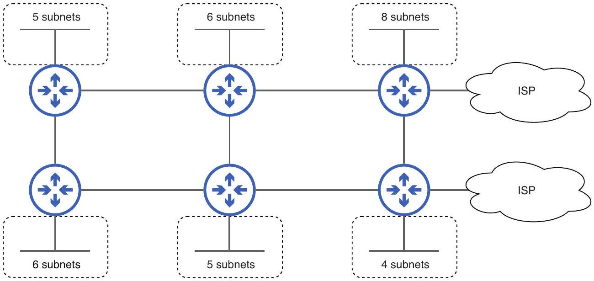
Figure 17.4 Configuring static routes to every destination on each router, even in a fairly small network like this, is not practical; it would be both time-consuming and prone to human error.

Before we move on to examine the different types of routing protocols, it is worth mentioning that static routes have their own advantages, such as predictability and control. Because static routing involves manually configuring routes (specifying the next hop for each destination), they are useful in situations where you want to control the exact path that packets take. Fortunately, there is no need to choose between static and dynamic routing; you can use a combination of static and dynamic routing on a single router.

### 17.2 Types of routing protocols

Routing protocols can be divided into two main categories: Interior Gateway Protocols (IGP) and Exterior Gateway Protocols (EGP). IGPs are used to exchange routing information within a single autonomous system (AS)-the network of a single organization. EGPs, on the other hand, are used to exchange routing information between different autonomous systems, such as between an enterprise and an ISP or between two ISPs.

NOTE Gateway is an old term for a router. Although we call them routers these days, the term gateway is still used in some contexts (such as default gateway, as we covered in chapter 9).

Figure 17.5 demonstrates the difference between IGPs and EGPs. Each organization in the diagram uses an IGP to exchange routing information within their organization but an EGP to exchange routing information with other organizations.

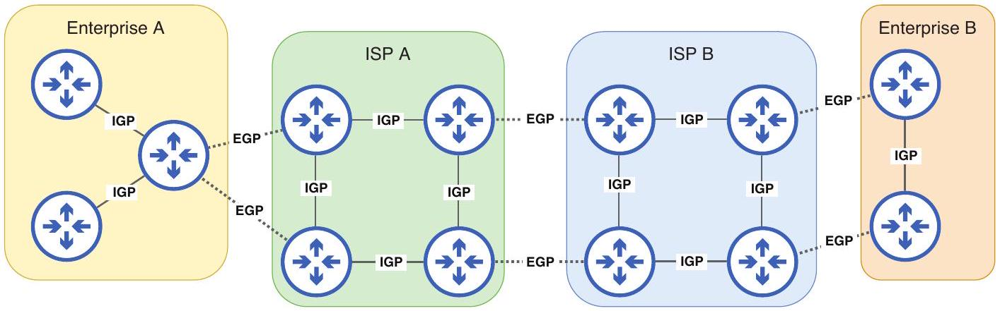
Figure 17.5 IGPs are used to exchange routing information with routers in the same AS (connected with solid lines). EGPs are used to exchange routing information with routers in a different AS (connected with dotted lines).

Although the CCNA exam focuses on one specific routing protocol (OSPF), you are also expected to understand some fundamental information about other routing protocols. Figure 17.6 lists the routing protocols that are commonly used today. In addition to being categorized as either an IGP or EGP, the routing protocols can be further categorized by algorithm type, which describes how the routers share information and calculate routes.

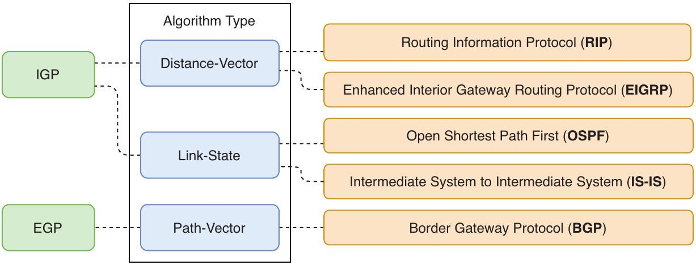
Figure 17.6 The five routing protocols in common use today. IGPs can be categorized as distancevector or link-state. The two distance-vector IGPs are RIP and EIGRP. The two link-state IGPs are OSPF and IS-IS. The only exterior gateway protocol in use today, Border Gateway Protocol, uses a path-vector algorithm.

### 17.2.1 Interior gateway protocols

IGPs use one of two algorithm types: distance-vector and link-state. In this section, we'll take a look at the basic characteristics of each.

## Distance-vector protocols

There are two main distance-vector routing protocols in use today: the industrystandard Routing Information Protocol (RIP) and the Cisco-developed Enhanced Interior

Gateway Routing Protocol (EIGRP). RIP is a very simple protocol that is usually only used in very small networks and labs. EIGRP, on the other hand, is more advanced than RIP-in fact, it's sometimes called an advanced distance-vector protocol-and is in use in many large-scale networks today.

NOTE Although EIGRP was developed by Cisco, most of its functionality was released to the public in RFC 7868, so other vendors can implement it on their devices. However, very few other vendors have implemented it, so it's generally safe to say that EIGRP only runs on Cisco routers.

Routers using a distance-vector protocol share information about their known networks and their metric to reach those networks. Metrics are a similar concept to STP's root cost. Whereas the STP root cost is a measure of the efficiency of a path to the root bridge, a metric is a measure of the efficiency of a route to the destination network; we will cover metrics in section 17.3.1. Figure 17.7 shows how a router learns of a destination network (LAN A) with a distance-vector routing protocol. R1 learns of LAN A from two neighbors: R2 and R5. Because the route via R5 has a lower metric, R1 inserts the route via R5 into its routing table; a lower metric value is preferable.

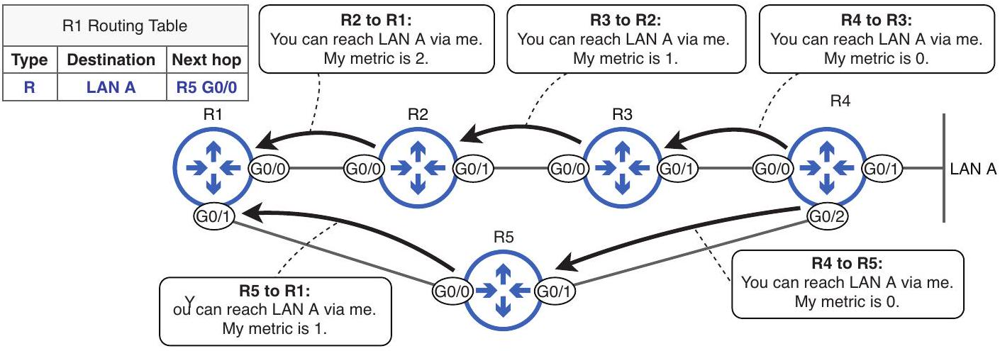
Figure 17.7 Routers share routing information with a distance-vector routing protocol. R1 learns of LAN A from both R2 and R5 but inserts the route via R5 into its routing table due to the lower metric value.

NOTE The route type of R in figure 17.7 indicates a route learned via the routing protocol RIP. The details of RIP aren't relevant to the CCNA exam.

The key characteristic of distance-vector routing protocols is that each router doesn't have a complete map of the network; for each destination network it learns about, it only knows the metric and next-hop router. Using the example of figure 17.7, R1 knows that to reach LAN A, it can forward packets to R2, which has a metric of 2, or R5, which has a metric of 1; it doesn't know the details of the network beyond R2 and R5, as shown in figure 17.8.

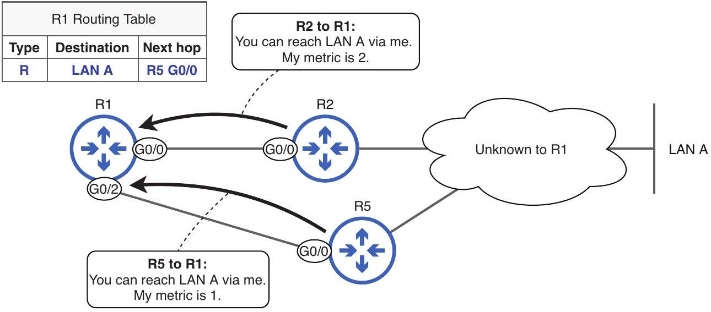
Figure 17.8 R1 learns of LAN A from R2 and R5 and selects a route based on that information. R1 is unaware of the details of the network beyond R2 and R5.

NOTE Distance-vector routing is sometimes called routing by rumor. Routers don't have a complete map of the network; they only know what their neighbors tell them.

## Link-state protocols

Like distance-vector routing protocols, there are two main link-state routing protocols in use today: Intermediate System to Intermediate System (IS-IS) and Open Shortest Path First (OSPF), both of which are industry-standard protocols. IS-IS is most commonly used in service-provider networks (such as ISP networks) and is not a topic on the CCNA exam; we won't cover it any further in this book. On the other hand, OSPF is one of the major topics of the CCNA exam, and we will cover it in detail in chapter 18.

When using a link-state routing protocol, each router creates a connectivity map of the network. To allow all routers to build their connectivity map, each router shares information about its connected links and the state of those links (the connected subnets, metric cost, etc.)-hence the name link state. This information is not shared only with directly connected neighbors; it is shared with all routers in the network, so they can all build the same connectivity map. Each router then uses this map of the network to calculate its best route to each destination in the network. Figure 17.9 demonstrates this concept; R1 builds a connectivity map and uses it to calculate a route to LAN A.

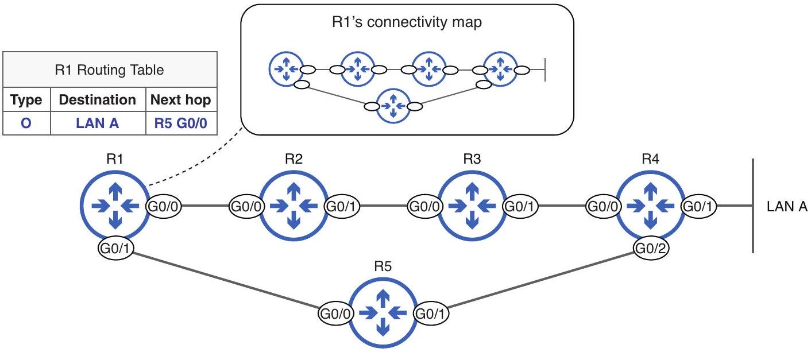
Figure 17.9 R1 builds a connectivity map of the network and uses it to calculate a route to LAN A.

NOTE The route type of O in figure 17.9 indicates a route learned via the routing protocol OSPF, the topic of chapter 18.

Building this map of the network and using it to calculate routes requires more CPU and memory resources on the router than required by distance-vector routing protocols, which can be a concern in very large networks. The map is stored in memory using a structure called the link-state database (LSDB), and calculating routes from the LSDB can be CPU-intensive. However, there are methods to overcome this limitation, such as dividing the network into areas, which we'll cover in chapter 18.

### 17.2.2 Exterior gateway protocols

In modern networks, only a single EGP is widely used: Border Gateway Protocol (BGP). BGP uses a path-vector algorithm to calculate routes. Like the two IGP algorithm types, the name path-vector gives us a hint about how BGP works. The path is the series of autonomous systems a packet will travel through along the route to the destinationfor example, perhaps it will travel through two different ISPs before reaching the destination AS.

Figure 17.10 demonstrates path-vector logic: packets from R1 to destinations in Enterprise B will travel through ISP A and ISP B and then reach Enterprise B. R1 learns of this route by communicating with ISP A using BGP. Rather than making routing decisions based on the series of individual routers that packets will travel through, BGP makes routing decisions based on the series of autonomous systems they will travel through (each AS likely consisting of multiple routers).

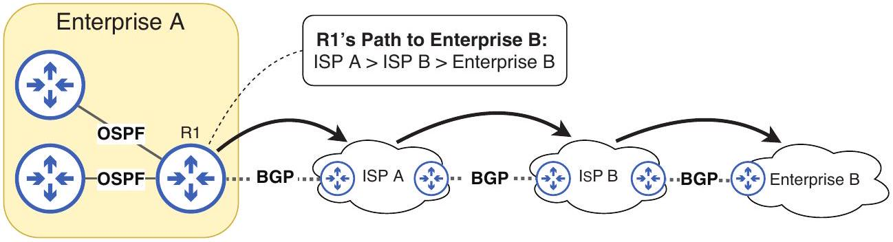
Figure 17.10 R1's path to Enterprise B passes through ISP A and ISP B and then arrives at Enterprise B. Path-vector logic is AS-to-AS, rather than router-to-router.

NOTE Figure 17.10 is a simplification of how BGP works. BGP takes multiple attributes of the path into account, not just the number of autonomous systems.

### 17.3 Route selection

Route selection is something we already covered in chapter 9. That definition of route selection referred to packet forwarding; when a router forwards a packet, it will select the most specific matching route in the routing table.

However, route selection can also refer to the process of selecting which routes are used to populate the routing table. Routes learned via a dynamic routing protocol aren't automatically inserted into the router's routing table. Likewise, manually configured static routes don't necessarily enter the routing table either. If a route isn't in the routing table, it can't be used to forward packets. To summarize, the following are the two meanings of the term route selection:

- Routing table population-The process of selecting which routes the router will enter into its routing table
- Packet forwarding-The process of selecting the best route in the routing table to forward a particular packet

If a router learns multiple routes to the same destination, it will only insert the best route to that destination into its routing table. To determine which route is best, it will compare two parameters: metric and administrative distance.

### 17.3.1 The metric parameter

We already saw an example of how metrics work in figure 17.7. R1 learned two routes to reach LAN A: one with a metric of 2 and one with a metric of 1. Which of the two routes did R1 insert into its routing table? R1 selected the latter route because of its lower metric.

Each routing protocol's metric is calculated differently. RIP uses a simple hop count: the number of routers between the router and the destination is the route's metric. OSPF uses a cost value that is calculated from the bandwidth of each link in the path.

EIGRP uses a more complex calculation based on bandwidth and delay (how long it takes bits to travel across a link), as well as other parameters. Table 17.1 summarizes how RIP, EIGRP, and OSPF calculate metrics.

Table 17.1 IGP metrics
| IGP | Metric | Description |
| :--- | :--- | :--- |
| RIP | Hop count | Each router in the path counts as one hop. The total metric is the total number of hops to the destination. |
| EIGRP | Metric based on bandwidth and delay | A complex formula that can take into account many values. By default, bandwidth and delay are used. |
| OSPF | Cost | The cost of each link is calculated based on bandwidth. A route's metric is the total cost of each link in the path. |


Figure 17.11 shows an example of route selection in a network of routers that use OSPF to share routing information. R1 uses its connectivity map to calculate the possible routes to reach 192.168.3.0/24 and selects the best route for its routing table.

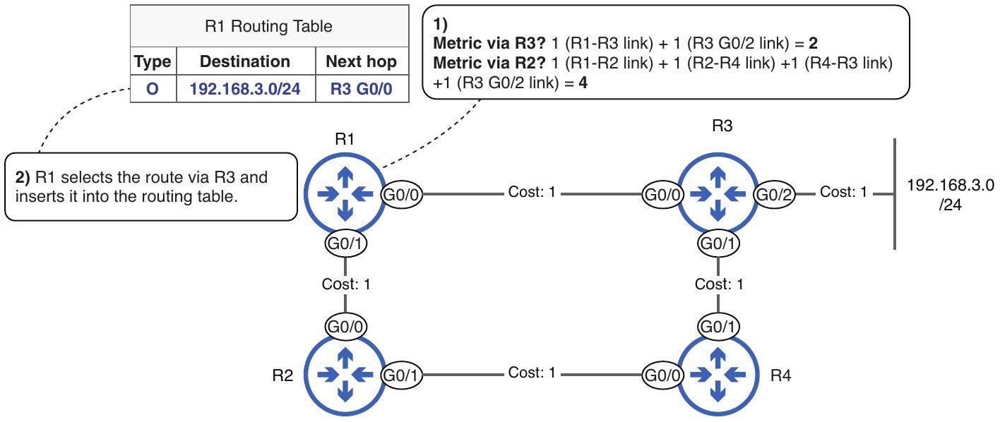
Figure 17.11 R1 inserts the best route to 192.168.3.0/24 into its routing table. (1) R1 calculates the possible routes to 192.168.3.0/24. The route via R3 has a metric of 2, and the route via R2 has a metric of 4. (2) R1 selects the route via R3 because of its lower metric and inserts the route into its routing table.

The following example shows the route in R1's routing table. Pay attention to the two values in square brackets:

```
R1# show ip route
. . .
O 192.168.3.0/24 [110/2] via 192.168.1.6, 00:08:35, GigabitEthernet0/0
```

After the destination network of 192.168.3.0/24, the route includes two values in square brackets: [110/2]. The first value (110) is the route's administrative distance (covered in section 17.3.2), and the second value (2) is the route's metric. In the following example, I disable R1's G0/0 interface, which renders the route via R3 invalid. I then check the routing table again; the alternate route via R2, with a metric of 4, is inserted into the routing table in place of the route via R3:

```
R1(config) # interface g0/0
R1(config-if) # shutdown
R1(config-if) # do show ip route
. . .
0 192.168.3.0/24 [110/4] via 192.168.1.2, 00:00:04, GigabitEthernet0/1
```

The route via R2 (metric 4) is selected after the router via R3 (metric 2) is removed.

### 17.3.2 The administrative distance parameter

Although most routers will only run one routing protocol, there are cases where a router will run multiple protocols-for example, if two enterprises (running different routing protocols) connect their networks to enable communication between them. When running multiple routing protocols, a router can learn about the same destination network from different routing protocols. In such cases, the router needs a way to compare the routes to determine which should enter the routing table.

Each routing protocol uses different parameters to determine a route's metric: RIP uses a simple hop count, OSPF uses a cost based on bandwidth, and EIGRP's metric is calculated using a formula that can take many different factors into account. BGP's route selection process, which is beyond the scope of the CCNA exam, is far more complicated than a simple metric value. Because each routing protocol's metric is different, they can't be directly compared; it would be like asking, "Which is better: 20 kilograms or 10 kilometers?" If a router learns multiple routes to the same destination network from different routing protocols, it needs to use something else to select which route enters the routing table.

That is the role of administrative distance (AD). AD is a value that indicates how preferred a routing protocol is. A lower AD value indicates a routing protocol that IOS considers more "trustworthy"-more likely to select good routes. Whereas a metric is used to compare routes learned via the same routing protocol, AD is used to compare routes learned via different routing protocols. Table 17.2 lists the default AD values of some different routing protocols (including connected and static routes).

Table 17.2 Default AD values
| Route type/protocol | Default AD |
| :--- | :--- |
| Connected | 0 |
| Static | 1 |
| External BGP (EBGP) | 20 |
| EIGRP | 90 |
| OSPF | 110 |
| IS-IS | 115 |
| RIP | 120 |
| Internal BGP (IBGP) | 200 |
| Unusable route | 255 |


EXAM TIP Make sure you know these default AD values; I recommend using flashcards to memorize them.

As when comparing metric values, the lower AD value is preferred. Connected routes (the routes that are automatically added when you configure an IP address on an interface) have an AD of 0; they are always preferred over other route types. Static routes, with an AD of 1, are preferred over routes learned from any of the dynamic routing protocols by default; however, we'll cover how you can make them less preferred later in this section. The least-preferred AD value is 255. Cisco routers can use this value to mark a route unusable; it will be removed from the routing table.

Figure 17.12 shows an example in which AD is used to select which route enters the routing table. R1 learns of the destination network 10.0.0.0/24 via EIGRP and OSPF. Although the EIGRP route's metric value (3584) is numerically higher than the OSPF route's (4), that is irrelevant in this case; EIGRP and OSPF metric values can't be directly compared. Instead, AD is used to decide which route enters the routing table. EIGRP's AD (90) is lower than OSPF's (110), so R1 inserts the EIGRP route into its routing table.

NOTE Due to the formula EIGRP uses to calculate metrics, the metric values of EIGRP routes tend to be quite large compared to those of RIP and OSPF routes. Although this route's metric is 3584 (because R1 and the destination are only separated by a few routers), it's not rare for the metric of EIGRP routes to be in the range of tens or hundreds of thousands.

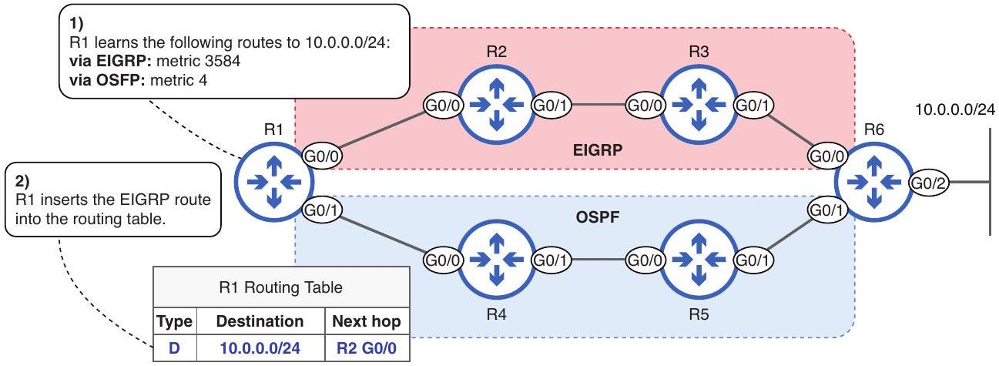
Figure 17.12 R1 uses AD to select which route enters the routing table. (1) R1 learns two routes to 10.0.0.0/24: via EIGRP (metric 3584) and via OSPF (metric 4). (2) EIGRP's AD (90) is lower than OSPF's (110), so R1 inserts the EIGRP route into its routing table. The metric values are irrelevant in this case.

The following example shows the EIGRP route in R1's routing table. Take note of the values in square brackets-EIGRP's AD is 90, and the route's metric is 3584:

```
R1# show ip route
. . .
D 10.0.0.0 [90/3584] via 192.168.12.2, 00:33:30, GigabitEthernet0/0
. . .
```

NOTE Metrics and AD are only used to compare routes to the same destination-the same destination network address with the same prefix length. If two routes have the same destination network address but a different prefix length (i.e., 192.168.0.0/24 and 192.168.0.0/25), they are considered different destinations; both routes will be inserted into the routing table. We will clarify this point in section 17.3.3.

## ECMP

Metrics are used to select among routes to the same destination that were learned via the same routing protocol, and AD is used to select among routes to the same destination that were learned via different routing protocols. But what happens if a router learns multiple routes to the same destination via the same routing protocol and the routes have the same metric? In that case, all routes will be added to the routing table, and traffic will be load-balanced over them; half of the traffic will be sent using one route and the other half using the other route. This is called equal-cost multi-path (ECMP) routing.

NOTE By default, a maximum of four routes to the same destination can be used for ECMP routing.

Figure 17.13 shows an example of ECMP. R1 learns two routes to 10.0.0.0/24: one from R2 and one from R4. Both routes are learned via OSPF and have a metric of 4. Therefore, R1 inserts both routes into the routing table; it will load-balance traffic over the two routes.

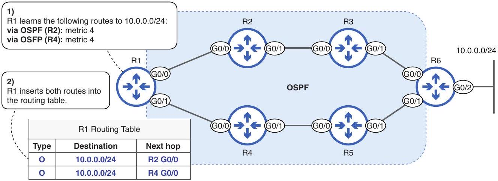
Figure 17.13 An example of ECMP routing. (1) R1 learns two routes to 10.0.0.0/24 via OSPF with the same metric: one from R2 and one from R4. (2) R1 inserts both routes into its routing table; it will load-balance traffic using the two routes.

## Floating static routes

By default, static routes have an AD of 1 and are thus preferred over routes learned using a dynamic routing protocol. However, there are cases where you might want to configure a static route as a backup that only enters the routing table if the main route (learned via a routing protocol) is lost. That is the role of floating static routes.

A floating static route is a static route configured with an AD greater than the default of 1 for the purpose of making it less preferred. For example, to make a static route less preferred than an OSPF route to the same destination, it should be configured with an AD greater than 110 (OSPF's AD). To configure a floating static route, just add the AD value to the end of the command. For example, you can configure a floating recursive static route with the ip route destination-network netmask next-hop ad command. Figure 17.14 shows an example in which I configure a static route with an AD of 111 to make it less preferable than a route learned via OSPF.

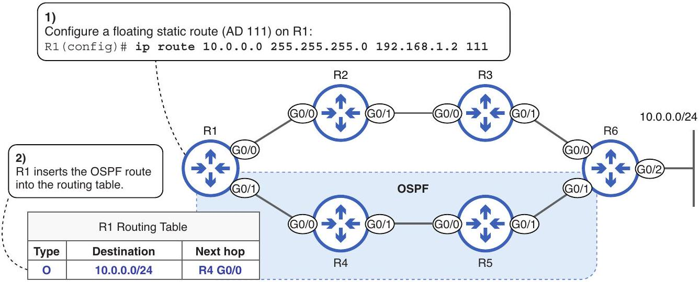
Figure 17.14 A floating static route is less preferred than an OSPF route to the same destination.

NOTE If you configure a floating static route with the same AD as a dynamic routing protocol, the static route will still be preferred. You should configure floating static routes with a higher AD than the routing protocol.

A floating static route serves as a backup route, offering a secondary path for data if the primary route fails. Although dynamic routing protocols also can provide the same functionality (by recalculating the next-best route if the current best route fails), a floating static route can provide a backup path via a router that the local router doesn't exchange routing information with-in figure 17.14, R1 has an OSPF neighbor relationship with R4 but not R2. Floating static routes also provide the benefits mentioned previously, such as control and predictability; they allow you to control exactly which path traffic will take if the primary route fails.

In the following example, I test the floating static route we saw in figure 17.14. When I first check R1's routing table, the OSPF route is present. I then disable R1's G0/1 interface (simulating a hardware failure) and check the routing table again; this time, the floating static route (with an AD of 111) has taken the place of the OSPF route:

```
R1(config)# do show ip route
. . .
O 10.0.0.0 [110/4] via 192.168.1.6, 00:25:43,
→GigabitEthernet0/1
. . .
R1(config) # interface g0/1
R1(config-if) # shutdown
R1(config)# do show ip route
. . .
S 10.0.0.0 [111/0] via 192.168.1.2
. . .
```

NOTE Static routes don't use the concept of metrics; their metric is always 0.

### 17.3.3 Route selection examples

Route selection in both of its meanings-routing table population and packet forwarding-is a very important topic for the CCNA exam. In this section, we'll look at some examples of each and clarify the concepts we have covered so far.

## Routing table population

Consider the following example. R1 learns the following routes via manual configuration and dynamic routing protocols:

- (A) 203.0.113.0/24 via static routing
- (B) 203.0.113.0/25 via RIP, metric 4
- (C) 203.0.113.0/26 via EIGRP, metric 5678
- (D) 203.0.113.0/27 via OSPF, metric 10

Which route(s) will R1 insert into its routing table? Having read up to this point, you may think that R1 will select the static route because it has the lowest AD. Or perhaps you think R1 will select the OSPF route because it has the longest prefix length (using the "most specific matching route" rule covered in chapter 9). However, the answer is that R1 will insert all four routes into its routing table.

The reason is that all four routes are to different destinations. Although they have the same destination network address (203.0.113.0), they all have different prefix lengths and are thus considered different destinations. There is no need to compare them; R1 will insert them all into the routing table.

It is worth noting that the four subnets in the example overlap, as shown in figure 17.15. The /25, /26, and /27 subnets are contained within the /24 subnet. However, when it comes to building the routing table, they are considered different destination networks and thus will all be inserted into the routing table.

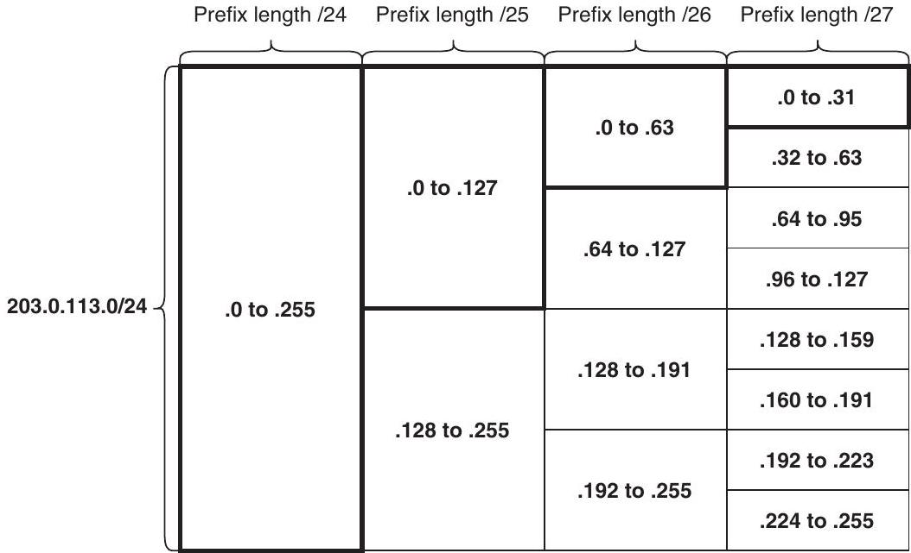
Figure 17.15 The four routes in the example overlap. 203.0.113.0/24 includes 203.0.113.0-.255, 203.0.113.0/25 includes 203.0.113.0-.127, 203.0.113.0/26 includes 203.0.113.0-.63, and 203.0.113.0/27 includes 203.0.113.0-.31. However, IOS considers them to be routes to different destinations and will insert all four routes into the routing table.

NOTE The concept of "most specific matching route" is irrelevant to this question. The most specific matching route rule is used to select which route in the routing table will be used to forward a packet; it is not used to select which routes will enter the routing table.

Let's take a look at one more example. R1 learns the following routes via dynamic routing protocols:

- (A) 10.0.0.0/8 via EIGRP, metric 2345
- (B) 10.0.0.0/8 via OSPF, metric 10
- (C) 10.0.0.0/16 via OSPF, metric 20
- (D) 10.0.0.0/16 via OSPF, metric 5

Which route(s) will R1 insert into its routing table in this example? Let's walk through the logic. In this example, R1 learns two routes to each of two different destination networks: two routes to 10.0.0.0/8 and two routes to 10.0.0.0/16. Therefore, R1 must select the best of the two routes to 10.0.0.0/8 and the best of the two routes to 10.0.0.0/16.

Which of the two routes to 10.0.0.0/8 will R1 prefer? Because R1 learns the two routes via different routing protocols, it will use AD to compare the routes. EIGRP's metric (90) is lower than OSPF's (110), so R1 will select the EIGRP route; therefore, A is one of the answers.

And which of the two routes to 10.0.0.0/16 will R1 prefer? In this case, both routes are learned via the same routing protocol, so R1 will compare their metric values to determine which route is preferable. Route D has the lower metric of the two, so it will be selected.

## Packet forwarding

The second aspect of route selection is packet forwarding-selecting which route in the routing table will be used to forward a particular packet. This process is simpler in that there is only one consideration: the most specific matching route. When forwarding a packet, the AD and metric values of routes are not considered.

However, identifying which route a router will select to forward a packet on can be difficult because the process of identifying which routes match a particular packet's destination and which of those matching routes is the most specific requires you to convert between binary and decimal. This is why I emphasized the importance of being comfortable with binary when covering IPv4 addressing and subnetting in previous chapters.

Let's look at an example of route selection in the context of packet forwarding. Examine R1's routing table in the following. Which route will it select to forward a packet destined for 203.0.113.65?

```
R1# show ip route
. . .
S 203.0.113.0/24 [1/0] via 192.168.1.2
R 203.0.113.0/25 [120/4] via 192.168.1.6
D 203.0.113.0/26 [90/5678] via 192.168.1.10
0 203.0.113.0/27 [110/10] via 192.168.1.14
```

The first step is to identify which routes match the packet's destination. As we covered in chapter 9, if the packet's destination IP address is a part of the network specified in the route, it's a match. In the following example, I have written out each route in binary, as well as the packet's destination IP address (203.0.113.65):
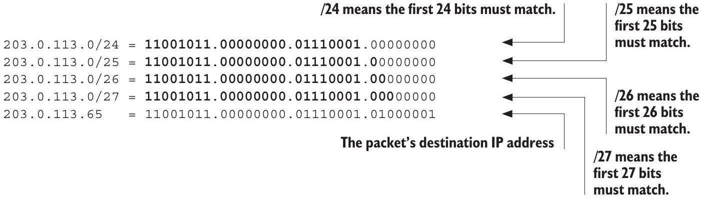

EXAM TIP To speed up the process during the exam, you don't have to write out all 32 bits of every address. In this example, the shortest prefix length is /24, and the four routes and the destination IP address all begin with 203.0.113, so there is no need to write out the first three octets of all of them (they're all the same); you can just write out the relevant octets (the final octet, in this case).

The route to 203.0.113.0/24 matches the packet's destination, and so does the route to 203.0.113.0/25. The route to 203.0.113.0/26 doesn't match the packet's destination because the 26th bit doesn't match; it's 0 in the route but 1 in the packet's destination IP address. Likewise, the /27 route doesn't match because of the mismatched 26th bit.

Out of the two matching routes, the route to 203.0.113.0/25 is more specific; it has the longer prefix length. Therefore, it is the route that will be selected to forward the packet; R1 will forward the packet to the next hop 192.168.1.6. The fact that the route has a higher AD than the other three routes is irrelevant, and so is the route's metric; when selecting which route will be used to forward a packet, the only consideration is the most specific matching route. To summarize, here are the two aspects of route selection:

- Routing table population:
    - Metrics are used to select among routes to the same destination that are learned via the same routing protocol.
    - AD is used to select among routes to the same destination that are learned via different routing protocols.
- Packet forwarding:
    - The most specific matching route is selected.

Exam scenarios
To achieve CCNA exam success, it's essential that you understand dynamic routing-especially the route selection topics covered in this chapter. We already covered a few example questions, but here are a couple more that test your knowledge of route selection:
(continued)

1 (multiple choice, multiple answers)
R1 learns the following routes via dynamic routing protocols and manual configuration. Which routes will R1 insert into its routing table? (Select three.)
    A 10.0.0.0/16 via EIGRP, next hop 172.16.1.2, metric 7812
    B 10.0.0.0/16 via EIGRP, next hop 172.16.23.2, metric 7812
    c 10.0.0.0/16 via OSPF, next hop 10.0.0.1, metric 5
    D 10.0.0.0/24 via EIGRP, next hop 172.16.1.2, metric 1098
    E 10.0.0.0/24 via static routing, next hop 10.2.2.2, default AD

In this scenario, R1 learns routes to two different destination networks: 10.0.0.0/16 and 10.0.0.0/24. Of the three routes to 10.0.0.0/16, A and B are preferred for their lower AD-EIGRP's 90 vs OSPF's 110. Both EIGRP routes have identical metric values (7812), so R1 will insert both into its routing table-an example of ECMP. So A and B are two of the correct answers.

Of the two routes to 10.0.0.0/24, E is preferred for its lower AD-as a static route, its default AD of 1 is lower than that of any dynamic routing protocol. So the third correct answer is E.

2 (multiple-choice, single answer)
R1 has built its routing table through a combination of dynamic and static routing. When forwarding a packet, which of the following is used to select which route is used to forward the packet?
    A Longest prefix length
    B Most specific matching route
    c Lowest AD
    D Lowest metric

Although a router uses AD and metrics to select which routes to insert into its routing table, packet forwarding is simpler: the router will forward the packet according to the most specific matching route in the routing table (the matching route with the longest prefix length). Option A touches on the "longest prefix length" aspect but misses the critical "matching" aspect. Having the longest prefix length doesn't necessarily mean that a route will be selected to forward a packet; the route must also match the packet's destination IP address. So B is the best answer for this question.

### 17.4 The network command

RIP, EIGRP, and OSPF are all configured by activating the protocol on one or more of the router's interfaces. The router will then advertise the network prefix (network address and netmask) of the interface. RIP and EIGRP configuration are out of the scope of the CCNA exam, and we will cover OSPF configuration in greater detail in chapter 18, but in this section, we will look at one command that is shared by all three protocols: the network command. This command tells the router to

- Look for interfaces with an IP address that is in the specified range
- Activate the routing protocol on those interfaces
- Advertise the network prefix of the interface(s) to its neighbors

Although RIP, EIGRP, and OSPF all share the network command, there are differences in syntax between them; we will focus on OSPF, since its configuration is a CCNA exam topic. To configure OSPF on a Cisco router, use the router ospf process-id command in global config mode to enter router config mode-a new configuration mode, from which you can use the network command.

NOTE A router can run separate OSPF processes (instances), which is why you must specify a process-id in the router ospf command. However, the use cases of multiple OSPF processes are beyond the scope of the CCNA exam.

Figure 17.16 shows how the network command can be used to activate OSPF on a router's interfaces. The syntax of the network command is network ip-address wildcard-mask area area-id. The key to this command is the wildcard mask, which looks like an inverted netmask but serves a different purpose.

NOTE OSPF uses areas to logically divide up the network; we will cover OSPF areas in chapter 18. For now, we will just specify area 0 in the network command.

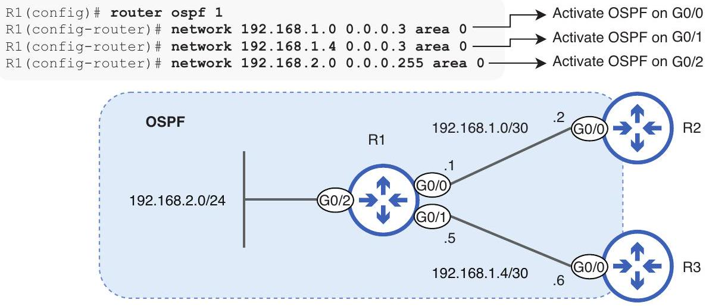
Figure 17.16 Activating OSPF on a router's interfaces with the network command. The command uses a wildcard mask, which looks like an inverted netmask.

A wildcard mask, like a netmask, is a series of 32 bits. The purpose of a wildcard mask is to indicate which bits need to match between two IP addresses and which bits don't. The wildcard mask in the network command specifies which bits have to match between the IP address in the network command and the IP address configured on a router's interface. A 0 bit in the wildcard mask means that the bits in the same position of the network command's IP address and the interface's IP address must match. A 1 bit in the wildcard mask means that the bits don't have to match.

Let's examine the three network commands used in figure 17.16. In the following example, I show the network command used to activate OSPF on R1's G0/0 interface. Note that the appropriate bits match between the network command's IP address (192.168.1.0) and R1 G0/0's IP address (192.168.1.1)-those specified by 0 bits in the wildcard mask:
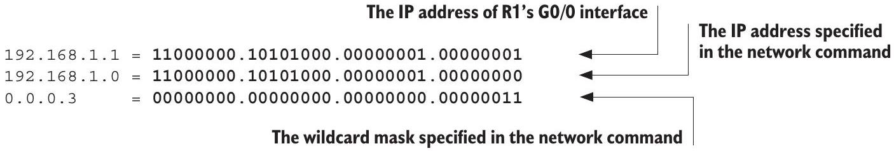
Next is the command I used to activate OSPF on R1's G0/1 interface. Once again, the appropriate bits match between the IP address specified in the network command and the IP address of G0/1:

In these two examples, I used a wildcard mask of 0.0.0.3, which is equivalent to a /30 netmask (255.255.255.252) with the bits inverted. Figure 17.17 demonstrates this: all 1 bits in the 255.255.255.252 netmask are 0 in the 0.0.0.3 wildcard mask and vice versa.

| Netmask | 255 |  |  |  |  |  |  | 255 |  |  |  |  |  | 255 |  |  |  |  |  |  | 252 |  |  |  |  |  |  |
| :--- | :--- | :--- | :--- | :--- | :--- | :--- | :--- | :--- | :--- | :--- | :--- | :--- | :--- | :--- | :--- | :--- | :--- | :--- | :--- | :--- | :--- | :--- | :--- | :--- | :--- | :--- | :--- |
|  | 1 | 1 | 1 | 1 | 1 |  | 1 | 1 | 1 | 1 | 1 | 1 | 1 | 1 | 1 | 1 | 1 | 1 | 1 |  | 1 | 1 | 1 | 1 | 1 | 1 | 0 |
| Wildcard Mask | 0 |  |  |  |  |  |  | 0 |  |  |  |  |  | 0 |  |  |  |  |  |  | 3 |  |  |  |  |  |  |
|  | 0 | 0 | 0 | 0 | 0 | 0 | 0 | 0 | 0 | 0 | 0 | 0 | 0 | 0 | 0 | 0 | 0 | 0 | 0 | 0 | 0 | 0 | 0 | 0 | 0 | 0 | 1 |

Figure 17.17 A / 30 netmask (255.255.255.252) and its equivalent wildcard mask (0.0.0.3). The 1 bits in the netmask are 0 in the wildcard mask and vice versa.

NOTE A shortcut to calculating a netmask's equivalent wildcard mask is to subtract each octet of the netmask from 255. The first three octets of a / 30 netmask are 255 and $255-255=0$. The final octet is 252 and $255-252=3$.

Finally, let's look at the command I used to activate OSPF on R1's G0/2 interface. This time, the interface's prefix length is $/ 24$, so I used the wildcard mask equivalent of a /24 netmask: 0.0.0.255:

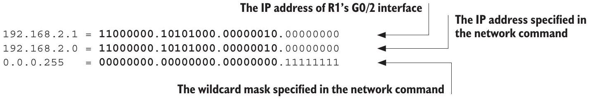
Table 17.3 lists some netmasks and their equivalent wildcard masks.

Table 17.3 /24+ netmasks and wildcard masks
| Prefix length | Netmask | Wildcard mask (last octet binary) |
| :--- | :--- | :--- |
| /24 | 255.255.255.0 | 0.0.0.255 (11111111) |
| /25 | 255.255.255.128 | 0.0.0.127 (01111111) |
| /26 | 255.255.255.192 | 0.0.0.63 (00111111) |
| /27 | 255.255.255.224 | 0.0.0.31 (00011111) |
| /28 | 255.255.255.240 | 0.0.0.15 (00001111) |
| /29 | 255.255.255.248 | 0.0.0.7 (00000111) |
| /30 | 255.255.255.252 | 0.0.0.3 (00000011) |
| /31 | 255.255.255.254 | 0.0.0.1 (00000001) |
| /32 | 255.255.255.255 | 0.0.0.0 (00000000) |


## Why wildcard masks?

You might wonder why we use wildcard masks instead of netmasks. The key is to recall what netmasks are used for: they identify the size of a network prefix, distinguishing between the network portion and the host portion of an IP address. For example, configuring ip address 192.168.1.1 255.255.255.0 on a router interface tells the router that its IP address is 192.168.1.1-the first three octets are the network portion, and the last octet is the host portion. The prefix is 192.168.1.0/24.

However, when dealing with the OSPF network command, the IP address and wildcard mask are used differently; they don't define a network prefix as a netmask would. Instead, they specify a range of IP addresses, not necessarily part of the same subnet. This range is used to determine which router interfaces will take part in OSPF, meaning which ones will send and receive OSPF routing information. Here's a quick recap:

- A netmask (or subnet mask) is used to distinguish the network and host portions of an IP address. It determines the length of a subnet's network prefix.
- In the context of the OSPF network command, an IP address and wildcard mask do not define a network prefix. Instead, they define a range of IP addresses (that aren't necessarily part of the same subnet). This range is used to determine which interfaces on the router will participate in the OSPF process (i.e., which interfaces will send and receive OSPF routing information).

In the three network commands we looked at, I used the network address (host portion of all 0s) of each interface and the wildcard mask that is equivalent to the netmask of each interface. However, it's important to note that the network command is flexible: as long as the appropriate bits match between the IP address in the network command and the interface's IP address (those indicated by a 0 bit in the wildcard mask), OSPF will be activated on the interface. Figure 17.18 shows a different way to activate OSPF on R1's interfaces, this time using only two network commands.

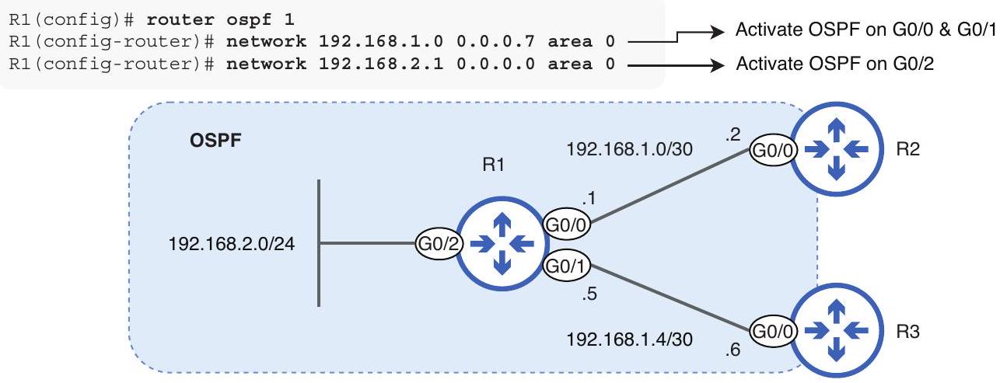
Figure 17.18 Activating OSPF on R1's interfaces with two network commands. The first command activates OSPF on R1's G0/0 and G0/1 interfaces, and the second activates OSPF on G0/2.

The first command activates OSPF on both G0/0 and G0/1; the appropriate bits of each interface's IP address match the IP address specified in the network command. By using a wildcard mask of 0.0.0.7-equivalent to a /29 netmask (255.255.255.248)-I tell R1 to activate OSPF on all interfaces with an IP address from 192.168.1.0 to 192.168.1.7, which includes G0/0 (192.168.1.1) and G0/1 (192.168.1.5):
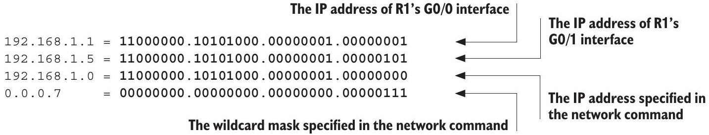

The second command activates OSPF on G0/2 in a different manner than in the previous example. By specifying G0/2's exact IP address in the network command and using a wildcard mask of 0.0.0.0-equivalent to a /32 netmask (255.255.255.255)-I tell R1 to activate OSPF only on the interface with IP address 192.168.2.1, R1's G0/2 interface:
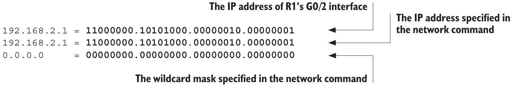

As we just saw, the network command is quite flexible. The result of the previous two examples (figures 17.17 and 17.18) is the same: OSPF is activated on R1's interfaces, and R1 will advertise the network address of its interfaces to its neighbors. However, the recommended method of using the network command is the last one we looked at: specify the exact IP address of the interface and use a wildcard mask of 0.0.0.0.

The reason for this recommendation is to prevent unintended activation of OSPF on interfaces. If you use a network command with a broader range of addresses, any interface with an IP address in that range will be included in the OSPF process. By specifying the exact IP address of the interface with a wildcard mask of 0.0.0.0, you ensure that only the desired interface is included.

NOTE A shortcut to activate OSPF on all interfaces is to use network 0.0.0.0 255.255.255.255 area 0. A wildcard mask of 255.255.255.255 is equivalent to a netmask of 0.0.0.0 and matches all possible IP addresses. This is handy for quickly activating OSPF in a lab setting but is not recommended in a real network.

There are two major misconceptions that many students have about the OSPF network command. The first is that the wildcard mask in the network command has to match the netmask of the interface. This is not the case, as we saw in the previous examples; as long as the correct bits match between the IP address in the network command and the interface's IP address-the bits specified by the wildcard mask-OSPF will be activated on the interface.

The second misconception is that the network command specifies which networks OSPF should advertise. It does not; rather, it specifies which interfaces OSPF should be activated on. The router will then advertise the network prefix of the interface. To clarify, let's look at what the two commands in figure 17.18 do. Here is the first command:

```
R1(config-router) # network 192.168.1.0 0.0.0.7 area 0
```

Although 0.0.0.7 is equivalent to a /29 netmask, this command does not tell R1 to advertise the 192.168.1.0/29 network. It tells R1 to do the following:

- Look for interfaces with an IP address in the 192.168.1.0 to 192.168.1.7 range:
    - R1 G0/0 and G0/1's IP addresses are in this range.
- Activate OSPF on those interfaces.
- Advertise the network prefix of the interfaces to neighbors:
    - R1 will advertise G0/0's prefix of 192.168.1.0/30 and G0/1's prefix of 192.168.1.4/30.

And here is the second command, used to activate OSPF on R1's G0/2 interface:

```
R1(config-router) # network 192.168.2.1 0.0.0.0 area 0
```

This command does not tell R1 to advertise 192.168.2.1/32 but rather to activate OSPF on the interface with an IP address of 192.168.2.1 (G0/2) and advertise that interface's network prefix, which is 192.168.2.0/24.

EXAM TIP In chapter 18, we will look at a more straightforward method to activate OSPF on a router's interfaces. However, for the CCNA exam, you should be familiar with the network command and wildcard masks.

## Summary

- Dynamic routing is a process by which routers share information about the network with each other, allowing them to build their routing tables automatically. They do this by using a routing protocol.
- Dynamic routing provides several advantages over static routing, such as adaptability and scalability.
- Static routing also has advantages over dynamic routing, such as predictability and control. Fortunately, both can be used at the same time.
- Routing protocols can be divided into two main categories: Interior Gateway Protocols (IGP) and Exterior Gateway Protocols (EGP).
- IGPs are used to exchange routing information within a single autonomous system (AS), and EGPs are used to exchange routing information between autonomous systems.
- IGPs can be categorized by the type of algorithm they use to share routing information and calculate routes: distance-vector or link-state.
- The two distance-vector IGPs are Routing Information Protocol (RIP) and Enhanced Interior Gateway Routing Protocol (EIGRP).
- The two link-state IGPs are Intermediate System to Intermediate System (IS-IS) and Open Shortest Path First (OSPF).
- Distance-vector routing is also called routing by rumor. The router doesn't have a complete map of the network; it only knows what its neighbors tell it.
- Routers using a link-state routing protocol build a "connectivity map" of the network and use that map to calculate routes to each destination.
- The only EGP in common use today is Border Gateway Protocol (BGP). It uses a path-vector algorithm, which calculates routes using AS-to-AS logic, rather than router-to-router; it's designed for larger-scale routing.
- The term route selection has two main meanings, one regarding routing table population and one regarding packet forwarding.

- In routing table population, route selection is the process of selecting which routes will enter the routing table. The router will use AD and metrics to select which routes enter the routing table.
- In packet forwarding, route selection is the process of selecting the best route in the routing table to forward a packet. The router will select the most specific matching route in the routing table to forward the packet.
- Only the best route to each destination will be added to the routing table and, therefore, be a candidate for packet forwarding. Routes that do not enter the routing table cannot be used to forward packets.
- A metric is a measure of the efficiency of a route. It is used to select among routes to the same destination (same network address and prefix length), learned via the same routing protocol.
- Each IGP uses a different metric. RIP uses hop count, EIGRP uses a metric based on bandwidth and delay (and other parameters), and OSPF uses a cost based on the bandwidth of each link.
- Because each protocol uses a different metric, metrics cannot be used to compare routes learned via different routing protocols.
- Administrative distance (AD) is a value that indicates how preferred a routing protocol is. A lower AD value is preferred and means that IOS considers the protocol more trustworthy-more likely to select good routes.
- AD is used to select among routes to the same destination, learned via different routing protocols.
- The default AD values are Connected = 0, Static = 1, eBGP = 20, EIGRP = 90, OSPF = 110, IS-IS = 115, RIP = 120, iBGP = 200, unusable = 255.
- If multiple routes to the same destination are learned via the same routing protocol and have the same metric, they will all be inserted into the routing table, and the router will load-balance traffic over the routes. This is called equal-cost multipath (ECMP) routing.
- A floating static route is a static route configured with an AD greater than the default of 1 for the purpose of making it less preferred. The command syntax is ip route destination-network netmask next-hop ad.
- Even if multiple routes have the same destination network address, their destinations are considered different if they have different prefix lengths. They will all be inserted into the routing table (i.e. 192.168.0.0/16, 192.168.0.0/17, and 192.168.0.0/18).
- The network command is used by RIP, EIGRP, and OSPF to activate the protocol on the router's interfaces. It is configured in router config mode.
- To enter router config mode for OSPF, use the command router ospf process-id. The syntax of the OSPF network command is network ip-address wildcard-mask area area-id.

- The network command tells the router to
    - Look for interfaces with an IP address in the specified range
    - Activate the routing protocol on those interfaces
    - Advertise the network prefix of the interface(s) to neighbors
- A wildcard mask is a series of 32 bits that indicates which bits have to match between two IP addresses. A 0 bit in the wildcard mask means the bits have to match, and a 1 bit in the wildcard mask means the bits don't have to match.
- A wildcard mask looks like an inverted netmask but serves a different purpose. A netmask indicates the network and host portions of an IP address, and a wildcard mask is used to specify a range of IP addresses (not necessarily in the same subnet).
- All 1 bits of a netmask are 0 in the equivalent wildcard mask and vice versa. For example, a /24 netmask is 255.255.255.0, and the equivalent wildcard mask is 0.0.0.255.
- If the appropriate bits match between the IP address in the network command and an interface's IP address, OSPF will be activated on the interface.
- The network command is flexible. The IP address and wildcard mask of the command don't have to be the same as the IP address and netmask of the interface. If the correct bits match between the network command's IP address and the interface's IP address, OSPF will be activated on the interface.
- It is recommended to specify the interface's exact IP address and use a /32 wildcard mask (0.0.0.0) in the network command to ensure that OSPF is activated only on the intended interface.
- A shortcut to activate OSPF on all interfaces is to use network 0.0.0.0 255.255.255.255 area 0, because this matches all possible IP addresses. This is a handy shortcut in a simulated lab, but it is not recommended in a real network.
- The IP address and wildcard mask in the network command do not determine which prefixes the router advertises. They determine which interfaces OSPF is activated on, and then the router advertises those interface's prefixes.
