## Open Shortest Path First

## This chapter covers

- Open Shortest Path First link-state advertisements and database
- How OSPF routers calculate routes
- Configuring OSPF on Cisco routers
- How OSPF routers become neighbors and form adjacencies

Open Shortest Path First (OSPF) is an interior gateway protocol (IGP) that serves as a key building block of modern enterprise networks. In chapter 17, we covered dynamic routing protocols in general and also examined how to use the network command to activate OSPF on router interfaces. In this chapter, we will dig deeper into the topic of OSPF and see how it actually works, including how OSPF-enabled routers become neighbors with each other, share routing information, calculate routes, and many other details.

These days, two versions of OSPF are in use: OSPFv2, which is primarily used for IPv4 networks, and OSPFv3, which is primarily used for IPv6 networks (although it can be used for IPv4 as well). For the purpose of the CCNA exam, the version we are concerned with is OSPFv2; all mentions of OSPF in this book are specifically referring to OSPFv2, as stated in exam topic 3.4: Configure and verify single area OSPFv2.

The name Open Shortest Path First has two aspects: Open means that it is an open standard protocol; OSPF is not Cisco proprietary. All vendors are free to implement

OSPF on their network devices. Shortest Path First (SPF) is the name of the algorithm used to calculate routes; it is also called Dijkstra's algorithm after its creator, Edsger Dijkstra.

### 18.1 OSPF foundations

There are three main steps that OSPF routers go through to share routing information and build their routing tables:

1 Form neighbor relationships with other OSPF-enabled routers.
2 Exchange routing information to build a connectivity map of the network.
3 Calculate the best routes to each destination.

Let's begin by examining the second and third steps of that process, and then we'll examine the details of how OSPF routers become neighbors in section 18.3.

### 18.1.1 The link-state database

When using a dynamic routing protocol, routers exchange routing information with each other and then use that information to calculate routes automatically. In OSPF, routers exchange routing information using data structures called link-state advertisements (LSA). Each router organizes the LSAs it receives in a database called the link-state database (LSDB). The LSDB serves as the router's map of the network topology, which is used for calculating the shortest path to each destination network; this is the "connectivity map" of the network that I mentioned in chapter 17.

Figure 18.1 shows how OSPF-enabled routers share LSAs to build the LSDB. Each router creates an LSA that includes information about its connected networks and then sends it to its neighboring routers, which will proceed to forward it to other routers in the OSPF area; OSPF areas are logical divisions of the network that we'll cover in section 18.1.2. The process of sending LSAs to all other routers in the OSPF area is called LSA flooding.

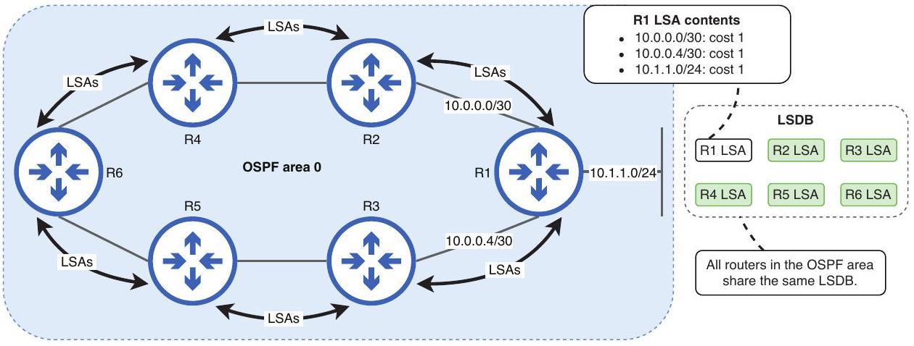
Figure 18.1 Routers flood LSAs within the OSPF area to ensure all routers have an identical LSDB. The LSAs that make up the LSDB contain information about each router's connected networks, such as their cost. R1's LSA indicates that it is connected to 10.0.0.0/30,10.0.0.4/30, and 10.1.1.0/24, each with a cost of 1.

It is essential that all routers in the area have the same LSDB, so each router can use the SPF algorithm to calculate routes to all destination networks. For example, the routers in figure 18.1 will use the LSDB to calculate a route to the 10.1.1.0/24 network. Using the LSDB, it is as if the routers are looking at the same diagram as us but with more detailed information about each link. This is in contrast to distance-vector routing protocols like RIP and EIGRP, in which each router does not have a complete map of the network.

### 18.1.2 OSPF areas

The network we saw in figure 18.1 was an example of single-area OSPF; the network is a single logical unit, and all routers in it share the same LSDB. In small networks, a single-area approach is nice and simple and doesn't have any major downsides. However, in a large network with dozens or hundreds of routers (instead of the six in figure 18.1), a single-area design has multiple negative effects:

- The larger LSDB takes up more memory resources on the routers.
- The SPF algorithm takes more time and CPU resources to calculate routes.
- A single change in the network (i.e., an interface going up or down) causes LSAs to flood the network and causes every router to run the SPF algorithm again.

By dividing a large OSPF network into multiple smaller areas, we minimize those negative effects. Smaller LSDBs mean OSPF uses fewer resources on routers, and the SPF algorithm doesn't take as much time to calculate routes. Network changes are only advertised within the local area, and if there is network instability (interfaces going up and down), its effects are limited to a single area.

An OSPF area can be defined as a set of routers that share the same LSDB. Although the CCNA exam topics list states that you should be able to "configure and verify single area OSPFv2," you also need a basic understanding of what an area is and the benefits of multi-area OSPF.

Figure 18.2 shows a multi-area OSPF network consisting of four areas. OSPF employs a two-level hierarchical structure consisting of a backbone area (area 0) and other non-backbone areas. All non-backbone areas must be connected to area 0, and traffic between areas must pass through area 0.

NOTE In single-area OSPF, it's highly recommended that you use area 0, although it is technically possible to use another area number. Using area 0 simplifies the process of expanding into multi-area OSPF in the future, if needed.

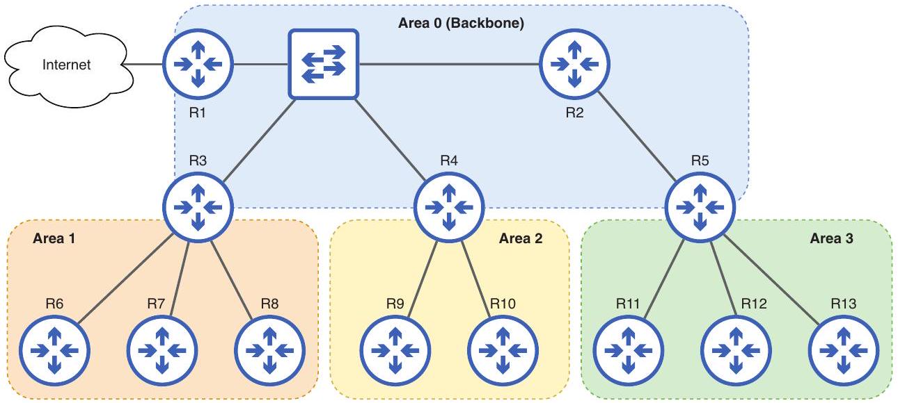
Figure 18.2 A multi-area OSPF network consisting of four areas. Area 0 is the backbone area to which other areas must connect. Areas 1, 2, and 3 are non-backbone areas, and traffic between them must pass through area 0.

OSPF distinguishes between four different types of routers. Table 18.1 summarizes these four router types and lists which routers in figure 18.2 are of each type; note that some routers fit into multiple categories.

Table 18.1 OSPF router types
| Router type | In figure 18.2 | Description |
| :--- | :--- | :--- |
| Internal router | R1, R2, R6, R7, R8, R9, R10, R11, R12, R13 | All OSPF-enabled interfaces are in the same area. |
| Backbone router | R1, R2, R3, R4, R5 | At least one interface is in area 0. |
| Area border router (ABR) | R3, R4, R5 | Routers that connect one (or more) areas to area 0 |
| Autonomous system boundary router (ASBR) | R1 | Routers that connect the OSPF autonomous system to external networks (i.e., the internet) |


NOTE Although R1 has an interface connected to the internet, that interface does not use OSPF and therefore does not affect its classification as an internal OSPF router.

An internal router has all of its OSPF-enabled interfaces in the same area, whether that is area 0 or a non-backbone area. A backbone router has at least one interface in the backbone area. An area border router connects one (or more) areas to area 0; because non-backbone areas cannot connect directly to each other, all ABRs are also backbone routers (although backbone routers aren't necessarily ABRs).

NOTE ABRs maintain a separate LSDB for each area they are connected to.
The final router type is an autonomous system boundary router (ASBR)-a router that connects the OSPF autonomous system (AS) to external networks, such as the internet or another enterprise's network. Note that this type is independent of the others; an ASBR can be a backbone router or not and can be an internal router or an ABR. As listed in table 18.1, figure 18.2's R1 is an internal router, a backbone router, and an ASBR, all at once. In section 18.2.4, we'll see how to configure a default route on an ASBR and advertise it to other routers in the OSPF AS.

OSPF routes can be categorized as intra-area, inter-area, or external. Intra-area routes are routes to destinations in the same OSPF area as the router; for example, if the router is an internal router in area 1, all routes to destinations within area 1 are intraarea routes. Inter-area routes are routes to destinations in an area the router does not connect to; for example, if an ABR connected to areas 0 and 1 learns a route to area 2. Finally, routes to external destinations-advertised by an ASBR-are called external routes.

EXAM TIP Although the exam topics list only specifies single-area OSPF, you should know the different router and route types for the CCNA exam.

### 18.1.3 OSPF cost

As we covered in chapter 17, OSPF's metric is called cost, and it's the value OSPF uses to determine the best path to each destination (the shortest in OSPF). Each OSPFenabled interface has an associated cost value, and a route's cost is the cumulative cost of each interface a packet must be sent out of to reach the destination. Figure 18.3 demonstrates this concept; R1's cost to reach 192.168.3.0/24 is the cumulative cost of R1 G0/0, R2 G0/1, and R3 G0/1 (but not R2 G0/0 and R3 G0/0).

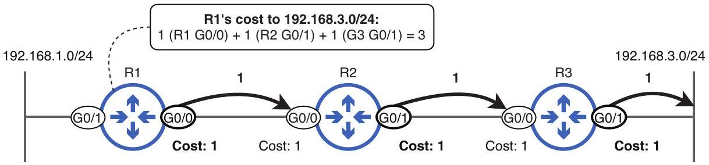
Figure 18.3 A route's cost is the cumulative cost of each interface out of which a packet must be sent to reach the destination. R1's cost to reach 192.168.3.0/24 is 3: 1 for R1 G0/0, plus 1 for R2 G0/1, plus 1 for R3 G0/1.

Although figure 18.3's depiction of OSPF cost is accurate, it's more common to refer to the cost of a link rather than the cost of each interface that makes up the link. Because both sides of the link should have the same cost-it is considered a misconfiguration if they don't-and a router considers only one side of the link when doing route cost calculations, it's simpler to think of the link as a single entity.

Using figure 18.3's example, it doesn't matter if R1 is calculating a route to 192.168.3.0/24 or R3 is calculating a route to 192.168.1.0/24; the cost is the same in either direction. Except when specifically referring to an interface's cost, I will refer to a link's cost rather than each individual interface's cost.

## Reference bandwidth

The cost of a link is calculated by dividing a reference bandwidth value by the link's bandwidth; the default reference bandwidth is 100 Mbps. If this calculation results in a value less than 1, the OSPF cost is assigned as 1 because OSPF does not accept fractional or decimal values for cost. This gives the following default OSPF cost values:

- 10 Mbps link = 10 ( $100 / 10$ )
- 100 Mbps link = 1 (100/100)
- $1,000 \mathrm{Mbps}(1 \mathrm{Gbps})$ link $=1(100 / 1000=0.1)$
- 10,000 Mbps (10 Gbps) link = 1 (100/10000 = 0.01)

You may have noticed a problem: with the default reference bandwidth of 100 Mbps, links with a bandwidth of 100 Mbps or greater all have the same cost. If OSPF considers a 100 Mbps link just as preferable as a 1 Gbps or 10 Gbps link, it's likely to calculate suboptimal routes. Figure 18.4 shows an example: although R1's route to 10.1.3.0/24 via R4 uses FastEthernet links, it is considered equal to R1's route via R2, which uses GigabitEthernet links.

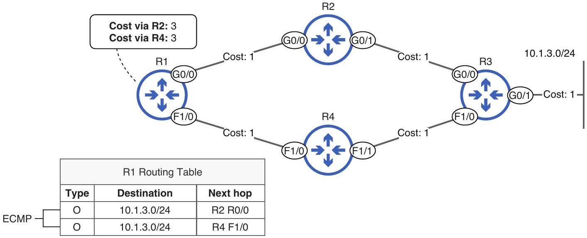
Figure 18.4 Although the route to 10.1.3.0/24 via R2 is superior to the route via R4, the OSPF cost of both routes is the same. R1 adds both routes to the routing table and will load-balance over them with ECMP.

R1 adds both routes to the routing table and will use ECMP to load-balance traffic over them. While ECMP itself isn't a bad thing, attempting to forward equal amounts of traffic over links with vastly different bandwidths could lead to congestion on the slower links, while the faster links are underutilized.

OSPF was developed decades ago when FastEthernet was considered a very highspeed link; that's why the default reference bandwidth is 100 Mbps. However, in modern networks it's better to adjust the reference bandwidth value to allow OSPF to differentiate between links of greater bandwidths. To adjust the reference bandwidth value, use the auto-cost reference-bandwidth mbps command in OSPF router config mode.

In the following example, I confirm the cost of R1's interfaces with the show ip ospf interface brief command. I then adjust the reference bandwidth to 1000 Mbps, so GigabitEthernet links have a cost of 1, and FastEtherent links have a cost of 10. Although there is no specific recommended value to use for the reference bandwidth, it's common to set it to match the bandwidth of the fastest link in the network. Another option is to set the reference bandwidth to a value greater than the current fastest link's bandwidth to allow even faster links to be added to the network without adjusting the reference bandwidth again:
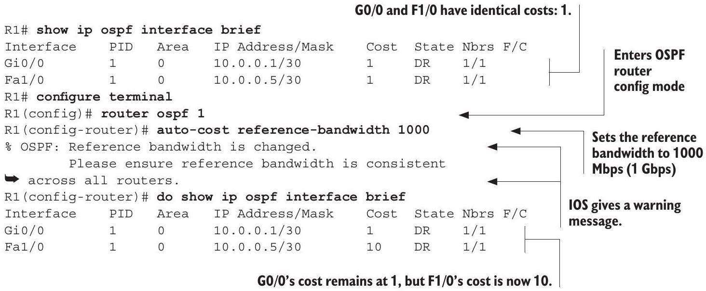

As the warning message in the previous example states, it's important that you configure the same reference bandwidth on all routers to ensure consistent route selection. In the worst-case scenario, having different reference bandwidths could result in routing loops: if router A believes the best route to a destination is via router B, but router B believes the best route is via router A, packets for that destination will loop between the two routers until their TTL expires-never reaching their intended destination.

## Modifying the cost of a link

Although modifying the reference bandwidth is usually sufficient to allow OSPF to select the most efficient path to a destination, in some cases, you may want to modify the cost of a particular link to make it more or less preferable. There are two methods to do so:

- Configure the cost with the ip ospf cost cost command in interface config mode.

- Modify the interface's bandwidth value with the bandwidth kbps command in interface config mode.

NOTE Although the reference bandwidth is configured in megabits per second, the interface bandwidth value is configured in kilobits per second.

Of the two, the first method is preferred if you want to modify the OSPF cost of a particular link: it allows you to directly configure the interface's OSPF cost. The second method, instead, is used to influence the automatic cost calculation we covered previously: reference bandwidth/interface bandwidth. However, an interface's bandwidth value affects more than just OSPF cost values, such as QoS (quality of service) mechanisms, so it's usually best not to modify it.

NOTE Modifying an interface's bandwidth value doesn't actually affect how the interface operates; it's just a value used for calculations like OSPF cost, EIGRP metric, etc. To change the speed at which an interface operates, use the speed command.

### 18.2 OSPF configuration

In chapter 17, we looked at how to activate OSPF on router interfaces with the network command. That command alone is enough to get OSPF working at its most basic level; after activating OSPF on a router's interfaces, the router will attempt to form neighbor relationships and share LSAs with other routers connected to those interfaces. In this section, we'll look at how to configure various other aspects of OSPF, including a simpler way to activate OSPF on a router's interfaces.

The first step in configuring OSPF is to create an OSPF process with the router ospf process-id command; this is the command used to enter router config mode, from which you can use the network command and many other OSPF-related commands. Similar to how PVST+ creates multiple STP instances on a switch, each calculating a unique spanning tree, you can create multiple OSPF processes. Each of those processes independently calculates its own routes to destination networks. However, running multiple OSPF processes on a router is extremely rare, and the specific use cases are beyond the scope of the CCNA exam. For the purposes of this chapter, we will just use process ID 1 (although you can pick any other number you'd like).

NOTE The OSPF process ID is locally significant; it doesn't matter if the process ID matches neighboring routers. For example, a router running OSPF process ID 1 can become a neighbor of a router running OSPF with a process ID of 65535 (the highest possible value).

Figure 18.5 shows the topology we will configure in this section: a single-area OSPF network of four routers. The 10.1.3.0/24 subnet is connected to R3 G0/1, which we will configure as a passive interface-more about that in section 18.2.3. R1 connects to the internet, and we will configure it to advertise a default route to the other routers.

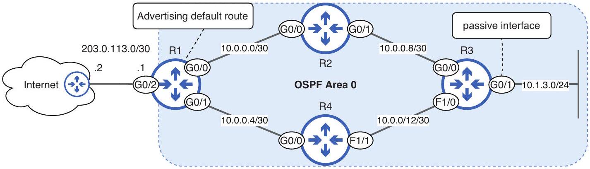
Figure 18.5 A single-area OSPF network of four routers. R3 connects to the 10.1.3.0/24 subnet on its G0/1 interface, a passive interface. R1 connects to the internet and advertises a default route to the other routers.

### 18.2.1 The router ID

When you first use the router ospf command to create the OSPF process, the router will assign itself a router ID (RID)-a unique 32-bit value that identifies the router in the OSPF AS. Unlike the process ID, the RID must be unique; there can't be two routers with the same RID in the AS. To view a router's RID, you can use the show ip protocols command; this command shows information about active routing protocols on the router. In the following example, I create OSPF process 1 on R1 and check its RID:

```
R1(config)# router ospf 1
R1(config-router) # do show ip protocols
        Creates OSPF process 1
. . .
Routing Protocol is "ospf 1"
    Outgoing update filter list for all interfaces is not set
    Incoming update filter list for all interfaces is not set
    Router ID 203.0.113.1
    Number of areas in this router is 1. 1 normal 0 stub 0 nssa
        . . .
```

R1 selected the IP address of its G0/2 interface-203.0.113.1-as its RID. The RID is assigned in the following order of priority:

1 Manual configuration with the router-id command
${ }_{2}$ Highest IP address on an operational (up/up) loopback interface (we'll cover loopback interfaces in this section)
3 Highest IP address on an operational (up/up) physical interface

As indicated in the first point, you can manually configure the RID with the router-id command. However, this command can only be configured once you've entered router config mode. To access router config mode, you have to first create the OSPF process with the router ospf command.

Therefore, when you first create the OSPF process, the router can't consider any manual RID configuration: one hasn't been set yet. Instead, it only considers the second
and third options to assign the RID: the highest IP address on an operational loopback interface (if any exist) or, failing that, the highest IP address on an operational physical interface. In this case, R1 selected the highest IP address on an operational physical interface-that of G0/2.

NOTE If you create an OSPF process and the router has no operational interfaces with an IP address, the process won't be able to start until you configure the RID or an interface with an IP address becomes operational.

## Loopback interfaces

A loopback interface is a virtual router interface that is always up and reachable as long as the device is operational (although you can disable the interface with shutdown). Unlike physical interfaces (i.e., GigabitEthernet0/1), which rely on physical ports and connections, loopback interfaces are entirely software-based. The benefit of a loopback interface is that it provides a stable, reliable interface that you can use to identify and connect to the router without relying on any particular physical port. Figure 18.6 shows how R1's loopback interface provides a stable interface for an admin to connect to with Secure Shell (SSH).

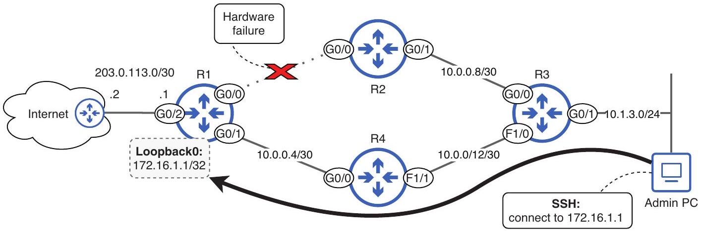
Figure 18.6 An admin uses SSH to connect to R1's Loopback0 interface. Loopback0 doesn't rely on the status of a particular physical interface, such as GO/0, which is down due to a hardware failure.

NOTE SSH is a protocol used to remotely access a device's CLI in a secure manner; we will cover it in chapter 5 of volume 2 of this book.

If the admin had, for example, attempted to connect to the IP address of R1's G0/0 interface, the connection would have failed; the $\mathrm{G} 0 / 0$ interface is down due to a hardware failure. On the other hand, the Loopback0 interface provides a stable IP address that the admin can connect to regardless of the status of R1's physical ports. However, it's important to note that the admin's PC still needs a valid physical path to reach R1. If both G0/0 and G0/1 were down, the PC would not be able to connect to R1 despite the loopback interface.

Although loopback interfaces are not required, it is highly recommended that you configure them on routers and that you activate OSPF on them so all routers can reach each other's loopback interfaces. To create a loopback interface, use the interface loopback number command-it's common to start with Loopback0. In the following example, I configure a loopback interface on R1, configure an IP address on it, and check the OSPF RID once again:
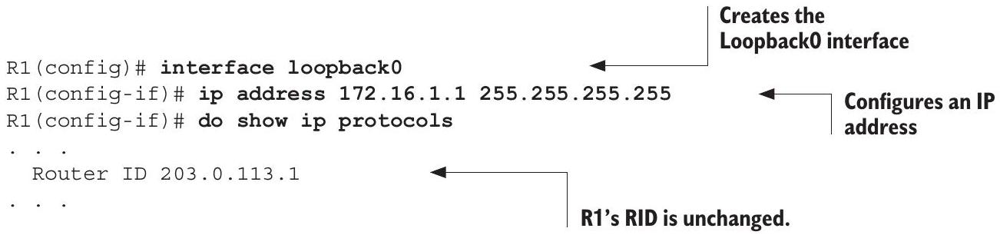

NOTE It's standard to configure loopback interfaces with a /32 netmask (255.255.255.255). This is because a loopback interface, by its nature, doesn't need to communicate with other devices on the same subnet (as a physical interface would). Instead, it represents a single device and thus doesn't need a range of addresses.

Despite configuring a loopback interface, R1's RID remains the same; to keep the RID stable, IOS doesn't reselect it when a new interface is configured. It is possible to reset the OSPF process with the clear ip ospf process command in privileged EXEC mode, but even that won't cause R1 to select the loopback interface's IP address as the RID, as shown in the following example:
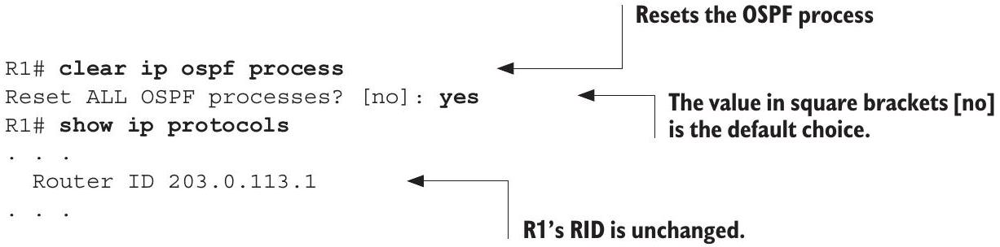

NOTE The point to remember here is that once the router has selected its RID, it will maintain that RID even if you configure a loopback interface and reset OSPF. A loopback interface's IP address will only be used for the initial RID selection when you first create the OSPF process. To make a router change its RID after it has already selected one, you must manually configure the RID; we'll cover that next.

## Changing the RID

After R1 has selected its RID, the best way to change it is to manually configure it and then reset the OSPF process (if needed). In any case, hardcoding the router's RID with manual configuration is considered a best practice to ensure predictable RIDs on all routers. In the following example, I configure the router-id router-id command on R1, causing it to change its RID:

```
R1(config)# router ospf 1
R1(config-router) # router-id 172.16.1.1 ← \
R1(config-router) # do show ip protocols
. . .
    Router ID 172.16.1.1
. . .
```

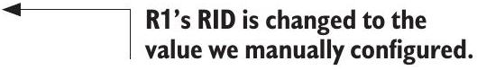

NOTE If the router has already established a neighbor relationship with one or more OSPF neighbors, you will have to reset the OSPF process with clear ip ospf process for the newly configured RID to take effect. But at this point in the example, I haven't activated OSPF on any of R1's interfaces yet, so it has no OSPF neighbors. That is why the new RID took effect immediately.

Although the OSPF RID is often derived from one of the router's IP addresses, it's important to note that the RID is not an IP address; it's just a 32-bit value that is formatted similarly to an IP address (dotted decimal notation). As long as the RID is unique in the OSPF AS, it can be any 32-bit value.

In the following example, I configure a loopback interface on R2 and then create the OSPF process. In this case, R2 takes the IP address of Loopback0 as its RID because I configured the loopback interface before creating the OSPF process:
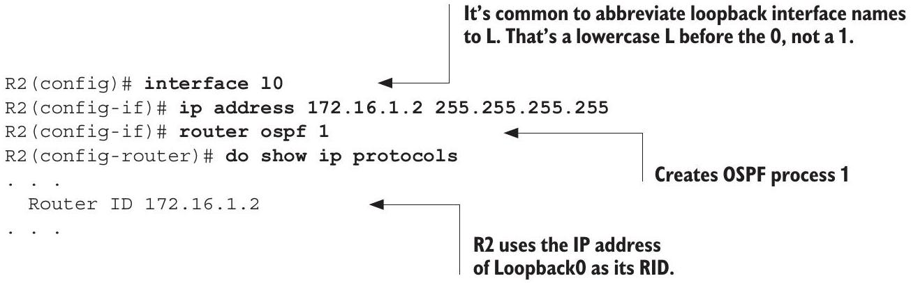

NOTE For the sake of space, I won't show the configurations, but I also configured Loopback0 on R3 (172.16.1.3/32) and R4 (172.16.1.4/32) and created the OSPF process.

## Loopback addresses and loopback interfaces

In chapter 7, I briefly introduced the concept of loopback addresses, which are IP addresses in the reserved 127.0.0.0/8 range. Messages sent to any address in this range are "looped back" to the local device without being transmitted across the network. For example, if you issue the ping 127.0.0.1 command on a PC, you'll get a response back from the PC itself. This can be used to test the device's network software.

Although they share the term loopback, loopback interfaces are a different concept from loopback addresses. Loopback interfaces are virtual interfaces in a router that can be assigned any valid IP address (which does not include the reserved loopback address range). Loopback interfaces provide a stable and reliable IP address that can be used to reach the router and isn't dependent on the status of a particular physical interface.

EXAM TIP The OSPF RID is exam topic 3.4.d; you should know how the RID is initially determined and how to change it.

### 18.2.2 Activating OSPF on interfaces

Activating OSPF on interfaces is possibly the most important part of configuring OSPF; it's what tells the router to make OSPF neighbors and share routing information. In chapter 17, we covered how to activate OSPF on interfaces with the network command. In the following example, I use the command to activate OSPF on R1's G0/0, G0/1, and L0 interfaces:

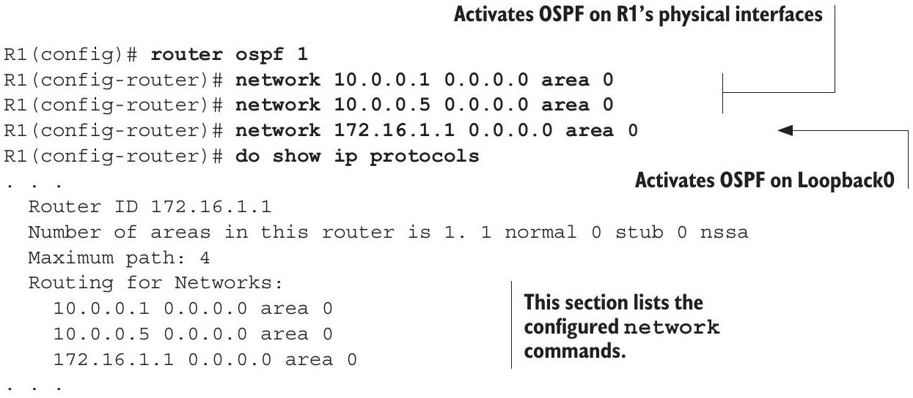
NOTE I did not activate OSPF on R1 G0/2, which is connected to the internet. Later, we will configure a default route via G0/2 on R1 and advertise it to R1's neighbors, but there is no need to activate OSPF on the interface.

However, there is a more straightforward method of activating OSPF on interfaces: the ip ospf process-id area area command in interface config mode. Whereas the network command specifies a range of IP addresses, and the router activates OSPF
on all interfaces with an IP address in that range, this command allows you to explicitly specify which interfaces OSPF should be activated on. In the following example, I enable OSPF on R2's G0/0, G0/1, and L0 (Loopback0) interfaces:
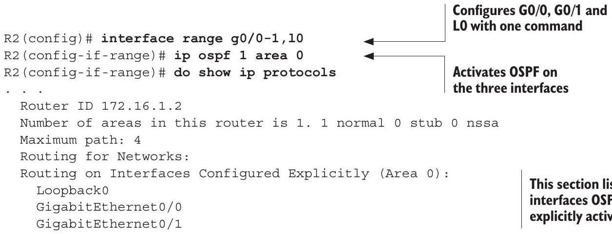

I think you'll agree that this method is much simpler than using the network command, although you should know both for the CCNA exam. In the following example, I use this method to activate OSPF on R3 and R4's interfaces as well:

```
R3(config)# interface range g0/0-2,10
R3(config-if-range) # ip ospf 1 area 0
R4(config) # interface range g0/0-1,10
R4(config-if-range)# ip ospf 1 area 0
```

EXAM TIP If a lab simulation in the exam expects you to use one OSPF configuration method over another, it will tell you so. Cisco exam questions can be difficult, but they aren't unfair.

### 18.2.3 Passive interfaces

Activating OSPF on an interface causes the router to perform two key actions:

- It attempts to form neighbor relationships with routers connected to the interface.
- It advertises the network prefix of the interface to neighbors.

However, there are cases where you might want the router to perform the second action-advertising the network prefix-without attempting to form network relationships on the interface. To form neighbor relationships, OSPF-enabled routers send hello messages out of their interfaces. If an interface isn't connected to another router, these hello messages are wasted-using up CPU and memory resources on the router and consuming network bandwidth. Furthermore, these unnecessary OSPF messages can pose a security risk, as malicious users could gather information about the network by examining them.

NOTE We will cover OSPF hello messages and other message types in section 18.3.

This is where passive interfaces come into play. A passive interface in OSPF is one that doesn't send OSPF messages to initiate neighbor relationships, even though it's OSPF enabled. However, the router will still advertise the network prefix of the interface to its OSPF neighbors, allowing them to forward packets to destinations in the network.

Figure 18.7 shows a situation in which you should configure a passive interface. R3 G0/1 connects to the 10.1.3.0/24 network, but there are no other routers connected to the interface. To allow R1, R2, and R4 to learn of 10.1.3.0/24 while preventing R3 from sending OSPF hello messages out of the interface, it should be configured as a passive interface.

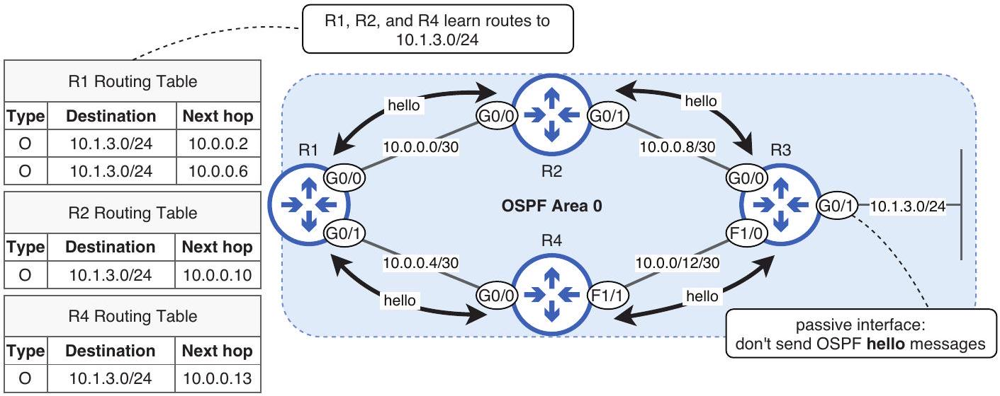
Figure 18.7 R3 advertises the network prefix of G0/1-a passive interface-but does not send OSPF hello messages out of it.

Configuring loopback interfaces as passive is also considered good practice in OSPF. Because a loopback interface is a virtual interface that isn't physically connected to any network, there's no practical need for it to send OSPF hello messages to try to form neighbor relationships. To configure a passive interface, use the passive-interface interface-name command in router config mode. In the following example, I configure R3 G0/1 and L0 as passive interfaces:

```
R3(config)# router ospf 1
R3(config-router) # passive-interface g0/1
R3(config-router) # passive-interface 10
R3(config-router) # do show ip protocols
. . .
Routing on Interfaces Configured Explicitly (Area 0):
    Loopback0
    FastEthernet1/0
    GigabitEthernet0/0
    GigabitEthernet0/1
```

Configures G0/1 and L0 as
passive interfaces

```
Passive Interface(s):
    GigabitEthernet0/1
Loopback0
```

G0/1 and L0 are now passive.
Another method of configuring passive interfaces is to use the passive-interface default command, which makes all interfaces passive by default. You can then use the no passive-interface interface-name command to specify which interfaces should not be passive. This method of configuration can be convenient if a router has many OSPF-enabled interfaces but only a few interfaces that it needs to form OSPF neighbor relationships on. Although this is not the case for R2, in the following example, I use this method to configure L0 as a passive interface and G0/0 and G0/1 as nonpassive:

```
R2(config) # router ospf 1
R2(config-router) # passive-interface default
R2(config-router) # no passive-interface g0/0
R2(config-router) # no passive-interface g0/1
```

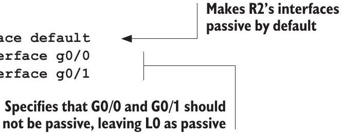

### 18.2.4 Advertising a default route

In most cases, hosts connected to routers in an OSPF AS don't just need to communicate with each other; they also need to communicate with hosts in external networks, such as the internet. To enable this communication, you can configure a default route on your ISP-connected router and then configure it to share that default route with the other routers in the OSPF AS. Figure 18.8 shows how to configure this.

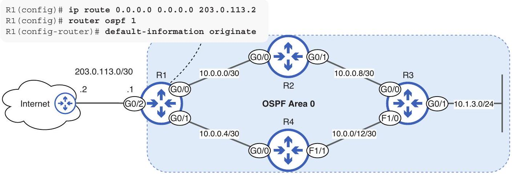
Figure 18.8 R1 functions as an ASBR, advertising a default route into the OSPF AS. After configuring a default route, use default-information originate to advertise the route to other routers in the OSPF AS.

To make R1 advertise a default route to R2, R3, and R4, you should first configure a static default route on R1. If you configure default-information originate on R1
without configuring a default route, R1 won't advertise a default route to other routers; it must have a default route in its own routing table first.

After configuring the default route, use the default-information originate command in router config mode to make R1 advertise the default route to the other routers; I do so in the following example. Notice the additional statement added to the output of show ip protocols R1 is now an ASBR:
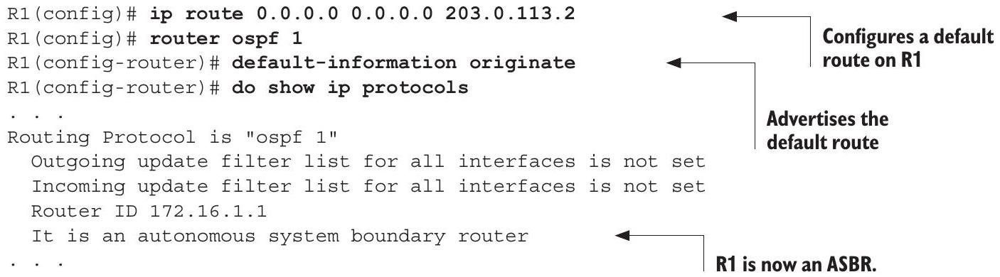

NOTE The default-information originate always command allows a router to advertise a default route, even if it doesn't have one in its own routing table. However, the use cases of this command are beyond the scope of the CCNA exam.

In the following example, I use show ip route ospf on R2 to view routes that R2 learned via OSPF. R2 has learned a default route from R1, in addition to the other routes it has learned via OSPF:

```
R2# show ip route ospf
. . .
O*E2 0.0.0.0/0 [110/1] via 10.0.0.1, 00:37:34,
    GigabitEthernet0/0
    10.0.0.0/8 is variably subnetted, 7 subnets, 3 masks
O 10.0.0.4/30 [110/2] via 10.0.0.1, 00:02:09,
    GigabitEthernet0/0
O 10.0.0.12/30 [110/2] via 10.0.0.10, 01:11:30,
    GigabitEthernet0/1
O 10.1.3.0/24 [110/2] via 10.0.0.10, 01:11:30,
    GigabitEthernet0/1
    172.16.0.0/32 is subnetted, 4 subnets
0 172.16.1.1 [110/2] via 10.0.0.1, 01:11:30,
    GigabitEthernet0/0
0 172.16.1.3 [110/2] via 10.0.0.10, 01:11:30,
    GigabitEthernet0/1
O 172.16.1.4 [110/3] via 10.0.0.10, 00:13:54,
    GigabitEthernet0/1
        [110/3] via 10.0.0.1, 00:02:09,
    GigabitEthernet0/0
```

NOTE Loopback interfaces add a cost of 1 to a route. For example, R2's cost to reach R1's loopback interface (172.16.1.1) is 2: 1 for the R2-R1 link, plus 1 for R1 L0 (Loopback0).

Notice that R2 has inserted two paths to 172.16.1.4 into its routing table; this is an example of ECMP, which we covered in chapter 17. By default, OSPF will insert up to four equal-cost routes to a destination into the routing table. This value can be modified with the maximum-paths number command in router config mode, although the default setting of 4 is usually sufficient for most network scenarios.

### 18.3 Neighbors and adjacencies

For OSPF routers to exchange routing information, they first need to form neighbor relationships with each other. In this section, we'll examine that crucial first step of OSPF. For review, the three fundamental steps of the OSPF process are forming neighbor relationships, exchanging routing information, and calculating routes. Table 18.2 summarizes the five different message types that OSPF uses in this process; we will examine each one's role in this section as we cover how OSPF routers form neighbor relationships.

Table 18.2 OSPF message types
| Type | Name | Purpose |
| :--- | :--- | :--- |
| 1 | Hello | Neighbor discovery and maintenance |
| 2 | Database Description (DBD) | Summary of the router's LSDB. Used to check whether the LSDB of each router is the same. |
| 3 | Link-State Request (LSR) | Requests specific LSAs from a neighbor |
| 4 | Link-State Update (LSU) | Sends specific LSAs to a neighbor |
| 5 | Link-State Acknowledgment (LSAck) | Used to acknowledge that the router received an LSU |


### 18.3.1 Neighbor states

For OSPF routers to exchange routing information with each other, they have to pass through a series of neighbor states, in which the routers verify that various configuration parameters match between them. Figure 18.9 outlines the OSPF neighbor states from Down to Full.

We could spend several pages covering this process. If you continue your studies of OSPF beyond the CCNA, the details of this process are essential for understanding the OSPF protocol and how to troubleshoot it. However, for the purpose of the CCNA exam, a general understanding of each state's purpose and the sequence of states is sufficient.

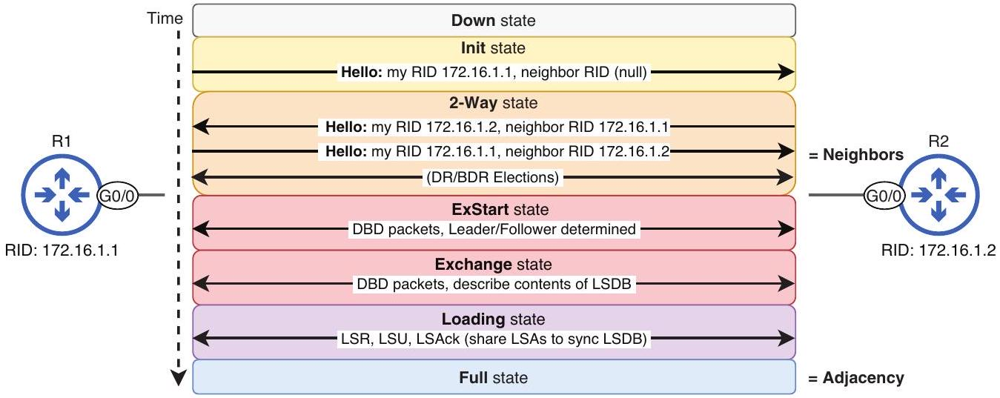
Figure 18.9 The OSPF neighbor states: Down, Init, 2-Way, ExStart, Exchange, Loading, and Full. Routers that reach the 2 -Way state are OSPF neighbors. Some routers remain in this state, and some proceed to establish a full adjacency.

When OSPF is activated on an interface, the router regularly sends OSPF hello messages, which are used for dynamically discovering OSPF neighbors and for maintaining neighbor relationships after they have been established. These hello messages include various pieces of information, two of which are the local router's RID and the RIDs of any neighbor routers it is aware of on the interface.

OSPF hello messages are sent to IP address 224.0.0.5, which is a multicast IP address. Whereas unicast packets are one-to-one (from one host to one other host), and broadcast packets are one-to-all, multicast packets are one-to-multiple (but not necessarily all). A packet sent to the multicast IP address 224.0.0.5 will be flooded by a switch and, therefore, received by all hosts on the segment. However, only router interfaces with OSPF activated will be interested in the contents of the packet; other hosts will simply ignore it, as shown in figure 18.10.

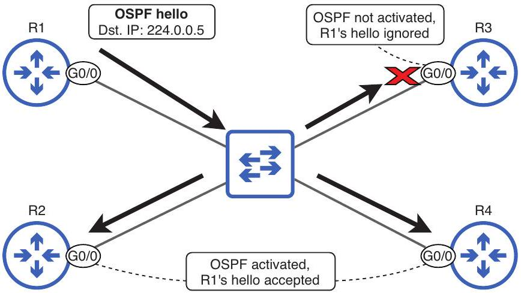
Figure 18.10 An OSPF hello message from R1 is addressed to multicast address 224.0.0.5. The switch floods the frame, and OSPF-enabled R2 G0/0 and R4 G0/0 accept the hello message. R3 ignores the hello because GO/O is not OSPF-enabled.

The first OSPF neighbor state is Down, although it's not really a neighbor state-it means the router hasn't received any hello messages on the interface. Then, using an example from the neighbor states shown in figure 18.9, when R2 first receives a hello message from R1, R2 will create an OSPF neighbor entry for R1 in the Init state, as shown in the following example:

```
Use this command to display
the OSPF neighbor table.
Interface
GigabitEthernet0/0
```

R2 has an entry for R1 in the Init state.
show ip ospf neighbor is a very useful command to check the router's OSPF neighbors and their states. The Init state means that the router has received an OSPF hello message from a neighboring router, but that hello message did not include the local router's own RID. R2 will then send its own hello message to R1, including R1's RID in the message, having learned it from R1's hello. When R1 receives this hello from R2, R1 will create an OSPF neighbor entry for R2 in the 2-Way state-bypassing the Init state. The following example shows R1's OSPF neighbor table entry for R2:

```
Displays the OSPF neighbor table
R1# show ip ospf neighbor
Neighbor ID Pri State Dead Time Address Interface
172.16.1.2 1 2WAY/DROTHER 00:00:39 10.0.0.2 GigabitEthernet0/0
```

Having received a hello from R2-and thus having learned R2's RID-R1 sends another hello to R2, including R2's RID in the message this time. R2 then moves its neighbor table entry for R1 to the 2-Way state. At this point, R1 and R2 are considered OSPF neighbors-they see and acknowledge each other but have not exchanged any routing information.

NOTE In some cases, a designated router (DR) and backup designated router (BDR) election is held in the 2-Way state-more on that in section 18.3.2.

For OSPF routers to exchange routing information, they must establish an OSPF adjacency by progressing toward the Full state. To do so, they will proceed to the ExStart and Exchange states, where they exchange database description (DBD) messages, which are summaries of the contents of each router's LSDB. In the ExStart state, they determine which router will lead the DBD exchange; the router with the higher RID will become the Leader, and the router with the lower RID will become the Follower. Then, the actual DBD exchange takes place in the Exchange state.

NOTE Leader/Follower is a recent update to OSPF terminology, replacing the previous Master/Slave. Because it's a recent update, the old terms are still more common (and used in Cisco IOS software), so you should be aware of them.

After exchanging DBDs, the routers are aware of the contents of each other's LSDBs. They then proceed to the Loading state, where they use link-state request (LSR) messages to request specific LSAs from each other, link-state update (LSU) messages to send LSAs, and link-state acknowledgment (LSAck) messages to acknowledge receipt of LSUs.

NOTE LSAs are data structures that contain OSPF routing information, and they are sent in LSU messages. You can think of LSUs as the envelopes that carry LSAs.

The routers then enter the Full state, meaning that they have synced their LSDBs. At this point, they are called adjacent neighbors or fully adjacent neighbors, and their neighbor relationship is now called an adjacency or full adjacency. As long as the connection between the routers remains stable, they should remain in the Full state, sharing LSAs as the network changes.

Even after a neighbor relationship or adjacency is established, routers will continue sending hello messages at regular intervals, as determined by the hello timer, which is 10 seconds by default. The purpose of these hello messages is to maintain neighbor relationships. If a router stops receiving hellos from a neighbor, it will remove the neighbor from the neighbor table; this is determined by the dead timer, which is 40 seconds by default. This means that a router will remove a neighbor if the router hasn't received a hello from the neighbor for the past 40 seconds.

### 18.3.2 OSPF network types

OSPF uses an interface setting called network type to determine how OSPF behaves over a particular network. In this context, a network is a connection between two or more routers-a segment. The network type influences things like the OSPF message timers, whether a DR and BDR are elected, and whether all neighbor relationships will become full adjacencies.

There are various OSPF network types: broadcast, non-broadcast multi-access (NBMA), point-to-point, point-to-multipoint, point-to-multipoint non-broadcast, and loopback. The CCNA exam topics explicitly state the two network types you need to know for the exam in topics 3.3.b, Point-to-point, and 3.3.c, Broadcast (DR/BDR selection). Table 18.3 summarizes those two network types.

Table 18.3 OSPF network types
| Broadcast | Point-to-point |
| :--- | :--- |
| DR/BDR elected | No DR/BDR |
| Establish full adjacency only with DR \& BDR | Establish full adjacency |
| Neighbors dynamically discovered | Neighbors dynamically discovered |
| Default timers: hello $=10$, dead $=40$ | Default timers: hello = 10; dead = 40 |


The two shared characteristics of these network types are dynamic neighbor discovery and the default timers. By sending hello messages out of OSPF-enabled interfaces, routers are able to dynamically discover which neighbors are connected to the interface, as opposed to requiring an admin to manually configure neighbor IP addresses (as required on some OSPF network types).

The default hello timer on both of these network types is 10 seconds, so interfaces send hello messages at 10-second intervals. The default dead timer is 40 seconds, so a neighbor is removed from the neighbor table if no hello message is received for 40 seconds. Other network types use longer default timers of 30 and 120 seconds.

NOTE If the router detects a physical link failure (placing the interface in the down/down state), OSPF will immediately remove the neighbor-no need to wait for the dead timer to count down. The dead timer is only relevant if the interface remains up but the router stops receiving hello messages from the neighbor (for whatever reason).

## Broadcast network type

Broadcast is the default OSPF network type of Ethernet interfaces (of all speeds-FastEthernet, GigabitEthernet, etc.). You can confirm that with the show ip ospf interface command, as in the following example:

```
R1# show ip ospf interface g0/0
GigabitEthernet0/0 is up, line protocol is up
    Internet Address 10.0.0.1/30, Area 0, Attached via Network Statement
    Process ID 1, Router ID 172.16.1.1, Network Type BROADCAST, Cost: 1
    The network type of G0/0 is broadcast.
```

The main defining characteristic of the broadcast network type is that a designated router (DR) and backup designated router (BDR) are elected in the 2-Way neighbor state; other routers connected to the segment become DROthers (usually pronounced D-R-other). While the DR and BDR establish full adjacencies with all routers in the segment, DROthers only establish a full adjacency with the DR and BDR of the segment and remain neighbors in the 2-Way state with fellow DROthers-they don't exchange LSAs with each other.

The purpose of electing a DR and BDR is to reduce the amount of OSPF traffic in the segment by only requiring routers to exchange LSAs (in LSU messages) with the DR and BDR of the segment. Figure 18.11 shows how the number of adjacencies (and, therefore, LSA exchanges) is reduced, limiting the amount of OSPF traffic in the segment and the amount of resources used on the routers.

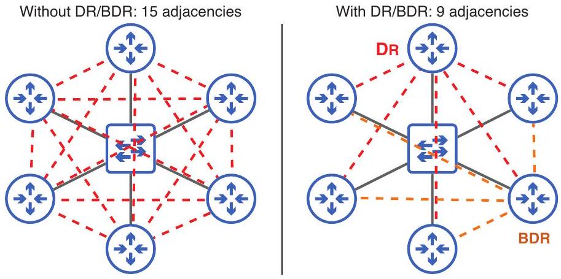
Figure 18.11 Six routers are connected to the same network segment. Without the DR/BDR, 15 OSPF adjacencies (and 15 LSA exchanges) would be required. With the DR/BDR, only 9 are required, reducing the amount of OSPF traffic.

NOTE To address messages to only the DR and BDR, DROthers send the packets to multicast IP address 224.0.0.6. Remember the two OSPF multicast IP addresses: 224.0.0.5 (all OSPF routers) and 224.0.0.6 (DR and BDR only).

Depending on the number of routers connected to the segment, the DR/BDR feature of the broadcast network type can greatly reduce the resources used by OSPF on the segment. This could be further reduced by electing only a DR, but the BDR is important for providing stability and resiliency; if the DR fails for some reason, the BDR takes over automatically as the new DR.

Figure 18.12 shows an example OSPF AS with DRs, BDRs, and DROthers labeled. Note that the DR and BDR are elected per segment, not per area. For example, R2 is the DR for the R1-R2 segment, but a DROther for the R2-R3-R4-R5 segment.

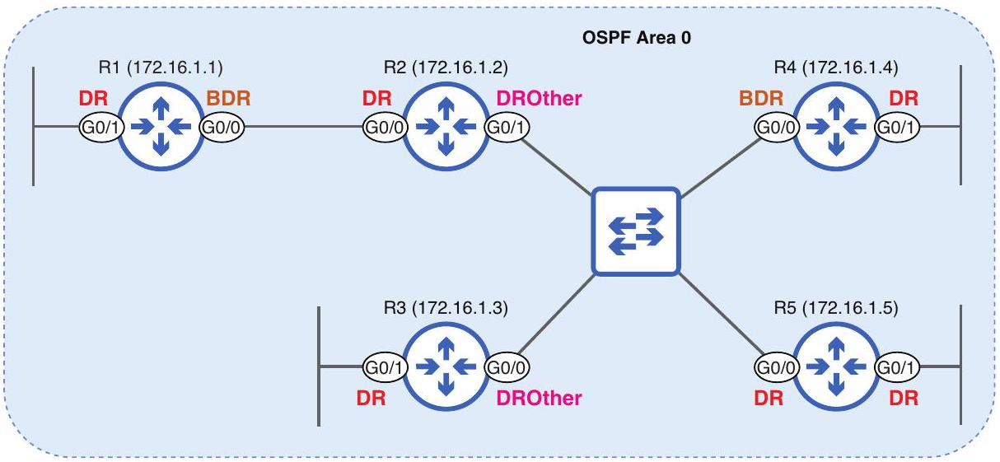
Figure 18.12 An OSPF AS consisting of six segments. The DR/BDR election is held per segment, not per area. RIDs are in parentheses.

The G0/1 interfaces of R1, R3, R4, and R5 in figure 18.12 are labeled as DRs. Because there are no other routers connected to those segments, no DR/BDR election is held; the routers simply declare themselves the DR for those segments. However, no adjacencies will be established, and no LSAs will be exchanged out of those interfaces; DR is just a title in this case. Furthermore, these interfaces should be configured in passive mode, so no OSPF hello messages will be sent out of them.

The following example shows the output of show ip ospf neighbor on R5. As the DR of the R2-R3-R4-R5 segment, R5 has a full adjacency with all other routers:
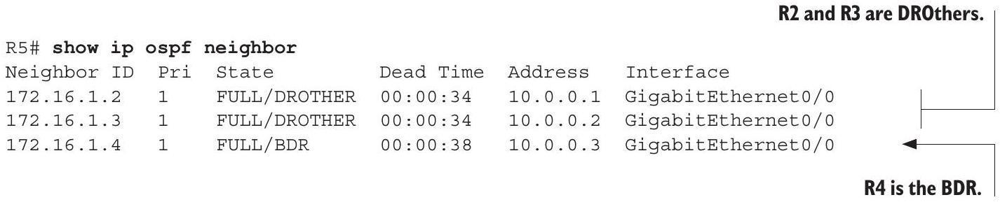

Although the output doesn't explicitly state that R5 is the DR, because none of the three other routers connected to the segment are the DR, you can conclude that R5 must be the DR for the segment. Let's confirm by using the same command on R2:
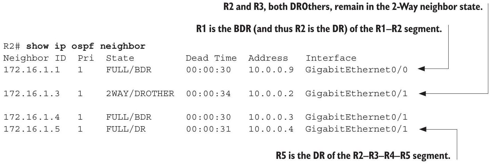

As the output shows, R5 is indeed the DR for the segment. Another point worth noting is that R2 and R3 do not form a full adjacency; as DROthers, they remain neighbors in the 2-Way state. This means that they don't exchange LSAs with each other.

NOTE Although DROthers don't directly exchange LSAs with each other, they will learn of each other's LSAs via the DR/BDR. Remember, all routers in the OSPF area must have the same LSDB.

By now, you're probably wondering how the DR and BDR are elected. The DR/BDR are elected with the following two criteria:

- The highest interface priority
- The highest RID

The router with the highest interface priority will become the DR for the segment, and the router with the second highest will become the BDR. The OSPF interface priority is a configurable value (default 1) that can be configured with the ip ospf priority priority command in interface config mode.

NOTE If you want to ensure that a router never becomes the DR or BDR for a segment, configure ip ospf priority 0 on its interface.

In the example we saw in figure 18.12, all interfaces had the default priority of 1, so the second parameter was used to decide the DR of each segment: the OSPF RID. If interface priorities are tied, the router with the highest RID will become the DR (R5, 172.16.1.5), and the router with the second highest RID the BDR (R4, 172.16.1.4).

Let's change the interface priority of R2 G0/1 to test out the DR/BDR election. In the following example, I set R2 G0/1's interface priority to 100 and confirm the results:

```
            Changes R2 GO/1’s priority to 100
            This means OSPF was
            activated directly on the
        interface, not with the
        network command.
    #Attached via Interface Enable
    Process ID 1, Router ID 172.16.1.2, Network Type BROADCAST, Cost: 1
. . .
    Transmit Delay is 1 sec, State DROTHER, Priority 100
R2 G0/1 is still a
. . .
        DROther.
R2(config-if)# do show ip ospf neighbor
Neighbor ID Pri State Dead Time Address Interface
172.16.1.1 1 FULL/BDR 00:00:30 10.0.0.9 GigabitEthernet0/0
172.16.1.3 1 2WAY/DROTHER 00:00:34 10.0.0.2 GigabitEthernet0/1
172.16.1.4 1 FULL/BDR 00:00:30 10.0.0.3 GigabitEthernet0/1
172.16.1.5 1 FULL/DR 00:00:31 10.0.0.4 GigabitEthernet0/1
The DR and BDR of the segment are unchanged.
```

Although R2 G0/1 now has the highest priority of the segment, R5 and R4 remain the DR and BDR. That's because, once the DR and BDR have been elected, they won't be preempted-their roles won't be taken-even if the priority of an existing router is increased or a router with a higher priority connects to the segment. To make a DR or BDR give up its role, you can use the clear ip ospf process command to reset the router's OSPF process, as I do on R5 in the following example:

```
R5# clear ip ospf process
Reset ALL OSPF processes? [no]: yes
R5# show ip ospf neighbor
Neighbor ID Pri State Dead Time Address Interface
```

| 172.16.1.2 | 100 | FULL/BDR | 00:00:35 | 10.0.0.1 | GigabitEthernet0/0 | ◁ |
| :--- | :--- | :--- | :--- | :--- | :--- | :--- |
| 172.16.1.3 | 1 | 2WAY/DROTHER | 00:00:31 | 10.0.0.2 | GigabitEthernet0/0 |  |
| 172.16.1.4 | 1 | FULL/DR | 00 : 00 : 31 | 10.0.0.3 | GigabitEthernet0/0 | 4 |
| R4 becomes the new DR, and R2, the BDR. |  |  |  |  |  |  |

After resetting R5's OSPF process, R4 (formerly the BDR) becomes the new DR, and R2 becomes the new BDR, despite having the highest priority. These results reveal an important point about how the DR and BDR function: if the DR goes down, routers connected to the segment don't hold an election for the new DR. Instead, the BDR immediately takes over as the new DR; that's why R4 becomes the new DR. Then, an election is held to determine the new BDR; R2 wins this election and becomes the new BDR. To make R2 the DR, you would have to then reset R4's OSPF process, making R2 (the BDR) immediately take over R4's role.

EXAM TIP The broadcast network type is exam topic 3.4.c. You should understand the DR/BDR election in particular.

## Point-to-point network type

Although the DR/BDR feature of the broadcast network type can reduce the amount of resources used by OSPF, electing a DR and BDR extends the amount of time it takes for routers to establish a full adjacency; if there are only two routers connected to the segment, this is unnecessary and inefficient.

A point-to-point connection is a direct link between two routers. When OSPF is enabled on this link with the default network type of broadcast, one router becomes the DR, and the other, the BDR. However, these designations do not offer any advantage in this case because both routers establish a full adjacency, regardless.

NOTE The point-to-point network type is the default on serial interfaces, which used to be common for WAN connections. Due to the greater speed and lower cost of fiber-optic Ethernet, serial connections are now considered a legacy technology. To use this network type on Ethernet links, you must manually configure it.

By using the OSPF point-to-point network type, we eliminate the DR/BDR election process, allowing the routers to establish a full adjacency in less time. This network type is designed for direct connections between two routers, and it is the most efficient option in these situations. Figure 18.13 shows a situation where the point-to-point network type should be configured. R1 and R2 have a point-to-point connection, so there is no need to elect a DR and BDR.

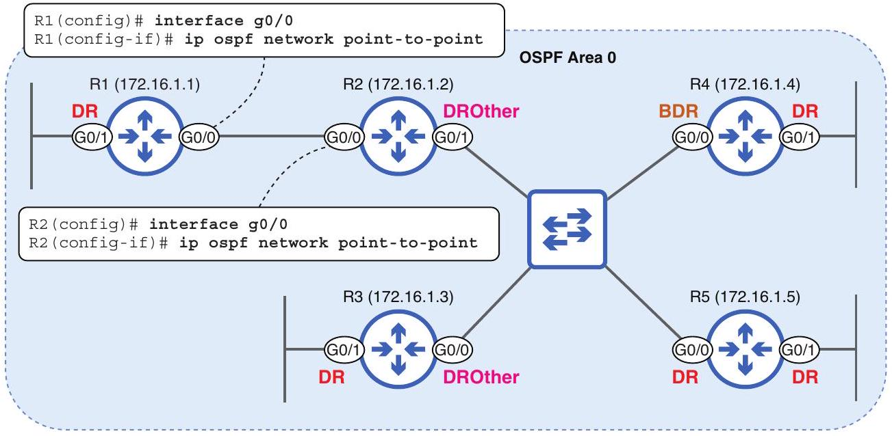
Figure 18.13 Electing a DR and BDR on a connection between two routers is unnecessary, so the R1-R2 link should use the point-to-point network type.

To configure the point-to-point network type, use the ip ospf network point-topoint command in interface config mode-make sure you do it on both sides of the connection! In the following example, I configure the point-to-point network type on R1 G0/0 and R2 G0/0 and then confirm. Notice that R1 and R2 establish a full adjacency, but neither is a DR or BDR, as indicated by the state of FULL/ -:

```
R1(config) # interface g0/0
R1(config-if)# ip ospf network point-to-point
R2(config) # interface g0/0
R2(config-if) # ip ospf network point-to-point
R2(config-if) # do show ip ospf neighbor
```

| Neighbor ID | Pri | State | Dead Time | Address | Interface |
| :--- | :--- | :--- | :--- | :--- | :--- |
| 172.16.1.3 | 1 | 2WAY/DROTHER | 00:00:35 | 10.0.0.2 | GigabitEthernet0/1 |
| 172.16.1.4 | 1 | FULL/BDR | 00:00:38 | 10.0.0.3 | GigabitEthernet0/1 |
| 172.16.1.5 | 1 | FULL/DR | 00:00:36 | 10.0.0.4 | GigabitEthernet0/1 |
| 172.16.1.1 | 0 | FULL/ - | 00:00:38 | 10.0.0.9 | GigabitEthernet0/0 |

R1 and R2 establish a full adjacency with no DR/BDR.

EXAM TIP The point-to-point network type is exam topic 3.4.b. You should understand the advantage it provides (no DR/BDR election) and how to configure it.

### 18.3.3 Neighbor requirements

Although the OSPF broadcast and point-to-point network types allow routers to dynamically discover neighbors, that's no guarantee that they will actually become neighbors; there is a set of requirements that needs to be met, including various parameters that must match (and one that must not match):

- Area number must match.
- Subnet (network address, netmask) must match.
- OSPF process must not be shutdown.
- RIDs must be unique.
- Hello and dead timers must match.
- Authentication settings must match.
- IP MTU settings must match.*
- Network type must match.*

A mismatch of the final two, which I've marked with asterisks (*), will not prevent routers from becoming neighbors but will prevent OSPF from operating properly. Let's go through these requirements one by one, and see how OSPF is affected. I'll use a simple connection between two routers: R1 (192.168.1.1/30) and R2 (192.168.1.2/30). In the following example, I configure an area number mismatch on R1 and R2, and they fail to become OSPF neighbors. After fixing the mismatch, the issue is resolved:
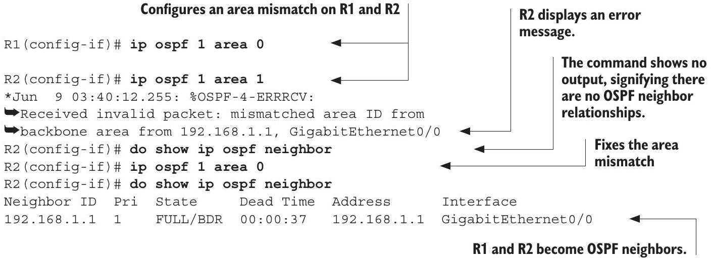

In the next example, I change the netmask of R2's interface. Even though I didn't change the IP address; just having a mismatched netmask causes the adjacency to go from Full to Down.
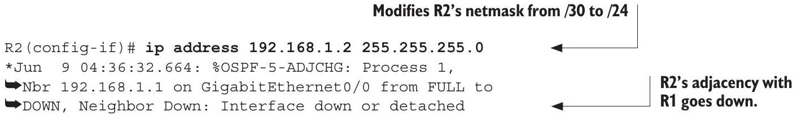

```
R2(config-if)# ip address 192.168.1.2 255.255.255.252
*Jun 9 04:37:36.071: %OSPF-5-ADJCHG: Process 1,
■Nbr 192.168.1.1 on GigabitEthernet0/0 from LOADING to
```

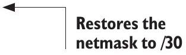

```
-FULL, Loading Done
```

R1 and R2 reestablish a full adjacency.

The third requirement is that the OSPF process must not be shutdown, referring to the command you can use in router config mode to disable OSPF, much like how you use the shutdown command to disable an interface. I demonstrate this in the following example:

```
R2(config) # router ospf 1
R2(config-router) # shutdown
*Jun 9 05:02:01.379: %OSPF-5-ADJCHG: Process 1,
#Nbr 192.168.1.1 on GigabitEthernet0/0 from FULL to
-DOWN, Neighbor Down: Interface down or detached
R2(config-router) # no shutdown
*Jun 9 05:02:07.114: %OSPF-5-ADJCHG: Process 1,
#Nbr 192.168.1.1 on GigabitEthernet0/0 from LOADING to
-FULL, Loading Done
```

R1 and R2 reestablish a full adjacency.

The fourth requirement is that the routers' RIDs must be unique-the one parameter that must not match. In the following example, I modify R2's RID to match R1's, reset the OSPF process, and they fail to become neighbors. Removing the R2's RID configuration fixes the issue:

```
R2(config-router) # router-id 192.168.1.1
R2(config-router) # do clear ip ospf process
Reset ALL OSPF processes? [no]: yes
*Jun 9 05:06:09.209: %OSPF-5-ADJCHG: Process 1,
#Nbr 192.168.1.1 on GigabitEthernet0/0 from FULL to
-DOWN, Neighbor Down: Interface down or detached
*Jun 9 05:06:11.679: %OSPF-4-DUP_RTRID_NBR: OSPF
-detected duplicate router-id 192.168.1.1 from
-192.168.1.1 on interface GigabitEthernet0/0
R2(config-router) # no router-id 192.168.1.1
*Jun 9 05:06:29.284: %OSPF-5-ADJCHG: Process 1,
■Nbr 192.168.1.1 on GigabitEthernet0/0 from LOADING to
-FULL, Loading Done
```

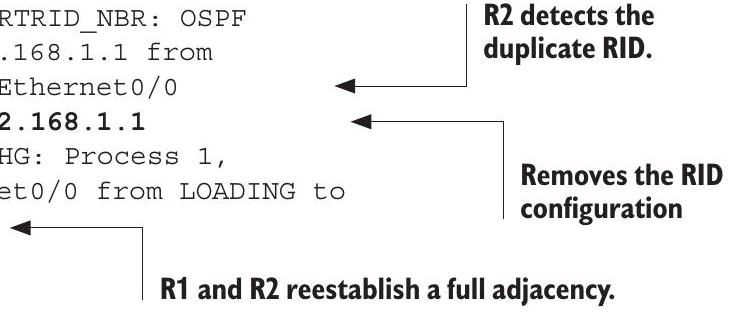

The fifth requirement is that the hello and dead timers must match. The default hello timer is 10 seconds, and the default dead timer is 40 seconds, but they can be configured with the ip ospf hello-interval seconds and ip ospf dead-interval seconds commands in interface config mode. In the following example, I modify R2's hello timer, causing the adjacency with R1 to go down:
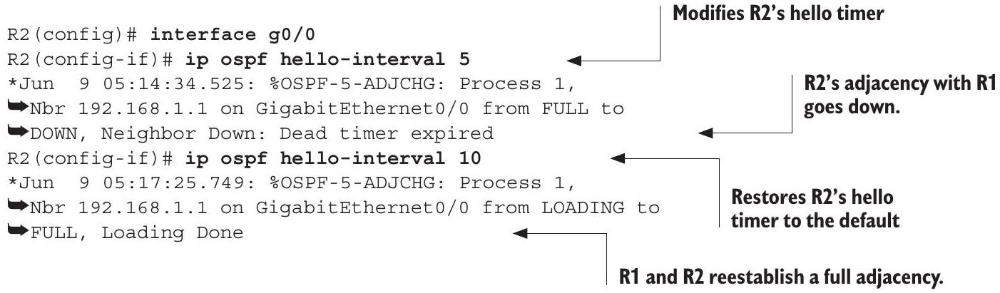

The sixth requirement is that the authentication settings must match. You can configure a password to authenticate OSPF neighbors-to ensure that only the intended routers form neighbor relationships. OSPF authentication is beyond the scope of the CCNA exam, but you can use the ip ospf authentication command in interface config mode to enable authentication and the ip ospf authentication-key password command to configure the password.

The seventh requirement is that the routers' IP maximum transmission unit (MTU) settings must match. We briefly mentioned the IP MTU in chapter 7 when covering the IPv4 header; it determines the maximum size of an IPv4 packet. Although an IP MTU mismatch will not prevent two OSPF routers from becoming neighbors, they will be unable to establish a full adjacency; they will not be able to advance beyond the ExStart/Exchange states. Like authentication, the details of IP MTU are beyond the scope of the CCNA exam, but you can modify an interface's IP MTU with the ip mtu bytes command in interface config mode; the default setting on Ethernet interfaces is 1,500 bytes.

The final requirement is that the OSPF network types match. This requirement is different from the others we have covered so far: a router with the broadcast network type and a router with the point-to-point network type will be able to establish a full adjacency. However, the problem is that the routers will be unable to synchronize their LSDBs; they won't learn each other's routes.

In the following example, I configure a loopback interface on R2 and enable OSPF on it. I then configure the point-to-point network type on R2 G0/0, resulting in a network type mismatch—R1's interface is still using the broadcast network type. Despite the network type mismatch, R2's OSPF neighbor table shows a full adjacency with R1. I then check R1's neighbor and routing tables:

```
R2(config) # interface 10
R2(config-if)# ip address 10.10.10.2 255.255.255.255
R2(config-if) # ip ospf 1 area 0
R2(config-if) # interface g0/0
R2(config-if) # ip ospf network point-to-point
R2(config-if) # do show ip ospf neighbor
```

```
Neighbor ID Pri State Dead Time Address Interface
192.168.1.2 1 FULL/ - 00:00:34 192.168.1.2 GigabitEthernet0/0
R1# show ip ospf neighbor
Neighbor ID Pri State Dead Time Address Interface
192.168.1.2 1 FULL/DR 00:00:34 192.168.1.2 GigabitEthernet0/0
R1# show ip route ospf
            R1 and R2 have a full adjacency.
```

No routes display; R1 does not learn a route to R2's loopback interface, despite having a full adjacency.

The OSPF neighbor tables for R1 and R2 both indicate a full adjacency, but there is something strange: R2's output shows a state of FULL/ - (as expected when using the point-to-point network type), but R1's output shows FULL/DR-R1 believes that R2 is the DR. Furthermore, although OSPF is activated on R2's loopback interface, R1's routing table shows no route to the interface's address (10.10.10.2/32). Despite achieving full adjacency, R1 and R2 weren't actually able to synchronize their LSDBs. The solution is to ensure that both sides of the connection are using the same network type, whether that is broadcast or point-to-point.

EXAM TIP Neighbor adjacencies are exam topic 3.4.a; make sure you know these requirements for the exam.

### 18.4 LSA types

OSPF routers share routing information by sending LSU messages, which contain LSAs. There are various different kinds of LSAs, each with its own purpose, but for the CCNA exam, you should be aware of three:

- Type 1 (Router LSA)-Generated by all routers, this LSA describes the router's links.
- Type 2 (Network LSA)-Generated by the DR of a broadcast network, this LSA lists all routers on the segment.
- Type 5 (AS External LSA)-Generated by ASBRs, this LSA advertises routes to external networks (i.e., a default route to the internet).

Figure 18.14 shows the OSPF AS we looked at in section 18.3.2, modified with a connection to the internet, which R1 advertises with default-information originate. Notice the contents of the LSDB, which are shared by all five routers.

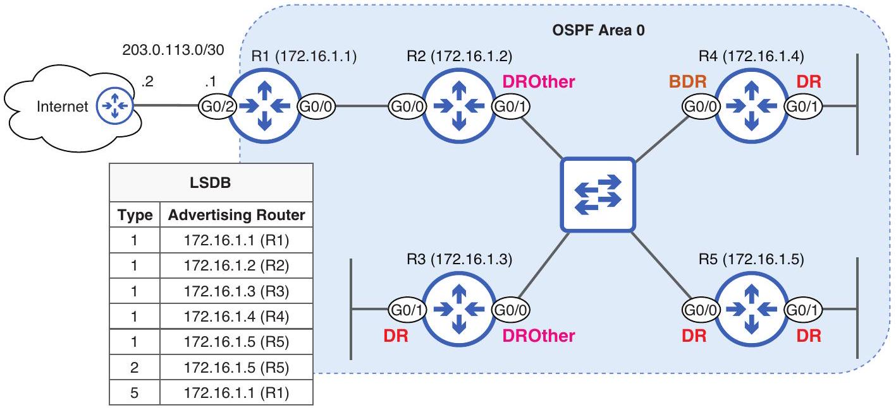
Figure 18.14 An OSPF AS and the contents of its LSDB. Each router advertises a type 1 (Router) LSA. R5, as the DR of the R2-R3-R4-R5 segment, advertises a type 2 (Network) LSA. R1, as an ASBR, advertises a type 5 LSA.

NOTE R3, R4, and R5 don't advertise a type 2 LSA for their G0/1 interfaces. As mentioned before, with no neighbors on those interfaces, they are DRs in name only.

To view the OSPF LSDB, use the show ip ospf database command. The output of this command should be the same on all routers; they should all have the same LSAs in their LSDB. In the following example, I use the command on R1. The specifics of how to read the output are beyond the scope of the CCNA; just note that each router advertises a type 1 LSA, R5 advertises a single type 2 LSA, and R1 advertises a single type 5 LSA:

```
R1# show ip ospf database
        OSPF Router with ID (172.16.1.1) (Process ID 1)
            Router Link States (Area 0)
Link ID ADV Router Age Seq# Checksum Link count
172.16.1.1 172.16.1.1 1851 0x80000008 0x0015D5 3
172.16.1.2 172.16.1.2 1852 0x8000000A 0x003688 4
172.16.1.3 172.16.1.3 1825 0x80000014 0x002510 3 advertises a type1
172.16.1.4 172.16.1.4 1824 0x80000018 0x0052D9 3 (Router) LSA.
172.16.1.5 172.16.1.5 1824 0x80000015 0x008D9C 3
        Net Link States (Area 0)
Link ID ADV Router Age Seq# Checksum
10.0.0.4
        Type-5 AS External Link States R2-R3-R4-R5 segment.
Link ID ADV Router Age Seq# Checksum Tag
0.0.0.0
            172.16.1.1 1850 0x80000001 0x009B58 1
R1 advertises a type 5 (AS External) LSA.
```


## Summary

- Two versions of OSPF are used: OSPFv2 (for IPv4) and OSPFv3 (mainly for IPv6).
- OSPF uses the Shortest Path First (SPF) algorithm, also called Dijkstra's algorithm.
- OSPF routers go through three main steps: forming neighbor relationships, exchanging routing information, and calculating routes.
- OSPF routers exchange routing information using link-state advertisements (LSAs), which are organized in the link-state database (LSDB). The process of sending LSAs to all other routers in the same OSPF area is called LSA flooding.
- An OSPF network can be logically divided into areas. Routers in an OSPF area all share the same LSDB. Area 0 is the backbone area to which all other areas must connect.
- In large networks, multi-area OSPF provides advantages: smaller LSDBs take up fewer memory resources, the SPF algorithm takes less time and CPU resources to calculate routes, and network changes/instability are isolated to a single area.
- An internal router has all OSPF-enabled interfaces in the same area. A backbone router has at least one interface in area 0 . An area border router (ABR) connects one (or more) areas to area 0. An autonomous system border router (ASBR) connects the OSPF AS to external networks.
- Intra-area routes are routes to destinations in an area the router is connected to. Inter-area routes are routes to destinations in an area the router is not connected to. External routes are routes to destinations outside of the OSPF AS.
- OSPF's metric is called cost, and a route's cost is the cumulative cost of each interface a packet must be sent out of to reach the destination.
- A link's cost is calculated by dividing the reference bandwidth (default 100 Mbps) by the link's bandwidth. Values less than 1 are assigned as 1 , meaning links with a bandwidth of 100 Mbps or greater all have a cost of 1 by default.
- You can change the reference bandwidth with the auto-cost referencebandwidth mbps command in router config mode.
- You can modify a link's cost with ip ospf cost cost on each interface or by modifying the interfaces' bandwidth with bandwidth kbps.
- Use show ip ospf interface brief to view OSPF-enabled interfaces.
- The OSPF process ID is specified with the router ospf process-id command and is locally significant; it doesn't have to match between routers.
- Use show ip protocols to view information about routing protocols on the router, such as the OSPF RID, OSPF-enabled interfaces, etc.
- Each router's OSPF router ID (RID) must be unique. It is determined in the following order: (1) manual configuration with the router-id command, (2) highest IP address on a loopback interface, and (3) highest IP address on a physical interface.

- A loopback interface is a virtual interface that is not dependent on the status of a particular physical interface. You can create a loopback interface with the interface loopback number command and configure an IP address like a physical interface.
- In addition to the network command, you can activate OSPF on interfaces with the ip ospf process-id area area command in interface config mode.
- A passive interface is OSPF-enabled but does not send OSPF hello messages.
- To configure a passive interface, use passive-interface interface-name in router config mode or passive-interface default and then no passiveinterface interface-name to make specific interfaces nonpassive.
- Use default-information originate in router config mode to make a router advertise its default route to its OSPF neighbors (making it an ASBR).
- OSPF uses five message types: hello, database description (DBD), link-state request (LSR), link-state update (LSU), and link-state acknowledgment (LSAck).
- Hellos are used for neighbor discovery and maintenance. DBDs provide a summary of the router's LSDB. LSRs request specific LSAs from a neighbor. LSUs send specific LSAs to a neighbor. LSAcks acknowledge receipt of an LSU.
- OSPF hello messages are sent to multicast IPv4 address 224.0.0.5. This multicast address is used to send messages to all OSPF routers on the segment.
- There are seven OSPF neighbor states: Down, Init, 2-Way, ExStart, Exchange, Loading, and Full.
- OSPF routers in the 2-Way state are neighbors but have not yet exchanged LSAs.
- Routers in the Full state are adjacent/fully adjacent; they have an adjacency/ full adjacency. They have exchanged LSAs and synced their LSDBs.
- Use show ip ospf neighbor to view information about OSPF neighbors.
- OSPF uses an interface setting called network type to determine how OSPF behaves over a particular network (a segment-a link between one or more routers).
- Use show ip ospf interface interface to view details about a particular interface.
- Ethernet interfaces use the broadcast network type by default. This network type allows neighbors to dynamically discover each other and uses these default timers: hello $=10$, dead = 40.
- OSPF routers elect a designated router (DR) and backup designated router (BDR) on each broadcast network segment. The remaining routers are DROthers. The DR/ BDR election occurs in the 2-Way state.
- All routers on the segment establish a full adjacency with the DR/BDR, but DROthers remain neighbors in the 2-Way state with each other.
- The DR and BDR are determined using (1) the highest interface priority or (2) the highest RID. The default interface priority is 1 . It can be configured with ip ospf priority.

- Increasing a router's interface priority/RID or connecting a new router with a higher interface priority/RID will not cause the router to preempt the DR/BDR. To make the DR or BDR give up its role, use clear ip ospf process.
- If the DR is lost, the BDR immediately takes over its role, and an election is held for the new BDR.
- The point-to-point network type is ideal for connections between two routers. The routers establish a full adjacency without a DR/BDR election. Use ip ospf network point-to-point in interface config mode to configure this network type.
- For routers to become OSPF neighbors, the OSPF process must not be shutdown, the RIDs must be unique, and the following parameters must match: area number, subnet, hello/dead timers, authentication settings, IP MTU settings, and network type.
- If the IP MTU settings don't match, the routers will be stuck in the ExStart/ Exchange states. If the network type doesn't match, the routers will establish a full adjacency but will not sync their LSDBs.
- There are various kinds of LSAs, including type 1 (Router LSA), type 2 (Network LSA), and type 5 (AS External LSA).
    - Type 1 (Router LSA)-Generated by all routers, this LSA describes the router's links.
    - Type 2 (Network LSA)-Generated by the DR of a broadcast network, this LSA lists all routers on the segment.
    - Type 5 (AS External LSA)-Generated by ASBRs, this LSA advertises routes to external networks (i.e., a default route to the internet).
