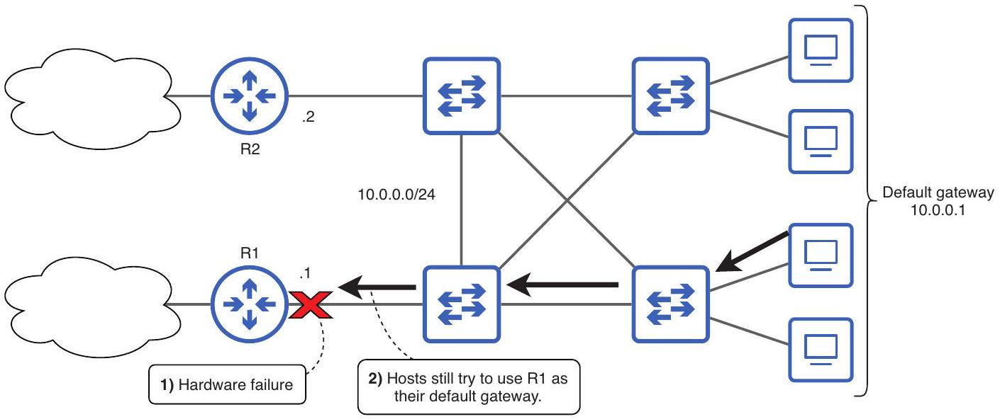
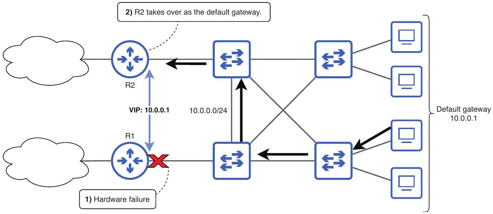
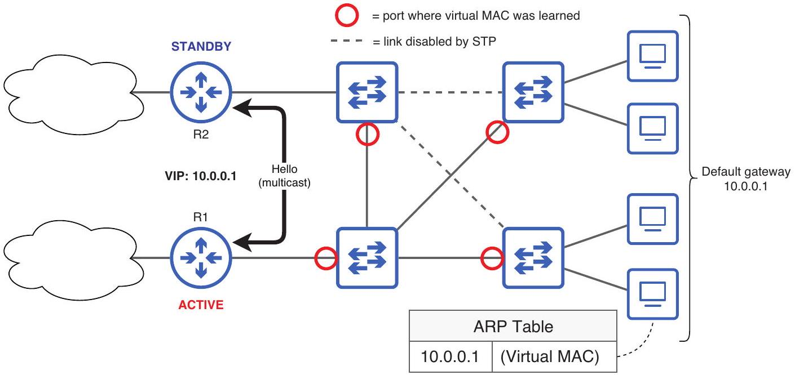
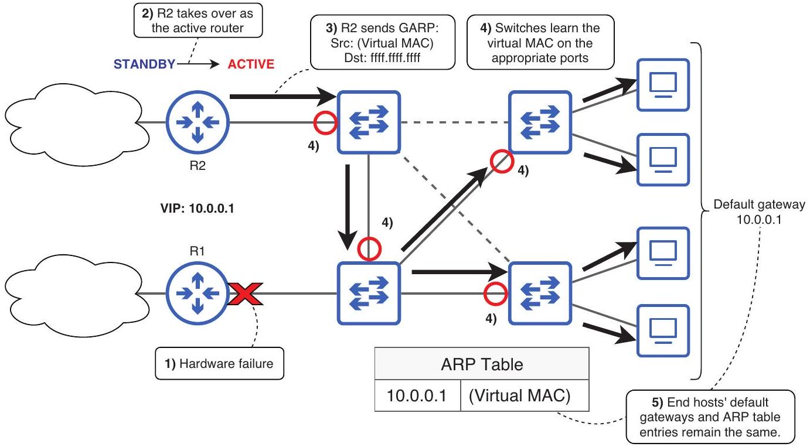
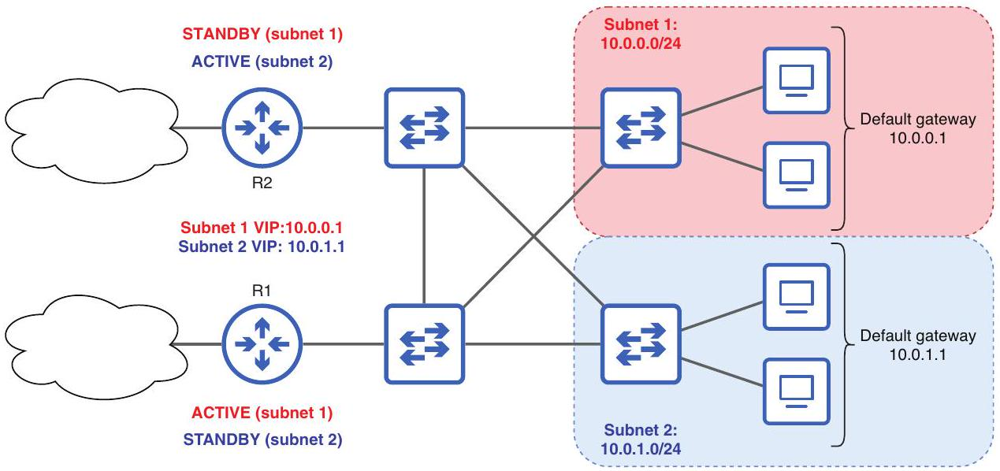
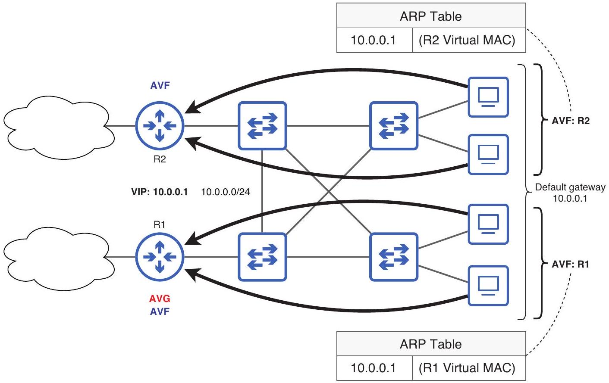
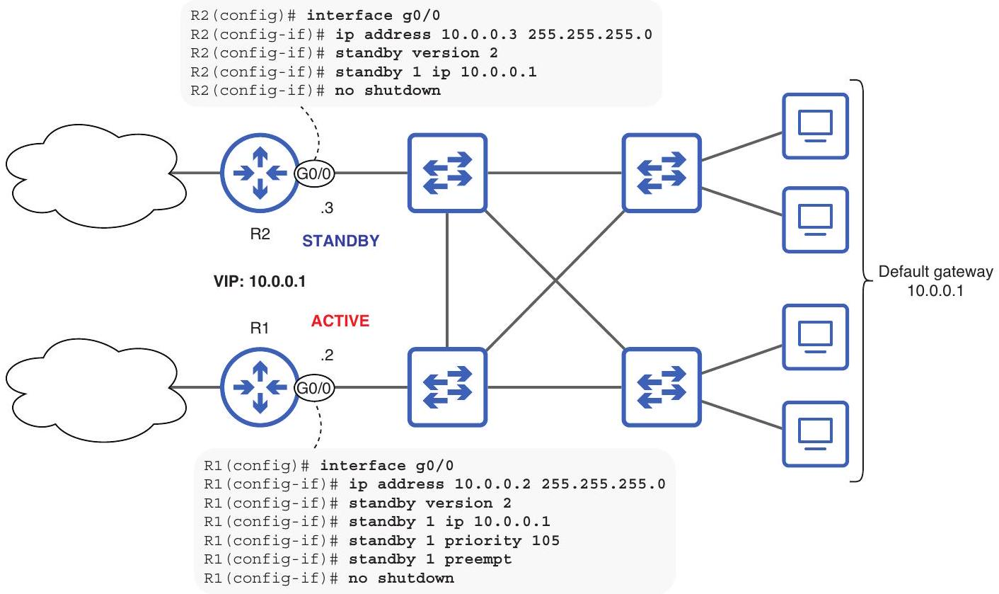
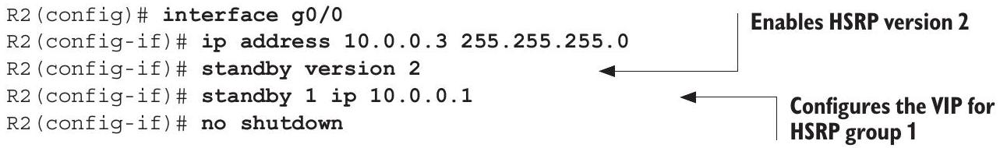
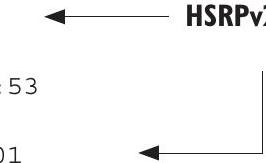

## First hop redundancy protocols

## This chapter covers

- How FHRPs provide a redundant default gateway for end hosts
- The three FHRPs used by Cisco routers and their characteristics
- How to configure Cisco's Hot Standby Router Protocol

When covering STP in chapter 14, I emphasized the importance of redundancy in a LAN. In modern enterprise networks, redundancy plays an essential role in ensuring network reliability and resilience. As businesses increasingly rely on digital operations and processes, network downtime can result in substantial financial losses and damage to one's reputation. Redundancy safeguards against this by eliminating single points of failure.

Redundancy doesn't just mean having multiple potential paths to reach destinations within the same LAN; it also means having multiple potential paths to reach destinations outside of the LAN. First hop redundancy protocols (FHRPs), the topic of this chapter, facilitate this by enabling multiple routers to work together, providing a redundant default gateway for hosts in a LAN. FHRPs constitute CCNA exam topic 3.5: Describe the purpose, functions, and concepts of first hop redundancy protocols.

Cisco routers support three different FHRPs: Hot Standby Router Protocol (HSRP), Virtual Router Redundancy Protocol (VRRP), and Gateway Load Balancing Protocol (GLBP). They all serve the purpose of providing a redundant default gateway for hosts but also have their own unique characteristics. We will begin by covering FHRPs as a whole and then cover the characteristics of each FHRP that you should know for the CCNA exam.

### 19.1 FHRP concepts

First hop redundancy protocol (FHRP) is a category of protocol that allows multiple routers to work together to provide a redundant default gateway for hosts in a LAN, minimizing downtime in the event of a hardware failure. This is the reason for the name: the default gateway is the first hop in the packet's path to its destination.

### 19.1.1 Providing a redundant default gateway

An end host's default gateway is an IP address that is either manually configured or automatically learned via DHCP (the topic of chapter 4 in volume 2). End hosts use the Address Resolution Protocol (ARP) to learn the MAC address of the default gateway and then encapsulate packets to external destinations in frames addressed to the default gateway's MAC address. Because hosts rely on the default gateway to reach external destinations, the default gateway must be resilient to failures.

At first glance, the network in figure 19.1 might look like it deserves a perfect score when it comes to redundancy; there are multiple connections between switches, providing multiple paths to destinations within the LAN, and there are two routers, providing multiple paths to external destinations. However, without an FHRP, the two routers are unable to coordinate with each other to provide a redundant default gateway.


Figure 19.1 Despite the hardware failure on R1, hosts in the LAN still try to use R1 as their default gateway. Without an FHRP, R2 is unable to take over R1's role.

Because the end hosts still use IP address 10.0.0.1 as their default gateway, they will continue to send packets destined for external destinations in frames addressed to R1, despite the hardware failure preventing R1 from fulfilling its role as default gateway. You could reconfigure each host's default gateway to 10.0.0.2 or R2's IP address to 10.0.0.1, but this kind of manual intervention is not acceptable in modern networks; it is expected that the network will recover automatically and with minimal downtime.

Figure 19.2 shows how an FHRP allows R2 to take over as the default gateway after R1's hardware failure. R1 and R2 both share a virtual IP (VIP) address, which is configured as the default gateway of hosts in the LAN. Under normal circumstances, R1 responds to ARP requests directed to the VIP (10.0.0.1), so end hosts will use R1 as their default gateway. However, when a hardware failure prevents R1 from performing its role, R2 will take over as the default gateway; R2 will respond to ARP requests for the VIP.


Figure 19.2 After a hardware failure on R1, R2 takes over as the default gateway. R1 and R2 share a virtual IP (VIP) address, which hosts in the LAN use as their default gateway. The hosts are unaware of the change from R1 to R2.

A set of routers configured to use an FHRP is called a group. A single router can be part of multiple FHRP groups. This comes in handy when a LAN has multiple subnets, as each subnet can have its own FHRP group-its own redundant default gateway IP address.

### 19.1.2 FHRP neighbor relationships

To coordinate with each other, routers using an FHRP communicate via multicast hello messages. Routers send hello messages at regular intervals, and these messages are used both for establishing FHRP neighbor relationships and for maintaining those relationships. If a router stops receiving hello messages from a neighbor, it will assume
that the neighbor has gone down and will act accordingly (e.g., by taking over the role of default gateway). This mechanism is similar to OSPF's mechanism for establishing and maintaining neighbor relationships that we covered in chapter 18.

NOTE The exact multicast address to which hello messages are sent depends on the FHRP. We will cover such details in section 19.2.

As mentioned in chapter 18, multicast messages are flooded by switches, so all hosts in the LAN receive them. However, only routers running the FHRP are interested in the contents of the messages; other hosts simply ignore them. On the other hand, when a device receives a broadcast message, it has to de-encapsulate it and use up processing power to determine if the message is relevant. This is why FHRPs (and dynamic routing protocols) send multicast messages, rather than broadcast; they take up fewer resources on hosts that are not interested in the contents of those messages. Figure 19.3 shows how routers use hello messages to establish and maintain their FHRP neighbor relationship and also introduces a few new concepts.


Figure 19.3 R1 and R2 communicate with multicast hello messages to establish and maintain their FHRP neighbor relationship. R1 becomes the active router, and R2, the standby. When a host sends an ARP request to the VIP, R1 will reply with the virtual MAC address, allowing the host to create an appropriate ARP table entry. Switches will also learn the virtual MAC address on the appropriate port.

Through their hello messages, the routers elect an active router and a standby router. As the names suggest, the active router serves as the default gateway, while the standby router is ready to take over if the active router fails. Note that the terms active and standby are used by HSRP; other FHRPs use different terms that we will cover in section 19.2.

In addition to sharing a VIP, the active and standby routers also share a virtual MAC address. When a host sends an ARP request to the VIP, the active router will reply with the virtual MAC address-not the MAC of its own interface. This results in two actions:

- The host that receives the ARP reply will create an ARP table entry mapping the VIP to the virtual MAC address. To send packets to external destinations, the host will encapsulate the packets in frames destined for the virtual MAC address.
- Switches will learn the virtual MAC address on the appropriate port-the port leading toward the current active router.

NOTE Each FHRP uses a different format for the virtual MAC address. We will cover the virtual MAC address formats in section 19.2.

### 19.1.3 Failover

The process of the active router failing and the standby router taking over its role is called failover. Because the active router and the standby router both share the same IP address (the VIP) and MAC address (the virtual MAC address), there is no need for hosts in the LAN to update their default gateway IP addresses and ARP tables after a failover; they can continue as if nothing happened. However, there is one thing that does need to be updated: the switches' MAC address tables. If a failover occurs but switch MAC address tables aren't updated, switches will not be able to forward frames to the new active router.

To inform switches about its location after taking over the active role, the new active router will send gratuitous ARP (GARP) messages-ARP replies that were not prompted by ARP requests. GARP messages are sent to the broadcast MAC address (unlike regular ARP replies, which are unicast), causing switches to flood them. The source MAC address of these GARP messages is the virtual MAC address; this causes switches in the LAN to update their MAC address tables if necessary, learning the virtual MAC address on the appropriate port.

Figure 19.4 outlines what happens during a failover. After R2 detects R1's failure, it takes over as the active router and sends GARP messages, allowing the switches to re-learn the virtual MAC address on the appropriate port (if necessary-not all switches need to update their MAC address table entry for the virtual MAC). This process is transparent to the end hosts; their default gateway remains 10.0.0.1 (the VIP), and 10.0.0.1 is still mapped to the same virtual MAC address in their ARP tables.

After R1 recovers from its hardware failure-perhaps a faulty power supply is replaced-there are two things that can happen: R1 can reclaim its role as the active router, or it can become the new standby router. If a router (R1) takes over the role of the current operational active router (R2), it is called preemption-the same term is used with regard to OSPF's designated router (DR) and backup designated router (BDR) elections, as covered in chapter 18.


Figure 19.4 An FHRP failover. (1) A hardware failure occurs on R1. (2) R2 takes over as the active router. (3) R2 sends GARP messages, sourced from the virtual MAC and destined for the broadcast MAC. (4) The switches learn the virtual MAC on the appropriate ports-those leading toward the new active router. (5) End hosts' default gateways and ARP table entries for the VIP remain the same.

### 19.2 Comparing FHRPs

Cisco routers support three different FHRPs, each with its own characteristics: Hot Standby Router Protocol (HSRP), Virtual Router Redundancy Protocol (VRRP), and Gateway Load Balancing Protocol (GLBP). For the purpose of the CCNA exam, you should understand the basic characteristics of each. Table 19.1 lists some essential characteristics of each FHRP that we will cover in this section.

Table 19.1 FHRP characteristics
|  | HSRP | VRRP | GLBP |
| :--- | :--- | :--- | :--- |
| Terminology | Active/Standby | Master/Backup | AVG/AVF |
| Multicast IP | v1: 224.0.0.2 v2: 224.0.0.102 | 224.0.0.18 | 224.0.0.102 |
| Virtual MAC format | v1: 0000.0c07.acXX v2: 0000.0c9f.fXXX | 0000.5e00.01XX | 0007.b400.XXYY |
| Cisco proprietary? | Yes | No | Yes |
| Load balancing | Per subnet | Per subnet | Per host |
| Preemption (default) | Disabled | Enabled | AVG: Disabled AVF: Enabled |


EXAM TIP You should know the information in table 19.1 for the exam. Flashcards are a useful tool for remembering information like this.

### 19.2.1 Hot Standby Router Protocol

Hot Standby Router Protocol (HSRP) is a Cisco-proprietary FHRP. As a Cisco-proprietary protocol, it only runs on Cisco routers. HSRP uses the active/standby terminology that we used in section 19.1; the active router functions as the default gateway, while the standby router waits to take over if the active router fails. Preemption is disabled by default; if the previously active router recovers from a failure, it will not retake its active role.

## Hot standby and cold standby

A hot standby is a backup system (it could be a server, a router, or some other device) that is fully operational and running in parallel with the primary (active) system. In the context of HSRP, hot standby means that the standby router is always ready to start forwarding packets. The standby router keeps track of the status of the active router, ready to automatically take over if the active router fails-no manual intervention is required.

A cold standby is a backup system that is not operational under normal circumstances. If the primary system fails, the backup system may need to be started up, configured, cabled, etc. An example of a cold standby router is a spare router kept in storage. Should the active router fail, the standby router is retrieved from storage and used to replace the failed active router. Clearly, this approach is less desirable than using an FHRP like HSRP, which ensures continuous network availability and a smooth transition from active to standby.

There are two versions of HSRP: version 1 and version 2. The two versions are largely similar, but there are some key differences that you should be aware of. HSRPv1 hello messages are sent to multicast IP address 224.0.0.2; this address is not reserved for HSRP but is used to address messages to all routers in the LAN. HSRPv2, on the other hand, uses multicast IP address 224.0.0.102, which is reserved exclusively for HSRPv2 and GLBP (the topic of section 19.2.3).

Another difference is the format of the virtual MAC address. HSRPv1 uses the format 0000.0c07.acXX, where XX is the HSRP group number. For example, HSRPv1 group 1 will use virtual MAC address 0000.0c07.ac01, and HSRPv1 group 15 will use 0000.0c07.ac0f (as covered in chapter 6, 0d15 is equivalent to 0xf). HSRPv2 uses the format 0000.0c9f.fXXX. Using the same examples as previously, HSRPv2 group 1 will use virtual MAC address 0000.0c9f.f001, and group 15 will use 0000.0c9f.f00f.

NOTE Because the HSRPv2 virtual MAC format leaves three hex digits to represent the group number, instead of HSRPv1's two hex digits, HSRPv2 supports more groups. In total, HSRPv1 supports 256 groups (0-255), and HSRPv2 supports 4,096 (0-4,095).

As mentioned in section 19.1.1, a single router can be part of multiple FHRP groups. When there are multiple subnets in a LAN, there should be one HSRP group per subnet. Instead of one router being active in all subnets, you can configure one router to be active in half of the subnets and the other to be active in the remaining subnets. This achieves load balancing, avoiding congestion on any single link in the network.

Figure 19.5 shows an example of load balancing with HSRP. There are two subnets in the LAN: subnet 1 (10.0.0.0/24) and subnet 2 (10.0.1.0/24). R1 is the active router in subnet 1 and the standby router in subnet 2, and vice versa. As a result, hosts in subnet 1 will use R1 as their default gateway (unless it fails), and hosts in subnet 2 will use R2 as their default gateway.


Figure 19.5 HSRP load balancing. R1 is the active router in subnet 1 and the standby router in subnet 2. R2 is the standby router in subnet 1 and the active router in subnet 2.

One final major difference between versions 1 and 2 is that HSRPv2 adds support for IPv6, whereas HSRPv1 only supports IPv4. So far in this book, we have only covered IPv4, but we will begin looking at IPv6 in chapter 20.

### 19.2.2 Virtual Router Redundancy Protocol

Virtual Router Redundancy Protocol (VRRP) is the Internet Engineering Task Force's industry-standard answer to HSRP. At a high level, HSRP and VRRP are nearly identical. However, you should know the differences between them for the CCNA exam. One difference is terminology; instead of HSRP's active and standby routers, VRRP calls them master and backup routers. Furthermore, although HSRP preemption is disabled by default, VRRP preemption is enabled by default.

VRRP's multicast IP and virtual MAC addresses are also different. VRRP routers send hello messages to multicast IP address 224.0.0.18-a reserved address that only VRRP-enabled routers use. The VRRP virtual MAC address format is 0000.5e00.01XX, where XX is the VRRP group number. For example, VRRP group 12 will use the virtual MAC address 0000.5e00.010c.

Perhaps the most significant difference between HSRP and VRRP is that VRRP is an industry-standard protocol, and therefore any vendor is free to implement it on its devices. If a Cisco router and a Juniper router must cooperate to provide a redundant default gateway for a LAN, they must use VRRP; the Juniper router can't run HSRP.

Like HSRP, VRRP can provide load balancing on a per-subnet basis. This can be achieved by configuring one router to be the master router in half of the subnets and the other router to be the master router in the remaining subnets. However, neither HSRP nor VRRP can efficiently achieve load balancing within a single subnet. To achieve that, you'll have to use the next FHRP: GLBP.

### 19.2.3 Gateway Load Balancing Protocol

Gateway Load Balancing Protocol (GLBP) is another Cisco-proprietary FHRP. Of the three FHRPs covered in this chapter, GLBP is unique in that it enables load balancing within a single subnet; some hosts in a subnet will use one router as their default gateway, and others will use the other router (assuming two routers); load balancing is done on a per-host basis.

GLBP works by electing one router as the Active Virtual Gateway (AVG), which then assigns up to four Active Virtual Forwarders (AVF)-the routers that actively forward packets. The AVG itself can be an AVF too. That means that if there are four routers connected to the LAN, traffic will be load-balanced among all four routers. Preemption of the AVG role is disabled by default, but AVF preemption is enabled by default.

Figure 19.6 shows how GLBP works. R1, the AVG, assigns itself as the AVF for half of the hosts and R2 as the AVF for the remaining half. There is only a single subnet in the LAN, but load balancing is achieved on a per-host basis.

Although there is only a single VIP (10.0.0.1), load balancing is achieved by assigning each AVF a unique virtual MAC address. The AVG is responsible for answering ARP requests, but instead of replying with its own MAC address, it replies with the virtual MAC of one of the AVFs, in a round-robin manner. As a result, in a LAN with two AVFs, half of the hosts in the LAN will address frames to one AVF's virtual MAC and the other half to the other AVF's virtual MAC.

DEFINITION Round-robin is a simple method for distributing tasks evenly in a cyclical manner. In the context of GLBP, if there are two AVFs, the AVG will reply with the virtual MAC of AVF 1, then AVF 2, then AVF 1, etc.

Like HSRPv2, GLBP sends hello messages to the reserved multicast IP address 224.0.0.102. The GLBP virtual MAC address format is 0007.b400.XXYY, where XX is the GLBP group number and YY is the AVF number. For example, AVF 1 in group 1 will use virtual MAC 0007.b400.0101, and AVF 2 in group 11 will use virtual MAC 0007 .b400.0b02.


Figure 19.6 GLBP enables load balancing among hosts in the same subnet. Half of the hosts in 10.0.0.0/24 use one AVF (R1) as their default gateway, and the other half use the other AVF (R2). Each AVF has a unique virtual MAC address.

### 19.3 Basic HSRP configuration

CCNA exam topic 3.5 uses the verb describe, not configure (i.e., Describe the purpose, functions, and concepts of first hop redundancy protocols). However, Cisco exams can occasionally be liberal in their interpretation of the exam topics. HSRP is the most commonly used FHRP on Cisco routers, and its basic configuration is worth knowing for the CCNA exam. Furthermore, getting a bit of hands-on practice configuring HSRP in a lab can help you understand the concepts that you have studied. For those reasons, in this section, we'll briefly cover how to configure HSRP.

Before we delve into how to configure HSRP, let's first consider why you would want to implement it in the first place. Think back to figure 19.1, where hosts were sending packets to a router that was down due to a hardware failure, despite there being another functional router connected to the LAN. The result of such a failure is that end users lose connectivity to destinations outside of the LAN: they can't access files on corporate servers, can't access the internet, can't join an important call with a client, etc.

In modern enterprises, the inability to access crucial resources over the network often means an inability to perform required tasks-it's more than a simple inconvenience. Although hardware failures are rare, they are almost inevitable over the lifespan
of a network. That's where HSRP comes into play. To minimize the disruption caused by router hardware failures, redundant routers should be configured with an FHRP, such as HSRP.

Figure 19.7 shows how to configure HSRP on two Cisco routers: R1 and R2. Note that although R1 and R2 share the VIP, each router still requires its own unique IP address, which is primarily used for communication between the two routers. For example, when R1 sends HSRP hello messages, it sources them from its own IP address (10.0.0.2).


Figure 19.7 An HSRPv2 group of two routers. R1 is the active router, and R2 is the standby. If R1 fails, R2 will become the active router. However, because preemption is enabled on R1, it will retake its role after it recovers from the failure.

Let's examine those configurations, specifically the HSRP configurations-you should be familiar with configuring an interface's IP address and enabling it with no shutdown by now. The following example shows how to configure R1, the active router of the HSRP group:

```
R1(config) # interface g0/0
R1(config-if)# ip address 10.0.0.2 255.255.255.0
R1(config-if) # standby version 2
R1(config-if) # standby 1 ip 10.0.0.1
R1(config-if) # standby 1 priority 105
R1(config-if) # standby 1 preempt
R1(config-if) # no shutdown
```

The first HSRP command is standby version 2. As you probably guessed, this command enables HSRP version 2. If you enable HSRPv2 on one router, you must enable it on the other router; HSRPv1 and HSRPv2 aren't compatible.

The second command is standby group ip vip, used to configure the VIP. When configuring an HSRP group, it is important that both of these parameters-the group number and the VIP-match on both routers. If either of these don't match, the routers won't be able to work together to function as a redundant default gateway.

The third command is standby group priority priority. This command is used to influence which router becomes active and which becomes standby. The HSRP active router is determined in the following manner:

1 The router with the highest priority
2 The router with the highest IP address

In this example, R1 G0/0's IP address is 10.0.0.2, and R2 G0/0's is 10.0.0.3. As a result, if both routers use the default HSRP priority (100), R2 will become the active router; it has a higher IP address. To ensure that R1 becomes the active router, I used the command standby 1 priority 105, raising R1's priority above R2's.

Finally, I enabled preemption-which is disabled by default-with the command standby 1 preempt. Preemption determines what happens when a higher-priority router comes back online after a failure. Enabling preemption ensures that R1 is the active router as long as it is up and running. If R1 were to fail, leading to R2 taking over as the active router, R1 would take over the active role again after recovering from the failure.

The following example shows R2's configurations, highlighting the HSRP-related commands. Two commands that I used on R1 are missing: I didn't configure R2's priority, and I didn't enable preemption. By increasing R1's priority to 105 , I ensured that it becomes the active router; there is no need to modify R2's priority. And preemption only needs to be configured on the higher-priority router that retakes its role after a failure; the command is not necessary on the lower-priority router (although it would do no harm to configure it anyway):


NOTE The commands we have covered here can also be used to configure VRRP and GLBP, replacing standby with vrrp or glbp (except standby version 2). However, I wouldn't expect any questions about VRRP or GLBP configuration on the exam.

After configuring HSRP, you can use show standby brief to verify its operation. In the following example, I use the command on R1:

```
R1# show standby brief
        P indicates configured to preempt.
        |
```

| Interface | Grp | Pri | P | State | Active | Standby | Virtual IP |
| :--- | :--- | :--- | :--- | :--- | :--- | :--- | :--- |
| Gio/0 | 1 | 105 | P | Active | local | 10.0.0.3 | 10.0.0.1 |

The State of Active indicates that R1 is the active router. This is confirmed by the value of local in the Active column. The Standby column states 10.0 .0 .3 -R3's IP address. For comparison, in the following example, I use the same command on R2:

```
R2# show standby brief
        P indicates configured to preempt.
        |
```

| Interface | Grp | Pri P |  | P State | Active | Standby | Virtual IP |
| :--- | :--- | :--- | :--- | :--- | :--- | :--- | :--- |
| Gio/o | 1 | 100 |  | Standby | 10.0.0.2 | local | 10.0.0.1 |

This time, the State is Standby, which is confirmed by the value of local in the Standby column. The Active column states 10.0.0.2-R1's IP address. For more detailed information about HSRP, you can remove the brief keyword; the following example shows the output of show standby on R1, pointing out some additional information not shown in the output of the previous command:

```
R1# show standby
GigabitEthernet0/0 - Group 1 (version 2)
```


HSRPv2 is enabled.

```
    State is Active
        2 state changes, last state change 00:05:53
```

The HSRPv2 virtual

```
    Virtual IP address is 10.0.0.1
```

MAC address format

```
    Active virtual MAC address is 0000.0c9f.f001
        Local virtual MAC address is 0000.0c9f.f001 (v2 default)
    Hello time 3 sec, hold time 10 sec
        Next hello sent in 1.536 secs
```

The default HSRP timers. The

```
    Preemption enabled
```

hold time is equivalent to OSPF's dead time.

```
    Active router is local
    Standby router is 10.0.0.3, priority 100 (expires in 9.344 sec)
    Priority 105 (configured 105)
    Group name is "hsrp-Gi0/0-1" (default)
```


## Summary

- First hop redundancy protocol (FHRP) is a category of protocol that allows multiple routers to work together to provide a redundant default gateway for hosts in a LAN.
- The active router actively forwards packets between hosts in the LAN and external destinations. The standby router is ready to take over if the active router fails.
- Routers using an FHRP share a virtual IP (VIP) address, which is configured as the default gateway of hosts in the LAN. They also share a virtual MAC address.
- The active router uses the virtual MAC when replying to ARP requests sent to the VIP. When hosts send packets to external destinations, the frames encapsulating the packets will be sent to the active router.

- Routers using an FHRP communicate via multicast hello messages, which are sent at regular intervals. Hello messages are used to establish and maintain neighbor relationships.
- When the active router fails and the standby router takes over the active role, it is called a failover.
- After a failover, the new active router sends gratuitous ARP (GARP) messages- ARP replies that were not prompted by ARP requests.
- GARP messages are addressed to the broadcast MAC address (ffff.ffff.ffff) in order to update switches' MAC address tables.
- Because the VIP and virtual MAC addresses remain the same, FHRP failovers are transparent to end hosts; the end hosts are not aware that a failover has occurred.
- Cisco routers support three FHRPs: HSRP, VRRP, and GLBP.
- Hot Standby Router Protocol (HSRP) is a Cisco-proprietary FHRP with two versions: HSRPv1 and HSRPv2.
- Preemption is an FHRP feature that allows a higher-priority router to take over as the active router, even if there is another active router present.
- HSRP elects one active router, and other routers become standby routers. HSRP preemption is disabled by default.
- HSRPv1 uses the multicast IP address 224.0.0.2, and HSRPv2 uses 224.0.0.102.
- The HSRPv1 virtual MAC address format is 0000.0c07.acXX, where XX is the HSRP group number. The HSRPv2 format is 0000.0c09.fXXX, where XXX is the group.
- HSRPv2 adds IPv6 support, whereas HSRPv1 only supports IPv4.
- HSRP supports per-subnet load balancing by configuring a different active router for different subnets.
- Virtual Router Redundancy Protocol (VRRP) is an industry-standard FHRP, which can be implemented on any vendor's routers.
- VRRP elects one master router, and other routers become backup routers. Unlike HSRP, preemption is enabled by default.
- VRRP uses the multicast IP address 224.0.0.18.
- The VRRP virtual MAC address format is 0000.5e00.01XX, where XX is the VRRP group number.
- Like HSRP, VRRP supports per-subnet load balancing.
- Gateway Load Balancing Protocol (GLBP) is a Cisco-proprietary FHRP that enables load balancing within a single subnet; load balancing is done on a per-host basis.
- GLBP elects one Active Virtual Gateway (AVG), which assigns up to four Active Virtual Forwarders (AVF). The AVG itself can be an AVF. AVG preemption is disabled by default, but AVF preemption is enabled.

- Although there is a single VIP, GLBP achieves load balancing by assigning each AVF a unique virtual MAC address. The format is 0007.b400.XXYY, where XX is the group number and YY is the AVF number.
- The AVG replies to ARP requests using the virtual MAC of one of the AVFs in a round-robin manner.
- Although routers using an FHRP share a VIP, each router still needs its own unique IP address. It uses this IP address when communicating with other routers.
- Enable HSRP version 2 with standby version 2 in interface config mode.
- Configure the HSRP VIP with standby group ip vip in interface config mode.
- Configure the HSRP priority (default 100) with standby group priority priority in interface config mode.
- Enable HSRP preemption with standby group preempt in interface config mode.
- Use show standby brief and show standby to verify HSRP operation.
