## IPv6 addressing

## This chapter covers

- Why IPv6 is needed
- How to convert between binary, decimal, and hexadecimal number systems
- The structure of IPv6 addresses
- How to configure IPv6 addresses on Cisco routers
- The various IPv6 address types

IPv4, the version of the Internet Protocol that we have focused on up to this point in the book, was developed at a time when no one knew the internet would be as ubiquitous as it is today; the current IPv4 standard was published in 1981. As a result, IPv4 has limitations, the most significant one being insufficient address space; there aren't enough IPv4 addresses available for all of the devices in the world that require network connectivity.

In this chapter, we will cover the next version of the Internet Protocol: IPv6. IPv6 provides several benefits over IPv4, the most significant one being a much larger address space. Although IPv4 is still the dominant version in use today, IPv6 adoption is growing, and the modern network engineer must be familiar with both. Specifically, we will cover the following CCNA exam topics:

- 1.8: Configure and verify IPv6 addressing and prefix
- 1.9: Describe IPv6 address types

## What about IPv5?

Given that IPv6 follows IPv4, "What about IPv5?" is a natural question. Internet Stream Protocol (ST), a family of experimental protocols designed to work with applications such as real-time video and voice, used version number 5 in the Version field of the IP header. Although ST was never referred to as IPv5, IPv4's successor was named IPv6 to avoid any confusion with ST.

### 20.1 The need for IPv6

The main reason IPv6 is needed is that there simply aren't enough IPv4 addresses available. IPv4 addresses' 32-bit length allows for 4,294,967,296 (232) unique IPv4 addresses. However, not all of those addresses are available to assign to hosts. For example, the class D range is reserved for multicast addresses, and the class E range is reserved for experimental purposes and research.

Even with all of the reserved addresses removed, there are still billions of IPv4 addresses available for hosts. However, in our era of unprecedented connectivity, even those billions of addresses are not enough. We're running out of IPv4 addresses and have been for a long time; this problem is called IPv4 address exhaustion. The problem is exacerbated by inefficient use of the available address space, but even with the most efficient use, it would only be a matter of time before we run out of IPv4 addresses.

IP address assignments are controlled by an organization called the Internet Assigned Numbers Authority (IANA). IANA distributes IP address space to various Regional Internet Registries (RIR), which then assign addresses to organizations (such as Internet Service Providers) as needed. Figure 20.1 shows the five RIRs and the regions they serve.

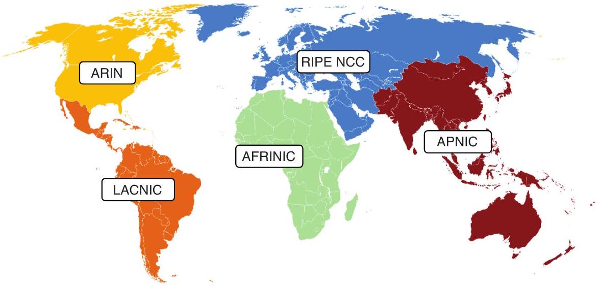
Figure 20.1 The five RIRs. AFRINIC serves Africa. APNIC serves the Asia-Pacific region. ARIN serves Canada, the United States, parts of the Caribbean, and Antarctica. LACNIC serves most of the Caribbean and all of Latin America. RIPE NCC serves Europe, West Asia, Central Asia, and Russia.

Unfortunately, the RIRs are running out of IPv4 addresses. For example, ARIN announced exhaustion of its IPv4 address pool in 2015, RIPE NCC announced the same in 2019, and LACNIC in 2020.

In addition to subnetting with CIDR (as we covered in chapter 11), which allows for more efficient use of the IPv4 address space, two particular technologies-private IPv4 addresses and network address translation (NAT)-have been instrumental in extending the lifespan of IPv4. We will cover private IPv4 addresses and NAT in chapter 9 of volume 2, but in this chapter, we'll focus on the long-term solution to IPv4 address exhaustion: IPv6.

IPv6 addresses are four times the size of IPv4 addresses: 128 bits. With that information, you might assume that IPv6 provides four times as many addresses as IPv4, but that is not the case; each additional bit doubles the number of addresses. Let's compare the number of IPv4 and IPv6 addresses:

- 4,294,967,296 (2 ${ }^{32}$ ) IPv4 addresses
- 340,282,366,920,938,463,463,374,607,431,768,211,456 (2 ${ }^{128}$ ) IPv6 addresses

The number of grains of sand on Earth is estimated to be between $10^{20}$ to $10^{24}$, so the number of IPv6 addresses is between 340 trillion and 3.4 quintillion times larger than the estimated number of grains of sand on Earth. This enormous number ensures that the IPv6 address space is more than sufficient to accommodate the current and foreseeable future needs of the growing internet.

Although there are various differences between IPv4 and IPv6 (the size and format of their addresses being just one of them), their general purpose is the same. Just like IPv4, IPv6 encapsulates Layer 4 segments (i.e., TCP or UDP) with a header to make packets, providing end-to-end addressing from a message's source host to its destination host. Likewise, an IPv6 packet is encapsulated in an Ethernet frame at each hop in the path to its final destination, just like an IPv4 packet.

## IPv6 adoption

Google keeps track of the percentage of users that access Google over IPv6 at https:// www.google.com/intl/en/ipv6/statistics.html. At the time of writing, it is nearly 45\%-a major increase from roughly 1\% just a decade ago.

### 20.2 Hexadecimal

Whereas IPv4 addresses are written in dotted-decimal notation, IPv6 addresses are written in hexadecimal. Before we cover the details of how IPv6 addresses are written in section 20.3, let's review hexadecimal notation and look at how to convert between decimal, binary, and hexadecimal.

As we covered in chapter 6, the hexadecimal number system uses the same 10 digits as the decimal number system (0-9), and the first 6 letters of the alphabet (A-F)-a
total of 16 digits. In effect, this means that a single hexadecimal digit contains four bits of information because $2^{4}=16$. Table 20.1 demonstrates this: 0b0000-0b1111 can be represented by 0×0-0×F (the equivalent decimal values are included for reference).

Table 20.1 Decimal, binary, and hexadecimal numbers
| Decimal | Binary | Hex. | Decimal | Binary | Hex. |
| :--- | :--- | :--- | :--- | :--- | :--- |
| 0 | 0000 | 0 | 8 | 1000 | 8 |
| 1 | 0001 | 1 | 9 | 1001 | 9 |
| 2 | 0010 | 2 | 10 | 1010 | A |
| 3 | 0011 | 3 | 11 | 1011 | B |
| 4 | 0100 | 4 | 12 | 1100 | C |
| 5 | 0101 | 5 | 13 | 1101 | D |
| 6 | 0110 | 6 | 14 | 1110 | E |
| 7 | 0111 | 7 | 15 | 1111 | F |


NOTE A group of four bits (a half-byte) is also called a nibble.
IPv6 addresses are split into groups of four hexadecimal characters (16 bits) when written (a string of 128 bits is not very human-readable), so let's practice converting 16-bit values between binary and hexadecimal. This skill is necessary for mastering IPv6, just as converting 8-bit values between binary and decimal is necessary for IPv4.

Converting from binary to hexadecimal can be done with a three-step process. To demonstrate, let's convert 0b1101101100101111 to hexadecimal:

1 Split the number into four-bit groups: 1101, 1011, 0010, 1111.
${ }^{2}$ Convert each four-bit group into decimal: 13, 11, 2, 15.
3 Convert each decimal number into hexadecimal: D, B, 2, F.

NOTE Memorizing the decimal values of hexadecimal A-F is very helpful: 0 d10 = $0 \times \mathrm{A}, 0 \mathrm{~d} 11=0 \times \mathrm{B}, 0 \mathrm{~d} 12=0 \times \mathrm{C}, 0 \mathrm{~d} 13=0 \times \mathrm{D}, 0 \mathrm{~d} 14=0 \times \mathrm{E}, 0 \mathrm{~d} 15=0 \times \mathrm{F}$.

We now have the answer: 0b1101101100101111 is equivalent to 0xDB2F. As you can see, hexadecimal is much more compact than binary; the same value can be expressed with one quarter the number of digits.

To convert from hexadecimal to binary, you can use a similar process. Let's do that with the number 0x41AE:

1 Split up the hexadecimal digits: 4, 1, A, E.
2 Convert each hexadecimal digit to decimal: 4, 1, 10, 14.
3 Convert each decimal digit to binary: 0100, 0001, 1010, 1110.

That's the answer: 0x41AE is equivalent to 0b0100000110101110. For further practice, write some random 16-bit numbers in binary and convert them to hexadecimal. Then, do the same in the opposite direction: write some random four-digit hexadecimal numbers and convert them to binary. You can check your answers with a free converter online: try a Google search for "binary to hexadecimal converter."

NOTE Make sure you can do these conversions confidently before moving on. For some fun practice converting 1-byte numbers, which follows the same process we just covered, you can try the game "Flippy Bit And the Attack of the Hexadecimals from Base 16" at https://mng.bz/PZRv. A browser game, Android app, and iOS app are available.

### 20.3 IPv6 addressing

Now that you're comfortable converting between binary and hexadecimal, let's move on to IPv6 addressing. IPv6 addresses can be intimidating to many students at first, primarily because they are quite large and because they are written in hexadecimal, rather than decimal. However, there is no need to be afraid of IPv6; after the initial period of unfamiliarity, you'll grow to love it! I, for one, welcome our new IPv6 overlords. Both IPv4 and IPv6 are just binary represented in two different ways: dotted decimal versus hexadecimal.

### 20.3.1 IPv6 header

Before looking at IPv6 addresses themselves, let's take a brief look at the header that they are part of. As with the IPv4 header, don't expect any questions about the specifics of the IPv6 header on the CCNA exam. However, a basic understanding of the header provides valuable context for understanding IPv6 as a whole. Figure 20.2 shows the format of the IPv6 header.

|  | Byte | 0 |  |  |  |  |  |  |  | 1 |  |  |  |  |  |  |  |  | 2 |  |  |  |  |  |  |  | 3 |  |  |  |  |  |  |  |
| :--- | :--- | :--- | :--- | :--- | :--- | :--- | :--- | :--- | :--- | :--- | :--- | :--- | :--- | :--- | :--- | :--- | :--- | :--- | :--- | :--- | :--- | :--- | :--- | :--- | :--- | :--- | :--- | :--- | :--- | :--- | :--- | :--- | :--- | :--- |
| Byte | Bit | 0 | 1 | 2 | 3 | 4 | 5 | 6 | 7 | 8 | 9 | 10 | 11 | 12 | 13 |  | 14 | 15 | 16 | 17 | 18 | 19 | 20 | 21 | 22 | 23 | 24 | 25 | 26 | 27 | 28 | 29 | 30 | 31 |
| 0 | 0 | Version |  |  |  | Traffic Class |  |  |  |  |  |  |  | Flow Label |  |  |  |  |  |  |  |  |  |  |  |  |  |  |  |  |  |  |  |  |
| 4 | 32 | Payload Length |  |  |  |  |  |  |  |  |  |  |  |  |  |  |  |  | Next Header |  |  |  |  |  |  |  | Hop Limit |  |  |  |  |  |  |  |
| 8 | 64 |  |  |  |  |  |  |  |  |  |  |  |  |  |  |  |  |  |  |  |  |  |  |  |  |  |  |  |  |  |  |  |  |  |
| 12 | 96 |  |  |  |  |  |  |  |  |  |  |  |  |  |  |  |  |  |  |  |  |  |  |  |  |  |  |  |  |  |  |  |  |  |
| 16 | 128 |  |  |  |  |  |  |  |  |  |  |  |  |  |  |  |  |  |  |  |  |  |  |  |  |  |  |  |  |  |  |  |  |  |
| 20 | 160 |  |  |  |  |  |  |  |  |  |  |  |  |  |  |  |  |  |  |  |  |  |  |  |  |  |  |  |  |  |  |  |  |  |
| 24 | 192 |  |  |  |  |  |  |  |  |  |  |  |  |  |  |  |  |  |  |  |  |  |  |  |  |  |  |  |  |  |  |  |  |  |
| 28 | 224 |  |  |  |  |  |  |  |  |  |  |  |  |  |  |  |  |  |  |  |  |  |  |  |  |  |  |  |  |  |  |  |  |  |
| 32 | 256 |  |  |  |  |  |  |  |  |  |  |  |  |  |  |  |  |  |  |  |  |  |  |  |  |  |  |  |  |  |  |  |  |  |
| 36 | 288 |  |  |  |  |  |  |  |  |  |  |  |  |  |  |  |  |  |  |  |  |  |  |  |  |  |  |  |  |  |  |  |  |  |

Figure 20.2 The format of the IPv6 header. The fields are Version, Traffic Class, Flow Label, Payload Length, Next Header, Hop Limit, Source Address, and Destination Address. The header is 40 bytes in size.

Just like the IPv4 header, the first field of the IPv6 header is the Version field. This field is four bits in length and is always set to 0b0110 (0d6) to indicate IPv6. The next field is the Traffic Class field, an 8-bit field that is used for Quality of Service (QoS)-the topic of chapter 10 of volume 2. This field is split up into two parts: the 6-bit Differentiated Services Code Point (DSCP) and the 2-bit Explicit Congestion Notification (ECN)-just like in the IPv4 header. We'll cover how this field is used in chapter 10 of volume 2.

Next is a 20-bit field called Flow Label. This field is, as the name suggests, used to label flows; a flow is a sequence of packets sent from a particular source to a particular destination (i.e., a TCP session between two hosts). The potential uses of this field are beyond the scope of the CCNA exam, but it can also play a role in QoS.

The fourth field is Payload Length, a 16-bit field that is used to indicate the length of the packet's encapsulated payload (i.e., the encapsulated TCP or UDP segment). Whereas the IPv4 header is variable in length (20-60 bytes), the IPv6 uses a fixed 40-byte header. As a result, whereas IPv4 uses two separate length fields-Internet Header Length to indicate the header's length and Total Length to indicate the entire packet's length-IPv6 only requires a single length field, indicating the size of the payload.

The next field of the IPv6 header is Next Header, which indicates the type of message encapsulated in the packet; this is equivalent to IPv4's Protocol field. For example, a value of 6 in this field indicates that a TCP segment is encapsulated inside. Following are some common values you can expect in the IPv6 Next Header and IPv4 Protocol fields:

- 1: ICMP
- 6: TCP
- 17: UDP
- 58: ICMPv6 (ICMP for IPv6)
- 88: EIGRP
- 89: OSPF

The final field before the addresses is the Hop Limit field, which is equivalent to IPv4's Time to Live (TTL) field. When a host sends a packet, it will set a certain value in this field, and each router that forwards the packet will decrement the value by 1. If the value reaches 0, the router will drop the packet. The purpose of this field is to prevent packets from looping around the network indefinitely (although loops should not occur in a properly configured network).

The final two fields are the Source Address and Destination Address fields-two 128bit fields that contain the packet's source and destination IPv6 addresses. In section 20.3.2, we'll explore how these addresses are structured.

### 20.3.2 IPv6 address structure

An IPv6 address is a 128-bit number that identifies a host at Layer 3 of the TCP/IP model. As the following example shows, a string of 128 bits is not very human-readable:

001000000000000100001101101110000101100100010111111010101011110101 10010101100010000101111110101011001001001011010101100110111101

IPv4 addresses are divided into four groups of 8 bits and written in dotted decimal to make them more human-readable. For demonstration purposes, here's what the previous IPv6 address would look like written in dotted decimal:
32.1.13.184.89.23.234.189.101.98.23.234.201.45.89.189

Although the dotted-decimal address is more manageable than the binary address, it's still quite long. To allow the same address to be written in even fewer digits, IPv6 addresses are divided into eight groups of 16 bits, separated by colons, and written in hexadecimal. That same IPv6 looks like this when written in hexadecimal:

2001:0db8:5917:eabd:6562:17ea:c92d:59bd

NOTE Hexadecimal can be written using uppercase or lowercase letters (A-F or a-f). However, IPv6 addresses should be written using lowercase letters-more on this later.

There is no official or standard term for each group of 16 bits in an IPv6 address. I previously preferred quartet because each group results in four hexadecimal digits. Another common term is hextet, although the term implies 6 bits, not 16 bits; the precise term is hexadectet. However, hextet is more common-probably because it's easier to pronounce. Although it is an informal term, I will use hextet as a convenient way to refer to each group of 16 bits in an IPv6 address.

Figure 20.3 shows the previous IPv6 address along with the binary of each hextet. It also introduces the IPv6 prefix length, which is always written with slash notation (/64)-no more dotted-decimal netmasks!

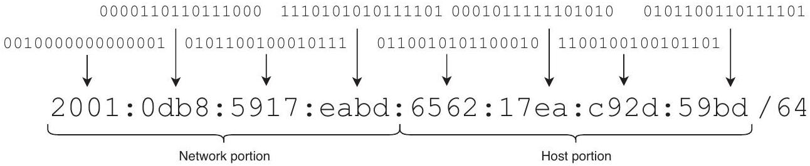
Figure 20.3 An IPv6 address written in hexadecimal and binary. The prefix length is $/ 64$, meaning that the first half ( 64 bits) of the address is the network portion, and the second half ( 64 bits) is the host portion.

NOTE IPv6 typically uses /64 prefix lengths. Although this is extremely inefficient-each subnet contains about 18 quintillion addresses-the IPv6 address space is so large that /64 prefix lengths are preferred due to their simplicity.

### 20.3.3 Abbreviating IPv6 addresses

Although hexadecimal notation makes IPv6 addresses much more manageable than a simple string of 128 bits, it still results in 32 digits-much longer than an IPv4 addess, which is 4-12 digits in dotted decimal. Fortunately, IPv6 provides two methods for abbreviating addresses, which can significantly reduce their length and complexity:

- Removing leading zeros
- Omitting consecutive all-zero hextets

Leading zeros-any hexadecimal 0 digits on the left side of a hextet-can be removed to shorten the hextet. Here is an example:

- Original address-2001:0db8:0000:001b:20a1:0020:0080:34bd
- Abbreviated address-2001:db8:0:1b:20a1:20:80:34bd

In the abbreviated address, I removed leading zeros from five hextets. Note that the 0020 and 0080 hextets were abbreviated to 20 and 80, respectively. Trailing zeros-those on the right side of a hextet-cannot be removed. Furthermore, the 0000 octet was abbreviated to 0-only three of the four zeros can be removed, not all four.

The second method is to omit consecutive all-zero hextets-two or more hextets of all zeros (0x0000); the omitted hextets are represented by a double colon. Here is an example of this method:

- Original address-2001:2db8:0000:0000:0000:0000:1280:34bd
- Abbreviated address-2001:2db8::1280:34bd

The original address has four consecutive all-zero hextets, which were replaced with a double colon in the abbreviated address. Because IPv6 addresses are eight hextets in length, there is no ambiguity in the abbreviated address; only four hextets are displayed, so we can deduce that four all-zero hextets were abbreviated by the double colon.

NOTE A double colon can only be used once in an address. If there are multiple choices for where to use it (i.e., 2001:0db8:0000:0000:1234:0000:0000:0001), only one series of all-zero hextets can be shortened (i.e., 2001:0db8::1234:0000: 0000:0001).

The two address-abbreviation methods can be combined if the address permits it. Following is an example of abbreviating an address both by removing leading zeros and by omitting consecutive all-zero hextets:

- Original address-2001:0db8:0000:0000:002f:0001:0000:34bd
- Abbreviated address—2001:db8::2f:1:0:34bd

## RFC 5952: IPv6 address representation

IPv6 address representation-how we write IPv6 addresses-is addressed in RFC 5952. Its status is "proposed standard," meaning it has not been implemented as a true internet standard. However, it provides some useful guidelines for how to write IPv6 addresses that I recommend following for consistent and accurate IPv6 address representation:

- All leading zeros must be removed. 2001:0db8::0001 is incorrect; it must be written as 2001:db8::1
- The double colon must abbreviate the address as much as possible. For example, 2001:db8:0:0:0:0:2:1 cannot be abbreviated as 2001:db8::0:2:1; it must be abbreviated as 2001:db8::2:1.
- An individual all-zero hextet cannot be omitted with a double colon. For example, 2001:db8::1:2:3:4:5 is incorrect; it must be written as 2001:db8:0:1:2:3:4:5.
- If there are multiple choices for the placement of a double colon, it must be used to replace the longest series of all-zero hextets. For example, 2001:0:0:1:0:0:0:1 must be abbreviated as 2001:0:0:1::1.
If the two choices are of equal length, the leftmost series must be replaced. For example, 2001:db8:0:0:1:0:0:1 must be abbreviated as 2001:db8::1:0:0:1.
- Hexadecimal characters a-f must be written in lowercase, not uppercase.

Table 20.2 shows some more full and abbreviated IPv6 addresses for your reference. For the rest of this chapter and chapter 21, I will abbreviate IPv6 addresses by default.

Table 20.2 IPv6 address abbreviation
| Full address | Abbreviated address |
| :--- | :--- |
| 2e09:2100:0222:00f0:1000:0000:0000:011f | 2e09:2100:222:f0:1000::11f |
| fd00:af89:0010:01df:ac80:0000:0000:0000 | fd00:af89:10:1df:ac80:: |
| ff02:0000:0000:0000:0000:0000:0000:0002 | ff02::2 |
| fe80:0000:0000:0000:1010:000a:0bad:cafe | fe80::1010:a:bad:cafe |
| 0000:0000:0000:0000:0000:0000:0000:0001 | ::1 |


### 20.3.4 Identifying the IPv6 prefix

A network prefix is the combination of a network address and prefix length. For example, if a host has IPv4 address 192.168.1.10/24, the prefix is 192.168.1.0/24. You should be comfortable with this process by now-we covered it in detail in chapter 11.

The concept is exactly the same in IPv6: an IPv6 prefix is the combination of a network address (an IPv6 address with an all-zero host portion) and a prefix length. For example, if a host has IPv6 address 2001:db8:1:2:a:b:c:d/64, what is the network prefix?

Because IPv6 almost exclusively uses /64 prefix lengths, you don't even need to convert to binary: simply convert the final four hextets-the host portion of the address-to
all zeros: 2001:db8:1:2::/64 (abbreviating the host portion's zeros with ::). Table 20.3 lists some example IPv6 host addresses and their prefixes.

Table 20.3 IPv6 network prefixes
| Host address | Prefix |
| :--- | :--- |
| fd00:af89:1234:1200:0:123:4567:beef/64 | fd00:af89:1234:1200::/64 |
| 2001:db8:babe:cafe:2100:101:0:1/64 | 2001:db8:babe:cafe::/64 |
| fd00:1234:5678:9012::feed:dad/64 | fd00:1234:5678:9012::/64 |
| 2333::efd:1212:1:1/64 | 2333::/64 |
| 3100:ab00:1f26::2000:1/64 | 3100:ab00:1f26::/64 |


NOTE Identifying the IPv6 prefix when using non-/64 prefix lengths (i.e., /55, /73, /97) can be a useful exercise for converting between hexadecimal and binary but is not very practical in reality; IPv6 usually uses /64.

### 20.4 IPv6 address configuration

Although IPv6 involves learning many new concepts, I have some good news: many IPv6 configuration and verification commands are identical to IPv4 configuration commands, simply replacing ip with ipv6. Here are some examples:

- IPv4-ip address, IPv6-ipv6 address
- IPv4-ip route, IPv6-ipv6 route
- IPv4-show ip interface brief, IPv6-show ipv6 interface brief
- IPv4-show ip route, IPv6-show ipv6 route

In this section, we'll look at a couple of methods for configuring IPv6 addresses on Cisco router interfaces: manual configuration and a method that allows the router to automatically generate the address's host portion. Figure 20.4 shows the simple network we will use: a single router (R1) connected to three networks.

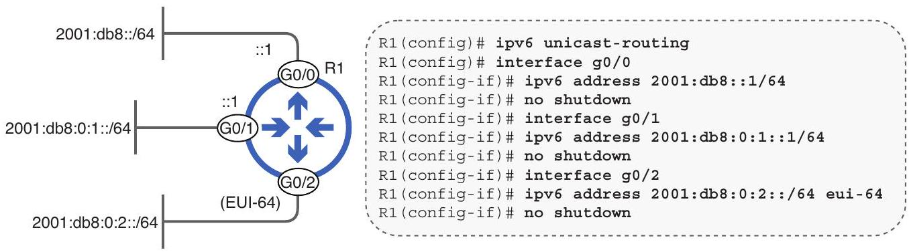
Figure 20.4 A router with three connected IPv6 networks. ipv6 unicast-routing allows the router to forward IPv6 packets. ipv6 address configures an IPv6 address on each interface. Modified EUI-64 is used to automatically generate the host portion of G0/2's IPv6 address.

The first command you should use when configuring IPv6 on a Cisco router is ipv6 unicast-routing in global config mode. Without this command, you will be able to configure IPv6 addresses on the router, but it won't be able to route IPv6 packets. For example, R1 won't be able to forward packets between hosts in 2001:db8::/64 and 2001:db8:0:1/64 without this command.

EXAM TIP Don't forget ipv6 unicast-routing! It's easy to overlook because IPv4 routing is enabled by default, but IPv6 routing isn't.

### 20.4.1 Manually assigning an IPv6 address

The command to manually assign an IPv6 address is ipv6 address address/prefix -length. In addition to using ipv6 instead of ip, another major difference is that you have to specify the prefix length using slash notation (/64), instead of a dotteddecimal netmask like in IPv4. In the following example, I configure R1 G0/0's IPv6 address and confirm with show ipv6 interface brief:

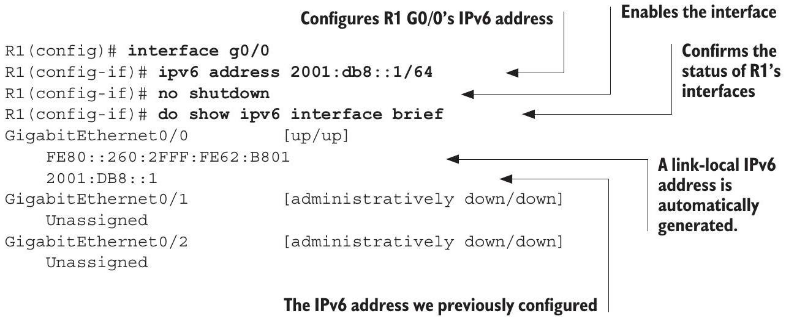
NOTE Cisco IOS show commands display IPv6 addresses using uppercase A-F. RFC 5952 isn't a full internet standard, so its recommendations aren't always followed.

There are a few main things to point out about the previous example. First, notice that you can configure abbreviated IPv6 addresses; as long as you abbreviate the address correctly, Cisco IOS will be able to interpret it as the proper address. Second, after configuring the 2001:db8::1/64 address on G0/0, a second address is automatically generated-a link-local address. We will cover this address type in section 20.5.3.

For demonstration purposes, in the following example, I configure G0/1's full, unabbreviated IPv6 address. Notice that, in the output of show ipv6 interface brief, Cisco IOS automatically abbreviates the address to its shortest possible version:

```
R1(config) # interface g0/1
R1(config-if)# ipv6 address 2001:0db8:0000:0001:0000:0000:0000:0001/64
R1(config-if) # no shutdown
R1(config-if)# do show ipv6 interface brief
GigabitEthernet0/0 [up/up]
```

Configures R1 G0/1's IPv6 address

```
    FE80::260:2FFF:FE62:B801
    2001:DB8::1
GigabitEthernet0/1 [up/up]
```

Cisco IOS automatically

```
    FE80::260:2FFF:FE62:B802
```

abbreviates the address.

```
    2001:DB8:0:1::1
GigabitEthernet0/2 [administratively down/down]
Unassigned
```

One practical difference between configuring IPv4 and IPv6 addresses in Cisco IOS is that IPv4 addresses overwrite each other, but IPv6 addresses don't. In the following example, I configure multiple IPv4 and IPv6 addresses on another router (R2); notice the results afterward:

```
R2(config) # interface g0/0
R2(config-if)# ip address 192.168.1.1 255.255.255.0
R2(config-if)# ip address 192.168.1.2 255.255.255.0
R2(config-if) # ip address 192.168.2.1 255.255.255.0
R2(config-if)# ipv6 address 2001:db8:12:34::1/64
R2(config-if)# ipv6 address 2001:db8:12:34::2/64
R2(config-if)# ipv6 address 2001:db8:56:78::1/64
R2(config-if) # no shutdown
R2(config-if) # do show running-config interface g0/0
. . .
interface GigabitEthernet0/0
ip address 192.168.2.1 255.255.255.0
duplex auto
speed auto
ipv6 address 2001:DB8:12:34::1/64
ipv6 address 2001:DB8:12:34::2/64
ipv6 address 2001:DB8:56:78::1/64
```

Notice that only the most recently configured IPv4 address (192.168.2.1/24) remains; it overwrites the previously configured addresses. However, configuring additional IPv6 addresses doesn't overwrite the previous ones; R2 now has three IPv6 addresses on the same interface. Keep this difference in mind as you practice configuring IPv6: if you want to change an interface's IPv6 address, you must use the no command to remove the existing IPv6 address.

There are use cases for configuring multiple IP addresses on an interface, but they are beyond the scope of the CCNA exam. One example use case is when you have run out of addresses in a particular subnet: you can add another subnet to the same router interface by configuring an additional IP address in the new subnet. However, for the purpose of the CCNA exam, you can assume that each router interface has one IP address.

## Multiple IPv4 addresses on an interface

You can also configure multiple IPv4 addresses on an interface by adding the secondary keyword to the end of the ip address command. For example, the first IP address might be configured as ip address 192.168.1.1 255.255.255.0, and the second ip address 192.168.10.1 255.255.255.0 secondary. There is no limit to the number of secondary addresses you can configure on an interface.

### 20.4.2 Modified EUI-64

Modified Extended Unique Identifier 64 (EUI-64) is a method of automatically generating a 64-bit IPv6 interface identifier-the host portion of the address. To configure an IPv6 address using Modified EUI-64, specify a /64 IPv6 prefix and add the eui-64 keyword to the end of the ipv6 address command. In the following example, I use EUI-64 to configure R1's G0/2 interface:

```
R1(config) # interface g0/2
R1(config-if)# ipv6 address 2001:db8:0:2::/64 eui-64
R1(config-if) # no shutdown
R1(config-if)# do show ipv6 interface brief
GigabitEthernet0/0 [up/up]
```

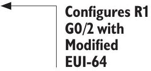

```
    FE80::260:2FFF:FE62:B801
    2001:DB8::1
GigabitEthernet0/1 [up/up]
    FE80::260:2FFF:FE62:B802
    2001:DB8:0:1::1
GigabitEthernet0/2 [up/up]
    FE80::260:2FFF:FE62:B803
```

R1 automatically generates the

```
    2001:DB8:0:2:260:2FFF:FE62:B803
```

host portion of the address.

NOTE The host portion of the address I configured on G0/2 and that of its automatically configured link-local address are the same; both use Modified EUI-64.

How does Modified EUI-64 generate a 64-bit interface identifier? It takes the interface's 48-bit MAC address and adds 0xfffe (a reserved 16-bit value) to make it 64 bits in total. Here is the three-step process:

1 Divide the MAC address in half.
2 Insert 0xfffe in the middle.
$3_{3}$ Invert the seventh bit.

Figure 20.5 demonstrates this three-step process using G0/2's MAC address (0060.2f62. b803). Let's see how R1 turned the 48-bit MAC address into the 64-bit interface identifier 0260:2fff:fe62:b803.

1. Divide the MAC address in half: 0060 2f | 62 b803
2. Insert fffe in the middle: 0060 2fff fe62 b803

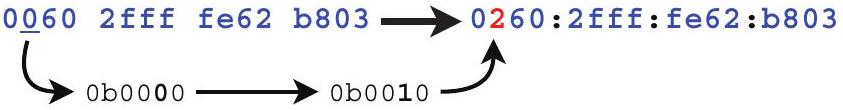
Figure 20.5 Generating a 64-bit interface identifier using Modified EUI-64. (1) Divide the MAC address in half and (2) insert fffe in the middle to make it 64 bits. Then, (3) invert the seventh bit-the third bit of the second hex digit.

The third step, in which you must invert the seventh bit of the 64-bit identifier, probably requires some explanation. Because each hexadecimal digit is 4 bits, the seventh bit of the interface identifier is the third bit of the second hexadecimal digit-the second hexadecimal 0, in this case. Inverting the seventh bit of R1 G0/2's MAC addresschanging it from 0b0 to 0b1-changes the second hexadecimal digit from 0x0 (0b0000) to 0x2 (0b0010). This results in the interface identifier 0260:2fff:fe62:b803. That interface identifier, combined with the 64-bit prefix specified in the ipv6 address command, results in IPv6 address 2001:db8:0:2:260:2fff:fe62:b803.

Table 20.4 shows some example MAC addresses and Modified EUI-64 interface identifiers. For practice, I recommend writing out each MAC address and doing the conversions yourself.

Table 20.4 Example Modified EUI-64 interface IDs
| MAC address | Modified EUI-64 Interface ID |
| :--- | :--- |
| 7f2b.cbac. 1813 | 7d2b:cbff:feac:1813 |
| 1548.4fff. 2101 | 1748:4fff:feff:2101 |
| 3150.c012.1212 | 3350:cOff:fe12:1212 |
| 84ec.4389.fd23 | 86ec:43ff:fe89:fd23 |
| 9eba.1112.9900 | 9cba:11ff:fe12:9900 |


EXAM TIP Modified EUI-64 is exam topic 1.9.d. For the CCNA exam, you should be comfortable converting a MAC address to a Modified EUI-64 interface identifier using the three-step process outlined in this section.

Why invert the seventh bit?
The term Modified in the name Modified EUI-64 refers to the inversion of the seventh bit that is done when using EUI-64 to generate a 64-bit interface identifier for an IPv6 address. Although it's beyond the scope of the CCNA exam, let's take a look at why this is done.

MAC addresses can be divided into two types: a Universally Administered Address (UAA) is a MAC address that is uniquely assigned to the device by the manufacturer, and a Locally Administered Address (LAA) is assigned locally and doesn't have to be globally unique. You can identify a UAA or LAA by the seventh bit of the MAC address, called the U/L bit (Universal/Local bit):

- U/L bit of 0 = UAA
- U/L bit of 1 = LAA

In the context of IPv6 addresses and EUI-64, the meaning of this bit is reversed:

- U/L bit of $0=$ The MAC address the EUI-64 ID was generated from was an LAA.
- U/L bit of 1 = The MAC address the EUI-64 ID was generated from was a UAA.

The exact reasoning for this reversal is not worth delving into here. Just remember that this bit is always flipped when using EUI-64 to generate an interface ID for IPv6 (the host portion of the address). This process is called Modified EUI-64, although it's often casually referred to simply as EUI-64.

### 20.5 IPv6 address types

Like IPv4, there are various IPv6 addresses and address ranges that are reserved for specific purposes. In this section, we will cover those address types and their IPv4 equivalents. For some of these IPv6 address types, we have covered the IPv4 equivalent previously in this book. In other cases, this will be their first introduction.

Figure 20.6 outlines the five main address types we will delve into in this section:

- Global unicast-Globally unique addresses that can be used for communication over the internet.
- Unique local-Addresses that don't have to be globally unique; they can be freely used in internal networks but can't be used for communication over the internet.
- Link-local-Used for communication between directly connected hosts.
- Multicast-Used for one-to-multiple communication, allowing a single packet to be addressed to multiple hosts.
- Anycast-Used for one-to-one-of-multiple communication, an anycast address is a unicast address that is assigned to multiple hosts. Packets are delivered to the nearest host configured with the address, often used on servers to provide services over the internet with low latency.

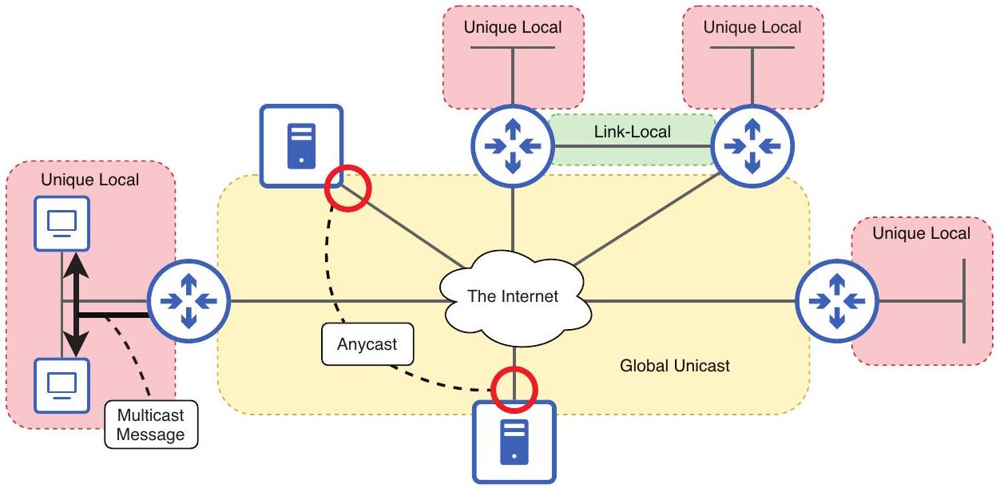
Figure 20.6 IPv6 address types: global unicast, unique local, link-local, multicast, and anycast.

### 20.5.1 Global unicast

IPv6 global unicast addresses are globally unique addresses used for communication over the public internet. Their allocation is controlled by IANA, as mentioned in section 20.1. Because they are public and must be globally unique, an enterprise is not free to use whichever global unicast addresses they want; the enterprise will typically be assigned an address block from an ISP or from the appropriate RIR, depending on the type and size of the business.

The global unicast address range was originally defined as $2000:: / 3$, which includes all addresses from 2000:: through 3fff:ffff:ffff:ffff:ffff:ffff:ffff:ffff. However, the definition of global unicast addresses has expanded to include any address that is not specifically reserved for other purposes.

An enterprise that requests IPv6 global unicast addresses will typically be assigned a /48 address block from the RIR or ISP; this is called the global routing prefix. Because IPv6 prefix lengths are typically /64, the /48 global routing prefix leaves 16 bits free for the enterprise to use to make different subnet addresses; this 16-bit section of the address is called the subnet identifier. The remaining 64 bits are the interface identifier- the host portion. Figure 20.7 shows the structure of an IPv6 global unicast address.

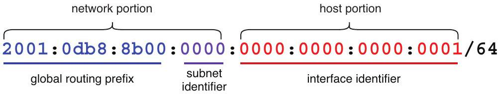
Figure 20.7 The structure of an IPv6 global unicast address. The first 48 bits are the global routing prefix, assigned to the enterprise by the ISP. The next 16 bits are the subnet identifier, which the enterprise can use to make various subnets. The remaining 64 bits are the interface identifier-the host portion of the address.

The IPv6 subnetting process is the same as IPv4 subnetting; the bits of the subnet identifier are equivalent to the borrowed bits when subnetting IPv4 networks. Following are the first few subnets that can be made with the 2001:db8:8b00::/48 address block:

- 2001:db8:8b00::/64 (subnet identifier 0x0000)
- 2001:db8:8b00:1::/64 (subnet identifier 0x0001)
- 2001:db8:8b00:2::/64 (subnet identifier 0x0002)

The IPv4 equivalent of an IPv6 global unicast address is a public IPv4 address. The ranges for public IPv4 addresses are all the addresses that are not part of the reserved private or other special-purpose ranges. I will mention the IPv4 private address ranges in section 20.5.2 and then cover them in greater detail in chapter 9 of volume 2.

NOTE The 2001:db8::/32 address range is reserved for use in examples in books, documentation, etc. Most examples of global unicast IPv6 addresses in this book will be from this reserved range.

### 20.5.2 Unique local

IPv6 unique local addresses (ULAs) are very similar to global unicast addresses. Like global unicast addresses, they are used for unicast communications; they are meant to identify a single host on the network. The main difference in use is that ULAs are private addresses; they do not have to be globally unique, and enterprises are free to use them in their internal networks. However, they cannot be used for communications over the internet-a public network that relies on each destination having a unique address. ISPs will drop packets sourced from or destined for ULAs.

IPv6 ULAs are equivalent to private IPv4 addresses, which are addresses included in one of the following three ranges:

- 10.0.0.0/8 (10.0.0.0-10.255.255.255)
- 172.16.0.0/12 (172.16.0.0-172.31.255.255)
- 192.168.0.0/16 (192.168.0.0-192.168.255.255)

You'll probably recognize the three private IPv4 address ranges; I use them in most examples in this book. We will cover these addresses in greater detail in chapter 9 of volume 2.

The IPv6 ULA range is defined as fc00::/7, which includes all addresses from fc00:: through fdff:ffff:ffff:ffff:ffff:ffff:ffff:ffff. However, the range is divided into two / 8 blocks:

- fc00::/8-Currently reserved and not defined for any specific purpose
- fd00::/8-The active range for IPv6 ULAs

Because the fc00::/8 range is currently reserved, all ULAs should begin with fd. Figure 20.8 shows the structure of an IPv6 ULA, similar to that of a global unicast address.

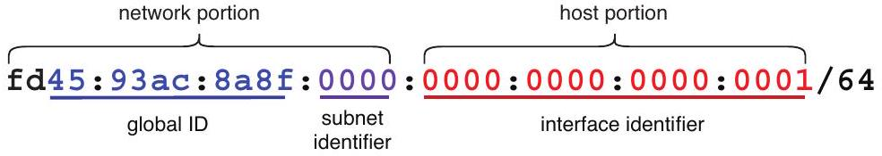
Figure 20.8 The structure of an IPv6 unique local address. After the prefix fd, there is a 40-bit global ID, which should be randomly generated. The following 16 bits are the subnet identifier, and the remaining 64 bits are the interface identifier.

After the prefix fd, ULAs have a 40-bit global ID, which should be randomly generated; this makes it highly likely that the global ID will be globally unique, resulting in each enterprise having unique ULAs. The rest of the address is identical to a global unicast address: a 16-bit subnet identifier and a 64-bit interface identifier.

## Randomly generated global IDs

Randomly generating global IDs for ULAs to make them globally unique may seem to contradict the fact that ULAs are private addresses and don't have to be globally unique. Even though that is true, there are benefits to avoiding overlapping addresses between enterprises. For example, in business scenarios, mergers and acquisitions often require the integration of two or more previously separate networks. If ULAs use randomly generated global IDs, the likelihood of overlapping addresses is minimized, making the integration process much smoother.

### 20.5.3 Link-local

IPv6 link-local addresses (LLA), as we saw in section 20.4, are automatically generated on IPv6-enabled interfaces-those with an IPv6 address (i.e., a global unicast address) configured.

NOTE You can enable IPv6 on an interface without configuring an IPv6 address by using the ipv6 enable command. In this case, the interface will only have an automatically generated LLA.

LLAs are unicast addresses used to identify a single host. However, as the name implies, LLAs can only be used for communication on the local link-between devices connected to the same network segment. Devices that aren't connected to the same segment cannot communicate using LLAs. Figure 20.9 demonstrates this concept.

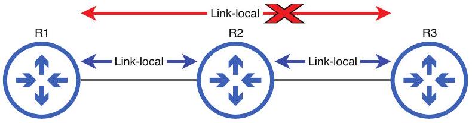
Figure 20.9 Link-local addresses can only be used for communication between hosts connected to the same link (segment). R1-R2 and R2-R3 communication can be sourced from/destined for each other's LLA, but R1-R3 communication cannot.

IPv6 LLAs use the fe80::/10 range, but the standard also states that the following 54 bits must be 0 . As a result, all LLAs use the fe80::/64 prefix. The remaining 64 bits-the interface identifier-are automatically generated using Modified EUI-64 rules. However, it is also possible to manually configure the interface's LLA with the ipv6 address address link-local command (without specifying a prefix length), as in the following example:

```
R1(config)# do show ipv6 interface brief
GigabitEthernet0/0 [up/up]
    FE80::260:2FFF:FE62:B801
    2001:DB8::1
. . .
R1(config) # interface g0/0
R1(config-if)# ipv6 address fe80::1 link-local
R1(config-if)# do show ipv6 interface brief
GigabitEthernet0/0 [up/up]
    FE80::1
    2001:DB8::1
```

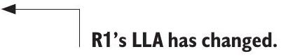

NOTE Each IPv6 interface must have exactly one link-local address. Configuring a new one will overwrite the old one, unlike global unicast and unique local addresses, which do not overwrite each other.

IPv4 also uses link-local addresses; the reserved range is 169.254.0.0/16. However, the major difference between IPv4 and IPv6 is that IPv6 requires each interface to have an LLA. We'll explore the role of LLAs in IPv6 in chapter 21.

IPv4 doesn't require each interface to have an LLA, but one situation in which you may encounter IPv4 LLAs is when a host attempts to receive an IPv4 address using Dynamic Host Configuration Protocol (DHCP) but is unable to; in many operating systems, the host will then automatically generate an IPv4 LLA for itself. We'll cover DHCP in chapter 4 of volume 2.

### 20.5.4 Multicast

Unicast addresses, such as global unicast, unique local, and link-local IPv6 addresses, are used for one-to-one communication-from one host to another. Multicast addresses, on the other hand, provide one-to-multiple communication-from one host to multiple destinations; all hosts that have joined the relevant multicast group. For example, as we covered in chapter 18, OSPF routers accept packets destined for 224.0.0.5 on their OSPF-activated interfaces; in other words, they join the 224.0.0.5 multicast group. IPv4 multicast addresses are from the class D range (224.0.0.0-239.255.255.255).

IPv6 uses the ff00::/8 range for multicast addresses; if an address begins with ff, it's a multicast address. However, IPv6 defines several multicast scopes that determine how far the multicast packets should travel; these scopes are determined by the final digit of the first hextet. Table 20.5 lists and briefly describes some of the IPv6 multicast scopes.

Table 20.5 IPv6 multicast scopes
| Scope | First hextet | Description |
| :--- | :--- | :--- |
| Interface-local | ff01 | The packet doesn't leave the local device. Can be used to send traffic to a service within the local device. |
| Link-local | ff02 | The packet remains on the local segment. Routers will not route the packet. |
| Site-local | ff05 | The packet can be forwarded by routers. Should be limited to a single physical site (location). |
| Organization-local | ff08 | Wider in scope than site-local (an entire enterprise/organization). |
| Global | ff0e | No boundaries. Possible to be routed over the internet. |


NOTE Don't mix up unicast link-local addresses (LLAs) as covered in section 20.5.3 and the link-local multicast scope. The term link-local address typically refers to a unicast address, and link-local multicast refers to the multicast scope.

Figure 20.10 gives a visual representation of each of the multicast scopes (aside from interface-local), representing how far each kind of multicast packet sent by PC1 may travel.

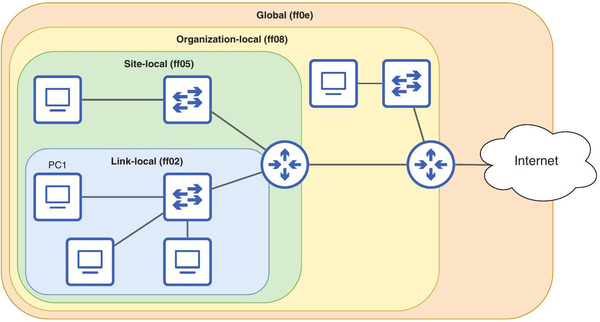
Figure 20.10 IPv6 multicast scopes from the perspective of PC1. Link-local multicast remains within the local link. Site-local multicast may be forwarded within the local site. Organization-local multicast may be forwarded within the organization. Global multicast has no boundaries and may be forwarded over the internet.

EXAM TIP The specifics of how site-local, organization-local, and global multicast packets are forwarded by routers are well beyond the scope of the CCNA exam. I recommend just memorizing their names and first hextet patterns (ff05, ff08, ff0e).

The one multicast scope you should be familiar with for the CCNA exam is link-local: multicast messages that are sent to other hosts in the same network segment. Table 20.6 lists some common IPv6 link-local multicast addresses and their IPv4 equivalents (a couple of which we saw when covering OSPF in chapter 18). Switches will flood these messages to all hosts on the local segment by default, and it is up to those hosts to decide if they are interested in the contents or not.

Table 20.6 Common link-local multicast addresses
| Purpose | IPv6 address | IPv4 address |
| :--- | :--- | :--- |
| All nodes | ff02::1 | 224.0.0.1 |
| All routers | ff02::2 | 224.0.0.2 |
| All OSPF routers | ff02::5 | 224.0.0.5 |
| All OSPF DRs/BDRs | ff02::6 | 224.0.0.6 |
| All RIP routers | ff02::9 | 224.0.0.9 |
| All EIGRP routers | ff02::a | 224.0.0.10 |


NOTE In IPv6, there is no such thing as a broadcast address. Instead, IPv6 hosts can use the all-nodes multicast address (ff02::1) to send a message to all hosts on the local segment. In effect, this is like a broadcast message: from one host to all other hosts connected to the same segment.

You can check which multicast groups a Cisco router interface has joined-which types of multicast messages it is interested in-with the show ipv6 interface command. In the following example, I use the command on R1, which we configured in section 20.4:

```
R1# show ipv6 interface g0/0
GigabitEthernet0/0 is up, line protocol is up
IPv6 is enabled, link-local address is FE80::2D0:97FF:FE92:B401
No Virtual link-local address(es):
Global unicast address(es):
2001:DB8:1:1::1, subnet is 2001:DB8:1:1::/64
Joined group address(es):
FF02::1
FF02::2
FF02::1:FF00:1
FF02::1:FF92:B401
. . .
```

R1 has joined four multicast groups on its G0/0 interface: ff02::1 (all nodes), ff02::2 (all routers), as well as two solicited-node multicast addresses; we will cover those soon in chapter 21. If R1 receives a packet addressed to any of those four multicast addresses, it will examine the contents. If it receives a packet addressed to any other multicast address, it will discard the packet; it's not interested in the contents.

### 20.5.5 Anycast addresses

We have covered unicast (one-to-one), broadcast (one-to-all), and multicast (one-to-multiple), but anycast (one-to-one-of-multiple) is a new concept. Anycast was already present in IPv4, but with IPv6, the concept was more formally defined and integrated. Figure 20.11 visually illustrates the concepts of unicast, broadcast, multicast, and anycast.

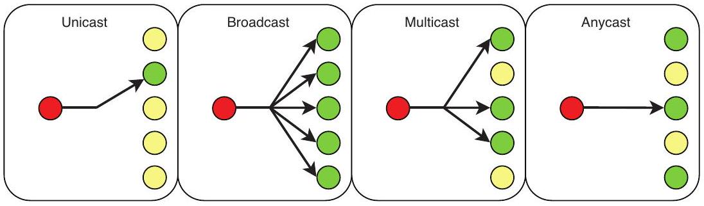
Figure 20.11 Different routing/addressing methodologies. Unicast is one-to-one, broadcast is one-toall, multicast is one-to-multiple, and anycast is one-to-one-of-multiple.

When using anycast, the same IP address is shared by multiple hosts. The address itself is indistinguishable from a unicast address (i.e., a global unicast address); there is no reserved range for anycast addresses.

Normally, unicast addresses should be unique-not shared by multiple hosts. Anycast is an exception to that rule; the same address is configured on multiple hosts. Packets destined for the anycast address will be delivered to one of the hosts configured with the address. Which of those hosts the packets will be delivered to depends on the routers in the path; each router will forward the packets according to the best route in its routing table. As a result, the packets should reach the destination host closest to the source.

Anycast is useful when providing services over the internet. By configuring the same IP address on servers in different global locations, users can access the server closest to their location; this can result in lower latency. Content Delivery Network (CDN) services such as Cloudflare use anycast for this purpose.

Because anycast addresses are identical to unicast addresses, they can be configured like any other unicast address with the ipv6 address command. However, if you add the anycast keyword to the end of the command, the address will be marked as such in the output of some show commands. This doesn't affect the behavior of the router (and is therefore not necessary), but it is helpful for making the intent of the configuration clear for others (and your future self). In the following example, I configure an anycast address and verify with a show command:

```
R1(config)# interface g0/0
R1(config-if) # ipv6 address 2001:db8:0:100::1/64 anycast
R1(config-if) # show ipv6 interface g0/0
GigabitEthernet0/0 is up, line protocol is up
IPv6 is enabled, link-local address is FE80::260:2FFF:FE62:B801
```

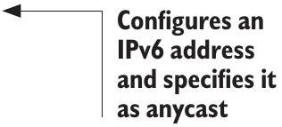

```
No Virtual link-local address(es):
Global unicast address(es):
2001:DB8::1, subnet is 2001:DB8::/64
2001:DB8:0:100::1, subnet is 2001:DB8:0:100::/64 [ANY]
```

20.5.6 Other reserved addresses

Both IPv4 and IPv6 have many other reserved addresses and address ranges. For the CCNA exam, there are two more reserved IPv6 addresses you should be aware of: the unspecified address and the loopback address.

The unspecified IPv6 address is the all-zeros address: 0000:0000:0000:0000:0000:0000 :0000:0000. When abbreviated, it is simply written as "::". This address can be used as a source address when a device doesn't yet know its IPv6 address. Also, IPv6 default routes are configured to destination ::/0-more on that in chapter 21. The IPv4 equivalent of this address is also all zeros: 0.0.0.0.

The loopback IPv6 address is the address immediately after the unspecified address; it's usually written as ::1. Messages sent to this address are looped back to the local device; they are not sent out of any interfaces. This can be used to test the networking software on the local device. The IPv4 equivalent is the reserved 127.0.0.0/8 range.

## Summary

- IPv4 address exhaustion-running out of IPv4 addresses-is a major problem in our era of unprecedented connectivity; IPv6 is the long-term solution.
- IPv4 addresses are 32 bits in length, providing $2{ }^{32}$ (over 4 billion) addresses, but IPv6 addresses are 128 bits in length, providing $2^{128}$ (over 340 undecillion) addresses.
- To convert a binary number to hexadecimal, (1) split the number into 4-bit groups, (2) convert each 4-bit group to decimal, and (3) convert each decimal number to hexadecimal.
- To convert a hexadecimal number to binary, (1) split up the hexadecimal digits, (2) convert each hexadecimal digit to decimal, and (3) convert each decimal digit to binary.
- The IPv6 header is 40 bytes in length and consists of eight fields: Version, Traffic Class, Flow Label, Payload Length, Next Header, Hop Limit, Source, and Destination.
- IPv6 addresses are divided into eight groups of 16 bits (usually called hextets) and written in hexadecimal, with a colon between each group.
- For simplicity, IPv6 addresses typically use /64 prefix lengths-the first 64 bits are the network portion, and the last 64 bits are the host portion.
- IPv6 addresses can be abbreviated by removing leading zeros from each hextet and by abbreviating two or more consecutive all-zero hextets with a double colon (::).

- A network prefix is a combination of a network address and prefix length. If a host has IPv4 address 192.168.1.10/24, the prefix is 192.168.1.0/24. If a host has IPv6 address 2001:db8:1:2:a:b:c:d/64, the prefix is 2001:db8:1:2::/64.
- Many IPv6 configuration and verification commands are similar to IPv4 equivalents: ipv6 address, ipv6 route, show ipv6 interface brief, show ipv6 route.
- When configuring IPv6 on a Cisco router, you should first enable IPv6 routing with the ipv6 unicast-routing command. IPv6 routing is not enabled by default.
- You can manually assign an IPv6 address to an interface with ipv6 address address/prefix-length. Unlike IPv4, IPv6 prefix lengths are configured with slash notation, not dotted-decimal netmasks.
- Even if you configure a full (or partially abbreviated) IPv6 address, IOS will display the fully abbreviated address in the output of show commands.
- If you configure an IPv4 address on an interface that already has an IPv4 address, the new address will overwrite the old one. If you do the same in IPv6, the new address will not overwrite the old one; the interface will have multiple addresses.
- Modified Extended Unique Identifier 64 (Modified EUI-64) is a method of automatically generating a 64-bit interface identifier (host portion of the address) by adding 16 bits (0xfffe) to the interface's 48-bit MAC address.
- Use ipv6 address prefix eui-64 to configure an IPv6 with Modified EUI-64.
- To convert a MAC address to a Modified EUI-64 interface ID, (1) divide the MAC address in half, (2) insert fffe in the middle, and (3) invert the seventh bit.
- IPv6 global unicast addresses are globally unique addresses used for communication over the public internet. The global unicast range was originally defined as $2000:: / 3$, but now includes any address not specifically reserved for other purposes.
- Global unicast addresses consist of a 48-bit global routing prefix (assigned by an RIR or ISP), a 16-bit subnet identifier (used to make subnets), and a 64-bit interface identifier (the host portion of the address).
- The IPv4 equivalent of a global unicast address is a public IPv4 address. Public IPv4 addresses include all addresses that are not part of the reserved private or other special-purpose ranges.
- IPv6 unique local addresses (ULAs) are private addresses; they do not have to be globally unique, and enterprises are free to use them in their internal networks. However, they cannot be used for communication over the internet.
- The ULA range is defined as fc00::/7 but is divided into two / 8 ranges: fc00::/8 (reserved) and $\mathrm{fd} 00: / 8$ (the active ranges for ULAs).

- After the fd prefix, a ULA has a 40-bit global ID, which should be randomly generated to avoid overlap with other enterprises. The next 16 bits are the subnet identifier, and the last 64 bits are the interface identifier.
- ULAs are equivalent to IPv4 private addresses, in the ranges 10.0.0.0/8, 172.16.0.0/12, and 192.168.0.0/16.
- IPv6 link-local addresses (LLAs) are automatically generated on IPv6-enabled interfaces using Modified EUI-64. The LLA range is fe80::/10, but the following 54 bits should be set to 0, resulting in the fe80::/64 prefix.
- The IPv4 equivalent is the 169.254.0.0/16 range. IPv6-enabled interfaces require an IPv6 LLA, but IPv4-enabled interfaces don't require an IPv4 LLA.
- You can enable IPv6 on an interface without configuring an IPv6 address with ipv6 enable. In that case, the interface will have only the automatically generated LLA.
- You can manually configure an interface's LLA with ipv6 address address link-local.
- LLAs can only be used for communication with devices on the same segment.
- IPv6 multicast addresses are from the ff00::/8 range. They are used to provide communication from one host to multiple others. The IPv4 equivalent is the class D range (224.0.0.0-239.255.255.255).
- Several scopes define how far the multicast packets should travel: interface-local (ff01), link-local (ff02), site-local (ff05), organization-local (ff08), and global (ff0e).
- Some common link-local IPv6 and IPv4 multicast addresses are all nodes (ff02::1, 224.0.0.1), all routers (ff02::2, 224.0.0.2), all OSPF routers (ff02::5, 224.0.0.5), all OSPF DRs/BDRs (ff02::6, 224.0.0.6), all RIP routers (ff02::9, 224.0.0.9), and all EIGRP routers (ff02::a, 224.0.0.10).
- Unicast communication is one-to-one, broadcast is one-to-all, multicast is one-to-multiple, and anycast is one-to-one-of-multiple.
- An anycast address is a unicast address configured on multiple hosts. Packets destined for the address will be delivered to the closest host with the address, as determined by routers' routing decisions.
- You can specify an IPv6 address as anycast with the ipv6 address address/ prefix-length anycast command.
- The unspecified IPv6 address is all zeros, usually written as ::. It is used in default routes or when the device doesn't know its IPv6 address yet. The IPv4 equivalent is 0.0.0.0.
- The loopback IPv6 address is ::1. Messages sent to this address are looped back to the local device without being sent out of an interface. This can be used to test the device's network software. The IPv4 equivalent is the 127.0.0.0/8 range.
