## IPv6 routing

## This chapter covers

- How IPv6 uses Neighbor Discovery Protocol for address resolution (and more)
- The IPv6 routing table
- How routers forward IPv6 packets
- How to configure IPv6 static routes

In chapter 20, we covered IPv6 addressing, including how to configure IPv6 addresses on Cisco routers and the various IPv6 address types. In this chapter, we'll build upon that knowledge and look at IPv6 routing, including how routers forward IPv6 packets and how to configure IPv6 static routes. Specifically, we will cover the following exam topics:


- 3.1 Interpret the components of routing table
- 3.2 Determine how a router makes a forwarding decision by default
- 3.3 Configure and verify IPv4 and IPv6 static routing

We have already covered these exam topics from an IPv4 perspective, particularly in chapter 9. The good news is that the fundamentals of IPv6 routing are largely identical to those of IPv4 routing, so many of the concepts in this chapter will not be new to you. One point worth mentioning is that IPv6 dynamic routing is not included in the CCNA exam-only static routing; the exam topics list mentions OSPFv2 (which only supports IPv4), not OSPFv3 (which supports both IPv4 and IPv6).

### 21.1 Neighbor Discovery Protocol

When an end host sends an IPv4 packet, or when a router forwards an IPv4 packet, it must encapsulate the packet in an Ethernet frame destined for the packet's next hop; that might be the packet's final destination host, or it might be the next router in the path to the final destination. And how does it learn the MAC address of the next hop? The answer is ARP.

A host's ARP table maps Layer 3 (IPv4) addresses to Layer 2 (MAC) addresses. To encapsulate a packet in a frame with the proper destination MAC address, a host will look in its ARP table for an entry matching the next hop's IPv4 address and use the mapped MAC address as the frame's destination. If no such entry exists, the host will broadcast an ARP request to learn the next hop's MAC address.

NOTE The term host as I use it in this book includes both end hosts, such as servers and PCs, and network infrastructure devices, such as routers.

End hosts sending IPv6 packets and routers forwarding IPv6 packets also need to encapsulate those packets in frames addressed to the next hop. But there's a major difference between IPv4 and IPv6: IPv6 doesn't use ARP! Instead, IPv6 uses a protocol called Neighbor Discovery Protocol (NDP), which plays a similar role to ARP, mapping Layer 3 (IPv6) addresses to Layer 2 (MAC) addresses. However, NDP also has some additional functions, two of which we'll cover in this section: router discovery and duplicate address detection.

### 21.1.1 Solicited-node multicast

Some NDP functions use a particular kind of multicast address called a solicited-node multicast address, which is generated from a host's unicast address (global unicast, unique local, or link-local). To generate a solicited-node multicast address, prepend ff02:0000:0000:0000:0000:0001:ff (abbreviated to ff02::1:ff) to the last six hexadecimal digits of the unicast address. Figure 21.1 shows how to generate a solicited-node multicast address.

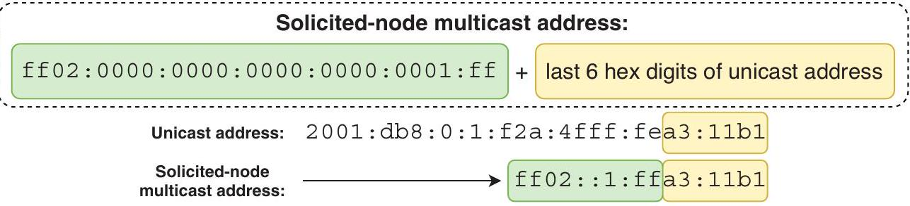
Figure 21.1 How to generate a solicited-node multicast address. Prepend ff02:0000:0000:0000:0000: 0001:ff (abbreviated to ff02::1:ff) to the last six hexadecimal digits of the unicast address.

NOTE The scope of a solicited-node multicast address is link-local, as indicated by ff02.

For reference, table 21.1 lists some unicast addresses and their equivalent solicitednode multicast addresses. In sections 21.1.2 and 21.1.4, we'll see some examples of this message type in action.

Table 21.1 Solicited-node multicast addresses
| Unicast address | Solicited-node multicast address |
| :--- | :--- |
| 2001:db8:123::1 | ff02::1:ff00:1 |
| fd12:3456:78:1df:ac80:0:3ab:fff1 | ff02::1:ffab:fff1 |
| fe80::99ff:fe12:1234 | ff02::1:ff12:1234 |


In chapter 20, I showed the following output when demonstrating multicast IPv6 addresses. In addition to joining the ff02::1 and ff02::2 multicast groups, note that R1 has joined two additional multicast groups for the solicited-node multicast address of each of its unicast addresses (global unicast and link-local):

```
R1# show ipv6 interface g0/0
GigabitEthernet0/0 is up, line protocol is up
IPv6 is enabled, link-local address is FE80::2D0:97FF:FE92:B401
No Virtual link-local address(es):
```

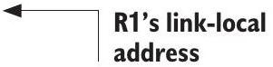

```
Global unicast address(es):
2001:DB8:1:1::1, subnet is 2001:DB8:1:1::/64
Joined group address(es):
FF02::1
FF02::2
FF02::1:FF00:1
FF02::1:FF92:B401
```

NOTE Multicast packets, such as those destined for a solicited-node multicast address, are encapsulated in frames destined for an equivalent multicast MAC address. The details of these MAC addresses are beyond the scope of the CCNA exam.

### 21.1.2 Address resolution with NDP

One function of NDP is address resolution-mapping a known Layer 3 address to an unknown Layer 2 address. This is the ARP-like aspect of NDP. Whereas IPv4's ARP uses ARP request and ARP reply messages, NDP uses the following two ICMPv6 messages:

- Neighbor Solicitation (NS)-ICMPv6 type 135
- Neighbor Advertisement (NA)-ICMPv6 type 136

## ICMP and ICMPv6 message types

NDP can be considered a component of ICMPv6-ICMP for IPv6. ICMP and ICMPv6 perform various functions in IPv4 and IPv6 networks, respectively, and they define various message types (each identified by a number) that they use to perform those functions.

Two example ICMP messages that we've covered are Echo Request (type 8) and Echo Reply (type 0), which are used for IPv4 ping messages. ICMPv6 uses its own Echo Request (type 128) and Echo Reply (type 129) messages for the same purpose.

NDP uses five different ICMPv6 messages: Router Solicitation (type 133), Router Advertisement (type 134), Neighbor Solicitation (type 135), Neighbor Advertisement (type 136), and Redirect (type 137). We'll cover the first four of those messages in this section.

Figure 21.2 shows the NDP address resolution process, consisting of an NS message from the requester and an NA message in response.

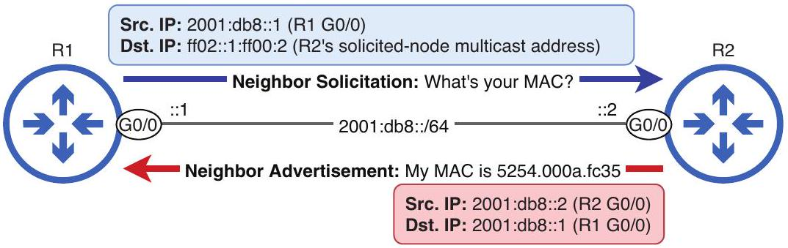
Figure 21.2 An NDP exchange between two routers. R1 sends an NS message to learn R2 G0/0's MAC address, and R2 sends an NA message in response.

ARP request messages are broadcast to all hosts on the local segment. However, as we covered in chapter 20, the concept of "broadcast" doesn't exist in IPv6; there is no broadcast address. This is where the solicited-node multicast address comes into play.

To learn a neighbor's MAC address, a host will send a Neighbor Solicitation (NS) message (equivalent to an ARP request) to the neighbor's solicited-node multicast address. The target of the NS message will then reply with a Neighbor Advertisement (NA) message (equivalent to an ARP reply), informing the requester of its MAC address. Unlike the NS message, the NA message is a simple unicast message from the responder to the requester.

## Overlapping solicited-node multicast addresses

Although very unlikely, it's possible for two hosts to have different IPv6 addresses but identical solicited-node multicast addresses. For example:

- Host $A-2001: d b 8: 1: 1:: 1100: 1234 / 64$
- Host B-2001:db8:1:1::2200:1234/64

(continued)
Although the two addresses are unique, both result in the same solicited-node multicast IPv6 address: ff02::1:ff00:1234. So how can Host A and Host B differentiate between an NS destined for Host A and an NS destined for Host B?

The answer lies within the NS message body itself-the payload of the IPv6 packet. NS messages include a Target Address field in which the unicast IPv6 address of the message's target (i.e., 2001:db8:1:1::1100:1234 for Host A) is specified. By examining this field, the hosts can identify which NS messages are meant for them and which should be ignored.

Just as a host using IPv4 stores L3-L2 address mappings in its ARP table, a host using IPv6 stores L3-L2 address mappings in its IPv6 neighbor table, which you can check with the command show ipv6 neighbors. In the following example, I send a ping from R1 to R2 and then check R1's neighbor table. Notice that in addition to an entry for R2's global unicast address, R1 also has an entry for R2's link-local address, which R1 created automatically (without me pinging that address):

```
        Pings R2’s global unicast address
Entry for R2's link-local address
```

Entry for
Entry for
Entry for
R2's global
R2's global
R2's global
unicast
unicast
unicast
unicast
address
address
address
address

The IPv6 Address column lists each neighbor's IPv6 address, and the Age column indicates how many minutes have passed since each entry was created or refreshed. The Link-Layer Addr column lists each neighbor's MAC address, and the State columns indicate the state of each neighbor; the IPv6 neighbor states are beyond the scope of the CCNA exam (REACH means the neighbor is reachable-that's what you want to see). Finally, the Interface column lists the interface where each neighbor is connected.

### 21.1.3 Router discovery with NDP

In addition to its ARP-like address resolution functionality, NDP also provides router discovery, allowing hosts to automatically discover routers connected to the local network, as well as other characteristics of the local network (such as the network prefix). The following two message types are used for this purpose:

- Router Solicitation (RS)-ICMPv6 type 133
- Router Advertisement (RA)-ICMPv6 type 134

Router Solicitation (RS) messages are used to ask all routers on the local network to identify themselves; these messages are sent to the "all routers" link-local multicast address ff02::2. Router Advertisement (RA) messages are sent in response to RS messages and are also periodically sent by all routers (even without receiving an RS); RA messages are typically sent to the "all nodes" link-local multicast address ff02::1.

NDP's router discovery functionality is used to facilitate Stateless Address Autoconfiguration (SLAAC-pronounced "slack"). SLAAC allows a host to automatically generate its own IPv6 address and also learn other information such as the default gateway.

NOTE SLAAC is stateless because there is no central server keeping track of information such as which host has which address. This is in contrast to Dynamic Host Configuration Protocol (DHCP), in which a server manages address assignments; this is stateful. DHCP is the topic of chapter 4 of volume 2.

Figure 21.3 shows a Cisco router (R2) using SLAAC to generate an IPv6 address for its G0/0 interface; you can configure this with the ipv6 address autoconfig command. R2 then sends an RS message, and R1 replies with an RA message. From this RA message, R2 learns the network prefix of the link (2001:db8::/64) and uses Modified EUI-64 to generate the host portion of its IPv6 address.

NOTE Instead of Modified EUI-64, some operating systems randomly generate the host portion of the address. Cisco IOS, however, uses Modified EUI-64.

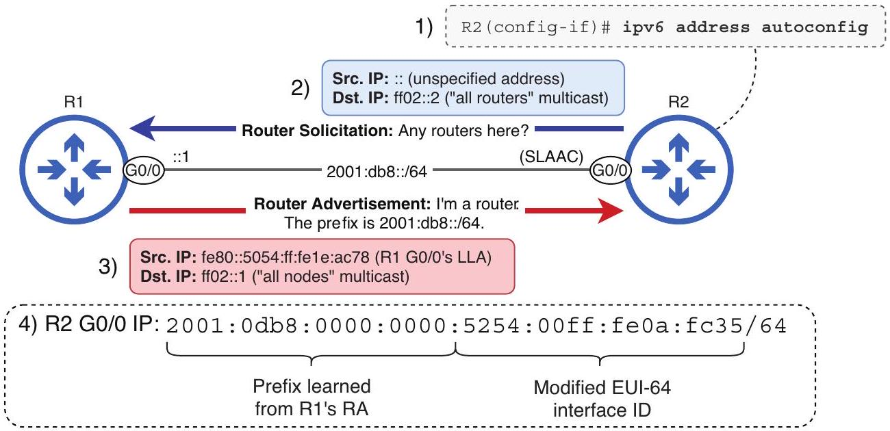
Figure 21.3 R2 uses SLAAC to generate an IPv6 address. (1) Issue the ipv6 address autoconfig command. (2) R2 sends an RS message. (3) R1 responds with an RA message. (4) R2 combines the learned prefix with a Modified EUI-64 interface ID to make its IPv6 address.

The ipv6 address prefix eui-64 command (covered in chapter 20) and the ipv6 address autoconfig commands both use Modified EUI-64 to generate the host portion of the address. However, the former command requires you to manually specify the prefix, whereas the latter automatically learns the prefix via NDP RS/RA messages.

NOTE If you use the ipv6 address autoconfig default command on a Cisco router, in addition to generating an IPv6 address, it will insert a default route into its routing table using the link-local address of the responding router as the next hop. Using the example of figure 21.3, R2 would insert a default route with R1 as the next hop.

### 21.1.4 Duplicate Address Detection

NDP's Duplicate Address Detection (DAD) is a feature that checks if an Ipv6 address is unique on the network before a host uses it. Whenever an interface is configured with an IPv6 address, whether it's automatically assigned or manually entered, it uses DAD. Also, any time a host's interface initializes (enters an up/up state), DAD checks all of its IPv6 addresses to make sure none of them are duplicates on the network.

NOTE An IPv6 address is considered tentative until the DAD process completes; it cannot be used for communication until it has been proven unique on the network.

DAD is performed using two NDP messages that we covered previously: Neighbor Solicitation (NS) and Neighbor Advertisement (NA). Figure 21.4 shows how a Cisco router (R2) uses DAD to determine whether its newly configured IPv6 address is unique.

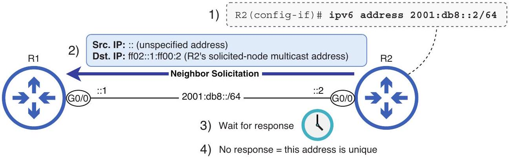
Figure 21.4 R2 uses DAD to verify that its Ipv6 address is unique. (1) Configure R2's address. (2) R2 sends an NS message to its own solicited-node multicast address. (3) R2 waits for a response. (4) R2 doesn't receive a response, so the address is unique.

To perform DAD, a host will send an NS message to its own solicited-node multicast address. If it receives no response after waiting a certain period of time, the host can safely declare that the address is unique; it can now use the address for communication. However, if it receives an NA message in response, it means another device on the
network is already using the same IPv6 address; the address will be marked as a duplicate, and the host will not be able to use it to communicate over the network.

The following example shows what happens if, instead of a unique address, I configure the same IPv6 address as R1 on R2. A warning message is displayed, and the address is marked as [DUP] (duplicate) in the output of show ipv6 interface; R2 cannot use this address:
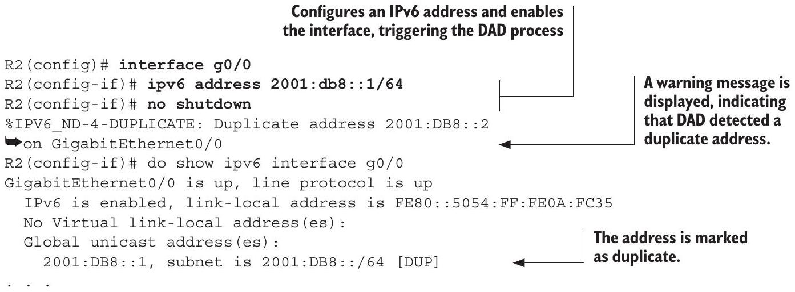

The solution for a duplicate address is simply to fix the configuration error: use no to remove the duplicate address, and reconfigure the interface with a unique address.

NOTE DAD is not a standardized feature in IPv4, although some mechanisms can be used to detect duplicate addresses. IPv6 made DAD mandatory as a component of NDP.

### 21.2 The IPv6 routing table

Routers using IPv6 build a routing table-a database of the best route(s) to each destination known by the router. A router can learn routes in multiple ways, such as manual configuration (static routing) and dynamic routing. Additionally, a router automatically learns connected and local routes when you configure IP addresses on its interfaces.

All of this should sound familiar; it's the same as in IPv4. In this section, we will look at the routing table and review some fundamental routing concepts from an IPv6 perspective. Although the concepts are not new to you, understanding them in the context of IPv6 is crucial.

### 21.2.1 Connected and local routes

A connected route is a route to the network an interface is connected to; these routes are automatically added to the routing table for each interface that has an IP address and is in an up/up state. These routes tell the router that if a packet is destined for an IP address in this network, the router should forward the packet directly to the destination host.

A local route is a route to the exact IP address configured on the router's interface; the router automatically adds one of these routes to its routing table for each IP address
that it has. These routes tell the router that if a packet is destined for this IP address, the router should receive the packet for itself-continue to de-encapsulate the message and examine the contents.

To demonstrate IPv6 connected and local routes, let's use the simple network shown in figure 21.5: one router with two connected networks.

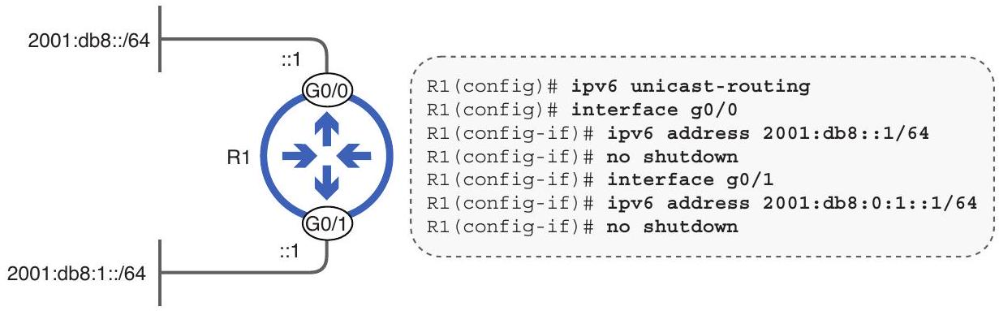
Figure 21.5 A router with two connected IPv6 networks

NOTE As I noted in chapter 20, don't forget ipv6 unicast-routing! Forgetting this command is a very common mistake when configuring IPv6.

The following example shows the output of show ipv6 interface brief on R1. Notice that in addition to the global unicast address configured on each interface, R1 has two automatically generated (using Modified EUI-64) link-local addresses:

```
R1# show ipv6 interface brief
GigabitEthernet0/0 [up/up]
    FE80::5054:FF:FE06:1B6F
    2001:DB8::1
GigabitEthernet0/1 [up/up]
    FE80::5054:FF:FE09:A180
    2001:DB8:1::1
. . .
```

Now let's take a look at R1's IPv6 routing table with show ipv6 route. The output is very similar to what you're used to from the IPv4 routing table:

```
R1# show ipv6 route
IPv6 Routing Table - default - 5 entries
Codes: C - Connected, L - Local, S - Static, U - Per-user Static route
. . .
C 2001:DB8::/64 [0/0]
    via GigabitEthernet0/0, directly connected
L 2001:DB8::1/128 [0/0]
    via GigabitEthernet0/0, receive
C 2001:DB8:1::/64 [0/0]
    via GigabitEthernet0/1, directly connected
L 2001:DB8:1::1/128 [0/0]
    via GigabitEthernet0/1, receive
```

```
L FFOO::/8 [0/0]
    via NullO, receive
```

A route that discards multicast traffic

R1 added a connected route and a local route for each address configured on its interfaces. A local route is an example of a host route-a route to a single destination IP address (R1's own IP address, in this case). IPv6 host routes use a /128 prefix length. A connected route is an example of a network route-a route to more than one destination IP address. Any IPv6 route with a prefix length of /127 or shorter is a network route.

EXAM TIP Network and host routes are exam topics 3.3.b and 3.3.c, respectively. Make sure you can identify and configure them in both IPv4 and IPv6. We will cover how to configure IPv6 static routes in section 21.3.

However, R1 did not add any connected or local routes for its link-local addresses-this is expected. Traffic to and from link-local addresses doesn't need to be routed in the traditional sense because it never leaves the local link; there's no need for a routing table entry. A link-local address can be used as the next-hop address of a route (as we'll cover in section 21.3.2), but never as the destination of a route.

The final route in R1's routing table is a route to ff00::/8-the multicast address range. This route is inserted automatically by the router. The route specifies Null0, a virtual interface; packets sent to this interface are dropped. Cisco routers don't forward multicast packets by default, so this route ensures that multicast packets are dropped.

NOTE The ff00::/8 route doesn't prevent the router from sending or receiving multicast packets, such as those used in NDP exchanges with its neighbors. It prevents the router from forwarding multicast packets.

### 21.2.2 Route selection

When a router receives a packet, it looks up the packet's destination IP address in its routing table and selects the best route; this is called route selection. The router will forward the packet according to the most specific matching route-the matching route with the longest prefix length. Once again, this is identical to IPv4.

NOTE As covered in chapter 17, the term route selection can also refer to the process of selecting which routes enter the router's routing table (using metric and administrative distance).

Figure 21.6 shows a route selection decision by R1; a packet arrives on one of its interfaces, so R1 has to make a decision about what to do with the packet. Two of R1's routes match the packet's destination IP address, and R1 selects the more specific of the two-the route with the longer prefix length (/128 vs. /64).

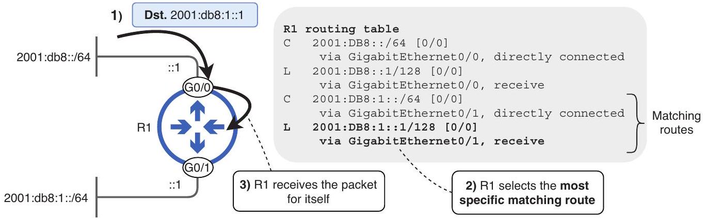
Figure 21.6 R1 makes a route selection decision. 1) R1 receives a packet destined for 2001:db8:1::1. 2) R1 performs a routing table lookup and selects the most specific matching route-the local route to 2001:db8:1::1/128. 3) R1 receives the packet for itself.

What happens if there is no route in the routing table that matches the packet's destination IP address? The answer is the same as in IPv4: the router drops the packet.

### 21.3 IPv6 static routing

Connected routes allow a router to forward packets destined for hosts in its connected networks, and local routes allow the router to receive packets destined for itself. However, most routers also need to be able to forward packets to remote destinations- those that aren't directly connected to the router itself. To achieve that, we need to either manually configure routes to those destinations (static routing) or enable a dynamic routing protocol and allow the router to automatically share routing information with other routers.

Although IPv4 dynamic routing is included in the CCNA exam topics, IPv6 dynamic routing is not. IPv6 static routing, however, is a CCNA exam topic, so let's look at how to configure IPv6 static routes on Cisco routers. Figure 21.7 shows the network we'll use for this section; this is the same topology we used when covering IPv4 static routing in chapter 9.

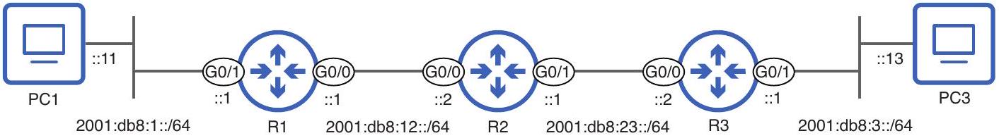
Figure 21.7 An IPv6 network consisting of three routers. Which static routes must be configured to enable communication between PC1 and PC3?

For the goal of enabling communication between PC1 and PC3, each router needs a route to PC1's network (2001:db8:1::/64) and a route to PC3's network (2001:db8:3::/64). R1 has a connected route to 2001:db8:1::/64, and R3 has one to 2001:db8:3::/64, leaving four static routes that we must configure-table 21.2 lists those routes.

Table 21.2 IPv6 static routes required to enable communication between PC1 and PC3
| Router | Required routes | Next hop |
| :--- | :--- | :--- |
| R1 | 2001:db8:3::/64 | 2001:db8:12::2 (R2 GO/0) |
| R2 | 2001:db8:1::/64 | 2001:db8:12::1 (R1 GO/0) |
|  | 2001:db8:3::/64 | 2001:db8:23::2 (R3 GO/0) |
| R3 | 2001:db8:1::/64 | 2001:db8:23::1 (R2 G0/1) |


### 21.3.1 Configuring IPv6 static routes

The command to configure an IPv6 static route is ipv6 route. After specifying the destination network prefix, you can specify the next-hop IP address, the exit interface, or both. In this section, we'll examine each of those configuration methods:

- ipv6 route destination-prefix next-hop
- ipv6 route destination-prefix exit-interface
- ipv6 route destination-prefix exit-interface next-hop

Recursive static routes
A static route that specifies only the next-hop IP address is called a recursive static route. Figure 21.8 shows how to configure four recursive static routes to enable communication between PC1 and PC3.

```
R1(config)# ipv6 route 2001:db8:3::/64 2001:db8:12::2
```

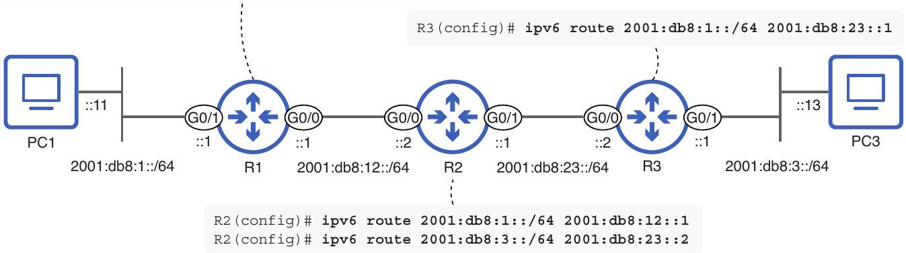
Figure 21.8 Configuring recursive static routes on R1, R2, and R3 to enable PC1-PC3 communication. Each route's next-hop IP address is specified.

NOTE Like configuring IPv6 addresses on interfaces, IPv6 static routes use slash notation (i.e. /64), not dotted-decimal netmasks.

In the following example, I configure the necessary routes on R2 and check its routing table with show ipv6 route static (to display only static routes):

```
R2(config)# ipv6 route 2001:db8:1::/64 2001:db8:12::1
R2(config)# ipv6 route 2001:db8:3::/64 2001:db8:23::2
```

```
R2(config)# do show ipv6 route static
. . .
S 2001:DB8:1::/64 [1/0]
    via 2001:DB8:12::1
S 2001:DB8:3::/64 [1/0]
    via 2001:DB8:23::2
```

This type of route is called recursive because it requires recursive (repeated) routing table lookups:

1 A lookup to find the IP address of the next hop
2 A lookup to find which interface the next hop is connected to

If R2 receives a packet destined for PC3, the second static route we configured tells R2 which next hop to forward the packet to (2001:db8:23::2). R2 would then need to do a second routing table lookup to determine which interface 2001:db8:23::2 is connected to. In the following example, I use show ipv6 route connected to show R2's connected routes:

```
R2# show ipv6 route connected
. . .
C 2001:DB8:12::/64 [0/0]
    via GigabitEthernet0/0, directly connected
C 2001:DB8:23::/64 [0/0]
    via GigabitEthernet0/1, directly connected
```

R2 has a connected route to 2001:db8:23::/64 on its G0/1 interface; this route matches next hop 2001:db8:23::2. R2 now knows how to forward the PC3-destined packet: it should forward it to next hop 2001:db8:23::2, which is connected to G0/1.

## Directly connected static routes

A static route that specifies only the exit interface-the interface packets should be forwarded out of-is called a directly connected static route. The reason for the name is that this kind of route makes the router believe that it is directly connected to the destination specified in the route. Figure 21.9 shows the same routes we configured previously-this time only specifying each route's exit interface.

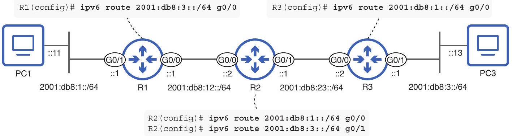
Figure 21.9 Configuring fully specified static routes on R1, R2, and R3. Each route's exit interface is specified.

There is one major problem with these routes: they don't work! The routers will accept the commands, and the routes will appear in the routers' routing tables, but communication via these routes will fail.

IPv4 directly connected static routes rely on a mechanism called proxy ARP, in which a router responds to ARP requests on behalf of another host. Cisco routers don't support an equivalent proxy NDP, so these routes won't work as intended. In the following example, I configure R1's route to 2001:db8:3::/64 and check its routing table; at first glance, there doesn't seem to be anything wrong with the route:

```
R1(config)# ipv6 route 2001:db8:3::/64 g0/0
R1(config)# do show ipv6 route static
. . .
```

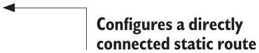

```
S 2001:DB8:3::/64 [1/0]
    via GigabitEthernet0/0, directly connected
```

The route appears as directly connected.

After looking at R1's routing table, you might assume that it's ready to forward packets between PC1 and PC3; if this were an IPv4 network, it would be. However, in this case, a ping from PC1 to PC3 fails, and R1's IPv6 neighbor table shows why:

```
R1# show ipv6 neighbors
IPv6 Address Age Link-layer Addr State Interface
2001:DB8:3::13 0 - INCMP Gi0/0
. . .
```

PC3's entry is incomplete.

R1's neighbor table shows an INCMP (incomplete) entry for PC3 (2001:db8:3::13). This entry means that R1 sent a neighbor solicitation message out of G0/0 to try to learn PC3's MAC address, but it failed to resolve the address; R2 didn't reply on behalf of PC3. As a result, R1 was unable to encapsulate PC1's pings to PC3 in properly addressed Ethernet frames; R1 had no choice but to drop them.

EXAM TIP If an exam question requires you to configure, verify, or troubleshoot IPv6 static routes, remember that directly connected static routes don't work on Ethernet interfaces, even though they appear as valid routes in the routing table-a potential trick question!

## Serial interfaces

Directly connected IPv6 static routes don't work on Ethernet interfaces (including Fast Ethernet, Gigabit Ethernet, etc.), but they do work on serial interfaces. Serial interfaces are a legacy technology used for point-to-point connections between two devices. Due to their exclusively point-to-point nature, they don't need any Layer 2 addressing to indicate which device frames are destined for; a frame sent by one device must be destined for the other device.
(continued)
As a result, serial interfaces don't use MAC addresses and don't require ARP/NDP address resolution, so directly connected IPv6 (and IPv4) routes work on these connections. Serial interfaces used to be common for Wide Area Network (WAN) connections and were on previous versions of the CCNA exam but were removed from the exam topics list in 2020.

## Fully specified static routes

A fully specified static route specifies both the exit interface and the next hop. Figure 21.10 shows the same four routes we configured in the previous two examples-this time specifying each route's exit interface and next-hop IP address.

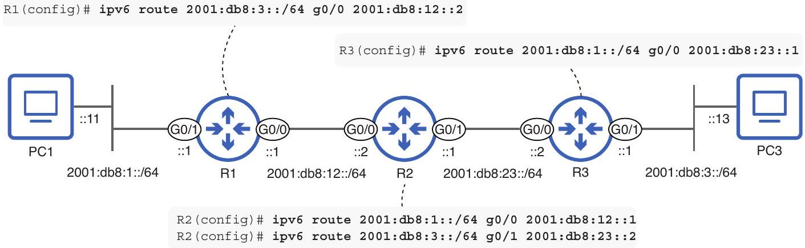
Figure 21.10 Configuring fully specified static routes on R1, R2, and R3 to enable PC1-PC3 communication. Each route's exit interface and next-hop IP address are specified.

In the following example, I show the configuration of R3's route to 2001:db8:1::/64 and then check its routing table:
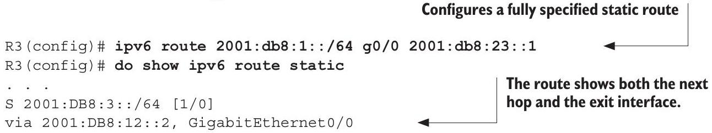

In practice, you can configure either recursive or fully specified static routes; there is no significant difference in performance between them. Just remember that IPv6 directly connected static routes don't work on Ethernet connections.

### 21.3.2 Link-local next hops

Packets sourced from or destined for link-local addresses are not routable; a router will not forward them. However, a link-local address can be used as the next hop of a route. This may seem counterintuitive-how can an unroutable address be used in a
route? Link-local next hops work because the link-local address is only used to direct the packet to the next immediate destination on the local link, not to route it across multiple hops or network segments.

Figure 21.11 shows the same example network as before, with the same four routes configured to enable communication between PC1 and PC3. This time, I used linklocal next-hop addresses.

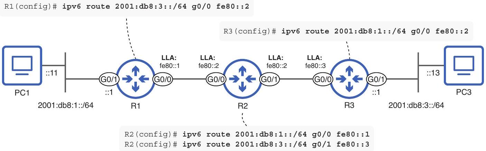
Figure 21.11 Configuring static routes using link-local next hops on R1, R2, and R3 to enable PC1-PC3 communication

You may have noticed that global unicast addresses are not shown for the R1-R2 and R2-R3 links in figure 21.11. These connections are examples of transit links-links that only serve to carry traffic between different parts of a network. Because these links don't serve as destinations for data, there's often no need to be able to communicate with them from remote networks; link-local addressing is sufficient for them to serve their purpose.

Although all IPv6-enabled interfaces automatically generate a link-local address using Modified EUI-64 rules, I manually configured the routers' link-local addresses to simplify them. In the following example, I configure R2's link-local addresses as fe80::2:

```
R2(config) # interface range g0/0-1
R2(config-if-range) # ipv6 address fe80::2 link-local
```

If configuring the same IP address on two different interfaces seems strange to you, you're right! Because a router's role is to connect different networks, no two interfaces should be in the same subnet, let alone have the exact same IP address. However, link-local addresses are an exception to that rule.

Because link-local addresses are significant and must be unique only within the context of a single network link, the same link-local address can be used on different interfaces as long as they are on separate links. This allows for configurations like the previous example: identical link-local addresses on multiple interfaces of the same router.

All of the static routes shown in figure 21.11 are fully specified; that's for a good reason. All link-local addresses share the same fe80::/64 prefix, and it's possible for the
same IP address to exist on multiple links. For that reason, a route specifying a link-local next-hop IP address without specifying the exit interface is ambiguous; the router has no way to know which interface the correct next hop is connected to. In fact, IOS won't let you configure such a route, as shown in the following example:
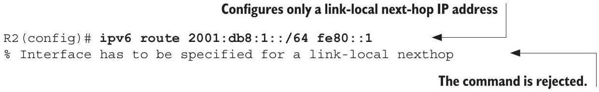

However, fully specified routes with link-local next hops are accepted. In the next example, I configure R2's routes and check its routing table:

```
R2(config)# ipv6 route 2001:db8:1::/64 g0/0 fe80::1
R2(config)# ipv6 route 2001:db8:3::/64 g0/1 fe80::3
```

Fully specified routes with link-local next hops

The routes are accepted and inserted into the routing table.

To summarize, here are three takeaways regarding link-local IP addresses:

- Link-local addresses alone can be sufficient on transit links. Global unicast/ unique local addresses might be unnecessary.
- Link-local addresses have to be unique only in the context of the local link.
- Routes with link-local next hops must be fully specified.

### 21.3.3 Configuring a default route

An IPv6 default route is a route to ::/0, which matches every possible IPv6 address-all $340,282,366,920,938,463,463,374,607,431,768,211,456$ of them. This is equivalent to 0.0.0.0/0 in IPv4. By being the least specific route possible, a default route is used as a catch-all, only selected to forward a packet if no other routes match the packet's destination IP address.

Default routes are most commonly used to provide a route to the internet. The logic is that packets destined for hosts in the enterprise's internal network should have a more specific route in the routing table; if the router receives a packet that doesn't match any internal destination, it's probably destined for the internet. Figure 21.12 shows an example of a default route to the internet.

EXAM TIP Default static routes are exam topic 3.3.a, and you should know how to configure them in both IPv4 and IPv6.

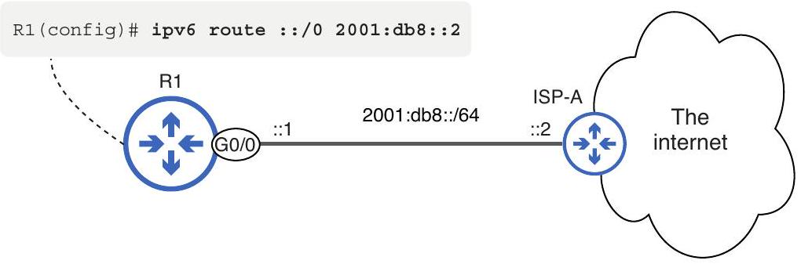
Figure 21.12 Configuring a default route to the internet

### 21.3.4 Floating static routes

As in IPv4, specifying an administrative distance (AD) value at the end of an IPv6 static route allows you to create a floating static route-a route that is made less preferable by using a non-default AD value. Figure 21.13 shows an example of a floating static route. Continuing from the example we saw in figure 21.12, R1 is now connected to a second ISP (ISP-B). A floating static route using ISP-B as the next hop provides a backup route to the internet.

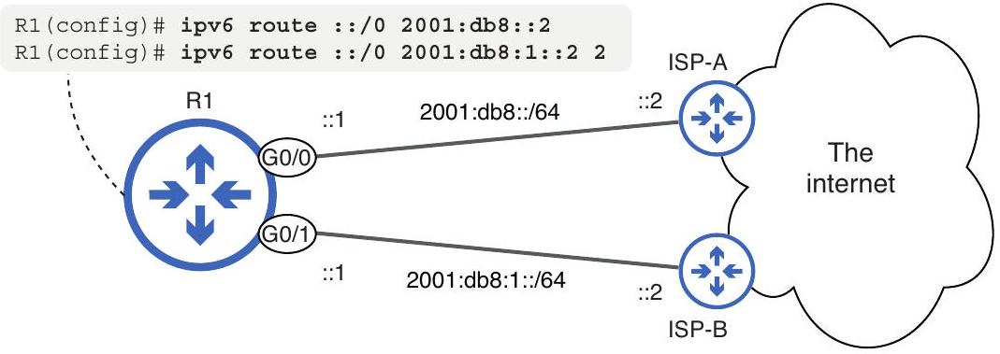
Figure 21.13 Configuring default routes to the internet. The route via ISP-A serves as the primary route, and the floating route via ISP-B serves as a backup.

Let's examine the effect of this configuration. In the following example, I configure the two routes on R1 and check its routing table:
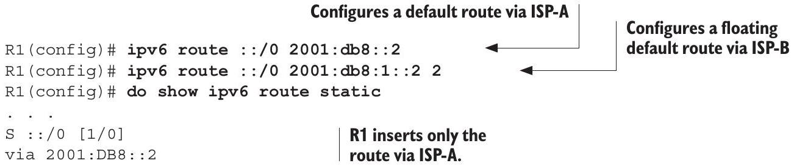

Static routes have an AD value of 1 by default. By configuring the ISP-B route with an AD value of 2, I made it less preferable than the ISP-A route. As a result, R1 inserts only
the ISP-A route into its routing table. The floating static route via ISP-B should only enter the routing table if the ISP-A route is removed. To test the floating static route, in the following example, I disable R1's G0/0 interface, simulating a hardware failure on the connection:

```
R1(config) # interface g0/0
R1(config) # shutdown
R1(config)# do show ipv6 route static
. . .
S ::/0 [2/0]
via 2001:DB8:1::2
```

As expected, the floating static route entered the routing table only after the ISP-A route was removed. Floating static routes are used as backup routes, whether that is a backup to another static route (as in this example) or another kind of route.

EXAM TIP Floating static routes are exam topic 3.3.d, so make sure you know how to configure them in both IPv4 and IPv6.

## Exam scenarios

Just like IPv4 routing, IPv6 routing is a critical part of the CCNA exam, although when it comes to IPv6, only static routing is covered. Here are a couple of examples of questions that test your understanding of IPv6 static routing:

1 (multiple choice, multiple answers)
You issue the command ipv6 route 2001:db8:1:1::1/128 GigabitEthernet0/1 fe80::2. Which of the following statements are true about the route created by the command? (Select two.)
    A It is a network route.
    B It is a host route.
    c It is a recursive route.
    D It is a directly connected route.
    E It is a fully specified route.

This question tests your understanding of the different IPv6 route types we covered in this chapter. The destination of the route uses a /128 prefix length; it is a route to a single destination IPv6 address, making it a host route. So B is correct. The route specifies both an exit interface and a next-hop IP address, so it is a fully specified route. Therefore, E is the second correct answer.

2 (lab simulation)
A lab simulation might require you to configure IPv6 static routes to enable connectivity between hosts in a network. You could be given a network diagram and be required to configure the appropriate routes on one or more routersperhaps with a floating static route or two thrown in for an additional challenge! Remember that the principles of IPv4 and IPv6 static routes are the same; the only major differences are the first word of the command (ip vs ipv6) and the format of the addresses.

## Summary

- IPv6 uses Neighbor Discovery Protocol for various essential functions like ARP-esque Layer 2 address resolution, router discovery, and duplicate address detection.
- Some NDP functions, such as address resolution and duplicate address detection, use a solicited-node multicast address, which is generated from a unicast address.
- To generate a solicited-node multicast address, prepend ff02:0000:0000:0000:00 00:0001:ff (ff02::1:ff) to the last six hexadecimal digits of the unicast address. For example, 2001:db8::12:3456 results in ff02::1:ff12:3456.
- NDP address resolution uses two ICMPv6 messages: Neighbor Solicitation (NS) and Neighbor Advertisement (NA). These are equivalent to ARP Request and ARP Reply.
- To learn a neighbor's MAC address, a host will send an NS message to the neighbor's solicited-node multicast address. The neighbor will reply with a unicast NA message, informing the sender of its MAC address.
- An IPv6 host stores its L3-L2 address mappings in the IPv6 neighbor table, which can be viewed with show ipv6 neighbors.
- NDP's router discovery function allows hosts to automatically discover routers connected to the local network, as well as other characteristics of the local network (such as the prefix).
- Router discovery uses two message types: Router Solicitation (RS) and Router Advertisement (RA).
- RS messages are sent to the "all routers" multicast address (ff02::2) to ask all routers on the local link to identify themselves. Routers typically send RA messages to the "all nodes" multicast address (ff02::1) in reply.
- NDP router discovery facilitates Stateless Address Autoconfiguration (SLAAC), which allows a host to automatically generate its own IPv6 address.
- A SLAAC-enabled host will send an RS message to discover routers on the local link, and routers will reply with RA messages.
- The host will combine the prefix information learned from the RA with an EUI-64 interface identifier to automatically generate its IPv6 address.
- You can configure a Cisco router to learn its IPv6 address via SLAAC with ipv6 address autoconfig.
- NDP's Duplicate Address Detection (DAD) is a feature that checks if an IPv6 address is unique on the network before a host uses it.
- Whenever an interface is configured with an IPv6 address, the host uses DAD. Likewise, when an IPv6-enabled interface initializes, it uses DAD.
- To perform DAD, a host sends an NS message to its own solicited-node multicast address. If there is no response, the address is determined to be unique. If the host receives an NA message in response, the address is a duplicate.
- If DAD detects a duplicate IPv6 address, the address cannot be used.

- IPv6-enabled routers build a routing table in which they store the best route(s) to each known destination. You can view the IPv6 routing table with show ipv6 route.
- A router will insert a connected route to each network its interfaces are connected to and a local route to the exact IP address of each of its interfaces.
- A local route is an example of a host route-a route to a single destination IP address. IPv6 host routes use a /128 prefix length.
- A connected route is an example of a network route-a route to more than one destination IP address, with a /127 or shorter prefix length.
- Routers forward IPv6 packets according to the most specific matching route in the routing table-the same as IPv4 packets.
- A static route that specifies only the next-hop IP address is called a recursive static route because it requires recursive (repeated) routing table lookups to forward a packet. The command syntax is ipv6 route destination-prefix next-hop.
- A static route that specifies only the exit interface is called a directly connected static route because it makes the router believe that it is directly connected to the destination network. The syntax is ipv6 route destination-prefix exit-interface.
- Directly connected IPv6 static routes don't work on Ethernet interfaces. Directly connected IPv4 static routes rely on proxy ARP to work, but Cisco routers don't support an equivalent proxy NDP.
- A static route that specifies both the exit interface and the next-hop IP address is called a fully specified static route. The syntax is ipv6 route destination-prefix exit-interface next-hop.
- Although packets sourced from and destined for link-local addresses are not routable, link-local addresses can be used as next-hop addresses of routes.
- Transit links are links that only serve to carry traffic between different parts of a network-they often do not need global unicast/unique local addresses. Linklocal addresses are often sufficient.
- Link-local addresses must be unique only within the context of a single link, so multiple interfaces on the same router can share the same link-local address.
- Static routes with link-local next hops must be fully specified; IOS will reject the command otherwise.
- An IPv6 default route is a route to ::/0, which matches every possible IPv6 address. This is equivalent to 0.0.0.0/0 in IPv4.
- Default routes are most commonly used to provide a route to the internet. Packets that don't match any internal destinations are forwarded to the internet.

- An administrative distance (AD) value can be specified at the end of the ipv6 route command to configure a floating static route-a route that is made less preferable by configuring it with a non-default AD.
- Floating static routes act as backup routes, only entering the routing table if a more desirable route (i.e., another static route with the default AD value) is removed.

Licensed to Luke Chen [mic215fa@gmail.com](mailto:mic215fa@gmail.com)
