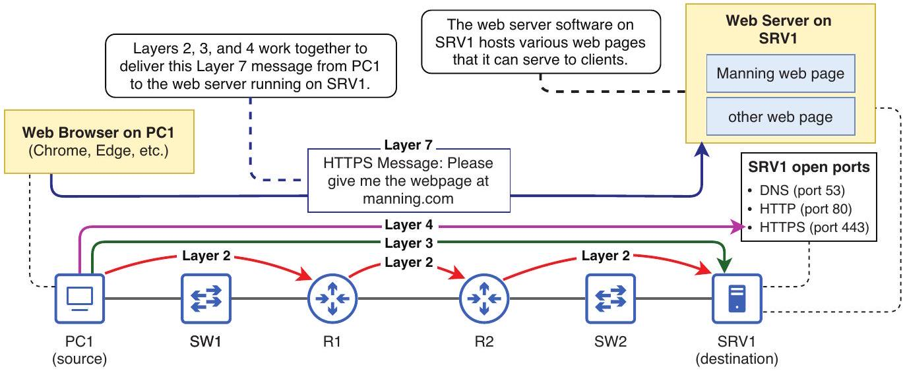
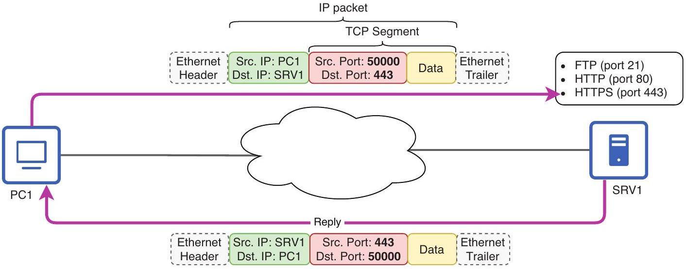
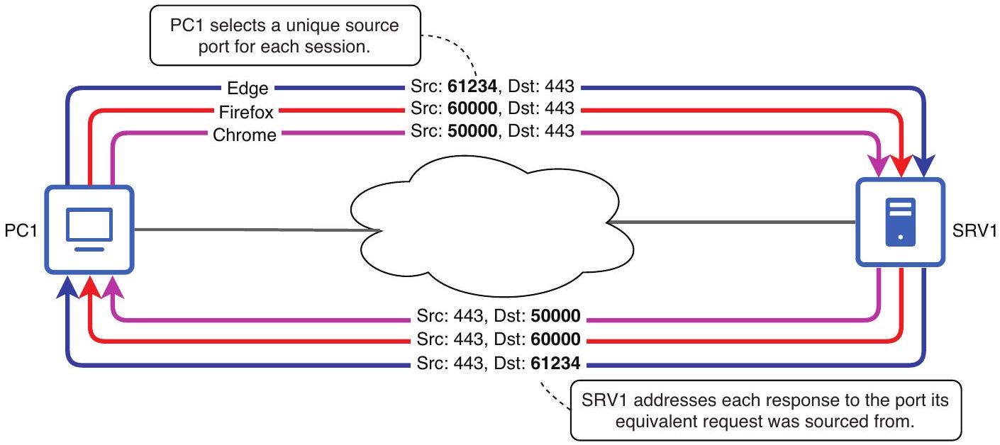
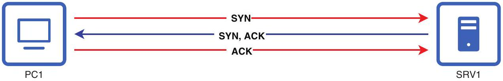
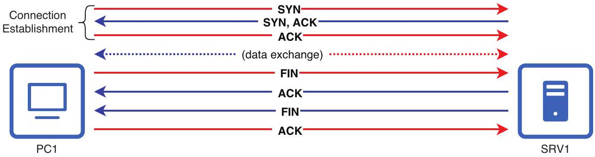
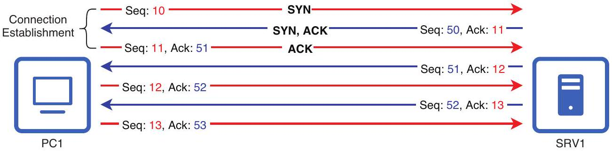
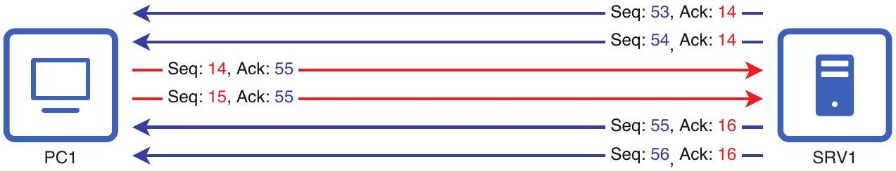
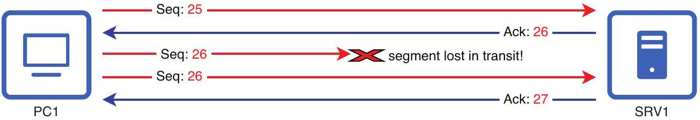
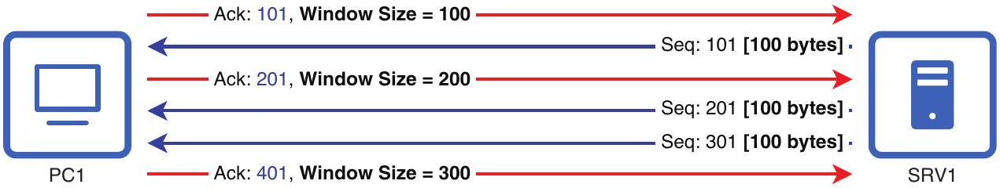
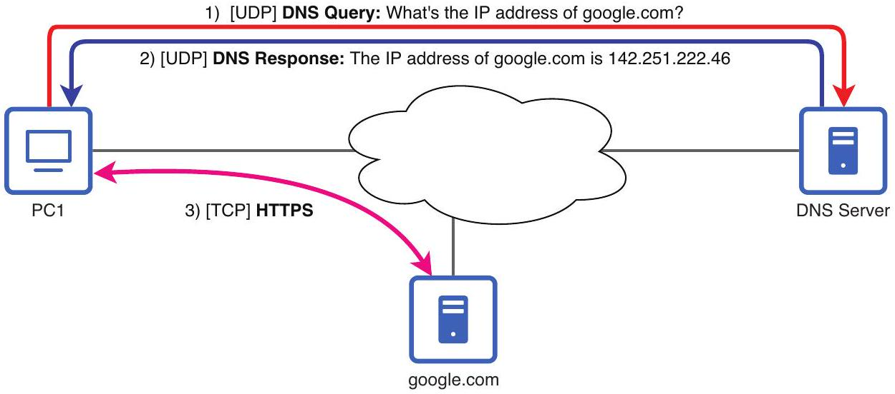

## Transmission Control Protocol and User Datagram Protocol

## This chapter covers

- How the Transmission Control Protocol and User Datagram Protocol provide Layer 4 addressing and session multiplexing
- How TCP provides features like reliable communication and flow control
- Comparing TCP and UDP, and the situations in which each is preferred

In chapter 3 of this book, we covered physical cables, connectors, and ports-Layer 1 of the TCP/IP model. In other chapters, we covered the Data Link Layer (Layer 2): MAC addresses, frame switching, VLANs, STP, and other related topics. We have also spent many pages on the Network Layer (Layer 3): IPv4 and IPv6 addressing, subnetting, packet forwarding, static and dynamic routing, first-hop redundancy protocols, etc. In this chapter, we will venture beyond those first three layers and take a look at Layer 4 of the TCP/IP model: the Transport Layer. Specifically, we will examine the two major Layer 4 protocols: Transmission Control Protocol (TCP) and User Datagram Protocol (UDP), which are exam topic 1.5: Compare TCP to UDP.

### 22.1 The role of Layer 4

In chapter 4 of this book, we took a high-level look at the role of each layer of the TCP/ IP model. For review, figure 22.1 summarizes the role of each layer.

Figure 22.1 A web browser on PC1 uses a Layer-7 protocol (HTTPS) to request a web page from the web server on SRV1. Layers 2, 3, and 4 work together to deliver the message to the appropriate application on SRV1. Layer 1 provides the medium over which the communication occurs.

NOTE Hypertext Transfer Protocol Secure (HTTPS) is an Application Layer protocol often used for transmitting web pages over a network, such as the internet.

Layer 1 encompasses the physical components required for communication: the cables connecting the devices and the signals that travel over them. Layer 2 deals with hop-to-hop communication between intermediate nodes in the path to the destination. Switches use Layer 2 information (MAC addresses) to make forwarding decisions, and end hosts and routers must encapsulate packets in frames destined for the MAC address of the next hop.

Layer 3 provides end-to-end addressing from the source host to the destination host, and routers use Layer 3 information (IP addresses) to make forwarding decisions, ensuring packets reach their correct destinations. However, it's not enough for the data to reach the correct destination host; the data has to reach the correct application process on the destination host, and that's one of the major roles of Layer 4. However, Layer 4 can also provide many other services that we will examine when looking at the specifics of TCP and UDP in section 22.2.

In this chapter, we will focus primarily on Layer 4 communication between hosts, but don't forget that Layer 4 operates on top of Layers 1, 2, and 3; the lower layers are necessary to deliver Layer 4 segments between the communicating hosts. Likewise, keep in mind that Layer 4's purpose is to provide services to the Application Layer protocols that run above Layer 4, although we won't focus on the specifics of those protocols in this chapter.

### 22.1.1 Port numbers

Like Ethernet and IP, Layer 4 protocols such as TCP and UDP use their own system of addressing, called ports. The term port, in this case, does not refer to a physical port on a device; a Layer 4 port is a number ranging from 0 to 65535 that is used to address a message to a specific application process on the destination host.

Figure 22.2 shows how PC1 addresses data to a specific application service on SRV1. Data prepared by the Application Layer is encapsulated in a TCP header, making a TCP segment. The segment is sourced from a random port (more on this later) and destined for port 443; this addresses the message to the HTTPS service running on SRV1. This segment is encapsulated in an IP header destined for SRV1's IP address. This packet is then encapsulated in a new Ethernet header/trailer at each hop in the path from PC1 to SRV1-a process we've covered a few times in this book.

Figure 22.2 PC1 sends a TCP segment to SRV1. The segment is sourced from port 50000 on PC1 and destined for port 443 on SRV1. SRV1's reply reverses the ports: it is sourced from port 443 on SRV1 and destined for port 50000 on PC1.

When SRV1 replies to PC1, SRV1 reverses the port numbers; SRV1's TCP segment to PC1 is sourced from port 443 and destined for port 50000. This is similar to how the IP addresses are reversed; the reply is sourced from SRV1's IP address and destined for PC1's IP address.

Some Application Layer protocols use TCP as their Layer 4 protocol, and some use UDP; as we'll cover in section 22.2, TCP and UDP have different characteristics that make them suitable for different kinds of Application Layer protocols. In addition to using a specific Layer 4 protocol, each Application Layer protocol also uses a different port number. As we saw in figure 22.2, HTTPS uses TCP as its Layer 4 protocol, with its port number being 443. To address a message to the web server running on SRV1 (which uses HTTPS), PC1 must send the message in a TCP segment destined for port 443.

NOTE Although TCP and UDP are the most common Layer 4 protocols, they are not the only ones. However, for the purpose of the CCNA exam, you just need to know TCP and UDP.

A server running a particular application service is said to "listen on" the relevant port, meaning it waits for incoming messages addressed to the specific TCP or UDP port number. For example, a web server using HTTPS listens on TCP port 443. Table 22.1 lists the Layer 4 protocols and port numbers of some common Application Layer protocols. Note that some protocols can use both TCP and UDP, depending on what kind of communication is required. For example, Domain Name System (DNS)-used to translate names like google.com to IP addresses-uses either TCP or UDP; we'll cover DNS in chapter 3 of volume 2 of this book.

Table 22.1 Port numbers of common Application Layer protocols
| TCP |  | UDP |  |
| :--- | :--- | :--- | :--- |
| Application Layer Protocol | Port | Application Layer Protocol | Port |
| FTP (File Transfer Protocol) data | 20 | DNS (Domain Name System) | 53 |
| FTP control | 21 | DHCP (Dynamic Host Configuration Protocol) server | 67 |
| SSH (Secure Shell) | 22 | DHCP client | 68 |
| Telnet | 23 | TFTP (Trivial File Transfer Protocol) | 69 |
| SMTP (Simple Mail Transfer Protocol) | 25 | NTP (Network Time Protocol) | 123 |
| DNS (Domain Name System) | 53 | SNMP (Simple Network Management Protocol) agent | 161 |
| HTTP (Hypertext Transfer Protocol) | 80 | SNMP manager | 162 |
| POP3 (Post Office Protocol version 3) | 110 | Syslog | 514 |
| IMAP (Internet Message Access Protocol) | 143 |  |  |
| HTTPS (HTTP Secure) | 443 |  |  |

EXAM TIP Make sure you know the Layer 4 protocol (TCP/UDP) and port number of each Application Layer protocol we cover in this book. Table 22.1 would be a good reference for flashcards to help you memorize the port numbers for each protocol. Several chapters in volume 2 of this book will also give you a chance to review most of these protocols as we cover them in more detail.

Port numbers are assigned by an organization called the Internet Assigned Numbers Authority (IANA, pronounced as "eye-AN-uh"). IANA divides port numbers into three ranges, each with its own purpose. Well-known ports (0-1023) are reserved for the most common protocols; all of the port numbers in table 22.1 are from this range. Registered ports (1024-49151) are not as strictly controlled as well-known ports, but an enterprise
may register its protocol with IANA to use a port number in this range to avoid conflicts; different protocols should not use the same port number.

The remaining ports are ephemeral ports (49152-65535). These ports are not controlled by IANA, so registration is not required to use them. They are most commonly used by client devices as the source ports for connections. For example, in the example we saw in figure 22.2, a client (PC1) used port 50000 (an ephemeral port) as the source port of its message to a server (SRV1). The following is a summary of the three port ranges:

- Well-known ports-0-1023
    - Reserved for use by the most common protocols.
    - Controlled and assigned by IANA.
    - Also called system ports.
- Registered ports-1024-49151
    - Protocols may be registered with IANA to use a port number in this range.
    - Registration is done to avoid conflicts, so that two different protocols don't use the same port number.
    - Also called user ports.
- Ephemeral ports-49152-65535
    - Not controlled or assigned by IANA.
    - Dynamically selected by client devices as the source port for connections.
    - Also called dynamic or private ports.

### 22.1.2 Session multiplexing

Imagine you have three web browsers open on your PC: Chrome, Firefox, and Edge. In Chrome, you visit wikipedia.org and click around, viewing a few articles. Then you do the same on Firefox and Edge. Each browser on your PC is a client using HTTPS to interact with a Wikipedia web server, and each of these interactions is called a session- an exchange between two communicating devices. How does your PC keep track of these sessions? Why does a link clicked in Chrome not open in Firefox?

When a client, like one of your web browsers, initiates communication with a server, it selects a random number from the ephemeral port range (49152-65535) to use as the source port for that particular session. This port is used to uniquely identify the session for the duration of its communication with the server. This process of keeping track of each communication session is called session multiplexing.

This is why when you click a link in Chrome, the resulting page doesn't appear in Firefox-each browser selects a unique port associated with its connection to the server. Figure 22.3 shows how these ephemeral ports are used to keep track of each session between your PC and the Wikipedia server.

Figure 22.3 Session multiplexing is achieved through port numbers. PC1 selects a unique source port for each communication session with SRV1, which addresses each response to the same port from which the corresponding request originated.

## Sockets and sessions

The combination of an IP address, a port number, and Layer 4 protocol is called a socket. A web server with IP address 203.0.113.1 that listens on TCP port 443 has the following socket: 203.0.113.1, TCP port 443. When a client wants to connect to this server, it opens its own socket. Let's say a client with IP address 192.168.1.1 uses port 50000 for this purpose-its socket is 192.168.1.1, TCP port 50000.

A session can be thought of as a combination of the two sockets. In our example, that means the following two sockets:

- Client socket-192.168.1.1, TCP port 50000
- Server socket-203.0.113.1, TCP port 443

This pair of sockets is sometimes called a five-tuple, because it consists of five elements: the client IP, the client port number, the server IP, the server port number, and the Layer 4 protocol (TCP or UDP). You may or may not encounter the terms socket and five-tuple on the CCNA exam, but they are terms commonly used in networking.

### 22.2 TCP and UDP

As mentioned previously, there are two main Layer 4 protocols in use today: TCP and UDP. Because exam topic 1.5 states that you must be able to "compare TCP to UDP," it's important that you understand the characteristics of these two protocols.

### 22.2.1 Transmission Control Protocol

Transmission Control Protocol (TCP) is a Layer 4 protocol that, in addition to providing addressing and session multiplexing, offers a variety of benefits, such as connection-oriented communication, data sequencing, reliable communication via acknowledgment and retransmission, and flow control; we will cover these benefits in this section.

Figure 22.4 shows the format of the TCP header. Although I will refer to some of these fields as we cover TCP's features, don't worry about memorizing the header; I include it here only for reference.

|  | Byte | 0 |  |  |  |  |  |  |  |  | 1 |  |  |  |  |  |  |  |  | 2 |  |  |  |  |  |  |  |  | 3 |  |  |  |  |  |  |  |
| :--- | :--- | :--- | :--- | :--- | :--- | :--- | :--- | :--- | :--- | :--- | :--- | :--- | :--- | :--- | :--- | :--- | :--- | :--- | :--- | :--- | :--- | :--- | :--- | :--- | :--- | :--- | :--- | :--- | :--- | :--- | :--- | :--- | :--- | :--- | :--- | :--- |
| Byte | Bit | 0 | 1 | 2 | 3 | 4 | 5 | 6 |  | 7 | 8 | 9 | 10 | 11 | 12 | 13 | 14 |  | 15 | 16 | 17 | 18 | 19 | 20 | 21 | 22 | 23 |  | 24 | 25 | 26 | 27 | 28 | 29 | 30 | 31 |
| 0 | 0 | Source Port |  |  |  |  |  |  |  |  |  |  |  |  |  |  |  |  |  | Destination Port |  |  |  |  |  |  |  |  |  |  |  |  |  |  |  |  |
| 4 | 32 | Sequence Number |  |  |  |  |  |  |  |  |  |  |  |  |  |  |  |  |  |  |  |  |  |  |  |  |  |  |  |  |  |  |  |  |  |  |
| 8 | 64 | Acknowledgment Number |  |  |  |  |  |  |  |  |  |  |  |  |  |  |  |  |  |  |  |  |  |  |  |  |  |  |  |  |  |  |  |  |  |  |
| 12 | 96 | Data Offset |  |  |  | Reserved |  |  |  |  | Flags (ie., SYN, ACK, FIN) |  |  |  |  |  |  |  |  | Window Size |  |  |  |  |  |  |  |  |  |  |  |  |  |  |  |  |
| 16 | 128 | Checksum |  |  |  |  |  |  |  |  |  |  |  |  |  |  |  |  |  | Urgent Point |  |  |  |  |  |  |  |  |  |  |  |  |  |  |  |  |
| 20 | 160 |  |  |  |  |  |  |  |  |  |  |  |  |  |  |  |  |  |  |  |  |  |  |  |  |  |  |  |  |  |  |  |  |  |  |  |
| ⋮ | ⋮ |  |  |  |  |  |  |  |  |  |  |  |  |  |  |  |  |  |  |  |  |  |  |  |  |  |  |  |  |  |  |  |  |  |  |  |
| 56 | 448 |  |  |  |  |  |  |  |  |  |  |  |  |  |  |  |  |  |  |  |  |  |  |  |  |  |  |  |  |  |  |  |  |  |  |  |

Figure 22.4 The format of the TCP header. Like the IPv4 header, it is a minimum of 20 bytes in size but can be up to $\mathbf{6 0}$ bytes if Options are included.

NOTE The Source Port and Destination Port fields are each 16 bits in length. That's why there are 65,536 port numbers (from 0-65535) in total: $2^{16}=65,536$.

## TCP connections

TCP is a connection-oriented protocol. That means that, before exchanging data, hosts must first establish a connection. Furthermore, after the necessary data has been exchanged, the hosts will terminate the connection. Therefore, exchanging data via TCP is a three-step process:

1 Connection establishment
2 Data exchange
3 Connection termination

The Flags field of the TCP header is 8 bits in length, meaning there are eight different flags, each with a different function. A flag is an individual bit that indicates or controls a particular behavior in a protocol. To activate ("set") a flag, the sending host will set
the flag's binary value to 1. TCP connections are established using two flags in the Flags field of the TCP header: SYN (synchronize) and ACK (acknowledge). The process is called the three-way handshake, because it involves three messages, as shown in figure 22.5.

Figure 22.5 The TCP three-way handshake. PC1 initiates the connection by sending a TCP segment with the SYN flag, SRV1 responds with a segment with the SYN and ACK flags, and finally, PC1 sends a segment with the ACK flag.

NOTE The three segments sent during TCP connection establishment are empty-there is no encapsulated data. Their only purpose is to establish the connection, not to exchange data.

After the TCP connection has been established, the data exchange can take place. For example, perhaps the client requests a file from the server, which the server then transfers to the client. After each device is done sending data, it will send a TCP segment with the FIN (finish) bit set, and the hosts will acknowledge each other's FIN segments by sending a segment with the ACK bit set. This usually (but not always) occurs in four separate messages and thus is often called the four-way handshake (in contrast with the three-way handshake used for connection establishment). Figure 22.6 shows the TCP connection termination process after connection establishment and data exchange.

Figure 22.6 TCP connection termination. After the connection establishment and data exchange, PC1 sends a segment with the FIN flag to terminate the connection. SRV1 replies with an ACK segment and then sends its own FIN segment, to which PC1 replies with an ACK segment.

EXAM TIP Remember the TCP connection establishment (SYN, SYN-ACK, ACK) and termination (FIN, ACK, FIN, ACK) sequences for the exam.

Unlike TCP connection establishment, which always occurs in three sequential messages, connection termination doesn't always occur as stated previously. For example, in some cases, the server might send a single segment with both the ACK and FIN flags set, resulting in the sequence FIN, ACK-FIN, ACK. However, the details of this are beyond the scope of the CCNA exam, so I recommend learning the typical four-way handshake for now.

## Data sequencing and acknowledgment

Another feature of TCP is data sequencing, meaning that even if segments arrive at their destination out of order, TCP provides the means to rearrange them in the correct order. This is achieved using the Sequence Number field of the TCP header. Furthermore, each segment is acknowledged by the receiver using the Acknowledgment Number field, providing reliable communication; TCP confirms that each segment is received. Figure 22.7 shows this process.

Figure 22.7 TCP data sequencing and acknowledgment. During connection establishment, each host sets a random initial sequence number. Each segment is acknowledged by the receiver by indicating the sequence number of the next segment it expects to receive.

During the TCP connection establishment process, each host sets a random initial sequence number that it increments as it sends data to the other host. In figure 22.7's example, PC1 selected 10 as its initial sequence number, and SRV1 selected 50.

To acknowledge receipt of a particular segment, the receiving host will set its next segment's acknowledgment number to the sequence number of the next segment it expects to receive (not the sequence number of the segment it just received). For example, after SRV1 receives PC1's segment with sequence number 10, SRV1's reply uses acknowledgment number 11. Likewise, after PC1 receives SRV1's segment with sequence number 50, PC1 acknowledges its receipt by using acknowledgment number 51.

The exchange in figure 22.7 shows PC1 and SRV1 sending and receiving segments in turn, one segment at a time. Before sending a new segment, each host waits for its previously sent segment to be acknowledged. However, for the sake of efficiency, it's possible for multiple segments to be acknowledged with a single segment. Figure 22.8 shows an example: PC1 and SRV1 send each other two segments at a time before waiting for acknowledgment.

Figure 22.8 PC1 and SRV1 send each other two segments at a time before waiting for acknowledgment. Segments sent consecutively without receiving a new segment from the other host have identical acknowledgment numbers.

TCP connections operate bidirectionally, with each host maintaining its own sequence and acknowledgment numbers. The incrementation of these numbers is determined by the communication dynamics between the hosts. In scenarios where one host predominantly sends data while the other predominantly receives-such as a file transfer from one host to the other-only the sender's sequence number and the receiver's acknowledgment number will consistently increment. This reflects the flow of data from the sender to the receiver and the receiver's acknowledgment of that data.

NOTE In these examples, I use simple sequence and acknowledgment numbers, but real TCP sequence and acknowledgment numbers can be very large (on the scale of billions). Also, note that sequence and acknowledgment numbers are actually measures of bytes sent and received, not values that are incremented by 1 with each segment. For the purpose of the CCNA, just understand the concepts-don't worry about the exact numbers.

## Retransmission

We just covered how TCP acknowledges receipt of each segment, but how does this provide the "reliable communication" that I mentioned previously? What happens if the sender does not receive acknowledgment for a segment that it sent? If the sender of a segment does not receive an acknowledgment within a certain period of time (called the retransmission timeout), it will retransmit the segment, as shown in figure 22.9.

Figure 22.9 TCP retransmission. PC1's first segment with sequence number 26 does not reach SRV1. Because PC1 doesn't receive an acknowledgment for the segment, it retransmits the segment, which is then received and acknowledged by SRV1.

NOTE For simplicity's sake, figure 22.9 focuses on the data transfer from PC1 to SRV1, showing only PC1's sequence numbers and SRV1's acknowledgment numbers.

Another event that could trigger a retransmission is a host receiving a segment with a faulty checksum. Similar to Ethernet's Frame Check Sequence field, which checks for errors in a frame, and IPv4's Header Checksum field, which checks for errors in the IPv4 header, TCP uses its Checksum field to check for errors in segments.

When a device constructs a TCP segment, it uses an algorithm to calculate a checksum, which is included in the TCP header's Checksum field. The host that receives the segment will calculate its own checksum value from the segment. If the two values don't match, it means that the data has been corrupted in transit. As a result, the receiver discards the segment and does not send an acknowledgment, which triggers a retransmission from the sender.

## Flow control

The final TCP feature we will cover is flow control, a mechanism that prevents a sender from overwhelming a receiver by sending too much data too quickly. It ensures that the sender only sends as much data as the receiver is able to handle at a given time. This is critical in situations where the sender can transmit data faster than the receiver can process it.

The appropriate data transfer rate depends on multiple things, such as the speed of the receiver's network connection, its processing capability, and the current load on both. If the sender sends data too quickly, either the receiver or the network it is connected to could be overloaded, resulting in dropped segments (and lots of retransmissions-bad for performance!). Note that the appropriate rate is not fixed; it can vary within a session, and TCP provides the ability to adjust depending on the current conditions.

Flow control is implemented in TCP primarily through the Window Size field of the TCP header, through which a receiver tells a sender how much data the sender should send before waiting for an acknowledgment. Figure 22.10 demonstrates the concept: PC1 (the receiver) uses the Window Size field of its segments to tell SRV1 how much data to send before waiting for the next acknowledgment.

Figure 22.10 TCP flow control is achieved through the Window Size field of the TCP header. In its segments to SRV1, PC1 specifies how much data SRV1 should send before waiting for the next acknowledgment. This can be adjusted dynamically to find an appropriate rate.

NOTE Figure 22.10 focuses only on the data transfer from SRV1 to PC1. Keep in mind that each host specifies its own window size, although SRV1's specified window size isn't shown. Each host specifies its window size in every single TCP segment it sends.

In the first message from PC1 to SRV1 shown in figure 22.10, PC1 specifies a window size of 100 bytes. SRV1 then sends a segment with 100 bytes of encapsulated data and waits for acknowledgment from PC1. In its segment acknowledging receipt of SRV1's segment, PC1 specifies a greater window size: 200 bytes. SRV1 then sends 200 bytes of data (in two TCP segments) before waiting for PC1's acknowledgment. In the final message shown, PC1 specifies a window size of 300 bytes.

NOTE Because TCP is able to dynamically adjust the window size to find an appropriate rate, it is said that TCP uses a sliding window.

### 22.2.2 User Datagram Protocol

Just like TCP, the User Datagram Protocol (UDP) provides Layer 4 addressing and session multiplexing via port numbers. However, when compared to TCP, the defining characteristics of UDP stem more from what it doesn't provide rather than what it does:

- UDP is not connection oriented. Hosts do not establish a connection before communication; the sending host simply sends the data.
- UDP does not provide reliable communication. UDP does not provide a mechanism for acknowledging received messages or retransmitting lost messages.
- UDP does not provide data sequencing. There is no sequence number in the UDP header. If messages arrive out of order, UDP provides no mechanism to put them back in order.
- UDP does not provide flow control; it has no mechanism like TCP's window size to control the flow of data. UDP simply sends data as quickly as it can.

Figure 22.11 shows the UDP header. Whereas the TCP header is $20-60$ bytes in size, the UDP header is very simple and lightweight-only 8 bytes in size.

|  | Byte | 0 |  |  |  |  |  |  |  |  | 1 |  |  |  |  |  |  |  | 2 |  |  |  |  |  |  |  |  | 3 |  |  |  |  |  |  |  |
| :--- | :--- | :--- | :--- | :--- | :--- | :--- | :--- | :--- | :--- | :--- | :--- | :--- | :--- | :--- | :--- | :--- | :--- | :--- | :--- | :--- | :--- | :--- | :--- | :--- | :--- | :--- | :--- | :--- | :--- | :--- | :--- | :--- | :--- | :--- | :--- |
| Byte | Bit | 0 | 1 | 2 | 3 | 4 | 5 | 6 |  | 7 | 8 | 9 | 10 | 11 | 12 | 13 | 14 | 15 | 16 | 17 | 18 | 19 | 20 | 21 | 22 | 23 |  | 24 | 25 | 26 | 27 | 28 |  | 30 | 31 |
| 0 | 0 |  |  |  |  |  |  |  |  |  |  |  |  |  |  |  |  |  | Destination Port |  |  |  |  |  |  |  |  |  |  |  |  |  |  |  |  |
| 4 | 32 | Length |  |  |  |  |  |  |  |  |  |  |  |  |  |  |  |  | Checksum |  |  |  |  |  |  |  |  |  |  |  |  |  |  |  |  |

Figure 22.11 The UDP header. Compared to the TCP header, the UDP header is very lightweight, being only 8 bytes in size.

NOTE Because UDP has a checksum field, it is able to provide error detection. However, unlike TCP, there is no mechanism for retransmission, so messages with errors are discarded and forgotten by UDP.

Defining UDP by what it doesn't provide may make UDP seem inferior to TCP, but that is not the case. There are many instances where UDP is preferred, and we will cover them in section 22.2.3.

## Datagrams and data streams

A datagram (the D in UDP) is a basic unit of transfer that is self-contained and independent of other messages. In the case of UDP, "datagram" is in the name because UDP uses a datagram model for transmission, which means it sends data in discrete chunks (datagrams) that are independent of each other.

This is in contrast to TCP, which treats data as a continuous stream. It breaks this stream up into manageable chunks (segments) for transmission, but the boundaries of these segments have no correlation with the structure of the data itself.

As an analogy, you can think of the data that must be sent as a chapter of a book. UDP might send the data one sentence (or paragraph-whatever fits into a single datagram) at a time; each is a coherent unit. TCP, on the other hand, treats the chapter (the data) as a continuous stream, and the boundary between segments might be in the middle of a paragraph, a sentence, or even a word. Although a half sentence doesn't make sense on its own, TCP provides the mechanisms to ensure that all of the data is received and is in the correct order.

### 22.2.3 Comparing TCP and UDP

Although all of TCP's features may seem great, they come at the cost of additional overhead-the additional data and processing required to manage and ensure the transmission of the actual user data inside each segment. TCP's overhead comes in three main forms:

- Data overhead-The extra bytes of the TCP header (20-60 bytes versus UDP's 8) means that the ratio of encapsulated data to headers is reduced. Headers are necessary for the protocols to function but do not carry actual user data.
- Processing overhead-This refers to the additional computing resources required to implement the protocol. TCP, with its features such as connection establishment, reliable communication, and flow control, requires more processing power and memory than UDP, which provides none of these features.
- Time overhead-Establishing TCP connections introduces additional latency; unlike UDP, in which a host immediately sends data, hosts using TCP must first perform the three-way handshake to establish a connection. Furthermore, the need to wait for acknowledgments of transmitted data can slow down transmission.

EXAM TIP The material in this section is especially important for the CCNA exam since it directly addresses exam topic 1.5: Compare TCP to UDP.

Table 22.2 summarizes the differences between TCP and UDP. We will examine these differences in greater detail as we cover the situations in which each protocol is preferred.

Table 22.2 Comparing TCP and UDP
| TCP | UDP |
| :--- | :--- |
| Connection-oriented | Not connection-oriented |
| Data sequencing | No data sequencing |
| Reliable | Unreliable |
| Flow control | No flow control |
| More overhead | Less overhead |
| Preferred in situations where data integrity is critical and delivery of all segments is required | Preferred in situations where speed or efficiency is a priority and some packet loss is acceptable |

NOTE Although we are discussing Layer 4, where the term segment (TCP) or datagram (UDP) is more accurate, the term packet (which includes the Layer 3 header) is often used more broadly. For example, packet loss refers to the loss or discard of messages in a network during transmission.

## QUIC

Although not a CCNA exam topic, there is a third Layer 4 protocol that is gaining in popularity: QUIC, which was originally developed by engineers at Google. QUIC is officially not an acronym; it's just the protocol's name (although it originally stood for Quick UDP Internet Connections). QUIC is built on top of UDP but provides TCP-like functionality with reduced latency and built-in encryption for secure connections. QUIC is now used for the majority of connections from Chrome to Google web servers and is currently used by roughly 7\% of all websites.

## Scenarios where TCP is preferred

TCP, with its various features, is preferred in situations where data integrity is critical and the delivery of all segments is required. For example, TCP is usually the preferred choice for file transfers. When downloading a file, minor latency due to connection establishment, retransmissions, and other TCP features is acceptable; it's more important that the entire file arrives intact, with all of its bytes in the correct order.

Web browsing is another scenario where TCP is typically preferred. When a user accesses a website, the underlying HTTP or HTTPS protocols use TCP to ensure that all of the web content (text, images, etc.) is reliably delivered and displayed in the correct
order. Similarly, email protocols like SMTP, POP3, and IMAP use TCP to ensure that emails are not lost in transmission and that they arrive correctly at their destinations.

Scenarios where UDP is preferred
UDP, simple and lightweight, is preferred in several situations, such as these:

- Real-time applications
- Simple query/response protocols
- When reliability is provided by other means

Real-time applications like video streaming, online gaming, and voice/video calling (i.e., Zoom) typically use UDP. These applications need fast data transmission and can tolerate some loss of data; the most recent data is the most valuable, and lost data quickly becomes irrelevant. For example, in a video call, if some packets are lost, it's usually better to have minor temporary visual or audio degradation rather than a delay while waiting for the missing packets to be retransmitted.

UDP is also often preferred for simple query-response protocols, such as DNS. Figure 22.12 shows an example: PC1 uses DNS to learn the IP address of google.com before it is able to use HTTPS to access the website.

Figure 22.12 Simple DNS exchanges like the one in steps (1) and (2) use UDP. Having learned google .com's IP address, in step 3, PC1 uses HTTPS to access the website.

A protocol like DNS, which usually involves short requests (queries) and responses, does not require the various features of TCP. The overhead of setting up a TCP connection isn't worth it for a single, small request and response; it would only delay the exchange by introducing latency.

NOTE As mentioned previously, DNS uses TCP in some cases, although we will not cover those cases in this chapter.

A third situation where UDP may be preferred is when reliability is provided by other means. Although UDP itself doesn't provide reliability, the underlying Application Layer protocol might; Trivial File Transfer Protocol (TFTP) is one example. Although I previously stated that TCP is usually preferred for file transfers, the TFTP protocol-which, as the name suggests, is used for transferring files-has its own built-in reliability mechanism. When using TFTP, the receiver must acknowledge each TFTP message it receives. For that reason, TFTP does not need to rely on TCP to provide reliable delivery of messages; it uses UDP instead. We will cover TFTP in chapter 8 of volume 2 of this book.

Although voice/video calling applications fall into the category of "real-time applications," you could say that they have their own built-in reliability too. If you are on a call and packet loss causes a short disruption, you can ask the speaker to repeat what they said. This is reliability at Layer 8-the User Layer!

## Layer 8

Layer 8 isn't an officially recognized layer of the OSI or TCP/IP models. It's just a term used humorously or ironically in networking and other IT fields to acknowledge that, beyond the technical issues handled within the layers of the OSI and TCP/IP models, there are often factors like user error, organizational politics, and other human factors that can impact network performance, security, and other aspects of a system.

## Summary

- Layer 4 (Transport) operates on top of Layers 1, 2, and 3, which are responsible for delivering Layer 4 segments between communicating hosts. Likewise, Layer 4 provides services to the Application Layer protocols that run above it.
- The most common Layer 4 protocols are Transmission Control Protocol (TCP) and User Datagram Protocol (UDP).
- TCP and UDP use their own system of addressing called ports. A port is a number ranging from 0 to 65535 that is used to address a message to a specific application process on the destination host.
- Application Layer protocols run on top of either TCP or UDP (or both in some cases). Each also listens on a specific port number. For example, HTTPS listens on TCP port 443.
- Port numbers are assigned by the Internet Assigned Numbers Authority (IANA). IANA divides port numbers into three ranges: well-known, registered, and ephemeral.
- Well-known ports (0-1023) are reserved for the most common protocols and are strictly controlled and assigned by IANA.
- Registered ports (1024-49151) are not as strictly controlled as well-known ports but can be registered for use with a specific protocol.

- Ephemeral ports (49152-65535) are not controlled by IANA, and registration is not required to use them. They are most commonly used by client devices as the source ports for connections.
- Port numbers also allow for session multiplexing, which allows hosts to keep track of communication sessions by associating them with their unique source and destination IP addresses and port numbers.
- In addition to addressing and session multiplexing, TCP provides benefits like connection-oriented communication, data sequencing, reliable communication, and flow control.
- Exchanging data via TCP is a three-step process: (1) connection establishment, (2) data exchange, (3) connection termination.
- TCP connection establishment uses two flags in the TCP header: SYN and ACK. It involves three messages (SYN, SYN-ACK, ACK) and is often called the three-way handshake.
- TCP connection termination uses FIN and ACK flags, usually in a four-message exchange that is sometimes called the four-way handshake: FIN, ACK, FIN, ACK.
- TCP provides data sequencing and reliable communication using sequence and acknowledgment numbers. Each TCP segment that a host sends must be acknowledged by the receiver.
- Each host randomly selects an initial sequence number in the three-way handshake.
- A host acknowledges receipt of one or more segments by sending a segment with the acknowledgment number set to the sequence number of the next segment it expects to receive.
- If the sender of a segment does not receive an acknowledgment within a certain period of time (the retransmission timeout), it will retransmit the segment. This provides reliable delivery of segments.
- Flow control is a mechanism that prevents a sender from overwhelming a receiver by sending too much data too fast. It is implemented in TCP through the Window Size field, which specifies how many bytes the sender should send before waiting for an acknowledgment.
- Each host in a TCP exchange specifies its own window size, which it adjusts throughout the exchange. For this reason, it is said that TCP uses a sliding window.
- Like TCP, UDP provides Layer 4 addressing and session multiplexing via port numbers. However, UDP is not connection oriented and does not provide reliable communication, data sequencing, or flow control.
- Although TCP provides more features than UDP, they come at the cost of additional overhead-the additional data and processing required to manage and ensure the transmission of the actual user data in each segment.
- TCP is preferred in situations where data integrity is critical and the delivery of all segments is required, such as file transfers, web browsing, and email.

- For example, in file transfers, minor latency due to connection establishment, retransmissions, and other TCP features is acceptable. It's more important that the entire file arrives intact, with all of its bytes in the correct order.
- UDP is preferred for real-time applications, for simple query-response protocols, and when reliability is provided by other means.
- Real-time applications use UDP because the most recent data is the most valuable, and lost data quickly becomes irrelevant. If packet loss occurs in a voice/ video call, it's better to have minor temporary visual or audio degradation than a delay while waiting for missing packets.
- Simple query-response protocols (i.e., DNS, which usually uses UDP) prefer UDP because the overhead of setting up a TCP connection isn't worth it for a single, small query and response.
- UDP is also preferred when reliability is provided by other means, such as the Application Layer protocol. For example, Trivial File Transfer Protocol (TFTP) provides basic reliability by requiring acknowledgment of each message.
