## Standard access control lists

## This chapter covers

- How access control lists filter packets by matching and acting on them
- Configuring standard numbered and named ACLs
- Applying ACLs to interfaces to filter inbound or outbound packets

By default, a Cisco router forwards any packet that has a matching route in its routing table. However, this default behavior may not align with an organization's security needs. In many cases, access to specific resources-such as servers containing sensitive information-should be restricted to authorized individuals or devices.

In a networking role, it's typically not your responsibility to define the security requirements of your organization-most organizations above a certain size will have a dedicated security team. However, it is your responsibility to build and maintain a network that meets your organization's security requirements, and access control lists (ACLs) are an essential tool to help you achieve that goal. In this chapter, we'll examine ACLs from the perspective of a network engineer who must fulfill such requirements: users in department A shouldn't be able to access resources on server B, users in departments X and Y shouldn't be able to communicate with each other over the network, etc.

ACLs function as packet filters, examining each packet as it enters or exits a router's interface and then determining if the packet should be allowed or blocked based on a set of predefined rules. ACLs are CCNA exam topic 5.6: Configure and verify access control lists. In this chapter, we will cover standard ACLs, which filter packets based on their source IP address. In the next chapter, we will cover extended ACLs, which enable the router to filter packets based on various other parameters such as Layer 4 protocol and port numbers.

### 23.1 How ACLs work

An ACL is an ordered list of rules that filters packets as they are received by or forwarded out of an interface. If you're familiar with programming concepts, you may find ACLs fairly simple to grasp; they are very similar to if-then-else conditionals, which evaluate conditions and take different actions based on the results. ACLs examine certain criteria within a packet (such as the source IP address) and then take specific actions. For example:

1 If the packet matches rule 1, then take the corresponding action.
2 Otherwise, if the packet matches rule 2, then take the corresponding action.
3 Otherwise, discard the packet (if no rules are matched).

If you don't have any programming experience-I didn't when I got my CCNA-don't worry: we'll walk through the logic of ACLs step by step in this section. We'll explore the mechanics of how ACLs operate: the process of matching packets, the role of the implicit deny, how ACLs are applied to interfaces, and the various types of ACLs available.

NOTE Don't worry about Cisco IOS command syntax in this section; I will represent ACLs with simple English sentences. The goal is to understand ACL concepts before learning how to configure them.

### 23.1.1 Matching and acting on packets

Each ACL consists of a series of rules called access control entries (ACEs). Each ACE specifies a matching condition (an IP address or range of IP addresses) and an action (permit or deny). Packets that are permitted are forwarded, and packets that are denied are discarded.

Imagine that your organization uses the 192.168.0.0/16 address range for its internal network, from which you create various subnets to be used by different departments; perhaps 192.168.1.0/24 is reserved for users in the engineering department. The requirements from the security team state that users in the engineering department must not be able to access a particular group of servers containing customer information, but users in other departments should be able to. Here's an example of an ACL, consisting of two ACEs, that fulfills this requirement:

1 If the source IP address matches 192.168.1.0/24, then deny the packet.
2 If the source IP address matches 192.168.0.0/16, then permit the packet.

A router evaluating a packet against this ACL will process the ACEs in order, from top to bottom. Figure 23.1 shows a flow chart demonstrating how the router would evaluate a packet against this ACL.

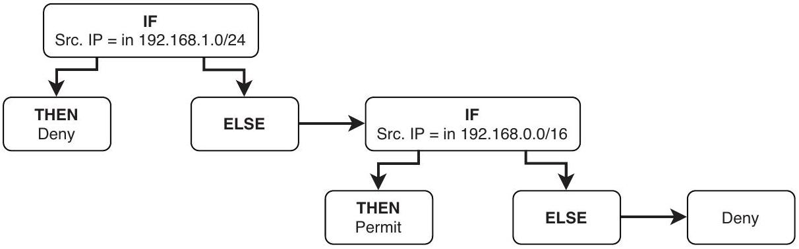
Figure 23.1 How a router evaluates a packet against an ACL. If the source IP matches 192.168.1.0/24, then deny the packet. Otherwise, if the source IP matches 192.168.0.0/16, then permit the packet. Otherwise, deny the packet.

NOTE The final deny action is not defined in either of the ACEs. It is known as the implicit deny; we will cover it in section 23.1.2.

Packets are evaluated against each ACE in order, from top to bottom. If a packet matches an ACE's condition, the router takes the action specified in the ACE-permit or deny-and doesn't process the rest of the ACL; the remaining ACEs will be ignored. For this reason, the order of the ACEs is very important; it influences the overall effect of the ACL.

So what's the effect of our example ACL? Packets from IP addresses in the 192.168.1.0/24 range (the engineering department) will be denied-the router will discard them. Then, packets from other IP addresses in the 192.168.0.0/16 range (the rest of the internal network) will be permitted-the router will forward them. Finally, packets from all other source IP addresses (hosts outside of the internal network) will be denied.

NOTE Even though the 192.168.1.0/24 range is included in the 192.168.0.0/16 range, packets from IP addresses in 192.168.1.0/24 will not be permitted by the second ACE; they will be denied by the first ACE before the router processes the second ACE.

Let's reverse the two ACEs in our example ACL to see how this changes the effect of the ACL. Here is the ACL now:

1 If the source IP address matches 192.168.0.0/16, then permit the packet.
2 If the source IP address matches 192.168.1.0/24, then deny the packet.

Figure 23.2 shows how a router would evaluate a packet from 192.168.1.1 against this ACL; the effect of this ACL would be quite different from the first.

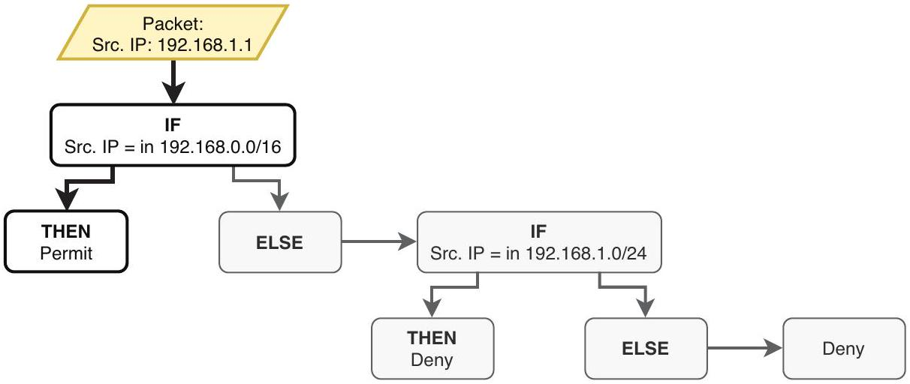
Figure 23.2 A router evaluates a packet from 192.168.1.1 against the ACL. The packet is permitted by the first ACE. It is never evaluated against the second ACE, which would deny the packet.

Even though the second ACE specifies that packets with a source IP in 192.168.1.0/24 (such as 192.168.1.1) should be denied, the packet from 192.168.1.1 is permitted because it matches the first ACE. The overall effect of this ACL is that all packets sourced from IP addresses in 192.168.0.0/16 (including those in 192.168.1.0/24) will be permitted, and all other packets will be denied.

NOTE The second ACE is an example of a shadowed rule-a rule (ACE) that will never be acted upon because it is preceded by a less specific rule covering its matching condition (192.168.0.0/16 includes 192.168.1.0/24). This shouldn't occur in a properly configured ACL; you should always configure more specific rules first.

### 23.1.2 The implicit deny

As mentioned at the beginning of this chapter, a Cisco router will forward any packet with a valid route by default. However, when using ACLs, the behavior changes: any packet not explicitly permitted by the ACL is denied by default.

At the end of every ACL, there is a hidden rule that denies any packets not previously matched by the ACL's configured ACEs; this is called the implicit deny. If a packet doesn't match any explicitly defined conditions, it will be denied by this hidden rule. The implicit deny ensures a secure stance, where only the traffic explicitly permitted by the ACL will be forwarded and everything else will be automatically discarded. This is the example ACL from the previous section, with the implicit deny explicitly stated:

1 If the source IP address matches 192.168.1.0/24, then deny the packet.
2 If the source IP address matches 192.168.0.0/16, then permit the packet.
3 If the source IP address doesn't match any preceding entry, deny the packet.

Figure 23.3 shows an example of a packet being denied by the implicit deny. The packet's source IP is 172.16.1.1, which is outside of the range used for the internal networks of our fictional organization (192.168.0.0/16). Although the ACL doesn't explicitly deny packets from this IP address, the packet is discarded thanks to the ACL's implicit deny rule.

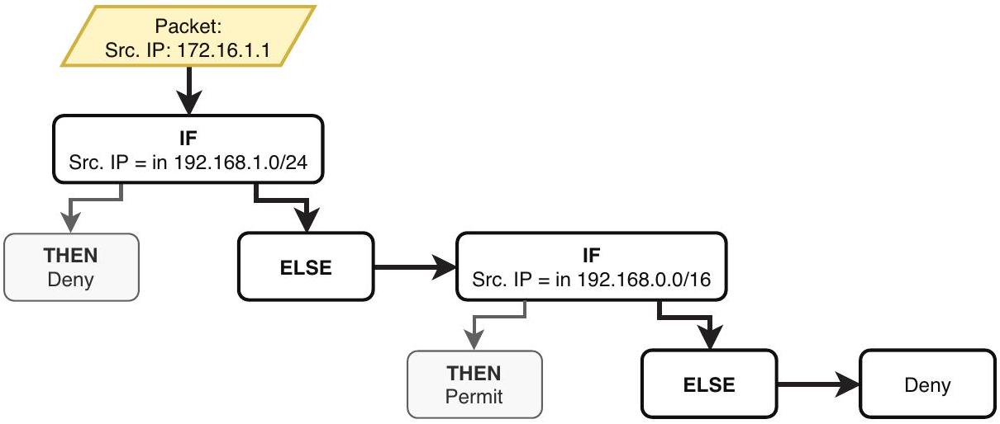
Figure 23.3 A packet is denied by the implicit deny. The packet's source IP (172.16.1.1) doesn't match the first ACE (192.168.1.0/24) or the second ACE (192.168.0.0/16), so it is denied by the implicit deny; the router will discard it.

### 23.1.3 Applying ACLs

The act of creating an ACL doesn't affect the router's behavior on its own; the ACL must be applied to one (or more) of the router's interfaces to take effect. You can apply ACLs in either the inbound or outbound direction (or both), depending on the desired result.

An inbound ACL evaluates packets as they enter the interface the ACL is applied to; every time the router receives a packet on the interface, the router will evaluate the packet against the ACL. If the ACL permits the packet, the router will then continue to process the packet. If the ACL denies the packet, the router will discard it.

Outbound ACLs evaluate packets as they exit the interface; if the router determines that a packet should be forwarded out of the interface, the router will first evaluate the packet against the ACL. If the ACL permits the packet, the router will forward the packet, but if the ACL denies the packet, the router will discard it.

NOTE You may encounter the terms ingress and egress instead of inbound and outbound, respectively-they mean the same thing.

Figure 23.4 demonstrates an outbound ACL filtering packets destined for the 192.168.3.0/24 LAN. The ACL is applied outbound on R1's G0/2 interface and, therefore, filters packets as they are forwarded out of G0/2-as they exit the interface. The ACL does not filter packets that are received by G0/2-packets that enter the interface.

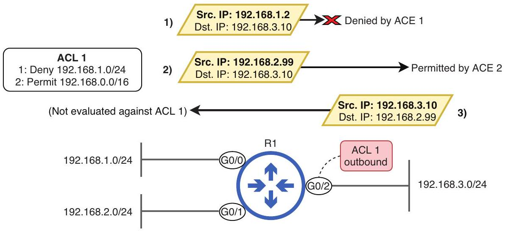
Figure 23.4 An outbound ACL on GO/2 filters packets as they exit the interface. Packet 1 from 192.168.1.2 is denied by ACE 1. Packet 2 from 192.168.2.99 is permitted by ACE 2. Packet 3 from 192.168.3.10 isn't evaluated against the ACL because the packet enters GO/2; the ACL is applied outbound, not inbound.

Figure 23.5 shows the same ACL applied inbound on R1 G0/2. Because the ACL is applied inbound, it is not used to filter packets sent out of G0/2. As a result, the first two packets are forwarded without being evaluated against ACL 1. The third packet, from 192.168.3.10 to 192.168.2.99, is permitted by ACE 2.

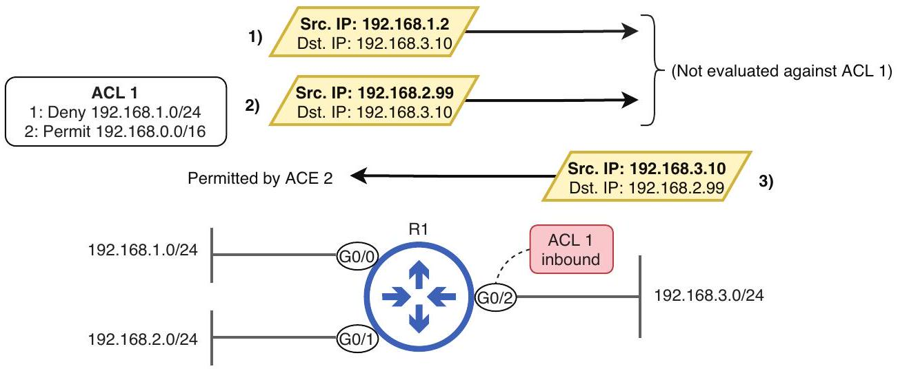
Figure 23.5 An inbound ACL on GO/2 filters packets as they enter the interface. Packets 1 and 2 are forwarded out of G0/2 without being evaluated against ACL 1. Packet 3 is evaluated as it enters G0/2 and is permitted by ACE 2.

The ideal location and direction to apply an ACL depends on the desired result; applying ACL 1 inbound on G0/2, as in figure 23.5, doesn't make sense. The effect of ACL 1 is to deny packets sourced from the 192.168.1.0/24 LAN, but packets sourced from that LAN will never be received by G0/2, to which the 192.168.3.0/24 LAN is connected. In effect, ACL 1 in figure 23.5 is useless.

However, applying ACL 1 outbound on G0/2, as we saw in figure 23.4, does make sense: it blocks packets sourced from 192.168.1.0.24 from reaching destinations in G0/2's connected LAN (192.168.3.0/24); they will be discarded before being forwarded out of the interface.

Standard ACLs should usually be applied outbound on the interface connected to the destination LAN you want to protect; this serves to filter packets destined for that LAN. However, we will see an example in which applying an ACL inbound is useful in section 23.2, allowing you to block unwanted traffic from entering a router and therefore from accessing any of the router's connected LANs.

NOTE Each interface can have a maximum of one ACL applied in each direction: one inbound and one outbound. The same ACL can be applied to multiple interfaces.

### 23.1.4 ACL types

ACLs can be categorized based on two characteristics-their matching parameters and their identification method:

- Matching parameters-Standard ACLs, extended ACLs
- Identification method-Numbered ACLs, named ACLs

Standard ACLs, the topic of this chapter, match packets based on a single parameter: source IP address. Extended ACLs, the topic of the next chapter, allow for more granular packet-filtering; they match packets based on additional parameters, such as source/ destination IP addresses, source/destination port numbers, and others.

Numbered ACLs are identified by a number, and named ACLs are identified by a name. By combining the two methods of categorization, we can identify the four ACL types you should know for the CCNA exam, as shown in table 23.1.

Table 23.1 ACL types
|  | Numbered ACL | Named ACL |
| :--- | :--- | :--- |
| Standard ACL | Standard numbered ACL | Standard named ACL |
| Extended ACL | Extended numbered ACL | Extended named ACL |


EXAM TIP Only IP ACLs-ACLs that filter IP packets-are covered in the CCNA exam. The four ACL types in table 23.1 are all examples of IP ACLs. Specifically, you are expected to know IPv4 ACLs; IPv6 ACLs are not covered in the CCNA exam.

In section 23.2, we'll see how to configure and apply standard numbered and named ACLs in Cisco IOS. Then, in the next chapter, we'll do the same for extended ACLs.

### 23.2 Configuring standard ACLs

Configuring ACLs, whether standard or extended, numbered or named, consists of two steps:

1 Creating the ACLs
2 Applying the ACLs

In this section, we will examine how to create standard numbered and named ACLs and how to apply them to interfaces to filter packets. Figure 23.6 shows the network we will use for this section, as well as the commands we will use to configure and apply the ACLs:

- ACL 1, applied outbound on R2 G0/0, blocks the engineering department (192.168.1.0/24) from accessing Server LAN A, which includes SRV1.
- ACL BLOCK_MARTHA_BOB, applied inbound on R2 G0/2, prevents two users from accessing either of R2's connected LANs.

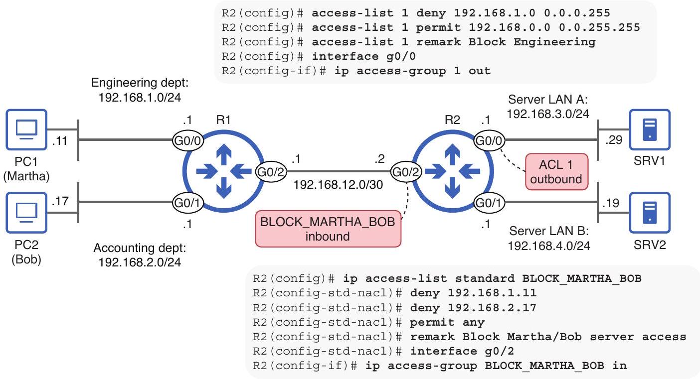
Figure 23.6 Configuring and applying standard numbered and named ACLs to control traffic in the network

EXAM TIP The exam topics list states that you must be able to configure ACLs and verify them with show commands. For practice, I recommend recreating the network shown in figure 23.6 in a lab (i.e., in Cisco Packet Tracer) and following along as you read this section. You can also experiment with configuring and testing other ACLs using the same network.

### 23.2.1 Numbered ACLs

Numbered ACLs, as the name implies, are identified with numbers. However, you can't just pick any number to identify an ACL; there are reserved ranges that can only be used for specific kinds of ACLs. For example:

- Standard IP ACLs-1-99 and 1300-1999
- Extended IP ACLs-100-199 and 2000-2699

The original ranges for standard and extended ACLs are 1-99 and 100-199, respectively. However, those ranges were later expanded to allow for a greater number of ACLs, giving us the 1300-1999 and 2000-2699 ranges. Because we are covering standard ACLs in this chapter, we must pick our ACL numbers from the appropriate ranges.

EXAM TIP Make sure you know the ranges for standard and extended ACLs. As always, I recommend flashcards to help with memorization.

## Creating the ACL

In our example network, R1 and R2 are connected by a point-to-point link, and each router is connected to two LANs: R1 is connected to 192.168.1.0/24 (the engineering department) and 192.168.2.0/24 (the accounting department), and R2 is connected to 192.168.3.0/24 (Server LAN A) and 192.168.4.0/24 (Server LAN B), which contain servers used by the organization. To demonstrate numbered ACL configuration, we will create an ACL that limits access to Server LAN A, blocking the engineering department from accessing the LAN.

When configuring a numbered ACL, you must configure each ACE sequentially, from top to bottom. The order in which you configure the ACEs is very important, as the router will process the ACEs in the order they were configured in when evaluating a packet against the ACL.

The primary command to configure an ACE as part of a standard numbered ACL is access-list number \{permit | deny\} source-ip wildcard-mask. The number argument is the number used to identify the ACL-make sure it's in one of the correct ranges (1-99 or 1300-1999). In the following example, I configure ACL 1 on R2, consisting of two ACEs (and an optional remark, identifying the ACL's purpose):
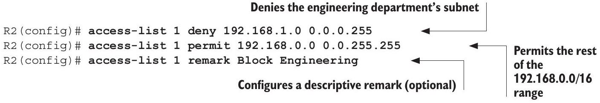

NOTE The remark is optional but can be useful for indicating the ACL's purpose to others who look at the config (or to your future self).

ACLs use wildcard masks, which we covered in chapter 17. For review, wildcard masks indicate bits that must match with a 0 and bits that don't have to match with a 1. In practice, you can generally think of them as inverse netmasks: 0.0.0.255 is the wildcard mask equivalent of 255.255.255.0, a /24 netmask.

NOTE A shortcut to calculating a netmask's equivalent wildcard mask is to subtract each octet of the netmask from 255. The first three octets of a /24 netmask are 255 and $255-255=0$. The final octet is 0 and $255-0=255$. That gives us 0.0.0.255.

After configuring an ACL, you can verify it with either show access-lists (which shows all ACLs) or show ip access-lists (which shows only IP ACLs); since we are configuring only IP ACLs, the output of both commands should be the same. In the following example, I verify ACL 1 on R2:

```
R2# show access-lists
Standard IP access list 1
    10 deny 192.168.1.0, wildcard bits 0.0.0.255
    20 permit 192.168.0.0, wildcard bits 0.0.255.255
```

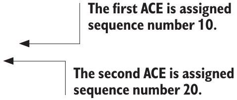

NOTE The remark doesn't appear in show access-lists, only in the config.
Notice the sequence numbers that were automatically added to the beginning of each ACE: 10 and 20. When configuring ACLs, the first ACE is given sequence number 10, and the default increment is 10 . This leaves plenty of room between each ACE, which enables you to configure new ACEs in between existing ACEs if needed. However, that is only possible in named ACL config mode, which we will cover in section 23.2.2.

Applying the ACL
For an ACL to take effect, it must be applied to an interface. The command to do so is ip access-group number $\{$ in $\mid$ out $\}$. In the following example, I apply ACL 1 outbound on R2's G0/0 interface and verify with show ip interface g0/0:

```
R2(config) # interface g0/0
R2(config-if)# ip access-group 1 out
R2(config-if) # do show ip interface g0/0
```

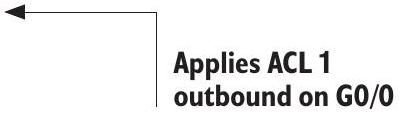

```
GigabitEthernet0/0 is up, line protocol is up (connected)
Internet address is 192.168.3.1/24
. . .
Outgoing access list is 1
Inbound access list is not set
```

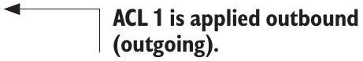

Figure 23.7 shows the effect of this configuration: packets are filtered as R2 forwards them out of G0/0, controlling access to Server LAN A.

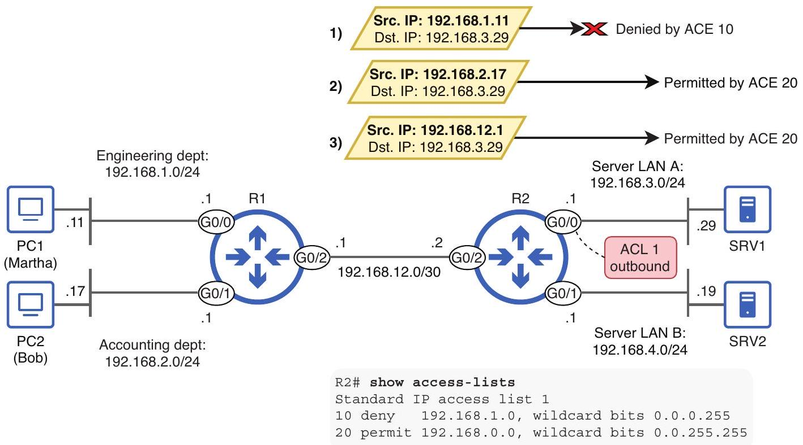
Figure 23.7 Packets filtered by R2's ACL 1, applied outbound on G0/0. Packet 1, from the engineering department, is denied by ACE 10. Packets 2 and 3 are permitted by ACE 20.

The general rule when applying standard ACLs is to apply them as close to the destination as possible; the destination is the LAN you want to protect with the ACL. In this case, the destination is Server LAN A-we want to filter traffic destined for that LAN. By placing the standard ACL outbound on R2 G0/0, you ensure that only traffic destined for G0/0's connected LAN is filtered by the ACL; other traffic is not affected.

### 23.2.2 Named ACLs

Numbered and named ACLs differ not only in how they identify ACLs (with a number or a name) but also in how they are configured. Whereas numbered ACLs are configured entirely from global config mode, named ACLs are first created in global config mode, but each ACE is configured in a separate config mode. You can enter standard named ACL config mode and configure each ACE with the following commands:

- Enter standard named ACL config mode: ip access-list standard name
- Configure ACEs: [seq-num] \{permit | deny\} source-ip wildcard-mask

NOTE In named ACL config mode, you can optionally specify a seq-num (sequence number) to control where the ACE is inserted in the ACL. By default, ACEs will start at sequence 10 and increment by 10 for each new ACE, but this option is useful for inserting new ACEs in between existing ACEs (for example, at sequence number 15).

In our example scenario, we'll block two users from accessing Server LAN A and Server LAN B: Martha from engineering (who uses PC1) and Bob from accounting (who uses PC2). To do so, let's configure three ACEs: one to deny Martha (PC1), one to deny Bob (PC2), and one to allow all other traffic.

The command to configure an ACE is quite flexible when matching a single IP address. For example, here are three ways to configure an ACE denying 8.8.8.8:

- deny 8.8.8.8
- deny 8.8.8.8 0.0.0.0 (a /32 wildcard mask)
- deny host 8.8.8.8

All three of these commands have the same effect, so you can use whichever you prefer-I'll use the first option (replacing 8.8.8.8 with the appropriate addresses). Note that all three methods work for both numbered and named ACLs. In the following example, I configure the ACL on R2 and verify with show access-lists, specifying BLOCK_MARTHA_BOB to view only that ACL:
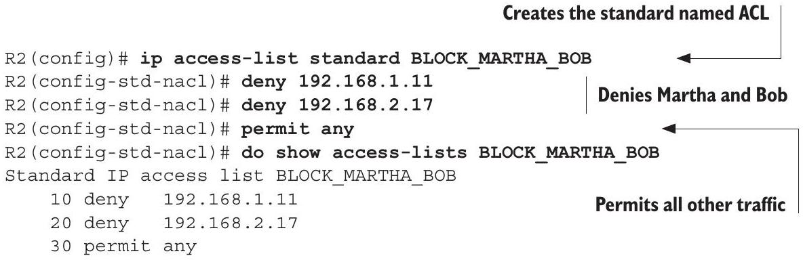

NOTE The any keyword used in the third ACE is a handy way to match all IP addresses; alternatively, you could configure permit 0.0.0.0 255. 255. 255. 255. You can use it in both numbered and named ACLs.

Applying a named ACL is identical to applying a numbered ACL: you can apply it inbound on R2's G0/2 interface with ip access-group BLOCK_MARTHA_BOB in. By
applying the ACL inbound on G0/2, packets are filtered as R2 receives them from R1. This filters packets destined for both destinations that we want to protect: Server LAN A and Server LAN B. Figure 23.8 shows the result of applying our new ACL. Note that ACL 1, which we configured and applied previously, is still in effect.

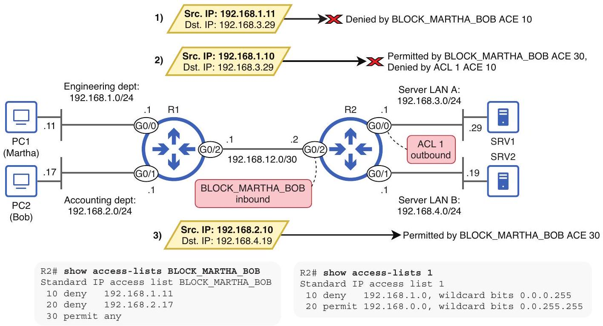
Figure 23.8 Packets filtered by R2's ACLs. Packet 1 is denied by BLOCK_MARTHA_BOB's ACE 10 as it enters R2 G0/2. Packet 2 is permitted by BLOCK_MARTHA_BOB's ACE 30 as it enters R2 G0/2 but denied by ACL 1's ACE 10 as it exits R2 G0/0. Packet 3 is permitted by BLOCK_MARTHA_BOB's ACE 30 as it enters R2 GO/2 and not evaluated against an ACL as it exits R2 G0/1-no ACL is applied to that interface.

In modern versions of Cisco IOS, you can also configure numbered ACLs in named ACL config mode by specifying a number instead of a name after ip access-list standard. In the following example, I configure the previous ACL, using a number instead of a name:

```
R2(config)# ip access-list standard 99
R2(config-std-nacl)# deny 192.168.1.11
R2(config-std-nacl) # deny 192.168.2.17
R2(config-std-nacl)# permit any
```

However, after configuring the ACL, it will appear in the running config as if it was configured using the traditional method. The following example shows ACL 99 in R2's config:

```
R2# show running-config | include access-list 99
access-list 99 deny 192.168.1.11
access-list 99 deny 192.168.2.17
access-list 99 permit any
```

Named ACL config mode provides some benefits, such as the ability to specify sequence numbers and easier ACL editing-we'll cover that in the next chapter. However, keep in mind that ACLs configured using both methods function identically after they have been configured; both are standard ACLs, filtering packets based on source IP addresses.

If you just need to configure a simple ACL with a few ACEs, a numbered ACL configured in global config mode is an easy method. However, in some cases, you may need to take advantage of named ACL config mode's benefits, such as when editing ACLs.

### 23.3 Example scenario

It takes some practice to become comfortable with ACLs. In this section, let's practice by going through a scenario using the same network as in previous examples. We'll start from a blank slate, with no ACLs configured. Figure 23.9 shows the network and the requirements we must fulfill by configuring ACLs.

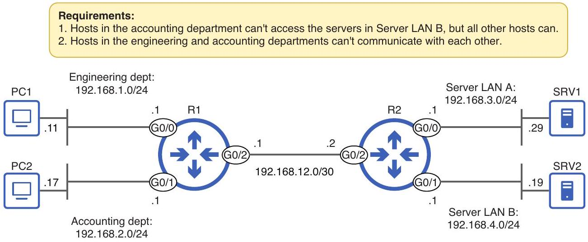
Figure 23.9 Requirements to be fulfilled by configuring standard ACLs

NOTE You can fulfill these requirements using numbered or named ACLs; the destination is more important than how you get there. For demonstration purposes, I will configure both types.

The first requirement states that "Hosts in the accounting department can't access the servers in Server LAN B, but all other hosts can." To fulfill that requirement, I will configure an ACL on R2 that denies the accounting subnet (192.168.2.0/24) but permits all other IP addresses. I will then apply it as close to the destination as possible: outbound on R2's G0/1 interface. In the following example, I configure and apply the ACL:

```
Denies packets sourced from the
accounting department
R2(config) # access-list 10 deny 192.168.2.0 0.0.0.255
R2(config) # access-list 10 permit any
R2(config) # interface g0/1
R2(config-if) # ip access-group 10 out
```

Applies the ACL outbound on G0/1

That ACL fulfills the first requirement. The second requirement states that "Hosts in the engineering and accounting departments can't communicate with each other." This can be achieved by configuring two ACLs on R1:

1 An ACL that denies 192.168.1.0/24 but permits all other IP addresses
2 An ACL that denies 192.168.2.0/24 but permits all other IP addresses

By applying the first ACL outbound on R1 G0/1, packets from hosts in the engineering department will be blocked from reaching destinations in the accounting department. In the following example, I configure and apply the ACL on R1:

```
R1(config)# ip access-list standard BLOCK_ENGINEERING
R1(config-std-nacl) # deny 192.168.1.0 0.0.0.255
R1(config-std-nacl)# permit any
R1(config-std-nacl) # interface g0/1
R1(config-if)# ip access-group BLOCK_ENGINEERING out
```

Applies the ACL outbound on G0/1

Likewise, by applying the second ACL outbound on R1 G0/0, packets sourced from hosts in the accounting department will be blocked from reaching hosts in the engineering department. I configure and apply the second ACL in the following example:

```
R1(config)# ip access-list standard BLOCK_ACCOUNTING
R1(config-std-nacl) # deny 192.168.2.0 0.0.0.255
R1(config-std-nacl)# permit any
R1(config-std-nacl) # interface g0/0
R1(config-if)# ip access-group BLOCK_ACCOUNTING out
```

We have now fulfilled the requirements! For review, figure 23.10 shows the requirements and the ACLs we configured to fulfill those requirements.

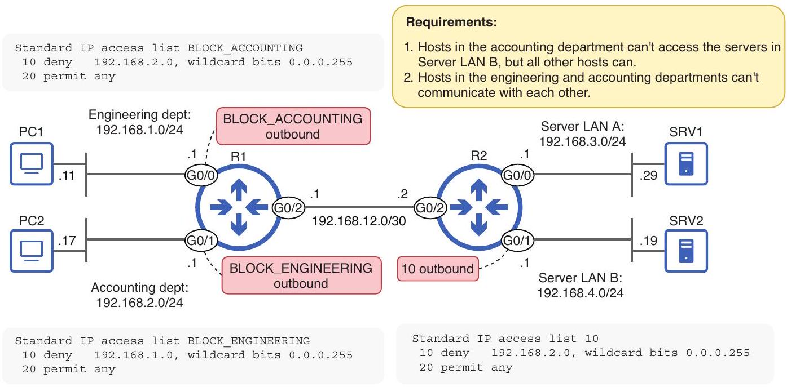
Figure 23.10 Three ACLs configured on R1 and R2 fulfill the requirements. ACL 10, configured on R2, prevents hosts in 192.168.2.0/24 from accessing 192.168.4.0/24. The two named ACLs on R1 prevent the engineering and accounting departments from communicating with each other.

## Summary

- An access control list (ACL) is an ordered list of rules that filters packets as they are received by or forwarded out of an interface.
- ACLs function like if-then-else conditionals in programming, evaluating conditions and taking actions based on the results.
- Each ACL consists of a series of rules called access control entries (ACEs). Each ACE specifies a matching condition and an action (permit or deny).
- Packets that are permitted are forwarded, and packets that are denied are discarded.
- A router evaluating a packet against an ACL will process the ACEs sequentially from top to bottom. Once a matching ACE is found, the appropriate action is taken, and the router doesn't process any remaining ACEs.
- An ACE that will never be acted upon because it is preceded by a less specific rule covering its matching condition is an example of a shadowed rule.
- If a packet doesn't match any of an ACL's explicitly defined conditions, it will be denied by a hidden rule called the implicit deny.
- The act of creating an ACL doesn't affect the router's behavior on its own; the ACL must be applied to one (or more) interfaces to take effect.
- ACLs can be applied to an interface inbound and/or outbound. An inbound ACL filters packets as they are received by the interface. An outbound ACL filters packets as they are forwarded out of the interface.

- Each interface can have a maximum of one ACL applied in each direction: one inbound and one outbound.
- ACLs can be categorized based on their matching parameters: standard ACLs match packets based only on their source IP address. Extended ACLs can match packets based on source/destination IP addresses, source/destination ports, and others.
- ACLs can also be categorized by how they are identified. Numbered ACLs are identified by a number. Named ACLs are identified by a name.
- You should know four ACL types for the CCNA: standard numbered, standard named, extended numbered, and extended named.
- Numbered ACLs are identified by a number that indicates whether the ACL is standard or extended. Standard ACLs use ranges 1-99 and 1300-1999, and extended ACLs use ranges 100-199 and 2000-2699.
- Standard numbered ACLs are configured one ACE at a time in global config mode with the access-list number \{permit | deny\} source-ip wildcard -mask command.
- The order in which you configure ACEs is important. The ACEs will be processed in the order you configure them.
- You can configure an optional descriptive remark with access-list number remark remark. This is useful to clarify the purpose of the ACL.
- You can view all ACLs with show access-lists and all IP ACLs with show ip access-lists.
- Each ACE is automatically assigned a sequence number, starting from 10 and incrementing by 10 for each ACE.
- You can apply an ACL to an interface with ip access-group \{number | name\} \{in | out\}.
- Named ACLs are created in global config mode, but ACEs are configured in a separate config mode.
- You can create a standard named ACL with ip access-group standard name.
- You can configure ACEs in standard named ACL config mode with [seq-num] \{permit | deny\} source-ip wildcard-mask.
- You can match a single IP address in three ways:
    - \{permit | deny\} 8.8.8.8
    - \{permit | deny\} 8.8.8.8 0.0.0.0
    - \{permit | deny\} host 8.8.8.8
- The any keyword can be used to match all IP addresses, such as permit any.
- Numbered ACLs can also be configured in named ACL config mode.
- Named ACL config mode provides some benefits, such as the ability to specify sequence numbers and easier ACL editing. However, both types function identically once they have been configured.
