## Extended access control lists

## This chapter covers

- The various parameters extended access control lists use to match packets
- Configuring extended numbered and named ACLs
- Editing ACLs by deleting and resequencing ACEs

In the previous chapter, we covered standard ACLs, which filter packets based on a single parameter: the source IP address. Although standard ACLs have their uses, they are a blunt instrument; they don't provide precise control over exactly which kinds of traffic are permitted and denied. Extended ACLs, the topic of this chapter, are a more precise tool: they allow you to filter packets based on many more parameters, providing more granular control over traffic.

Although extended ACLs can be more complex than standard ACLs, the good news is that the fundamentals of how ACLs work, as we covered in the previous chapter, remain the same. Like standard ACLs, the access control entries (ACEs) of an extended ACL are processed in order from top to bottom. Extended ACLs include an implicit deny that discards all traffic that isn't matched by an explicitly configured ACE. Extended ACLs also need to be applied to an interface in the inbound and/or outbound directions to take effect.

Given these similarities, in this chapter we will jump right into looking at how to configure extended ACLs-how to configure ACEs that match packets based on their protocol, source/destination IP addresses, and source/destination ports. As in the previous chapter, we will cover CCNA exam topic 5.6: Configure and verify access control lists.

### 24.1 Configuring extended ACLs

Extended ACLs can filter packets based on a variety of different parameters, such as

- The protocol of the packet's payload (TCP, UDP, ICMP, etc.)
- Source and/or destination IP addresses
- Source and/or destination TCP/UDP ports

Configuring extended ACLs is very similar to configuring standard ACLs: you can configure numbered ACLs in global config mode with the access-list command or create and configure ACLs in named ACL config mode with the ip access-list command. However, due to the additional parameters that extended ACLs can use to match packets, there are additional keywords and arguments to familiarize yourself with.

### 24.1.1 Matching protocol, source, and destination

Let's begin by configuring ACLs that match packets based on the encapsulated protocol, source IP address, and destination IP address. The following example shows the command syntax for how to configure a numbered ACL with these parameters:

```
R1(config)# access-list number {permit | deny} protocol source destination
```

NOTE Extended numbered ACLs must use a number from one of the appropriate ranges: 100-199 or 2000-2699.

The following example shows how to configure an extended ACL in named ACL config mode. As with standard ACLs, modern versions of Cisco IOS allow you to configure both extended numbered and extended named ACLs in named ACL config mode:

```
R1(config)# ip access-list extended {name | number}
R1(config-ext-nacl)# [seq-num] {permit | deny} protocol source destination
```

The protocol, source, and destination arguments in these commands are the matching parameters; this is where you specify which packets should match-and be acted upon by-the ACE. For a packet to match an ACE, it must match all of the specified values: the specified protocol, source, and destination. Partial matches don't count! Figure 24.1 gives more detail about which values you can configure for these arguments.

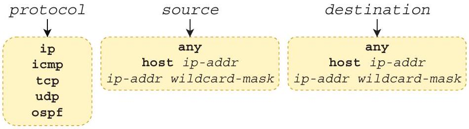
Figure 24.1 Possible matching parameters. The protocol argument specifies the protocol of the packet's payload. The source and destination arguments specify the packet's source and destination IP addresses, respectively.

The protocol argument warrants some additional explanation. You can specify a keyword like icmp, tcp, udp, or ospf to match packets that carry an ICMP, TCP, UDP, or OSPF payload, respectively. Another common keyword is ip, which matches all IPv4 packets; use this if you don't care what the protocol of the encapsulated message is and you want to match only based on source/destination IP addresses.

You should be familiar with the options for the source and destination arguments: we covered them in the previous chapter. By providing an IP address and wildcard mask (ip-addr wildcard-mask), you can specify a range of IP addresses to match. The any keyword matches all possible IP addresses-equivalent to 0.0.0.0 255.255.255.255 (that's a /0 wildcard mask, not a /32 netmask). host ip-addr allows you to specify a single IP address to match-equivalent to an IP address and a /32 wildcard mask ( 0.0 .0 .0 ).

NOTE When configuring a standard ACL, you can match a single IP address by simply specifying the IP address, without the host keyword or a wildcard mask. However, that doesn't work in extended ACLs. To match a single IP address in an extended ACL, for example 8.8.8.8, use host 8.8.8.8 or 8.8.8.8 0.0.0.0.

With these three parameters, you can fulfill more precise security requirements than with standard ACLs-for example, "block all TCP traffic from host A to LAN B" or "permit only ICMP traffic from LAN X to LAN Y." Table 24.1 lists and explains some example ACEs. Compare each ACE and its explanation to familiarize yourself with the logic of ACEs that match packets based on protocol, source, and destination.

Table 24.1 Example ACEs for extended ACLs
| ACE | Explanation |
| :--- | :--- |
| permit ip any any | Permits all IPv4 packets from any source to any destination |
| deny udp 10.0.0.0 0.0.0.255 192.168.1.0 0.0.0.255 | Prevents 10.0.0.0/24 from sending UDP messages to 192.168.1.0/24 |
| deny icmp any 203.0.113.0 0.0.0.255 | Prevents all hosts from sending ICMP messages (i.e., ping) to 203.0.113.0/24 |
| permit ip host 172.16.1.1 any | Permits all IPv4 packets from 172.16.1.1 to any destination |


Now let's examine an entire extended ACL and consider its effect on traffic. Figure 24.2 shows an example network-the same one we looked at in the previous chapter- and an extended named ACL, applied outbound on R1's G0/2 interface.

```
R1(config)# ip access-list extended TEST1
R1(config-ext-nacl)# permit icmp host 192.168.1.11 192.168.3.0 0.0.0.255
R1(config-ext-nacl)# deny icmp 192.168.1.0 0.0.0.255 any
R1(config-ext-nacl)# deny icmp 192.168.2.0 0.0.0.255 any
R1(config-ext-nacl) # deny udp any any
R1(config-ext-nacl) # permit ip any any
R1(config-ext-nacl) # interface g0/2
R1(config-if)# ip access-group TEST1 out
```

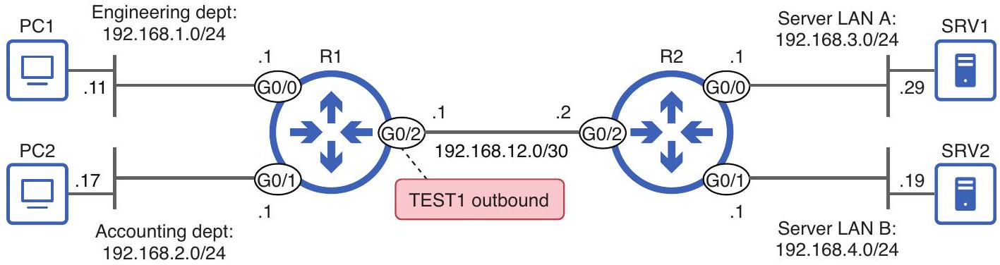
Figure 24.2 Extended ACL TEST1 is applied outbound on R1 G0/2. TEST1 permits ICMP traffic from PC1 to 192.168.3.0/24, denies ICMP traffic from 192.168.1.0/24 and 192.168.2.0/24, denies all UDP traffic, and permits all other IPv4 packets.

TEST1's first ACE permits ICMP traffic from PC1 (192.168.1.11) to hosts in Server LAN A, such as SRV1; this would allow PC1 to test connectivity by pinging SRV1, for example. The second and third ACEs, however, deny all ICMP traffic from hosts in the engineering and accounting subnets (except for PC1's ICMP traffic that is matched by the first ACE).

The fourth ACE denies all UDP traffic, and the final ACE permits all other IPv4 packets. The any any keywords in both ACEs mean they will match packets from any source IP address to any destination IP address. Keep in mind that the ACL is applied outbound on R1's G0/2 interface, so it only filters packets that are to be forwarded out of that interface, toward R2 and its connected LANs.

As covered in chapter 23, standard ACLs should be applied as close to the destination as possible. Standard ACLs don't provide granular control of which packets are filtered, so if you apply them too close to their source, you could inadvertently block legitimate traffic from the source.

Extended ACLs, however, provide more control over exactly which types of packets are permitted and which should be denied. For that reason, it's more efficient to apply extended ACLs as close to the source as possible. A properly configured extended ACL will only block the intended traffic, and applying the ACL close to the source is more
efficient, because it prevents packets from traveling all the way across the network just to be discarded right before reaching their destination.

In this example, we are filtering packets from the engineering and accounting departments' LANs to Server LAN A and Server LAN B. Applying TEST1 outbound on R1 G0/2 filters packets from both source LANs early in their path to either of the destination LANs.

NOTE We will practice configuring and applying extended ACLs from a set of requirements in section 24.2. For now, our focus is on understanding how they work.

### 24.1.2 Matching TCP/UDP port numbers

Matching packets based on protocol, source, and destination provides much more granular control than standard ACLs provide. However, by adding TCP and UDP port numbers to the mix, we can achieve even more control over which packets are permitted or denied. Figure 24.3 shows how to configure an ACE that includes ports in its matching parameters; pay particular attention to the keyword values that you can provide for the operator arguments.

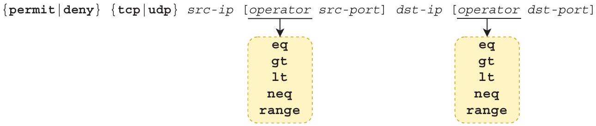
Figure 24.3 Configuring an ACE that matches packets based on protocol (TCP/UDP), source/ destination IP addresses, and source/destination ports

Here is an example and explanation of each of the keywords you can provide for the operator arguments:

- eq 80 = Equal to 80
- gt 80 = Greater than 80 (but not including 80)
- It 80 = Less than 80 (but not including 80)
- neq 80 = Not equal to 80 (anything other than 80)
- range 80100 = From 80 to 100 (including 80 and 100)

Table 24.2 lists some example ACEs that include the source and/or destination port numbers in their list of matching parameters. Once again, compare each ACE and its explanation to familiarize yourself with their logic. Make sure you can identify each part of each ACE: the protocol, source IP addresses, source ports, destination IP
addresses, and destination ports. Some ACEs specify both source and destination port numbers, but others specify only one. If you don't specify a source port number, all source port numbers will count as a match, and the same applies for the destination port number.

Table 24.2 Example ACEs including port numbers
| ACE | Explanation |
| :--- | :--- |
| permit tcp 10.0.0.0 0.0.0.255 any eq 443 | Allows hosts in 10.0.0.0/24 to access all web servers using HTTPS (port 443) |
| deny udp any gt 50000 host 203.0.113.1 | Prevents all hosts with a UDP source port greater than 50000 from accessing 203.0.113.1 |
| permit tcp 10.0.0.0 0.0.0.255 gt 9999 host 203.0.113.1 neq 23 | Allows hosts in 10.0.0.0/24 with a TCP source port greater than 9,999 to access all TCP ports on 203.0.113.1 except port 23 |
| deny tcp any lt 1024 any gt 1023 | Denies all TCP messages with a source port lower than 1,024 and a destination port greater than 1,023 |


NOTE Remember that a packet must match all parameters in the ACE to be considered a match. If the ACE specifies the protocol, source IP, source port, destination IP, and destination port, all five parameters must match.

Figure 24.4 shows each of the ACEs from table 24.1 and identifies each part: protocol, source IP, source port, destination IP, and destination port.

1) permit $\frac{\mathrm{tcp}}{\text { protocol }} \frac{10.0 .0 .00 .0 .0 .255}{\text { src. IP }} \frac{\text { any }}{\text { dst. IP }} \frac{\mathrm{eq} 443}{\text { dst. port }}$
2) deny $\frac{\text { udp }}{\text { protocol }} \frac{\text { any }}{\text { src. IP }} \frac{\text { gt } 50000}{\text { src. port }} \frac{\text { host 203.0.113.1 }}{\text { dst. IP }}$
3) permit $\underset{\text { protocol }}{\frac{\mathrm{tcp}}{10.0 .0 .0 ~ 0.0 .0 .255}} \underset{\text { src. IP }}{\underline{\mathrm{gt} 9999}} \frac{\text { host 203.0.113.1 }}{\text { src. port }} \frac{\text { neq } 23}{\text { dst. port }}$
4) deny $\frac{\mathrm{tcp}}{\text { protocol }} \frac{\text { any }}{\text { src. IP }} \frac{\mathrm{lt} 1024}{\text { src. port }} \frac{\text { any }}{\text { dst. IP }} \frac{\mathrm{gt} 1023}{\text { dst. port }}$

Figure 24.4 ACEs that match packets based on protocol, source IP, source port, destination IP, and destination port. Not all ACEs specify both the source and destination ports.

Now let's examine an extended ACL that uses ACEs like these, filtering packets based on source and/or destination ports. Examine the ACL shown in figure 24.5-applied outbound on R1 G0/2-and consider which traffic is allowed and which isn't.

```
R1(config)# ip access-list extended TEST2
R1(config-ext-nacl)# permit tcp 192.168.1.0 0.0.0.255 192.168.3.0 0.0.0.255 eq 443
R1(config-ext-nacl) # deny tcp any any eq 443
R1(config-ext-nacl) # permit udp any host 192.168.4.19 eq 123
R1(config-ext-nacl) # deny udp any any eq 123
R1(config-ext-nacl) # permit ip any any
R1(config-ext-nacl) # interface g0/2
R1(config-if)# ip access-group TEST2 out
```

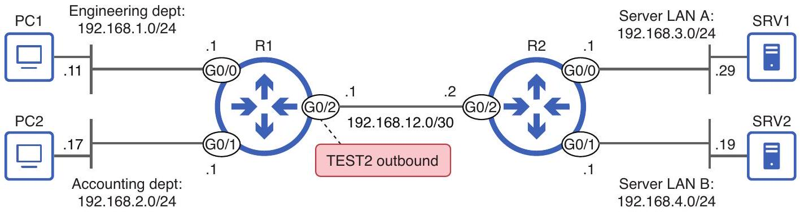
Figure 24.5 Extended ACL TEST2 is applied outbound on R1 G0/2. TEST2 permits HTTPS traffic from the engineering department to Server LAN A, denies all other HTTPS traffic, permits all NTP traffic to SRV2, denies all other NTP traffic, and permits all other IPv4 packets.

In the following example, I configure the ACL shown in figure 24.5 and confirm with show access-lists. Notice that UDP port 123, as specified in the third and fourth ACEs, is replaced by the keyword ntp, because NTP uses UDP port 123. You can configure some well-known port numbers by specifying either the port number itself or the equivalent keyword. Whichever you configure, the keyword (i.e., ntp) will appear in the output of show commands. However, as the example also demonstrates, not all common protocols have such a keyword; TCP port 443 isn't replaced by https:

```
R1(config)# ip access-list extended TEST2
R1(config-ext-nacl) # permit tcp 192.168.1.0 0.0.0.255 192.168.3.0 0.0.0.255 eq 443
R1(config-ext-nacl) # deny tcp any any eq 443
R1(config-ext-nacl) # permit udp any host 192.168.4.19 eq 123
R1(config-ext-nacl) # deny udp any any eq 123
R1(config-ext-nacl) # permit ip any any
R1(config-ext-nacl) # do show access-lists
Extended IP access list TEST2
    10 permit tcp 192.168.1.0 0.0.0.255 192.168.3.0 0.0.0.255 eq 443
    20 deny tcp 192.168.2.0 0.0.0.255 any eq 443
    30 permit udp any host 192.168.4.19 eq ntp
    40 deny udp any any eq ntp
```

TCP port 443, used by HTTPS, is not replaced by the keyword https.

UDP port 123, used by NTP, is replaced by the keyword ntp.

```
    50 permit ip any any
```

Because ACLs in CCNA exam questions may use keywords instead of port numbers, I recommend getting familiar with a few common ones, such as the following:

- TCP 20 (FTP data) = ftp-data
- TCP 21 (FTP control) = ftp

- TCP 23 (Telnet) = telnet
- TCP/UDP 53 (DNS) = domain
- UDP 67 (DHCP server) = bootps
- UDP 68 (DHCP client) = bootpc
- UDP 69 (TFTP) = tftp
- TCP 80 (HTTP) = www

EXAM TIP Make sure you know the Layer 4 protocol and port numbers of common protocols, such as those listed here. I listed them in chapter 22 and will mention them as we cover each protocol in volume 2 of this book, but it's worth emphasizing the importance of knowing them.

### 24.2 Example security requirements

Now that we've examined extended ACLs and their components, let's practice configuring them to fulfill a set of requirements as defined by the security team of our fictional organization. Extended ACLs add a few layers of complexity on top of standard ACLs, so this practice is especially important. Figure 24.6 shows the scenario, with three requirements we must fulfill by configuring extended ACLs.

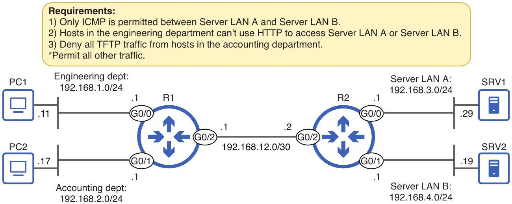
Figure 24.6 Requirements to be fulfilled by configuring extended ACLs

The first requirement states that "Only ICMP is permitted between Server LAN A and Server LAN B." I will accomplish this with two ACLs:

- An ACL that permits ICMP traffic from Server LAN A to Server LAN B and denies other traffic between them but allows all traffic to other destinations
- An ACL that permits ICMP traffic from Server LAN B to Server LAN A and denies other traffic between them but allows all traffic to other destinations

In the following example, I configure the first ACL and apply it inbound on R2 G0/0; this filters packets sent from hosts in Server LAN A:
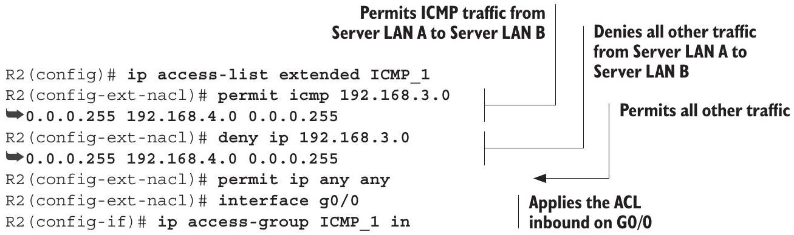
That fulfills one half of the first requirement. In the next example, I configure the second ACL, this time applying it inbound on R2 G0/1:
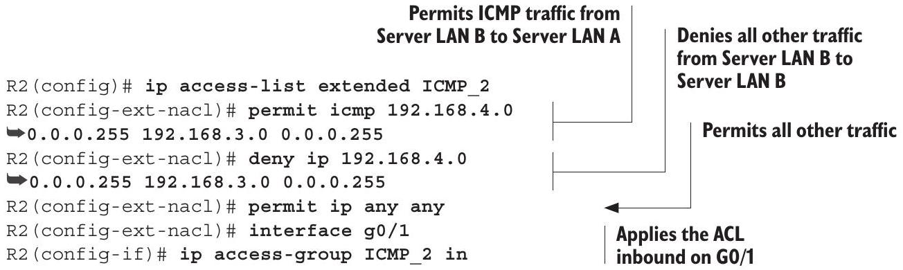
The effect of these two ACLs is that hosts in Server LAN A and Server LAN B will only be able to communicate with each other using ICMP-ping, for example. However, other traffic is permitted by the permit ip any any ACE at the end of both ACLs.

The second requirement in our scenario states that "Hosts in the engineering department can't use HTTP to access Server LAN A or Server LAN B." This can be accomplished with one ACL applied inbound on R1's G0/0 interface. The ACL should deny TCP messages sourced from hosts in Server LAN A and destined for port 80 on hosts in Server LAN A or Server LAN B. In the following example, I configure that ACL:
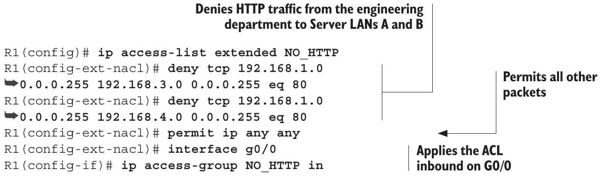

NOTE When a host uses HTTP to access resources on another host (a server), it uses port 80 as the destination port, not the source port. Therefore, to filter HTTP traffic from a client to a server, make sure to match based on the destination port-not the source port. This applies to other protocols too; the following example filters TFTP traffic by matching destination port 69.

The final requirement states, "Deny all TFTP traffic from hosts in the accounting department." We can fulfill this requirement with a simple two-ACE ACL: one ACE to deny TFTP traffic and one to permit all other traffic. In the following example, I configure that ACL and apply it inbound on R1 G0/1. For demonstration purposes, I'll configure this one as a numbered ACL from global config mode:
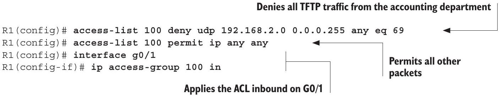

We have now fulfilled all three requirements. For review, figure 24.7 shows the requirements again and the four ACLs we configured to fulfill them.,

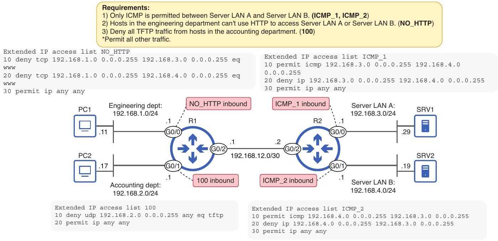
Figure 24.7 Four ACLs configured on R1 and R2 fulfill the requirements. ACLs ICMP_1 and ICMP_2 fulfill requirement 1, ACL NO_HTTP fulfills requirement 2, and ACL 100 fulfills requirement 3.

### 24.3 Editing ACLs

The order in which you configure an ACL's ACEs is very important, because it determines the order the router will process them when evaluating a packet against the ACL. However, even if you configure the ACEs in the proper order, in some cases you may have to edit the ACL later. For example, you may have to delete an ACE or insert a new ACE in between existing ones. In this section, we'll examine how to do that.

NOTE Everything in this section applies to both standard and extended ACLs.
To keep the ACLs simple, I'll use standard ACLs.

### 24.3.1 Deleting ACEs

Negating a command in Cisco IOS is as simple as inserting the no keyword in front of it. However, let's see what happens when we use that method to delete an ACE from a numbered ACL:

```
R1(config)# do show access-lists
Standard IP access list 1
    10 deny 192.168.1.1
    20 deny 192.168.2.1
    30 deny 192.168.3.0, wildcard bits 0.0.0.255
    40 permit any
R1(config)# no access-list 1 deny 192.168.3.0 0.0.0.255
R1(config)# do show access-lists
R1(config) #
```

No output is shown.
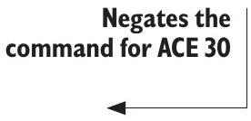

After using no to negate the command for ACE 30, ACL 1 is no longer shown in the output of show access-lists-the entire ACL was deleted! When editing a numbered ACL from global config mode, you can't delete individual ACEs; you can only delete the entire ACL. Fortunately, named ACL mode fixes this limitation.

Deleting an ACE in named ACL config mode is easy: just use no followed by the sequence number. This works for both numbered and named ACLs; just remember to do it from named ACL config mode. In the following example, I delete ACE 30 from the same ACL as before, without deleting the entire ACL this time:

```
R1(config)# do show access-lists
Standard IP access list 1
    10 deny 192.168.1.1
    20 deny 192.168.2.1
    30 deny 192.168.3.0, wildcard bits 0.0.0.255
    40 permit any
```

R1(config)\# ip access-list standard 1
R1(config-std-nacl)\# no 30
R1(config-std-nacl)\# do show access-lists
Standard IP access list 1

Enters named ACL config mode and deletes ACE 30
| 10 | deny | 192.168.1.1 |
| :--- | :--- | :--- |
| 20 | deny | 192.168.2.1 |
| 40 | permit | any |


ACE 30 was removed from ACL1.

Named ACL config mode also provides the benefit of allowing you to insert new ACEs in between existing ones by specifying a sequence number at the beginning of the configuration command. In the following example, I insert a new ACE 30 to the same ACL as before in place of the ACE 30 that I just deleted:

```
R1(config-std-nacl) # 30 deny 192.168.4.0 0.0.0.255
R1(config-std-nacl)# do show access-lists
Standard IP access list 1
    10 deny 192.168.1.1
    20 deny 192.168.2.1
    30 deny 192.168.4.0, wildcard bits 0.0.0.255
    40 permit any
```


### 24.3.2 Resequencing ACEs

Named ACL config mode allows you to configure new ACEs between existing ones by specifying each ACE's sequence number, but what if there is no space between ACEs? By default, sequence numbers begin at 10 and increment by 10, so this problem is rare. However, if you do run out of space between ACEs, Cisco IOS provides a handy command that will automatically adjust the sequence numbers. The syntax of the command is ip access-list resequence \{name|number\} starting-seq -num increment. Figure 24.8 shows an example command and explains the final two arguments (starting-seq-num and increment):

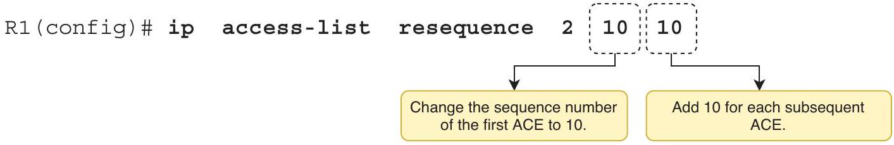
Figure 24.8 The ip access-list resequence command. The starting-seq-num argument specifies the new sequence number of the ACL's first ACE, and the increment argument specifies the increment for each subsequent ACE.

In the following example, I view an example ACL (ACL 2) that has four ACEs with sequence numbers 10, 18, 19, and 20. I then use ip access-list resequence to adjust the sequence numbers. After issuing the command, there is room between the ACEs to insert new ones as needed:

```
R1(config)# do show access-lists
Standard IP access list 2
    10 deny 192.168.1.0 0.0.0.255
    18 deny 192.168.3.0 0.0.0.255
    19 deny 192.168.4.0 0.0.0.255
    20 permit any
R1(config)# ip access-list resequence 2 10 10
R1(config) # do show access-lists
Standard IP access list 2
```

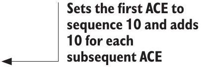

```
10 deny 192.168.1.0 0.0.0.255
20 deny 192.168.3.0 0.0.0.255
30 deny 192.168.4.0 0.0.0.255
40 permit any
```


## Summary

- Extended ACLs can filter packets based on parameters such as the protocol of the packet's payload (TCP, UDP, ICMP, OSPF, etc.), source/destination IP addresses, and source/destination ports.
- Extended ACL configuration is similar to standard ACL configuration. You can configure extended ACLs in global config mode with the access-list command (numbered only) or in named ACL config mode with ip access-list.
- You can configure an extended numbered ACL with access-list number \{permit | deny\} protocol source destination. Extended numbered ACLs must use a number from ranges 100-199 or 2000-2699.
- You can configure an extended ACL in named ACL config mode with ip access-list extended \{name | number\}. From there, configure each ACE with [seq-num] \{permit | deny\} protocol source destination.
- For the protocol argument, you can specify a keyword like icmp, tcp, udp, or ospf to match packets that carry the specified protocol in its payload. Or you can specify ip to match all IPv4 packets, regardless of the encapsulated protocol.
- The options for the source and destination arguments are any (to match any IP address), host ip-addr (to match only the specified IP address), and ip-addr wildcard-mask (to match the specified range of IP addresses).
- Whereas standard ACLs should be applied as close to the destination as possible, extended ACLs should be applied as close to the source as possible.
- When tcp or udp are specified for the protocol argument, you can also specify TCP/UDP port number(s) as matching conditions.
- The command syntax to configure an ACE that specifies a port number is \{permit|deny\} \{tcp|udp\} src-ip [operator src-port] dst-ip [operator dst-port].
- The options for the operator argument are eq (equal to X), gt (greater than X), lt (lower than X), neq (not equal to X), and range (from X to Y). Some examples are
    - eq 80 = Equal to 80
    - gt 80 = Greater than 80 (but not including 80)
    - It 80 = Less than 80 (but not including 80)
    - neq 80 = Not equal to 80 (anything other than 80)
    - range 80100 = From 80 to 100 (including 80 and 100)

- An ACE can specify only the source port, only the destination port, both, or neither. If you don't specify the source/destination ports as matching conditions, all source/destination ports will match.
- A packet must match all of an ACE's conditions to be considered a match. If the ACE specifies the protocol, source IP, source port, destination IP, and destination port, all five parameters must match.
- When specifying port numbers in an ACE, some common protocols have keywords that can be used instead of numbers. Some examples are
    - TCP 20 (FTP data) = ftp-data
    - TCP 21 (FTP control) = ftp
    - TCP 23 (Telnet) = telnet
    - TCP/UDP 53 (DNS) = domain
    - UDP 67 (DHCP server) = bootps
    - UDP 68 (DHCP client) = bootpc
    - UDP 69 (TFTP) = tftp
    - TCP 80 (HTTP) = www
- When a host uses a protocol to access resources on another host (a server), it uses the protocol's port number as the destination port, not the source port. To filter that traffic, make sure to filter based on the destination port, not the source port.
- When editing a numbered ACL from global config mode, you can't delete individual ACEs; you can only delete the entire ACL.
- Deleting an ACE in named ACL config mode is easy: use no followed by the sequence number, such as no 30 to delete the ACE with sequence number 30.
- Named ACL config mode also allows you to insert new ACEs in between existing ones by specifying a sequence number at the beginning of the command.
- You can renumber an ACL's ACEs with the ip access-list resequence \{name | number\} starting-seq-num increment command. starting-seq -num specifies the sequence number of the first ACE, and increment specifies the increment for each additional ACE. For example, ip access-list resequence 155 will set ACL 1's first ACE to sequence number 5, the second to 10, the third to 15, etc.
