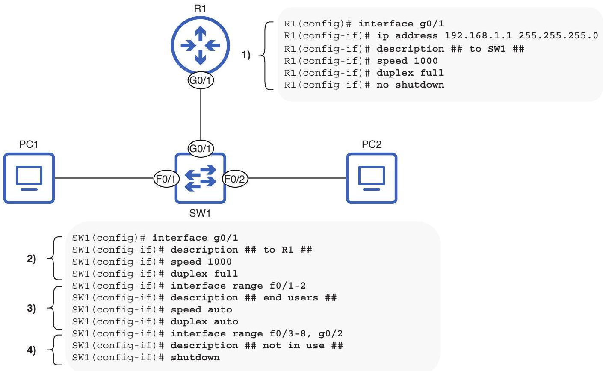
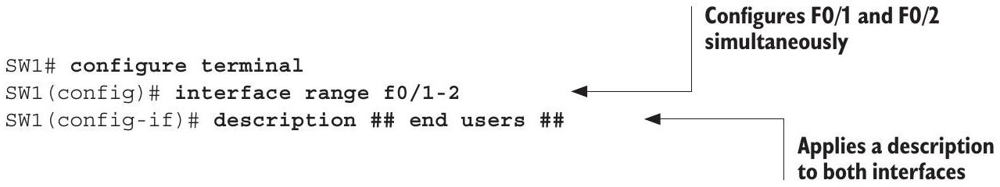
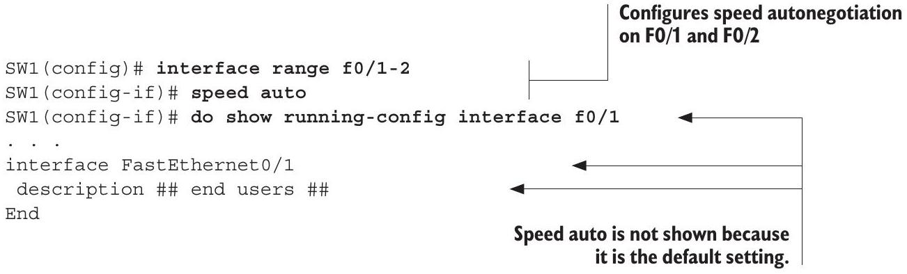
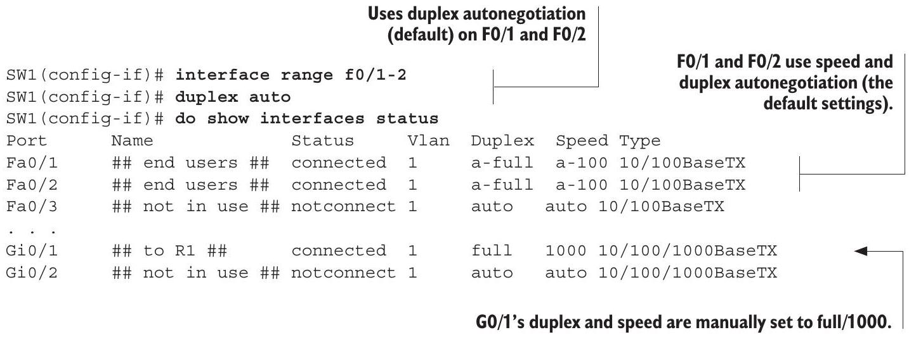
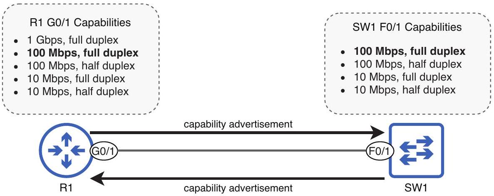
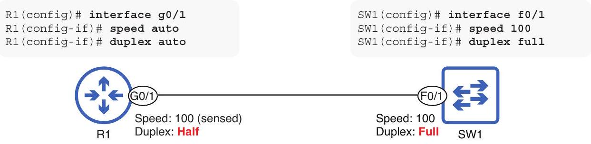
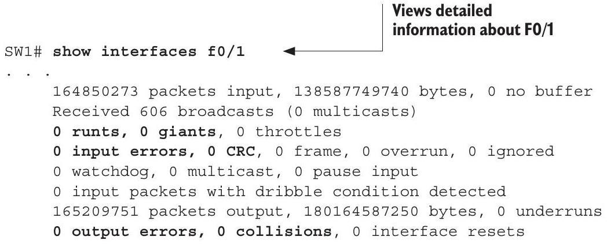
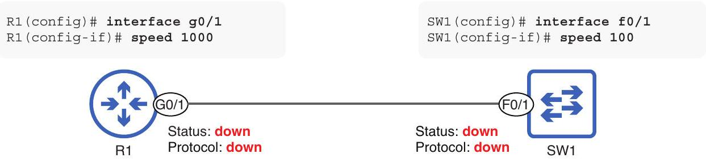

## Router and switch interfaces

## This chapter covers

- How to configure interfaces and verify their status
- Interface speed and duplex settings
- Using autonegotiation to automatically determine an interface's speed and duplex
- Errors that can occur when sending and receiving messages over a network

In chapter 7, we looked at how to configure IP addresses on and enable router interfaces. In this chapter, we will dig deeper into the topic of interfaces and how they operate. Whereas the previous chapter covered how to configure IP addresses on interfaces (a Layer 3 concept), this chapter will focus primarily on Layer 1 concepts, such as how to configure the speed at which an interface can send and receive data. Specifically, we will cover the following CCNA exam topics:

> [!translation] 逐句繁體中文翻譯
> 在 chapter 7，我們看過如何在 router interfaces 上 configure IP addresses 並啟用它們。  
> 在本章中，我們會更深入探討 interfaces 以及它們如何運作。  
> 前一章涵蓋如何在 interfaces 上 configure IP addresses，這是 Layer 3 concept；本章則主要聚焦 Layer 1 concepts，例如如何 configure interface 傳送與接收 data 的 speed。  
> 具體來說，我們會涵蓋下列 CCNA exam topics：

- 1.3.b Connections (Ethernet shared media and point-to-point)
- 1.4 Identify interface and cable issues (collisions, errors, mismatch duplex, and/or speed)

In previous chapters, I have used the terms port and interface. The exact definitions of these terms depend on who you ask; some say a port is a Layer 2 entity that forwards frames within a LAN (switches have ports), and an interface is a Layer 3 entity that forwards packets between LANs (routers have interfaces). Another definition is that a port is the physical connector on a device that you plug a cable into, and an interface is the representation of that port within the software (hence, most Cisco IOS commands use the term interface rather than port).

> [!translation] 逐句繁體中文翻譯
> 在先前章節中，我使用過 port 與 interface 這兩個 terms。  
> 這些 terms 的精確定義取決於你問誰；有些人說 port 是在 LAN 內 forward frames 的 Layer 2 entity（switches 有 ports），而 interface 是在 LANs 之間 forward packets 的 Layer 3 entity（routers 有 interfaces）。  
> 另一種定義是，port 是 device 上插入 cable 的 physical connector，而 interface 是 software 中對該 port 的表示（因此，大多數 Cisco IOS commands 使用 interface 這個 term，而不是 port）。

In reality, these terms are often used interchangeably-even Cisco's documentation isn't consistent regarding these terms. In this book, I will generally use the term port to refer to a physical connector on a device and interface when talking about configurations, except in situations where one term is generally accepted as the standard over the other (in which case I will point that out).

> [!translation] 逐句繁體中文翻譯
> 實際上，這些 terms 常被互換使用；甚至 Cisco documentation 對這些 terms 的使用也不一致。  
> 在本書中，我通常會用 port 指 device 上的 physical connector，而談到 configurations 時使用 interface。  
> 但如果某些情境中其中一個 term 通常被接受為標準用法，我會特別指出。

### 8.1 Configuring interfaces

In this section, we will look at how to configure three aspects of an interface: description, speed, and duplex. Figure 8.1 shows how to configure these settings on Cisco routers and switches running Cisco IOS.

> [!translation] 逐句繁體中文翻譯
> 在本節中，我們會看如何 configure interface 的三個面向：description、speed 與 duplex。  
> Figure 8.1 顯示如何在執行 Cisco IOS 的 Cisco routers 與 switches 上 configure 這些 settings。


Figure 8.1 Interface configurations on R1 and SW1: (1) configuring R1's G0/1 interface with an IP address, description, and manual speed and duplex settings; (2) configuring SW1's G0/1 interface with a description, and manual speed and duplex settings; (3) configuring SW1's connections to end-user devices (PCs) using autonegotiation; (4) disabling SW1's unused interfaces.

Before we examine the configurations in figure 8.1 in detail, there are a couple of things worth mentioning that illustrate some differences between routers and switches. First, notice that I configured an IP address on R1's G0/1 interface but not on SW1's interfaces; this is because switch interfaces don't need IP addresses to perform their role of forwarding frames within a LAN. Switches are not Layer 3 aware; they only use Layer 2 information (MAC addresses) to decide how to forward frames.

> [!translation] 逐句繁體中文翻譯
> 在詳細檢視 figure 8.1 的 configurations 之前，有幾件值得一提的事，可以說明 routers 與 switches 之間的一些差異。  
> 首先，請注意我在 R1 的 G0/1 interface 上 configured IP address，但沒有在 SW1 的 interfaces 上 configure IP addresses。  
> 這是因為 switch interfaces 不需要 IP addresses，就能執行在 LAN 內 forwarding frames 的角色。  
> Switches 不具備 Layer 3 awareness；它們只使用 Layer 2 information（MAC addresses）決定如何 forward frames。

The second point is that I used no shutdown on R1's G0/1 interface to enable it but not on SW1's G0/1, F0/1, or F0/2 interfaces. That is because, unlike router interfaces, which are disabled by default, switch interfaces are enabled by default.

> [!translation] 逐句繁體中文翻譯
> 第二點是，我在 R1 的 G0/1 interface 上使用 no shutdown 來啟用它，但沒有在 SW1 的 G0/1、F0/1 或 F0/2 interfaces 上這樣做。  
> 這是因為 router interfaces 預設為 disabled，而 switch interfaces 不同，它們預設為 enabled。

EXAM TIP In figure 8.1, I used shutdown to disable SW1's unused ports. This is considered a security best practice.

> [!translation] 逐句繁體中文翻譯
> 考試提示：在 figure 8.1 中，我使用 shutdown 停用 SW1 未使用的 ports。  
> 這被視為 security best practice。

Switch interfaces are enabled by default to allow switches to operate in a plug-and-play manner; this means that to use the switch, you simply need to connect devices to it-no configuration is required. However, although a switch does not require configuration to perform its most basic function of forwarding frames, most enterprise networks will require configurations on switches to use more advanced features (which we will cover in both volumes of this book).

> [!translation] 逐句繁體中文翻譯
> Switch interfaces 預設為 enabled，是為了讓 switches 能以 plug-and-play 方式運作。  
> 這表示若要使用 switch，只需要將 devices 連上去，不需要任何 configuration。  
> 不過，雖然 switch 不需要 configuration 就能執行最基本的 forwarding frames 功能，大多數 enterprise networks 仍會要求在 switches 上進行 configurations，以使用更進階的 features（本書兩冊都會涵蓋）。

NOTE A switch that is designed to be used in a plug-and-play manner is called an unmanaged switch. Unmanaged switches are inexpensive and are sometimes used in very small networks. The CCNA focuses on managed switches, which allow you to configure more advanced features.

> [!translation] 逐句繁體中文翻譯
> 注意：設計成以 plug-and-play 方式使用的 switch 稱為 unmanaged switch。  
> Unmanaged switches 價格便宜，有時會用於非常小的 networks。  
> CCNA 聚焦於 managed switches，這類 switches 允許你 configure 更進階的 features。

### 8.1.1 Interface descriptions

An interface description is a simple string of text that you can configure to describe or name an interface. A common use is to indicate what device is connected to the interface. The command to configure an interface's description is description description, where description is a string of text such as "connected to R1's G0/1 interface." The following example shows how I configured the descriptions of SW1's F0/1 and F0/2 interfaces. F0/1 and F0/2 are connected to end-user devices (PCs), so I configured their descriptions as \#\# end users \#\#:


> [!translation] 逐句繁體中文翻譯
> Interface description 是一段簡單的 text string，可用來 describe 或 name 一個 interface。  
> 常見用途是指出哪個 device 連接到該 interface。  
> Configure interface description 的 command 是 description description，其中 description 是一段 text string，例如「connected to R1's G0/1 interface」。  
> 下列範例顯示我如何 configure SW1 的 F0/1 與 F0/2 interfaces 的 descriptions。  
> F0/1 與 F0/2 連接到 end-user devices（PCs），所以我將它們的 descriptions configured 為 \#\# end users \#\#：

NOTE The two hash symbols (\#\#) at the beginning and end of the description are not necessary. I use them in my interface descriptions to help them stand out when viewing them in the CLI.

> [!translation] 逐句繁體中文翻譯
> 注意：description 開頭與結尾的兩個 hash symbols（\#\#）不是必要的。  
> 我在 interface descriptions 中使用它們，是為了在 CLI 中查看時讓 descriptions 更醒目。

Notice that I used the interface range $\mathrm{f} 0 / 1-2$ command to configure SW1's F0/1 and F0/2 interfaces at the same time; interface range can be a big timesaver when configuring multiple interfaces! The command to configure a range of interfaces is interface range type slot/port-port. Let me explain each of those arguments in the command:

> [!translation] 逐句繁體中文翻譯
> 請注意，我使用 interface range $\mathrm{f} 0 / 1-2$ command 同時 configure SW1 的 F0/1 與 F0/2 interfaces。  
> 當 configure multiple interfaces 時，interface range 可以大幅節省時間！  
> Configure 一個 interface range 的 command 是 interface range type slot/port-port。  
> 讓我說明 command 中每個 argument：

- type means Ethernet, FastEthernet, GigabitEthernet, etc.
- slot is the first number in the interface name.
- port is the second number in the interface name.

NOTE Another example from figure 8.1 is interface range $\mathrm{f} 0 / 3-8, \mathrm{~g} 0 / 2$. This configures F0/3, F0/4, F0/5, F0/6, F0/7, F0/8, and G0/2. To include interfaces of a different type in the same interface range command, you must separate the interface names with a comma.

> [!translation] 逐句繁體中文翻譯
> 注意：figure 8.1 中另一個例子是 interface range $\mathrm{f} 0 / 3-8, \mathrm{~g} 0 / 2$。  
> 這會 configure F0/3、F0/4、F0/5、F0/6、F0/7、F0/8 與 G0/2。  
> 若要在同一個 interface range command 中包含不同 type 的 interfaces，必須用 comma 分隔 interface names。

Interface descriptions are optional, but I highly recommend configuring them; interface descriptions that are consistently configured and updated as needed make it much easier to identify the purpose of each interface when viewing the configurations at a later date.

> [!translation] 逐句繁體中文翻譯
> Interface descriptions 是 optional，但我強烈建議 configure 它們。  
> 如果 interface descriptions 被一致地 configured，並在需要時更新，之後查看 configurations 時會更容易識別每個 interface 的用途。

To view interface descriptions on a router or switch, you can use the show interfaces description command. The following example shows the output of that command after configuring SW1's interface descriptions (some output is omitted for the sake of space). Note that the command also lists the Layer 1 status (Status) and Layer 2 status (Protocol) of each interface:

> [!translation] 逐句繁體中文翻譯
> 若要在 router 或 switch 上查看 interface descriptions，可以使用 show interfaces description command。  
> 下列範例顯示在 configure SW1 的 interface descriptions 後，該 command 的 output（為節省空間省略部分 output）。  
> 請注意，該 command 也列出每個 interface 的 Layer 1 status（Status）與 Layer 2 status（Protocol）：

```
Views a list of interfaces
    and their descriptions
SW1# show interfaces description
Interface Status Protocol Description
Fa0/1 up up ## end users ##
Fa0/2 up up ## end users ##
Fa0/3 down down ## not in use ##
. . .
Gio/1 up up ## to R1 ##
Gi0/2 down down ## not in use ##
```

Another command that can be used to view interface descriptions is show interfaces status. However, this command only works on switches, not on routers. We will use this command in the next few sections as well, as it also shows information about the interface speed and duplex. The following example shows the output of this command (the descriptions are displayed in the Name column):

> [!translation] 逐句繁體中文翻譯
> 另一個可用來查看 interface descriptions 的 command 是 show interfaces status。  
> 不過，這個 command 只適用於 switches，不適用於 routers。  
> 接下來幾節也會使用這個 command，因為它也會顯示 interface speed 與 duplex 的資訊。  
> 下列範例顯示此 command 的 output（descriptions 顯示在 Name column 中）：

```
SW1# show interfaces status
```

| Port | Name | Status | Vlan | Duplex | Speed | Type |
| :--- | :--- | :--- | :--- | :--- | :--- | :--- |
| Fa0/1 | \#\# end users \#\# | connected | 1 | a-full | a-100 | 10/100BaseTX |
| Fa0/2 | \#\# end users \#\# | connected | 1 | a-full | a-100 | 10/100BaseTX |
| Fa0/3 | \#\# not in use \#\# | motconnect | 1 | auto | auto | 10/100BaseTX |
| . . . |  |  |  |  |  |  |
| Gi0/1 | \#\# to R1 \#\# | connected | 1 | a-full | a-1000 | 10/100/1000BaseTX |
| Gi0/2 | \#\# not in use \#\# | notconnect | 1 | auto | auto | 10/100/1000BaseTX |

### 8.1.2 Interface speed

An interface's speed is the maximum rate at which it can send and receive traffic, measured in bits per second. Most interfaces support multiple speeds-for example, most FastEthernet interfaces support speeds of both 10 and 100 Mbps-in which case they can be called 10/100 interfaces. Likewise, most GigabitEthernet interfaces support speeds of 10, 100, and 1,000 Mbps (1 Gbps) and are therefore called 10/100/1000 interfaces. Ideally, an interface will operate at its maximum speed, but if connected to a device that only supports slower speeds, it's important that an interface can match the speed of the other device.

> [!translation] 逐句繁體中文翻譯
> Interface 的 speed 是它能 send 與 receive traffic 的 maximum rate，以 bits per second 衡量。  
> 多數 interfaces 支援 multiple speeds；例如，多數 FastEthernet interfaces 同時支援 10 與 100 Mbps，因此可稱為 10/100 interfaces。  
> 同樣地，多數 GigabitEthernet interfaces 支援 10、100 與 1,000 Mbps（1 Gbps），因此稱為 10/100/1000 interfaces。  
> 理想情況下，interface 會以 maximum speed 運作；但如果連接到只支援較慢 speeds 的 device，interface 能 match 另一個 device 的 speed 就很重要。

The speed at which an interface operates can be manually configured or automatically determined by the device using a process called autonegotiation, in which the connected devices communicate with each other to determine at what speed they should operate. Cisco IOS devices use autonegotiation by default, and in most cases, you can leave autonegotiation enabled. However, there are cases where you should manually configure an interface's speed, such as when the neighboring device does not use autonegotiation. The command to manually configure an interface's speed is speed \{speed | auto\}, where speed is specified in megabits per second.

> [!translation] 逐句繁體中文翻譯
> Interface operation speed 可以 manually configured，也可以由 device 透過稱為 autonegotiation 的 process 自動決定。  
> 在 autonegotiation 中，connected devices 會彼此溝通，以決定它們應以什麼 speed 運作。  
> Cisco IOS devices 預設使用 autonegotiation，而且多數情況下可以保持 autonegotiation enabled。  
> 不過，有些情況應該 manually configure interface speed，例如 neighboring device 不使用 autonegotiation 時。  
> Manually configure interface speed 的 command 是 speed \{speed | auto\}，其中 speed 以 megabits per second 指定。

NOTE When writing the syntax of a command, options in curly braces are a mandatory choice. In the speed command, you must either specify the speed value or use auto to enable autonegotiation.

> [!translation] 逐句繁體中文翻譯
> 注意：撰寫 command syntax 時，curly braces 中的 options 代表 mandatory choice。  
> 在 speed command 中，你必須指定 speed value，或使用 auto 來啟用 autonegotiation。

In the following example, I use context-sensitive help to show the available options when configuring the speed of SW1's G0/1 interface: 10, 100, 1000, and auto. I then manually configure the speed at 1 Gbps (1,000 Mbps) and use show running-config interface g0/1 to verify the interface's configuration:

> [!translation] 逐句繁體中文翻譯
> 在下列範例中，我使用 context-sensitive help 顯示 configure SW1 G0/1 interface speed 時可用的 options：10、100、1000 與 auto。  
> 接著我 manually configure speed 為 1 Gbps（1,000 Mbps），並使用 show running-config interface g0/1 驗證 interface configuration：

```
SW1(config)# interface g0/1
SW1(config-if) # speed ?
    10 Force 10 Mbps operation
    100 Force 100 Mbps operation
    1000 Force 1000 Mbps operation
    auto Enable AUTO speed configuration
SW1(config-if) # speed 1000
```

```
SW1(config-if)# do show running-config interface g0/1
. . .
interface GigabitEthernet0/1
    description ## to R1 ##
    speed 1000
End
```

NOTE You can use the show running-config interface interface-name command to view the active configurations for a specific interface. To view the active configurations for all interfaces, use show running-config | section interface.

> [!translation] 逐句繁體中文翻譯
> 注意：你可以使用 show running-config interface interface-name command 查看 specific interface 的 active configurations。  
> 若要查看所有 interfaces 的 active configurations，請使用 show running-config | section interface。

In the next example, I configure speed auto on SW1's F0/1 and F0/2 interfaces and then view F0/1's configuration. However, speed auto is not shown because it is the default setting. To avoid clutter in a device's configuration files, many default settings are hidden:


> [!translation] 逐句繁體中文翻譯
> 在下一個範例中，我在 SW1 的 F0/1 與 F0/2 interfaces 上 configure speed auto，然後查看 F0/1 的 configuration。  
> 不過，speed auto 沒有顯示，因為它是 default setting。  
> 為了避免 device configuration files 變得雜亂，許多 default settings 會被隱藏：

NOTE In figure 8.1 and the previous example, I configured speed auto, but because that is the default setting, it is not actually necessary to issue that command.

> [!translation] 逐句繁體中文翻譯
> 注意：在 figure 8.1 與前一個範例中，我 configured speed auto，但因為這是 default setting，實際上不需要輸入該 command。

### 8.1.3 Interface duplex

An interface's duplex setting refers to whether it is able to send and receive data at the same time or not. There are two types of duplex:

> [!translation] 逐句繁體中文翻譯
> Interface 的 duplex setting 指的是它是否能同時 send 與 receive data。  
> Duplex 有兩種類型：

- Half duplex-The interface can send and receive data but not at the same time.
- Full duplex-The interface can send and receive data at the same time.

NOTE The opposite of duplex is simplex, which is one-way communication. The communication from a keyboard to a computer is an example of simplex communication; the keyboard sends data to the computer, but the computer does not send data to the keyboard.

> [!translation] 逐句繁體中文翻譯
> 注意：duplex 的相反是 simplex，也就是 one-way communication。  
> Keyboard 到 computer 的 communication 就是 simplex communication 的例子；keyboard 傳送 data 給 computer，但 computer 不會傳送 data 給 keyboard。

An example of half-duplex communication is an IEEE 802.11 wireless LAN (Wi-Fi). Because devices connected to a wireless LAN share the same physical medium (radio frequency), devices must wait their turn to communicate; they cannot send and receive data at the same time. We will focus on wireless LANs in part 4 of volume 2 of this book, but for now we will focus on wired LANs using Ethernet.

> [!translation] 逐句繁體中文翻譯
> Half-duplex communication 的例子是 IEEE 802.11 wireless LAN（Wi-Fi）。  
> 因為 connected to wireless LAN 的 devices 共用相同 physical medium（radio frequency），devices 必須輪流 communicate；它們不能同時 send 與 receive data。  
> 我們會在 volume 2 part 4 聚焦 wireless LANs，但目前先聚焦使用 Ethernet 的 wired LANs。

An example of full-duplex communication is a wired Ethernet LAN using a switch (or switches). Devices connected to a switch are able to send and receive traffic at the same time, which allows much greater performance compared to half duplex. However, devices connected to a wired LAN weren't always able to operate in full duplex. Before switches, devices called hubs were used to connect devices in a LAN, and devices connected to a hub had to operate in half-duplex mode (these days, hubs are almost never used).

> [!translation] 逐句繁體中文翻譯
> Full-duplex communication 的例子是使用 switch（或 switches）的 wired Ethernet LAN。  
> Connected to switch 的 devices 能同時 send 與 receive traffic，這比 half duplex 提供更高的 performance。  
> 不過，connected to wired LAN 的 devices 並非一直都能以 full duplex 運作。  
> 在 switches 之前，稱為 hubs 的 devices 被用來連接 LAN 中的 devices，而 connected to hub 的 devices 必須以 half-duplex mode 運作（如今 hubs 幾乎不再使用）。

## Ethernet hubs

To understand duplex, let's examine one of the precursors to the Ethernet switch: the Ethernet hub. The basic role of a hub is the same as a switch: to connect hosts in a LAN. Switches use Layer 2 information (MAC addresses) to forward frames to the appropriate destination (or flood them as necessary). Hubs, on the other hand, aren't Layer 2 aware; when bits of data are received on one port, they simply repeat those bits out of all other ports. This means that all devices in the LAN receive every frame sent in the LAN; each device then examines the destination MAC address of the frame to determine whether it should keep or discard the frame. Hubs are considered Layer 1 devices; they receive and repeat electrical signals but don't examine those signals to make forwarding decisions.

> [!translation] 逐句繁體中文翻譯
> 若要理解 duplex，我們來檢視 Ethernet switch 的前身之一：Ethernet hub。  
> Hub 的基本角色與 switch 相同：連接 LAN 中的 hosts。  
> Switches 使用 Layer 2 information（MAC addresses）將 frames forward 到適當 destination，或在必要時 flood frames。  
> 另一方面，hubs 不具備 Layer 2 awareness；當某個 port 收到 data bits 時，它們只是將那些 bits 從所有其他 ports repeat 出去。  
> 這表示 LAN 中所有 devices 都會收到 LAN 中送出的每個 frame；接著每個 device 會檢查 frame 的 destination MAC address，以決定應該保留或丟棄該 frame。  
> Hubs 被視為 Layer 1 devices；它們接收並 repeat electrical signals，但不檢查那些 signals 來做 forwarding decisions。

A major downside of hubs is that they do not have memory to store frames before flooding them. Therefore, if two devices connected to a hub attempt to send frames at the same time, the hub will attempt to flood both frames at the same time, resulting in a garbled mess rather than two coherent messages; this is called a collision, and all devices connected to a hub are said to be in the same collision domain. Only one device in a collision domain can send traffic at a time without causing collisions. Thus, devices connected to a hub must operate in half duplex, not full duplex.

> [!translation] 逐句繁體中文翻譯
> Hubs 的主要缺點是它們沒有 memory 可在 flooding frames 前先儲存 frames。  
> 因此，如果 connected to hub 的兩個 devices 試圖同時 send frames，hub 會試圖同時 flood 兩個 frames，結果會是一團混亂，而不是兩個 coherent messages。  
> 這稱為 collision，而 connected to hub 的所有 devices 都被稱為位於同一個 collision domain。  
> 在 collision domain 中，同一時間只有一個 device 能 send traffic 而不造成 collisions。  
> 因此，connected to hub 的 devices 必須 operate in half duplex，而不是 full duplex。

## Collision domains

A collision occurs when two messages are sent simultaneously over a shared medium and then collide, resulting in an incoherent signal-like if two people talk at the same time, making you unable to understand either of them. A collision domain is a network segment in which simultaneous transmission will result in collisions. As mentioned previously, all hosts connected to a hub are in the same collision domain; this means that only one can transmit at a time. While one host is transmitting, the others can only receive data-they have to wait their turn to transmit. Figure 8.2 shows what happens when two hosts connected to a hub attempt to transmit at the same time.

> [!translation] 逐句繁體中文翻譯
> 當兩個 messages 同時透過 shared medium 傳送並彼此 collide 時，就會發生 collision，產生 incoherent signal；就像兩個人同時說話，讓你無法理解任一方。  
> Collision domain 是一個 network segment，其中 simultaneous transmission 會造成 collisions。  
> 如前所述，所有 connected to hub 的 hosts 都在同一個 collision domain；這表示同一時間只有一台可以 transmit。  
> 當一台 host 正在 transmitting 時，其他 hosts 只能 receive data；它們必須等待輪到自己 transmit。  
> Figure 8.2 顯示兩台 connected to hub 的 hosts 試圖同時 transmit 時會發生什麼事。


Figure 8.2 Four PCs are connected to a hub, and two attempt to transmit at the same time, resulting in collisions. All four PCs are in the same collision domain. (1) PC2 sends a frame addressed to PC1's MAC address, and PC4 sends a frame addressed to PC3's MAC address. (2) The hub attempts to flood both frames at the same time, resulting in collisions. Neither PC1 nor PC3 receive their respective frames intact.

Unlike hosts connected to a hub, each host connected to a switch is in its own collision domain; switches are able to store frames in memory and forward (or flood) them one after the other, avoiding collisions. This means that hosts connected to a switch can operate in full-duplex mode; all devices in the LAN can send and receive traffic at the same time, with no worry of messages colliding.

> [!translation] 逐句繁體中文翻譯
> 不同於 connected to hub 的 hosts，每個 connected to switch 的 host 都位於自己的 collision domain。  
> Switches 能將 frames 儲存在 memory 中，並一個接一個 forward（或 flood）它們，以避免 collisions。  
> 這表示 connected to switch 的 hosts 可以 operate in full-duplex mode；LAN 中所有 devices 都能同時 send 與 receive traffic，不必擔心 messages collision。

NOTE Exam topic 1.3.b states, "Connections (Ethernet shared media and pointto-point)." All devices connected to a hub are connected to a shared medium; each device has to share the medium and wait its turn to transmit. Connections to a switch are considered Ethernet point-to-point connections-connections between only two devices: the switch and its connected device. Devices connected to a switch do not have to share the medium-they do not have to wait their turn to transmit.

> [!translation] 逐句繁體中文翻譯
> 注意：Exam topic 1.3.b 寫著「Connections（Ethernet shared media and point-to-point）」。  
> 所有 connected to hub 的 devices 都連接到 shared medium；每個 device 必須 share medium，並等待輪到自己 transmit。  
> 到 switch 的 connections 被視為 Ethernet point-to-point connections，也就是只有兩個 devices 之間的 connections：switch 與它所連接的 device。  
> Connected to switch 的 devices 不必 share medium，也不必等待輪到自己 transmit。

Collisions should not occur in a switched LAN; if collisions occur, it is an indicator of a problem in the network (we will cover some possible problems in section 8.3). Figure 8.3 shows how a switch is able to flood frames one after the other without causing collisions.

> [!translation] 逐句繁體中文翻譯
> 在 switched LAN 中不應該發生 collisions。  
> 如果發生 collisions，表示 network 中存在問題（section 8.3 會介紹一些可能問題）。  
> Figure 8.3 顯示 switch 如何能一個接一個 flood frames，而不造成 collisions。


Figure 8.3 Four PCs are connected to a switch, each in its own collision domain. (1) PC2 and PC4 each send a broadcast frame at the same time. (2) The switch floods the frames, but it does not flood PC2's frame to PC1 or PC3; it buffers the frame in memory. (3) The switch floods PC2's frame to PC1 and PC3 after it has finished flooding PC4's frame.

## Carrier-sense multiple access with collision detection

To facilitate communications over a shared medium (a LAN using a hub), devices use a method called carrier-sense multiple access with collision detection (CSMA/CD). Let's examine each part of that title:

> [!translation] 逐句繁體中文翻譯
> 為了協助 shared medium（使用 hub 的 LAN）上的 communications，devices 會使用一種稱為 carrier-sense multiple access with collision detection（CSMA/CD）的方法。  
> 我們來檢視這個名稱的每個部分：

- Carrier-sense means that devices will attempt to sense whether the medium is in use (by "listening" for electrical signals) before transmitting a message.
- Multiple access means that a shared medium is used (i.e., accessed by multiple devices).
- Collision detection means that if a collision occurs, devices connected to the medium will detect it (and send a signal to notify other devices of the collision).

CSMA/CD helps devices connected to a hub avoid collisions and deal with collisions when they inevitably happen; interfaces operating in half-duplex mode must use CSMA/CD. The CSMA/CD process is as follows:

> [!translation] 逐句繁體中文翻譯
> CSMA/CD 幫助 connected to hub 的 devices 避免 collisions，並在 collisions 不可避免發生時加以處理。  
> Operating in half-duplex mode 的 interfaces 必須使用 CSMA/CD。  
> CSMA/CD process 如下：

1 Before sending a frame, devices wait until they detect that other devices are not sending.
2 When a collision occurs, devices that detect the collision will send a jamming signal to inform the other devices of the collision.
3 Each device then waits a random period of time before sending frames again.
4 The process repeats.

EXAM TIP Hubs are rarely used in modern networks, having been almost entirely replaced by switches. However, collisions, collision domains, and CSMA/CD are foundational networking concepts that may appear on the CCNA exam.

> [!translation] 逐句繁體中文翻譯
> 考試提示：Hubs 在 modern networks 中很少使用，幾乎已完全被 switches 取代。  
> 不過，collisions、collision domains 與 CSMA/CD 是 foundational networking concepts，可能出現在 CCNA exam 中。

## Configuring an interface duplex

Like an interface's speed, its duplex can also be manually configured or automatically determined using autonegotiation. The command to configure an interface's duplex is duplex \{auto | full | half\}, and the default setting is auto (which uses autonegotiation). Let's configure SW1's interface duplex settings, as in the example in figure 8.1. In the following example, I first confirm the current status with show interfaces

> [!translation] 逐句繁體中文翻譯
> 和 interface speed 一樣，interface duplex 也可以 manually configured，或使用 autonegotiation 自動決定。  
> Configure interface duplex 的 command 是 duplex \{auto | full | half\}，default setting 是 auto（使用 autonegotiation）。  
> 接著依 figure 8.1 的範例 configure SW1 的 interface duplex settings。  
> 在下列範例中，我先用 show interfaces 確認目前 status。

```
status:
SW1# show interfaces status
```

| Port | Name | Vlan | Duplex | Speed Type |
| :--- | :--- | :--- | :--- | :--- |
| Fa0/1 | \#\# end users \#\# | 1 | a-full | a-100 10/100BaseTX |
| Fa0/2 | \#\# end users \#\# | 1 | a-full | a-100 10/100BaseTX |
| Fa0/3 | \#\# not in use \#\# | 1 | auto | auto 10/100BaseTX |
| . . . |  |  |  |  |
| Gi0/1 | \#\# to R1 \#\# | 1 | a-full | 1000 10/100/1000BaseTX |
| Gi0/2 | \#\# not in use \#\# | 1 | auto | auto 10/100/1000BaseTX |

The prefix a - indicates autonegotiation.

> [!translation] 逐句繁體中文翻譯
> Prefix a- 表示 autonegotiation。

Note that the current duplex state for SW1's active interfaces (F0/1, F0/2, and G0/1) is a-full. This means that they are operating in full duplex, which was decided using autonegotiation. Interfaces that are not active (i.e., not connected to another device) are auto, meaning autonegotiation is enabled, but SW1 hasn't decided if those interfaces will operate in half or full duplex (because they aren't connected to another device yet).

> [!translation] 逐句繁體中文翻譯
> 請注意，SW1 active interfaces（F0/1、F0/2 與 G0/1）目前的 duplex state 是 a-full。  
> 這表示它們正在 operate in full duplex，而這是使用 autonegotiation 決定的。  
> 尚未 active 的 interfaces（也就是未 connected to another device）是 auto，表示 autonegotiation 已 enabled，但 SW1 尚未決定這些 interfaces 會 operate in half 或 full duplex，因為它們還沒連到另一個 device。

NOTE In the Speed column of the previous example, F0/1 and F0/2 show a-100, meaning autonegotiation was used to decide on a speed of 100 Mbps. G0/1 simply displays 1000, because I manually configured a speed of 1,000 Mbps.

> [!translation] 逐句繁體中文翻譯
> 注意：在前一個範例的 Speed column 中，F0/1 與 F0/2 顯示 a-100，表示 autonegotiation 被用來決定 speed 為 100 Mbps。  
> G0/1 則只顯示 1000，因為我 manually configured speed 為 1,000 Mbps。

Next, let's configure the duplex of SW1's interfaces according to figure 8.1. In the following example, I do so and then confirm with show interfaces status:

> [!translation] 逐句繁體中文翻譯
> 接著，依 figure 8.1 configure SW1 interfaces 的 duplex。  
> 在下列範例中，我完成設定後再用 show interfaces status 確認：

```
SW1# configure terminal
SW1(config)# interface g0/1
SW1(config-if) # duplex full
```



Notice that G0/1's duplex has changed from a-full to full; this means the interface was manually configured to operate in full duplex. The output for F0/1 and F0/2, however, does not change. As with speed auto, duplex auto is the default setting, so it is not necessary to issue the command to enable autonegotiation-I include it in the example to demonstrate that.

> [!translation] 逐句繁體中文翻譯
> 請注意，G0/1 的 duplex 已從 a-full 變成 full；這表示該 interface 被 manually configured 為 operate in full duplex。  
> 不過，F0/1 與 F0/2 的 output 沒有改變。  
> 和 speed auto 一樣，duplex auto 是 default setting，所以不需要輸入 command 來啟用 autonegotiation；我把它放進範例只是為了示範。

NOTE Although duplex is an important concept to understand, in modern wired networks, you can expect all devices to operate in full duplex; there's no reason to use half duplex. However, wireless LANs operate in half duplex, so we will return to the topic of half duplex when we cover wireless LANs in part 4 of volume 2 of this book.

> [!translation] 逐句繁體中文翻譯
> 注意：雖然 duplex 是重要 concept，但在 modern wired networks 中，你可以預期所有 devices 都 operate in full duplex；沒有理由使用 half duplex。  
> 不過，wireless LANs operate in half duplex，所以在本書 volume 2 part 4 介紹 wireless LANs 時，我們會回到 half duplex 這個 topic。

### 8.2 Autonegotiation

In section 8.1, we learned that autonegotiation can be used to automatically determine the speed and duplex at which an interface operates without manual configuration. In most cases, you can leave autonegotiation enabled without any issues, although some engineers prefer to manually configure speed and duplex for connections between network infrastructure devices (such as between routers and switches). The reason for this is that manually configuring the speed and duplex settings means that there is one less thing to potentially not work properly (autonegotiation) and cause problems. However, manual configuration does include the potential for human error, and it is extremely rare for autonegotiation to malfunction, so this is not a hard-and-fast rule.

> [!translation] 逐句繁體中文翻譯
> 在 section 8.1，我們學到 autonegotiation 可用來在沒有 manual configuration 的情況下，自動決定 interface operation 的 speed 與 duplex。  
> 多數情況下，可以保持 autonegotiation enabled 而不會有問題。  
> 不過，有些 engineers 偏好為 network infrastructure devices 之間的 connections（例如 routers 與 switches 之間）manually configure speed 與 duplex。  
> 原因是 manually configuring speed 與 duplex settings 代表少了一個可能無法正常運作並造成問題的東西，也就是 autonegotiation。  
> 然而，manual configuration 也包含 human error 的可能性，而且 autonegotiation malfunction 極為罕見，所以這不是硬性規則。

In either case, it is best to leave autonegotiation enabled for connections to end devices such as PCs. Different end devices might support different speeds, and manually configuring speed settings for each PC (or other end device) in a network is often not feasible.

> [!translation] 逐句繁體中文翻譯
> 無論如何，對於連到 PCs 等 end devices 的 connections，最好保持 autonegotiation enabled。  
> 不同 end devices 可能支援不同 speeds，而在 network 中為每台 PC（或其他 end device）manually configure speed settings 通常並不可行。

In the autonegotiation process, each device advertises its capabilities to its neighbor, and the two agree upon the best operational mode supported by both neighbors. Table 8.1 lists some operational modes in order of priority-greater speeds are prioritized over lesser speeds, and full duplex is prioritized over half duplex (as you would probably expect).

> [!translation] 逐句繁體中文翻譯
> 在 autonegotiation process 中，每個 device 會向 neighbor advertise 自己的 capabilities，接著兩者同意使用雙方都支援的 best operational mode。  
> Table 8.1 依 priority 列出一些 operational modes；較高 speeds 優先於較低 speeds，full duplex 優先於 half duplex，這應該符合你的預期。

Table 8.1 Operational modes
| Priority | Operational mode |
| :--- | :--- |
| 1 | 10 Gbps, full duplex |
| 2 | 1 Gbps, full duplex |
| 3 | 100 Mbps, full duplex |
| 4 | 100 Mbps, half duplex |
| 5 | 10 Mbps, full duplex |
| 6 | 10 Mbps, half duplex |

> [!translation] 逐句繁體中文翻譯
> Table 8.1：Operational modes。  
> Priority 越高，代表 autonegotiation 越優先選用該 operational mode。  
> 表中列出從 10 Gbps full duplex 到 10 Mbps half duplex 的優先順序。


NOTE Table 8.1 only includes full duplex for 10 and 1 Gbps. 1 Gbps/half duplex is possible, but devices that support it are very rare; you can't configure that combination on a Cisco device, for example. Speeds of 10 Gbps or greater do not support half duplex, only full duplex.

> [!translation] 逐句繁體中文翻譯
> 注意：Table 8.1 對 10 與 1 Gbps 只列出 full duplex。  
> 1 Gbps/half duplex 是可能的，但支援它的 devices 非常罕見；例如，你無法在 Cisco device 上 configure 這種組合。  
> 10 Gbps 或更高 speeds 不支援 half duplex，只支援 full duplex。

Figure 8.4 shows an example of autonegotiation between a router and a switch. After each device advertises its capabilities, it chooses the best mode shared by both devices (100 Mbps, full duplex).

> [!translation] 逐句繁體中文翻譯
> Figure 8.4 顯示 router 與 switch 之間 autonegotiation 的例子。  
> 每個 device advertise 自己的 capabilities 後，會選擇兩台 devices 共同支援的 best mode（100 Mbps，full duplex）。


Figure 8.4 A router and a switch advertise their speed and duplex capabilities to each other. The best option supported by both R1 and SW1 is 100 Mbps/full duplex, as highlighted in bold. Although R1 G0/1 is capable of $\mathbf{1} \mathbf{~ G b p s} /$ full duplex, it will operate at $\mathbf{1 0 0 ~ M b p s} /$ full duplex to match SW1 F0/1.

Figure 8.4 demonstrates what happens when both devices are using autonegotiation, but what if speed and duplex are manually configured on one end of the connection and autonegotiation is used on the other end? In such a situation, the device with autonegotiation enabled will behave as follows:

> [!translation] 逐句繁體中文翻譯
> Figure 8.4 示範兩台 devices 都使用 autonegotiation 時會發生什麼事。  
> 但如果 connection 的一端 manually configured speed 與 duplex，另一端使用 autonegotiation，會怎麼樣？  
> 在這種情況下，啟用 autonegotiation 的 device 會有以下 behavior：

- Speed-Tries to sense the speed at which the other device is operating. If that fails, uses the slowest supported speed (i.e., 10 Mbps on a 10/100/1000 interface).
- Duplex-If the speed is 10 or 100 Mbps, uses half duplex. If the speed is 1,000 Mbps or greater, uses full duplex.

These behaviors can result in some problems, and figure 8.5 demonstrates one of those problems. R1 G0/1 is using autonegotiation, but SW1 F0/1's speed and duplex are manually configured. R1 is able to sense the speed at which SW1 F0/1 is operating (100 Mbps) and match its speed. However, following the previously stated rules, R1 G0/1 operates in half duplex, not full duplex. This creates a duplex mismatch. If R1 fails to sense SW1's operating speed, R1 G0/1 will operate at 10 Mbps, resulting in a speed mismatch. We will cover speed and duplex mismatches in section 8.3.

> [!translation] 逐句繁體中文翻譯
> 這些 behaviors 可能造成一些問題，figure 8.5 示範其中一個問題。  
> R1 G0/1 使用 autonegotiation，但 SW1 F0/1 的 speed 與 duplex 是 manually configured。  
> R1 能 sense SW1 F0/1 operation 的 speed（100 Mbps），並 match 它的 speed。  
> 然而，依照先前規則，R1 G0/1 會 operate in half duplex，而不是 full duplex。  
> 這會造成 duplex mismatch。  
> 如果 R1 無法 sense SW1 的 operating speed，R1 G0/1 會 operate at 10 Mbps，造成 speed mismatch。  
> 我們會在 section 8.3 介紹 speed 與 duplex mismatches。


Figure 8.5 A router and switch are connected, but only the router is using autonegotiation. R1 senses SW1's speed (100 Mbps) and matches its speed to SW1. However, because R1 G0/1 is operating at 100 Mbps, it operates in half duplex. This creates a duplex mismatch between R1 G0/1 (half duplex) and SW1 F0/1 (full duplex).

EXAM TIP An autonegotiation-enabled device's behavior when connected to a device with manually configured speed and duplex settings is a potential exam question. Be aware of how the autonegotiation-enabled device will select its operational speed and duplex, as well as the possible negative results (speed or duplex mismatch).

> [!translation] 逐句繁體中文翻譯
> 考試提示：啟用 autonegotiation 的 device 連到 manually configured speed 與 duplex settings 的 device 時，其 behavior 可能是 exam question。  
> 請留意 autonegotiation-enabled device 如何選擇 operational speed 與 duplex，以及可能的負面結果（speed 或 duplex mismatch）。

### 8.3 Interface errors

Cisco IOS devices maintain various counters to keep track of errors encountered when sending or receiving messages (such as when messages collide). When a device encounters errors while sending or receiving messages on an interface, it increments the relevant counter(s). You can view these counters in the output of show interfaces, as shown in the following example:

> [!translation] 逐句繁體中文翻譯
> Cisco IOS devices 會維護 various counters，以追蹤 sending 或 receiving messages 時遇到的 errors，例如 messages collide 時。  
> 當 device 在 interface 上 sending 或 receiving messages 時遇到 errors，它會增加相關 counter(s)。  
> 你可以在 show interfaces 的 output 中查看這些 counters，如下例所示：


Various errors and statistics are listed at the bottom of the output.

```
0 unknown protocol drops
0 babbles, 0 late collision, 0 deferred
0 lost carrier, 0 no carrier, 0 pause output
0 output buffer failures, 0 output buffers swapped out
```

I have highlighted some errors in the output that you should be able to identify for the CCNA. Let's take a look at what each error type means:

> [!translation] 逐句繁體中文翻譯
> 我已在 output 中標示一些你應該能為 CCNA 識別的 errors。  
> 我們來看看每種 error type 的意思：

- Runts are frames received that are smaller than the minimum frame size, which is 64 bytes. When a device wants to send a frame smaller than 64 bytes, it is supposed to add padding (bytes of all 0s) to the end of the message to make it 64 bytes in size. Runts can be caused by collisions.
- Giants are frames received with a payload greater than the interface's MTU (maximum transmission unit), which is typically 1,500 bytes. Giants are usually a sign of a misconfiguration; devices in the network are not using consistent MTU values.
- Input errors is a counter that includes all errors for received frames.
- CRC (Cyclic Redundancy Check) counts frames that failed the FCS (Frame Check Sequence) check in the Ethernet trailer. This could be the result of electromagnetic interference (EMI) causing data corruption.
- Output errors is a counter that includes all errors for transmitted frames.
- Collisions is a counter for all collisions that happen when the device is transmitting a frame. If the device is connected to a hub, collisions are expected. In a switched LAN, this counter should remain at 0.
- Late collision is a counter for collisions that happen after the 64th byte of the frame has been transmitted. This counter is significant because, due to the timing of CSMA/CD, collisions should only occur within the first 64 bytes of a frame's transmission. If a collision occurs after that, it often indicates that one of the devices is not using CSMA/CD to check the medium before transmitting (probably due to a duplex mismatch).

As indicated in their descriptions, some of these errors are expected as a result of collisions and are therefore normal occurrences in LANs using hubs. Others are a sign of a problem in the network, such as a misconfiguration or hardware malfunction. In addition to these errors, for the CCNA exam, you must also be familiar with speed mismatches and duplex mismatches and the consequences of each.

> [!translation] 逐句繁體中文翻譯
> 如它們的 descriptions 所示，其中一些 errors 是 collisions 的預期結果，因此在使用 hubs 的 LANs 中是正常現象。  
> 其他 errors 則代表 network 中有問題，例如 misconfiguration 或 hardware malfunction。  
> 除了這些 errors，對 CCNA exam 來說，你也必須熟悉 speed mismatches 與 duplex mismatches，以及各自的 consequences。

### 8.3.1 Speed mismatches

Speed mismatches-when two connected interfaces attempt to communicate at different speeds-are a fairly simple problem. They are almost always caused by a misconfiguration (e.g., one interface configured with speed 100 and the other configured with speed 1000). The result of a speed mismatch is that both interfaces will be in a down/
down state (referring to the Status and Protocol columns in the output of show ip interface brief). The two devices will not be able to communicate with each other. Figure 8.6 demonstrates this.

> [!translation] 逐句繁體中文翻譯
> Speed mismatches 指 two connected interfaces 試圖以不同 speeds communicate，這是相當簡單的問題。  
> 它們幾乎總是由 misconfiguration 造成，例如一個 interface configured with speed 100，另一個 configured with speed 1000。  
> Speed mismatch 的結果是兩個 interfaces 都會處於 down/down state，這指的是 show ip interface brief output 中的 Status 與 Protocol columns。  
> 兩台 devices 將無法彼此 communicate。  
> Figure 8.6 示範這件事。


Figure 8.6 A speed mismatch between a router and a switch. Because of the speed mismatch, their interfaces are in a down/down state; R1 and SW1 cannot communicate.

The following examples show the output of show ip interface brief for both R1 and SW1 after configuring mismatching speeds on each:

> [!translation] 逐句繁體中文翻譯
> 下列範例顯示在 R1 與 SW1 各自 configure mismatching speeds 後，兩者的 show ip interface brief output：

```
R1# show ip interface brief
Interface IP-Address OK? Method Status Protocol
GigabitEthernet0/1 192.168.1.1 YES NVRAM down down
. . .
SW1# show ip interface brief
Interface IP-Address OK? Method Status
        Protocol
FastEthernet0/1 Unassigned YES NVRAM down
        down
. . .
            A speed mismatch results in
    both interfaces being down/down.
```

Speed mismatches are a risk when manually configuring interface speeds; there is always a chance for human error. However, if you're careful, they shouldn't occur.

> [!translation] 逐句繁體中文翻譯
> Manually configuring interface speeds 時，speed mismatches 是一種風險；human error 永遠有可能發生。  
> 不過，如果你夠小心，它們不應該發生。

EXAM TIP For the CCNA exam, remember the result of a speed mismatch: both interfaces will be in a down/down state. The interfaces will not be operational.

> [!translation] 逐句繁體中文翻譯
> 考試提示：對 CCNA exam 來說，請記住 speed mismatch 的結果：兩個 interfaces 都會處於 down/down state。  
> Interfaces 將不會 operational。

### 8.3.2 Duplex mismatches

Duplex mismatches-when two connected interfaces are operating at different duplex settings-can be a bit harder to identify than speed mismatches. Even with a duplex mismatch, both interfaces will be operational-they will be in an up/up state and able to forward network traffic. A duplex mismatch can occur when each end of the connection is configured with a different duplex setting (duplex full and duplex half) or when one end is using autonegotiation and the other isn't (as we saw in figure 8.5).

> [!translation] 逐句繁體中文翻譯
> Duplex mismatches 指 two connected interfaces 以不同 duplex settings 運作，這比 speed mismatches 稍微更難識別。  
> 即使有 duplex mismatch，兩個 interfaces 仍會 operational；它們會處於 up/up state，並能 forward network traffic。  
> Duplex mismatch 可能在 connection 兩端 configured 不同 duplex setting（duplex full 與 duplex half）時發生，也可能在一端使用 autonegotiation、另一端沒有使用時發生，如 figure 8.5 所示。

The effect of a duplex mismatch is that the performance of the link will be greatly reduced; the device operating in half duplex will have to wait for the other device to stop transmitting before it can transmit any data. If the full-duplex device transmits a frame while the half-duplex device is also transmitting a frame, the half-duplex device
will interpret that as a collision (although a collision hasn't actually occurred). In the output of show interfaces, you can expect to see incrementing collisions and late collision counters on the half-duplex device.

> [!translation] 逐句繁體中文翻譯
> Duplex mismatch 的影響是 link performance 會大幅降低。  
> Operating in half duplex 的 device 必須等待另一台 device 停止 transmitting，才能 transmit 任何 data。  
> 如果 full-duplex device 在 half-duplex device 也正在 transmitting frame 時 transmit frame，half-duplex device 會將此解讀為 collision，雖然實際上 collision 並未發生。  
> 在 show interfaces 的 output 中，你可以預期在 half-duplex device 上看到 incrementing collisions 與 late collision counters。

When the half-duplex device thinks it has detected a collision, it will send a jamming signal (as part of the CSMA/CD process), destroying any frames currently being sent by either device. When the full-duplex device receives these destroyed (corrupted) frames, it will usually increase the Runts and/or CRC counters on the interface that received them.

> [!translation] 逐句繁體中文翻譯
> 當 half-duplex device 認為自己偵測到 collision 時，它會 send jamming signal，作為 CSMA/CD process 的一部分。  
> 這會破壞任一 device 當下正在 sending 的 frames。  
> 當 full-duplex device 收到這些 destroyed（corrupted）frames 時，通常會在接收它們的 interface 上增加 Runts 與/或 CRC counters。

NOTE Two devices connected with UTP or fiber Ethernet cables can both send and receive traffic at the same time without collisions occurring. If there is a duplex mismatch, the half-duplex device may detect false collisions when the full-duplex device transmits, but a collision hasn't actually physically occurred. Actual collisions should only occur in a wired LAN when connecting multiple hosts with a hub, which is extremely rare in modern networks.

> [!translation] 逐句繁體中文翻譯
> 注意：兩台以 UTP 或 fiber Ethernet cables 連接的 devices，可以同時 send 與 receive traffic，而不會發生 collisions。  
> 如果有 duplex mismatch，half-duplex device 可能會在 full-duplex device transmits 時偵測到 false collisions，但 physical 上實際沒有發生 collision。  
> 真正的 collisions 只應該在 wired LAN 中使用 hub 連接 multiple hosts 時發生，而這在 modern networks 中極為罕見。

## Summary

- Router interfaces are disabled by default (they have the shutdown command applied), but switch interfaces are enabled by default.
- It is considered best practice to disable unused switch ports with shutdown.
- An interface description is a string of text used to describe an interface. It is optional (but recommended) and can be configured with the description description command in interface configuration mode.
- You can use the interface range command to configure multiple interfaces at once.
- You can use show interfaces description to view a list of interfaces along with their status and description.
- You can use show interfaces status (on switches only) to view a list of interfaces and other information, like their description, status, duplex, and speed.
- An interface's speed is the maximum rate at which it can send and receive traffic. Most interfaces support multiple speeds, such as 10/100 or 10/100/1000.
- An interface's speed can be configured with speed \{speed | auto\}, where speed is specified in Mbps. The default setting is speed auto, which uses autonegotiation to determine the interface's operating speed.
- You can use show running-config interface interface-name to view the active configurations for a specific interface or show running-config | section interface to view the active configurations for all interfaces.
- To avoid clutter, default configurations often do not appear in the runningconfig (or startup-config). For example, the speed auto command is not shown.
- An interface's duplex setting determines whether it is able to send and receive data at the same time. An interface operating in half duplex can send and receive

data but not at the same time. An interface operating in full duplex can send and receive data at the same time.
- The opposite of duplex is simplex, which is one-way communication.
- Wireless LANs operate in half duplex. Wired LANs using switches operate in full duplex, but wired LANs using hubs operate in half duplex.
- Hubs are Layer 1 devices that simply repeat signals received on an interface out of all other interfaces; all devices in the LAN receive every frame sent in the LAN. They are legacy hardware, rarely (if ever) used in modern networks.
- Hubs do not have memory to store frames before flooding them. If a hub receives two frames at once, it will attempt to flood both at once, resulting in a collision.
- A collision domain is a network segment in which simultaneous transmissions will result in collisions. Only one host in a collision domain can transmit at a time.
- All hosts connected to a hub are in the same collision domain, but all hosts connected to a switch are in their own collision domain (and therefore don't have to worry about collisions).
- Devices operating in half duplex use carrier-sense multiple access with collision detection (CSMA/CD) to detect and dea

> [!translation] 逐句繁體中文翻譯
> Data 可以 send 與 receive，但不能同時進行。  
> Operating in full duplex 的 interface 可以同時 send 與 receive data。  
> Duplex 的相反是 simplex，也就是 one-way communication。  
> Wireless LANs operate in half duplex。  
> 使用 switches 的 wired LANs operate in full duplex，但使用 hubs 的 wired LANs operate in half duplex。  
> Hubs 是 Layer 1 devices，只會將某個 interface 收到的 signals repeat 到所有其他 interfaces；LAN 中所有 devices 都會收到 LAN 中送出的每個 frame。  
> 它們是 legacy hardware，在 modern networks 中很少使用，甚至幾乎不使用。  
> Hubs 沒有 memory 可以在 flooding frames 前儲存 frames。  
> 如果 hub 同時收到兩個 frames，它會試圖同時 flood 兩者，導致 collision。  
> Collision domain 是 simultaneous transmissions 會造成 collisions 的 network segment。  
> 在 collision domain 中，同一時間只有一個 host 可以 transmit。  
> 所有 connected to hub 的 hosts 都在同一個 collision domain，但所有 connected to switch 的 hosts 都在自己的 collision domain，因此不必擔心 collisions。  
> Operating in half duplex 的 devices 使用 carrier-sense multiple access with collision detection（CSMA/CD）來 detect 與處理 collisions。l with collisions.
- An interface's duplex can be configured with duplex \{auto | full | half\}. The default is duplex auto.
- Autonegotiation allows devices to automatically determine what speed and duplex settings an interface should use. The two devices advertise their capabilities to each other and select the best mode supported by both devices.
- If only one device is using autonegotiation, it will try to sense the speed of the other device. If that fails, it will use the slowest supported speed. If the speed is 10 or 100 Mbps, it will use half duplex. If the speed is 1000 Mbps or greater, it will use full duplex.
- Cisco IOS uses various counters to keep track of errors encountered when sending and receiving messages. They can be viewed in the output of show interfaces. Some examples are runts, giants, CRC, collisions, and late collisions.
- A speed mismatch occurs when two connected interfaces attempt to communicate at different speeds. This will result in both interfaces being down/down; the interfaces will not be operational.
- Speed mismatches are usually caused by a misconfiguration.
- A duplex mismatch occurs when two connected interfaces operate at different duplex settings: half and full. The interfaces will be operational, but performance will be greatly reduced.
- Duplex mismatches can be caused by one side being configured as full duplex and the other as half duplex. They can also be caused by one side using autonegotiation and the other not.

Licensed to Luke Chen [mic215fa@gmail.com](mailto:mic215fa@gmail.com)

> [!translation] 逐句繁體中文翻譯
> 授權給 Luke Chen [mic215fa@gmail.com](mailto:mic215fa@gmail.com)。

## Part 2

## Routing fundamentals and subnetting

Having covered the fundamentals of computer networking and how devices communicate within a LAN in part 1, it's time to expand our horizon to cover routing-how routers forward packets between networks. We will begin in chapter 9 by covering the fundamentals of routing, including how MAC addresses and IP addresses are used together to allow a message to traverse multiple network hops and how to configure static routes on a Cisco router, giving it precise instructions about how to forward messages across the network.

> [!translation] 逐句繁體中文翻譯
> 在 part 1 涵蓋 computer networking fundamentals，以及 devices 如何在 LAN 內 communicate 之後，現在是時候擴展視野來涵蓋 routing，也就是 routers 如何在 networks 之間 forward packets。  
> 我們會從 chapter 9 開始介紹 routing fundamentals，包括 MAC addresses 與 IP addresses 如何一起使用，讓 message 能 traverse multiple network hops，以及如何在 Cisco router 上 configure static routes，給它精確 instructions 來 across the network forward messages。

Chapter 10 is unique in this book. Rather than introducing new concepts, it ties the key concepts we have covered so far together, examining how a packet travels from a source host to a destination host step by step. A solid understanding of the various processes involved in a packet's journey from A to B is critical, so this is not a chapter that you should skip over!

> [!translation] 逐句繁體中文翻譯
> Chapter 10 在本書中很特別。  
> 它不是介紹新 concepts，而是把目前涵蓋過的 key concepts 串在一起，逐步檢視 packet 如何從 source host travel 到 destination host。  
> 充分理解 packet 從 A 到 B 的 journey 中涉及的 various processes 非常關鍵，所以這不是你應該跳過的 chapter！

Finally, chapter 11 covers a topic that is a common source of frustration for many CCNA students: subnetting. Subnetting is the process of dividing networks into sub-networks (subnets) of various sizes, allowing networks to break free from the strict and inflexible address classes that we covered in chapter 7. My approach to subnetting emphasizes a step-by-step approach with a focus on understanding the underlying binary, and with a bit of effort and practice, you'll master this critical skill. The goal of part 2 is to expand your knowledge beyond the confines of a single LAN, equipping you with both the theoretical understanding and the practical skills needed to build a network that allows hosts in separate LANs to communicate.

> [!translation] 逐句繁體中文翻譯
> 最後，chapter 11 涵蓋一個讓許多 CCNA students 感到挫折的常見 topic：subnetting。  
> Subnetting 是將 networks 分割成不同 sizes 的 sub-networks（subnets）的 process，讓 networks 能擺脫 chapter 7 介紹過的嚴格且缺乏彈性的 address classes。  
> 我對 subnetting 的 approach 強調 step-by-step approach，並聚焦於理解 underlying binary；只要付出一點努力與練習，你就能掌握這項 critical skill。  
> Part 2 的目標是將你的知識擴展到 single LAN 的範圍之外，讓你具備 theoretical understanding 與 practical skills，以建立能讓 separate LANs 中 hosts communicate 的 network。

Licensed to Luke Chen [mic215fa@gmail.com](mailto:mic215fa@gmail.com)

> [!translation] 逐句繁體中文翻譯
> 授權給 Luke Chen [mic215fa@gmail.com](mailto:mic215fa@gmail.com)。
