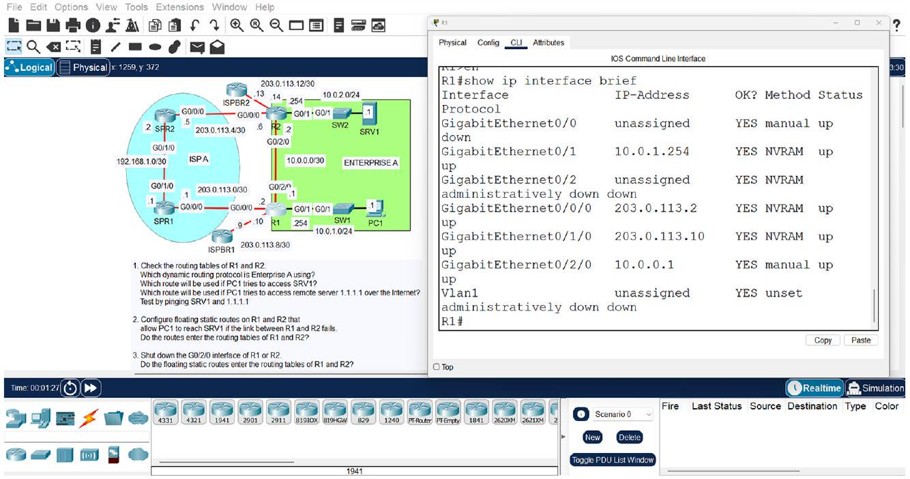

---
tags:
  - acting-ccna
  - blue-note
  - info-block
  - ccna-v1
source: "[[01_紅色良品筆記_資訊源/CCNA-V1-CH2-15_red_note]]"
version: "0.0.1"
created: 2026-08-10
---

# 1.4.3-4 Packet Tracer 最適合 CCNA 練習

> [!info] 藍色良品筆記：資訊塊
> 本筆記由紅色資訊源 [[01_紅色良品筆記_資訊源/CCNA-V1-CH2-15_red_note#1.4.3-4 Packet Tracer 最適合 CCNA 練習|1.4.3-4 Packet Tracer 最適合 CCNA 練習]] 拆出。

## 原文內容

These reasons are why I think Cisco Packet Tracer is the best option for CCNA lab practice. Whereas CML is a network emulator that uses virtual machines to run real Cisco IOS, Packet Tracer is a network simulator. It is software that simulates the function of Cisco network devices but does not actually run real Cisco IOS. This makes Packet Tracer very lightweight-you do not need a powerful computer to run even very large simulated networks. Best of all, it's free. I'm all for investing money in your studies when necessary (I'm certainly glad you invested in this book!), but when a tool like Packet Tracer is available for free, it's hard to argue against it. Figure 1.2 shows a screenshot of a lab in Packet Tracer.

Figure 1.2 A lab in Cisco Packet Tracer. On the left is the network diagram with the lab's instructions below it, and on the right is the CLI of one of the devices in the network.

## 逐句繁體中文翻譯

- 基於這些理由，作者認為 Cisco Packet Tracer 是 CCNA lab practice 的最佳選項。
- CML 是 network emulator，使用 virtual machines 執行真正的 Cisco IOS；而 Packet Tracer 是 network simulator。
- Packet Tracer 是模擬 Cisco network devices 功能的軟體，但不會真正執行 Cisco IOS。
- 這讓 Packet Tracer 非常輕量，即使模擬很大的網路，也不需要強大的電腦。
- 最棒的是，它是免費的。
- 作者支持在必要時為學習投資金錢，但當 Packet Tracer 這種工具免費可用時，很難反對使用它。
- Figure 1.2 顯示 Packet Tracer 中一個 lab 的截圖。
