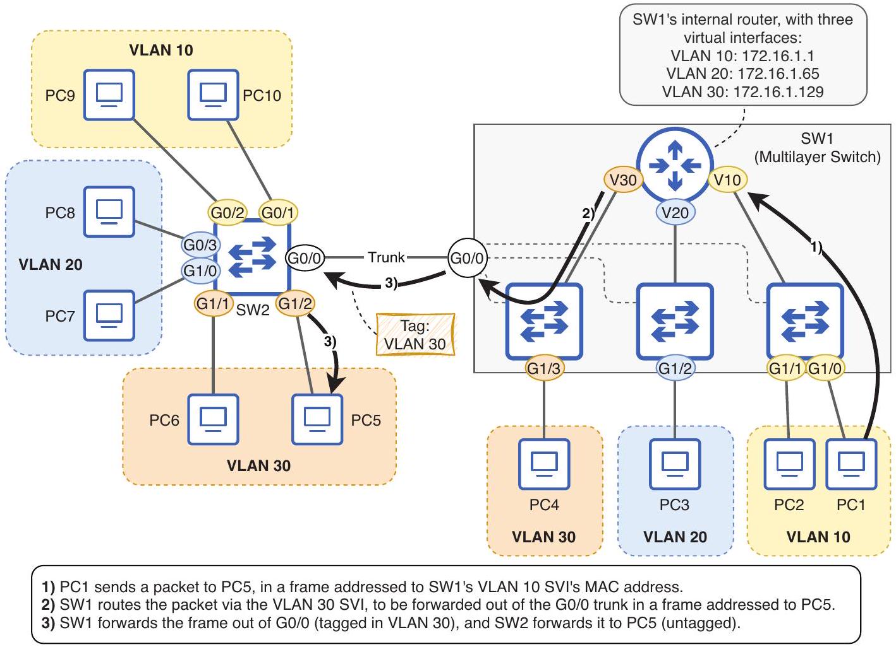

# Multilayer Switch

tags: #concept #acting-ccna #switching #routing #vlan

## Definition

Multilayer Switch 是能同時執行 Layer 2 switching 與 Layer 3 routing 的 switch。

## Why It Exists

在 campus/LAN 內，不同 VLAN 間常需要快速 routing。Multilayer switch 可在 switch 內部完成 inter-VLAN routing，而不必依賴外接 router。

## Prerequisites

- [[Switch]]
- [[Routing Table]]
- [[VLAN]]

## Related Concepts

- [[12.4-Multilayer-Switching-Packet-Flow]]
- [[Switch Virtual Interface]]
- [[Routed Port]]
- [[Inter-VLAN Routing]]

## Mechanism

啟用 `ip routing` 後，multilayer switch 可用 SVIs 代表各 VLAN 的 default gateway，並在 routing table 中加入 connected/local routes。

## Source Figures

*Source: [[00_Source/Chapter 12 - VLAN]], Figure 12.11 — Multilayer switch SW1 routes internally between VLANs using SVIs.*

## Appears In

- [[02_Source_Notes/Unit05-SubVLAN|Unit05：Subnetting 與 VLAN]]
