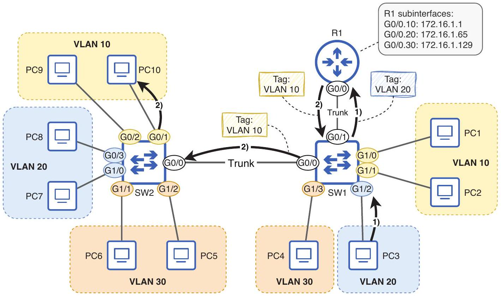

# Router on a Stick

tags: #concept #acting-ccna #vlan #routing

## Aliases

- ROAS

## Definition

Router on a Stick 是一種 inter-VLAN routing 方法：router 用單一 physical interface 連接 trunk link，並透過多個 subinterfaces 分別服務不同 VLAN。

## Why It Exists

若每個 VLAN 都用一條 router physical interface，會消耗大量 router ports 與線材。ROAS 用一條 trunk link 承載多個 VLAN，讓 router 仍可在 VLAN 間 routing。

## Prerequisites

- [[Inter-VLAN Routing]]
- [[Trunk Port]]
- [[IEEE 802.1Q Tag]]
- [[Subinterface]]

## Related Concepts

- [[12.4-Router-on-a-Stick-Packet-Flow]]
- [[Native VLAN]]
- [[Default Gateway]]

## Mechanism

Router physical interface 被分成多個 subinterfaces；每個 subinterface 設定 `encapsulation dot1q <vlan-id>` 與該 VLAN/subnet 的 IP address，作為該 VLAN 的 default gateway。

## Source Figures

*Source: [[00_Source/Chapter 12 - VLAN]], Figure 12.10 — Router on a stick uses R1 subinterfaces over a trunk link for inter-VLAN routing.*

## Appears In

- [[02_Source_Notes/Unit05-SubVLAN|Unit05：Subnetting 與 VLAN]]
