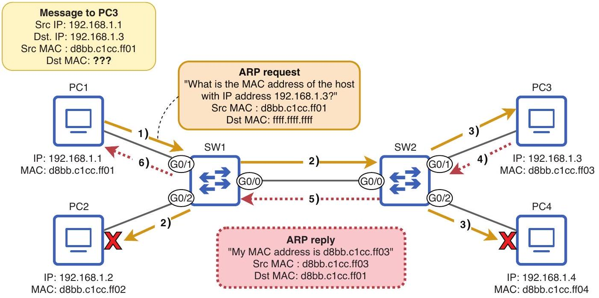

# Address Resolution Protocol

tags: #concept #acting-ccna #arp #layer2 #layer3

## Aliases

- ARP

## Definition

Address Resolution Protocol 是用已知 [[IPv4 Address]] 查詢對應 [[MAC Address]] 的協定。

## Why It Exists

主機要把 Layer 3 packet 封裝進 Ethernet frame 時，需要知道 next-hop 或目的主機的 MAC address；ARP 提供 IP-to-MAC mapping。

## Prerequisites

- [[IPv4 Address]]
- [[MAC Address]]
- [[Broadcast Frame]]
- [[Unicast Frame]]

## Related Concepts

- [[ARP Table]]
- [[Frame Flooding]]
- [[Data Link Layer]]
- [[Network Layer]]

## Mechanism

ARP request 使用 broadcast frame 詢問「誰有這個 IP？」；擁有該 IP 的 host 回覆 unicast ARP reply，告知自己的 MAC address。

## Source Figures

*Source: [[00_Source/Chapter 6 - Ethernet LAN 交換|Chapter 6 - Ethernet LAN 交換]], Figure 6.6 — PC1 sends an ARP request for PC3's MAC address and receives an ARP reply.*

## Appears In

- [[02_Source_Notes/Unit03-CLI-Eth-IPV4|Unit03：CLI、Ethernet Switching 與 IPv4]]

## Questions

- 為什麼 ARP 可以被視為 Layer 2 與 Layer 3 之間的橋？

## Unit04 Additions

- Unit04 extends ARP from same-LAN host lookup to next-hop MAC resolution.
- A host ARPs for its [[Default Gateway]] when sending to a remote network.
- A router may ARP for the [[Next Hop]] router or final destination host while forwarding a packet during [[Packet Life Cycle]].
- [[Proxy ARP]] can appear when a router answers an ARP request on behalf of another destination it knows how to reach.

## Additional Appears In

- [[02_Source_Notes/Unit4-RouterSwitch-Packet|Unit04：Router / Switch 介面、路由與封包生命週期]]
