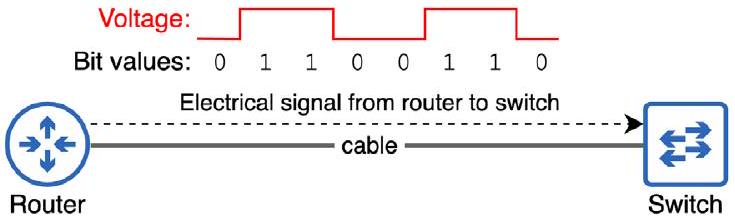
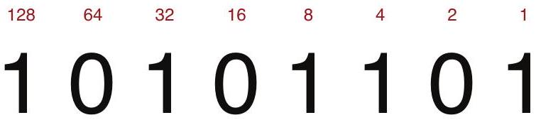

# Bit and Byte

tags: #concept #acting-ccna #network-fundamentals

## Aliases

- bit
- byte
- binary digit
- 位元與位元組

## Definition

Bit 是電腦使用的最基本資訊單位，來自 binary digit。Byte 是 8 個 bits。

## Why It Exists

電腦以 binary（0 與 1）運算與通訊，因此理解 bits 是理解網路傳輸與速度單位的基礎。

## Related Concepts

- [[Ethernet]]
- [[Network Standard]]
- [[Physical Layer]]
- [[Encapsulation and De-encapsulation]]
- [[Binary Number System]]
- [[Octet]]

## Mechanism

```text
Binary values
  ↓ represented as
Bits: 0 / 1
  ↓ grouped into
Bytes: 8 bits
```

## Important Notes

- 網路速度以 bits per second 衡量。
- CCNA 中常用 1 kilobit = 1,000 bits。
- base-2 的 1,024 values 使用 kibibit、mebibit、gibibit、tebibit 等術語。
- Unit03 / Chapter 7 使用 8-bit binary conversion 作為理解 [[IPv4 Address]] 與 [[Octet]] 的前置技能。

## Source Figures


*Source: [[00_Source/Chapter 3 - 線材、接頭與連接埠|Chapter 3 - 線材、接頭與連接埠]], Figure 3.1 — A router sends 1 byte of data to a switch; voltage changes indicate values of 0 or 1.*


*Source: [[00_Source/Chapter 7 - IPv4 位址|Chapter 7 - IPv4 位址]], Figure 7.4 — An 8-bit number showing bit position values used for IPv4 octet conversion.*

## Appears In

- [[02_Source_Notes/Unit01-設備-線材|Unit01：設備與線材]]
- [[02_Source_Notes/Unit02-TCPIP-網路模型|Unit02：TCP/IP 網路模型]]
- [[02_Source_Notes/Unit03-CLI-Eth-IPV4|Unit03：CLI、Ethernet Switching 與 IPv4]]

## Questions

- 為什麼網路速度通常用 bits per second，而檔案大小常用 bytes？
