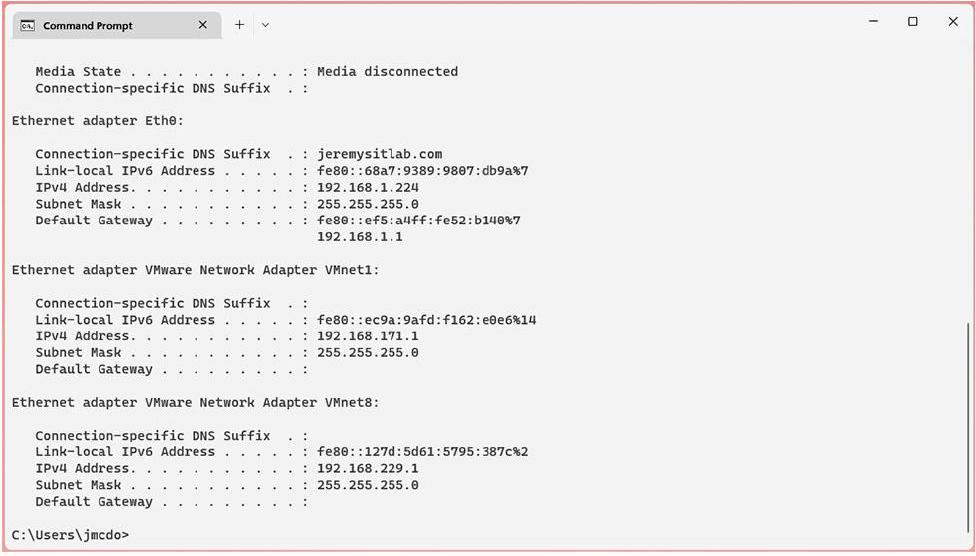

# Cisco IOS CLI

tags: #concept #acting-ccna #cli

## Aliases

- IOS CLI
- Cisco command-line interface

## Definition

Cisco IOS CLI 是 Cisco router / switch 上用文字命令操作、設定與驗證設備的介面。

## Why It Exists

CCNA 不只要求理解網路概念，也要求能 configure and verify；CLI 就是把概念落到設備行為的主要入口。

## Related Concepts

- [[Cisco IOS Command Mode]]
- [[Console Port]]
- [[Terminal Emulator]]
- [[IOS Configuration File]]

## Mechanism

使用者輸入命令並按 Enter，Cisco IOS 依目前所在的 command mode 判斷該命令是否可用，以及是否會查看狀態、執行操作或修改設定。

## Source Figures

*Source: [[00_Source/Chapter 5 - Cisco IOS CLI|Chapter 5 - Cisco IOS CLI]], Figure 5.2 — Windows Command Prompt CLI example, used to introduce text-based command interaction.*

## Appears In

- [[02_Source_Notes/Unit03-CLI-Eth-IPV4|Unit03：CLI、Ethernet Switching 與 IPv4]]

## Questions

- 為什麼 CCNA 需要同時學理論與 CLI configure / verify？

