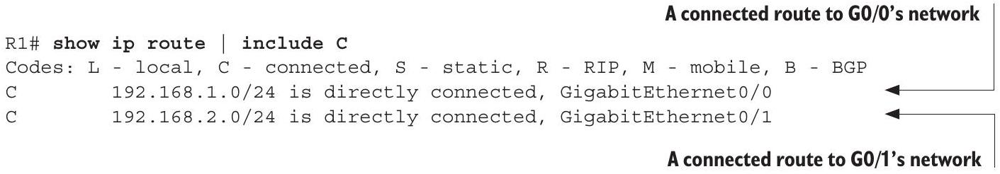

# Connected Route

tags: #concept #acting-ccna #routing

## Definition

Connected Route 是 router 因為某個 interface 直接連接到某個 network，而自動加入 routing table 的 route。

## Why It Exists

Router 需要知道哪些 networks 是自己直接連到的，才能直接把 packet 從相應 interface 送出。

## Prerequisites

- [[Network Interface]]
- [[IPv4 Address]]
- [[Routing Table]]

## Related Concepts

- [[Local Route]]
- [[Exit Interface]]
- [[Route Selection]]

## Mechanism

當 router interface 設定 IP address、啟用且 line protocol up，IOS 會加入 connected route。該 route 指向整個 connected network。

## Source Figures

*Source: [[00_Source/Chapter 9 - 路由基礎]], Section Connected routes — Routing table showing directly connected networks and their interfaces.*

## Appears In

- [[02_Source_Notes/Unit4-RouterSwitch-Packet|Unit04：Router / Switch 介面、路由與封包生命週期]]
