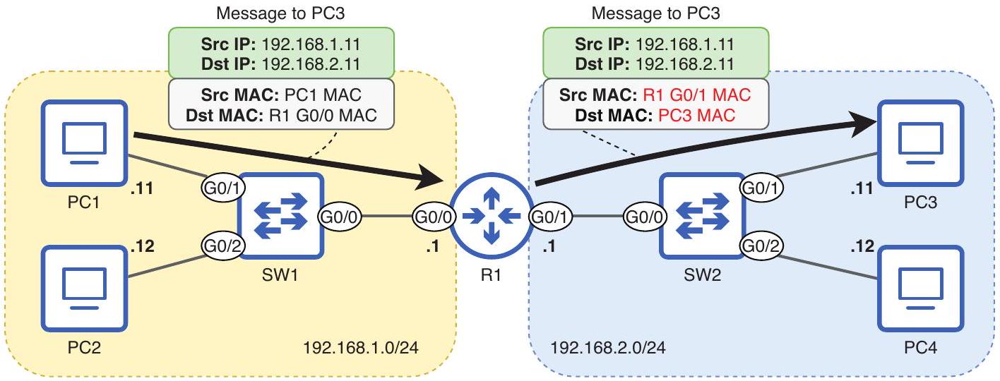
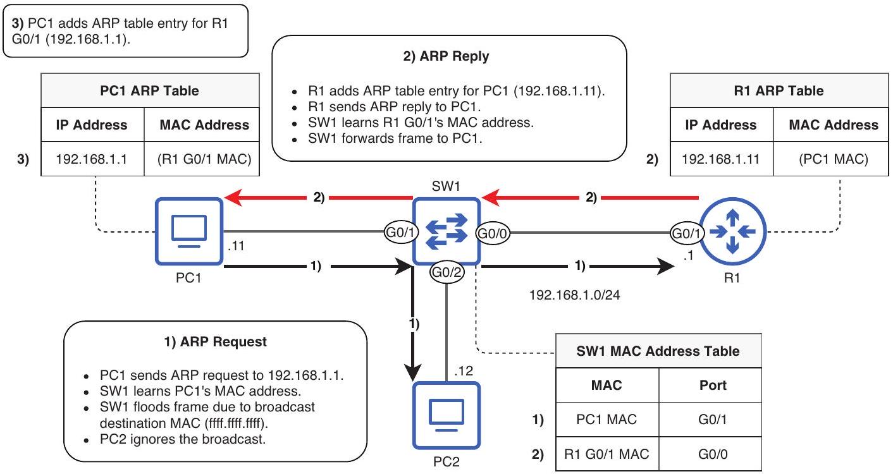

# Default Gateway

tags: #concept #acting-ccna #routing #ipv4

## Definition

Default Gateway 是 host 用來把 traffic 送往遠端 network 的 router IP address。

## Why It Exists

Host 通常只直接知道本地 network；當目的 IP 不在同一網段時，host 需要把 packet 交給本地 router 代為 forwarding。

## Prerequisites

- [[IPv4 Address]]
- [[Network Portion and Host Portion]]
- [[Address Resolution Protocol]]

## Related Concepts

- [[Router]]
- [[Next Hop]]
- [[Packet Life Cycle]]
- [[ARP Table]]

## Mechanism

Host 會 ARP default gateway 的 MAC address，然後把目的 IP 為遠端 host 的 packet 封裝進 destination MAC 為 default gateway MAC 的 Ethernet frame。

## Source Figures

*Source: [[00_Source/Chapter 9 - 路由基礎]], Figure 9.2 — PC1 sends a remote-network packet in a frame addressed to its default gateway's MAC address.*

*Source: [[00_Source/Chapter 10 - 封包的一生]], Figure 10.2 — PC1 uses ARP to learn R1 G0/1's MAC address before sending to a remote host.*

## Appears In

- [[02_Source_Notes/Unit4-RouterSwitch-Packet|Unit04：Router / Switch 介面、路由與封包生命週期]]

## Questions

- 為什麼 PC1 送往遠端 PC3 時，Ethernet frame 的 destination MAC 是 R1，而不是 PC3？

## Unit05 Additions

- In VLAN designs, each VLAN/subnet normally needs a default gateway.
- The default gateway can be a router physical interface, a [[Subinterface]] in [[Router on a Stick]], or a [[Switch Virtual Interface]] on a [[Multilayer Switch]].

## Additional Appears In

- [[02_Source_Notes/Unit05-SubVLAN|Unit05：Subnetting 與 VLAN]]
