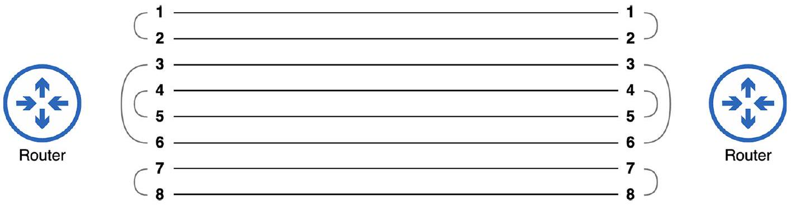
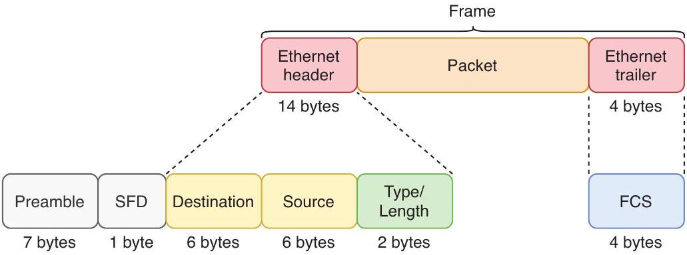

# Ethernet

tags: #concept #acting-ccna #network-fundamentals #layer2

## Aliases

- IEEE 802.3
- 乙太網路

## Definition

Ethernet 是由 IEEE 802.3 working group 定義的一組標準家族，定義實體有線連線與資料如何格式化並透過網路傳送。

## Why It Exists

Ethernet 讓不同設備能用共同標準在現代有線網路中通訊。

## Prerequisites

- [[Network Standard]]
- [[Bit and Byte]]

## Related Concepts

- [[Switch]]
- [[LAN]]
- [[UTP Cable]]
- [[Fiber Optic Cable]]
- [[Straight-through and Crossover Cable]]
- [[Physical Layer]]
- [[Data Link Layer]]
- [[Protocol]]
- [[Ethernet Frame]]
- [[EtherType]]
- [[Frame Check Sequence]]
- [[MAC Address Table]]

## Mechanism

本 Unit 提到 Ethernet 同時包含：

- physical wired connections；
- rules for communicating over those connections。

## Contrast

Ethernet 不是單一線材，也不只是俗稱的「Ethernet cable」；它是一組標準家族。

## Later Additions

- 在 Unit02 中，Ethernet 可被放進分層模型理解：它同時牽涉 [[Physical Layer]] 的實體傳輸，以及 [[Data Link Layer]] 的 frame 與 hop-by-hop 傳遞。
- Chapter 4 只建立 Ethernet 與 TCP/IP model 的位置關係；Ethernet switching 的細節仍留待 Chapter 6。
- Unit03 / Chapter 6 將 Ethernet 具體化為 [[Ethernet Frame]] 結構，以及 switch 如何使用 frame header 的 MAC address 做 LAN switching。

## Source Figures

*Source: [[00_Source/Chapter 3 - 線材、接頭與連接埠|Chapter 3 - 線材、接頭與連接埠]], Figure 3.2 — 8P8C ports and connector used for copper UTP Ethernet connections.*

*Source: [[00_Source/Chapter 3 - 線材、接頭與連接埠|Chapter 3 - 線材、接頭與連接埠]], Figure 3.7 — Pin and wire pairs used on 1000BASE-T and 10GBASE-T connections.*

*Source: [[00_Source/Chapter 6 - Ethernet LAN 交換|Chapter 6 - Ethernet LAN 交換]], Figure 6.2 — Ethernet frame header/trailer fields used by switches and receiving hosts.*

## Appears In

- [[02_Source_Notes/Unit01-設備-線材|Unit01：設備與線材]]
- [[02_Source_Notes/Unit02-TCPIP-網路模型|Unit02：TCP/IP 網路模型]]
- [[02_Source_Notes/Unit03-CLI-Eth-IPV4|Unit03：CLI、Ethernet Switching 與 IPv4]]

## REVIEW

- 集中 REVIEW 紀錄：[[06_review/Unit01-設備-線材 REVIEW|Unit01-設備-線材 REVIEW]]
