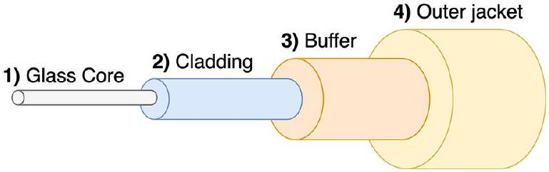
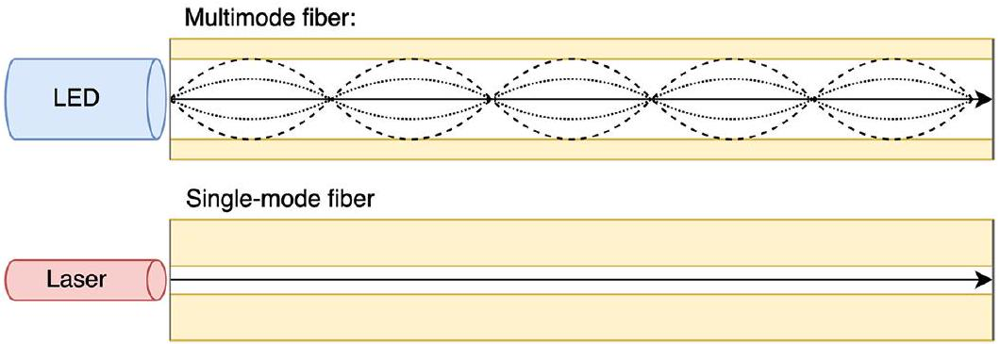

# Fiber Optic Cable

tags: #concept #acting-ccna #network-fundamentals #cabling

## Aliases

- Fiber
- 光纖線

## Definition

Fiber Optic Cable 是沿著玻璃纖維傳送光訊號的線材。

## Why It Exists

Fiber 提供比 copper UTP 更長距離的連線能力，適合跨樓層、跨建築或網路基礎設施設備之間的連線。

## Prerequisites

- [[Ethernet]]
- [[SFP Transceiver]]

## Related Concepts

- [[UTP Cable]]
- [[MMF and SMF]]
- [[Switch]]
- [[Router]]
- [[Physical Layer]]

## Mechanism

- 通常使用兩條線：一條傳送，一條接收。
- 一端的 transmitter 必須接到另一端的 receiver。
- 光沿著 glass core 傳遞，cladding 協助反射光訊號。

## Contrast With

- [[UTP Cable]]：UTP 成本較低、端點常用；Fiber 距離更遠、成本較高。

## Limitations

- 急彎可能損壞玻璃纖維或造成光洩漏，導致訊號變弱。
- 成本較高，主要原因之一是 [[SFP Transceiver]] 昂貴。

## Source Figures

*Source: [[00_Source/Chapter 3 - 線材、接頭與連接埠|Chapter 3 - 線材、接頭與連接埠]], Figure 3.8 — A Cisco switch with an SFP transceiver inserted into one of its SFP ports; an additional SFP is placed on top of the switch.*

*Source: [[00_Source/Chapter 3 - 線材、接頭與連接埠|Chapter 3 - 線材、接頭與連接埠]], Figure 3.9 — The typical structure of a fiber-optic cable, including outer jacket, buffer, cladding, and glass core.*

*Source: [[00_Source/Chapter 3 - 線材、接頭與連接埠|Chapter 3 - 線材、接頭與連接埠]], Figure 3.10 — Light travels down an MMF cable at multiple angles, whereas light travels down SMF cables at a single angle.*

## Appears In

- [[02_Source_Notes/Unit01-設備-線材|Unit01：設備與線材]]
- [[02_Source_Notes/Unit02-TCPIP-網路模型|Unit02：TCP/IP 網路模型]]
