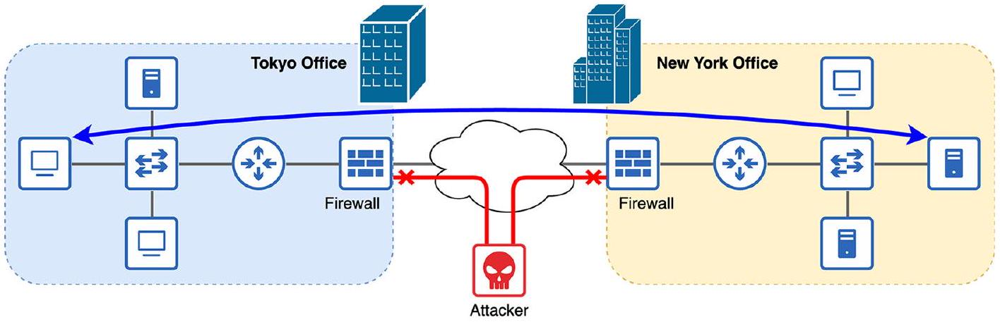

# Firewall

tags: #concept #acting-ccna #security #network-fundamentals

## Aliases

- Network Firewall
- 防火牆

## Definition

Firewall 是檢查進出網路流量，並根據設定規則允許或拒絕流量的設備。

## Why It Exists

當 LAN 連到 Internet 這類公共網路時，也暴露於潛在安全風險；Firewall 用來降低這些風險。

## Related Concepts

- [[Router]]
- [[LAN]]
- [[WAN]]

## Contrast

- Host-based firewall：在單一主機上檢查該主機流量。
- Network firewall：獨立硬體設備，檢查整個網路的進出流量。

## Mechanism

```text
Traffic entering / exiting network
  ↓ inspected by
Firewall rules
  ↓
Allow or deny
```

## Source Figures


*Source: [[00_Source/Chapter 2 - 網路設備|Chapter 2 - 網路設備]], Figure 2.6 — A firewall between each LAN and the internet secures the network by allowing legitimate communication and denying malicious traffic.*

## Appears In

- [[02_Source_Notes/Unit01-設備-線材|Unit01：設備與線材]]

## REVIEW

- 集中 REVIEW 紀錄：[[06_review/Unit01-設備-線材 REVIEW|Unit01-設備-線材 REVIEW]]
