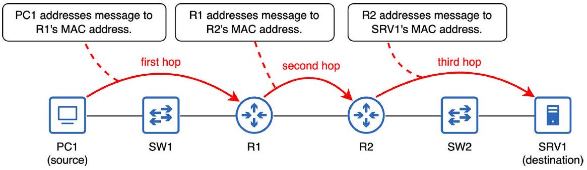

# Hop

tags: #concept #acting-ccna #network-fundamentals

## Aliases

- network hop

## Definition

Hop is the journey from one node in the network to the next node in the path toward the final destination.

## Why It Exists

Hop 讓我們區分 Layer 2 的 next-hop delivery 與 Layer 3 的 end-to-end delivery。

## Prerequisites

- [[Node]]
- [[Data Link Layer]]

## Related Concepts

- [[MAC Address]]
- [[Router]]
- [[Switch]]
- [[Forwarding]]

## Mechanism

In Chapter 4, PC1 to SRV1 takes three hops: PC1 → R1, R1 → R2, and R2 → SRV1. A message traveling through a switch does not count as a hop in this explanation.

## Source Figures

*Source: [[00_Source/Chapter 4 - TCP IP 網路模型|Chapter 4 - TCP IP 網路模型]], Figure 4.2 — PC1's message to SRV1 takes three hops through the network.*

## Appears In

- [[02_Source_Notes/Unit02-TCPIP-網路模型|Unit02：TCP/IP 網路模型]]
