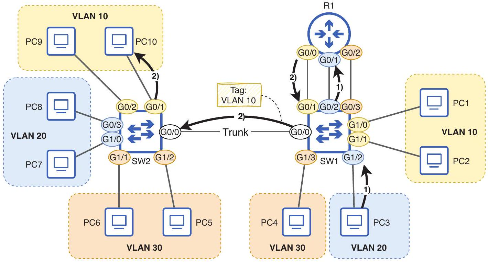

# Inter-VLAN Routing

tags: #concept #acting-ccna #vlan #routing

## Definition

Inter-VLAN Routing 是讓不同 VLAN / subnets 之間透過 Layer 3 device 通訊的機制。

## Why It Exists

VLAN 在 Layer 2 分隔 broadcast domains；不同 VLAN 的 hosts 不能直接互相 forward frames，因此需要 router 或 multilayer switch 進行 Layer 3 routing。

## Prerequisites

- [[VLAN]]
- [[Default Gateway]]
- [[Routing Table]]
- [[Subnetting]]

## Related Concepts

- [[Router on a Stick]]
- [[Subinterface]]
- [[Multilayer Switch]]
- [[Switch Virtual Interface]]
- [[Routed Port]]

## Mechanism

Host 將遠端 VLAN/subnet 的 packet 送給自己的 default gateway；Layer 3 device route packet，並把它重新封裝到目標 VLAN 的 Ethernet frame 中。

## Source Figures

*Source: [[00_Source/Chapter 12 - VLAN]], Figure 12.9 — Inter-VLAN routing using separate router interfaces for each VLAN/subnet.*

## Appears In

- [[02_Source_Notes/Unit05-SubVLAN|Unit05：Subnetting 與 VLAN]]
