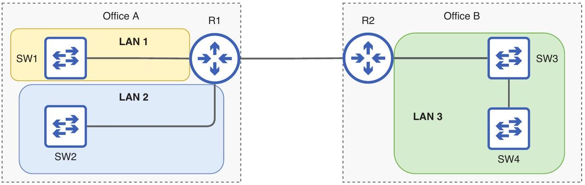

# Layer 2 Domain

tags: #concept #acting-ccna #layer2 #lan

## Definition

Layer 2 Domain 是 frames 可以被 switches 轉送，且 hosts 不需 router 就能彼此通訊的網路範圍。

## Why It Exists

它用 Layer 2 行為定義 LAN，比單純用地理距離定義 LAN 更精確。

## Related Concepts

- [[LAN]]
- [[Switch]]
- [[Router]]
- [[Broadcast Domain]]
- [[Frame Forwarding]]

## Source Figures

*Source: [[00_Source/Chapter 6 - Ethernet LAN 交換|Chapter 6 - Ethernet LAN 交換]], Figure 6.1 — Office A has two LANs separated by a router; Office B is one LAN because switches are directly connected.*

## Appears In

- [[02_Source_Notes/Unit03-CLI-Eth-IPV4|Unit03：CLI、Ethernet Switching 與 IPv4]]

## Unit05 Additions

- [[VLAN]] is a practical way to create multiple Layer 2 domains on the same physical switch infrastructure.
- [[Trunk Port]] extends multiple Layer 2 domains across a shared inter-switch link using [[IEEE 802.1Q Tag]].

## Additional Appears In

- [[02_Source_Notes/Unit05-SubVLAN|Unit05：Subnetting 與 VLAN]]
