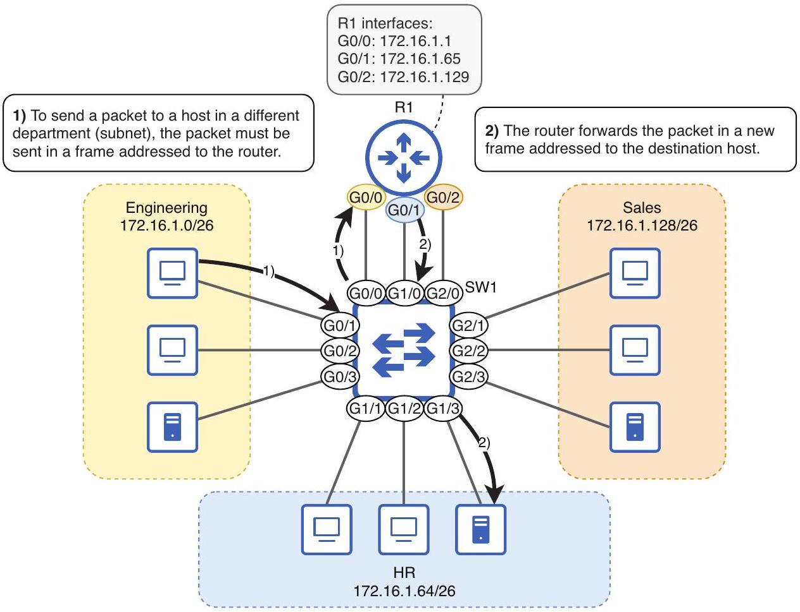

# Layer 3 Segmentation

tags: #concept #acting-ccna #subnetting #layer3

## Definition

Layer 3 Segmentation 是用 IP subnets / routing boundaries 將網路切成多個 Layer 3 networks。

## Why It Exists

不同部門或區域若使用不同 subnets，跨 subnet traffic 必須經過 router 或 Layer 3 device，才有機會被 routing/security policy 控制。

## Related Concepts

- [[Subnetting]]
- [[VLAN]]
- [[Inter-VLAN Routing]]
- [[Default Gateway]]

## Source Figures

*Source: [[00_Source/Chapter 12 - VLAN]], Figure 12.2 — A LAN segmented into three subnets, one per department.*

## Appears In

- [[02_Source_Notes/Unit05-SubVLAN|Unit05：Subnetting 與 VLAN]]
