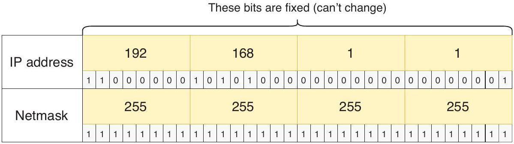

# Local Route

tags: #concept #acting-ccna #routing

## Definition

Local Route 是代表 router interface 自己 IP address 的 route，通常以 /32 prefix 出現在 routing table。

## Why It Exists

它讓 router 明確識別「送到這個 interface 自己 IP」的 traffic，而不是把它視為整個 connected network 的一般 host traffic。

## Prerequisites

- [[Connected Route]]
- [[Routing Table]]
- [[Prefix Length]]

## Related Concepts

- [[IPv4 Address]]
- [[Route Selection]]

## Mechanism

設定 interface IP 後，IOS 會為 connected network 建立 connected route，也會為 interface 自己的 IP 建立 local /32 route。

## Source Figures

*Source: [[00_Source/Chapter 9 - 路由基礎]], Figure 9.5 — R1 G0/0 IP address represented as a /32 local route.*

## Appears In

- [[02_Source_Notes/Unit4-RouterSwitch-Packet|Unit04：Router / Switch 介面、路由與封包生命週期]]
