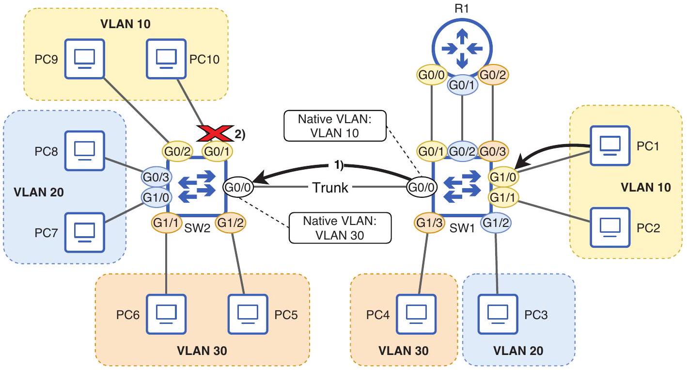

# Native VLAN Mismatch

tags: #concept #acting-ccna #vlan #troubleshooting

## Definition

Native VLAN Mismatch 是 trunk link 兩端設定不同 native VLAN 的錯誤狀態。

## Why It Exists

因為 native VLAN frames 通常不帶 802.1Q tag，接收端只能依本地 trunk port 的 native VLAN 設定判斷 untagged frame 屬於哪個 VLAN；兩端不一致會讓 traffic 被放進錯誤 VLAN。

## Prerequisites

- [[Native VLAN]]
- [[Trunk Port]]
- [[VLAN]]

## Related Concepts

- [[IEEE 802.1Q Tag]]
- [[Interface Error]]

## Mechanism

若 SW1 native VLAN 是 10，SW2 native VLAN 是 30，SW1 送出的 VLAN 10 untagged frame 到 SW2 後會被 SW2 當作 VLAN 30 traffic，導致 frame 無法到正確目的地。

## Source Figures

*Source: [[00_Source/Chapter 12 - VLAN]], Figure 12.8 — Native VLAN mismatch causes untagged frames to be assigned to the wrong VLAN.*

## Appears In

- [[02_Source_Notes/Unit05-SubVLAN|Unit05：Subnetting 與 VLAN]]
