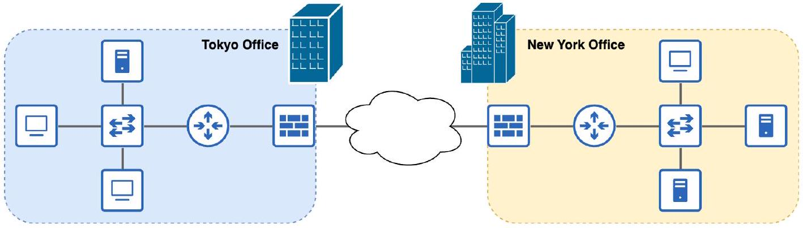

# Node

tags: #concept #acting-ccna #network-fundamentals

## Aliases

- 節點

## Definition

Node 是任何連接到網路的設備。

## Why It Exists

Node 這個概念讓我們能用同一個詞描述所有參與網路的設備，包含端點設備與網路基礎設施設備。

## Related Concepts

- [[Computer Network]]
- [[Resource]]
- [[End Host]]
- [[Switch]]
- [[Router]]
- [[Firewall]]
- [[Hop]]
- [[Forwarding]]

## Contrast

- [[End Host]]：End Host 通常指進行通訊的端點。
- [[Node]]：範圍更廣，包含端點與 network infrastructure devices。

## Source Figures

*Source: [[00_Source/Chapter 2 - 網路設備|Chapter 2 - 網路設備]], Figure 2.1 — An enterprise network showing multiple node types, including clients, servers, switches, routers, and firewalls.*

## Appears In

- [[02_Source_Notes/Unit01-設備-線材|Unit01：設備與線材]]
- [[02_Source_Notes/Unit02-TCPIP-網路模型|Unit02：TCP/IP 網路模型]]

## Questions

- 為什麼 Router、Switch、Firewall 也可以被視為 Node？
