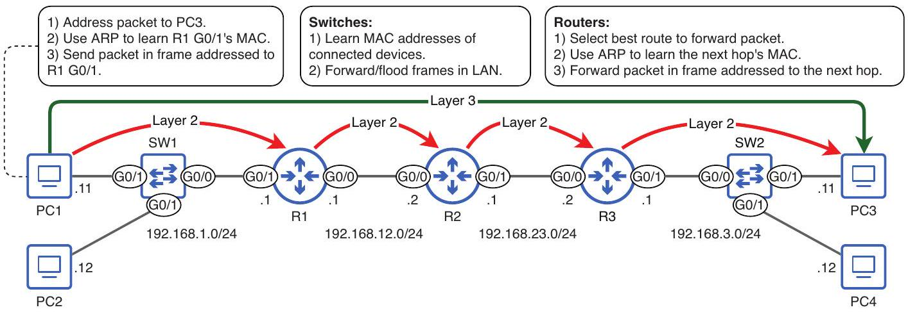
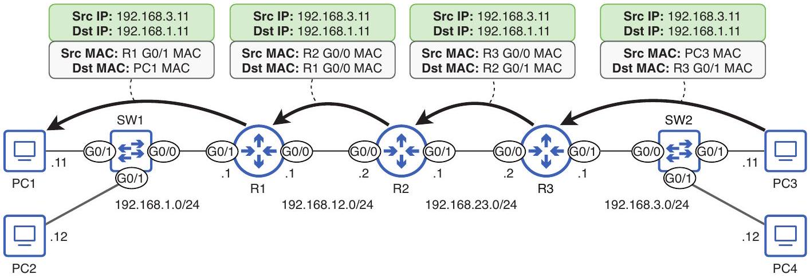

# Packet Life Cycle

tags: #concept #acting-ccna #packet-life-cycle #routing

## Definition

Packet Life Cycle 是 packet 從來源 host 到目的 host 的逐 hop 過程，包含 ARP、封裝、switch forwarding、router route lookup、解封裝與重新封裝。

## Why It Exists

它把 [[Data Link Layer]] 的 hop-to-hop delivery 與 [[Network Layer]] 的 end-to-end delivery 串成一條可排錯的完整路徑。

## Prerequisites

- [[Encapsulation and De-encapsulation]]
- [[Ethernet Frame]]
- [[IPv4 Header]]
- [[Address Resolution Protocol]]
- [[Routing Table]]
- [[Route Selection]]
- [[Default Gateway]]

## Related Concepts

- [[Next Hop]]
- [[Frame Forwarding]]
- [[MAC Address]]
- [[IPv4 Address]]
- [[Time To Live]]

## Mechanism

來源 host 若目的 IP 在遠端 network，會把 packet 放進 destination MAC 為 default gateway 的 frame。每台 router 收到送給自己的 frame 後取出 packet，查 routing table，ARP 下一跳 MAC，再用新的 Layer 2 frame 送出。Layer 3 destination IP 保持不變；Layer 2 MAC addresses 每 hop 改變。

## Source Figures

*Source: [[00_Source/Chapter 10 - 封包的一生]], Figure 10.1 — Summary of actions when PC1 sends a packet to PC3.*

*Source: [[00_Source/Chapter 10 - 封包的一生]], Figure 10.6 — PC3 sends a reply to PC1 using the reverse path process.*

## Appears In

- [[02_Source_Notes/Unit4-RouterSwitch-Packet|Unit04：Router / Switch 介面、路由與封包生命週期]]

## Questions

- 在 PC1 到 PC3 的路徑中，哪些位址保持不變？哪些位址每一 hop 都會改變？
