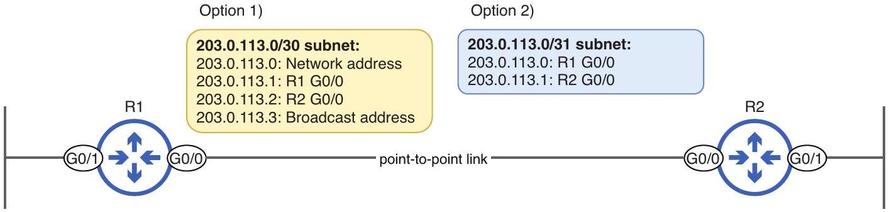
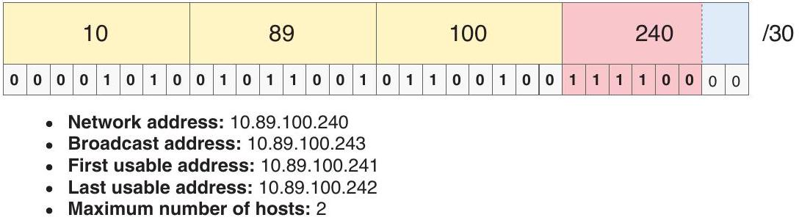

# Point-to-Point Subnet

tags: #concept #acting-ccna #subnetting #wan

## Definition

Point-to-Point Subnet 是用於兩台設備之間 point-to-point link 的 subnet，通常只需要兩個可用 IP addresses。

## Why It Exists

Router-to-router link 通常只需要兩端各一個 IP；使用較小 prefix 可以節省 address space。

## Related Concepts

- [[Subnetting]]
- [[VLSM]]
- [[Usable IPv4 Address Range]]
- [[Network Interface]]

## Mechanism

傳統上常用 /30 提供兩個 usable addresses；現代網路也可在點對點連線使用 /31 以更有效率地使用地址。

## Source Figures

*Source: [[00_Source/Chapter 11 - IPv4 網路子網劃分]], Figure 11.5 — A point-to-point link can use /30 traditionally or /31 in modern networks.*

*Source: [[00_Source/Chapter 11 - IPv4 網路子網劃分]], Figure 11.18 — WAN connection subnet using /30 for two router addresses.*

## Appears In

- [[02_Source_Notes/Unit05-SubVLAN|Unit05：Subnetting 與 VLAN]]

## REVIEW

- /31 的實務與 RFC 細節可在後續 WAN / point-to-point addressing 內容中再補強。
