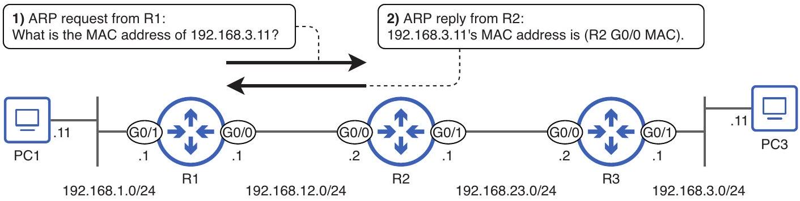

# Proxy ARP

tags: #concept #acting-ccna #arp #routing

## Definition

Proxy ARP 是 router 代表另一個 destination 回覆 ARP request 的行為，前提是 router 的 routing table 中有通往該 destination 的 route。

## Why It Exists

在某些只指定 exit interface 的 static route 情境中，router 可能 ARP 遠端 destination；下一台 router 可用 Proxy ARP 回覆，讓 traffic 得以前進。

## Prerequisites

- [[Address Resolution Protocol]]
- [[Routing Table]]
- [[Static Route]]

## Related Concepts

- [[Exit Interface]]
- [[Fully Specified Static Route]]
- [[Next Hop]]

## Mechanism

Router 只會在自己有 route 可達該 destination 時回覆 proxy ARP；否則會忽略 ARP request。

## Source Figures

*Source: [[00_Source/Chapter 9 - 路由基礎]], Figure 9.10 — Proxy ARP exchange between R1 and R2 when R1 ARPs for PC3's MAC address.*

## Appears In

- [[02_Source_Notes/Unit4-RouterSwitch-Packet|Unit04：Router / Switch 介面、路由與封包生命週期]]

## REVIEW

- 後續可在更完整的 static routing / proxy ARP 單元中確認：考試與實務是否應鼓勵避免依賴 Proxy ARP，改用 next-hop 或 fully specified static route。
