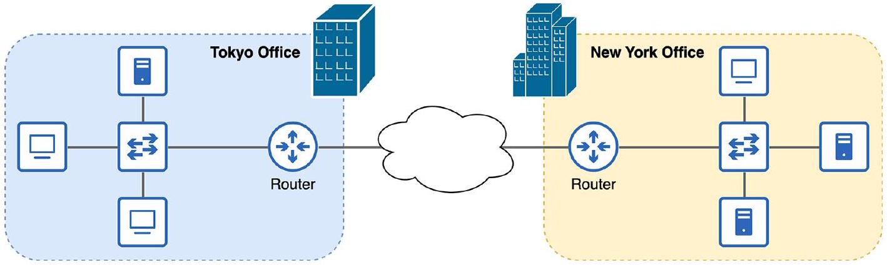

# Router

tags: #concept #acting-ccna #network-fundamentals #layer3

## Aliases

- 路由器

## Definition

Router 是連接不同 LAN 或連接 LAN 與外部網路的設備，例如把辦公室 LAN 連到 Internet。

## Why It Exists

[[Switch]] 解決 LAN 內連通問題，但不負責外部網路連線。當 LAN 要與其他 LAN 或 Internet 通訊時，需要 Router。

## Prerequisites

- [[LAN]]
- [[WAN]]

## Related Concepts

- [[Switch]]
- [[Firewall]]
- [[Fiber Optic Cable]]
- [[Network Layer]]
- [[IP Address]]
- [[Hop]]
- [[Forwarding]]
- [[IPv4 Address]]
- [[IPv4 Header]]
- [[Time To Live]]

## Leads To

- [[IPv4 Address]]
- Routing
- Static routing
- Dynamic routing

## Contrast With

- [[Switch]]：LAN 內連接設備。
- Router：LAN 與外部網路之間的連接。

## Source Figures

*Source: [[00_Source/Chapter 2 - 網路設備|Chapter 2 - 網路設備]], Figure 2.5 — Two LANs connected to the internet via a router at the edge of each LAN.*

*Source: [[00_Source/Chapter 3 - 線材、接頭與連接埠|Chapter 3 - 線材、接頭與連接埠]], Figure 3.4 — Two routers connected via a straight-through cable; communication fails because both routers transmit using the same pin pair.*

*Source: [[00_Source/Chapter 7 - IPv4 位址|Chapter 7 - IPv4 位址]], Figure 7.8 — Router R1 connects two IPv4 networks / LANs with different network portions.*

## Appears In

- [[02_Source_Notes/Unit01-設備-線材|Unit01：設備與線材]]
- [[02_Source_Notes/Unit02-TCPIP-網路模型|Unit02：TCP/IP 網路模型]]
- [[02_Source_Notes/Unit03-CLI-Eth-IPV4|Unit03：CLI、Ethernet Switching 與 IPv4]]

## Questions

- 如果只用 Switch 連接 LAN，為什麼端點仍無法直接上 Internet？

## Unit04 Additions

- [[Router]] uses [[Routing Table]] and [[Route Selection]] to forward packets between networks.
- Router interfaces can create [[Connected Route]] and [[Local Route]] entries when configured and operational.
- During [[Packet Life Cycle]], a router de-encapsulates the incoming [[Ethernet Frame]], examines the [[IPv4 Header]], decrements [[Time To Live]], performs route lookup, resolves the [[Next Hop]] MAC with [[Address Resolution Protocol]] if needed, and re-encapsulates the packet for the next link.

## Additional Appears In

- [[02_Source_Notes/Unit4-RouterSwitch-Packet|Unit04：Router / Switch 介面、路由與封包生命週期]]

## Unit05 Additions

- [[Router]] participates in [[Inter-VLAN Routing]] when traffic must move between VLANs/subnets.
- In [[12.4-Router on a Stick]], one router physical interface can be divided into multiple [[Subinterface]]s, each associated with a VLAN via 802.1Q encapsulation.

## Additional Appears In

- [[02_Source_Notes/Unit05-SubVLAN|Unit05：Subnetting 與 VLAN]]
