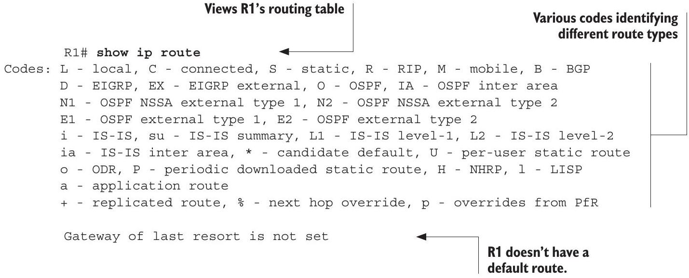
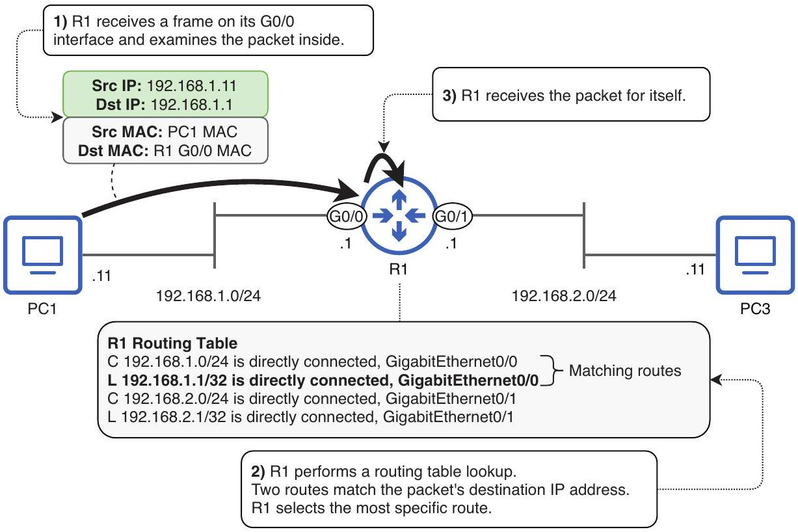

# Routing Table

tags: #concept #acting-ccna #routing

## Definition

Routing Table 是 router 已知目的地與 forwarding 指示的資料庫。

## Why It Exists

Router 需要根據 destination IP address 決定 packet 下一步要往哪裡送；routing table 提供這些決策依據。

## Prerequisites

- [[Router]]
- [[IPv4 Address]]
- [[Network Portion and Host Portion]]

## Related Concepts

- [[Route Selection]]
- [[Connected Route]]
- [[Local Route]]
- [[Static Route]]
- [[Default Route]]
- [[Next Hop]]
- [[Exit Interface]]

## Mechanism

Router 收到送給自己的 frame 後，取出 IPv4 packet，查看 destination IP，並在 routing table 中尋找 matching route。若沒有可用 route，packet 會被 drop。

## Source Figures

*Source: [[00_Source/Chapter 9 - 路由基礎]], Section 9.2.1 — Routing table output after configuring router interfaces.*

*Source: [[00_Source/Chapter 9 - 路由基礎]], Figure 9.6 — R1 receives a packet and selects the best route for that packet.*

## Appears In

- [[02_Source_Notes/Unit4-RouterSwitch-Packet|Unit04：Router / Switch 介面、路由與封包生命週期]]

## Unit05 Additions

- Inter-VLAN routing creates or uses routes between VLAN subnets.
- [[Switch Virtual Interface]]s on a [[Multilayer Switch]] can create connected and local routes in the switch routing table, similar to router interfaces.

## Additional Appears In

- [[02_Source_Notes/Unit05-SubVLAN|Unit05：Subnetting 與 VLAN]]
