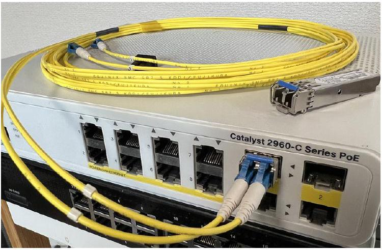

# SFP Transceiver

tags: #concept #acting-ccna #network-fundamentals #cabling

## Aliases

- Small Form-Factor Pluggable
- SFP

## Definition

SFP Transceiver 是插入設備 SFP port 的模組化收發器，用於連接 fiber-optic cables。

## Why It Exists

它讓 Switch 或 Router 等設備可以透過可更換模組支援光纖連線。

## Related Concepts

- [[Fiber Optic Cable]]
- [[MMF and SMF]]
- [[Switch]]
- [[Router]]

## Important Notes

- SFP transceivers 通常需與設備本體分開購買。
- Chapter 3 指出其成本是 Fiber 連線較昂貴的重要原因之一。

## Source Figures

*Source: [[00_Source/Chapter 3 - 線材、接頭與連接埠|Chapter 3 - 線材、接頭與連接埠]], Figure 3.8 — A Cisco switch with an SFP transceiver inserted into one of its SFP ports; an additional SFP is placed on top of the switch.*

## Appears In

- [[02_Source_Notes/Unit01-設備-線材|Unit01：設備與線材]]
