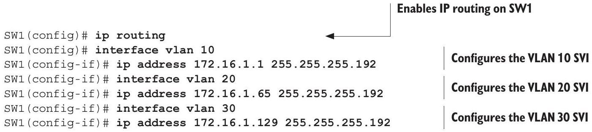
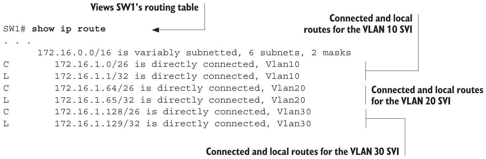

# Switch Virtual Interface

tags: #concept #acting-ccna #svi #vlan #routing

## Aliases

- SVI
- Interface VLAN

## Definition

Switch Virtual Interface 是 multilayer switch 上與某個 VLAN 對應的 virtual Layer 3 interface。

## Why It Exists

SVI 讓 multilayer switch 能為每個 VLAN 提供 default gateway，並在 switch 內部進行 inter-VLAN routing。

## Prerequisites

- [[12.4-Multilayer Switch]]
- [[VLAN]]
- [[IPv4 Address]]
- [[Routing Table]]

## Related Concepts

- [[Inter-VLAN Routing]]
- [[Default Gateway]]
- [[Connected Route]]
- [[Local Route]]

## Mechanism

使用 `interface vlan <vlan-id>` 建立/進入 SVI，再設定 IP address。SVI 要 up/up，相關 VLAN 必須存在，且該 VLAN 需要有 up/up access port 或允許該 VLAN 的 up/up trunk port。

## Source Figures

*Source: [[00_Source/Chapter 12 - VLAN]], Inter-VLAN routing via SVIs — `interface vlan` and SVI IP address configuration.*

*Source: [[00_Source/Chapter 12 - VLAN]], Inter-VLAN routing via SVIs — Routing table entries created for SVIs.*

## Appears In

- [[02_Source_Notes/Unit05-SubVLAN|Unit05：Subnetting 與 VLAN]]

## Questions

- 為什麼 SVI 有 IP address 還不一定會 up/up？
