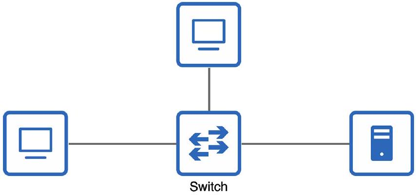
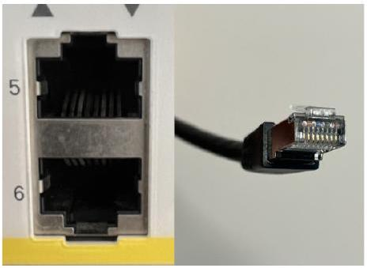
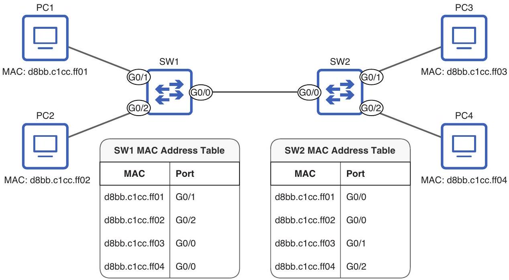

# Switch

tags: #concept #acting-ccna #network-fundamentals #layer2

## Aliases

- Ethernet Switch
- 交換器

## Definition

Switch 是在 [[LAN]] 內連接多個設備的網路基礎設施設備。

## Why It Exists

當網路不再只是兩台設備直連時，需要一種設備讓多個 [[End Host]] 在同一 LAN 內互相通訊。

## Prerequisites

- [[LAN]]
- [[End Host]]
- [[Ethernet]]

## Related Concepts

- [[Router]]
- [[UTP Cable]]
- [[Fiber Optic Cable]]
- [[8P8C Connector]]
- [[Data Link Layer]]
- [[MAC Address]]
- [[Hop]]
- [[MAC Address Table]]
- [[Frame Forwarding]]
- [[Frame Flooding]]
- [[Layer 2 Domain]]

## Contrast With

- [[Router]]：Switch 連接同一 LAN 內設備；Router 連接 LAN 與外部網路或其他 LAN。

## Mechanism

本 Unit 只定義 Switch 的基本角色。Chapter 6 會進一步說明 Switch 如何實際轉送 Ethernet frames。

## Later Additions

- Chapter 4 說明資料通過 [[Switch]] 不計為一個 [[Hop]]；在該範例中，hop 是 PC1 → R1、R1 → R2、R2 → SRV1 這類 Layer 2 forwarding 範圍。
- 為什麼 Switch 不被計為 hop，細節保留到 Chapter 6 的 Ethernet LAN switching。
- Unit03 / Chapter 6 補上原因：switch 對 connected hosts 是 transparent；hosts 直接以彼此的 MAC address 作為 frame destination，switch 不修改 frame，只依 [[MAC Address Table]] forward 或 flood。

## Source Figures

*Source: [[00_Source/Chapter 2 - 網路設備|Chapter 2 - 網路設備]], Figure 2.4 — Three end hosts connected to a switch.*

*Source: [[00_Source/Chapter 3 - 線材、接頭與連接埠|Chapter 3 - 線材、接頭與連接埠]], Figure 3.2 — Two 8P8C ports on a Cisco switch and an 8P8C connector on a copper UTP network cable.*

*Source: [[00_Source/Chapter 6 - Ethernet LAN 交換|Chapter 6 - Ethernet LAN 交換]], Figure 6.3 — Switches learn MAC addresses and associate them with ports in the MAC address table.*

## Appears In

- [[02_Source_Notes/Unit01-設備-線材|Unit01：設備與線材]]
- [[02_Source_Notes/Unit02-TCPIP-網路模型|Unit02：TCP/IP 網路模型]]
- [[02_Source_Notes/Unit03-CLI-Eth-IPV4|Unit03：CLI、Ethernet Switching 與 IPv4]]

## Questions

- 為什麼端點通常不是「跟 Switch 通訊」，而是「透過 Switch 與其他設備通訊」？

## Unit04 Additions

- [[Switch]] creates separate [[Collision Domain]]s per connected host in the Chapter 8 comparison with hubs.
- In Chapter 10 packet life-cycle examples, switches forward ARP and data frames but do not become IP routing hops.
- Switch interface behavior depends on compatible [[Interface Speed]], [[Duplex]], and [[Autonegotiation]] settings.

## Additional Appears In

- [[02_Source_Notes/Unit4-RouterSwitch-Packet|Unit04：Router / Switch 介面、路由與封包生命週期]]

## Unit05 Additions

- Unit05 extends [[Switch]] from basic Layer 2 forwarding into VLAN-aware forwarding.
- A switch can be divided into multiple virtual switches with [[VLAN]], each with its own broadcast domain.
- Switch interfaces can act as [[Access Port]]s or [[Trunk Port]]s; on a [[Multilayer Switch]], they can also relate to [[Switch Virtual Interface]] and [[Routed Port]].

## Additional Appears In

- [[02_Source_Notes/Unit05-SubVLAN|Unit05：Subnetting 與 VLAN]]
