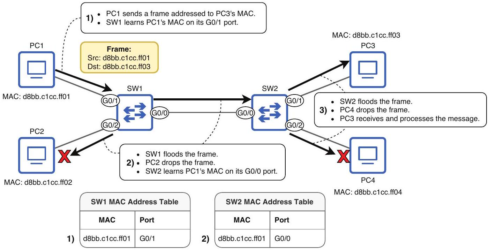

# Unknown Unicast Frame

tags: #concept #acting-ccna #switching #layer2

## Definition

Unknown Unicast Frame 是目的地為單一 host，但 switch 的 [[MAC Address Table]] 中沒有 destination MAC entry 的 frame。

## Why It Exists

它解釋了為什麼 switch 在尚未學到目標 MAC 時必須 flood，而不是直接丟棄 frame。

## Related Concepts

- [[Unicast Frame]]
- [[Known Unicast Frame]]
- [[Frame Flooding]]
- [[MAC Address Table]]

## Source Figures

*Source: [[00_Source/Chapter 6 - Ethernet LAN 交換|Chapter 6 - Ethernet LAN 交換]], Figure 6.4 — PC1 sends a unicast frame to PC3 before switches have learned PC3's MAC address.*

## Appears In

- [[02_Source_Notes/Unit03-CLI-Eth-IPV4|Unit03：CLI、Ethernet Switching 與 IPv4]]

