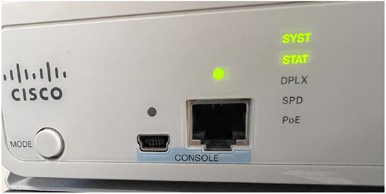

# Console Port

tags: #concept #acting-ccna #cli #management

> [!info] Concept role
> Console Port 是 [[Cisco IOS CLI]] 的本機實體存取入口；它在設備尚未具備 IP reachability 時仍可用，因此值得獨立保留。

## Aliases

- Console
- 控制台連接埠

## Definition

Console Port 是 Cisco network device 上用來直接連接電腦並進入 CLI 的實體管理 port。

## Why It Exists

當設備尚未能透過網路遠端管理，或需要初始設定/故障排除時，console port 提供本機直接管理入口。

## Related Concepts

- [[Cisco IOS CLI]]
- [[Rollover Cable]]
- [[Terminal Emulator]]
- [[Switch]]
- [[Router]]

## Contrast With

- 一般 Ethernet port：用於網路資料傳輸。
- Console Port：用於設備設定與管理，不用來傳一般 network traffic。

## Access Chain

```text
PC → [[Terminal Emulator]] → console cable / [[Rollover Cable]]
   → Console Port → [[Cisco IOS CLI]]
```

## Limitations

- 通常需要人在設備附近或透過額外的 console server 存取。
- Console 連線可用，只證明管理路徑成立，不代表 Ethernet interfaces 或網路服務正常。

## Troubleshooting

- 無輸出：檢查是否選對 serial session／USB device、cable 與 console port。
- 文字亂碼：檢查 terminal serial parameters 是否符合設備 console 設定。
- 能看見輸出但無法操作：檢查鍵盤輸入、session 狀態與設備的 access protection。

## Source Figures


*Source: [[00_Source/Chapter 5 - Cisco IOS CLI|Chapter 5 - Cisco IOS CLI]], Figure 5.3 — USB Mini-B and RJ45 console ports on a Cisco switch.*

## Appears In

- [[02_Source_Notes/Unit03-CLI-Eth-IPV4|Unit03：CLI、Ethernet Switching 與 IPv4]]
