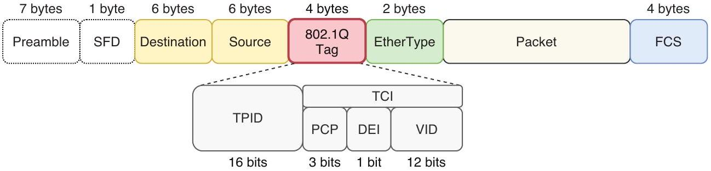

# IEEE 802.1Q Tag

tags: #concept #acting-ccna #vlan #ethernet

> [!info] Concept role
> [[Trunk Port]] 的子概念：在共享 link 上保存 frame 的 VLAN identity。

## Aliases

- 802.1Q
- Dot1Q
- VLAN tag

## Definition

IEEE 802.1Q Tag 是插入 Ethernet frame 中的 4-byte VLAN tag，用來指出 frame 屬於哪個 VLAN。

## Why It Exists

Trunk link 同時承載多個 VLAN；若沒有 tag，接收端無法知道收到的 frame 應歸入哪個 VLAN。

## Prerequisites

- [[Ethernet Frame]]
- [[VLAN]]
- [[Trunk Port]]

## Related Concepts

- [[VLAN ID]]
- [[Native VLAN]]
- [[EtherType]]

## Mechanism

802.1Q tag 插在 Ethernet frame 的 Source 與 EtherType 欄位之間。TPID 通常為 `0x8100`；TCI 包含 PCP、DEI 與 VID，其中 VID 指出 VLAN ID。

插入 tag 會使原始 Ethernet frame 增加 4 bytes，並需要重新計算 Frame Check Sequence。接收 trunk port 依 VID 把 frame 交回對應 VLAN 的 forwarding context；若 VLAN 不在 allowed list，即使 tag 正確也不會通過該 trunk。

## Boundary Condition

[[Native VLAN]] traffic 通常以 untagged frame 傳送，因此不能只靠「是否有 tag」判定 frame 是否來自 trunk。兩端對 native VLAN 的解讀必須一致。

## Source Figures

*Source: [[00_Source/Chapter 12 - VLAN]], Figure 12.6 — Position and fields of the 802.1Q tag inside an Ethernet frame.*

## Appears In

- [[02_Source_Notes/Unit05-SubVLAN|Unit05：Subnetting 與 VLAN]]
