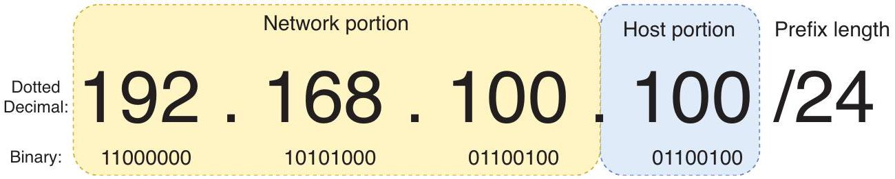
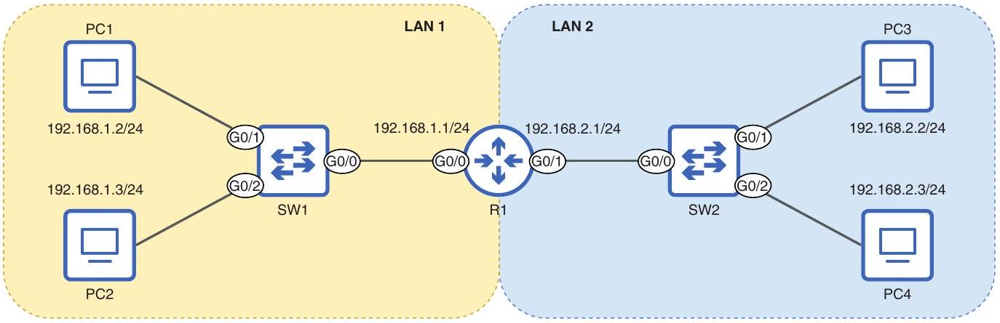

# Network Portion and Host Portion

tags: #concept #acting-ccna #ipv4

> [!info] Concept role
> [[IPv4 Addressing]] 的結構子概念：區分可被 routing 聚合的 network identity 與 subnet 內的 interface identity。

## Definition

Network Portion 是 IPv4 address 中識別 network 的部分；Host Portion 是識別該 network 內特定 host 的部分。

## Why It Exists

這個切分讓 router 能依 network portion 轉送封包，也讓同一 network 內的 hosts 能用 host portion 彼此區分。

## Related Concepts

- [[IPv4 Address]]
- [[Prefix Length]]
- [[Netmask]]
- [[IPv4 Network Address]]
- [[IPv4 Broadcast Address]]
- [[Usable IPv4 Address Range]]

## Mechanism

同一 LAN 中，hosts 通常共享相同 network portion；host portion 必須在該 network 中唯一。

## Source Figures

*Source: [[00_Source/Chapter 7 - IPv4 位址|Chapter 7 - IPv4 位址]], Figure 7.7 — IPv4 address divided into network portion and host portion.*

*Source: [[00_Source/Chapter 7 - IPv4 位址|Chapter 7 - IPv4 位址]], Figure 7.8 — Hosts in LAN 1 share 192.168.1 as network portion; hosts in LAN 2 share 192.168.2.*

## Appears In

- [[02_Source_Notes/Unit03-CLI-Eth-IPV4|Unit03：CLI、Ethernet Switching 與 IPv4]]

## Unit05 Additions

- [[Subnetting#Borrowing Bits|Borrowed Bits]] are originally part of the host portion but become part of the subnet/network portion after subnetting.
- The more host bits are borrowed, the more subnets exist, but fewer host addresses remain in each subnet.

## Additional Appears In

- [[02_Source_Notes/Unit05-SubVLAN|Unit05：Subnetting 與 VLAN]]
