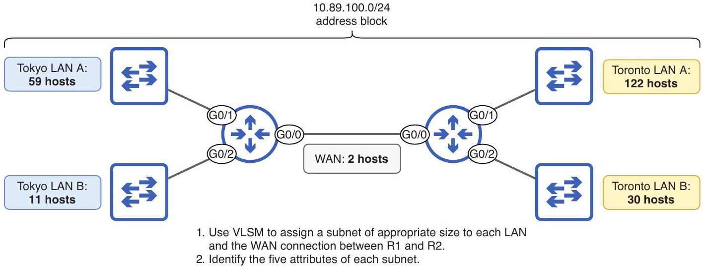
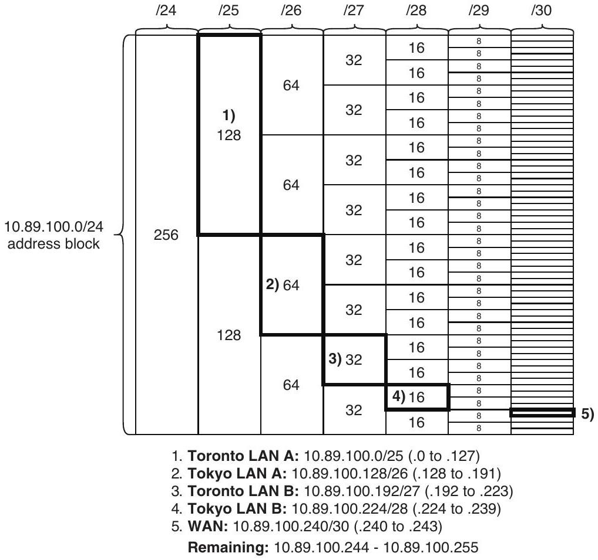

# VLSM

tags: #concept #acting-ccna #subnetting

> [!info] Concept role
> [[Subnetting]] 的需求導向策略：在同一 address plan 中使用不同 prefix lengths。

## Aliases

- Variable-Length Subnet Masking

## Definition

VLSM 是在同一 address block 中建立不同大小 subnets 的 subnetting 方法。

## Why It Exists

實際網路中不同 LAN/WAN 需要的 host 數不同；VLSM 可依需求分配大小，減少 FLSM 造成的 address waste。

## Prerequisites

- [[Subnetting]]
- [[FLSM]]
- [[Subnetting#Five Subnet Attributes|Subnet Five Attributes]]
- [[Usable IPv4 Address Range]]

## Related Concepts

- [[Point-to-Point Subnet]]
- [[VLAN]]

## Mechanism

通常先分配 host 需求最大的 subnet，再依序分配較小 subnets。每個 subnet 都要計算自己的 network address、broadcast address、usable range 與 prefix length。

## Source Figures

*Source: [[00_Source/Chapter 11 - IPv4 網路子網劃分]], Figure 11.12 — VLSM scenario assigning subnets from 10.89.100.0/24 to LANs and a WAN link.*

*Source: [[00_Source/Chapter 11 - IPv4 網路子網劃分]], Figure 11.13 — 10.89.100.0/24 divided into five different-sized subnets.*

## Appears In

- [[02_Source_Notes/Unit05-SubVLAN|Unit05：Subnetting 與 VLAN]]
