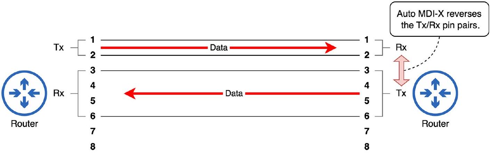

# Auto MDI-X

tags: #concept #acting-ccna #network-fundamentals #cabling

## Aliases

- Auto Medium-Dependent Interface Crossover

## Definition

Auto MDI-X 是讓設備依照對端設備，自動調整用哪些 pins 傳送與接收資料的功能。

## Why It Exists

它降低使用者必須手動判斷 straight-through 或 crossover cable 的負擔。

## Prerequisites

- [[Straight-through and Crossover Cable]]
- [[8P8C Connector]]
- [[UTP Cable]]

## Mechanism

設備可以改變 Tx/Rx pin pair 的使用方式，使原本可能 Tx-to-Tx 的連線變成可通訊。

## Related Concepts

- [[Switch]]
- [[Router]]
- [[Ethernet]]

## Source Figures

*Source: [[00_Source/Chapter 3 - 線材、接頭與連接埠|Chapter 3 - 線材、接頭與連接埠]], Figure 3.6 — Two routers connected via a straight-through cable; the router on the right uses Auto MDI-X to adjust its transmit and receive pins.*

## Appears In

- [[02_Source_Notes/Unit01-設備-線材|Unit01：設備與線材]]

## Questions

- 如果現代設備通常有 Auto MDI-X，為什麼 CCNA 仍要求理解 straight-through 與 crossover？
