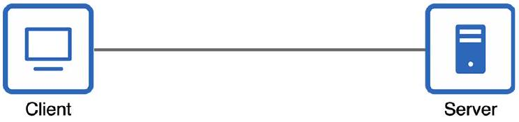
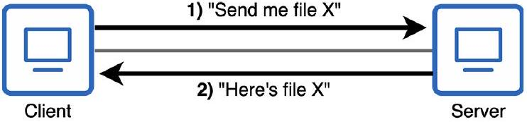

# Client-Server Model

tags: #concept #acting-ccna #network-fundamentals

## Aliases

- Client / Server
- 用戶端／伺服器模型

## Definition

Client 是存取 Server 所提供服務的設備；Server 是為 Client 提供服務的設備。

## Why It Exists

這個模型用角色描述資源如何被提供與使用，而不是用硬體種類描述設備。

## Prerequisites

- [[Node]]
- [[Resource]]

## Related Concepts

- [[End Host]]
- [[Computer Network]]

## Contrast

Client/Server 是角色，不是固定硬體類型。同一台 PC 可以在分享檔案時扮演 Server，也可以在瀏覽網站時扮演 Client。

## Mechanism

```text
Client
  ↓ accesses
Service / Resource
  ↑ provided by
Server
```

## Source Figures


*Source: [[00_Source/Chapter 2 - 網路設備|Chapter 2 - 網路設備]], Figure 2.2 — Icons representing a desktop computer and a file server; these icons represent clients and servers in network diagrams.*


*Source: [[00_Source/Chapter 2 - 網路設備|Chapter 2 - 網路設備]], Figure 2.3 — Two desktop PCs sharing a file; one PC functions as a client and the other as a server.*

## Appears In

- [[02_Source_Notes/Unit01-設備-線材|Unit01：設備與線材]]

## Questions

- 為什麼同一台設備可以同時在不同情境中扮演 Client 與 Server？
